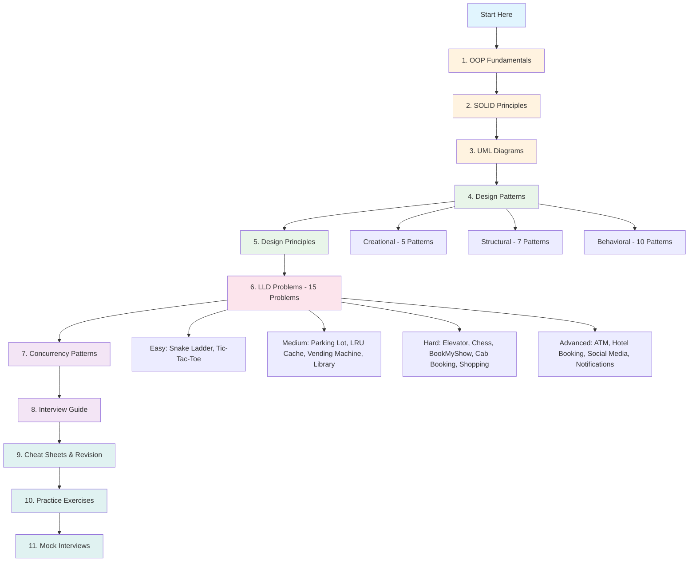

# Low Level Design (LLD) - Complete Study Roadmap

> **93 files | 40 Python files | 53 Markdown docs | 1.7MB | 55,000+ lines**

## What is Low Level Design?

Low Level Design (LLD) — also called **Object-Oriented Design (OOD)** — focuses on the **detailed design of individual components and modules** within a software system. Unlike High Level Design (HLD) which deals with architecture (microservices, databases, load balancers), LLD is about:

- **Class design** — What classes do you need? What are their attributes and methods?
- **Relationships** — How do classes interact? (inheritance, composition, aggregation)
- **Design patterns** — Which proven solutions apply to your problem?
- **Code organization** — How to write clean, maintainable, extensible code

```
┌─────────────────────────────────────────────────────┐
│                   System Design                      │
│                                                      │
│   ┌──────────────────┐    ┌──────────────────────┐  │
│   │  High Level (HLD) │    │   Low Level (LLD)    │  │
│   │                    │    │                      │  │
│   │  - Architecture    │    │  - Class Design      │  │
│   │  - Databases       │    │  - Design Patterns   │  │
│   │  - Load Balancing  │    │  - SOLID Principles  │  │
│   │  - Scalability     │    │  - Code Structure    │  │
│   │  - Caching         │    │  - OOP Concepts      │  │
│   │  - Message Queues  │    │  - UML Diagrams      │  │
│   └──────────────────┘    └──────────────────────┘  │
└─────────────────────────────────────────────────────┘
```

---

## Who Needs This?

| Experience Level | LLD Importance | What to Expect |
|-----------------|---------------|----------------|
| **0-2 years** | Critical | Dedicated LLD round in most companies |
| **2-5 years** | Very High | LLD round + some HLD mixed in |
| **5+ years** | High | Combined HLD+LLD, deeper trade-off discussions |
| **Staff/Principal** | Medium | More HLD, but LLD expected for critical components |

---

## Complete Study Roadmap



---

## Complete Directory Structure

```
LLD/                                          93 files | 1.7MB
│
├── 00-Roadmap/                               ← YOU ARE HERE
│   └── README.md                             Master index & study plan
│
├── 01-OOP-Fundamentals/                      ← START HERE
│   ├── README.md                             Theory: 4 Pillars, Composition vs Inheritance
│   └── code/
│       └── oop_demo.py                       Runnable demo of ALL OOP concepts
│
├── 02-SOLID-Principles/
│   ├── README.md                             All 5 principles with bad/good code
│   └── code/
│       └── solid_demo.py                     Runnable SOLID violations & fixes
│
├── 03-UML-Diagrams/
│   └── README.md                             Class, Sequence, State, Activity, Use Case
│
├── 04-Design-Patterns/                       All 22 GoF Patterns
│   ├── Creational/
│   │   ├── README.md                         Singleton, Factory, Abstract Factory, Builder, Prototype
│   │   └── code/
│   │       ├── singleton.py
│   │       ├── factory_method.py
│   │       ├── abstract_factory.py
│   │       ├── builder.py
│   │       └── prototype.py
│   ├── Structural/
│   │   ├── README.md                         Adapter, Bridge, Composite, Decorator, Facade, Flyweight, Proxy
│   │   └── code/
│   │       ├── adapter.py
│   │       ├── bridge.py
│   │       ├── composite.py
│   │       ├── decorator.py
│   │       ├── facade.py
│   │       ├── flyweight.py
│   │       └── proxy.py
│   └── Behavioral/
│       ├── README.md                         Strategy, Observer, Command, State, Template + 5 more
│       └── code/
│           ├── strategy.py
│           ├── observer.py
│           ├── command.py
│           ├── state.py
│           ├── template_method.py
│           ├── iterator.py
│           ├── chain_of_responsibility.py
│           ├── mediator.py
│           ├── memento.py
│           └── visitor.py
│
├── 05-Design-Principles/
│   └── README.md                             DRY, KISS, YAGNI, GRASP, Law of Demeter, Code Smells
│
├── 06-LLD-Problems/                          15 Complete Problems (README + Runnable Code)
│   ├── Parking-Lot/                          ★ Most commonly asked
│   │   ├── README.md
│   │   └── code/parking_lot.py
│   ├── Elevator-System/                      ★ State pattern showcase
│   │   ├── README.md
│   │   └── code/elevator_system.py
│   ├── LRU-Cache/                            ★ Data structure focused
│   │   ├── README.md
│   │   └── code/lru_cache.py
│   ├── Chess-Game/                           ★ Complex OOP hierarchy
│   │   ├── README.md
│   │   └── code/chess_game.py
│   ├── BookMyShow/                           ★ Concurrency challenges
│   │   ├── README.md
│   │   └── code/booking_system.py
│   ├── Library-Management/                   ★ Classic CRUD system
│   │   ├── README.md
│   │   └── code/library_system.py
│   ├── Vending-Machine/                      ★ State machine design
│   │   ├── README.md
│   │   └── code/vending_machine.py
│   ├── Cab-Booking/                          ★ Real-world system (Uber)
│   │   ├── README.md
│   │   └── code/cab_booking.py
│   ├── Snake-Ladder/                         ★ Game design basics
│   │   ├── README.md
│   │   └── code/snake_ladder.py
│   ├── Online-Shopping/                      ★ E-commerce complexity
│   │   ├── README.md
│   │   └── code/shopping_system.py
│   ├── ATM-Machine/                          ★ Chain of Responsibility
│   │   ├── README.md
│   │   └── code/atm_machine.py
│   ├── Hotel-Booking/                        ★ Pricing strategies
│   │   ├── README.md
│   │   └── code/hotel_booking.py
│   ├── Social-Media/                         ★ Feed generation
│   │   ├── README.md
│   │   └── code/social_media.py
│   ├── Tic-Tac-Toe/                          ★ Extensible NxN design
│   │   ├── README.md
│   │   └── code/tic_tac_toe.py
│   └── Notification-System/                  ★ Pipeline architecture
│       ├── README.md
│       └── code/notification_system.py
│
├── 07-Interview-Guide/
│   └── README.md                             45-min framework, top 50 questions, anti-patterns
│
├── 08-Concurrency-Patterns/
│   ├── README.md                             Thread safety, Producer-Consumer, Deadlocks
│   └── code/
│       └── concurrency_demo.py               Race conditions, locks, thread pool demo
│
├── 09-Cheat-Sheets/                          Quick Reference (7 files)
│   ├── design-patterns-cheat-sheet.md        All 23 patterns on one sheet
│   ├── solid-cheat-sheet.md                  SOLID quick reference
│   ├── uml-cheat-sheet.md                    UML notation reference
│   ├── oop-cheat-sheet.md                    OOP concepts reference
│   ├── lld-interview-cheat-sheet.md          Interview day reference
│   ├── glossary.md                           100+ LLD terms A-Z
│   └── pattern-relationships.md              How patterns connect & evolve
│
├── 10-Practice-Exercises/                    Hands-On Practice (5 files)
│   ├── oop-exercises.md                      Concept Qs, Code Analysis, Design exercises
│   ├── solid-exercises.md                    Identify violations, Refactoring challenges
│   ├── design-pattern-exercises.md           Pattern identification, Implementation tasks
│   ├── lld-problem-exercises.md              10 mini LLD problems (15 min each)
│   └── concurrency-exercises.md              Thread-safe counter, Dining philosophers, etc.
│
├── 11-Real-World-Case-Studies/               How Tech Giants Use Patterns (4 files)
│   ├── netflix-design-patterns.md            Strategy, Observer, Circuit Breaker at Netflix
│   ├── uber-design-patterns.md               Strategy, State, Mediator at Uber
│   ├── amazon-design-patterns.md             Facade, Factory, Chain of Resp at Amazon
│   └── design-patterns-in-frameworks.md      Patterns in Python, Java/Spring, Django, React
│
├── 12-Interview-Mock-Scenarios/              Simulated Interviews (5 files)
│   ├── mock-parking-lot.md                   Full interview dialogue with scoring
│   ├── mock-elevator.md                      Full interview dialogue with scoring
│   ├── mock-chess.md                         Full interview dialogue with scoring
│   ├── common-interviewer-questions.md       30 real questions interviewers ask
│   └── scoring-rubric.md                     How FAANG actually scores LLD interviews
│
├── 13-Quick-Revision/                        Night-Before-Interview Material (5 files)
│   ├── one-page-oop.md                       All OOP on one page
│   ├── one-page-solid.md                     All SOLID on one page
│   ├── one-page-patterns.md                  All 23 patterns in one page
│   ├── one-page-problems.md                  All 15 problems summarized
│   └── day-before-interview.md               THE doc to read before your interview
│
└── 14-Comparisons/                           Side-by-Side Guides (3 files)
    ├── pattern-vs-pattern.md                 Strategy vs State, Adapter vs Facade, etc.
    ├── oop-concepts-compared.md              Abstract vs Interface, Composition vs Inheritance
    └── lld-vs-hld.md                         Low Level vs High Level Design
```

---

## Recommended Study Plan

### Phase 1: Foundation (Days 1-3)
| # | Topic | Theory | Code | Priority |
|---|-------|--------|------|----------|
| 1 | OOP Fundamentals | [README](../01-OOP-Fundamentals/) | [oop_demo.py](../01-OOP-Fundamentals/code/oop_demo.py) | Must-Know |
| 2 | SOLID Principles | [README](../02-SOLID-Principles/) | [solid_demo.py](../02-SOLID-Principles/code/solid_demo.py) | Must-Know |
| 3 | UML Diagrams | [README](../03-UML-Diagrams/) | — | Must-Know |

### Phase 2: Design Patterns (Days 4-7)
| # | Topic | Theory | Code Files | Priority |
|---|-------|--------|-----------|----------|
| 4 | Creational Patterns | [README](../04-Design-Patterns/Creational/) | 5 `.py` files | Must-Know |
| 5 | Structural Patterns | [README](../04-Design-Patterns/Structural/) | 7 `.py` files | Must-Know |
| 6 | Behavioral Patterns | [README](../04-Design-Patterns/Behavioral/) | 10 `.py` files | Must-Know |
| 7 | Design Principles | [README](../05-Design-Principles/) | — | Should-Know |

### Phase 3: Practice Problems (Days 8-16)

**Start Easy, Build Up:**

| # | Problem | Theory | Code | Difficulty | Key Patterns |
|---|---------|--------|------|------------|-------------|
| 8 | Snake & Ladder | [README](../06-LLD-Problems/Snake-Ladder/) | [snake_ladder.py](../06-LLD-Problems/Snake-Ladder/code/snake_ladder.py) | Easy | Template, Strategy |
| 9 | Tic-Tac-Toe | [README](../06-LLD-Problems/Tic-Tac-Toe/) | [tic_tac_toe.py](../06-LLD-Problems/Tic-Tac-Toe/code/tic_tac_toe.py) | Easy | Strategy, Command |
| 10 | Parking Lot | [README](../06-LLD-Problems/Parking-Lot/) | [parking_lot.py](../06-LLD-Problems/Parking-Lot/code/parking_lot.py) | Medium | Singleton, Strategy, Factory |
| 11 | LRU Cache | [README](../06-LLD-Problems/LRU-Cache/) | [lru_cache.py](../06-LLD-Problems/LRU-Cache/code/lru_cache.py) | Medium | HashMap + LinkedList |
| 12 | Vending Machine | [README](../06-LLD-Problems/Vending-Machine/) | [vending_machine.py](../06-LLD-Problems/Vending-Machine/code/vending_machine.py) | Medium | State Pattern |
| 13 | Library Mgmt | [README](../06-LLD-Problems/Library-Management/) | [library_system.py](../06-LLD-Problems/Library-Management/code/library_system.py) | Medium | Observer, Strategy |
| 14 | Elevator System | [README](../06-LLD-Problems/Elevator-System/) | [elevator_system.py](../06-LLD-Problems/Elevator-System/code/elevator_system.py) | Hard | State, Strategy, Command |
| 15 | Chess Game | [README](../06-LLD-Problems/Chess-Game/) | [chess_game.py](../06-LLD-Problems/Chess-Game/code/chess_game.py) | Hard | Strategy, Command |
| 16 | BookMyShow | [README](../06-LLD-Problems/BookMyShow/) | [booking_system.py](../06-LLD-Problems/BookMyShow/code/booking_system.py) | Hard | State, Concurrency |
| 17 | Cab Booking | [README](../06-LLD-Problems/Cab-Booking/) | [cab_booking.py](../06-LLD-Problems/Cab-Booking/code/cab_booking.py) | Hard | Strategy, Observer, State |
| 18 | Online Shopping | [README](../06-LLD-Problems/Online-Shopping/) | [shopping_system.py](../06-LLD-Problems/Online-Shopping/code/shopping_system.py) | Hard | Multiple patterns |
| 19 | ATM Machine | [README](../06-LLD-Problems/ATM-Machine/) | [atm_machine.py](../06-LLD-Problems/ATM-Machine/code/atm_machine.py) | Hard | State, Chain of Resp |
| 20 | Hotel Booking | [README](../06-LLD-Problems/Hotel-Booking/) | [hotel_booking.py](../06-LLD-Problems/Hotel-Booking/code/hotel_booking.py) | Hard | Strategy, State |
| 21 | Social Media | [README](../06-LLD-Problems/Social-Media/) | [social_media.py](../06-LLD-Problems/Social-Media/code/social_media.py) | Hard | Observer, Iterator |
| 22 | Notification Sys | [README](../06-LLD-Problems/Notification-System/) | [notification_system.py](../06-LLD-Problems/Notification-System/code/notification_system.py) | Hard | Decorator, Chain, Builder |

### Phase 4: Advanced + Interview Prep (Days 17-21)
| # | Topic | Document | Priority |
|---|-------|----------|----------|
| 23 | Concurrency | [README](../08-Concurrency-Patterns/) + [demo.py](../08-Concurrency-Patterns/code/concurrency_demo.py) | Good-to-Know |
| 24 | Interview Guide | [README](../07-Interview-Guide/) | Must-Read |
| 25 | Practice Exercises | [10-Practice-Exercises/](../10-Practice-Exercises/) | Do Them! |
| 26 | Mock Interviews | [12-Interview-Mock-Scenarios/](../12-Interview-Mock-Scenarios/) | Must-Read |
| 27 | Case Studies | [11-Real-World-Case-Studies/](../11-Real-World-Case-Studies/) | Good-to-Know |
| 28 | Comparisons | [14-Comparisons/](../14-Comparisons/) | Should-Know |

### Day Before Interview
| # | What to Read | Document |
|---|-------------|----------|
| 29 | Day Before Guide | [day-before-interview.md](../13-Quick-Revision/day-before-interview.md) |
| 30 | One-Page OOP | [one-page-oop.md](../13-Quick-Revision/one-page-oop.md) |
| 31 | One-Page SOLID | [one-page-solid.md](../13-Quick-Revision/one-page-solid.md) |
| 32 | One-Page Patterns | [one-page-patterns.md](../13-Quick-Revision/one-page-patterns.md) |
| 33 | One-Page Problems | [one-page-problems.md](../13-Quick-Revision/one-page-problems.md) |
| 34 | Interview Cheat Sheet | [lld-interview-cheat-sheet.md](../09-Cheat-Sheets/lld-interview-cheat-sheet.md) |

---

## The LLD Interview in 45 Minutes

```
┌────────────────────────────────────────────────────────────┐
│                    45-MINUTE BREAKDOWN                       │
├─────────┬──────────────────────────────────────────────────┤
│  0-5    │  Clarify Requirements (Ask Questions!)           │
│  5-10   │  Identify Core Objects & Entities                │
│  10-15  │  Define Relationships & Draw Class Diagram       │
│  15-25  │  Write Key Interfaces & Core Methods             │
│  25-35  │  Implement Core Logic (Code)                     │
│  35-40  │  Apply Design Patterns & Refine                  │
│  40-45  │  Discuss Trade-offs, Edge Cases, Extensions      │
└─────────┴──────────────────────────────────────────────────┘
```

---

## Design Patterns Quick Reference

### Creational (Object Creation)
| Pattern | One-Liner | When to Use |
|---------|-----------|-------------|
| **Singleton** | One instance only | Config, DB connection pool, Logger |
| **Factory Method** | Subclass decides what to create | Multiple product types |
| **Abstract Factory** | Family of related objects | Cross-platform UI |
| **Builder** | Step-by-step construction | Complex objects with many params |
| **Prototype** | Clone existing objects | Expensive-to-create objects |

### Structural (Object Composition)
| Pattern | One-Liner | When to Use |
|---------|-----------|-------------|
| **Adapter** | Convert interface | Legacy system integration |
| **Bridge** | Separate abstraction from impl | Multiple dimensions of variation |
| **Composite** | Tree structure | File systems, UI hierarchies |
| **Decorator** | Add behavior dynamically | Extending without inheritance |
| **Facade** | Simplified interface | Complex subsystems |
| **Flyweight** | Share common state | Many similar objects |
| **Proxy** | Control access | Lazy loading, caching, security |

### Behavioral (Object Communication)
| Pattern | One-Liner | When to Use |
|---------|-----------|-------------|
| **Strategy** | Swappable algorithms | Multiple ways to do something |
| **Observer** | Event notification | Pub-sub, event systems |
| **Command** | Encapsulate request | Undo/redo, queuing |
| **State** | State-dependent behavior | State machines |
| **Template** | Algorithm skeleton | Shared workflow with variations |
| **Iterator** | Sequential access | Custom collection traversal |
| **Chain of Resp.** | Pass along chain | Middleware, filters |
| **Mediator** | Central coordinator | Chat rooms, event buses |
| **Memento** | Capture state | Undo, snapshots |
| **Visitor** | Add operations | AST traversal, serialization |

---

## SOLID at a Glance

| Principle | Rule | Violation Sign |
|-----------|------|---------------|
| **S** - Single Responsibility | One class = one job | Class does too many things |
| **O** - Open/Closed | Extend, don't modify | Adding features requires changing existing code |
| **L** - Liskov Substitution | Subtypes are substitutable | Overridden method changes behavior unexpectedly |
| **I** - Interface Segregation | Small, focused interfaces | Classes implement methods they don't need |
| **D** - Dependency Inversion | Depend on abstractions | High-level module imports low-level module directly |

---

## What This Collection Offers

| Type | Count | Description |
|------|-------|-------------|
| Theory Documents | 20 | Detailed explanations with mermaid diagrams |
| Runnable Python Code | 40 | Execute with `python filename.py` |
| Cheat Sheets | 7 | Quick reference for revision |
| Practice Exercises | 5 | OOP, SOLID, Patterns, LLD problems, Concurrency |
| Case Studies | 4 | Netflix, Uber, Amazon, Framework patterns |
| Mock Interviews | 5 | Full dialogues with scoring rubrics |
| Quick Revision | 5 | One-page summaries for last-minute review |
| Comparisons | 3 | Pattern vs Pattern, OOP concepts, LLD vs HLD |

Every LLD problem includes:
- Requirements gathering
- Mermaid class/sequence/state diagrams
- Design pattern identification
- Complete, runnable Python code
- Edge cases and interview tips

---

## Key Resources (External)

- [awesome-low-level-design (GitHub)](https://github.com/ashishps1/awesome-low-level-design)
- [Hello Interview - LLD Guide](https://www.hellointerview.com/learn/low-level-design)
- [Refactoring Guru - Design Patterns](https://refactoring.guru/design-patterns)
- [GeeksforGeeks - LLD Prep](https://www.geeksforgeeks.org/system-design/how-to-prepare-for-low-level-design-interviews/)
- [AlgoMaster - Learn LLD](https://algomaster.io/learn/lld)

---

> **Start with [01-OOP-Fundamentals](../01-OOP-Fundamentals/) and work your way through sequentially. Run the Python files to see patterns in action. Each document builds on the previous one. Good luck!**
