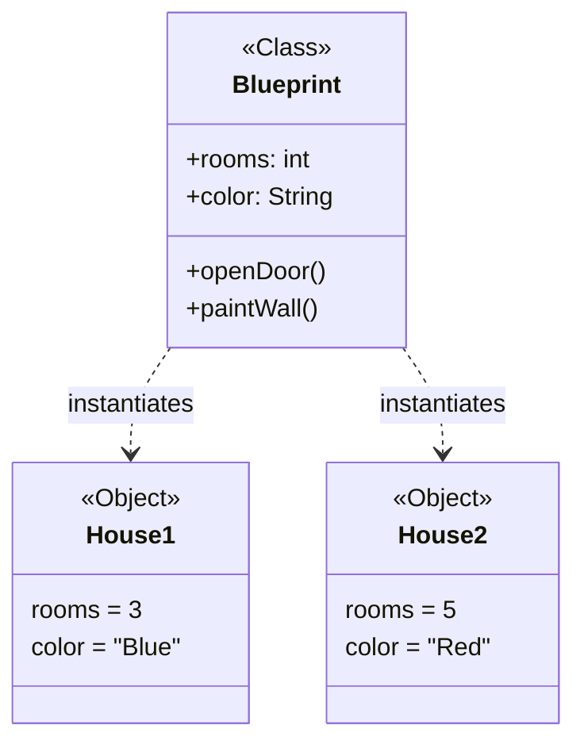
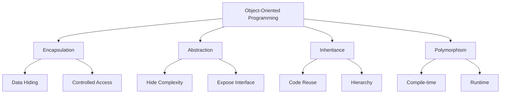
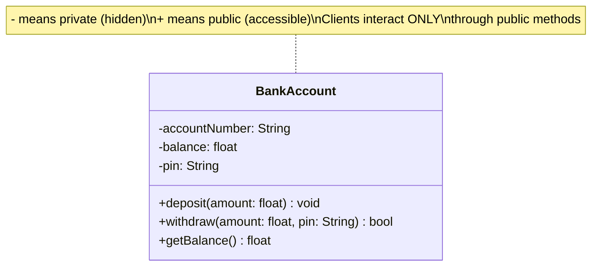
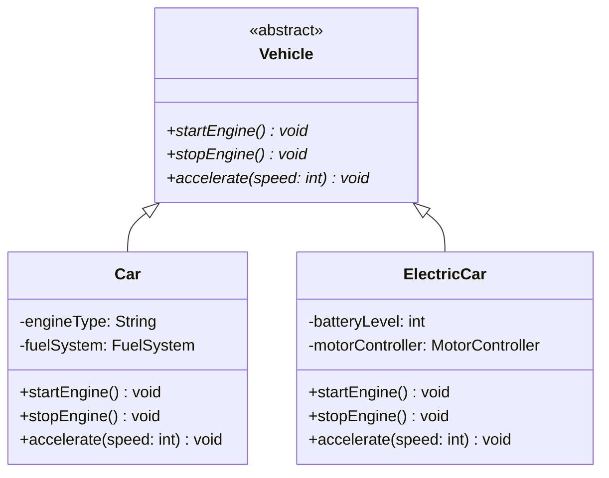
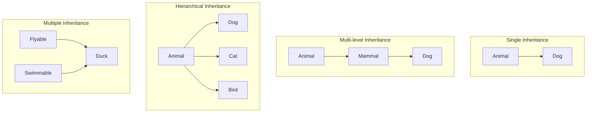
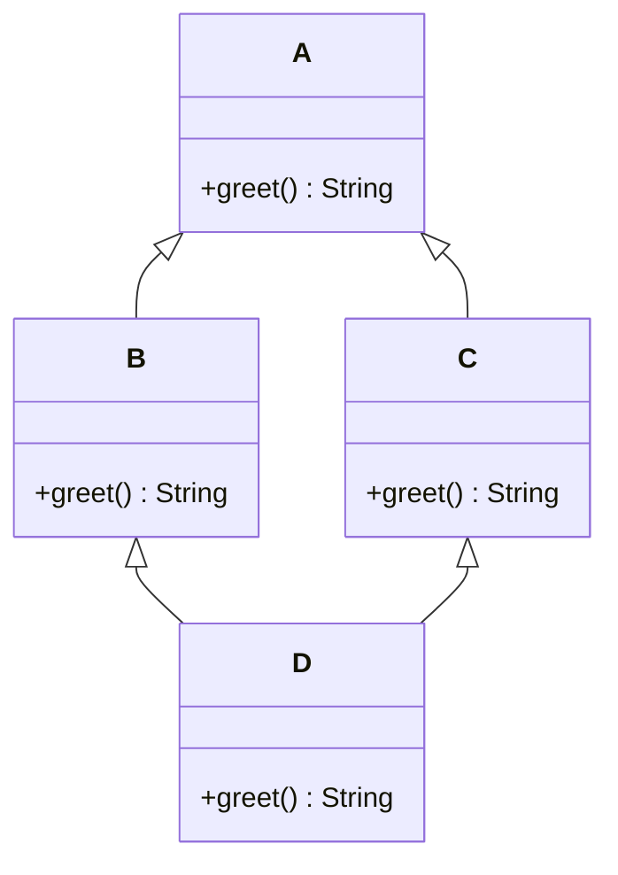
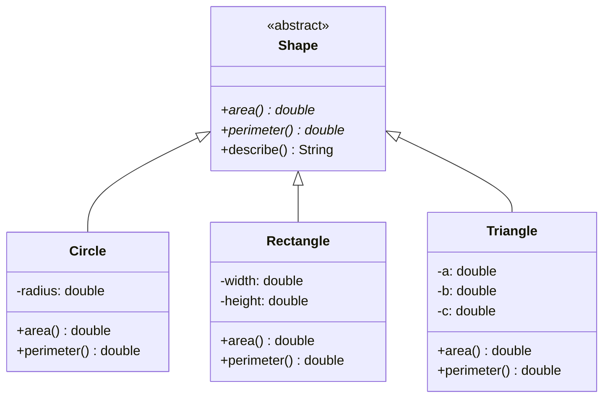
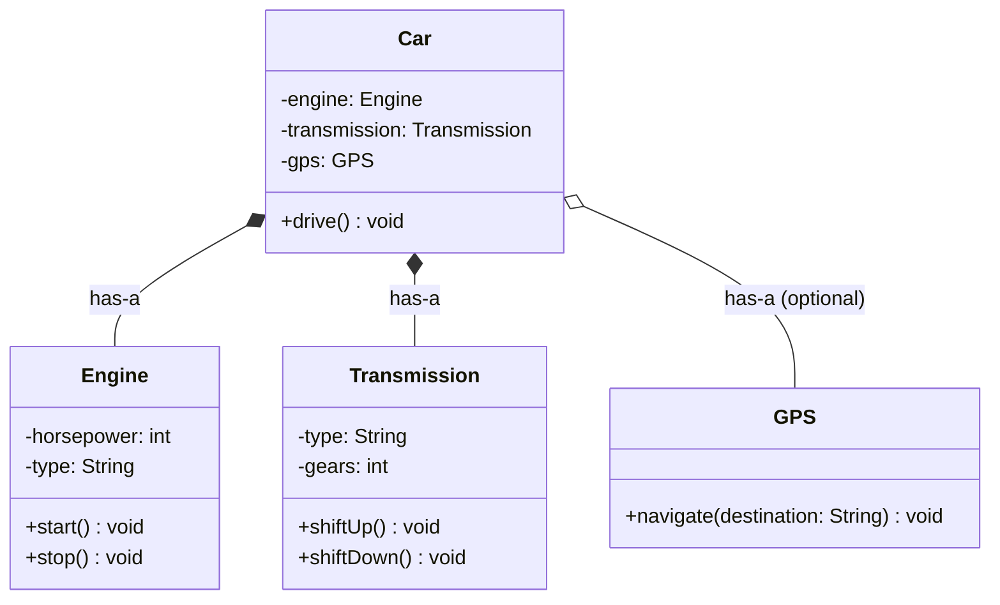
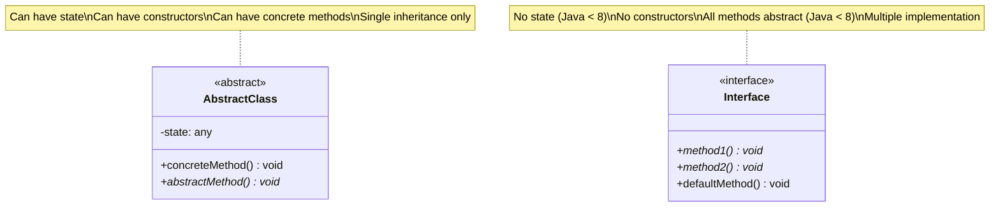
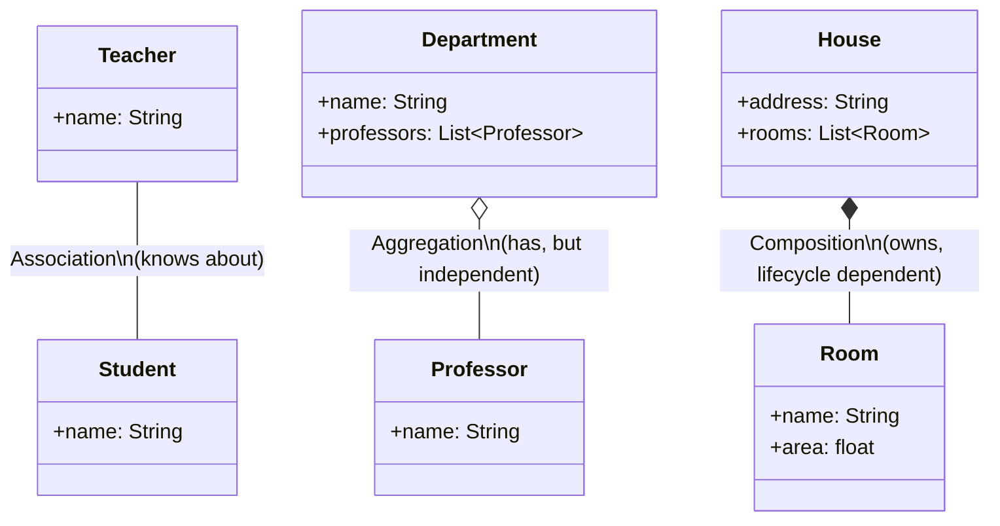

# Object-Oriented Programming (OOP) Fundamentals

> A comprehensive guide for Low Level Design interview preparation.

---

## Table of Contents

1. [What is OOP?](#1-what-is-oop)
2. [Classes and Objects](#2-classes-and-objects)
3. [The 4 Pillars of OOP](#3-the-4-pillars-of-oop)
   - [Encapsulation](#31-encapsulation)
   - [Abstraction](#32-abstraction)
   - [Inheritance](#33-inheritance)
   - [Polymorphism](#34-polymorphism)
4. [Composition vs Inheritance](#4-composition-vs-inheritance)
5. [Abstract Classes vs Interfaces](#5-abstract-classes-vs-interfaces)
6. [Access Modifiers](#6-access-modifiers)
7. [Association, Aggregation, Composition](#7-association-aggregation-composition)
8. [Practice Problems](#8-practice-problems)
9. [Common Interview Questions](#9-common-interview-questions)

---

## 1. What is OOP?

**Object-Oriented Programming (OOP)** is a programming paradigm that organizes software design around **objects** rather than functions and logic. An object is a data field that has unique attributes (properties) and behavior (methods).

### Why OOP Matters

| Benefit | Description |
|---------|-------------|
| **Modularity** | Code is organized into self-contained objects |
| **Reusability** | Objects and classes can be reused across projects |
| **Maintainability** | Changes to one part don't break others |
| **Scalability** | Easy to add new features via extension |
| **Real-world modeling** | Maps naturally to business domains |

### Paradigm Comparison

| Paradigm | Focus | Example Languages |
|----------|-------|-------------------|
| Procedural | Sequence of instructions | C, Pascal |
| Object-Oriented | Objects with state and behavior | Java, Python, C++ |
| Functional | Pure functions, immutability | Haskell, Erlang |

### Brief History

- **1960s**: Simula introduced the concept of classes and objects.
- **1970s**: Smalltalk made OOP mainstream, coined the term "message passing."
- **1980s**: C++ brought OOP into systems programming.
- **1990s**: Java popularized OOP for enterprise software.
- **2000s+**: Python, C#, and others blended OOP with other paradigms.

---

## 2. Classes and Objects

### The Blueprint Analogy

Think of a **Class** as an architectural blueprint for a house. The blueprint defines the structure (rooms, doors, windows) but is not a house itself. An **Object** is an actual house built from that blueprint. You can build many houses (objects) from one blueprint (class), each with its own paint color and furniture (state).



### Python Example

```python
class Car:
    """Class is the blueprint."""

    def __init__(self, make: str, model: str, year: int):
        self.make = make      # instance attribute
        self.model = model
        self.year = year
        self.speed = 0        # default state

    def accelerate(self, amount: int) -> None:
        self.speed += amount
        print(f"{self.make} {self.model} accelerating to {self.speed} km/h")

    def brake(self) -> None:
        self.speed = max(0, self.speed - 10)

    def __str__(self) -> str:
        return f"{self.year} {self.make} {self.model}"


# Creating objects (instantiation)
car1 = Car("Toyota", "Camry", 2023)
car2 = Car("Honda", "Civic", 2024)

car1.accelerate(60)   # Toyota Camry accelerating to 60 km/h
car2.accelerate(80)   # Honda Civic accelerating to 80 km/h

# car1 and car2 are distinct objects with their own state
print(car1.speed)  # 60
print(car2.speed)  # 80
```

### Java Example

```java
public class Car {
    // Instance variables (state)
    private String make;
    private String model;
    private int year;
    private int speed;

    // Constructor
    public Car(String make, String model, int year) {
        this.make = make;
        this.model = model;
        this.year = year;
        this.speed = 0;
    }

    // Methods (behavior)
    public void accelerate(int amount) {
        this.speed += amount;
        System.out.println(make + " " + model + " accelerating to " + speed + " km/h");
    }

    public void brake() {
        this.speed = Math.max(0, this.speed - 10);
    }

    @Override
    public String toString() {
        return year + " " + make + " " + model;
    }
}

// Usage
Car car1 = new Car("Toyota", "Camry", 2023);
Car car2 = new Car("Honda", "Civic", 2024);
car1.accelerate(60);
car2.accelerate(80);
```

### Memory Model

When you create an object, the following happens:

1. **Memory allocation**: Space is allocated on the heap for the object's data.
2. **Constructor call**: The `__init__` (Python) or constructor (Java) initializes the state.
3. **Reference returned**: A reference (pointer) to the heap memory is stored in the variable.

```
Stack                     Heap
+--------+               +----------------------------+
| car1 --|-------------->| Car Object                 |
+--------+               |   make = "Toyota"          |
| car2 --|--------+      |   model = "Camry"          |
+--------+        |      |   speed = 60               |
                  |      +----------------------------+
                  |
                  +----->+----------------------------+
                         | Car Object                 |
                         |   make = "Honda"            |
                         |   model = "Civic"           |
                         |   speed = 80               |
                         +----------------------------+
```

**Key point**: `car1` and `car2` are references on the stack. The actual object data lives on the heap. Assigning `car3 = car1` does NOT copy the object; both variables point to the same heap memory.

---

## 3. The 4 Pillars of OOP



---

### 3.1 Encapsulation

**Definition**: Encapsulation is the bundling of data (attributes) and the methods that operate on that data into a single unit (class), while restricting direct access to some of the object's components.

**Real-world analogy**: A **bank account** encapsulates your money. You cannot reach into the vault and take cash; you must use the ATM (public interface) which enforces rules like PIN verification and balance checks.



#### Python Example

```python
class BankAccount:
    def __init__(self, account_number: str, pin: str, initial_balance: float = 0):
        self._account_number = account_number  # protected (convention)
        self.__balance = initial_balance        # private (name mangling)
        self.__pin = pin                        # private

    # Public interface - controlled access to private data
    def deposit(self, amount: float) -> None:
        if amount <= 0:
            raise ValueError("Deposit amount must be positive")
        self.__balance += amount
        print(f"Deposited {amount}. New balance: {self.__balance}")

    def withdraw(self, amount: float, pin: str) -> bool:
        if pin != self.__pin:
            print("Invalid PIN!")
            return False
        if amount > self.__balance:
            print("Insufficient funds!")
            return False
        self.__balance -= amount
        print(f"Withdrew {amount}. New balance: {self.__balance}")
        return True

    # Getter - read-only access to private data
    @property
    def balance(self) -> float:
        return self.__balance

    # No setter for balance - prevents direct modification


account = BankAccount("ACC-001", "1234", 1000.0)
account.deposit(500)              # Deposited 500. New balance: 1500.0
account.withdraw(200, "1234")     # Withdrew 200. New balance: 1300.0
account.withdraw(200, "wrong")    # Invalid PIN!
print(account.balance)            # 1300.0 (read via property)
# account.__balance = 999999      # AttributeError! Cannot access directly
```

#### Java Example

```java
public class BankAccount {
    private String accountNumber;
    private double balance;
    private String pin;

    public BankAccount(String accountNumber, String pin, double initialBalance) {
        this.accountNumber = accountNumber;
        this.pin = pin;
        this.balance = initialBalance;
    }

    public void deposit(double amount) {
        if (amount <= 0) throw new IllegalArgumentException("Deposit must be positive");
        balance += amount;
        System.out.println("Deposited " + amount + ". New balance: " + balance);
    }

    public boolean withdraw(double amount, String pin) {
        if (!this.pin.equals(pin)) {
            System.out.println("Invalid PIN!");
            return false;
        }
        if (amount > balance) {
            System.out.println("Insufficient funds!");
            return false;
        }
        balance -= amount;
        System.out.println("Withdrew " + amount + ". New balance: " + balance);
        return true;
    }

    // Getter only - no setter for balance
    public double getBalance() {
        return balance;
    }
}
```

**Why encapsulation matters**:
- **Invariant protection**: Balance can never go negative because `withdraw` checks before deducting.
- **Implementation freedom**: We could change the internal storage (e.g., store balance in cents) without affecting callers.
- **Security**: The PIN is never exposed outside the class.

---

### 3.2 Abstraction

**Definition**: Abstraction is the concept of hiding the complex implementation details and showing only the necessary features of an object. It answers: "What does this object do?" rather than "How does it do it?"

**Real-world analogy**: When you **drive a car**, you use the steering wheel, pedals, and gear shift. You don't need to know how the engine combustion cycle works, how the transmission translates gear ratios, or how the braking system applies hydraulic pressure. The car's controls are an abstraction over complex mechanics.



#### Python Example

```python
from abc import ABC, abstractmethod


class PaymentProcessor(ABC):
    """Abstract class - defines WHAT payment processors do, not HOW."""

    @abstractmethod
    def authenticate(self) -> bool:
        """Verify credentials with the payment provider."""
        pass

    @abstractmethod
    def process_payment(self, amount: float) -> bool:
        """Process a payment of the given amount."""
        pass

    @abstractmethod
    def refund(self, transaction_id: str) -> bool:
        """Refund a previous transaction."""
        pass

    # Concrete method - shared behavior
    def log_transaction(self, transaction_id: str, amount: float) -> None:
        print(f"Transaction {transaction_id}: ${amount:.2f}")


class StripeProcessor(PaymentProcessor):
    """Concrete implementation - hides Stripe-specific complexity."""

    def __init__(self, api_key: str):
        self._api_key = api_key

    def authenticate(self) -> bool:
        # Complex Stripe API authentication hidden from the caller
        print("Authenticating with Stripe API...")
        return True

    def process_payment(self, amount: float) -> bool:
        # Complex payment intent creation, confirmation hidden
        print(f"Processing ${amount:.2f} through Stripe")
        return True

    def refund(self, transaction_id: str) -> bool:
        print(f"Refunding transaction {transaction_id} via Stripe")
        return True


class PayPalProcessor(PaymentProcessor):
    """Different implementation, same interface."""

    def __init__(self, client_id: str, client_secret: str):
        self._client_id = client_id
        self._client_secret = client_secret

    def authenticate(self) -> bool:
        print("Authenticating with PayPal OAuth...")
        return True

    def process_payment(self, amount: float) -> bool:
        print(f"Processing ${amount:.2f} through PayPal")
        return True

    def refund(self, transaction_id: str) -> bool:
        print(f"Refunding transaction {transaction_id} via PayPal")
        return True


# The caller doesn't care about internal details
def checkout(processor: PaymentProcessor, amount: float) -> None:
    """This function works with ANY payment processor."""
    processor.authenticate()
    processor.process_payment(amount)


# Usage - the implementation is abstracted away
checkout(StripeProcessor("sk_test_xxx"), 99.99)
checkout(PayPalProcessor("client_id", "secret"), 49.99)
```

#### Java Example

```java
// Abstract class
public abstract class PaymentProcessor {
    public abstract boolean authenticate();
    public abstract boolean processPayment(double amount);
    public abstract boolean refund(String transactionId);

    // Shared concrete method
    public void logTransaction(String transactionId, double amount) {
        System.out.printf("Transaction %s: $%.2f%n", transactionId, amount);
    }
}

// Concrete implementation
public class StripeProcessor extends PaymentProcessor {
    private String apiKey;

    public StripeProcessor(String apiKey) {
        this.apiKey = apiKey;
    }

    @Override
    public boolean authenticate() {
        System.out.println("Authenticating with Stripe API...");
        return true;
    }

    @Override
    public boolean processPayment(double amount) {
        System.out.printf("Processing $%.2f through Stripe%n", amount);
        return true;
    }

    @Override
    public boolean refund(String transactionId) {
        System.out.println("Refunding " + transactionId + " via Stripe");
        return true;
    }
}
```

**Key distinction**: Encapsulation hides *data*, abstraction hides *complexity*.

---

### 3.3 Inheritance

**Definition**: Inheritance is a mechanism where a new class (child/subclass) derives from an existing class (parent/superclass), inheriting its attributes and methods while allowing the child to add or override behavior.

**Real-world analogy**: A **Smartphone** inherits all features of a basic **Phone** (make calls, send texts) but adds new capabilities (apps, camera, GPS). A **Gaming Phone** further inherits from Smartphone and adds gaming-specific features (cooling system, trigger buttons).

#### Types of Inheritance



#### Python Example - Multi-level Inheritance

```python
class Animal:
    def __init__(self, name: str, species: str):
        self.name = name
        self.species = species

    def eat(self) -> str:
        return f"{self.name} is eating"

    def sleep(self) -> str:
        return f"{self.name} is sleeping"


class Mammal(Animal):
    def __init__(self, name: str, species: str, fur_color: str):
        super().__init__(name, species)  # call parent constructor
        self.fur_color = fur_color

    def nurse_young(self) -> str:
        return f"{self.name} is nursing its young"


class Dog(Mammal):
    def __init__(self, name: str, breed: str, fur_color: str):
        super().__init__(name, "Canis lupus familiaris", fur_color)
        self.breed = breed

    def fetch(self) -> str:
        return f"{self.name} the {self.breed} fetches the ball!"

    # Method overriding - customizing inherited behavior
    def eat(self) -> str:
        return f"{self.name} is eating kibble enthusiastically"


rex = Dog("Rex", "German Shepherd", "brown")
print(rex.eat())          # Rex is eating kibble enthusiastically (overridden)
print(rex.sleep())        # Rex is sleeping (inherited from Animal)
print(rex.nurse_young())  # Rex is nursing its young (inherited from Mammal)
print(rex.fetch())        # Rex the German Shepherd fetches the ball! (own method)

# Method Resolution Order (MRO) - Python's order for looking up methods
print(Dog.__mro__)
# (<class 'Dog'>, <class 'Mammal'>, <class 'Animal'>, <class 'object'>)
```

#### Java Example

```java
class Animal {
    protected String name;
    protected String species;

    public Animal(String name, String species) {
        this.name = name;
        this.species = species;
    }

    public String eat() {
        return name + " is eating";
    }

    public String sleep() {
        return name + " is sleeping";
    }
}

class Mammal extends Animal {
    protected String furColor;

    public Mammal(String name, String species, String furColor) {
        super(name, species);
        this.furColor = furColor;
    }

    public String nurseYoung() {
        return name + " is nursing its young";
    }
}

class Dog extends Mammal {
    private String breed;

    public Dog(String name, String breed, String furColor) {
        super(name, "Canis lupus familiaris", furColor);
        this.breed = breed;
    }

    @Override
    public String eat() {
        return name + " is eating kibble enthusiastically";
    }

    public String fetch() {
        return name + " the " + breed + " fetches the ball!";
    }
}
```

#### The Diamond Problem

When a class inherits from two classes that share a common ancestor, ambiguity arises about which path to follow.



```python
class A:
    def greet(self) -> str:
        return "Hello from A"

class B(A):
    def greet(self) -> str:
        return "Hello from B"

class C(A):
    def greet(self) -> str:
        return "Hello from C"

class D(B, C):
    pass  # Which greet() does D use?


d = D()
print(d.greet())   # "Hello from B" - Python uses MRO (C3 linearization)
print(D.__mro__)   # D -> B -> C -> A -> object
```

**Java avoids the diamond problem** by disallowing multiple class inheritance. A class can only `extends` one parent. However, Java allows implementing multiple interfaces (and since Java 8, interfaces can have default methods, reintroducing a limited form of the problem).

```java
interface Flyable {
    default String move() { return "Flying"; }
}

interface Swimmable {
    default String move() { return "Swimming"; }
}

// Compiler error! Must override move() to resolve ambiguity
class Duck implements Flyable, Swimmable {
    @Override
    public String move() {
        return "Flying and Swimming"; // Explicit resolution
    }
}
```

---

### 3.4 Polymorphism

**Definition**: Polymorphism means "many forms." It allows objects of different classes to be treated as objects of a common superclass, with each object responding to the same message (method call) in its own way.

**Real-world analogy**: The word "open" is polymorphic. You can "open" a door (push/pull), "open" a book (flip the cover), "open" a file (double-click), or "open" a bank account (fill forms). Same action name, different behavior depending on the object.

#### Compile-time Polymorphism (Method Overloading)

The method to call is determined at **compile time** based on the method signature (number, type, or order of parameters). Python does not natively support overloading in the Java sense.

```java
// Java - Method Overloading
public class Calculator {
    public int add(int a, int b) {
        return a + b;
    }

    public double add(double a, double b) {
        return a + b;
    }

    public int add(int a, int b, int c) {
        return a + b + c;
    }

    public String add(String a, String b) {
        return a + b;  // concatenation
    }
}

Calculator calc = new Calculator();
calc.add(1, 2);         // calls add(int, int) -> 3
calc.add(1.5, 2.5);     // calls add(double, double) -> 4.0
calc.add(1, 2, 3);      // calls add(int, int, int) -> 6
calc.add("Hello", " "); // calls add(String, String) -> "Hello "
```

Python alternative using default arguments or `singledispatch`:

```python
from functools import singledispatchmethod


class Calculator:
    # Approach 1: Default arguments
    def add(self, a, b, c=None):
        if c is not None:
            return a + b + c
        return a + b

    # Approach 2: singledispatchmethod (Python 3.8+)
    @singledispatchmethod
    def multiply(self, a, b):
        raise NotImplementedError

    @multiply.register
    def _(self, a: int, b: int) -> int:
        return a * b

    @multiply.register
    def _(self, a: str, b: int) -> str:
        return a * b
```

#### Runtime Polymorphism (Method Overriding / Dynamic Dispatch)

The method to call is determined at **runtime** based on the actual object type, not the reference type. This is the more important form of polymorphism for interviews.



```python
from abc import ABC, abstractmethod
import math


class Shape(ABC):
    @abstractmethod
    def area(self) -> float:
        pass

    @abstractmethod
    def perimeter(self) -> float:
        pass

    def describe(self) -> str:
        return f"{self.__class__.__name__}: area={self.area():.2f}, perimeter={self.perimeter():.2f}"


class Circle(Shape):
    def __init__(self, radius: float):
        self.radius = radius

    def area(self) -> float:
        return math.pi * self.radius ** 2

    def perimeter(self) -> float:
        return 2 * math.pi * self.radius


class Rectangle(Shape):
    def __init__(self, width: float, height: float):
        self.width = width
        self.height = height

    def area(self) -> float:
        return self.width * self.height

    def perimeter(self) -> float:
        return 2 * (self.width + self.height)


class Triangle(Shape):
    def __init__(self, a: float, b: float, c: float):
        self.a, self.b, self.c = a, b, c

    def area(self) -> float:
        s = self.perimeter() / 2
        return math.sqrt(s * (s - self.a) * (s - self.b) * (s - self.c))

    def perimeter(self) -> float:
        return self.a + self.b + self.c


# Polymorphism in action - same interface, different behavior
shapes: list[Shape] = [
    Circle(5),
    Rectangle(4, 6),
    Triangle(3, 4, 5),
]

for shape in shapes:
    # Each shape responds to describe() in its own way via dynamic dispatch
    print(shape.describe())
    # Circle: area=78.54, perimeter=31.42
    # Rectangle: area=24.00, perimeter=20.00
    # Triangle: area=6.00, perimeter=12.00


def total_area(shapes: list[Shape]) -> float:
    """Works with ANY shape, present or future. Open/Closed Principle."""
    return sum(shape.area() for shape in shapes)

print(f"Total area: {total_area(shapes):.2f}")  # 108.54
```

```java
// Java - Runtime Polymorphism
public abstract class Shape {
    public abstract double area();
    public abstract double perimeter();

    public String describe() {
        return String.format("%s: area=%.2f, perimeter=%.2f",
            getClass().getSimpleName(), area(), perimeter());
    }
}

public class Circle extends Shape {
    private double radius;

    public Circle(double radius) {
        this.radius = radius;
    }

    @Override
    public double area() {
        return Math.PI * radius * radius;
    }

    @Override
    public double perimeter() {
        return 2 * Math.PI * radius;
    }
}

// Usage - variable type is Shape, actual object is Circle
Shape shape = new Circle(5);
System.out.println(shape.describe());
// JVM uses dynamic dispatch to call Circle's area() and perimeter()
```

**How dynamic dispatch works (JVM)**:
1. The reference `shape` has compile-time type `Shape`.
2. At runtime, the JVM checks the actual object type (`Circle`).
3. It looks up the method in `Circle`'s vtable (virtual method table).
4. The correct method (`Circle.area()`) is invoked.

---

## 4. Composition vs Inheritance

### "Is-a" vs "Has-a"

- **Inheritance (Is-a)**: A Dog **is a** Animal. Use when there's a true subtype relationship.
- **Composition (Has-a)**: A Car **has a** Engine. Use when one object contains or uses another.

> **Favor composition over inheritance.** -- Gang of Four, "Design Patterns" (1994)



### Why Favor Composition?

| Aspect | Inheritance | Composition |
|--------|------------|-------------|
| Coupling | Tight (child depends on parent internals) | Loose (interact through interfaces) |
| Flexibility | Fixed at compile time | Can change at runtime |
| Reusability | Limited to class hierarchy | Components reusable anywhere |
| Testing | Hard to test in isolation | Easy to mock components |
| Changes | Parent change can break children | Component change is isolated |

### Python Example - Composition

```python
class Engine:
    def __init__(self, horsepower: int, engine_type: str):
        self.horsepower = horsepower
        self.engine_type = engine_type
        self._running = False

    def start(self) -> None:
        self._running = True
        print(f"{self.engine_type} engine ({self.horsepower}hp) started")

    def stop(self) -> None:
        self._running = False
        print("Engine stopped")

    @property
    def is_running(self) -> bool:
        return self._running


class Transmission:
    def __init__(self, gear_count: int):
        self.gear_count = gear_count
        self.current_gear = 0

    def shift_up(self) -> None:
        if self.current_gear < self.gear_count:
            self.current_gear += 1
            print(f"Shifted to gear {self.current_gear}")

    def shift_down(self) -> None:
        if self.current_gear > 0:
            self.current_gear -= 1
            print(f"Shifted to gear {self.current_gear}")


class Car:
    """Composed of Engine and Transmission - NOT inheriting from them."""

    def __init__(self, make: str, engine: Engine, transmission: Transmission):
        self.make = make
        self._engine = engine            # composition
        self._transmission = transmission # composition

    def start(self) -> None:
        self._engine.start()
        print(f"{self.make} is ready to drive")

    def drive(self) -> None:
        if not self._engine.is_running:
            print("Start the engine first!")
            return
        self._transmission.shift_up()
        print(f"{self.make} is driving in gear {self._transmission.current_gear}")


# Easy to swap components - flexibility of composition
v8_engine = Engine(450, "V8")
electric_engine = Engine(300, "Electric")
auto_trans = Transmission(8)

sports_car = Car("Mustang", v8_engine, auto_trans)
ev_car = Car("Tesla", electric_engine, Transmission(1))

sports_car.start()  # V8 engine (450hp) started / Mustang is ready to drive
sports_car.drive()  # Shifted to gear 1 / Mustang is driving in gear 1
```

### When to Use Each

**Use Inheritance when**:
- There is a genuine "is-a" relationship (Dog is an Animal).
- You want to leverage polymorphism (treat subtypes uniformly).
- The base class represents a true abstraction of the subclass.

**Use Composition when**:
- There is a "has-a" or "uses-a" relationship.
- You need flexibility to swap behaviors at runtime.
- The relationship doesn't represent a subtype hierarchy.
- You want loose coupling and better testability.

---

## 5. Abstract Classes vs Interfaces



| Feature | Abstract Class | Interface |
|---------|---------------|-----------|
| Instantiation | Cannot be instantiated | Cannot be instantiated |
| State (fields) | Can have instance variables | Only constants (Java) |
| Constructors | Yes | No |
| Concrete methods | Yes | Yes (Java 8+ default methods) |
| Multiple inheritance | No (single parent class) | Yes (implement many) |
| Access modifiers | All (public, private, etc.) | public only (Java) |
| When to use | Shared code + partial abstraction | Define a contract/capability |

### Python Example

```python
from abc import ABC, abstractmethod


# Abstract class - partial implementation with shared state
class DatabaseConnection(ABC):
    def __init__(self, host: str, port: int):
        self.host = host
        self.port = port
        self._connected = False

    def connect(self) -> None:
        """Concrete method - shared logic."""
        print(f"Connecting to {self.host}:{self.port}...")
        self._do_connect()  # delegate to subclass
        self._connected = True

    @abstractmethod
    def _do_connect(self) -> None:
        """Subclass-specific connection logic."""
        pass

    @abstractmethod
    def execute_query(self, query: str) -> list:
        pass


# Interface-like (pure abstract class in Python)
class Cacheable(ABC):
    @abstractmethod
    def cache_key(self) -> str:
        pass

    @abstractmethod
    def cache_ttl(self) -> int:
        pass


# A class can inherit from one abstract class AND implement multiple interfaces
class PostgresConnection(DatabaseConnection, Cacheable):
    def _do_connect(self) -> None:
        print("Establishing PostgreSQL connection with libpq...")

    def execute_query(self, query: str) -> list:
        print(f"Executing on PostgreSQL: {query}")
        return []

    def cache_key(self) -> str:
        return f"pg:{self.host}:{self.port}"

    def cache_ttl(self) -> int:
        return 300
```

### Java Example

```java
// Abstract class
public abstract class DatabaseConnection {
    protected String host;
    protected int port;
    protected boolean connected;

    public DatabaseConnection(String host, int port) {
        this.host = host;
        this.port = port;
    }

    // Concrete method
    public void connect() {
        System.out.println("Connecting to " + host + ":" + port);
        doConnect();
        connected = true;
    }

    protected abstract void doConnect();
    public abstract List<Object> executeQuery(String query);
}

// Interface
public interface Cacheable {
    String cacheKey();
    int cacheTTL();

    // Java 8+ default method
    default boolean isCacheExpired(long lastCachedTime) {
        return System.currentTimeMillis() - lastCachedTime > cacheTTL() * 1000L;
    }
}

// Extends one class, implements one interface
public class PostgresConnection extends DatabaseConnection implements Cacheable {
    public PostgresConnection(String host, int port) {
        super(host, port);
    }

    @Override
    protected void doConnect() {
        System.out.println("Establishing PostgreSQL connection...");
    }

    @Override
    public List<Object> executeQuery(String query) {
        System.out.println("Executing: " + query);
        return new ArrayList<>();
    }

    @Override
    public String cacheKey() {
        return "pg:" + host + ":" + port;
    }

    @Override
    public int cacheTTL() {
        return 300;
    }
}
```

---

## 6. Access Modifiers

Access modifiers control the visibility of classes, methods, and fields.

### Java Access Modifiers

| Modifier | Class | Package | Subclass | World |
|----------|:-----:|:-------:|:--------:|:-----:|
| `public` | Yes | Yes | Yes | Yes |
| `protected` | Yes | Yes | Yes | No |
| *(default/package-private)* | Yes | Yes | No | No |
| `private` | Yes | No | No | No |

### Python Conventions

Python does not have true access modifiers enforced by the language. It uses naming conventions:

| Convention | Meaning | Example |
|-----------|---------|---------|
| `name` | Public | `self.name` |
| `_name` | Protected (by convention) | `self._internal_cache` |
| `__name` | Private (name mangling) | `self.__secret` |
| `__name__` | Dunder/magic method | `self.__init__` |

```python
class Employee:
    def __init__(self, name: str, salary: float, ssn: str):
        self.name = name          # public - anyone can access
        self._salary = salary     # protected - subclasses and internal use
        self.__ssn = ssn          # private - name mangling to _Employee__ssn

    def get_ssn_last_four(self) -> str:
        """Public interface to access private data safely."""
        return "***-**-" + self.__ssn[-4:]


emp = Employee("Alice", 90000, "123-45-6789")
print(emp.name)                # "Alice" - works fine
print(emp._salary)             # 90000 - works but discouraged
# print(emp.__ssn)             # AttributeError!
print(emp._Employee__ssn)      # "123-45-6789" - name mangling bypass (don't do this)
print(emp.get_ssn_last_four()) # "***-**-6789" - proper access
```

```java
public class Employee {
    public String name;           // accessible everywhere
    protected double salary;      // accessible in package + subclasses
    String department;            // package-private (default) - same package only
    private String ssn;           // only within this class

    public Employee(String name, double salary, String department, String ssn) {
        this.name = name;
        this.salary = salary;
        this.department = department;
        this.ssn = ssn;
    }

    public String getSsnLastFour() {
        return "***-**-" + ssn.substring(ssn.length() - 4);
    }
}
```

---

## 7. Association, Aggregation, Composition

These describe the relationships between objects, differing in strength and lifecycle dependency.



### Comparison

| Relationship | Strength | Lifecycle | Example |
|-------------|----------|-----------|---------|
| **Association** | Weak | Independent | Teacher teaches Student |
| **Aggregation** | Medium | Independent (part can exist alone) | Department has Professors |
| **Composition** | Strong | Dependent (part dies with whole) | House has Rooms |

### Python Examples

```python
# ASSOCIATION - Teacher knows about Student, but neither owns the other
class Student:
    def __init__(self, name: str):
        self.name = name

class Teacher:
    def __init__(self, name: str):
        self.name = name
        self._students: list[Student] = []  # knows about students

    def add_student(self, student: Student) -> None:
        self._students.append(student)

# Both exist independently
alice = Student("Alice")
mr_smith = Teacher("Mr. Smith")
mr_smith.add_student(alice)
# If mr_smith is deleted, alice still exists


# AGGREGATION - Department has Professors, but they exist independently
class Professor:
    def __init__(self, name: str):
        self.name = name

class Department:
    def __init__(self, name: str):
        self.name = name
        self._professors: list[Professor] = []

    def add_professor(self, professor: Professor) -> None:
        self._professors.append(professor)

    def remove_professor(self, professor: Professor) -> None:
        self._professors.remove(professor)

# Professors exist independently of the department
prof_jones = Professor("Dr. Jones")
cs_dept = Department("Computer Science")
cs_dept.add_professor(prof_jones)
# If cs_dept is deleted, prof_jones continues to exist
# prof_jones can belong to multiple departments


# COMPOSITION - House owns Rooms; Rooms cannot exist without a House
class Room:
    def __init__(self, name: str, area: float):
        self.name = name
        self.area = area

class House:
    def __init__(self, address: str, room_specs: list[tuple[str, float]]):
        self.address = address
        # Rooms are created BY the house - they don't exist independently
        self._rooms = [Room(name, area) for name, area in room_specs]

    def total_area(self) -> float:
        return sum(room.area for room in self._rooms)

# Rooms are created inside the House and don't exist outside it
my_house = House("123 Main St", [
    ("Living Room", 30.0),
    ("Bedroom", 20.0),
    ("Kitchen", 15.0),
])
# When my_house is garbage collected, all its rooms are too
```

### UML Notation Summary

| Relationship | UML Arrow | Python Hint |
|-------------|-----------|-------------|
| Association | Solid line (`--`) | Reference passed in, not owned |
| Aggregation | Open diamond (`o--`) | Reference passed in, shared ownership |
| Composition | Filled diamond (`*--`) | Created inside constructor, exclusive ownership |
| Inheritance | Hollow triangle (`<\|--`) | `class Child(Parent)` |
| Implementation | Dashed hollow triangle (`<\|..`) | `class Concrete(ABC)` |
| Dependency | Dashed arrow (`..>`) | Used as parameter, not stored |

---

## 8. Practice Problems

### Problem 1: Design a Library Management System

**Requirements**: Model Books, Members, Librarians, and a Library. Books can be borrowed and returned. Members have borrowing limits.

**Hints**: Think about which relationships are Association, Aggregation, or Composition. Where does Encapsulation apply? What is the polymorphic behavior?

### Problem 2: Design a Shape Hierarchy

**Requirements**: Create a base Shape class. Implement Circle, Rectangle, Triangle, and Polygon. Support area, perimeter, and drawing operations.

**Hints**: Use abstract classes for the base. Consider how to handle shapes with different numbers of sides.

### Problem 3: Design an Employee Hierarchy

**Requirements**: Model Employee (base), Manager, Developer, Designer. Managers manage teams. Calculate salary with different bonus structures.

**Hints**: Where does inheritance make sense vs composition? How do you handle different bonus calculation polymorphically?

### Problem 4: Design a Notification System

**Requirements**: Support Email, SMS, Push, and Slack notifications. Each has different sending mechanics but a common interface.

**Hints**: Classic polymorphism problem. Use abstraction to hide notification-specific details.

### Problem 5: Design a Vehicle Rental System

**Requirements**: Model Cars, Bikes, Trucks with different rental rates and rules. Support fleet management.

**Hints**: When is inheritance appropriate (vehicle types) vs composition (engine, GPS features)?

### Problem 6: Design a Restaurant Order System

**Requirements**: Model Menu Items, Orders, Tables, Payments. Items can be customized (extra cheese, no onions).

**Hints**: Composition for order items. Polymorphism for different payment types.

### Problem 7: Design a File System

**Requirements**: Model Files and Directories. Directories contain Files and other Directories. Support operations like size calculation, search, and listing.

**Hints**: This is a classic Composite pattern. Think about how composition and polymorphism work together.

---

## 9. Common Interview Questions

### Conceptual Questions

1. **What are the four pillars of OOP?** Explain each with a real-world example.
2. **What is the difference between abstraction and encapsulation?** Encapsulation hides data; abstraction hides complexity. Encapsulation is about bundling data with methods; abstraction is about exposing only relevant interfaces.
3. **What is the difference between overloading and overriding?** Overloading = same method name, different parameters (compile-time). Overriding = subclass redefines parent method with same signature (runtime).
4. **Why is multiple inheritance problematic?** Diamond problem - ambiguity about which parent method to call. Python resolves with MRO; Java avoids with single class inheritance.
5. **When would you use an abstract class vs an interface?** Abstract class when you have shared state/code. Interface when you need a contract that multiple unrelated classes can implement.
6. **What is the difference between composition and aggregation?** Lifecycle dependency. In composition, the contained object cannot exist without the container. In aggregation, it can.
7. **Can you instantiate an abstract class?** No. You must create a concrete subclass that implements all abstract methods.
8. **What is a virtual method table (vtable)?** A lookup table used by the runtime to resolve which overridden method to call during dynamic dispatch.

### Code-based Questions

9. **What is the output of the following code?**
```python
class A:
    def method(self):
        print("A")

class B(A):
    def method(self):
        print("B")

class C(A):
    def method(self):
        print("C")

class D(B, C):
    pass

D().method()  # Answer: "B" (MRO: D -> B -> C -> A)
```

10. **What is wrong with this design?**
```python
class Stack(list):  # Inheriting from list
    def push(self, item):
        self.append(item)
```
Answer: Stack "is-a" list exposes all list methods (insert, sort, reverse) that violate stack semantics. Use composition instead: store a private list and only expose push/pop/peek.

---

*End of OOP Fundamentals. Continue to [SOLID Principles](../02-SOLID-Principles/README.md).*
