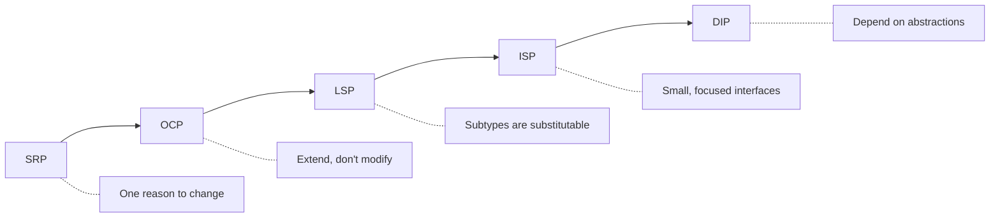
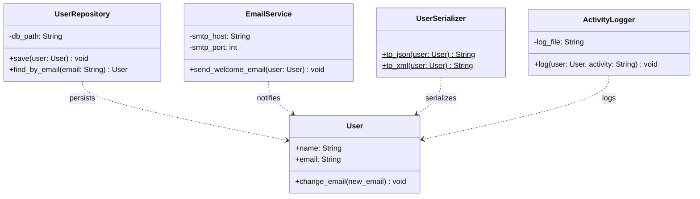
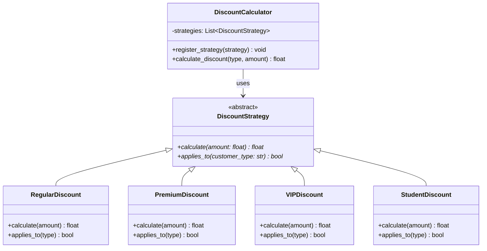
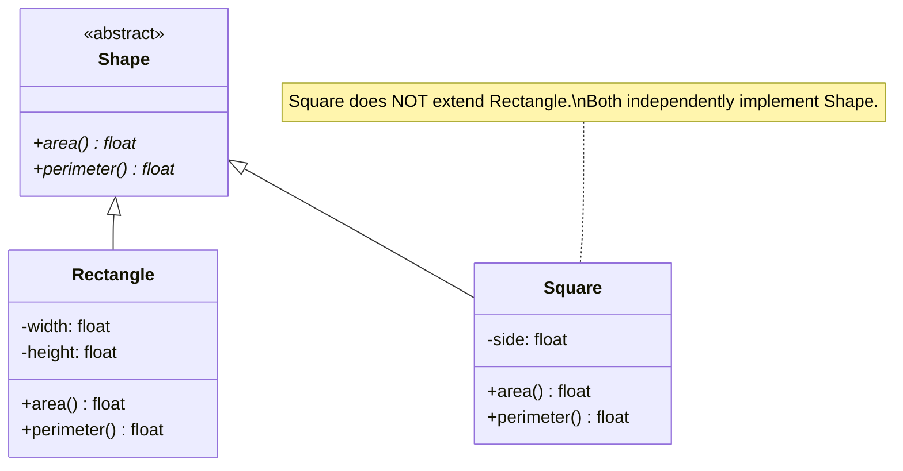
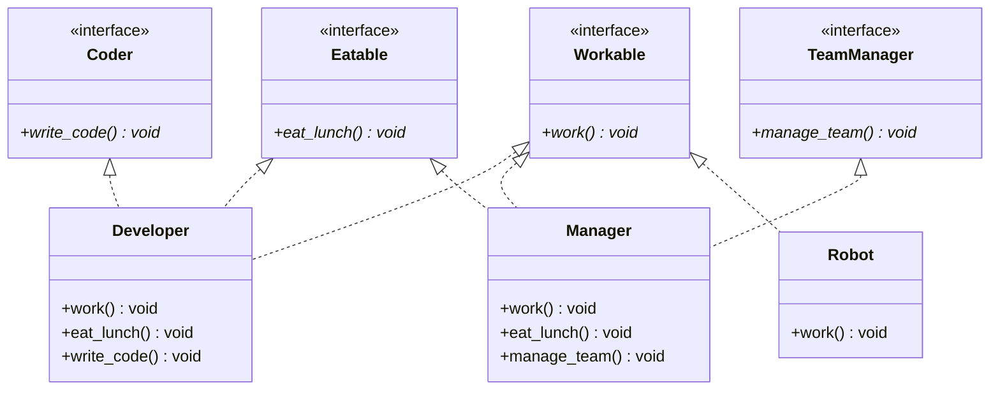
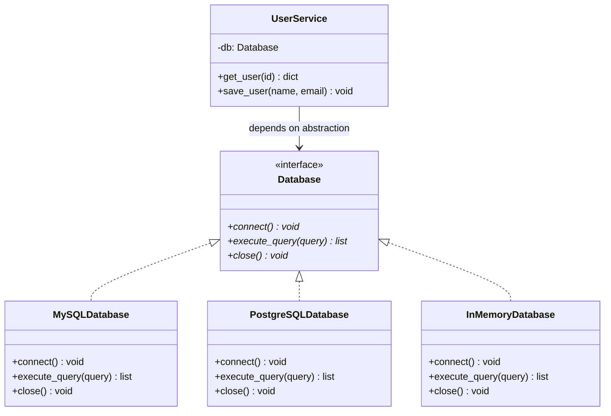
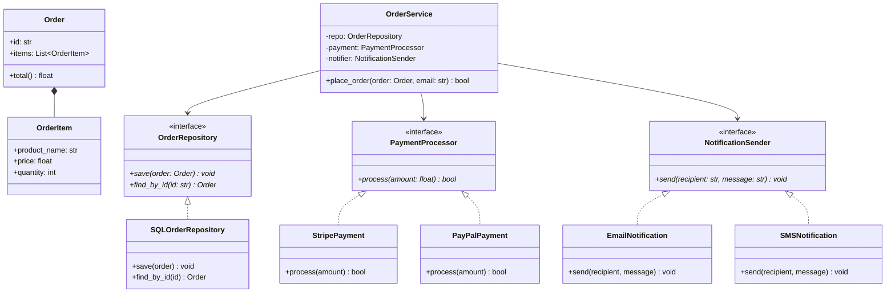

# SOLID Principles

> A comprehensive guide for Low Level Design interview preparation.
> Each principle includes: definition, real-world analogy, bad/good code examples, mermaid diagrams, and interview tips.

---

## Table of Contents

1. [Overview](#overview)
2. [Single Responsibility Principle (SRP)](#1-single-responsibility-principle-srp)
3. [Open/Closed Principle (OCP)](#2-openclosed-principle-ocp)
4. [Liskov Substitution Principle (LSP)](#3-liskov-substitution-principle-lsp)
5. [Interface Segregation Principle (ISP)](#4-interface-segregation-principle-isp)
6. [Dependency Inversion Principle (DIP)](#5-dependency-inversion-principle-dip)
7. [SOLID in Practice - Putting It All Together](#6-solid-in-practice---putting-it-all-together)
8. [Common Interview Questions](#7-common-interview-questions)

---

## Overview

SOLID is a mnemonic for five design principles intended to make object-oriented designs more understandable, flexible, and maintainable. They were introduced by Robert C. Martin ("Uncle Bob") in the early 2000s.

| Principle | Acronym | One-liner |
|-----------|---------|-----------|
| **S**ingle Responsibility | SRP | A class should have one, and only one, reason to change |
| **O**pen/Closed | OCP | Open for extension, closed for modification |
| **L**iskov Substitution | LSP | Subtypes must be substitutable for their base types |
| **I**nterface Segregation | ISP | No client should be forced to depend on methods it does not use |
| **D**ependency Inversion | DIP | Depend on abstractions, not concretions |



---

## 1. Single Responsibility Principle (SRP)

> **"A class should have one, and only one, reason to change."** -- Robert C. Martin

### Definition

A class should have only **one responsibility** -- one job, one concern, one axis of change. If a class has multiple responsibilities, changes to one responsibility may break or affect the other. "Reason to change" means a different stakeholder or actor who might request a change.

### Real-World Analogy

Think of a **chef** in a restaurant. A chef's responsibility is to cook food. If you also make the chef handle:
- Taking orders from customers (waiter's job)
- Managing the restaurant's finances (accountant's job)
- Fixing the kitchen plumbing (plumber's job)

...then a change in any of those areas affects the chef. A plumbing issue shouldn't disrupt food preparation. Each role should be a separate person (class) with a single responsibility.

### BAD Example - SRP Violation

```python
class User:
    """This class does TOO MANY things."""

    def __init__(self, name: str, email: str):
        self.name = name
        self.email = email

    # Responsibility 1: User data management
    def change_email(self, new_email: str) -> None:
        if "@" not in new_email:
            raise ValueError("Invalid email")
        self.email = new_email

    # Responsibility 2: Persistence (database operations)
    def save_to_database(self) -> None:
        # Tightly coupled to a specific database
        import sqlite3
        conn = sqlite3.connect("users.db")
        cursor = conn.cursor()
        cursor.execute(
            "INSERT INTO users (name, email) VALUES (?, ?)",
            (self.name, self.email)
        )
        conn.commit()
        conn.close()

    # Responsibility 3: Email notification
    def send_welcome_email(self) -> None:
        import smtplib
        server = smtplib.SMTP("smtp.gmail.com", 587)
        server.sendmail("admin@app.com", self.email, f"Welcome {self.name}!")
        server.quit()

    # Responsibility 4: Serialization
    def to_json(self) -> str:
        import json
        return json.dumps({"name": self.name, "email": self.email})

    # Responsibility 5: Logging
    def log_activity(self, activity: str) -> None:
        with open("user_activity.log", "a") as f:
            f.write(f"{self.name}: {activity}\n")
```

**Why this is bad**:
- **5 reasons to change**: Database schema changes, email provider changes, serialization format changes, logging format changes, and user business logic changes ALL affect this single class.
- **Testing nightmare**: To test `change_email`, you need a database, an SMTP server, and a file system.
- **Ripple effects**: Changing how emails are sent risks breaking database code because they live in the same class.

### GOOD Example - SRP Applied

```python
class User:
    """Only responsible for user domain logic."""

    def __init__(self, name: str, email: str):
        self.name = name
        self.email = email

    def change_email(self, new_email: str) -> None:
        if "@" not in new_email:
            raise ValueError("Invalid email")
        self.email = new_email


class UserRepository:
    """Only responsible for user persistence."""

    def __init__(self, db_path: str):
        self._db_path = db_path

    def save(self, user: User) -> None:
        import sqlite3
        conn = sqlite3.connect(self._db_path)
        cursor = conn.cursor()
        cursor.execute(
            "INSERT INTO users (name, email) VALUES (?, ?)",
            (user.name, user.email)
        )
        conn.commit()
        conn.close()

    def find_by_email(self, email: str) -> User | None:
        # ... database lookup logic
        pass


class EmailService:
    """Only responsible for sending emails."""

    def __init__(self, smtp_host: str, smtp_port: int):
        self._smtp_host = smtp_host
        self._smtp_port = smtp_port

    def send_welcome_email(self, user: User) -> None:
        import smtplib
        server = smtplib.SMTP(self._smtp_host, self._smtp_port)
        server.sendmail("admin@app.com", user.email, f"Welcome {user.name}!")
        server.quit()


class UserSerializer:
    """Only responsible for serialization."""

    @staticmethod
    def to_json(user: User) -> str:
        import json
        return json.dumps({"name": user.name, "email": user.email})

    @staticmethod
    def to_xml(user: User) -> str:
        return f"<user><name>{user.name}</name><email>{user.email}</email></user>"


class ActivityLogger:
    """Only responsible for logging."""

    def __init__(self, log_file: str):
        self._log_file = log_file

    def log(self, user: User, activity: str) -> None:
        with open(self._log_file, "a") as f:
            f.write(f"{user.name}: {activity}\n")
```



**Benefits**:
- Each class has **one reason to change**.
- Changing the database doesn't affect email sending.
- Each class can be tested independently with simple mocks.
- New serialization formats are added to `UserSerializer` only.

### Edge Cases and Gotchas

- **Don't over-split**: SRP doesn't mean one method per class. A `User` class with `change_email()` and `change_name()` is fine because both relate to user domain logic.
- **"Reason to change" means stakeholder**: Two methods that always change together belong in the same class, even if they seem different.
- **Cohesion test**: If you remove a method and the class still makes conceptual sense, that method might belong elsewhere.

---

## 2. Open/Closed Principle (OCP)

> **"Software entities should be open for extension, but closed for modification."** -- Bertrand Meyer

### Definition

You should be able to **add new behavior** to a system without **changing existing, tested code**. This is achieved through abstraction and polymorphism: define stable interfaces, and add new functionality by creating new implementations.

### Real-World Analogy

Think of a **power strip** (extension cord with multiple outlets). When you buy a new device (laptop, phone charger, lamp), you plug it into the power strip. You don't rewire the power strip or modify the electrical system every time. The power strip is **closed for modification** (you don't change its internals) but **open for extension** (you can plug new things in via the standard outlet interface).

### BAD Example - OCP Violation

```python
class DiscountCalculator:
    """Every new discount type requires modifying this class."""

    def calculate_discount(self, customer_type: str, amount: float) -> float:
        if customer_type == "regular":
            return amount * 0.05
        elif customer_type == "premium":
            return amount * 0.10
        elif customer_type == "vip":
            return amount * 0.20
        elif customer_type == "employee":
            return amount * 0.30
        # Adding a new customer type? Must modify this method.
        # What if this method is used in 50 places? Every change risks breaking them.
        else:
            return 0.0
```

**Why this is bad**:
- Adding a "student" discount requires **modifying** `calculate_discount`.
- Every modification requires re-testing the entire method.
- The if-elif chain grows unboundedly, becoming harder to maintain.
- Multiple developers adding discount types to the same method creates merge conflicts.

### GOOD Example - OCP Applied

```python
from abc import ABC, abstractmethod


class DiscountStrategy(ABC):
    """Abstraction that is closed for modification."""

    @abstractmethod
    def calculate(self, amount: float) -> float:
        pass

    @abstractmethod
    def applies_to(self, customer_type: str) -> bool:
        pass


class RegularDiscount(DiscountStrategy):
    def calculate(self, amount: float) -> float:
        return amount * 0.05

    def applies_to(self, customer_type: str) -> bool:
        return customer_type == "regular"


class PremiumDiscount(DiscountStrategy):
    def calculate(self, amount: float) -> float:
        return amount * 0.10

    def applies_to(self, customer_type: str) -> bool:
        return customer_type == "premium"


class VIPDiscount(DiscountStrategy):
    def calculate(self, amount: float) -> float:
        return amount * 0.20

    def applies_to(self, customer_type: str) -> bool:
        return customer_type == "vip"


class EmployeeDiscount(DiscountStrategy):
    def calculate(self, amount: float) -> float:
        return amount * 0.30

    def applies_to(self, customer_type: str) -> bool:
        return customer_type == "employee"


# Adding a new discount? Just create a new class. No existing code modified.
class StudentDiscount(DiscountStrategy):
    def calculate(self, amount: float) -> float:
        return amount * 0.15

    def applies_to(self, customer_type: str) -> bool:
        return customer_type == "student"


class DiscountCalculator:
    """This class NEVER needs to be modified when new discounts are added."""

    def __init__(self):
        self._strategies: list[DiscountStrategy] = []

    def register_strategy(self, strategy: DiscountStrategy) -> None:
        self._strategies.append(strategy)

    def calculate_discount(self, customer_type: str, amount: float) -> float:
        for strategy in self._strategies:
            if strategy.applies_to(customer_type):
                return strategy.calculate(amount)
        return 0.0


# Setup
calculator = DiscountCalculator()
calculator.register_strategy(RegularDiscount())
calculator.register_strategy(PremiumDiscount())
calculator.register_strategy(VIPDiscount())
calculator.register_strategy(EmployeeDiscount())
calculator.register_strategy(StudentDiscount())  # New! No existing code changed.

print(calculator.calculate_discount("student", 100))  # 15.0
```



### Edge Cases and Gotchas

- **OCP doesn't mean never modify code**: It means design so that the most *common* changes don't require modification. Bug fixes and refactoring are fine.
- **Abstraction cost**: Over-applying OCP leads to excessive abstraction. Apply it where change is *likely*, not everywhere preemptively.
- **Configuration-based extension**: Sometimes a data-driven approach (JSON config, database rules) is simpler than class hierarchies.

---

## 3. Liskov Substitution Principle (LSP)

> **"Objects of a superclass should be replaceable with objects of a subclass without affecting the correctness of the program."** -- Barbara Liskov

### Definition

If `S` is a subtype of `T`, then objects of type `T` can be replaced with objects of type `S` without altering the desirable properties of the program. In simpler terms: a subclass must be usable anywhere its parent class is used, without surprises.

### Real-World Analogy

Imagine you hire a **substitute teacher**. The substitute should be able to do everything a regular teacher does: take attendance, teach the lesson, give homework. If the substitute refuses to teach ("I only do attendance"), the school day breaks down. A proper substitute is fully substitutable for the regular teacher.

### BAD Example - LSP Violation (The Classic Rectangle-Square Problem)

```python
class Rectangle:
    def __init__(self, width: float, height: float):
        self._width = width
        self._height = height

    @property
    def width(self) -> float:
        return self._width

    @width.setter
    def width(self, value: float) -> None:
        self._width = value

    @property
    def height(self) -> float:
        return self._height

    @height.setter
    def height(self, value: float) -> None:
        self._height = value

    def area(self) -> float:
        return self._width * self._height


class Square(Rectangle):
    """A square IS-A rectangle mathematically, but this breaks LSP."""

    def __init__(self, side: float):
        super().__init__(side, side)

    @Rectangle.width.setter
    def width(self, value: float) -> None:
        # Must keep width == height for a square
        self._width = value
        self._height = value  # Surprise side effect!

    @Rectangle.height.setter
    def height(self, value: float) -> None:
        self._width = value  # Surprise side effect!
        self._height = value


def test_rectangle_area(rect: Rectangle) -> None:
    """This function expects Rectangle behavior."""
    rect.width = 5
    rect.height = 10
    expected_area = 50  # 5 * 10
    actual_area = rect.area()
    assert actual_area == expected_area, f"Expected {expected_area}, got {actual_area}"
    print(f"Test passed! Area = {actual_area}")


# Works fine with Rectangle
test_rectangle_area(Rectangle(1, 1))  # Test passed! Area = 50

# BREAKS with Square - LSP violation!
test_rectangle_area(Square(1))
# AssertionError: Expected 50, got 100
# Setting height to 10 also changed width to 10, so area = 10 * 10 = 100
```

**Why this is bad**:
- `Square` changes the **postcondition** of `width.setter`: setting width should only change width, not height.
- Code that works with `Rectangle` breaks when given a `Square`.
- The substitution produces **incorrect results**.

### GOOD Example - LSP Applied

```python
from abc import ABC, abstractmethod


class Shape(ABC):
    """Common abstraction that both can implement honestly."""

    @abstractmethod
    def area(self) -> float:
        pass

    @abstractmethod
    def perimeter(self) -> float:
        pass


class Rectangle(Shape):
    def __init__(self, width: float, height: float):
        self._width = width
        self._height = height

    @property
    def width(self) -> float:
        return self._width

    @width.setter
    def width(self, value: float) -> None:
        self._width = value

    @property
    def height(self) -> float:
        return self._height

    @height.setter
    def height(self, value: float) -> None:
        self._height = value

    def area(self) -> float:
        return self._width * self._height

    def perimeter(self) -> float:
        return 2 * (self._width + self._height)


class Square(Shape):
    """Square is NOT a subtype of Rectangle. Both are subtypes of Shape."""

    def __init__(self, side: float):
        self._side = side

    @property
    def side(self) -> float:
        return self._side

    @side.setter
    def side(self, value: float) -> None:
        self._side = value

    def area(self) -> float:
        return self._side ** 2

    def perimeter(self) -> float:
        return 4 * self._side


# Now both are honestly substitutable for Shape
def print_shape_info(shape: Shape) -> None:
    print(f"Area: {shape.area():.2f}, Perimeter: {shape.perimeter():.2f}")


print_shape_info(Rectangle(5, 10))  # Area: 50.00, Perimeter: 30.00
print_shape_info(Square(7))         # Area: 49.00, Perimeter: 28.00
# No surprises, no broken invariants
```



### Another LSP Violation Example - NotImplementedError

```python
# BAD: Ostrich "is-a" Bird, but can't fly
class Bird:
    def fly(self) -> str:
        return "Flying high!"

class Ostrich(Bird):
    def fly(self) -> str:
        raise NotImplementedError("Ostriches can't fly!")  # LSP violation

# Code that expects Bird behavior breaks
def let_birds_fly(birds: list[Bird]) -> None:
    for bird in birds:
        print(bird.fly())  # Crashes on Ostrich!


# GOOD: Separate flying behavior
class Bird(ABC):
    @abstractmethod
    def move(self) -> str:
        pass

class FlyingBird(Bird):
    def move(self) -> str:
        return "Flying!"

class FlightlessBird(Bird):
    def move(self) -> str:
        return "Running!"

class Sparrow(FlyingBird):
    pass

class Ostrich(FlightlessBird):
    pass
```

### LSP Rules of Thumb

| Rule | Description |
|------|-------------|
| **Preconditions** | A subclass must not strengthen preconditions (accept less) |
| **Postconditions** | A subclass must not weaken postconditions (promise less) |
| **Invariants** | A subclass must maintain all invariants of the parent |
| **No new exceptions** | A subclass should not throw exceptions the parent didn't |
| **History constraint** | A subclass must not allow state changes the parent wouldn't |

### Edge Cases and Gotchas

- **"Is-a" in the real world does not always mean "is-a" in code**: A square IS a rectangle mathematically, but in OOP where rectangles have independently settable width/height, it breaks.
- **Empty implementations are a smell**: If a subclass method does nothing or throws `NotImplementedError`, you likely have an LSP violation.
- **Behavioral vs structural subtyping**: LSP is about behavior, not just interface matching. A class can implement all methods but still violate LSP if the behavior differs from expectations.

---

## 4. Interface Segregation Principle (ISP)

> **"No client should be forced to depend on methods it does not use."** -- Robert C. Martin

### Definition

Instead of one large, monolithic interface, create smaller, more specific interfaces. Classes should only need to implement the methods that are relevant to them. This prevents "fat interfaces" that force implementers to provide meaningless stub implementations.

### Real-World Analogy

Imagine a **universal remote control** that has buttons for TV, DVD player, sound system, smart lights, thermostat, and garage door. If you only have a TV, you're forced to deal with (and accidentally press) buttons you don't need. Better to have **separate remotes**: one for TV, one for sound, one for lights. Each device gets only the controls it needs.

### BAD Example - ISP Violation

```python
from abc import ABC, abstractmethod


class Worker(ABC):
    """Fat interface - forces ALL workers to implement ALL methods."""

    @abstractmethod
    def work(self) -> None:
        pass

    @abstractmethod
    def eat_lunch(self) -> None:
        pass

    @abstractmethod
    def attend_meeting(self) -> None:
        pass

    @abstractmethod
    def write_code(self) -> None:
        pass

    @abstractmethod
    def manage_team(self) -> None:
        pass

    @abstractmethod
    def design_ui(self) -> None:
        pass


class Developer(Worker):
    def work(self) -> None:
        print("Developing software")

    def eat_lunch(self) -> None:
        print("Eating lunch")

    def attend_meeting(self) -> None:
        print("Attending standup")

    def write_code(self) -> None:
        print("Writing Python code")

    def manage_team(self) -> None:
        pass  # Developer doesn't manage! Forced empty implementation.

    def design_ui(self) -> None:
        pass  # Developer doesn't design UI! Another forced empty implementation.


class Manager(Worker):
    def work(self) -> None:
        print("Managing projects")

    def eat_lunch(self) -> None:
        print("Eating lunch")

    def attend_meeting(self) -> None:
        print("Leading meeting")

    def write_code(self) -> None:
        pass  # Manager doesn't code! Forced empty implementation.

    def manage_team(self) -> None:
        print("Managing team")

    def design_ui(self) -> None:
        pass  # Manager doesn't design! Forced empty implementation.


class Robot(Worker):
    def work(self) -> None:
        print("Assembling parts")

    def eat_lunch(self) -> None:
        pass  # Robots don't eat! Forced meaningless implementation.

    def attend_meeting(self) -> None:
        pass  # Robots don't attend meetings!

    def write_code(self) -> None:
        pass

    def manage_team(self) -> None:
        pass

    def design_ui(self) -> None:
        pass
```

**Why this is bad**:
- `Developer` is forced to implement `manage_team()` and `design_ui()` with empty bodies.
- `Robot` is forced to implement `eat_lunch()` -- robots don't eat.
- Adding a new method to `Worker` forces ALL implementations to change.
- Empty methods hide the true capabilities of each class.

### GOOD Example - ISP Applied

```python
from abc import ABC, abstractmethod


# Small, focused interfaces
class Workable(ABC):
    @abstractmethod
    def work(self) -> None:
        pass


class Eatable(ABC):
    @abstractmethod
    def eat_lunch(self) -> None:
        pass


class MeetingAttendee(ABC):
    @abstractmethod
    def attend_meeting(self) -> None:
        pass


class Coder(ABC):
    @abstractmethod
    def write_code(self) -> None:
        pass


class TeamManager(ABC):
    @abstractmethod
    def manage_team(self) -> None:
        pass


class UIDesigner(ABC):
    @abstractmethod
    def design_ui(self) -> None:
        pass


# Each class implements ONLY the interfaces it truly needs
class Developer(Workable, Eatable, MeetingAttendee, Coder):
    def work(self) -> None:
        print("Developing software")

    def eat_lunch(self) -> None:
        print("Eating lunch")

    def attend_meeting(self) -> None:
        print("Attending standup")

    def write_code(self) -> None:
        print("Writing Python code")
    # No manage_team or design_ui -- not forced!


class Manager(Workable, Eatable, MeetingAttendee, TeamManager):
    def work(self) -> None:
        print("Managing projects")

    def eat_lunch(self) -> None:
        print("Eating lunch")

    def attend_meeting(self) -> None:
        print("Leading meeting")

    def manage_team(self) -> None:
        print("Managing team of 10")
    # No write_code or design_ui -- not forced!


class Robot(Workable):
    def work(self) -> None:
        print("Assembling parts 24/7")
    # Only implements what it actually does. No eat, no meetings.


# Functions depend only on the interface they need
def lunch_break(employees: list[Eatable]) -> None:
    """Only cares about eating -- doesn't need Workable or Coder."""
    for emp in employees:
        emp.eat_lunch()


def code_review(coders: list[Coder]) -> None:
    """Only cares about coding."""
    for coder in coders:
        coder.write_code()
```



### Edge Cases and Gotchas

- **Don't create one-method interfaces for everything**: ISP is about segregating *fat* interfaces, not atomizing them. If three methods always go together, they belong in one interface.
- **Cohesion matters**: Group methods that are conceptually related. A `ReadableStream` interface with `read()`, `peek()`, and `available()` is fine because they're cohesive.
- **Python's duck typing relaxes ISP**: In Python, you don't need explicit interfaces. If a function only calls `work()`, any object with a `work()` method works. But explicit ABCs help with documentation and static analysis.

---

## 5. Dependency Inversion Principle (DIP)

> **"High-level modules should not depend on low-level modules. Both should depend on abstractions. Abstractions should not depend on details. Details should depend on abstractions."** -- Robert C. Martin

### Definition

The dependency direction should be inverted: instead of high-level business logic depending on low-level implementation details (database, file system, APIs), both should depend on an **abstraction** (interface or abstract class). The low-level module implements the abstraction, and the high-level module uses it.

### Real-World Analogy

Consider a **wall outlet** (electrical socket). Your laptop charger doesn't connect directly to the power plant's wiring. Instead:
- The power plant provides electricity through a **standard outlet interface** (abstraction).
- Your charger is built to use that standard interface.
- You can swap power sources (grid, generator, solar) without changing your charger.
- You can swap devices (laptop, phone, toaster) without changing the outlet.

Both the power source (low-level) and the device (high-level) depend on the outlet standard (abstraction), not on each other.

### BAD Example - DIP Violation

```python
class MySQLDatabase:
    """Low-level module - specific database implementation."""

    def connect(self) -> None:
        print("Connecting to MySQL...")

    def execute_query(self, query: str) -> list[dict]:
        print(f"MySQL executing: {query}")
        return [{"id": 1, "name": "Alice"}]

    def close(self) -> None:
        print("Closing MySQL connection")


class UserService:
    """High-level module - DIRECTLY depends on low-level MySQL module."""

    def __init__(self):
        # Hardcoded dependency on MySQL! Cannot use PostgreSQL or MongoDB.
        self.db = MySQLDatabase()

    def get_user(self, user_id: int) -> dict:
        self.db.connect()
        result = self.db.execute_query(f"SELECT * FROM users WHERE id = {user_id}")
        self.db.close()
        return result[0] if result else {}

    def save_user(self, name: str, email: str) -> None:
        self.db.connect()
        self.db.execute_query(f"INSERT INTO users (name, email) VALUES ('{name}', '{email}')")
        self.db.close()
```

**Why this is bad**:
- `UserService` is **tightly coupled** to `MySQLDatabase`. Switching to PostgreSQL requires modifying `UserService`.
- **Cannot test** `UserService` without a real MySQL database (or extensive mocking of a concrete class).
- **Cannot reuse** `UserService` in a project that uses a different database.
- The **dependency arrow points downward**: High-level (UserService) depends on low-level (MySQLDatabase).

### GOOD Example - DIP Applied

```python
from abc import ABC, abstractmethod


# ABSTRACTION - the contract both high and low level depend on
class Database(ABC):
    """Interface that both modules depend on."""

    @abstractmethod
    def connect(self) -> None:
        pass

    @abstractmethod
    def execute_query(self, query: str) -> list[dict]:
        pass

    @abstractmethod
    def close(self) -> None:
        pass


# LOW-LEVEL MODULE - implements the abstraction
class MySQLDatabase(Database):
    def connect(self) -> None:
        print("Connecting to MySQL...")

    def execute_query(self, query: str) -> list[dict]:
        print(f"MySQL executing: {query}")
        return [{"id": 1, "name": "Alice"}]

    def close(self) -> None:
        print("Closing MySQL connection")


class PostgreSQLDatabase(Database):
    def connect(self) -> None:
        print("Connecting to PostgreSQL...")

    def execute_query(self, query: str) -> list[dict]:
        print(f"PostgreSQL executing: {query}")
        return [{"id": 1, "name": "Alice"}]

    def close(self) -> None:
        print("Closing PostgreSQL connection")


class InMemoryDatabase(Database):
    """Perfect for testing - no real database needed."""

    def __init__(self):
        self._data: list[dict] = []

    def connect(self) -> None:
        pass  # No-op for in-memory

    def execute_query(self, query: str) -> list[dict]:
        return self._data

    def close(self) -> None:
        pass


# HIGH-LEVEL MODULE - depends on abstraction, not concretion
class UserService:
    def __init__(self, db: Database):
        # Dependency INJECTED through constructor
        self._db = db  # Depends on Database abstraction, not MySQLDatabase

    def get_user(self, user_id: int) -> dict:
        self._db.connect()
        result = self._db.execute_query(f"SELECT * FROM users WHERE id = {user_id}")
        self._db.close()
        return result[0] if result else {}

    def save_user(self, name: str, email: str) -> None:
        self._db.connect()
        self._db.execute_query(f"INSERT INTO users (name, email) VALUES ('{name}', '{email}')")
        self._db.close()


# Production usage
mysql_service = UserService(MySQLDatabase())
postgres_service = UserService(PostgreSQLDatabase())

# Testing - no real database needed!
test_db = InMemoryDatabase()
test_db._data = [{"id": 1, "name": "Test User"}]
test_service = UserService(test_db)
assert test_service.get_user(1) == {"id": 1, "name": "Test User"}
```



### Dependency Injection Patterns

There are three common ways to inject dependencies:

```python
# 1. Constructor Injection (preferred - makes dependencies explicit)
class UserService:
    def __init__(self, db: Database, logger: Logger):
        self._db = db
        self._logger = logger

# 2. Method Injection (when dependency varies per call)
class ReportGenerator:
    def generate(self, data_source: DataSource) -> str:
        return data_source.fetch_data()

# 3. Property Injection (when dependency is optional or changeable)
class NotificationService:
    def __init__(self):
        self._sender: MessageSender | None = None

    @property
    def sender(self) -> MessageSender:
        return self._sender

    @sender.setter
    def sender(self, value: MessageSender) -> None:
        self._sender = value
```

### Edge Cases and Gotchas

- **DIP is not the same as Dependency Injection**: DIP is a design principle (depend on abstractions). Dependency Injection is a *technique* for achieving DIP (passing dependencies from outside).
- **Don't abstract everything**: Not every dependency needs an interface. If you'll only ever use one implementation (e.g., Python's `datetime`), abstracting it adds unnecessary complexity.
- **Abstraction should be owned by the high-level module**: The interface `Database` should be defined in the same package/module as `UserService`, not `MySQLDatabase`. The high-level module defines what it needs; low-level modules conform.

---

## 6. SOLID in Practice - Putting It All Together

Let's design a real system that applies ALL five SOLID principles: an **E-Commerce Order Processing System**.



### Complete Implementation

```python
from abc import ABC, abstractmethod
from dataclasses import dataclass
from uuid import uuid4


# ============================================================
# DOMAIN MODELS (SRP: Only responsible for domain logic)
# ============================================================

@dataclass
class OrderItem:
    product_name: str
    price: float
    quantity: int

    def subtotal(self) -> float:
        return self.price * self.quantity


@dataclass
class Order:
    id: str
    customer_email: str
    items: list[OrderItem]
    status: str = "pending"

    def total(self) -> float:
        return sum(item.subtotal() for item in self.items)


# ============================================================
# ABSTRACTIONS (DIP: High-level modules depend on these)
# ============================================================

class OrderRepository(ABC):
    """SRP: Only persistence. DIP: Abstraction for storage."""

    @abstractmethod
    def save(self, order: Order) -> None:
        pass

    @abstractmethod
    def find_by_id(self, order_id: str) -> Order | None:
        pass


class PaymentProcessor(ABC):
    """ISP: Only payment. OCP: New processors via new classes."""

    @abstractmethod
    def process(self, amount: float, reference: str) -> bool:
        pass


class NotificationSender(ABC):
    """ISP: Only notifications. OCP: New channels via new classes."""

    @abstractmethod
    def send(self, recipient: str, message: str) -> None:
        pass


class TaxCalculator(ABC):
    """OCP: New tax rules via new implementations."""

    @abstractmethod
    def calculate_tax(self, amount: float) -> float:
        pass


# ============================================================
# CONCRETE IMPLEMENTATIONS (Low-level modules)
# ============================================================

class SQLOrderRepository(OrderRepository):
    """Concrete persistence implementation."""

    def __init__(self):
        self._storage: dict[str, Order] = {}  # simplified for demo

    def save(self, order: Order) -> None:
        self._storage[order.id] = order
        print(f"[SQL] Saved order {order.id}")

    def find_by_id(self, order_id: str) -> Order | None:
        return self._storage.get(order_id)


class StripePaymentProcessor(PaymentProcessor):
    """LSP: Fully substitutable for PaymentProcessor."""

    def process(self, amount: float, reference: str) -> bool:
        print(f"[Stripe] Charging ${amount:.2f} for ref {reference}")
        return True


class PayPalPaymentProcessor(PaymentProcessor):
    """LSP: Also fully substitutable. OCP: Added without modifying existing code."""

    def process(self, amount: float, reference: str) -> bool:
        print(f"[PayPal] Charging ${amount:.2f} for ref {reference}")
        return True


class EmailNotificationSender(NotificationSender):
    def send(self, recipient: str, message: str) -> None:
        print(f"[Email] To: {recipient} | {message}")


class SMSNotificationSender(NotificationSender):
    def send(self, recipient: str, message: str) -> None:
        print(f"[SMS] To: {recipient} | {message}")


class USTaxCalculator(TaxCalculator):
    def calculate_tax(self, amount: float) -> float:
        return amount * 0.08  # 8% sales tax


class EUTaxCalculator(TaxCalculator):
    def calculate_tax(self, amount: float) -> float:
        return amount * 0.20  # 20% VAT


# ============================================================
# HIGH-LEVEL SERVICE (SRP: Orchestration only. DIP: Depends on abstractions.)
# ============================================================

class OrderService:
    """
    SOLID principles applied:
    - SRP: Only orchestrates order placement. Doesn't handle DB, payments, or emails.
    - OCP: New payment methods, notifiers, and tax rules added without changing this code.
    - LSP: Any PaymentProcessor, NotificationSender, etc. can be substituted.
    - ISP: Each dependency has a small, focused interface.
    - DIP: Depends only on abstractions, not concrete implementations.
    """

    def __init__(
        self,
        repository: OrderRepository,
        payment_processor: PaymentProcessor,
        notifier: NotificationSender,
        tax_calculator: TaxCalculator,
    ):
        self._repository = repository
        self._payment = payment_processor
        self._notifier = notifier
        self._tax = tax_calculator

    def place_order(self, order: Order) -> bool:
        # Calculate total with tax
        subtotal = order.total()
        tax = self._tax.calculate_tax(subtotal)
        total = subtotal + tax

        # Process payment
        payment_success = self._payment.process(total, order.id)
        if not payment_success:
            order.status = "payment_failed"
            self._repository.save(order)
            return False

        # Save order
        order.status = "confirmed"
        self._repository.save(order)

        # Notify customer
        self._notifier.send(
            order.customer_email,
            f"Order {order.id} confirmed! Total: ${total:.2f} (incl. ${tax:.2f} tax)"
        )

        return True


# ============================================================
# USAGE - Wiring it all together
# ============================================================

def main():
    # Configure dependencies (this is where you choose implementations)
    repo = SQLOrderRepository()
    payment = StripePaymentProcessor()     # Swap to PayPalPaymentProcessor() easily
    notifier = EmailNotificationSender()   # Swap to SMSNotificationSender() easily
    tax = USTaxCalculator()                # Swap to EUTaxCalculator() for EU customers

    # Create the service with injected dependencies
    order_service = OrderService(repo, payment, notifier, tax)

    # Place an order
    order = Order(
        id=str(uuid4())[:8],
        customer_email="alice@example.com",
        items=[
            OrderItem("Laptop", 999.99, 1),
            OrderItem("Mouse", 29.99, 2),
        ]
    )

    success = order_service.place_order(order)
    print(f"\nOrder placed successfully: {success}")
    print(f"Order total: ${order.total():.2f}")


if __name__ == "__main__":
    main()


# ============================================================
# TESTING - Easy to test with fakes (thanks to DIP)
# ============================================================

class FakePaymentProcessor(PaymentProcessor):
    def __init__(self, should_succeed: bool = True):
        self.should_succeed = should_succeed
        self.last_amount = 0.0

    def process(self, amount: float, reference: str) -> bool:
        self.last_amount = amount
        return self.should_succeed


class FakeNotificationSender(NotificationSender):
    def __init__(self):
        self.messages: list[tuple[str, str]] = []

    def send(self, recipient: str, message: str) -> None:
        self.messages.append((recipient, message))


def test_place_order_success():
    repo = SQLOrderRepository()
    payment = FakePaymentProcessor(should_succeed=True)
    notifier = FakeNotificationSender()
    tax = USTaxCalculator()

    service = OrderService(repo, payment, notifier, tax)
    order = Order("test-1", "test@example.com", [OrderItem("Widget", 10.0, 2)])

    result = service.place_order(order)

    assert result is True
    assert order.status == "confirmed"
    assert len(notifier.messages) == 1
    assert payment.last_amount == 21.60  # 20.0 + 8% tax


def test_place_order_payment_failure():
    repo = SQLOrderRepository()
    payment = FakePaymentProcessor(should_succeed=False)
    notifier = FakeNotificationSender()
    tax = USTaxCalculator()

    service = OrderService(repo, payment, notifier, tax)
    order = Order("test-2", "test@example.com", [OrderItem("Widget", 10.0, 1)])

    result = service.place_order(order)

    assert result is False
    assert order.status == "payment_failed"
    assert len(notifier.messages) == 0  # No notification on failure
```

### How Each SOLID Principle is Applied

| Principle | Where Applied |
|-----------|--------------|
| **SRP** | `Order` handles domain logic, `OrderRepository` handles persistence, `PaymentProcessor` handles payments, `NotificationSender` handles notifications, `OrderService` orchestrates |
| **OCP** | Adding `PayPalPaymentProcessor` or `SMSNotificationSender` requires zero changes to `OrderService` |
| **LSP** | `StripePaymentProcessor` and `PayPalPaymentProcessor` are fully interchangeable. `FakePaymentProcessor` works for tests |
| **ISP** | Each interface (`PaymentProcessor`, `NotificationSender`, `TaxCalculator`) has a small, focused surface. No class is forced to implement irrelevant methods |
| **DIP** | `OrderService` depends on abstractions (`OrderRepository`, `PaymentProcessor`, etc.), not concrete classes. Dependencies are injected via the constructor |

---

## 7. Common Interview Questions

### Principle-Specific Questions

**SRP:**
1. How do you determine if a class has too many responsibilities?
   - Ask: "How many reasons does this class have to change?" If multiple stakeholders would request changes, it has too many.
2. Does SRP mean one method per class?
   - No. Multiple methods that serve the *same responsibility* belong together.

**OCP:**
3. How do you apply OCP without over-engineering?
   - Apply OCP where change is *likely*. Don't preemptively abstract stable code.
4. Can you give an example of OCP violation in a real codebase?
   - A function with a long if/elif chain that grows with each new type (e.g., `if format == "pdf" ... elif format == "csv" ...`).

**LSP:**
5. What is the Rectangle-Square problem?
   - Square inheriting from Rectangle violates LSP because setting width/height independently is a Rectangle invariant that Square breaks.
6. How do you detect LSP violations?
   - Look for: subclasses that throw `NotImplementedError`, empty method overrides, or methods that silently do nothing.

**ISP:**
7. What is a "fat interface"?
   - An interface with many methods where most implementers only need a subset.
8. How does ISP relate to SRP?
   - SRP applies to classes (one responsibility). ISP applies to interfaces (clients shouldn't depend on methods they don't use). They're complementary.

**DIP:**
9. What is the difference between DIP and Dependency Injection?
   - DIP is a design *principle* (depend on abstractions). DI is a *technique* (pass dependencies from outside). DI is one way to achieve DIP.
10. Should every class depend on an interface?
    - No. Abstracting stable, unlikely-to-change dependencies (e.g., standard library classes) adds unnecessary complexity.

### Scenario-Based Questions

11. **"Your team is building a report generator that currently exports to PDF. Next quarter, you need CSV and Excel. How do you design it?"**
    - OCP: Define a `ReportExporter` interface with an `export()` method. Create `PDFExporter`, `CSVExporter`, `ExcelExporter` implementations. The report generator depends on the abstraction.

12. **"You have a `UserService` class that handles registration, authentication, profile updates, and email notifications. Is this well-designed?"**
    - SRP violation: Split into `RegistrationService`, `AuthenticationService`, `ProfileService`, and `NotificationService`.

13. **"Your `Bird` class has a `fly()` method. You need to add `Penguin` and `Ostrich`. How do you handle this?"**
    - LSP: Don't make Penguin extend a class with `fly()`. Create separate `FlyingBird` and `FlightlessBird` abstractions, or use a `Movable` interface with different implementations.

14. **"How would you refactor a class that directly creates database connections?"**
    - DIP: Extract a `DatabaseConnection` interface, inject it into the class. Now you can swap implementations and easily test with an in-memory database.

---

*Previous: [OOP Fundamentals](../01-OOP-Fundamentals/README.md) | Next: [Design Patterns](../03-Design-Patterns/README.md)*
