# UML Diagrams - The Definitive Guide for LLD Interviews

## Table of Contents
- [Introduction](#introduction)
- [1. Class Diagrams](#1-class-diagrams-most-important)
- [2. Sequence Diagrams](#2-sequence-diagrams)
- [3. State Diagrams](#3-state-diagrams)
- [4. Activity Diagrams](#4-activity-diagrams)
- [5. Use Case Diagrams](#5-use-case-diagrams)
- [6. How to Draw UML in Interviews](#6-how-to-draw-uml-in-interviews)

---

## Introduction

UML (Unified Modeling Language) is the standard visual language for modeling software systems. In LLD interviews, you are expected to communicate your design visually. **Class diagrams** and **sequence diagrams** are by far the most important; the rest come up occasionally.

**Key Takeaway**: You do NOT need to memorize every UML notation. Master class diagrams and sequence diagrams deeply, and know the basics of the rest.

---

## 1. Class Diagrams (Most Important)

Class diagrams are the backbone of LLD interviews. They show the **static structure** of a system: classes, their attributes, methods, and relationships.

### 1.1 Class Notation

A class is drawn as a rectangle divided into three compartments:

```
┌─────────────────────────┐
│       ClassName         │  ← Name compartment
├─────────────────────────┤
│ + publicAttr: Type      │  ← Attributes compartment
│ - privateAttr: Type     │
│ # protectedAttr: Type   │
│ ~ packageAttr: Type     │
├─────────────────────────┤
│ + publicMethod(): Type  │  ← Methods compartment
│ - privateMethod(): void │
│ # protectedMethod()     │
└─────────────────────────┘
```

### 1.2 Visibility Modifiers

| Symbol | Visibility | Meaning |
|--------|-----------|---------|
| `+` | Public | Accessible from anywhere |
| `-` | Private | Accessible only within the class |
| `#` | Protected | Accessible within class and subclasses |
| `~` | Package/Internal | Accessible within the same package |

### 1.3 Attribute and Method Notation

**Attributes**: `visibility name: Type = defaultValue`
```
- balance: float = 0.0
+ name: str
# items: List<Item>
```

**Methods**: `visibility name(param: Type): ReturnType`
```
+ getBalance(): float
- validateAmount(amount: float): bool
+ withdraw(amount: float): bool
```

**Static members** are shown with an underline:
```
+ instance: Singleton        ← static attribute (underlined)
+ getInstance(): Singleton   ← static method (underlined)
```

**Abstract classes** are shown with the class name in *italics* or with `<<abstract>>`.
**Interfaces** are shown with `<<interface>>` above the name.

---

### 1.4 Relationships

This is the most critical section. There are **six** relationships you must know:

#### 1.4.1 Association (uses-a) -- Solid Line

Two classes are related, and one knows about the other. This is the most generic relationship.

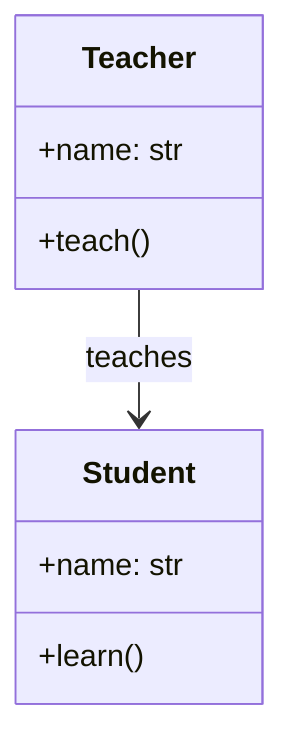

**Arrow notation**: Solid line with optional arrow showing navigability.
- `A --> B` means A knows about B (A has a reference to B)
- `A --- B` means bidirectional association

**When to use**: When one object "uses" or "knows about" another, but neither owns the other.

**Code equivalent**:
```python
class Teacher:
    def __init__(self, name: str):
        self.name = name
        self.students: list[Student] = []  # Teacher knows about students
```

---

#### 1.4.2 Aggregation (has-a, weak ownership) -- Empty Diamond

A whole-part relationship where the **part can exist independently** of the whole. If the whole is destroyed, the parts survive.

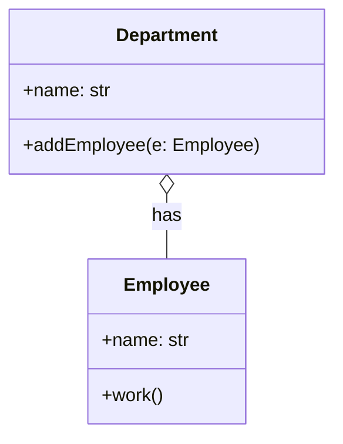

**Arrow notation**: Solid line with **empty (hollow) diamond** on the "whole" side.

**Key point**: The Employee can exist without the Department. If the Department is deleted, employees still exist.

**Code equivalent**:
```python
class Department:
    def __init__(self, name: str):
        self.name = name
        self.employees: list[Employee] = []

    def add_employee(self, emp: Employee):
        self.employees.append(emp)  # Employee is passed in, not created here
```

---

#### 1.4.3 Composition (has-a, strong ownership) -- Filled Diamond

A whole-part relationship where the **part cannot exist without the whole**. If the whole is destroyed, the parts are destroyed too.

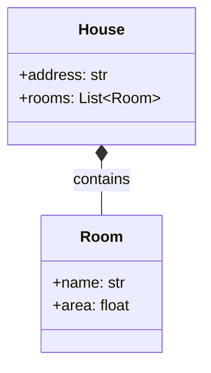

**Arrow notation**: Solid line with **filled (solid) diamond** on the "whole" side.

**Key point**: Rooms cannot exist without a House. When the House is destroyed, all its Rooms are destroyed.

**Code equivalent**:
```python
class House:
    def __init__(self, address: str, num_rooms: int):
        self.address = address
        self.rooms = [Room(f"Room-{i}") for i in range(num_rooms)]  # Created internally
```

---

#### Aggregation vs Composition -- Quick Decision Guide

| Question | Aggregation | Composition |
|----------|-------------|-------------|
| Can the part exist without the whole? | Yes | No |
| Who creates the part? | External (passed in) | The whole (internally) |
| Lifetime coupled? | No | Yes |
| Diamond style | Empty ◇ | Filled ◆ |
| Example | Team ◇-- Player | Order ◆-- OrderItem |

---

#### 1.4.4 Inheritance / Generalization (is-a) -- Empty Triangle

A child class inherits from a parent class. This is the "is-a" relationship.

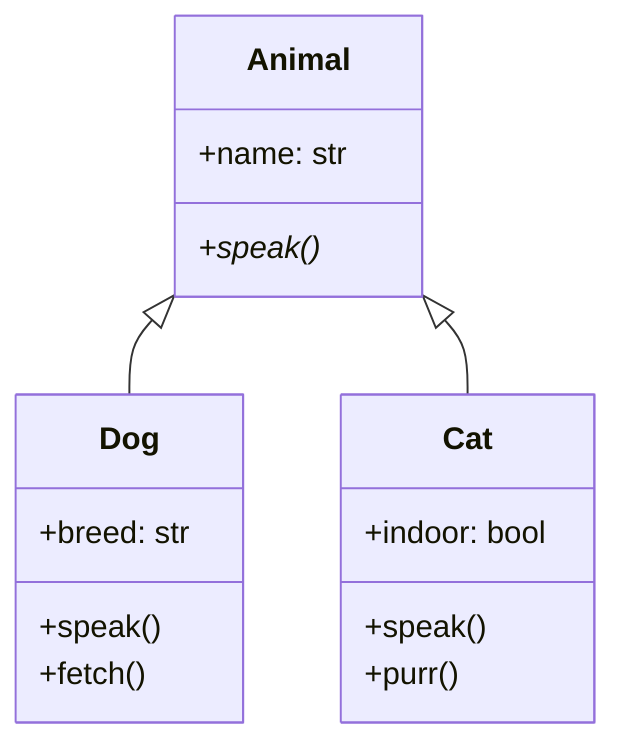

**Arrow notation**: Solid line with **empty (hollow) triangle** pointing toward the parent.

**Code equivalent**:
```python
class Animal(ABC):
    def __init__(self, name: str):
        self.name = name

    @abstractmethod
    def speak(self) -> str:
        pass

class Dog(Animal):
    def speak(self) -> str:
        return "Woof!"
```

---

#### 1.4.5 Realization / Implementation -- Dashed Line, Empty Triangle

A class implements an interface. Similar to inheritance but for interfaces.

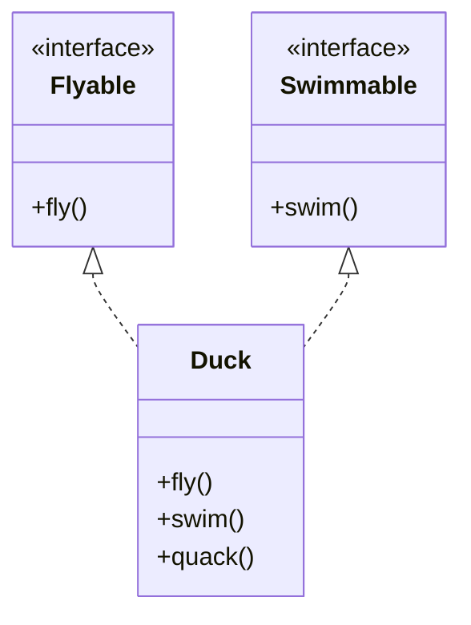

**Arrow notation**: **Dashed** line with **empty (hollow) triangle** pointing toward the interface.

**Code equivalent**:
```python
from abc import ABC, abstractmethod

class Flyable(ABC):
    @abstractmethod
    def fly(self) -> None:
        pass

class Swimmable(ABC):
    @abstractmethod
    def swim(self) -> None:
        pass

class Duck(Flyable, Swimmable):
    def fly(self) -> None:
        print("Flying")

    def swim(self) -> None:
        print("Swimming")
```

---

#### 1.4.6 Dependency (uses) -- Dashed Arrow

A weak relationship where a class **uses** another class, typically as a method parameter, local variable, or return type. Changes to the depended-on class may affect the dependent class.

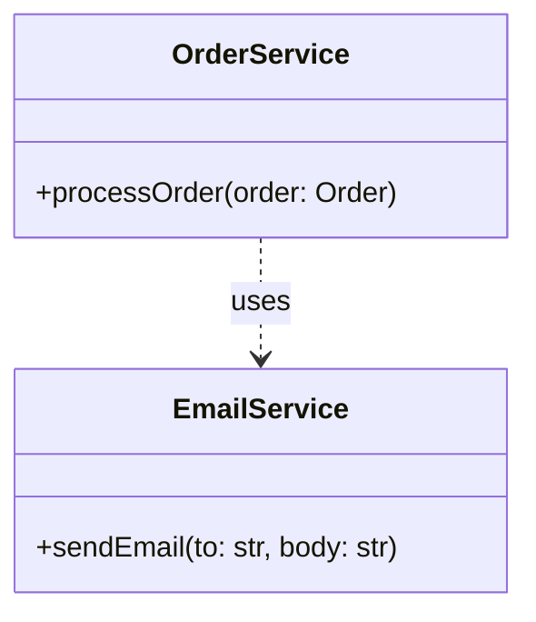

**Arrow notation**: **Dashed** line with a simple **arrow** (not a triangle).

**Code equivalent**:
```python
class OrderService:
    def process_order(self, order: Order):
        # Uses EmailService but does not store a reference
        email_service = EmailService()
        email_service.send_email(order.customer_email, "Order confirmed")
```

---

### 1.5 Relationship Summary Table

| Relationship | Line Style | Arrow/End | Memory Aid |
|-------------|-----------|-----------|------------|
| Association | Solid | Arrow → | "knows about" |
| Aggregation | Solid | Empty diamond ◇ | "has-a (weak)" |
| Composition | Solid | Filled diamond ◆ | "has-a (strong)" |
| Inheritance | Solid | Empty triangle △ | "is-a" |
| Realization | Dashed | Empty triangle △ | "implements" |
| Dependency | Dashed | Arrow → | "uses temporarily" |

**Memory trick**:
- **Solid line** = stronger relationship (structural)
- **Dashed line** = weaker relationship (behavioral)
- **Triangle** = hierarchy (inheritance/implementation)
- **Diamond** = ownership (aggregation/composition)
- **Arrow** = direction of knowledge/dependency

---

### 1.6 Multiplicity Notation

Multiplicity specifies how many instances of one class relate to another.

| Notation | Meaning |
|----------|---------|
| `1` | Exactly one |
| `0..1` | Zero or one (optional) |
| `*` or `0..*` | Zero or more |
| `1..*` | One or more |
| `n` | Exactly n |
| `m..n` | Between m and n |

Example usage:
```
Order "1" *-- "1..*" OrderItem : contains
Customer "1" --> "0..*" Order : places
```

Read as: "One Order contains one or more OrderItems" and "One Customer places zero or more Orders."

---

### 1.7 Complete Example: E-Commerce System

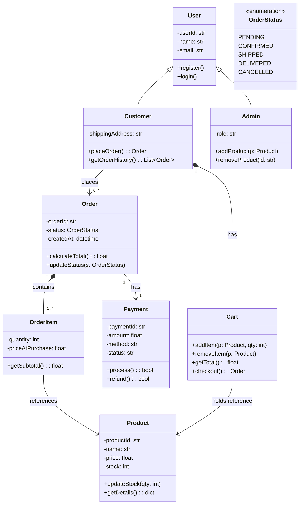

---

### 1.8 Complete Example: Library Management System

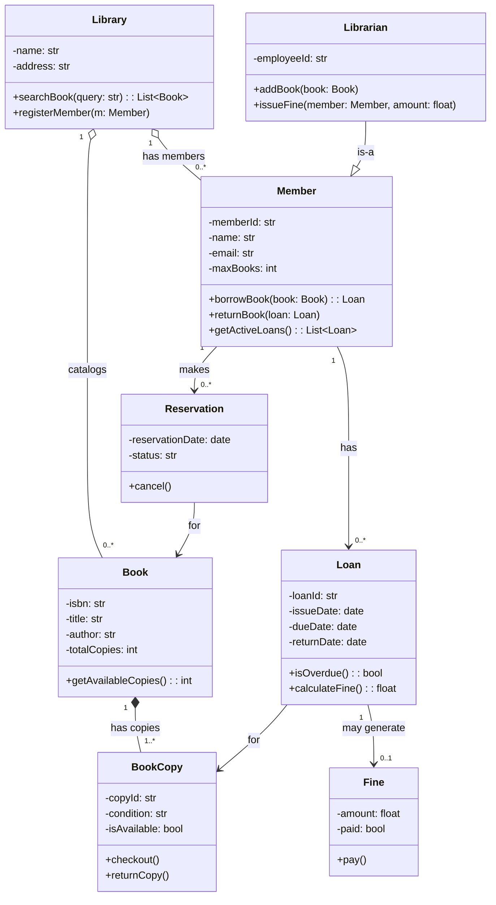

---

## 2. Sequence Diagrams

Sequence diagrams show **how objects interact over time**. They are the second most important UML diagram in interviews.

### 2.1 Core Elements

| Element | Description | Notation |
|---------|-------------|----------|
| **Lifeline** | Vertical dashed line representing an object's existence over time | Rectangle on top, dashed line below |
| **Activation Bar** | Thin rectangle on a lifeline showing when an object is active | Solid rectangle on the lifeline |
| **Synchronous Message** | Caller waits for a response | Solid line with filled arrowhead → |
| **Asynchronous Message** | Caller does NOT wait | Solid line with open arrowhead ->> |
| **Return Message** | Response back to caller | Dashed line with arrow -->> |
| **Self Message** | Object calling its own method | Arrow looping back to same lifeline |

### 2.2 Combined Fragments

Fragments represent control flow within a sequence diagram:

| Fragment | Meaning | Use Case |
|----------|---------|----------|
| `alt` | If-else (alternative) | Two or more conditional paths |
| `opt` | Optional (if without else) | Something that may or may not happen |
| `loop` | Iteration | Repeating a sequence |
| `par` | Parallel | Concurrent execution |
| `break` | Break out of loop | Early exit from enclosing loop |
| `ref` | Reference to another diagram | Modularizing complex flows |

---

### 2.3 Example: User Login Flow

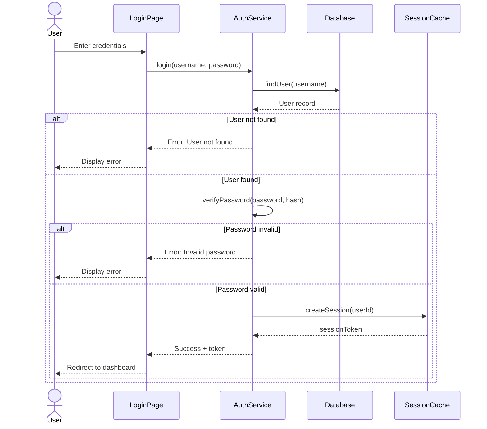

---

### 2.4 Example: Order Placement Flow

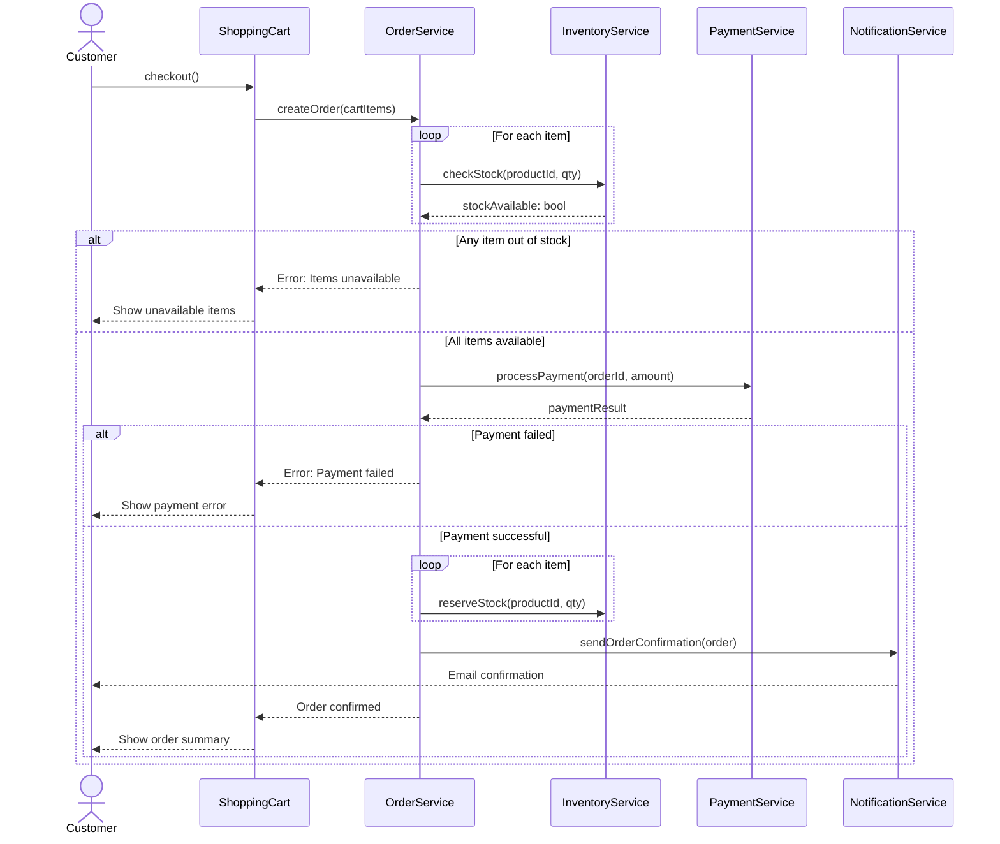

---

### 2.5 Example: Payment Processing Flow

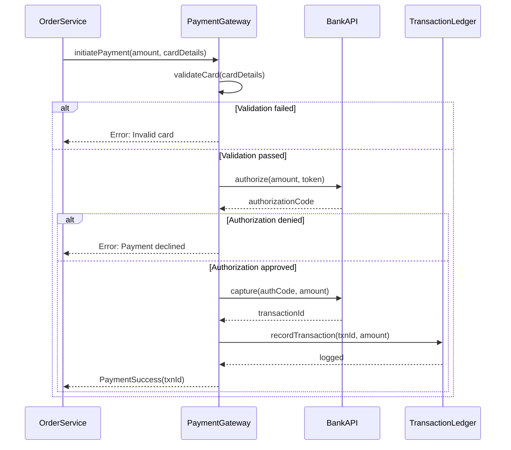

---

## 3. State Diagrams

State diagrams show the **lifecycle of a single object** through its various states and the transitions between them.

### 3.1 Core Elements

| Element | Description |
|---------|-------------|
| **State** | A condition or situation during the life of an object |
| **Transition** | A change from one state to another |
| **Guard** | A boolean condition that must be true for a transition `[condition]` |
| **Action** | An operation performed during a transition `/ action` |
| **Initial State** | Filled black circle |
| **Final State** | Filled black circle inside a circle (bullseye) |

Transition notation: `event [guard] / action`

---

### 3.2 Example: Order Lifecycle

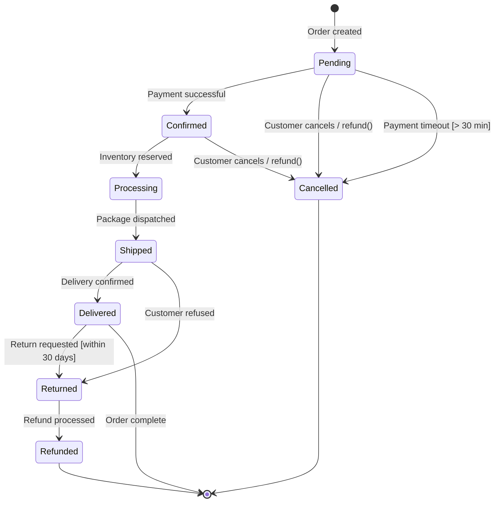

---

### 3.3 Example: Traffic Light System

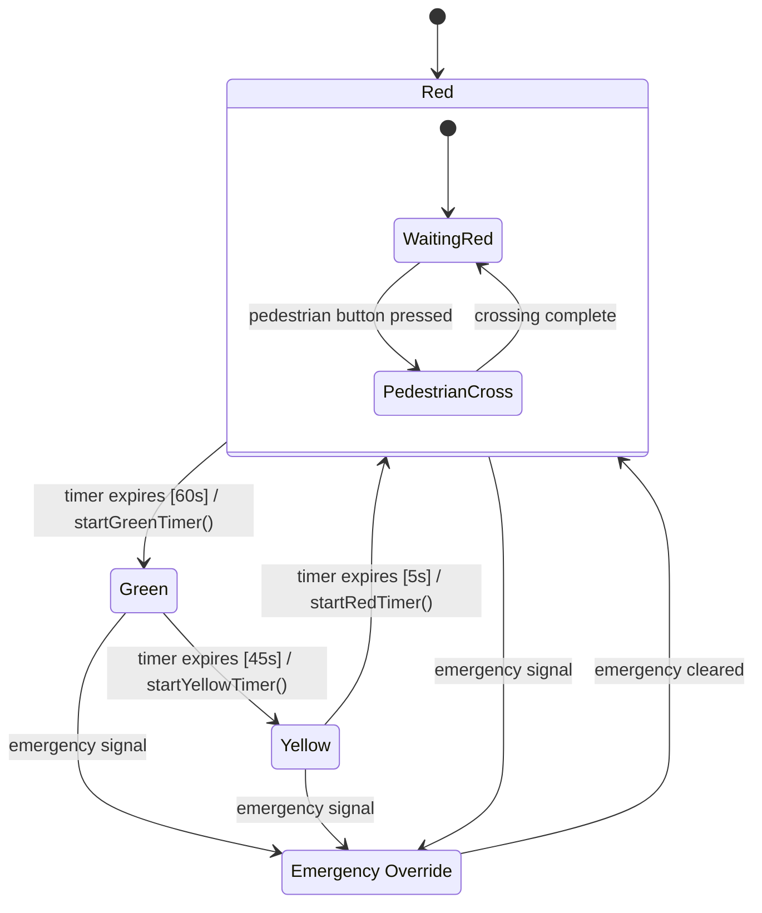

---

### 3.4 Example: ATM Machine States

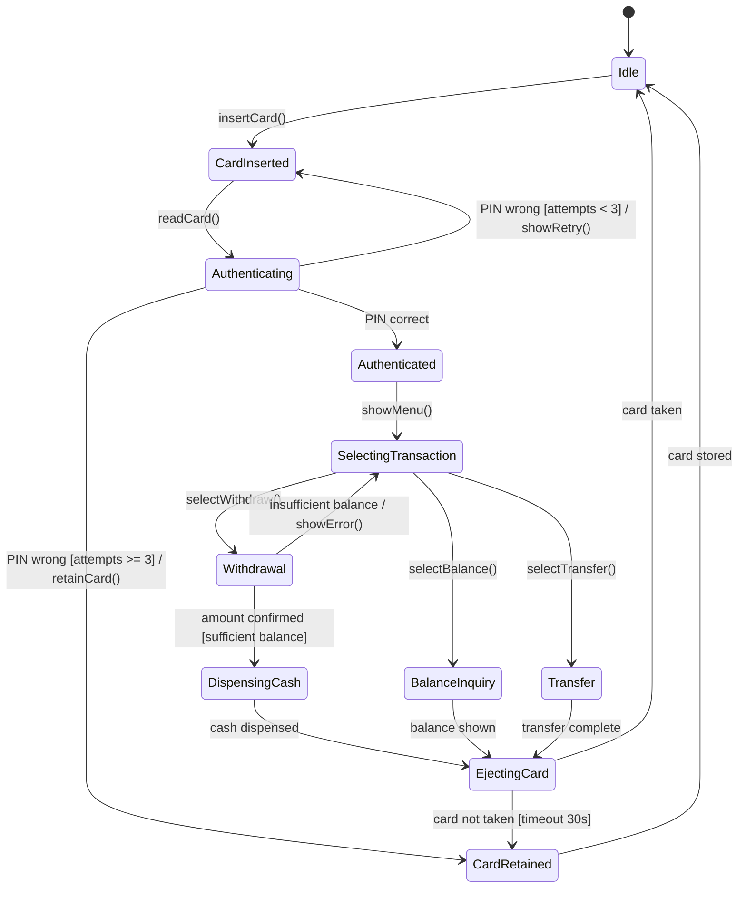

---

## 4. Activity Diagrams

Activity diagrams model **workflows and business processes**. Think of them as advanced flowcharts with support for parallelism.

### 4.1 Core Elements

| Element | Symbol | Description |
|---------|--------|-------------|
| **Action** | Rounded rectangle | A single step in the process |
| **Decision** | Diamond | Branch based on condition |
| **Merge** | Diamond | Rejoin branches |
| **Fork** | Thick horizontal bar | Split into parallel paths |
| **Join** | Thick horizontal bar | Synchronize parallel paths |
| **Initial Node** | Filled circle | Start of activity |
| **Final Node** | Bullseye | End of activity |
| **Swimlane** | Vertical partition | Assigns responsibility to actor/component |

---

### 4.2 Example: E-Commerce Checkout Process

```
┌──────────────────────────────────────────────────────────────────┐
│  Customer          │  OrderService      │  PaymentService        │
├──────────────────────────────────────────────────────────────────┤
│                    │                    │                        │
│  ● (start)         │                    │                        │
│  │                 │                    │                        │
│  ▼                 │                    │                        │
│ ┌──────────────┐   │                    │                        │
│ │ Review Cart  │   │                    │                        │
│ └──────┬───────┘   │                    │                        │
│        │           │                    │                        │
│        ▼           │                    │                        │
│ ┌──────────────┐   │                    │                        │
│ │Enter Shipping│   │                    │                        │
│ │   Address    │   │                    │                        │
│ └──────┬───────┘   │                    │                        │
│        │           │                    │                        │
│        ▼           │                    │                        │
│ ┌──────────────┐   │                    │                        │
│ │Select Payment│──────────────────────────▶┌─────────────────┐  │
│ │   Method     │   │                    │  │Validate Payment │  │
│ └──────────────┘   │                    │  │    Details      │  │
│                    │                    │  └───────┬─────────┘  │
│                    │                    │          │             │
│                    │                    │     ◆ (decision)      │
│                    │                    │    ╱ ╲                 │
│                    │                    │  valid?               │
│                    │                    │  ╱     ╲              │
│                    │  ┌──────────────┐  │ yes     no            │
│                    │  │ Create Order │◀─┤─┘       │             │
│                    │  └──────┬───────┘  │    ┌────┴─────┐      │
│                    │         │          │    │Show Error │      │
│                    │    ═════╤═════     │    └──────────┘      │
│                    │    (fork)          │                        │
│                    │   ╱         ╲      │                        │
│                    │  ▼           ▼     │                        │
│                    │┌────────┐┌───────┐ │                        │
│                    ││Reserve ││Charge │ │                        │
│                    ││Stock   ││Card   │ │                        │
│                    │└───┬────┘└───┬───┘ │                        │
│                    │    ╲       ╱       │                        │
│                    │    ═════╧═════     │                        │
│                    │    (join)          │                        │
│                    │         │          │                        │
│                    │         ▼          │                        │
│  ┌──────────────┐  │  ┌──────────────┐ │                        │
│  │Receive Email │◀────│Send Confirm  │ │                        │
│  │ Confirmation │  │  │   Email      │ │                        │
│  └──────┬───────┘  │  └──────────────┘ │                        │
│         │          │                    │                        │
│         ◉ (end)    │                    │                        │
└──────────────────────────────────────────────────────────────────┘
```

Key points to note:
- **Swimlanes** separate responsibilities (Customer, OrderService, PaymentService)
- **Fork/Join** shows parallel activities (reserve stock AND charge card happen simultaneously)
- **Decision diamond** shows conditional branching

---

## 5. Use Case Diagrams

Use case diagrams show **what** a system does from the user's perspective. They are high-level and do NOT show implementation details.

### 5.1 Core Elements

| Element | Description |
|---------|-------------|
| **Actor** | A person or external system that interacts with the system (stick figure) |
| **Use Case** | A functionality provided by the system (oval) |
| **System Boundary** | Rectangle enclosing use cases (shows scope) |
| **Association** | Line connecting actor to use case |
| **Include** | A use case always includes another `<<include>>` (dashed arrow) |
| **Extend** | A use case optionally extends another `<<extend>>` (dashed arrow) |
| **Generalization** | Inheritance between actors or use cases |

**Include vs Extend**:
- `<<include>>` = mandatory sub-behavior. "Login **always includes** Validate Credentials"
- `<<extend>>` = optional behavior. "Checkout **may extend** to Apply Coupon"

Direction of arrows:
- **Include**: Base use case --include--> Included use case
- **Extend**: Extending use case --extend--> Base use case

---

### 5.2 Example: Banking System

```
┌─────────────────────────────────────────────────────────────────────┐
│                        Banking System                               │
│                                                                     │
│    ┌──────────────────┐                                             │
│    │  Check Balance   │                                             │
│    └──────────────────┘                                             │
│              △                                                      │
│    ┌──────────────────┐         ┌──────────────────┐                │
│    │  Withdraw Cash   │────────▶│ Validate Account │ <<include>>    │
│    └──────────────────┘         └──────────────────┘                │
│              │                            △                         │
│    ┌──────────────────┐         ┌──────────────────┐                │
│    │  Deposit Funds   │────────▶│  Authenticate    │ <<include>>    │
│    └──────────────────┘         └──────────────────┘                │
│                                                                     │
│    ┌──────────────────┐         ┌──────────────────┐                │
│    │ Transfer Funds   │◁╌╌╌╌╌╌╌│  Send Receipt    │ <<extend>>     │
│    └──────────────────┘         └──────────────────┘                │
│                                                                     │
│    ┌──────────────────┐                                             │
│    │  View Statement  │                                             │
│    └──────────────────┘                                             │
│                                                                     │
│    ┌──────────────────┐         ┌──────────────────┐                │
│    │  Manage Users    │────────▶│  Audit Log       │ <<include>>    │
│    └──────────────────┘         └──────────────────┘                │
│                                                                     │
│    ┌──────────────────┐                                             │
│    │ Generate Reports │                                             │
│    └──────────────────┘                                             │
└─────────────────────────────────────────────────────────────────────┘

Actors:
  🧑 Customer ──── Check Balance, Withdraw Cash, Deposit Funds, Transfer Funds, View Statement
  👔 Bank Admin ── Manage Users, Generate Reports
  🏦 ATM System ── Withdraw Cash, Check Balance, Deposit Funds
```

---

## 6. How to Draw UML in Interviews

### 6.1 What Interviewers Actually Look For

1. **Correct identification of classes** -- Can you decompose the problem into the right set of classes?
2. **Appropriate relationships** -- Do you understand the difference between composition and aggregation? When to use inheritance vs composition?
3. **Key attributes and methods** -- Not every getter/setter, but the important domain methods
4. **Multiplicity** -- Understanding of cardinality between classes
5. **Clean, readable diagrams** -- Even on a whiteboard, organization matters

### 6.2 What Interviewers Do NOT Care About

- Perfect UML syntax (close enough is fine)
- Every single attribute and method
- Decorative elements
- Every relationship type being used

### 6.3 Step-by-Step Approach (5-7 minutes)

**Step 1: Identify Core Entities (1-2 min)**
- List the main nouns from the problem description
- These become your classes
- Example for Parking Lot: ParkingLot, Floor, ParkingSpot, Vehicle, Ticket, Payment

**Step 2: Identify Relationships (1-2 min)**
- Ask: "Does A contain B?" (composition/aggregation)
- Ask: "Is A a type of B?" (inheritance)
- Ask: "Does A use B?" (association/dependency)
- Add multiplicity where obvious

**Step 3: Add Key Attributes (1 min)**
- Only the important ones (IDs, status, key domain fields)
- Use correct visibility (private by default, public for interface)

**Step 4: Add Key Methods (1-2 min)**
- Focus on domain behavior, not getters/setters
- Think about what each class is responsible for

**Step 5: Review and Refine (1 min)**
- Check for SRP violations (classes doing too much)
- Check for missing relationships
- Verify the diagram answers the original question

### 6.4 Quick Notation Cheat Sheet for Whiteboard

```
Class:          [ClassName | attributes | methods]
Inheritance:    ──────▷  (solid line, hollow triangle)
Implementation: ╌╌╌╌╌▷  (dashed line, hollow triangle)
Composition:    ◆──────  (filled diamond)
Aggregation:    ◇──────  (hollow diamond)
Association:    ───────▶ (solid line, arrow)
Dependency:     ╌╌╌╌╌╌▶ (dashed line, arrow)
```

### 6.5 Common Mistakes to Avoid

1. **Using inheritance where composition is better** -- "Square inherits Rectangle" is a classic trap
2. **Missing key classes** -- Forgetting abstract base classes or interfaces
3. **God classes** -- One class with too many responsibilities
4. **Skipping multiplicity** -- Always annotate relationships with cardinality
5. **Confusing aggregation and composition** -- Ask "can the part live without the whole?"
6. **Forgetting enums** -- Status fields should often be enums, not strings
7. **No interfaces** -- If you have a Strategy or Observer pattern, show the interface

---

## Quick Reference Card

```
RELATIONSHIPS (from strongest to weakest):
  Composition  ◆────  "owns, creates, controls lifetime"
  Aggregation  ◇────  "has, but doesn't own"
  Association  ─────▶ "knows about, references"
  Dependency   ╌╌╌╌▶  "uses temporarily"

HIERARCHY:
  Inheritance     ──▷  "is-a"
  Implementation  ╌╌▷  "can-do" (interface)

VISIBILITY:
  + public   - private   # protected   ~ package

MULTIPLICITY:
  1    0..1    0..*    1..*

DIAGRAM PRIORITY FOR INTERVIEWS:
  1. Class Diagram       (always draw this)
  2. Sequence Diagram    (draw for complex flows)
  3. State Diagram       (draw for stateful objects)
  4. Others              (rarely needed, mention verbally)
```

---

*Next: [Design Patterns](../04-Design-Patterns/README.md) | Back to [SOLID Principles](../02-SOLID-Principles/README.md)*
