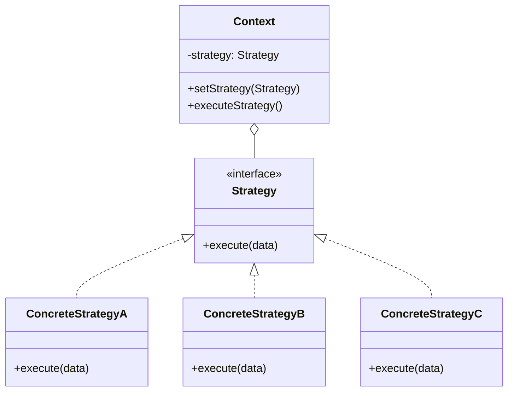
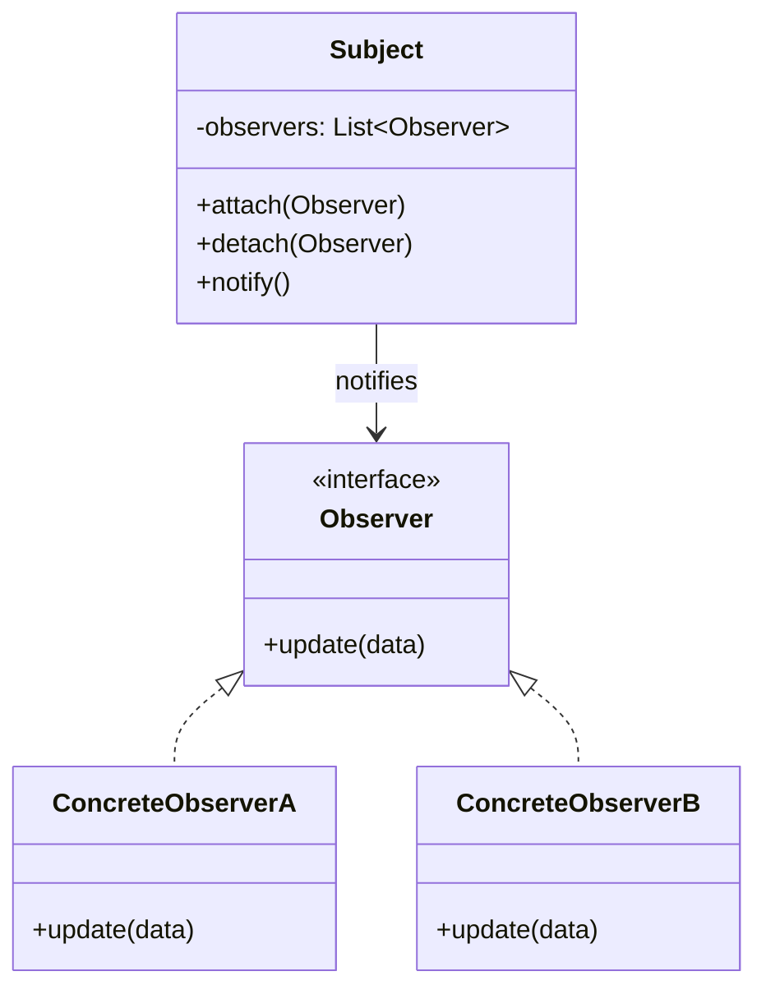
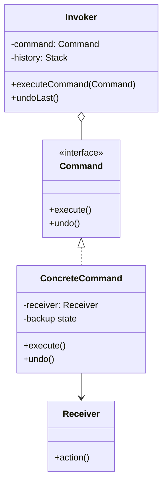
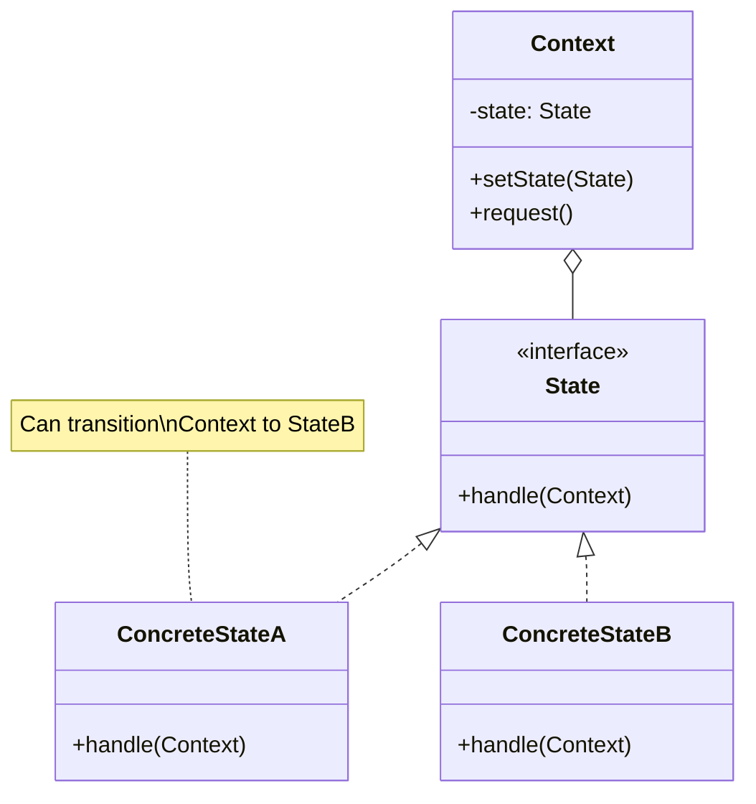
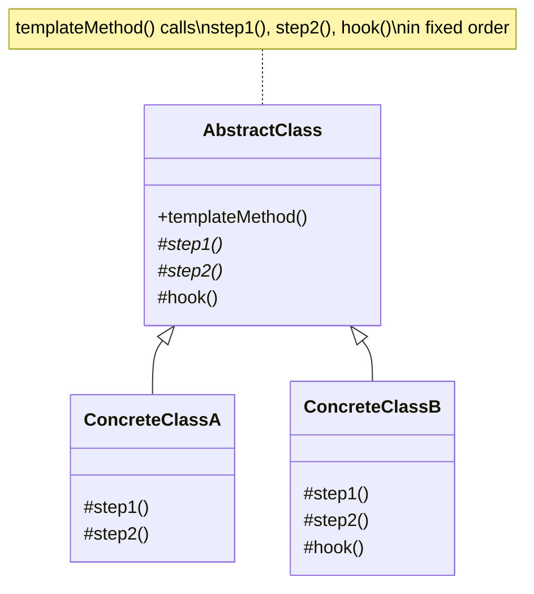
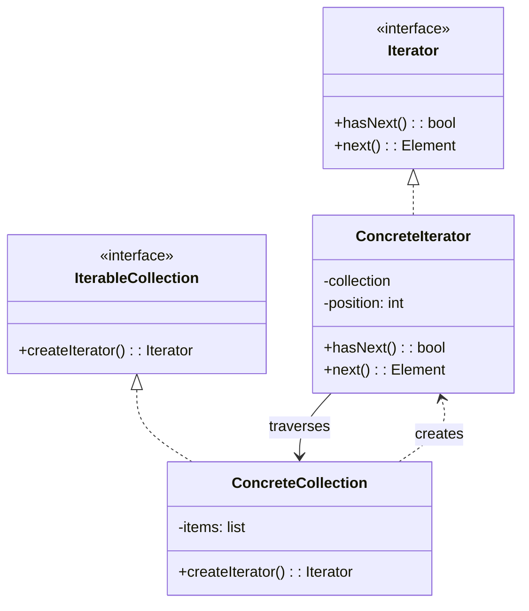
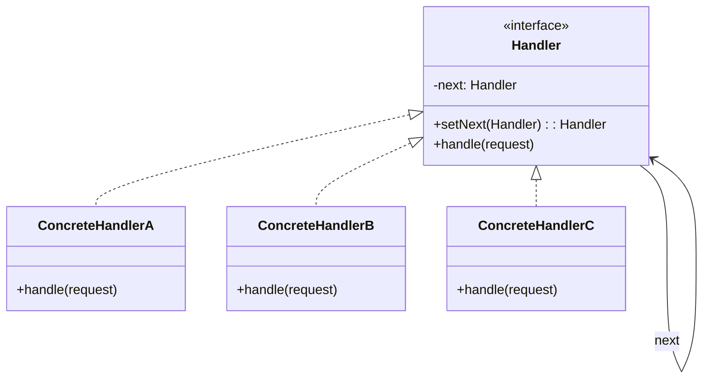
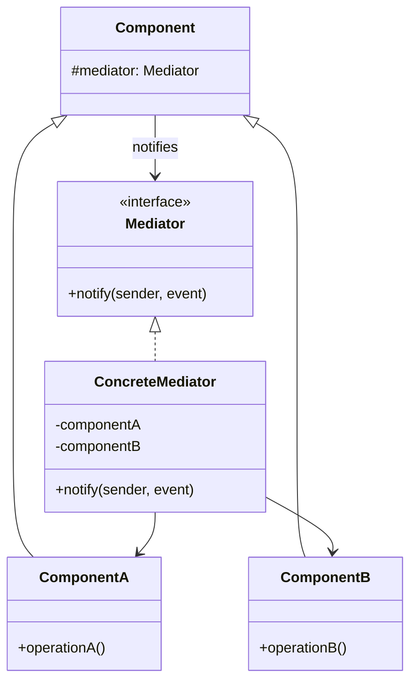
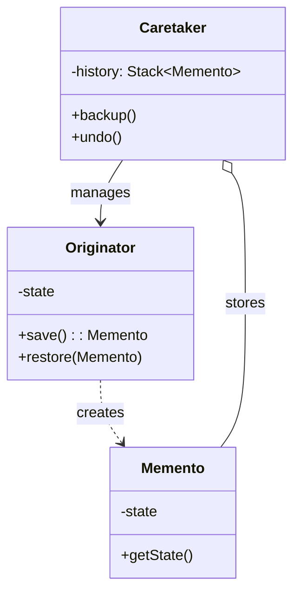
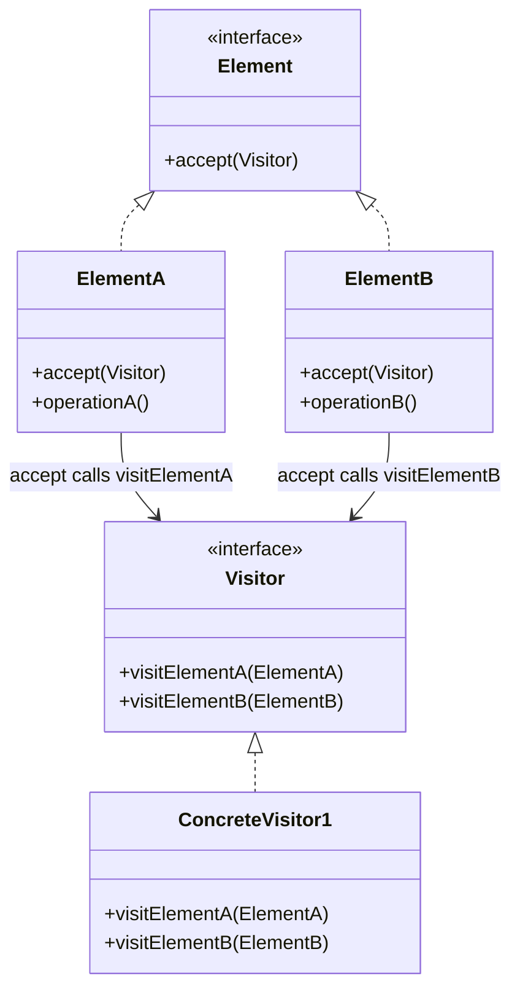

# Behavioral Design Patterns

Behavioral patterns are concerned with **algorithms and the assignment of responsibilities between objects**. They describe not just patterns of objects or classes but also the patterns of communication between them.

---

## Table of Contents
1. [Strategy Pattern](#1-strategy-pattern)
2. [Observer Pattern](#2-observer-pattern)
3. [Command Pattern](#3-command-pattern)
4. [State Pattern](#4-state-pattern)
5. [Template Method Pattern](#5-template-method-pattern)
6. [Iterator Pattern](#6-iterator-pattern)
7. [Chain of Responsibility Pattern](#7-chain-of-responsibility-pattern)
8. [Mediator Pattern](#8-mediator-pattern)
9. [Memento Pattern](#9-memento-pattern)
10. [Visitor Pattern](#10-visitor-pattern)
11. [Pattern Comparison Table](#pattern-comparison-table)

---

## 1. Strategy Pattern

### Intent
Define a family of algorithms, encapsulate each one, and make them **interchangeable**. Strategy lets the algorithm vary independently from clients that use it.

### Problem
You have a navigation app. Initially it only builds routes for cars. Then you add walking routes, public transit, cycling... Each routing algorithm is different and growing. Putting all algorithms in one class creates a monster.

### Class Diagram



### Code Example: Payment Processing

**Python:**
```python
from abc import ABC, abstractmethod

class PaymentStrategy(ABC):
    @abstractmethod
    def pay(self, amount: float) -> str:
        pass

    @abstractmethod
    def validate(self) -> bool:
        pass

class CreditCardPayment(PaymentStrategy):
    def __init__(self, card_number: str, cvv: str, expiry: str):
        self._card = card_number
        self._cvv = cvv
        self._expiry = expiry

    def validate(self) -> bool:
        return len(self._card) == 16 and len(self._cvv) == 3

    def pay(self, amount: float) -> str:
        if not self.validate():
            return "Invalid credit card"
        masked = "****" + self._card[-4:]
        return f"Paid ${amount:.2f} via Credit Card {masked}"

class PayPalPayment(PaymentStrategy):
    def __init__(self, email: str):
        self._email = email

    def validate(self) -> bool:
        return "@" in self._email

    def pay(self, amount: float) -> str:
        if not self.validate():
            return "Invalid PayPal email"
        return f"Paid ${amount:.2f} via PayPal ({self._email})"

class CryptoPayment(PaymentStrategy):
    def __init__(self, wallet_address: str):
        self._wallet = wallet_address

    def validate(self) -> bool:
        return len(self._wallet) > 20

    def pay(self, amount: float) -> str:
        if not self.validate():
            return "Invalid wallet address"
        return f"Paid ${amount:.2f} via Crypto to {self._wallet[:8]}..."

class ShoppingCart:
    def __init__(self):
        self._items: list[tuple[str, float]] = []
        self._payment_strategy: PaymentStrategy | None = None

    def add_item(self, name: str, price: float):
        self._items.append((name, price))

    def total(self) -> float:
        return sum(price for _, price in self._items)

    def set_payment(self, strategy: PaymentStrategy):
        self._payment_strategy = strategy

    def checkout(self) -> str:
        if not self._payment_strategy:
            return "No payment method selected"
        if not self._items:
            return "Cart is empty"
        return self._payment_strategy.pay(self.total())

# Usage - swap strategies at runtime
cart = ShoppingCart()
cart.add_item("Keyboard", 79.99)
cart.add_item("Mouse", 49.99)

cart.set_payment(CreditCardPayment("1234567890123456", "123", "12/25"))
print(cart.checkout())  # Paid $129.98 via Credit Card ****3456

cart.set_payment(PayPalPayment("user@example.com"))
print(cart.checkout())  # Paid $129.98 via PayPal (user@example.com)
```

### Code Example: Sorting Strategies

**Python:**
```python
class SortStrategy(ABC):
    @abstractmethod
    def sort(self, data: list) -> list:
        pass

    @abstractmethod
    def name(self) -> str:
        pass

class BubbleSort(SortStrategy):
    def name(self) -> str:
        return "Bubble Sort"

    def sort(self, data: list) -> list:
        arr = data[:]
        n = len(arr)
        for i in range(n):
            for j in range(0, n - i - 1):
                if arr[j] > arr[j + 1]:
                    arr[j], arr[j + 1] = arr[j + 1], arr[j]
        return arr

class QuickSort(SortStrategy):
    def name(self) -> str:
        return "Quick Sort"

    def sort(self, data: list) -> list:
        if len(data) <= 1:
            return data
        pivot = data[len(data) // 2]
        left = [x for x in data if x < pivot]
        mid = [x for x in data if x == pivot]
        right = [x for x in data if x > pivot]
        return self.sort(left) + mid + self.sort(right)

class Sorter:
    def __init__(self, strategy: SortStrategy):
        self._strategy = strategy

    def sort(self, data: list) -> list:
        print(f"Sorting with {self._strategy.name()}")
        return self._strategy.sort(data)

# Auto-select strategy based on data size
data = [64, 34, 25, 12, 22, 11, 90]
strategy = BubbleSort() if len(data) < 50 else QuickSort()
sorter = Sorter(strategy)
print(sorter.sort(data))
```

### Python Shortcut: Functions as Strategies

```python
# In Python, you often don't need classes for Strategy.
# Functions are first-class objects.

def pay_credit_card(amount):
    return f"CC: ${amount:.2f}"

def pay_paypal(amount):
    return f"PayPal: ${amount:.2f}"

def checkout(amount, payment_fn):
    return payment_fn(amount)

print(checkout(99.99, pay_credit_card))
print(checkout(99.99, pay_paypal))
```

### Interview Questions

**Q: Strategy vs State pattern?**
> Similar structure but different intent. Strategy selects an algorithm to use (client typically chooses). State changes behavior based on internal object state (state transitions happen internally). State objects often know about each other; strategies don't.

**Q: When should you use Strategy?**
> When you have multiple algorithms for a task and want to switch between them at runtime. When you want to isolate algorithm-specific code from the business logic. When a class has a massive conditional that switches between algorithm variants.

---

## 2. Observer Pattern

### Intent
Define a **one-to-many dependency** between objects so that when one object changes state, all its dependents are notified and updated automatically.

### Class Diagram



### Code Example: Event System

**Python:**
```python
from abc import ABC, abstractmethod
from typing import Any

class EventManager:
    """Subject: manages subscriptions and notifications"""
    def __init__(self):
        self._listeners: dict[str, list] = {}

    def subscribe(self, event_type: str, listener):
        if event_type not in self._listeners:
            self._listeners[event_type] = []
        self._listeners[event_type].append(listener)

    def unsubscribe(self, event_type: str, listener):
        if event_type in self._listeners:
            self._listeners[event_type].remove(listener)

    def notify(self, event_type: str, data: Any = None):
        for listener in self._listeners.get(event_type, []):
            listener.update(event_type, data)

class EventListener(ABC):
    @abstractmethod
    def update(self, event_type: str, data: Any):
        pass

class LoggingListener(EventListener):
    def __init__(self, log_file: str):
        self._log_file = log_file

    def update(self, event_type: str, data: Any):
        print(f"[LOG -> {self._log_file}] Event: {event_type}, Data: {data}")

class EmailListener(EventListener):
    def __init__(self, email: str):
        self._email = email

    def update(self, event_type: str, data: Any):
        print(f"[EMAIL -> {self._email}] Event: {event_type}, Data: {data}")

class SlackListener(EventListener):
    def __init__(self, channel: str):
        self._channel = channel

    def update(self, event_type: str, data: Any):
        print(f"[SLACK #{self._channel}] Event: {event_type}, Data: {data}")

# --- Editor uses the event system ---
class Editor:
    def __init__(self):
        self.events = EventManager()
        self._filename = ""

    def open_file(self, path: str):
        self._filename = path
        self.events.notify("open", path)

    def save_file(self):
        self.events.notify("save", self._filename)

# Usage
editor = Editor()
logger = LoggingListener("editor.log")
emailer = EmailListener("admin@company.com")
slack = SlackListener("dev-team")

editor.events.subscribe("open", logger)
editor.events.subscribe("save", logger)
editor.events.subscribe("save", emailer)
editor.events.subscribe("save", slack)

editor.open_file("report.txt")
# [LOG -> editor.log] Event: open, Data: report.txt

editor.save_file()
# [LOG -> editor.log] Event: save, Data: report.txt
# [EMAIL -> admin@company.com] Event: save, Data: report.txt
# [SLACK #dev-team] Event: save, Data: report.txt
```

### Code Example: Stock Price Alerts

**Python:**
```python
class Stock:
    def __init__(self, symbol: str, price: float):
        self.symbol = symbol
        self._price = price
        self._observers: list = []

    def attach(self, observer):
        self._observers.append(observer)

    def detach(self, observer):
        self._observers.remove(observer)

    @property
    def price(self):
        return self._price

    @price.setter
    def price(self, value: float):
        old = self._price
        self._price = value
        if old != value:
            self._notify(old, value)

    def _notify(self, old_price, new_price):
        for obs in self._observers:
            obs.on_price_change(self.symbol, old_price, new_price)

class PriceAlert:
    def __init__(self, name: str, threshold: float, direction: str = "above"):
        self.name = name
        self.threshold = threshold
        self.direction = direction

    def on_price_change(self, symbol, old_price, new_price):
        if self.direction == "above" and new_price > self.threshold:
            print(f"[ALERT {self.name}] {symbol} rose above ${self.threshold}: ${new_price}")
        elif self.direction == "below" and new_price < self.threshold:
            print(f"[ALERT {self.name}] {symbol} dropped below ${self.threshold}: ${new_price}")

class PortfolioTracker:
    def __init__(self):
        self.portfolio_value = 0

    def on_price_change(self, symbol, old_price, new_price):
        change = new_price - old_price
        self.portfolio_value += change
        direction = "UP" if change > 0 else "DOWN"
        print(f"[PORTFOLIO] {symbol} {direction} ${abs(change):.2f}")

# Usage
aapl = Stock("AAPL", 150.0)
aapl.attach(PriceAlert("Buy Signal", 155.0, "above"))
aapl.attach(PriceAlert("Stop Loss", 140.0, "below"))
aapl.attach(PortfolioTracker())

aapl.price = 156.0  # Triggers "above 155" alert
aapl.price = 139.0  # Triggers "below 140" alert
```

**Java:**
```java
import java.util.*;

interface Observer {
    void update(String event, Object data);
}

class EventManager {
    private Map<String, List<Observer>> listeners = new HashMap<>();

    public void subscribe(String event, Observer o) {
        listeners.computeIfAbsent(event, k -> new ArrayList<>()).add(o);
    }

    public void notify(String event, Object data) {
        for (Observer o : listeners.getOrDefault(event, List.of())) {
            o.update(event, data);
        }
    }
}
```

### Interview Questions

**Q: Push vs Pull model in Observer?**
> Push: Subject sends detailed data with the notification. Pull: Subject sends minimal notification; observers query the subject for details. Push is simpler but may send unnecessary data. Pull is more flexible.

**Q: How do you handle observer ordering and failures?**
> Don't guarantee order. For failures, catch exceptions per-observer to prevent one broken observer from blocking others. Consider async notification for performance.

---

## 3. Command Pattern

### Intent
Encapsulate a request as an object, thereby letting you parameterize clients with different requests, queue or log requests, and support **undoable operations**.

### Class Diagram



### Code Example: Remote Control with Undo

**Python:**
```python
from abc import ABC, abstractmethod

class Command(ABC):
    @abstractmethod
    def execute(self) -> str:
        pass

    @abstractmethod
    def undo(self) -> str:
        pass

# --- Receivers ---
class Light:
    def __init__(self, location: str):
        self.location = location
        self.is_on = False
        self.brightness = 100

    def turn_on(self):
        self.is_on = True
        return f"{self.location} light ON"

    def turn_off(self):
        self.is_on = False
        return f"{self.location} light OFF"

    def dim(self, level):
        self.brightness = level
        return f"{self.location} light dimmed to {level}%"

class Thermostat:
    def __init__(self):
        self.temperature = 68

    def set_temp(self, temp):
        old = self.temperature
        self.temperature = temp
        return f"Thermostat: {old}F -> {temp}F"

# --- Concrete Commands ---
class LightOnCommand(Command):
    def __init__(self, light: Light):
        self._light = light

    def execute(self) -> str:
        return self._light.turn_on()

    def undo(self) -> str:
        return self._light.turn_off()

class LightOffCommand(Command):
    def __init__(self, light: Light):
        self._light = light

    def execute(self) -> str:
        return self._light.turn_off()

    def undo(self) -> str:
        return self._light.turn_on()

class DimCommand(Command):
    def __init__(self, light: Light, level: int):
        self._light = light
        self._level = level
        self._prev_level = light.brightness

    def execute(self) -> str:
        self._prev_level = self._light.brightness
        return self._light.dim(self._level)

    def undo(self) -> str:
        return self._light.dim(self._prev_level)

class ThermostatCommand(Command):
    def __init__(self, thermostat: Thermostat, temp: int):
        self._thermo = thermostat
        self._temp = temp
        self._prev_temp = thermostat.temperature

    def execute(self) -> str:
        self._prev_temp = self._thermo.temperature
        return self._thermo.set_temp(self._temp)

    def undo(self) -> str:
        return self._thermo.set_temp(self._prev_temp)

class MacroCommand(Command):
    """Composite command: executes multiple commands"""
    def __init__(self, commands: list[Command]):
        self._commands = commands

    def execute(self) -> str:
        results = [cmd.execute() for cmd in self._commands]
        return " | ".join(results)

    def undo(self) -> str:
        results = [cmd.undo() for cmd in reversed(self._commands)]
        return " | ".join(results)

# --- Invoker ---
class RemoteControl:
    def __init__(self):
        self._history: list[Command] = []
        self._redo_stack: list[Command] = []

    def press(self, command: Command) -> str:
        result = command.execute()
        self._history.append(command)
        self._redo_stack.clear()
        return result

    def undo(self) -> str:
        if not self._history:
            return "Nothing to undo"
        command = self._history.pop()
        self._redo_stack.append(command)
        return command.undo()

    def redo(self) -> str:
        if not self._redo_stack:
            return "Nothing to redo"
        command = self._redo_stack.pop()
        self._history.append(command)
        return command.execute()

# Usage
living_room = Light("Living Room")
bedroom = Light("Bedroom")
thermostat = Thermostat()
remote = RemoteControl()

print(remote.press(LightOnCommand(living_room)))    # Living Room light ON
print(remote.press(DimCommand(living_room, 50)))     # Living Room light dimmed to 50%
print(remote.press(ThermostatCommand(thermostat, 72)))  # Thermostat: 68F -> 72F

print(remote.undo())  # Thermostat: 72F -> 68F
print(remote.undo())  # Living Room light dimmed to 100%
print(remote.redo())  # Living Room light dimmed to 50%

# Macro: "Good night" command
good_night = MacroCommand([
    LightOffCommand(living_room),
    LightOffCommand(bedroom),
    ThermostatCommand(thermostat, 65),
])
print(remote.press(good_night))
# Living Room light OFF | Bedroom light OFF | Thermostat: 68F -> 65F
```

**Java:**
```java
interface Command {
    void execute();
    void undo();
}

class LightOnCommand implements Command {
    private Light light;

    public LightOnCommand(Light light) { this.light = light; }

    public void execute() { light.turnOn(); }
    public void undo() { light.turnOff(); }
}

class RemoteControl {
    private Stack<Command> history = new Stack<>();

    public void press(Command cmd) {
        cmd.execute();
        history.push(cmd);
    }

    public void undo() {
        if (!history.isEmpty()) {
            history.pop().undo();
        }
    }
}
```

### Interview Questions

**Q: Command vs Strategy?**
> Similar structure (both encapsulate behavior in objects). Strategy: different ways to do the *same thing*. Command: different *things* to do, often with undo/queue support.

**Q: How does Command support undo?**
> Each command stores enough state before execution to reverse it. The invoker maintains a history stack. `undo()` restores the previous state. For complex undo, use the Memento pattern to save full snapshots.

---

## 4. State Pattern

### Intent
Allow an object to **alter its behavior when its internal state changes**. The object will appear to change its class.

### Class Diagram



### Code Example: Vending Machine

**Python:**
```python
from abc import ABC, abstractmethod

class VendingMachineState(ABC):
    @abstractmethod
    def insert_coin(self, machine: "VendingMachine") -> str: pass

    @abstractmethod
    def select_product(self, machine: "VendingMachine", product: str) -> str: pass

    @abstractmethod
    def dispense(self, machine: "VendingMachine") -> str: pass

    @abstractmethod
    def cancel(self, machine: "VendingMachine") -> str: pass

class NoCoinState(VendingMachineState):
    def insert_coin(self, machine, amount=1.0) -> str:
        machine.balance += amount
        machine.set_state(HasCoinState())
        return f"Coin inserted. Balance: ${machine.balance:.2f}"

    def select_product(self, machine, product) -> str:
        return "Please insert a coin first"

    def dispense(self, machine) -> str:
        return "Please insert a coin first"

    def cancel(self, machine) -> str:
        return "Nothing to cancel"

class HasCoinState(VendingMachineState):
    def insert_coin(self, machine, amount=1.0) -> str:
        machine.balance += amount
        return f"Another coin inserted. Balance: ${machine.balance:.2f}"

    def select_product(self, machine, product) -> str:
        if product not in machine.inventory:
            return f"Product '{product}' not available"
        price = machine.prices[product]
        if machine.balance < price:
            return f"Insufficient funds. Need ${price:.2f}, have ${machine.balance:.2f}"
        if machine.inventory[product] <= 0:
            return f"'{product}' is sold out"
        machine.selected_product = product
        machine.set_state(DispensingState())
        return f"Selected: {product} (${price:.2f})"

    def dispense(self, machine) -> str:
        return "Please select a product first"

    def cancel(self, machine) -> str:
        refund = machine.balance
        machine.balance = 0
        machine.set_state(NoCoinState())
        return f"Transaction cancelled. Refund: ${refund:.2f}"

class DispensingState(VendingMachineState):
    def insert_coin(self, machine, amount=1.0) -> str:
        return "Please wait, dispensing product..."

    def select_product(self, machine, product) -> str:
        return "Please wait, dispensing product..."

    def dispense(self, machine) -> str:
        product = machine.selected_product
        price = machine.prices[product]
        machine.inventory[product] -= 1
        machine.balance -= price
        change = machine.balance
        machine.balance = 0
        machine.selected_product = None

        if change > 0:
            result = f"Dispensing {product}. Change: ${change:.2f}"
        else:
            result = f"Dispensing {product}."

        machine.set_state(NoCoinState())
        return result

    def cancel(self, machine) -> str:
        return "Cannot cancel, dispensing in progress"

class VendingMachine:
    def __init__(self):
        self._state: VendingMachineState = NoCoinState()
        self.balance = 0.0
        self.selected_product = None
        self.inventory = {"Cola": 5, "Chips": 3, "Water": 10}
        self.prices = {"Cola": 1.50, "Chips": 1.00, "Water": 0.75}

    def set_state(self, state: VendingMachineState):
        self._state = state

    def insert_coin(self, amount=1.0):
        return self._state.insert_coin(self, amount)

    def select_product(self, product: str):
        return self._state.select_product(self, product)

    def dispense(self):
        return self._state.dispense(self)

    def cancel(self):
        return self._state.cancel(self)

# Usage
vm = VendingMachine()
print(vm.select_product("Cola"))   # Please insert a coin first
print(vm.insert_coin(1.0))         # Coin inserted. Balance: $1.00
print(vm.insert_coin(1.0))         # Another coin inserted. Balance: $2.00
print(vm.select_product("Cola"))   # Selected: Cola ($1.50)
print(vm.dispense())               # Dispensing Cola. Change: $0.50
```

### Code Example: Document Workflow

**Python:**
```python
class DocumentState(ABC):
    @abstractmethod
    def publish(self, doc: "Document") -> str: pass
    @abstractmethod
    def edit(self, doc: "Document", content: str) -> str: pass
    @abstractmethod
    def review(self, doc: "Document", approved: bool) -> str: pass

class DraftState(DocumentState):
    def publish(self, doc):
        doc.set_state(ReviewState())
        return "Document submitted for review"
    def edit(self, doc, content):
        doc.content = content
        return "Draft updated"
    def review(self, doc, approved):
        return "Cannot review a draft directly"

class ReviewState(DocumentState):
    def publish(self, doc):
        return "Already in review"
    def edit(self, doc, content):
        return "Cannot edit during review"
    def review(self, doc, approved):
        if approved:
            doc.set_state(PublishedState())
            return "Document approved and published!"
        else:
            doc.set_state(DraftState())
            return "Document rejected, back to draft"

class PublishedState(DocumentState):
    def publish(self, doc):
        return "Already published"
    def edit(self, doc, content):
        doc.content = content
        doc.set_state(DraftState())
        return "Edit made, document reverted to draft"
    def review(self, doc, approved):
        return "Cannot review a published document"

class Document:
    def __init__(self, title: str):
        self.title = title
        self.content = ""
        self._state = DraftState()

    def set_state(self, state: DocumentState):
        self._state = state

    def publish(self):   return self._state.publish(self)
    def edit(self, c):   return self._state.edit(self, c)
    def review(self, a): return self._state.review(self, a)

# Usage
doc = Document("Design Doc")
print(doc.edit("Initial content"))   # Draft updated
print(doc.publish())                 # Document submitted for review
print(doc.edit("Fix typo"))          # Cannot edit during review
print(doc.review(False))             # Document rejected, back to draft
print(doc.edit("Fixed version"))     # Draft updated
print(doc.publish())                 # Document submitted for review
print(doc.review(True))              # Document approved and published!
```

### Interview Questions

**Q: State vs Strategy?**
> State: behavior changes as internal state changes; states often transition to each other. Strategy: client chooses the algorithm; strategies are independent of each other.

**Q: How do states know about each other?**
> States can transition the context to another state directly. This is acceptable since states are part of the same state machine. The context delegates the transition decision to the current state.

---

## 5. Template Method Pattern

### Intent
Define the **skeleton of an algorithm** in a method, deferring some steps to subclasses. Template Method lets subclasses redefine certain steps of an algorithm without changing its structure.

### Class Diagram



### Code Example: Data Mining

**Python:**
```python
from abc import ABC, abstractmethod

class DataMiner(ABC):
    def mine(self, path: str) -> dict:
        """Template method - fixed algorithm structure"""
        raw_data = self.extract(path)
        parsed = self.parse(raw_data)
        cleaned = self.clean(parsed)
        analyzed = self.analyze(cleaned)

        if self.should_generate_report():  # Hook
            self.generate_report(analyzed)

        return analyzed

    @abstractmethod
    def extract(self, path: str) -> str:
        """Step 1: Extract raw data from source"""
        pass

    @abstractmethod
    def parse(self, raw_data: str) -> list:
        """Step 2: Parse raw data into records"""
        pass

    def clean(self, data: list) -> list:
        """Step 3: Clean data (default: remove empty entries)"""
        return [entry for entry in data if entry.strip()]

    @abstractmethod
    def analyze(self, data: list) -> dict:
        """Step 4: Analyze cleaned data"""
        pass

    def should_generate_report(self) -> bool:
        """Hook method - subclasses can override"""
        return True

    def generate_report(self, results: dict):
        """Optional step"""
        print(f"Report: {results}")

class CSVMiner(DataMiner):
    def extract(self, path: str) -> str:
        print(f"Reading CSV file: {path}")
        return "name,age\nAlice,30\nBob,25\n,\nCharlie,35"

    def parse(self, raw_data: str) -> list:
        lines = raw_data.strip().split("\n")
        return lines[1:]  # Skip header

    def analyze(self, data: list) -> dict:
        records = [line.split(",") for line in data]
        ages = [int(r[1]) for r in records if len(r) == 2]
        return {"count": len(ages), "avg_age": sum(ages) / len(ages)}

class JSONMiner(DataMiner):
    def extract(self, path: str) -> str:
        print(f"Reading JSON file: {path}")
        return '[{"name":"Alice","age":30},{"name":"Bob","age":25}]'

    def parse(self, raw_data: str) -> list:
        import json
        return [str(entry) for entry in json.loads(raw_data)]

    def analyze(self, data: list) -> dict:
        import ast
        records = [ast.literal_eval(d) for d in data]
        ages = [r["age"] for r in records]
        return {"count": len(ages), "avg_age": sum(ages) / len(ages)}

    def should_generate_report(self) -> bool:
        return False  # Override hook

# Usage
csv_miner = CSVMiner()
print(csv_miner.mine("data.csv"))

json_miner = JSONMiner()
print(json_miner.mine("data.json"))  # No report generated
```

### Code Example: Game AI

**Python:**
```python
class GameAI(ABC):
    def turn(self):
        """Template method: AI turn structure"""
        resources = self.collect_resources()
        self.build_structures(resources)
        units = self.build_units()
        self.attack(units)

    @abstractmethod
    def collect_resources(self) -> int: pass

    @abstractmethod
    def build_structures(self, resources: int): pass

    @abstractmethod
    def build_units(self) -> list: pass

    def attack(self, units: list):
        """Default attack: send all units to closest enemy"""
        if units:
            print(f"Sending {len(units)} units to attack")

class WarriorAI(GameAI):
    def collect_resources(self):
        print("Mining gold from nearby mines")
        return 100

    def build_structures(self, resources):
        print(f"Building barracks (cost: {resources // 2})")

    def build_units(self):
        print("Training soldiers")
        return ["soldier"] * 5

class MageAI(GameAI):
    def collect_resources(self):
        print("Gathering mana crystals")
        return 80

    def build_structures(self, resources):
        print(f"Building arcane tower (cost: {resources // 3})")

    def build_units(self):
        print("Summoning wizards")
        return ["wizard"] * 2

    def attack(self, units):
        """Override: mages attack from range"""
        print(f"Casting spells with {len(units)} wizards from safe distance")

# Usage
print("=== Warrior AI Turn ===")
WarriorAI().turn()
print("\n=== Mage AI Turn ===")
MageAI().turn()
```

### Interview Questions

**Q: Template Method vs Strategy?**
> Template Method uses inheritance: the algorithm structure is in the base class, steps are overridden in subclasses. Strategy uses composition: the entire algorithm is delegated to a separate object. Template Method changes *parts* of an algorithm; Strategy replaces the *entire* algorithm.

**Q: What are hooks?**
> Hooks are optional steps with default (often empty) implementations. Subclasses can override them but don't have to. They provide extension points without forcing subclasses to implement everything.

---

## 6. Iterator Pattern

### Intent
Provide a way to access the elements of an aggregate object **sequentially** without exposing its underlying representation.

### Class Diagram



### Code Example: Custom Collection Traversal

**Python:**
```python
class BinaryTree:
    """A binary tree that supports multiple traversal orders"""

    class Node:
        def __init__(self, value, left=None, right=None):
            self.value = value
            self.left = left
            self.right = right

    def __init__(self, root: "BinaryTree.Node"):
        self._root = root

    def inorder(self):
        """In-order iterator using Python generator"""
        def _inorder(node):
            if node:
                yield from _inorder(node.left)
                yield node.value
                yield from _inorder(node.right)
        return _inorder(self._root)

    def preorder(self):
        """Pre-order iterator"""
        def _preorder(node):
            if node:
                yield node.value
                yield from _preorder(node.left)
                yield from _preorder(node.right)
        return _preorder(self._root)

    def levelorder(self):
        """Level-order (BFS) iterator"""
        from collections import deque
        queue = deque([self._root])
        while queue:
            node = queue.popleft()
            if node:
                yield node.value
                queue.append(node.left)
                queue.append(node.right)

    def __iter__(self):
        """Default iteration is in-order"""
        return self.inorder()

# Build tree:
#       4
#      / \
#     2   6
#    / \ / \
#   1  3 5  7
Node = BinaryTree.Node
tree = BinaryTree(
    Node(4,
         Node(2, Node(1), Node(3)),
         Node(6, Node(5), Node(7)))
)

print("In-order:   ", list(tree.inorder()))    # [1, 2, 3, 4, 5, 6, 7]
print("Pre-order:  ", list(tree.preorder()))   # [4, 2, 1, 3, 6, 5, 7]
print("Level-order:", list(tree.levelorder())) # [4, 2, 6, 1, 3, 5, 7]

# Works with for-in (uses __iter__)
for val in tree:
    print(val, end=" ")  # 1 2 3 4 5 6 7
```

### Java-Style Explicit Iterator

**Python:**
```python
class RangeIterator:
    """Explicit iterator (Java-style hasNext/next)"""
    def __init__(self, start: int, end: int, step: int = 1):
        self._current = start
        self._end = end
        self._step = step

    def has_next(self) -> bool:
        return self._current < self._end

    def next(self):
        if not self.has_next():
            raise StopIteration
        value = self._current
        self._current += self._step
        return value

    # Python protocol support
    def __iter__(self):
        return self

    def __next__(self):
        return self.next()

# Usage
it = RangeIterator(0, 10, 2)
while it.has_next():
    print(it.next(), end=" ")  # 0 2 4 6 8
```

**Java:**
```java
class NumberRange implements Iterable<Integer> {
    private int start, end;

    public NumberRange(int start, int end) {
        this.start = start;
        this.end = end;
    }

    @Override
    public Iterator<Integer> iterator() {
        return new Iterator<>() {
            private int current = start;

            public boolean hasNext() { return current < end; }
            public Integer next() { return current++; }
        };
    }
}

// for-each works automatically
for (int n : new NumberRange(1, 5)) {
    System.out.println(n); // 1, 2, 3, 4
}
```

### Interview Questions

**Q: Internal vs External iterator?**
> External: client controls iteration (hasNext/next). Internal: collection controls iteration (forEach, Python generators). External gives more control; internal is simpler to use.

**Q: How does Python's iterator protocol work?**
> Implement `__iter__()` (returns iterator object) and `__next__()` (returns next value, raises StopIteration when done). Generators (`yield`) automatically implement this protocol.

---

## 7. Chain of Responsibility Pattern

### Intent
Avoid coupling the sender of a request to its receiver by giving more than one object a chance to handle the request. Chain the receiving objects and **pass the request along the chain** until an object handles it.

### Class Diagram



### Code Example: Middleware Pipeline

**Python:**
```python
from abc import ABC, abstractmethod

class Middleware(ABC):
    def __init__(self):
        self._next: Middleware | None = None

    def set_next(self, handler: "Middleware") -> "Middleware":
        self._next = handler
        return handler  # enables chaining: a.set_next(b).set_next(c)

    def handle(self, request: dict) -> dict | None:
        if self._next:
            return self._next.handle(request)
        return request  # End of chain: request passes through

class AuthMiddleware(Middleware):
    def handle(self, request: dict) -> dict | None:
        token = request.get("auth_token")
        if not token:
            print("[Auth] REJECTED: No auth token")
            return None
        if token != "valid-token-123":
            print("[Auth] REJECTED: Invalid token")
            return None
        print("[Auth] Passed")
        request["user"] = "authenticated_user"
        return super().handle(request)

class RateLimitMiddleware(Middleware):
    def __init__(self, max_requests=5):
        super().__init__()
        self._count = 0
        self._max = max_requests

    def handle(self, request: dict) -> dict | None:
        self._count += 1
        if self._count > self._max:
            print("[RateLimit] REJECTED: Too many requests")
            return None
        print(f"[RateLimit] Passed ({self._count}/{self._max})")
        return super().handle(request)

class LoggingMiddleware(Middleware):
    def handle(self, request: dict) -> dict | None:
        method = request.get("method", "GET")
        path = request.get("path", "/")
        print(f"[Log] {method} {path}")
        return super().handle(request)

class ValidationMiddleware(Middleware):
    def handle(self, request: dict) -> dict | None:
        if not request.get("path"):
            print("[Validation] REJECTED: Missing path")
            return None
        print("[Validation] Passed")
        return super().handle(request)

# Build the chain
auth = AuthMiddleware()
rate = RateLimitMiddleware(max_requests=3)
log = LoggingMiddleware()
validate = ValidationMiddleware()

auth.set_next(rate).set_next(log).set_next(validate)

# Process requests
requests = [
    {"method": "GET", "path": "/api/users", "auth_token": "valid-token-123"},
    {"method": "POST", "path": "/api/data", "auth_token": "valid-token-123"},
    {"method": "GET", "path": "/api/users"},  # No token
    {"method": "GET", "path": "/api/users", "auth_token": "bad-token"},
]

for req in requests:
    print(f"\n--- Processing: {req.get('method')} {req.get('path')} ---")
    result = auth.handle(req)
    print(f"Result: {'Accepted' if result else 'Rejected'}")
```

### Code Example: Logging Chain

**Python:**
```python
import logging

class LogHandler(ABC):
    def __init__(self, level: int):
        self._level = level
        self._next: LogHandler | None = None

    def set_next(self, handler: "LogHandler") -> "LogHandler":
        self._next = handler
        return handler

    def handle(self, level: int, message: str):
        if level >= self._level:
            self.write(message)
        if self._next:
            self._next.handle(level, message)

    @abstractmethod
    def write(self, message: str): pass

class ConsoleHandler(LogHandler):
    def write(self, message):
        print(f"[Console] {message}")

class FileHandler(LogHandler):
    def __init__(self, level, filename):
        super().__init__(level)
        self._filename = filename

    def write(self, message):
        print(f"[File:{self._filename}] {message}")

class EmailHandler(LogHandler):
    def __init__(self, level, email):
        super().__init__(level)
        self._email = email

    def write(self, message):
        print(f"[Email:{self._email}] CRITICAL: {message}")

# Chain: Console(DEBUG) -> File(WARNING) -> Email(CRITICAL)
DEBUG, WARNING, ERROR, CRITICAL = 10, 30, 40, 50

console = ConsoleHandler(DEBUG)
file_h = FileHandler(WARNING, "app.log")
email = EmailHandler(CRITICAL, "admin@company.com")
console.set_next(file_h).set_next(email)

console.handle(DEBUG, "Debug info")           # Console only
console.handle(WARNING, "Disk space low")     # Console + File
console.handle(CRITICAL, "Server is down!")   # Console + File + Email
```

### Interview Questions

**Q: What if no handler processes the request?**
> The request falls off the end of the chain. You can handle this with a default handler at the end, or return a "not handled" result. Design the chain to always have a catch-all handler.

**Q: Chain of Responsibility vs Decorator?**
> CoR can stop the request at any point; handlers decide independently whether to process. Decorator always delegates to the wrapped object and adds behavior. CoR handlers are loosely coupled; Decorators wrap in a fixed order.

---

## 8. Mediator Pattern

### Intent
Define an object that **encapsulates how a set of objects interact**. Mediator promotes loose coupling by keeping objects from referring to each other explicitly.

### Class Diagram



### Code Example: Chat Room

**Python:**
```python
from abc import ABC, abstractmethod
from datetime import datetime

class ChatMediator(ABC):
    @abstractmethod
    def send_message(self, message: str, sender: "User", recipient: str = None): pass

    @abstractmethod
    def add_user(self, user: "User"): pass

class ChatRoom(ChatMediator):
    def __init__(self, name: str):
        self.name = name
        self._users: dict[str, "User"] = {}

    def add_user(self, user: "User"):
        self._users[user.name] = user
        user.set_mediator(self)
        self._broadcast(f"** {user.name} joined the chat **", None)

    def send_message(self, message: str, sender: "User", recipient: str = None):
        timestamp = datetime.now().strftime("%H:%M")
        if recipient:
            # Direct message
            if recipient in self._users:
                self._users[recipient].receive(
                    f"[{timestamp}] (DM) {sender.name}: {message}")
            else:
                sender.receive(f"User '{recipient}' not found")
        else:
            # Broadcast to all except sender
            self._broadcast(f"[{timestamp}] {sender.name}: {message}", sender)

    def _broadcast(self, message: str, exclude: "User | None"):
        for user in self._users.values():
            if user != exclude:
                user.receive(message)

class User:
    def __init__(self, name: str):
        self.name = name
        self._mediator: ChatMediator | None = None
        self._messages: list[str] = []

    def set_mediator(self, mediator: ChatMediator):
        self._mediator = mediator

    def send(self, message: str, to: str = None):
        print(f"{self.name} sends: '{message}'" + (f" to {to}" if to else ""))
        self._mediator.send_message(message, self, to)

    def receive(self, message: str):
        self._messages.append(message)
        print(f"  [{self.name} received] {message}")

# Usage
room = ChatRoom("General")
alice = User("Alice")
bob = User("Bob")
charlie = User("Charlie")

room.add_user(alice)
room.add_user(bob)
room.add_user(charlie)

alice.send("Hello everyone!")
bob.send("Hey Alice!", to="Alice")
charlie.send("What's up?")
```

### Code Example: Air Traffic Control

**Python:**
```python
class ATCMediator:
    """Air Traffic Control - mediates between aircraft"""
    def __init__(self):
        self._aircraft: dict[str, "Aircraft"] = {}
        self._runway_occupied = False
        self._runway_queue: list[str] = []

    def register(self, aircraft: "Aircraft"):
        self._aircraft[aircraft.call_sign] = aircraft
        aircraft.set_atc(self)

    def request_landing(self, call_sign: str) -> str:
        if not self._runway_occupied:
            self._runway_occupied = True
            return f"CLEARED to land, {call_sign}"
        else:
            self._runway_queue.append(call_sign)
            return f"HOLD position, {call_sign}. Queue position: {len(self._runway_queue)}"

    def runway_cleared(self, call_sign: str) -> str:
        self._runway_occupied = False
        result = f"{call_sign} has cleared the runway."
        if self._runway_queue:
            next_aircraft = self._runway_queue.pop(0)
            self._runway_occupied = True
            self._aircraft[next_aircraft].receive(f"CLEARED to land, {next_aircraft}")
            result += f" {next_aircraft} cleared to land."
        return result

class Aircraft:
    def __init__(self, call_sign: str):
        self.call_sign = call_sign
        self._atc: ATCMediator | None = None

    def set_atc(self, atc: ATCMediator):
        self._atc = atc

    def request_landing(self):
        result = self._atc.request_landing(self.call_sign)
        print(f"[{self.call_sign}] {result}")

    def landed(self):
        result = self._atc.runway_cleared(self.call_sign)
        print(f"[ATC] {result}")

    def receive(self, message: str):
        print(f"[{self.call_sign}] Received: {message}")

# Usage
atc = ATCMediator()
flight1 = Aircraft("AA101")
flight2 = Aircraft("UA202")
flight3 = Aircraft("DL303")

atc.register(flight1)
atc.register(flight2)
atc.register(flight3)

flight1.request_landing()   # CLEARED to land
flight2.request_landing()   # HOLD, queue 1
flight3.request_landing()   # HOLD, queue 2
flight1.landed()            # UA202 now cleared to land
flight2.landed()            # DL303 now cleared to land
```

### Interview Questions

**Q: Mediator vs Observer?**
> Observer: one-to-many broadcast, subjects don't know specific observers. Mediator: many-to-many, the mediator knows all participants and coordinates their interactions. Mediator centralizes communication; Observer decentralizes it.

**Q: When does Mediator become a God Object?**
> When it absorbs too much business logic. The mediator should only coordinate communication, not contain domain logic. If your mediator grows too large, consider splitting it or extracting logic back into components.

---

## 9. Memento Pattern

### Intent
Without violating encapsulation, capture and externalize an object's **internal state** so the object can be restored to this state later.

### Class Diagram



### Code Example: Text Editor with Undo

**Python:**
```python
from dataclasses import dataclass
from datetime import datetime

@dataclass(frozen=True)
class EditorMemento:
    """Immutable snapshot of editor state"""
    content: str
    cursor_position: int
    selection_start: int
    selection_end: int
    timestamp: str

class TextEditor:
    """Originator: the object whose state we want to save/restore"""
    def __init__(self):
        self._content = ""
        self._cursor = 0
        self._sel_start = 0
        self._sel_end = 0

    def type_text(self, text: str):
        before = self._content[:self._cursor]
        after = self._content[self._cursor:]
        self._content = before + text + after
        self._cursor += len(text)

    def delete(self, count: int = 1):
        if self._cursor > 0:
            before = self._content[:self._cursor - count]
            after = self._content[self._cursor:]
            self._content = before + after
            self._cursor -= count

    def move_cursor(self, position: int):
        self._cursor = max(0, min(position, len(self._content)))

    def get_content(self) -> str:
        return self._content

    # Memento methods
    def save(self) -> EditorMemento:
        return EditorMemento(
            content=self._content,
            cursor_position=self._cursor,
            selection_start=self._sel_start,
            selection_end=self._sel_end,
            timestamp=datetime.now().strftime("%H:%M:%S")
        )

    def restore(self, memento: EditorMemento):
        self._content = memento.content
        self._cursor = memento.cursor_position
        self._sel_start = memento.selection_start
        self._sel_end = memento.selection_end

class EditorHistory:
    """Caretaker: manages mementos without knowing their internals"""
    def __init__(self, editor: TextEditor):
        self._editor = editor
        self._undo_stack: list[EditorMemento] = []
        self._redo_stack: list[EditorMemento] = []

    def backup(self):
        self._undo_stack.append(self._editor.save())
        self._redo_stack.clear()

    def undo(self) -> bool:
        if not self._undo_stack:
            return False
        # Save current state for redo
        self._redo_stack.append(self._editor.save())
        memento = self._undo_stack.pop()
        self._editor.restore(memento)
        return True

    def redo(self) -> bool:
        if not self._redo_stack:
            return False
        self._undo_stack.append(self._editor.save())
        memento = self._redo_stack.pop()
        self._editor.restore(memento)
        return True

    def show_history(self):
        print(f"Undo stack ({len(self._undo_stack)} states):")
        for m in self._undo_stack:
            preview = m.content[:30] + "..." if len(m.content) > 30 else m.content
            print(f"  [{m.timestamp}] '{preview}'")

# Usage
editor = TextEditor()
history = EditorHistory(editor)

history.backup()
editor.type_text("Hello")
print(editor.get_content())  # Hello

history.backup()
editor.type_text(" World")
print(editor.get_content())  # Hello World

history.backup()
editor.type_text("!!!")
print(editor.get_content())  # Hello World!!!

history.show_history()

history.undo()
print(f"After undo: '{editor.get_content()}'")  # Hello World

history.undo()
print(f"After undo: '{editor.get_content()}'")  # Hello

history.redo()
print(f"After redo: '{editor.get_content()}'")  # Hello World
```

### Code Example: Game Save System

**Python:**
```python
import json

class GameState:
    """Memento"""
    def __init__(self, data: dict):
        self._data = json.dumps(data)  # Serialize for safety

    def get_state(self) -> dict:
        return json.loads(self._data)

class Game:
    """Originator"""
    def __init__(self):
        self.level = 1
        self.health = 100
        self.score = 0
        self.position = (0, 0)
        self.inventory = []

    def play(self, action: str):
        if action == "fight":
            self.health -= 20
            self.score += 50
            self.inventory.append("loot")
        elif action == "explore":
            self.position = (self.position[0] + 1, self.position[1])
            self.score += 10
        elif action == "level_up":
            self.level += 1
            self.health = 100

    def save(self) -> GameState:
        return GameState({
            "level": self.level,
            "health": self.health,
            "score": self.score,
            "position": list(self.position),
            "inventory": self.inventory[:]
        })

    def load(self, state: GameState):
        data = state.get_state()
        self.level = data["level"]
        self.health = data["health"]
        self.score = data["score"]
        self.position = tuple(data["position"])
        self.inventory = data["inventory"]

    def __repr__(self):
        return (f"Game(Lv{self.level} HP={self.health} Score={self.score} "
                f"Pos={self.position} Items={self.inventory})")

class SaveManager:
    """Caretaker with named save slots"""
    def __init__(self):
        self._saves: dict[str, GameState] = {}

    def save(self, name: str, game: Game):
        self._saves[name] = game.save()
        print(f"Game saved as '{name}'")

    def load(self, name: str, game: Game) -> bool:
        if name in self._saves:
            game.load(self._saves[name])
            print(f"Loaded save '{name}'")
            return True
        print(f"Save '{name}' not found")
        return False

    def list_saves(self):
        print(f"Saves: {list(self._saves.keys())}")

# Usage
game = Game()
saves = SaveManager()

game.play("explore")
game.play("fight")
saves.save("before_boss", game)  # Save before risky fight

game.play("fight")
game.play("fight")
print(game)  # HP=40, took damage

saves.load("before_boss", game)  # Reload save!
print(game)  # HP=80, back to saved state
```

### Interview Questions

**Q: How does Memento preserve encapsulation?**
> The Memento stores the originator's state but only the originator can read/write it. The Caretaker holds mementos but treats them as opaque objects. In Java, this is enforced using a narrow interface for Caretaker and a wide interface for Originator.

**Q: What are the memory concerns with Memento?**
> Storing many snapshots can consume significant memory. Solutions: limit history depth, use incremental diffs instead of full snapshots, compress state, or persist to disk for less-recent states.

---

## 10. Visitor Pattern

### Intent
Let you define a **new operation** without changing the classes of the elements on which it operates. Visitor lets you add operations to object structures without modifying them.

### Class Diagram



### Key Concept: Double Dispatch

The visitor pattern uses **double dispatch** - the operation that gets executed depends on both:
1. The type of the Visitor (which operation)
2. The type of the Element (which element)

In languages without multiple dispatch, this is achieved by having the element call the correct visitor method on itself.

### Code Example: AST Traversal

**Python:**
```python
from abc import ABC, abstractmethod

# --- AST Nodes (Elements) ---
class ASTNode(ABC):
    @abstractmethod
    def accept(self, visitor: "ASTVisitor"):
        pass

class NumberNode(ASTNode):
    def __init__(self, value: float):
        self.value = value

    def accept(self, visitor):
        return visitor.visit_number(self)

class BinaryOpNode(ASTNode):
    def __init__(self, op: str, left: ASTNode, right: ASTNode):
        self.op = op
        self.left = left
        self.right = right

    def accept(self, visitor):
        return visitor.visit_binary_op(self)

class UnaryOpNode(ASTNode):
    def __init__(self, op: str, operand: ASTNode):
        self.op = op
        self.operand = operand

    def accept(self, visitor):
        return visitor.visit_unary_op(self)

class VariableNode(ASTNode):
    def __init__(self, name: str):
        self.name = name

    def accept(self, visitor):
        return visitor.visit_variable(self)

# --- Visitors (Operations on the AST) ---
class ASTVisitor(ABC):
    @abstractmethod
    def visit_number(self, node: NumberNode): pass
    @abstractmethod
    def visit_binary_op(self, node: BinaryOpNode): pass
    @abstractmethod
    def visit_unary_op(self, node: UnaryOpNode): pass
    @abstractmethod
    def visit_variable(self, node: VariableNode): pass

class Evaluator(ASTVisitor):
    """Evaluate the expression"""
    def __init__(self, variables: dict[str, float] = None):
        self._vars = variables or {}

    def visit_number(self, node):
        return node.value

    def visit_binary_op(self, node):
        left = node.left.accept(self)
        right = node.right.accept(self)
        ops = {"+": lambda a, b: a + b, "-": lambda a, b: a - b,
               "*": lambda a, b: a * b, "/": lambda a, b: a / b}
        return ops[node.op](left, right)

    def visit_unary_op(self, node):
        val = node.operand.accept(self)
        if node.op == "-":
            return -val
        return val

    def visit_variable(self, node):
        return self._vars.get(node.name, 0)

class PrettyPrinter(ASTVisitor):
    """Print the expression as a string"""
    def visit_number(self, node):
        return str(node.value)

    def visit_binary_op(self, node):
        left = node.left.accept(self)
        right = node.right.accept(self)
        return f"({left} {node.op} {right})"

    def visit_unary_op(self, node):
        val = node.operand.accept(self)
        return f"({node.op}{val})"

    def visit_variable(self, node):
        return node.name

class VariableCollector(ASTVisitor):
    """Collect all variable names in the expression"""
    def __init__(self):
        self.variables = set()

    def visit_number(self, node):
        pass

    def visit_binary_op(self, node):
        node.left.accept(self)
        node.right.accept(self)

    def visit_unary_op(self, node):
        node.operand.accept(self)

    def visit_variable(self, node):
        self.variables.add(node.name)

# Build AST for: (x + 3) * (-y)
ast = BinaryOpNode("*",
    BinaryOpNode("+", VariableNode("x"), NumberNode(3)),
    UnaryOpNode("-", VariableNode("y"))
)

# Use different visitors on the same AST
printer = PrettyPrinter()
print(ast.accept(printer))  # ((x + 3) * (-y))

evaluator = Evaluator({"x": 5, "y": 2})
print(ast.accept(evaluator))  # (5+3) * (-2) = -16

collector = VariableCollector()
ast.accept(collector)
print(collector.variables)  # {'x', 'y'}
```

### Code Example: Shopping Cart with Pricing Visitors

**Python:**
```python
class Item(ABC):
    @abstractmethod
    def accept(self, visitor: "PricingVisitor"):
        pass

class Book(Item):
    def __init__(self, title: str, price: float):
        self.title = title
        self.price = price

    def accept(self, visitor):
        return visitor.visit_book(self)

class Electronics(Item):
    def __init__(self, name: str, price: float, warranty_years: int):
        self.name = name
        self.price = price
        self.warranty_years = warranty_years

    def accept(self, visitor):
        return visitor.visit_electronics(self)

class Food(Item):
    def __init__(self, name: str, price: float, is_organic: bool):
        self.name = name
        self.price = price
        self.is_organic = is_organic

    def accept(self, visitor):
        return visitor.visit_food(self)

class PricingVisitor(ABC):
    @abstractmethod
    def visit_book(self, book: Book) -> float: pass
    @abstractmethod
    def visit_electronics(self, elec: Electronics) -> float: pass
    @abstractmethod
    def visit_food(self, food: Food) -> float: pass

class RegularPricing(PricingVisitor):
    def visit_book(self, book): return book.price
    def visit_electronics(self, elec): return elec.price
    def visit_food(self, food): return food.price

class TaxCalculator(PricingVisitor):
    def visit_book(self, book):
        return book.price * 0.05  # 5% tax on books

    def visit_electronics(self, elec):
        return elec.price * 0.15  # 15% tax on electronics

    def visit_food(self, food):
        return 0 if food.is_organic else food.price * 0.08  # No tax on organic

class DiscountVisitor(PricingVisitor):
    def visit_book(self, book):
        return book.price * 0.10  # 10% off books

    def visit_electronics(self, elec):
        return elec.price * 0.05 if elec.warranty_years < 2 else 0

    def visit_food(self, food):
        return 0  # No discounts on food

# Shopping cart
cart = [
    Book("Design Patterns", 45.00),
    Electronics("Laptop", 999.00, 3),
    Food("Avocado", 3.50, True),
    Food("Chips", 4.00, False),
]

tax_calc = TaxCalculator()
discount_calc = DiscountVisitor()

subtotal = sum(item.price for item in cart)
total_tax = sum(item.accept(tax_calc) for item in cart)
total_discount = sum(item.accept(discount_calc) for item in cart)

print(f"Subtotal:  ${subtotal:.2f}")
print(f"Tax:       ${total_tax:.2f}")
print(f"Discount: -${total_discount:.2f}")
print(f"Total:     ${subtotal + total_tax - total_discount:.2f}")
```

**Java:**
```java
interface ShopItem {
    double accept(PricingVisitor visitor);
}

class Book implements ShopItem {
    String title;
    double price;
    public double accept(PricingVisitor v) { return v.visitBook(this); }
}

interface PricingVisitor {
    double visitBook(Book book);
    double visitElectronics(Electronics elec);
}
```

### Interview Questions

**Q: When should you use Visitor?**
> When you have a stable set of element types but frequently need to add new operations. If you add new element types often, Visitor becomes painful (every visitor must be updated).

**Q: What is double dispatch?**
> Single dispatch: method called depends on the receiver (normal OOP). Double dispatch: method depends on both receiver AND argument type. `element.accept(visitor)` calls `visitor.visitSpecificElement(this)` - dispatching on both types.

**Q: What are the drawbacks?**
> Adding new element types requires updating all visitors (violates OCP for elements). Visitors can access private state (breaks encapsulation). Complex setup for simple operations.

---

## Pattern Comparison Table

### All Behavioral Patterns at a Glance

| Pattern | Intent | Key Benefit | When to Use |
|---------|--------|-------------|-------------|
| **Strategy** | Swap algorithms at runtime | Open/Closed principle for algorithms | Multiple algorithm variants |
| **Observer** | Notify dependents of state changes | Loose coupling between subject/observers | Event-driven systems |
| **Command** | Encapsulate requests as objects | Undo/redo, queuing, logging | GUI actions, task scheduling |
| **State** | Change behavior when state changes | Eliminates complex conditionals | Finite state machines |
| **Template Method** | Define algorithm skeleton | Code reuse, enforce structure | Frameworks, data processing pipelines |
| **Iterator** | Sequential access to elements | Hide collection internals | Custom collections |
| **Chain of Responsibility** | Pass request along handler chain | Decouple sender from receiver | Middleware, logging, validation |
| **Mediator** | Centralize complex communication | Reduce coupling between components | Chat systems, UI dialogs |
| **Memento** | Save/restore object state | Undo without breaking encapsulation | Undo, checkpoints, save games |
| **Visitor** | Add operations to object structures | New operations without modifying classes | AST processing, report generation |

### Common Confusions

| Pair | Similarity | Key Difference |
|------|-----------|----------------|
| **Strategy vs State** | Both delegate behavior to contained objects | Strategy: client chooses; State: internal transitions |
| **Strategy vs Template Method** | Both define variable algorithms | Strategy: composition; Template Method: inheritance |
| **Command vs Strategy** | Both wrap behavior in objects | Command: has undo, history; Strategy: just swaps algo |
| **Observer vs Mediator** | Both manage communication | Observer: broadcast; Mediator: orchestrated routing |
| **Memento vs Command** | Both support undo | Memento: snapshot-based; Command: operation-based |
| **Chain of Resp vs Decorator** | Both chain objects | CoR: can stop chain; Decorator: always delegates |
| **Visitor vs Strategy** | Both separate algo from object | Visitor: works on object structures; Strategy: one context |

### Choosing the Right Pattern

```
Need to swap algorithms at runtime?                  → Strategy
Need to react to events/state changes?               → Observer
Need undo/redo or command queuing?                    → Command
Object behavior depends on its state?                → State
Same algorithm structure, different steps?           → Template Method
Need to traverse a custom collection?                → Iterator
Need to pass requests through a processing pipeline? → Chain of Responsibility
Many objects communicate in complex ways?            → Mediator
Need to save/restore snapshots of state?             → Memento
Need new operations on a fixed class hierarchy?      → Visitor
```
