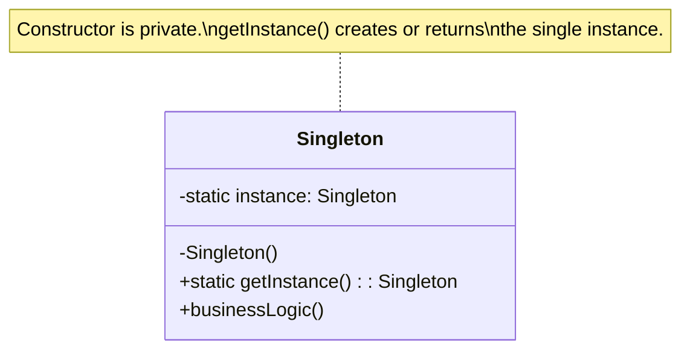
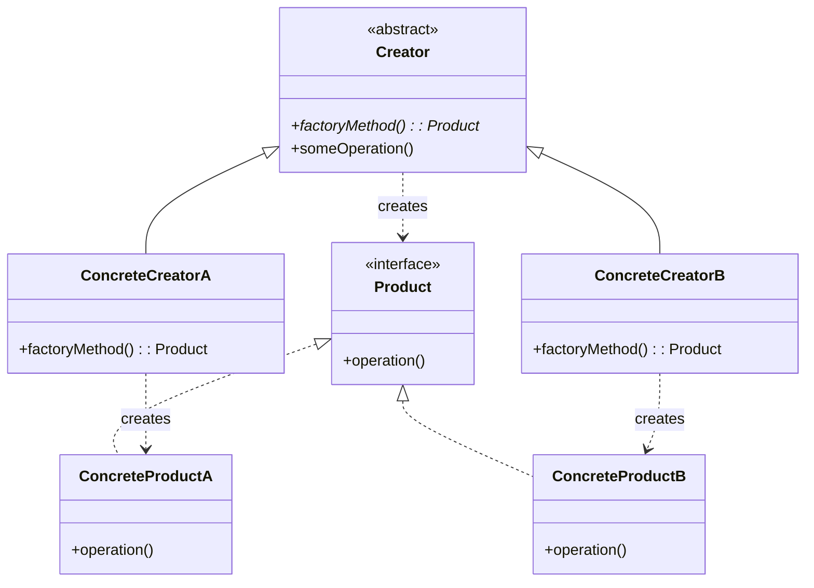
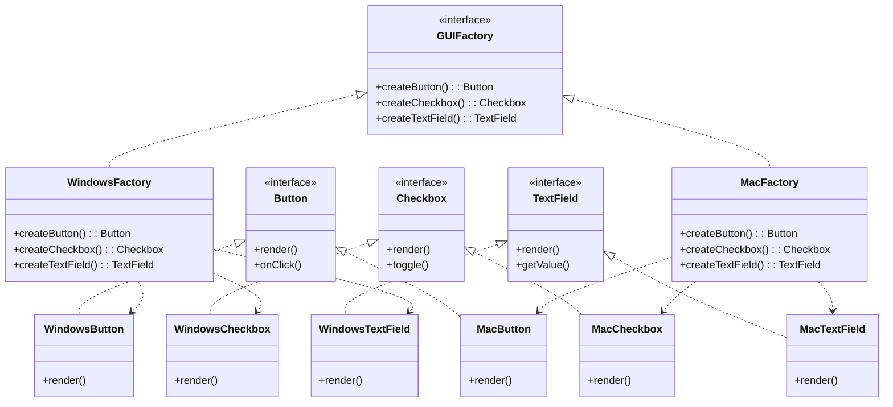
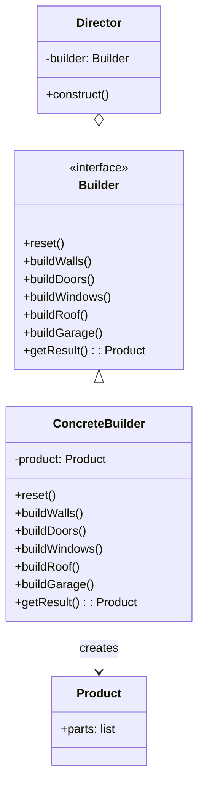
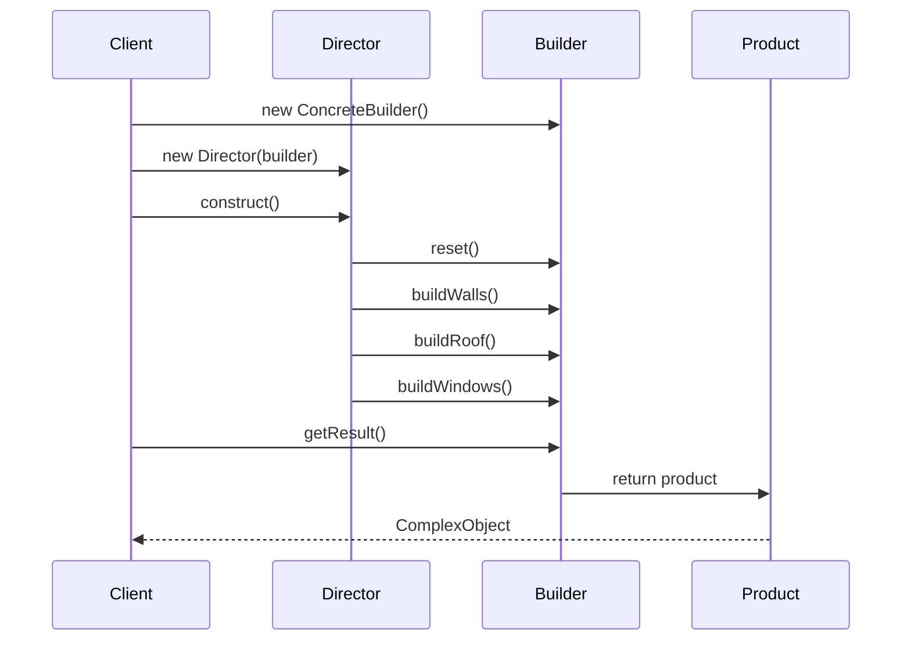
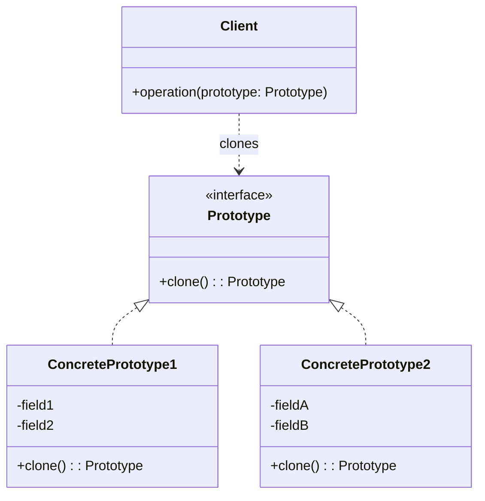
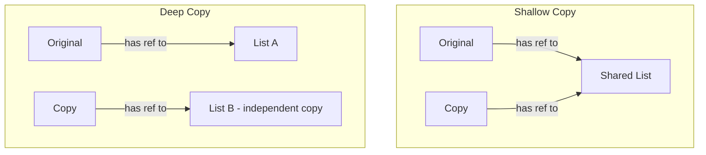
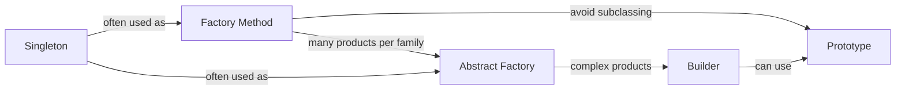

# Creational Design Patterns

Creational patterns deal with **object creation mechanisms**, trying to create objects in a manner suitable to the situation. They abstract the instantiation process, making a system independent of how its objects are created, composed, and represented.

---

## Table of Contents
1. [Singleton Pattern](#1-singleton-pattern)
2. [Factory Method Pattern](#2-factory-method-pattern)
3. [Abstract Factory Pattern](#3-abstract-factory-pattern)
4. [Builder Pattern](#4-builder-pattern)
5. [Prototype Pattern](#5-prototype-pattern)
6. [Pattern Comparison Table](#pattern-comparison-table)

---

## 1. Singleton Pattern

### Intent
Ensure a class has **only one instance** and provide a **global point of access** to it.

### Motivation
Some classes should have exactly one instance: a database connection pool, a file system, a window manager, a thread pool. Having more than one instance could cause inconsistencies or resource waste. The Singleton pattern ensures controlled access to the sole instance.

### Class Diagram



### Implementation Approaches

#### Approach 1: Naive Singleton (NOT thread-safe)

**Python:**
```python
class NaiveSingleton:
    _instance = None

    def __new__(cls):
        if cls._instance is None:
            cls._instance = super().__new__(cls)
        return cls._instance

    def __init__(self):
        # This runs every time NaiveSingleton() is called
        self.value = None

# Usage
s1 = NaiveSingleton()
s2 = NaiveSingleton()
assert s1 is s2  # True - same object
```

**Java:**
```java
public class NaiveSingleton {
    private static NaiveSingleton instance;

    private NaiveSingleton() {} // private constructor

    public static NaiveSingleton getInstance() {
        if (instance == null) {          // NOT thread-safe!
            instance = new NaiveSingleton();
        }
        return instance;
    }
}
```

**Problem:** Two threads can both see `instance == null` and create two instances.

#### Approach 2: Thread-Safe with Lock

**Python:**
```python
import threading

class ThreadSafeSingleton:
    _instance = None
    _lock = threading.Lock()

    def __new__(cls):
        with cls._lock:
            if cls._instance is None:
                cls._instance = super().__new__(cls)
        return cls._instance
```

**Java:**
```java
public class ThreadSafeSingleton {
    private static ThreadSafeSingleton instance;

    private ThreadSafeSingleton() {}

    public static synchronized ThreadSafeSingleton getInstance() {
        if (instance == null) {
            instance = new ThreadSafeSingleton();
        }
        return instance;
    }
}
```

**Problem:** Synchronizing the entire method is expensive. After creation, every call still acquires the lock.

#### Approach 3: Double-Checked Locking

**Python:**
```python
import threading

class DCLSingleton:
    _instance = None
    _lock = threading.Lock()

    def __new__(cls):
        if cls._instance is None:            # First check (no lock)
            with cls._lock:
                if cls._instance is None:     # Second check (with lock)
                    cls._instance = super().__new__(cls)
        return cls._instance
```

**Java:**
```java
public class DCLSingleton {
    // volatile prevents instruction reordering
    private static volatile DCLSingleton instance;

    private DCLSingleton() {}

    public static DCLSingleton getInstance() {
        if (instance == null) {                    // First check
            synchronized (DCLSingleton.class) {
                if (instance == null) {            // Second check
                    instance = new DCLSingleton();
                }
            }
        }
        return instance;
    }
}
```

> **Why `volatile`?** Without it, the JVM may reorder instructions. Thread A might write `instance` before fully constructing the object. Thread B sees a non-null `instance` but gets a partially constructed object.

#### Approach 4: Enum-Based Singleton (Java best practice)

```java
public enum SingletonEnum {
    INSTANCE;

    private int count = 0;

    public void doSomething() {
        count++;
        System.out.println("Count: " + count);
    }
}

// Usage
SingletonEnum.INSTANCE.doSomething();
```

**Advantages:** Thread-safe by JVM guarantee, serialization-safe, reflection-proof.

#### Approach 5: Python Metaclass Singleton

```python
class SingletonMeta(type):
    _instances = {}

    def __call__(cls, *args, **kwargs):
        if cls not in cls._instances:
            instance = super().__call__(*args, **kwargs)
            cls._instances[cls] = instance
        return cls._instances[cls]

class Database(metaclass=SingletonMeta):
    def __init__(self):
        self.connection = "Connected to DB"

# Usage
db1 = Database()
db2 = Database()
assert db1 is db2  # True
```

#### Approach 6: Python Module-Level Singleton

```python
# config.py - The module itself IS the singleton
class _Config:
    def __init__(self):
        self.settings = {}

    def get(self, key, default=None):
        return self.settings.get(key, default)

    def set(self, key, value):
        self.settings[key] = value

# Module-level instance
config = _Config()

# Usage from other files:
# from config import config
# config.set("debug", True)
```

This is the most Pythonic approach. Python modules are imported only once and cached in `sys.modules`.

### Real-World Examples

**1. Database Connection Pool:**
```python
import threading

class ConnectionPool(metaclass=SingletonMeta):
    def __init__(self, max_connections=10):
        self._pool = []
        self._max = max_connections
        self._lock = threading.Lock()

    def get_connection(self):
        with self._lock:
            if self._pool:
                return self._pool.pop()
            if len(self._pool) < self._max:
                return self._create_connection()
            raise Exception("Pool exhausted")

    def release_connection(self, conn):
        with self._lock:
            self._pool.append(conn)

    def _create_connection(self):
        return {"id": id(object()), "status": "open"}
```

**2. Logger:**
```python
class Logger(metaclass=SingletonMeta):
    def __init__(self):
        self._log_file = "app.log"

    def log(self, level, message):
        entry = f"[{level}] {message}"
        print(entry)
        with open(self._log_file, "a") as f:
            f.write(entry + "\n")

    def info(self, msg):  self.log("INFO", msg)
    def warn(self, msg):  self.log("WARN", msg)
    def error(self, msg): self.log("ERROR", msg)
```

### Anti-Pattern Discussion

Singleton is often called an **anti-pattern** for these reasons:

| Problem | Explanation |
|---------|-------------|
| **Global state** | Acts as a global variable, making code harder to reason about |
| **Hidden dependencies** | Classes depend on a Singleton without declaring it in constructors |
| **Testing difficulty** | Hard to mock; state leaks between tests |
| **Violation of SRP** | Manages its own lifecycle AND business logic |
| **Tight coupling** | Code depends on a concrete class, not an abstraction |

**Better alternatives:**
- **Dependency Injection** - Pass the shared instance via constructor
- **Scoped lifetimes** - DI containers manage "one per scope" without Singleton pattern
- **Module-level instance** (Python) - Simple, testable, replaceable

### Interview Questions

**Q1: How do you break a Singleton in Java?**
> Reflection: Use `setAccessible(true)` on the private constructor. Serialization: deserializing creates a new instance (fix with `readResolve()`). Cloning: Override `clone()` to throw an exception. The enum approach prevents all three.

**Q2: Is Singleton thread-safe by default?**
> No. The naive implementation has a race condition. You need synchronization (lock, DCL, or enum).

**Q3: What is the difference between Singleton and static class?**
> Singleton can implement interfaces, be lazily initialized, passed as a parameter, and supports polymorphism. Static class cannot do these things.

**Q4: When would you use Singleton?**
> When exactly one instance is needed AND it must be accessible from a well-known point. Examples: hardware access, shared resource pools, configuration. But prefer DI when possible.

---

## 2. Factory Method Pattern

### Intent
Define an interface for creating an object, but **let subclasses decide** which class to instantiate. Factory Method lets a class defer instantiation to subclasses.

### Problem
You have a logistics application that initially only handles truck transport. Your code is tightly coupled to the `Truck` class. Now you need to add `Ship` transport. Adding more types requires modifying existing code everywhere.

### Class Diagram



### Code Example: Document Creator

**Python:**
```python
from abc import ABC, abstractmethod

# --- Product hierarchy ---
class Document(ABC):
    @abstractmethod
    def create(self) -> str:
        pass

    @abstractmethod
    def save(self, filename: str) -> str:
        pass

class PDFDocument(Document):
    def create(self) -> str:
        return "Creating PDF document with PDF engine"

    def save(self, filename: str) -> str:
        return f"Saving {filename}.pdf"

class WordDocument(Document):
    def create(self) -> str:
        return "Creating Word document with DOCX engine"

    def save(self, filename: str) -> str:
        return f"Saving {filename}.docx"

class ExcelDocument(Document):
    def create(self) -> str:
        return "Creating Excel spreadsheet with XLSX engine"

    def save(self, filename: str) -> str:
        return f"Saving {filename}.xlsx"

# --- Creator hierarchy ---
class DocumentCreator(ABC):
    @abstractmethod
    def create_document(self) -> Document:
        """Factory Method"""
        pass

    def new_document(self, filename: str) -> str:
        """Template method using the factory method"""
        doc = self.create_document()
        result = doc.create()
        result += "\n" + doc.save(filename)
        return result

class PDFCreator(DocumentCreator):
    def create_document(self) -> Document:
        return PDFDocument()

class WordCreator(DocumentCreator):
    def create_document(self) -> Document:
        return WordDocument()

class ExcelCreator(DocumentCreator):
    def create_document(self) -> Document:
        return ExcelDocument()

# --- Client code ---
def client_code(creator: DocumentCreator, filename: str):
    print(creator.new_document(filename))

client_code(PDFCreator(), "report")
# Output:
# Creating PDF document with PDF engine
# Saving report.pdf
```

**Java:**
```java
// Product
interface Document {
    String create();
    String save(String filename);
}

class PDFDocument implements Document {
    public String create() { return "Creating PDF document"; }
    public String save(String filename) { return "Saving " + filename + ".pdf"; }
}

class WordDocument implements Document {
    public String create() { return "Creating Word document"; }
    public String save(String filename) { return "Saving " + filename + ".docx"; }
}

// Creator
abstract class DocumentCreator {
    public abstract Document createDocument(); // Factory Method

    public String newDocument(String filename) {
        Document doc = createDocument();
        return doc.create() + "\n" + doc.save(filename);
    }
}

class PDFCreator extends DocumentCreator {
    public Document createDocument() { return new PDFDocument(); }
}

class WordCreator extends DocumentCreator {
    public Document createDocument() { return new WordDocument(); }
}
```

### Factory Method vs Simple Factory vs Abstract Factory

| Aspect | Simple Factory | Factory Method | Abstract Factory |
|--------|---------------|----------------|------------------|
| **Pattern type** | Not a GoF pattern (idiom) | Class pattern (inheritance) | Object pattern (composition) |
| **Creates** | One product type | One product type | Families of products |
| **Extension** | Modify factory (violates OCP) | Add new creator subclass | Add new factory subclass |
| **Decision maker** | Factory class | Subclass | Factory object |
| **Complexity** | Low | Medium | High |

### Real-World Use Cases
- `java.util.Calendar.getInstance()` returns locale-specific calendar
- `java.net.URLStreamHandlerFactory` creates protocol handlers
- Python's `logging.getLogger()` returns appropriate logger

### Interview Questions

**Q1: How does Factory Method follow the Open/Closed Principle?**
> New product types are added by creating new Creator subclasses, without modifying existing code.

**Q2: When should you use Factory Method over direct construction?**
> When you don't know the exact types and dependencies of objects; when you want to provide a way to extend internal components; when you want to reuse existing objects instead of rebuilding.

---

## 3. Abstract Factory Pattern

### Intent
Provide an interface for creating **families of related or dependent objects** without specifying their concrete classes.

### Problem
You're building a cross-platform UI toolkit. You need buttons, checkboxes, and text fields that look native on each platform. If you mix Windows buttons with Mac checkboxes, the UI looks broken. You need to ensure that products from the same family are used together.

### Class Diagram



### Code Example: Cross-Platform UI

**Python:**
```python
from abc import ABC, abstractmethod

# --- Abstract Products ---
class Button(ABC):
    @abstractmethod
    def render(self) -> str: pass

    @abstractmethod
    def on_click(self, handler) -> str: pass

class Checkbox(ABC):
    @abstractmethod
    def render(self) -> str: pass

    @abstractmethod
    def toggle(self) -> str: pass

class TextField(ABC):
    @abstractmethod
    def render(self) -> str: pass

# --- Windows Family ---
class WindowsButton(Button):
    def render(self) -> str:
        return "[Windows Button]"
    def on_click(self, handler) -> str:
        return f"Windows button clicked -> {handler}"

class WindowsCheckbox(Checkbox):
    def render(self) -> str:
        return "[Windows ☑ Checkbox]"
    def toggle(self) -> str:
        return "Windows checkbox toggled"

class WindowsTextField(TextField):
    def render(self) -> str:
        return "[Windows |____| TextField]"

# --- Mac Family ---
class MacButton(Button):
    def render(self) -> str:
        return "(Mac Button)"
    def on_click(self, handler) -> str:
        return f"Mac button clicked -> {handler}"

class MacCheckbox(Checkbox):
    def render(self) -> str:
        return "(Mac ✓ Checkbox)"
    def toggle(self) -> str:
        return "Mac checkbox toggled"

class MacTextField(TextField):
    def render(self) -> str:
        return "(Mac _____ TextField)"

# --- Abstract Factory ---
class GUIFactory(ABC):
    @abstractmethod
    def create_button(self) -> Button: pass

    @abstractmethod
    def create_checkbox(self) -> Checkbox: pass

    @abstractmethod
    def create_text_field(self) -> TextField: pass

class WindowsFactory(GUIFactory):
    def create_button(self) -> Button:
        return WindowsButton()
    def create_checkbox(self) -> Checkbox:
        return WindowsCheckbox()
    def create_text_field(self) -> TextField:
        return WindowsTextField()

class MacFactory(GUIFactory):
    def create_button(self) -> Button:
        return MacButton()
    def create_checkbox(self) -> Checkbox:
        return MacCheckbox()
    def create_text_field(self) -> TextField:
        return MacTextField()

# --- Client code (works with ANY factory) ---
class Application:
    def __init__(self, factory: GUIFactory):
        self.button = factory.create_button()
        self.checkbox = factory.create_checkbox()
        self.text_field = factory.create_text_field()

    def render(self) -> str:
        return "\n".join([
            self.button.render(),
            self.checkbox.render(),
            self.text_field.render()
        ])

# Determine factory at runtime
import platform
factory = WindowsFactory() if platform.system() == "Windows" else MacFactory()
app = Application(factory)
print(app.render())
```

**Java:**
```java
// Abstract products
interface Button {
    String render();
}
interface Checkbox {
    String render();
}

// Concrete products
class WindowsButton implements Button {
    public String render() { return "[Windows Button]"; }
}
class MacButton implements Button {
    public String render() { return "(Mac Button)"; }
}
class WindowsCheckbox implements Checkbox {
    public String render() { return "[Windows Checkbox]"; }
}
class MacCheckbox implements Checkbox {
    public String render() { return "(Mac Checkbox)"; }
}

// Abstract Factory
interface GUIFactory {
    Button createButton();
    Checkbox createCheckbox();
}

class WindowsFactory implements GUIFactory {
    public Button createButton() { return new WindowsButton(); }
    public Checkbox createCheckbox() { return new WindowsCheckbox(); }
}

class MacFactory implements GUIFactory {
    public Button createButton() { return new MacButton(); }
    public Checkbox createCheckbox() { return new MacCheckbox(); }
}

// Client
class Application {
    private Button button;
    private Checkbox checkbox;

    public Application(GUIFactory factory) {
        button = factory.createButton();
        checkbox = factory.createCheckbox();
    }

    public void render() {
        System.out.println(button.render());
        System.out.println(checkbox.render());
    }
}
```

### When to Use Abstract Factory vs Factory Method

| Use Abstract Factory when... | Use Factory Method when... |
|------------------------------|---------------------------|
| You need families of related products | You need a single product |
| Products must be used together | Products are independent |
| You want to enforce consistency | You want subclass flexibility |
| You know product families at design time | You want to delegate creation |

### Interview Questions

**Q1: How does Abstract Factory enforce that products from the same family are used together?**
> Each concrete factory creates all products for one family. Since client code uses a single factory, it's impossible to mix products from different families.

**Q2: What's the biggest drawback of Abstract Factory?**
> Adding a new product type (e.g., `Slider`) requires modifying the factory interface AND all concrete factories. This violates OCP. The pattern is best when product types are stable.

---

## 4. Builder Pattern

### Intent
Separate the construction of a complex object from its representation so that the **same construction process** can create different representations.

### Problem
Imagine a constructor with 10+ parameters, many optional:
```python
# Telescoping constructor anti-pattern
house = House("wood", 4, 2, True, False, True, None, "red", True, 2)
```
What do these booleans mean? What if you want only some optional features?

### Class Diagram



### Build Process Sequence



### Code Example 1: Building a House

**Python:**
```python
from abc import ABC, abstractmethod

class House:
    def __init__(self):
        self.walls = None
        self.doors = None
        self.windows = None
        self.roof = None
        self.garage = None
        self.swimming_pool = None
        self.garden = None

    def __str__(self):
        parts = [f"Walls: {self.walls}", f"Doors: {self.doors}",
                 f"Windows: {self.windows}", f"Roof: {self.roof}"]
        if self.garage:
            parts.append(f"Garage: {self.garage}")
        if self.swimming_pool:
            parts.append(f"Pool: {self.swimming_pool}")
        if self.garden:
            parts.append(f"Garden: {self.garden}")
        return "House(" + ", ".join(parts) + ")"

class HouseBuilder(ABC):
    @abstractmethod
    def reset(self): pass
    @abstractmethod
    def build_walls(self, material: str): pass
    @abstractmethod
    def build_doors(self, count: int): pass
    @abstractmethod
    def build_windows(self, count: int): pass
    @abstractmethod
    def build_roof(self, style: str): pass
    @abstractmethod
    def build_garage(self): pass
    @abstractmethod
    def build_pool(self): pass
    @abstractmethod
    def get_result(self) -> House: pass

class ConcreteHouseBuilder(HouseBuilder):
    def __init__(self):
        self.reset()

    def reset(self):
        self._house = House()
        return self

    def build_walls(self, material="brick"):
        self._house.walls = material
        return self  # fluent interface

    def build_doors(self, count=1):
        self._house.doors = count
        return self

    def build_windows(self, count=4):
        self._house.windows = count
        return self

    def build_roof(self, style="gable"):
        self._house.roof = style
        return self

    def build_garage(self):
        self._house.garage = "2-car garage"
        return self

    def build_pool(self):
        self._house.swimming_pool = "Olympic size"
        return self

    def get_result(self) -> House:
        result = self._house
        self.reset()
        return result

# --- Director (optional, encapsulates common configurations) ---
class HouseDirector:
    def __init__(self, builder: HouseBuilder):
        self._builder = builder

    def build_minimal_house(self) -> House:
        return (self._builder.reset()
                .build_walls("wood")
                .build_doors(1)
                .build_windows(2)
                .build_roof("flat")
                .get_result())

    def build_luxury_house(self) -> House:
        return (self._builder.reset()
                .build_walls("stone")
                .build_doors(4)
                .build_windows(12)
                .build_roof("hip")
                .build_garage()
                .build_pool()
                .get_result())

# Usage
builder = ConcreteHouseBuilder()
director = HouseDirector(builder)

print(director.build_minimal_house())
print(director.build_luxury_house())

# Or use builder directly with fluent API
custom = (builder.reset()
          .build_walls("concrete")
          .build_doors(2)
          .build_windows(6)
          .build_roof("gable")
          .build_garage()
          .get_result())
print(custom)
```

### Code Example 2: HTTP Request Builder (Fluent Interface)

**Python:**
```python
class HttpRequest:
    def __init__(self):
        self.method = "GET"
        self.url = ""
        self.headers = {}
        self.body = None
        self.timeout = 30
        self.params = {}

    def __repr__(self):
        return (f"HttpRequest({self.method} {self.url}, "
                f"headers={self.headers}, params={self.params}, "
                f"body={self.body}, timeout={self.timeout})")

class HttpRequestBuilder:
    def __init__(self, url: str):
        self._request = HttpRequest()
        self._request.url = url

    def method(self, method: str) -> "HttpRequestBuilder":
        self._request.method = method.upper()
        return self

    def header(self, key: str, value: str) -> "HttpRequestBuilder":
        self._request.headers[key] = value
        return self

    def param(self, key: str, value: str) -> "HttpRequestBuilder":
        self._request.params[key] = value
        return self

    def body(self, data) -> "HttpRequestBuilder":
        self._request.body = data
        return self

    def timeout(self, seconds: int) -> "HttpRequestBuilder":
        self._request.timeout = seconds
        return self

    def build(self) -> HttpRequest:
        if not self._request.url:
            raise ValueError("URL is required")
        return self._request

# Usage - clean, readable, self-documenting
request = (HttpRequestBuilder("https://api.example.com/users")
           .method("POST")
           .header("Content-Type", "application/json")
           .header("Authorization", "Bearer token123")
           .body({"name": "Alice", "role": "admin"})
           .timeout(60)
           .build())

print(request)
```

**Java:**
```java
public class HttpRequest {
    private final String method;
    private final String url;
    private final Map<String, String> headers;
    private final String body;
    private final int timeout;

    private HttpRequest(Builder builder) {
        this.method = builder.method;
        this.url = builder.url;
        this.headers = builder.headers;
        this.body = builder.body;
        this.timeout = builder.timeout;
    }

    // Static inner Builder class (common Java idiom)
    public static class Builder {
        private String method = "GET";
        private final String url;
        private Map<String, String> headers = new HashMap<>();
        private String body = null;
        private int timeout = 30;

        public Builder(String url) {
            this.url = url;
        }

        public Builder method(String method) {
            this.method = method;
            return this;
        }

        public Builder header(String key, String value) {
            this.headers.put(key, value);
            return this;
        }

        public Builder body(String body) {
            this.body = body;
            return this;
        }

        public Builder timeout(int timeout) {
            this.timeout = timeout;
            return this;
        }

        public HttpRequest build() {
            return new HttpRequest(this);
        }
    }
}

// Usage
HttpRequest request = new HttpRequest.Builder("https://api.example.com")
    .method("POST")
    .header("Content-Type", "application/json")
    .body("{\"name\": \"Alice\"}")
    .timeout(60)
    .build();
```

### Builder vs Factory

| Aspect | Builder | Factory |
|--------|---------|---------|
| **Purpose** | Construct complex objects step-by-step | Create objects in one shot |
| **Complexity** | Many optional parameters, complex construction | Simple creation, type selection |
| **Result** | Usually one product type, varying config | Different product types |
| **When** | Construction has many steps | Just need the right type |

### Interview Questions

**Q1: When would you use Builder over a constructor?**
> When an object has many optional parameters (4+), when construction involves multiple steps, or when you want to create immutable objects with many fields.

**Q2: Is the Director mandatory?**
> No. The Director encapsulates common construction sequences but clients can drive the Builder directly. The Director is useful when you have multiple predefined configurations.

**Q3: How does Builder support immutability?**
> The Builder collects all parameters mutably, then `build()` creates an immutable object. In Java, the product's fields are `final` and set only in the constructor called by `build()`.

---

## 5. Prototype Pattern

### Intent
Specify the kinds of objects to create using a prototypical instance, and create new objects by **copying this prototype**.

### Problem
You want to create an exact copy of an object, but:
- The object's class may have private fields you can't access from outside
- You don't want to depend on the concrete class (just the interface)
- Creating from scratch is expensive (e.g., database queries, network calls)

### Class Diagram



### Shallow vs Deep Copy



- **Shallow copy**: Copies the object, but nested references still point to the same objects. Changing a nested object in the copy affects the original.
- **Deep copy**: Recursively copies all nested objects. The copy is fully independent.

### Code Example: Shape Cloning

**Python:**
```python
import copy
from abc import ABC, abstractmethod

class Shape(ABC):
    def __init__(self, x: int = 0, y: int = 0, color: str = "black"):
        self.x = x
        self.y = y
        self.color = color

    @abstractmethod
    def clone(self) -> "Shape":
        pass

    @abstractmethod
    def area(self) -> float:
        pass

    def __eq__(self, other):
        if not isinstance(other, self.__class__):
            return False
        return self.x == other.x and self.y == other.y and self.color == other.color

class Circle(Shape):
    def __init__(self, x=0, y=0, color="black", radius=1.0):
        super().__init__(x, y, color)
        self.radius = radius

    def clone(self) -> "Circle":
        return copy.deepcopy(self)

    def area(self) -> float:
        return 3.14159 * self.radius ** 2

    def __repr__(self):
        return f"Circle(x={self.x}, y={self.y}, color={self.color}, radius={self.radius})"

class Rectangle(Shape):
    def __init__(self, x=0, y=0, color="black", width=1.0, height=1.0):
        super().__init__(x, y, color)
        self.width = width
        self.height = height

    def clone(self) -> "Rectangle":
        return copy.deepcopy(self)

    def area(self) -> float:
        return self.width * self.height

    def __repr__(self):
        return f"Rectangle(x={self.x}, y={self.y}, w={self.width}, h={self.height})"

# --- Prototype Registry ---
class ShapeRegistry:
    def __init__(self):
        self._prototypes = {}

    def register(self, name: str, prototype: Shape):
        self._prototypes[name] = prototype

    def get(self, name: str) -> Shape:
        prototype = self._prototypes.get(name)
        if prototype is None:
            raise KeyError(f"No prototype named '{name}'")
        return prototype.clone()

# Usage
registry = ShapeRegistry()
registry.register("big_red_circle", Circle(0, 0, "red", 50))
registry.register("unit_square", Rectangle(0, 0, "blue", 1, 1))

# Create copies
c1 = registry.get("big_red_circle")
c2 = registry.get("big_red_circle")
c2.x = 100  # modify without affecting original or c1
print(c1)  # Circle(x=0, y=0, color=red, radius=50)
print(c2)  # Circle(x=100, y=0, color=red, radius=50)
print(c1 is c2)  # False - different objects
```

### Code Example: Game Character Templates

**Python:**
```python
import copy

class Equipment:
    def __init__(self, weapon: str, armor: str, items: list):
        self.weapon = weapon
        self.armor = armor
        self.items = items  # mutable list - needs deep copy!

    def __repr__(self):
        return f"Equipment({self.weapon}, {self.armor}, items={self.items})"

class GameCharacter:
    def __init__(self, name, health, attack, defense, equipment):
        self.name = name
        self.health = health
        self.attack = attack
        self.defense = defense
        self.equipment = equipment

    def clone(self):
        """Deep copy to ensure equipment list is independent"""
        return copy.deepcopy(self)

    def __repr__(self):
        return (f"Character({self.name}, HP={self.health}, "
                f"ATK={self.attack}, DEF={self.defense}, {self.equipment})")

# Define templates (prototypes)
warrior_template = GameCharacter(
    name="Warrior",
    health=100, attack=15, defense=20,
    equipment=Equipment("Sword", "Plate", ["Health Potion", "Shield"])
)

mage_template = GameCharacter(
    name="Mage",
    health=60, attack=25, defense=8,
    equipment=Equipment("Staff", "Robe", ["Mana Potion", "Scroll"])
)

# Spawn enemies by cloning templates (much faster than DB lookup)
enemy1 = warrior_template.clone()
enemy1.name = "Orc Warrior"
enemy1.equipment.items.append("Gold Coin")

enemy2 = warrior_template.clone()
enemy2.name = "Goblin Fighter"

# Verify independence
print(enemy1)
# Character(Orc Warrior, ..., items=['Health Potion', 'Shield', 'Gold Coin'])
print(enemy2)
# Character(Goblin Fighter, ..., items=['Health Potion', 'Shield'])
# Gold Coin is NOT in enemy2's items - deep copy worked!
```

**Java:**
```java
public class GameCharacter implements Cloneable {
    private String name;
    private int health;
    private int attack;
    private List<String> items;

    public GameCharacter(String name, int health, int attack, List<String> items) {
        this.name = name;
        this.health = health;
        this.attack = attack;
        this.items = new ArrayList<>(items);
    }

    @Override
    public GameCharacter clone() {
        try {
            GameCharacter cloned = (GameCharacter) super.clone();
            cloned.items = new ArrayList<>(this.items); // Deep copy the list
            return cloned;
        } catch (CloneNotSupportedException e) {
            throw new RuntimeException(e);
        }
    }

    // A copy constructor is often preferred in Java
    public GameCharacter(GameCharacter other) {
        this.name = other.name;
        this.health = other.health;
        this.attack = other.attack;
        this.items = new ArrayList<>(other.items);
    }
}
```

### Python's copy Module

```python
import copy

original = [[1, 2, 3], [4, 5, 6]]

# Shallow copy - inner lists are shared
shallow = copy.copy(original)
shallow[0].append(999)
print(original[0])  # [1, 2, 3, 999] - AFFECTED!

# Deep copy - fully independent
original2 = [[1, 2, 3], [4, 5, 6]]
deep = copy.deepcopy(original2)
deep[0].append(999)
print(original2[0])  # [1, 2, 3] - NOT affected

# Customize copy behavior
class SmartObject:
    def __copy__(self):
        """Custom shallow copy"""
        cls = self.__class__
        result = cls.__new__(cls)
        result.__dict__.update(self.__dict__)
        return result

    def __deepcopy__(self, memo):
        """Custom deep copy"""
        cls = self.__class__
        result = cls.__new__(cls)
        memo[id(self)] = result  # prevent infinite recursion
        for k, v in self.__dict__.items():
            setattr(result, k, copy.deepcopy(v, memo))
        return result
```

### Interview Questions

**Q1: What's the difference between shallow and deep copy?**
> Shallow copy duplicates the top-level object but shares references to nested objects. Deep copy recursively duplicates everything. Use deep copy when the object contains mutable nested structures.

**Q2: When is Prototype better than calling `new`?**
> When object creation is expensive (DB queries, network calls, complex calculations), when you want to avoid a parallel hierarchy of factories, or when objects differ only slightly from a template.

**Q3: How does Java's `Cloneable` interface work?**
> `Cloneable` is a marker interface. `Object.clone()` does a shallow copy by default. You must override `clone()` and manually deep-copy mutable fields. Many prefer copy constructors instead because `Cloneable` is considered broken.

---

## Pattern Comparison Table

| Pattern | Intent | Creates | When to Use |
|---------|--------|---------|-------------|
| **Singleton** | One instance globally | Single shared object | DB pool, Logger, Config |
| **Factory Method** | Delegate creation to subclass | One product at a time | Unknown types at compile time |
| **Abstract Factory** | Create product families | Family of related products | Cross-platform UI, themed components |
| **Builder** | Step-by-step construction | Complex objects with many params | HTTP requests, SQL queries, configs |
| **Prototype** | Clone existing objects | Copy of a prototype | Expensive creation, template objects |

### How They Relate



- **Factory Method** often evolves into **Abstract Factory** when multiple product types are needed.
- **Abstract Factory** can use **Builder** internally to construct complex products.
- **Prototype** can replace **Factory Method** when you want to avoid a parallel hierarchy of creator classes.
- **Singleton** is often combined with any factory pattern to ensure one factory instance.
- **Builder** focuses on constructing one complex object; **Factory** focuses on which type to create.
