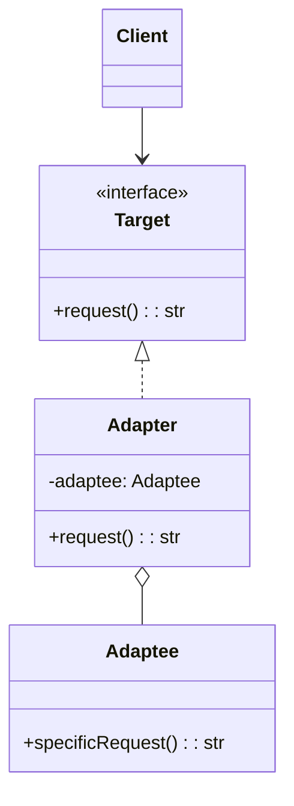
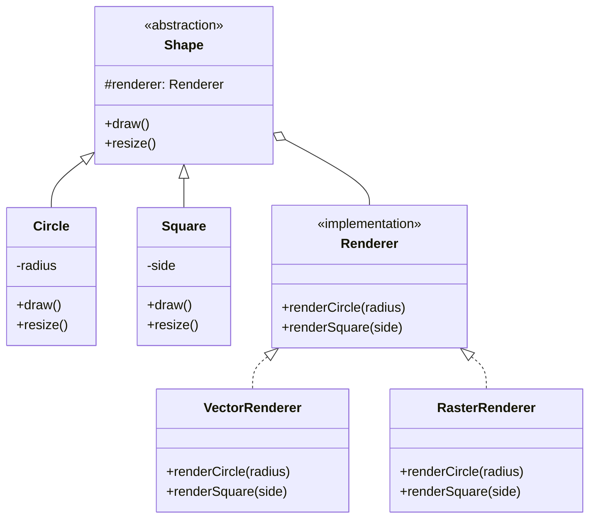
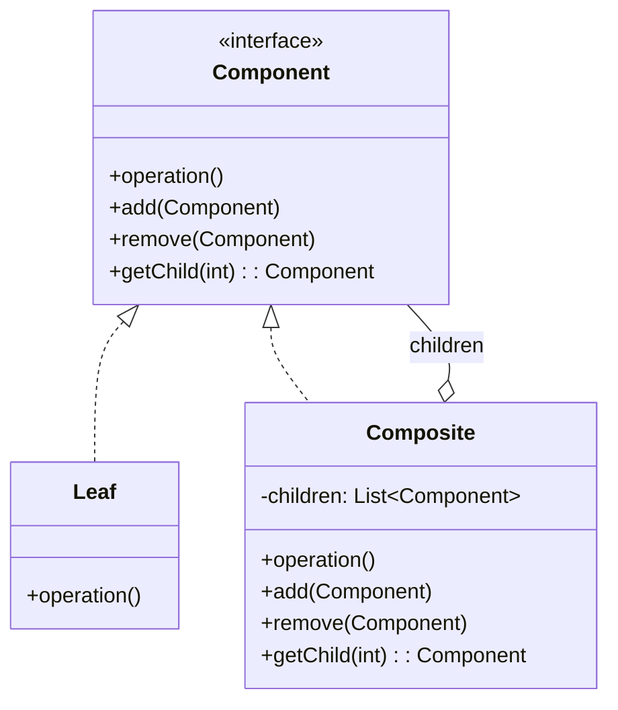
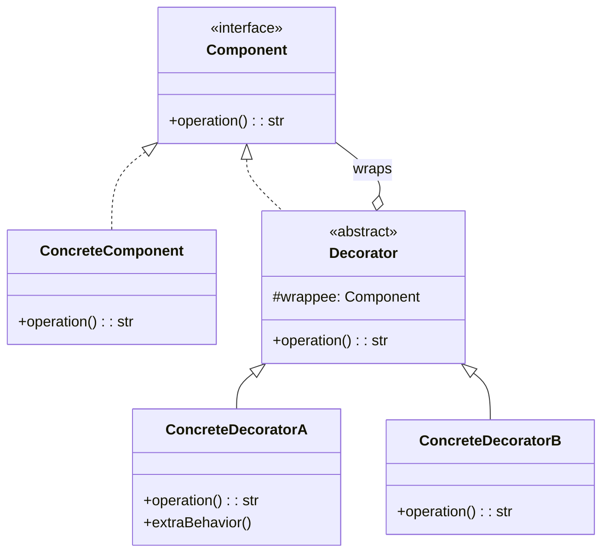
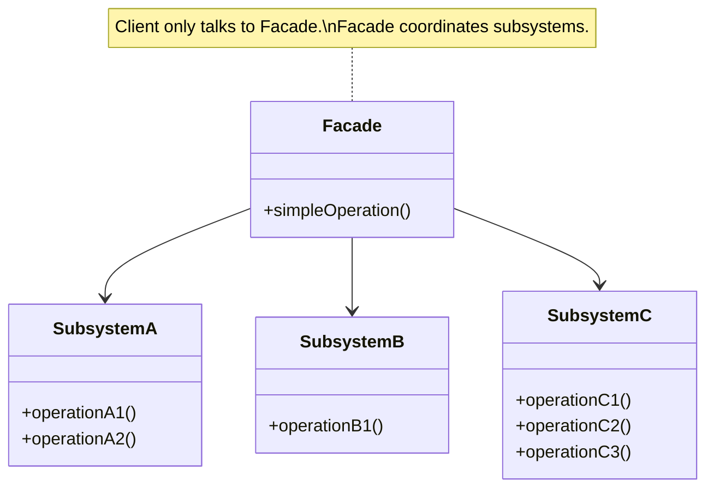
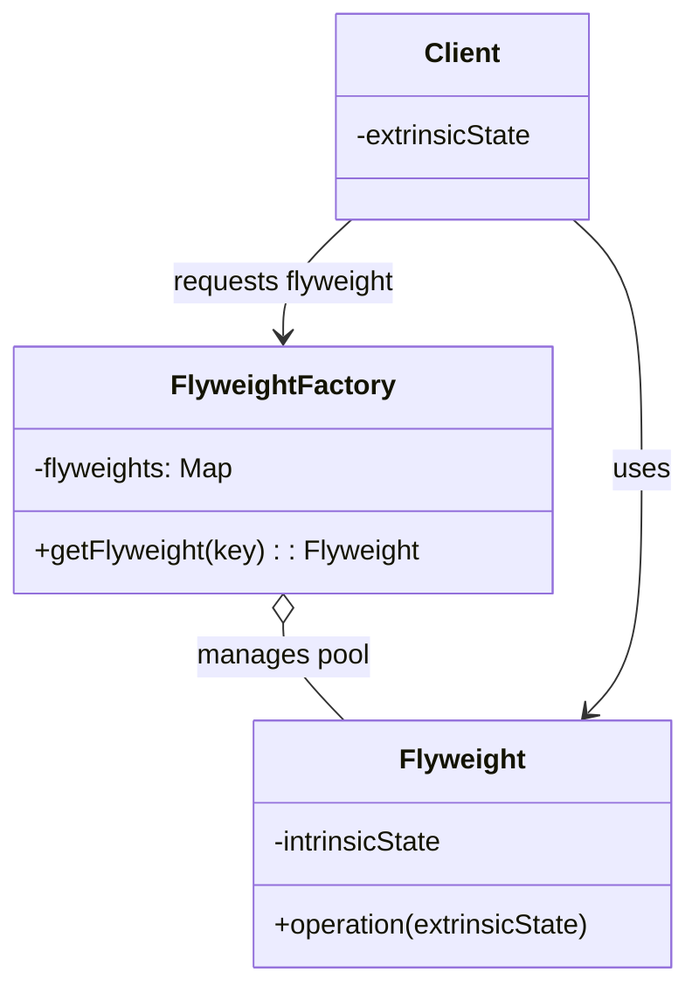
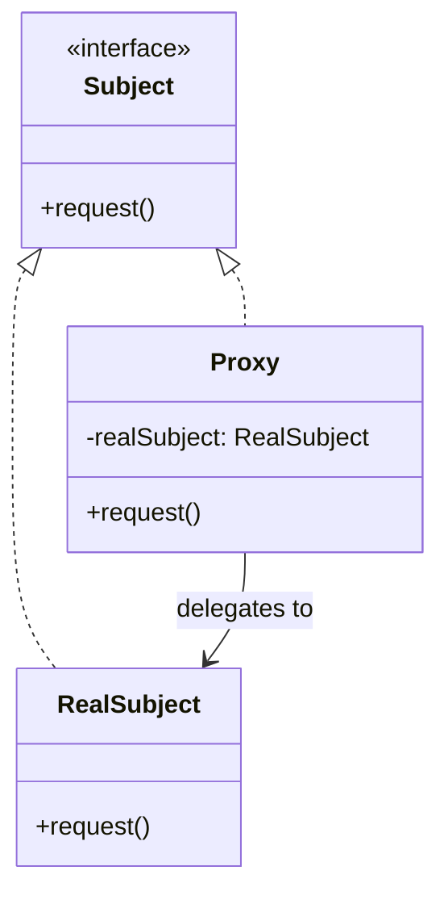

# Structural Design Patterns

Structural patterns explain how to **assemble objects and classes into larger structures**, while keeping these structures flexible and efficient. They use inheritance and composition to form new functionality.

---

## Table of Contents
1. [Adapter Pattern](#1-adapter-pattern)
2. [Bridge Pattern](#2-bridge-pattern)
3. [Composite Pattern](#3-composite-pattern)
4. [Decorator Pattern](#4-decorator-pattern)
5. [Facade Pattern](#5-facade-pattern)
6. [Flyweight Pattern](#6-flyweight-pattern)
7. [Proxy Pattern](#7-proxy-pattern)
8. [Comparison Table](#comparison-table)

---

## 1. Adapter Pattern

### Intent
Convert the interface of a class into another interface clients expect. Adapter lets classes work together that couldn't otherwise because of incompatible interfaces.

### Problem
You have a monitoring system that works with XML data. A new analytics library provides great features but only accepts JSON. You can't modify the library. You need an adapter.

### Class Diagram



### Code Example: Legacy System Integration

**Python:**
```python
from abc import ABC, abstractmethod
import json

# --- Target interface (what client expects) ---
class DataAnalyzer(ABC):
    @abstractmethod
    def analyze(self, json_data: str) -> dict:
        pass

# --- Modern analytics service (works with JSON) ---
class ModernAnalytics:
    def process(self, json_string: str) -> dict:
        data = json.loads(json_string)
        return {
            "count": len(data),
            "summary": f"Processed {len(data)} records",
            "status": "success"
        }

# --- Legacy system (produces XML) ---
class LegacyXMLSystem:
    def get_data(self) -> str:
        return """
        <records>
            <record><name>Alice</name><value>100</value></record>
            <record><name>Bob</name><value>200</value></record>
        </records>
        """

# --- Adapter: makes Legacy XML work with Modern JSON analyzer ---
class XMLToJSONAdapter(DataAnalyzer):
    def __init__(self, legacy_system: LegacyXMLSystem, analytics: ModernAnalytics):
        self._legacy = legacy_system
        self._analytics = analytics

    def analyze(self, json_data: str = None) -> dict:
        # Get XML from legacy system
        xml_data = self._legacy.get_data()
        # Convert XML to JSON (simplified)
        json_data = self._xml_to_json(xml_data)
        # Pass to modern analytics
        return self._analytics.process(json_data)

    def _xml_to_json(self, xml: str) -> str:
        """Simplified XML to JSON conversion"""
        import re
        records = []
        for match in re.finditer(r'<name>(.*?)</name><value>(.*?)</value>', xml):
            records.append({"name": match.group(1), "value": int(match.group(2))})
        return json.dumps(records)

# Client code
legacy = LegacyXMLSystem()
analytics = ModernAnalytics()
adapter = XMLToJSONAdapter(legacy, analytics)

result = adapter.analyze()
print(result)  # {'count': 2, 'summary': 'Processed 2 records', 'status': 'success'}
```

**Java:**
```java
// Target interface
interface MediaPlayer {
    void play(String filename);
}

// Adaptee - incompatible interface
class VLCPlayer {
    void playVLC(String filename) {
        System.out.println("Playing VLC: " + filename);
    }
}

class MP4Player {
    void playMP4(String filename) {
        System.out.println("Playing MP4: " + filename);
    }
}

// Adapter
class MediaAdapter implements MediaPlayer {
    private VLCPlayer vlcPlayer;
    private MP4Player mp4Player;

    public MediaAdapter(String audioType) {
        if (audioType.equals("vlc")) {
            vlcPlayer = new VLCPlayer();
        } else if (audioType.equals("mp4")) {
            mp4Player = new MP4Player();
        }
    }

    public void play(String filename) {
        if (vlcPlayer != null) vlcPlayer.playVLC(filename);
        else if (mp4Player != null) mp4Player.playMP4(filename);
    }
}
```

### Real-World Examples
- `java.util.Arrays.asList()` adapts an array to a List interface
- `java.io.InputStreamReader` adapts byte stream to character stream
- Python's `__iter__()` method adapts any class to be iterable
- ORMs adapt database rows to objects

### Interview Questions

**Q: Object adapter vs Class adapter?**
> Object adapter uses composition (holds adaptee reference) - preferred because it works with the adaptee and all its subclasses. Class adapter uses multiple inheritance (available in C++, Python, but not Java) - can override adaptee behavior but is tied to one specific adaptee class.

---

## 2. Bridge Pattern

### Intent
Decouple an **abstraction** from its **implementation** so that the two can vary independently.

### Problem
You have a `Shape` hierarchy (Circle, Square) and each can be rendered differently (Vector, Raster). Without Bridge, you'd need: VectorCircle, RasterCircle, VectorSquare, RasterSquare... a class explosion.

### Class Diagram



### Code Example: Shapes with Different Renderers

**Python:**
```python
from abc import ABC, abstractmethod

# --- Implementation hierarchy ---
class Renderer(ABC):
    @abstractmethod
    def render_circle(self, radius: float) -> str:
        pass

    @abstractmethod
    def render_square(self, side: float) -> str:
        pass

class VectorRenderer(Renderer):
    def render_circle(self, radius):
        return f"Drawing circle as vector lines, radius={radius}"

    def render_square(self, side):
        return f"Drawing square as vector lines, side={side}"

class RasterRenderer(Renderer):
    def render_circle(self, radius):
        return f"Drawing circle as pixels, radius={radius}"

    def render_square(self, side):
        return f"Drawing square as pixels, side={side}"

class SVGRenderer(Renderer):
    def render_circle(self, radius):
        return f'<circle r="{radius}" />'

    def render_square(self, side):
        return f'<rect width="{side}" height="{side}" />'

# --- Abstraction hierarchy ---
class Shape(ABC):
    def __init__(self, renderer: Renderer):
        self._renderer = renderer

    @abstractmethod
    def draw(self) -> str:
        pass

    @abstractmethod
    def resize(self, factor: float):
        pass

class Circle(Shape):
    def __init__(self, renderer: Renderer, radius: float):
        super().__init__(renderer)
        self.radius = radius

    def draw(self) -> str:
        return self._renderer.render_circle(self.radius)

    def resize(self, factor: float):
        self.radius *= factor

class Square(Shape):
    def __init__(self, renderer: Renderer, side: float):
        super().__init__(renderer)
        self.side = side

    def draw(self) -> str:
        return self._renderer.render_square(self.side)

    def resize(self, factor: float):
        self.side *= factor

# Usage - mix and match freely!
vector = VectorRenderer()
raster = RasterRenderer()
svg = SVGRenderer()

shapes = [
    Circle(vector, 5),
    Circle(raster, 5),
    Square(svg, 10),
]

for shape in shapes:
    print(shape.draw())
# Drawing circle as vector lines, radius=5
# Drawing circle as pixels, radius=5
# <rect width="10" height="10" />
```

**Java:**
```java
// Implementation
interface Renderer {
    String renderCircle(double radius);
    String renderSquare(double side);
}

class VectorRenderer implements Renderer {
    public String renderCircle(double radius) {
        return "Vector circle, r=" + radius;
    }
    public String renderSquare(double side) {
        return "Vector square, s=" + side;
    }
}

// Abstraction
abstract class Shape {
    protected Renderer renderer;
    Shape(Renderer renderer) { this.renderer = renderer; }
    abstract String draw();
}

class Circle extends Shape {
    private double radius;
    Circle(Renderer renderer, double radius) {
        super(renderer);
        this.radius = radius;
    }
    String draw() { return renderer.renderCircle(radius); }
}
```

### When to Use
- You want to avoid a permanent binding between abstraction and implementation
- Both abstraction and implementation should be extensible via subclassing
- You want to share implementations among multiple objects (using reference counting)

---

## 3. Composite Pattern

### Intent
Compose objects into **tree structures** to represent part-whole hierarchies. Composite lets clients treat individual objects and compositions uniformly.

### Class Diagram



### Code Example: File System

**Python:**
```python
from abc import ABC, abstractmethod

class FileSystemEntry(ABC):
    def __init__(self, name: str):
        self.name = name

    @abstractmethod
    def get_size(self) -> int:
        pass

    @abstractmethod
    def display(self, indent: int = 0) -> str:
        pass

class File(FileSystemEntry):
    def __init__(self, name: str, size: int):
        super().__init__(name)
        self._size = size

    def get_size(self) -> int:
        return self._size

    def display(self, indent=0) -> str:
        return " " * indent + f"File: {self.name} ({self._size} bytes)"

class Directory(FileSystemEntry):
    def __init__(self, name: str):
        super().__init__(name)
        self._children: list[FileSystemEntry] = []

    def add(self, entry: FileSystemEntry):
        self._children.append(entry)
        return self

    def remove(self, entry: FileSystemEntry):
        self._children.remove(entry)

    def get_size(self) -> int:
        return sum(child.get_size() for child in self._children)

    def display(self, indent=0) -> str:
        lines = [" " * indent + f"Dir: {self.name}/ ({self.get_size()} bytes)"]
        for child in self._children:
            lines.append(child.display(indent + 2))
        return "\n".join(lines)

# Build a file tree
root = Directory("root")
src = Directory("src")
src.add(File("main.py", 1200))
src.add(File("utils.py", 800))

tests = Directory("tests")
tests.add(File("test_main.py", 600))

root.add(src)
root.add(tests)
root.add(File("README.md", 500))

print(root.display())
# Dir: root/ (3100 bytes)
#   Dir: src/ (2000 bytes)
#     File: main.py (1200 bytes)
#     File: utils.py (800 bytes)
#   Dir: tests/ (600 bytes)
#     File: test_main.py (600 bytes)
#   File: README.md (500 bytes)

print(f"\nTotal size: {root.get_size()} bytes")
```

### Code Example: Organization Hierarchy

**Python:**
```python
class Employee(ABC):
    def __init__(self, name: str, salary: float):
        self.name = name
        self.salary = salary

    @abstractmethod
    def get_total_salary(self) -> float:
        pass

    @abstractmethod
    def display(self, indent=0) -> str:
        pass

class Developer(Employee):
    def get_total_salary(self) -> float:
        return self.salary

    def display(self, indent=0) -> str:
        return " " * indent + f"Dev: {self.name} (${self.salary:,.0f})"

class Manager(Employee):
    def __init__(self, name, salary):
        super().__init__(name, salary)
        self._subordinates: list[Employee] = []

    def add(self, emp: Employee):
        self._subordinates.append(emp)

    def get_total_salary(self) -> float:
        return self.salary + sum(s.get_total_salary() for s in self._subordinates)

    def display(self, indent=0) -> str:
        lines = [" " * indent + f"Mgr: {self.name} (${self.salary:,.0f})"]
        for sub in self._subordinates:
            lines.append(sub.display(indent + 2))
        return "\n".join(lines)

# Build org chart
cto = Manager("CTO Alice", 200000)
eng_mgr = Manager("Eng Manager Bob", 150000)
eng_mgr.add(Developer("Carol", 120000))
eng_mgr.add(Developer("Dave", 110000))
cto.add(eng_mgr)
cto.add(Developer("Eve (Staff)", 160000))

print(cto.display())
print(f"Total cost: ${cto.get_total_salary():,.0f}")
```

**Java:**
```java
interface Component {
    int getSalary();
    void display(int indent);
}

class Developer implements Component {
    private String name;
    private int salary;

    public Developer(String name, int salary) {
        this.name = name;
        this.salary = salary;
    }

    public int getSalary() { return salary; }
    public void display(int indent) {
        System.out.println(" ".repeat(indent) + "Dev: " + name);
    }
}

class Manager implements Component {
    private String name;
    private int salary;
    private List<Component> subordinates = new ArrayList<>();

    public Manager(String name, int salary) {
        this.name = name;
        this.salary = salary;
    }

    public void add(Component c) { subordinates.add(c); }

    public int getSalary() {
        return salary + subordinates.stream().mapToInt(Component::getSalary).sum();
    }

    public void display(int indent) {
        System.out.println(" ".repeat(indent) + "Mgr: " + name);
        subordinates.forEach(s -> s.display(indent + 2));
    }
}
```

### Interview Questions

**Q: When is Composite appropriate?**
> When the core model of your app can be represented as a tree. The pattern makes sense only when leaf and composite elements share a meaningful common interface.

**Q: What's the downside of Composite?**
> It can make the design overly general. It's harder to restrict what types of children a composite can contain. You lose compile-time type safety for component structure.

---

## 4. Decorator Pattern

### Intent
Attach **additional responsibilities** to an object dynamically. Decorators provide a flexible alternative to subclassing for extending functionality.

### Class Diagram



### Code Example: Coffee Shop Orders

**Python:**
```python
from abc import ABC, abstractmethod

class Coffee(ABC):
    @abstractmethod
    def cost(self) -> float:
        pass

    @abstractmethod
    def description(self) -> str:
        pass

# --- Base coffees ---
class SimpleCoffee(Coffee):
    def cost(self) -> float:
        return 2.00

    def description(self) -> str:
        return "Simple coffee"

class Espresso(Coffee):
    def cost(self) -> float:
        return 3.00

    def description(self) -> str:
        return "Espresso"

# --- Decorator base ---
class CoffeeDecorator(Coffee, ABC):
    def __init__(self, coffee: Coffee):
        self._coffee = coffee

    @abstractmethod
    def cost(self) -> float:
        pass

    @abstractmethod
    def description(self) -> str:
        pass

# --- Concrete decorators ---
class MilkDecorator(CoffeeDecorator):
    def cost(self) -> float:
        return self._coffee.cost() + 0.50

    def description(self) -> str:
        return self._coffee.description() + " + milk"

class WhipDecorator(CoffeeDecorator):
    def cost(self) -> float:
        return self._coffee.cost() + 0.75

    def description(self) -> str:
        return self._coffee.description() + " + whipped cream"

class VanillaDecorator(CoffeeDecorator):
    def cost(self) -> float:
        return self._coffee.cost() + 0.60

    def description(self) -> str:
        return self._coffee.description() + " + vanilla"

class SizeDecorator(CoffeeDecorator):
    def __init__(self, coffee: Coffee, size: str):
        super().__init__(coffee)
        self._multipliers = {"small": 0.8, "medium": 1.0, "large": 1.5}
        self._size = size

    def cost(self) -> float:
        return self._coffee.cost() * self._multipliers.get(self._size, 1.0)

    def description(self) -> str:
        return f"{self._size.capitalize()} {self._coffee.description()}"

# Usage - stack decorators dynamically!
order = SimpleCoffee()
order = MilkDecorator(order)
order = WhipDecorator(order)
order = VanillaDecorator(order)
print(f"{order.description()}: ${order.cost():.2f}")
# Simple coffee + milk + whipped cream + vanilla: $3.85

fancy = SizeDecorator(VanillaDecorator(Espresso()), "large")
print(f"{fancy.description()}: ${fancy.cost():.2f}")
# Large Espresso + vanilla: $5.40
```

### Code Example: I/O Stream Decorators (Java-style in Python)

**Python:**
```python
class DataSource(ABC):
    @abstractmethod
    def write(self, data: str): pass

    @abstractmethod
    def read(self) -> str: pass

class FileDataSource(DataSource):
    def __init__(self, filename: str):
        self._filename = filename
        self._data = ""

    def write(self, data: str):
        self._data = data
        print(f"Writing to {self._filename}: {data[:50]}...")

    def read(self) -> str:
        return self._data

class DataSourceDecorator(DataSource, ABC):
    def __init__(self, source: DataSource):
        self._source = source

class EncryptionDecorator(DataSourceDecorator):
    def write(self, data: str):
        encrypted = data[::-1]  # simple reversal as "encryption"
        print(f"[Encrypt] Encrypting data")
        self._source.write(encrypted)

    def read(self) -> str:
        data = self._source.read()
        return data[::-1]  # "decrypt"

class CompressionDecorator(DataSourceDecorator):
    def write(self, data: str):
        compressed = data.replace("  ", " ")  # simplified
        print(f"[Compress] Compressing data")
        self._source.write(compressed)

    def read(self) -> str:
        return self._source.read()

# Stack decorators - order matters!
source = FileDataSource("data.txt")
source = CompressionDecorator(source)
source = EncryptionDecorator(source)

source.write("Hello World, this is secret data!")
print(f"Read back: {source.read()}")
```

**Java:**
```java
// This is literally how Java I/O works:
// InputStream → BufferedInputStream → DataInputStream
InputStream in = new FileInputStream("file.txt");
InputStream buffered = new BufferedInputStream(in);
DataInputStream data = new DataInputStream(buffered);
```

### Interview Questions

**Q: Decorator vs Inheritance?**
> Inheritance is static (compile-time) and applies to all instances. Decorator is dynamic (runtime) and applies per-object. Decorator avoids class explosion when combining features.

**Q: Decorator vs Proxy?**
> Similar structure but different intent. Decorator adds behavior, Proxy controls access. Proxy usually manages the lifecycle of its subject; Decorator does not.

---

## 5. Facade Pattern

### Intent
Provide a **simplified interface** to a complex subsystem. The facade doesn't add new functionality; it just makes the subsystem easier to use.

### Class Diagram



### Code Example: Home Theater System

**Python:**
```python
class Amplifier:
    def on(self): return "Amplifier ON"
    def set_volume(self, level): return f"Volume set to {level}"
    def off(self): return "Amplifier OFF"

class DVDPlayer:
    def on(self): return "DVD Player ON"
    def play(self, movie): return f"Playing: {movie}"
    def stop(self): return "DVD stopped"
    def off(self): return "DVD Player OFF"

class Projector:
    def on(self): return "Projector ON"
    def set_input(self, source): return f"Input set to {source}"
    def wide_screen_mode(self): return "Wide screen mode ON"
    def off(self): return "Projector OFF"

class Lights:
    def dim(self, level): return f"Lights dimmed to {level}%"
    def on(self): return "Lights ON"

class Screen:
    def down(self): return "Screen going down"
    def up(self): return "Screen going up"

# --- Facade ---
class HomeTheaterFacade:
    def __init__(self):
        self.amp = Amplifier()
        self.dvd = DVDPlayer()
        self.projector = Projector()
        self.lights = Lights()
        self.screen = Screen()

    def watch_movie(self, movie: str):
        """One simple call instead of 8+ subsystem calls"""
        actions = [
            self.lights.dim(10),
            self.screen.down(),
            self.projector.on(),
            self.projector.set_input("DVD"),
            self.projector.wide_screen_mode(),
            self.amp.on(),
            self.amp.set_volume(7),
            self.dvd.on(),
            self.dvd.play(movie),
        ]
        print("--- Movie Night ---")
        for action in actions:
            print(f"  {action}")

    def end_movie(self):
        actions = [
            self.dvd.stop(),
            self.dvd.off(),
            self.amp.off(),
            self.projector.off(),
            self.screen.up(),
            self.lights.on(),
        ]
        print("--- Shutting down ---")
        for action in actions:
            print(f"  {action}")

# Client code is now dead simple
theater = HomeTheaterFacade()
theater.watch_movie("Inception")
theater.end_movie()
```

### Code Example: Computer Startup

**Python:**
```python
class CPU:
    def freeze(self): print("CPU: Freezing processor")
    def jump(self, addr): print(f"CPU: Jumping to {addr}")
    def execute(self): print("CPU: Executing instructions")

class Memory:
    def load(self, addr, data): print(f"Memory: Loading '{data}' at {addr}")

class HardDrive:
    def read(self, sector, size):
        print(f"HardDrive: Reading sector {sector}, size {size}")
        return "boot_data"

class ComputerFacade:
    def __init__(self):
        self._cpu = CPU()
        self._memory = Memory()
        self._hdd = HardDrive()

    def start(self):
        self._cpu.freeze()
        data = self._hdd.read(0, 1024)
        self._memory.load(0x00, data)
        self._cpu.jump(0x00)
        self._cpu.execute()
        print("Computer started successfully!")

# One line to start a computer
ComputerFacade().start()
```

**Java:**
```java
public class ComputerFacade {
    private CPU cpu;
    private Memory memory;
    private HardDrive hdd;

    public ComputerFacade() {
        this.cpu = new CPU();
        this.memory = new Memory();
        this.hdd = new HardDrive();
    }

    public void start() {
        cpu.freeze();
        byte[] bootData = hdd.read(0, 1024);
        memory.load(0x00, bootData);
        cpu.jump(0x00);
        cpu.execute();
    }
}
```

### Real-World Examples
- JDBC `DriverManager` is a facade over complex driver management
- SLF4J is a facade over various logging frameworks
- jQuery `$()` is a facade over browser DOM APIs
- Python's `requests` library is a facade over `urllib`

### Interview Questions

**Q: Facade vs Adapter?**
> Adapter changes an existing interface to match what the client expects. Facade creates a *new* simplified interface. Adapter wraps one object; Facade wraps an entire subsystem.

**Q: Does Facade violate the Open/Closed Principle?**
> Not if the facade is an additional layer. Clients can still use subsystems directly if needed. Facade doesn't hide subsystems; it provides a convenient shortcut.

---

## 6. Flyweight Pattern

### Intent
Use sharing to support large numbers of fine-grained objects efficiently by sharing the **intrinsic (common) state** between objects instead of keeping all data in each object.

### Key Concept

```
Object State = Intrinsic State (shared, immutable) + Extrinsic State (unique, per-context)
```

### Class Diagram



### Code Example: Text Editor Characters

**Python:**
```python
class CharacterFlyweight:
    """Intrinsic state: character, font_family, is_bold, is_italic
    These are shared across all occurrences of the same styled character."""

    def __init__(self, char: str, font: str, bold: bool, italic: bool):
        self.char = char
        self.font = font
        self.bold = bold
        self.italic = italic

    def render(self, row: int, col: int, font_size: int):
        """Extrinsic state (row, col, font_size) is passed in, not stored."""
        style = ""
        if self.bold: style += "B"
        if self.italic: style += "I"
        return f"'{self.char}' [{self.font}{style}] at ({row},{col}) size {font_size}"

class CharacterFactory:
    _cache: dict[tuple, CharacterFlyweight] = {}

    @classmethod
    def get(cls, char: str, font: str, bold: bool = False,
            italic: bool = False) -> CharacterFlyweight:
        key = (char, font, bold, italic)
        if key not in cls._cache:
            cls._cache[key] = CharacterFlyweight(char, font, bold, italic)
        return cls._cache[key]

    @classmethod
    def cache_size(cls) -> int:
        return len(cls._cache)

# --- Document with millions of characters ---
class TextDocument:
    def __init__(self):
        # Each entry stores: (flyweight_ref, row, col, font_size)
        self._characters: list[tuple] = []

    def add_char(self, char: str, font: str, bold: bool, italic: bool,
                 row: int, col: int, font_size: int):
        flyweight = CharacterFactory.get(char, font, bold, italic)
        self._characters.append((flyweight, row, col, font_size))

    def render(self):
        for fw, row, col, size in self._characters:
            print(fw.render(row, col, size))

# Simulate a document
doc = TextDocument()
text = "Hello World! " * 100  # 1300 characters
for i, ch in enumerate(text):
    doc.add_char(ch, "Arial", bold=(i % 20 == 0), italic=False,
                 row=i // 80, col=i % 80, font_size=12)

print(f"Total characters: {len(text)}")
print(f"Flyweight objects in cache: {CharacterFactory.cache_size()}")
# Total characters: 1300
# Flyweight objects in cache: ~14 (only unique char+style combos!)
```

### Code Example: Game Particles

**Python:**
```python
class ParticleType:
    """Flyweight: shared texture/sprite data (heavy, ~10MB each)"""
    def __init__(self, name: str, texture: str, color: str):
        self.name = name
        self.texture = texture  # imagine this is a large image
        self.color = color
        print(f"  Loading heavy texture for '{name}'...")

    def draw(self, x: int, y: int, speed: float):
        return f"Draw {self.name}({self.color}) at ({x},{y}) speed={speed}"

class ParticleFactory:
    _types: dict[str, ParticleType] = {}

    @classmethod
    def get_type(cls, name: str, texture: str, color: str) -> ParticleType:
        key = name
        if key not in cls._types:
            cls._types[key] = ParticleType(name, texture, color)
        return cls._types[key]

class Particle:
    """Context: stores extrinsic state + reference to flyweight"""
    def __init__(self, particle_type: ParticleType, x: int, y: int, speed: float):
        self.type = particle_type  # shared flyweight
        self.x = x
        self.y = y
        self.speed = speed

    def draw(self):
        return self.type.draw(self.x, self.y, self.speed)

# Without flyweight: 1M particles * 10MB texture = 10TB memory
# With flyweight: 3 textures * 10MB + 1M * tiny context = 30MB + small overhead
import random
particles = []
for _ in range(1_000_000):
    ptype = random.choice([
        ("bullet", "bullet.png", "yellow"),
        ("smoke", "smoke.png", "gray"),
        ("spark", "spark.png", "orange"),
    ])
    t = ParticleFactory.get_type(*ptype)
    particles.append(Particle(t, random.randint(0, 1920),
                              random.randint(0, 1080), random.random() * 10))

print(f"Particles: {len(particles)}")
print(f"Unique flyweights: {len(ParticleFactory._types)}")  # Just 3!
```

**Java:**
```java
// Java's String intern pool is a flyweight
String s1 = "hello".intern();
String s2 = "hello".intern();
System.out.println(s1 == s2); // true - same object

// Integer cache (-128 to 127) is also flyweight
Integer a = Integer.valueOf(100);
Integer b = Integer.valueOf(100);
System.out.println(a == b); // true - cached flyweight
```

### Interview Questions

**Q: How do you identify flyweight candidates?**
> Look for: (1) Large number of similar objects, (2) Objects with state that can be split into intrinsic (shared) and extrinsic (unique), (3) Memory is a bottleneck.

**Q: What are the trade-offs?**
> You save RAM but may spend more CPU computing extrinsic state or looking up flyweights. Code becomes more complex. Thread safety of the factory must be considered.

---

## 7. Proxy Pattern

### Intent
Provide a **surrogate or placeholder** for another object to control access to it.

### Types of Proxy

| Type | Purpose | Example |
|------|---------|---------|
| **Virtual Proxy** | Lazy initialization, defer expensive creation | Image loading on demand |
| **Protection Proxy** | Access control | Role-based method access |
| **Remote Proxy** | Local representative for remote object | RPC stub |
| **Caching Proxy** | Cache results of expensive operations | Database query cache |
| **Logging Proxy** | Log all operations | Request logging |

### Class Diagram



### Code Example: Virtual Proxy (Lazy Loading)

**Python:**
```python
from abc import ABC, abstractmethod
import time

class Image(ABC):
    @abstractmethod
    def display(self) -> str:
        pass

    @abstractmethod
    def get_dimensions(self) -> tuple:
        pass

class HighResImage(Image):
    """Expensive to create - loads a large file"""
    def __init__(self, filename: str):
        self._filename = filename
        self._load_from_disk()  # Slow!

    def _load_from_disk(self):
        print(f"Loading heavy image '{self._filename}' from disk...")
        time.sleep(0.5)  # Simulate slow loading
        self._width = 3840
        self._height = 2160

    def display(self) -> str:
        return f"Displaying {self._filename} ({self._width}x{self._height})"

    def get_dimensions(self) -> tuple:
        return (self._width, self._height)

class ImageProxy(Image):
    """Virtual proxy: delays loading until actually needed"""
    def __init__(self, filename: str):
        self._filename = filename
        self._real_image: HighResImage | None = None

    def _load(self):
        if self._real_image is None:
            self._real_image = HighResImage(self._filename)

    def display(self) -> str:
        self._load()  # Load on first use
        return self._real_image.display()

    def get_dimensions(self) -> tuple:
        self._load()
        return self._real_image.get_dimensions()

# Usage - creating proxy is instant, loading happens on first use
images = [ImageProxy(f"photo_{i}.jpg") for i in range(100)]
# No images loaded yet!

# Only this one loads
print(images[42].display())
```

### Code Example: Protection Proxy

**Python:**
```python
class BankAccount(ABC):
    @abstractmethod
    def deposit(self, amount: float) -> str: pass

    @abstractmethod
    def withdraw(self, amount: float) -> str: pass

    @abstractmethod
    def get_balance(self) -> float: pass

class RealBankAccount(BankAccount):
    def __init__(self, owner: str, balance: float = 0):
        self._owner = owner
        self._balance = balance

    def deposit(self, amount):
        self._balance += amount
        return f"Deposited ${amount}. Balance: ${self._balance}"

    def withdraw(self, amount):
        if amount > self._balance:
            return "Insufficient funds"
        self._balance -= amount
        return f"Withdrew ${amount}. Balance: ${self._balance}"

    def get_balance(self):
        return self._balance

class BankAccountProxy(BankAccount):
    """Protection proxy: enforces access control"""
    def __init__(self, account: RealBankAccount, user_role: str):
        self._account = account
        self._role = user_role

    def deposit(self, amount):
        if self._role not in ("owner", "teller"):
            return "ACCESS DENIED: Insufficient permissions to deposit"
        return self._account.deposit(amount)

    def withdraw(self, amount):
        if self._role != "owner":
            return "ACCESS DENIED: Only owner can withdraw"
        if amount > 10000 and self._role != "admin":
            return "ACCESS DENIED: Large withdrawals need admin approval"
        return self._account.withdraw(amount)

    def get_balance(self):
        if self._role not in ("owner", "teller", "auditor"):
            return -1  # Hidden
        return self._account.get_balance()

# Usage
account = RealBankAccount("Alice", 5000)

owner_access = BankAccountProxy(account, "owner")
teller_access = BankAccountProxy(account, "teller")
guest_access = BankAccountProxy(account, "guest")

print(owner_access.withdraw(100))    # Withdrew $100. Balance: $4900
print(teller_access.withdraw(100))   # ACCESS DENIED: Only owner can withdraw
print(guest_access.get_balance())    # -1 (hidden)
```

### Code Example: Caching Proxy

**Python:**
```python
import time
from functools import lru_cache

class DatabaseQuery(ABC):
    @abstractmethod
    def execute(self, query: str) -> list:
        pass

class RealDatabase(DatabaseQuery):
    def execute(self, query: str) -> list:
        print(f"  [DB] Executing slow query: {query}")
        time.sleep(0.3)  # Simulate slow query
        return [{"id": 1, "name": "Result for " + query}]

class CachingProxy(DatabaseQuery):
    def __init__(self, database: RealDatabase, ttl: float = 60):
        self._db = database
        self._cache = {}
        self._timestamps = {}
        self._ttl = ttl

    def execute(self, query: str) -> list:
        now = time.time()
        if query in self._cache:
            if now - self._timestamps[query] < self._ttl:
                print(f"  [CACHE HIT] {query}")
                return self._cache[query]
            else:
                print(f"  [CACHE EXPIRED] {query}")

        result = self._db.execute(query)
        self._cache[query] = result
        self._timestamps[query] = now
        return result

# Usage
db = CachingProxy(RealDatabase(), ttl=10)
db.execute("SELECT * FROM users")       # DB hit
db.execute("SELECT * FROM users")       # Cache hit!
db.execute("SELECT * FROM products")    # DB hit (different query)
```

**Java:**
```java
// Java's dynamic proxy
interface Service {
    String getData(String key);
}

class RealService implements Service {
    public String getData(String key) { return "Data for " + key; }
}

// Using java.lang.reflect.Proxy
Service proxy = (Service) Proxy.newProxyInstance(
    Service.class.getClassLoader(),
    new Class[]{Service.class},
    (proxyObj, method, args) -> {
        System.out.println("Before: " + method.getName());
        Object result = method.invoke(new RealService(), args);
        System.out.println("After: " + method.getName());
        return result;
    }
);
```

### Interview Questions

**Q: Proxy vs Decorator - aren't they the same structure?**
> Same structure, different intent. Proxy controls *access* (security, caching, lazy loading). Decorator adds *behavior*. Proxy typically creates/manages its subject internally; Decorator receives its wrappee from outside.

**Q: What's a smart reference proxy?**
> It performs additional actions when an object is accessed: reference counting, logging access, loading persistent object on first access (like Python's `__getattr__`).

---

## Comparison Table

### Adapter vs Bridge vs Decorator vs Proxy

| Aspect | Adapter | Bridge | Decorator | Proxy |
|--------|---------|--------|-----------|-------|
| **Intent** | Make incompatible interfaces work together | Separate abstraction from implementation | Add responsibilities dynamically | Control access to an object |
| **When** | After design (fix incompatibility) | Before design (plan for variation) | At runtime (extend behavior) | When you need controlled access |
| **Wraps** | Existing incompatible class | Implementation via composition | Same-interface component | Same-interface subject |
| **Changes interface?** | Yes (converts) | No (separates) | No (preserves) | No (preserves) |
| **Who controls creation?** | Client creates adapter | Client sets up bridge | Client stacks decorators | Proxy manages subject |
| **Typical use** | Legacy integration | Cross-platform | Feature combinations | Lazy load, access control, caching |

### All 7 Structural Patterns Summary

| Pattern | One-Line Summary | Key Benefit |
|---------|-----------------|-------------|
| **Adapter** | Convert one interface to another | Legacy integration |
| **Bridge** | Separate abstraction and implementation | Avoid class explosion |
| **Composite** | Tree structure, uniform treatment | Part-whole hierarchies |
| **Decorator** | Wrap to add behavior | Flexible extension |
| **Facade** | Simple interface to complex subsystem | Ease of use |
| **Flyweight** | Share common state | Memory efficiency |
| **Proxy** | Surrogate controls access | Lazy loading, security, caching |

### How to Choose

```
Need to connect incompatible interfaces? → Adapter
Need two dimensions of variation?        → Bridge
Need tree/hierarchy structure?           → Composite
Need to add behavior at runtime?         → Decorator
Need to simplify a complex API?          → Facade
Need to reduce memory for many objects?  → Flyweight
Need to control access/lazy load?        → Proxy
```
