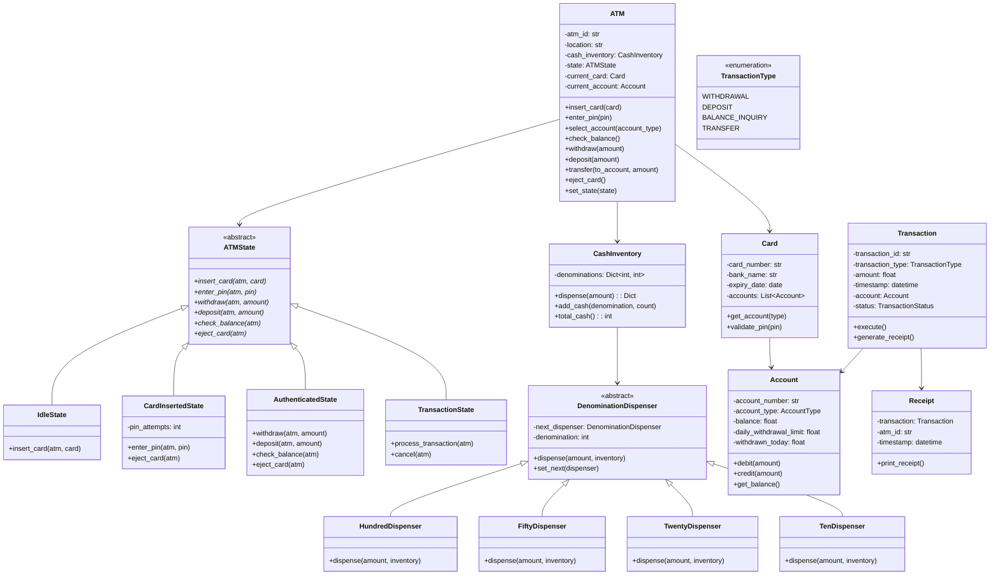
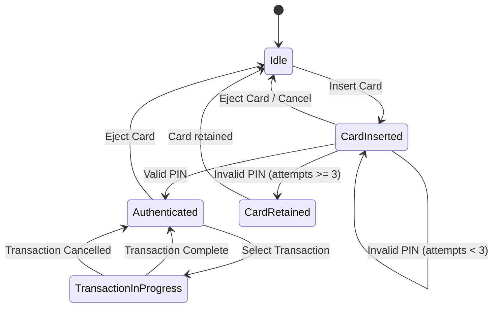
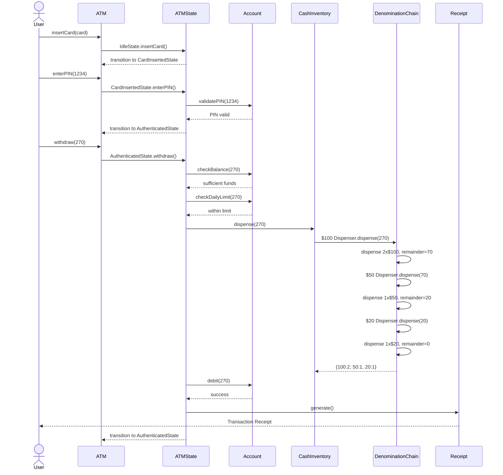

# ATM Machine - Low Level Design

## Problem Statement

Design an ATM (Automated Teller Machine) system that supports card-based authentication, balance inquiries, cash withdrawals with denomination management, cash deposits, fund transfers, and receipt generation.

---

## Requirements

### Functional Requirements
1. **Card Insertion & Ejection** - Accept bank cards, read card data, eject on completion
2. **PIN Verification** - Authenticate user with PIN (max 3 attempts, then retain card)
3. **Balance Inquiry** - Display current account balance
4. **Cash Withdrawal** - Dispense cash in optimal denominations respecting daily limits
5. **Cash Deposit** - Accept cash deposits and credit to account
6. **Fund Transfer** - Transfer money between accounts
7. **Receipt Generation** - Print transaction receipts with details
8. **Multi-Account Support** - Handle savings, checking accounts per card

### Non-Functional Requirements
- Thread safety for concurrent ATM operations
- Audit trail for all transactions
- Graceful error handling (network failure, cash jam)
- Configurable denomination inventory

---

## Design Patterns Used

| Pattern | Where Used | Why |
|---------|-----------|-----|
| **State** | ATM states (Idle, CardInserted, Authenticated, Transaction) | ATM behavior changes based on current state |
| **Strategy** | Denomination dispensing algorithms | Swap between greedy, balanced, or custom algorithms |
| **Chain of Responsibility** | Denomination dispensers ($100 -> $50 -> $20 -> $10) | Each handler dispenses what it can, passes remainder |
| **Observer** | Transaction notifications, audit logging | Decouple transaction processing from side effects |
| **Factory Method** | Transaction creation | Create different transaction types uniformly |

---

## Class Diagram



---

## State Diagram



---

## Sequence Diagram: Cash Withdrawal



---

## Chain of Responsibility: Denomination Dispensing

The denomination dispenser uses a chain where each handler:
1. Calculates how many notes of its denomination it can dispense
2. Checks inventory availability
3. Dispenses what it can
4. Passes the remainder to the next handler

```
$100 Dispenser → $50 Dispenser → $20 Dispenser → $10 Dispenser
```

### Example: Withdraw $270

| Dispenser | Input Amount | Notes Available | Notes Dispensed | Remaining |
|-----------|-------------|-----------------|-----------------|-----------|
| $100 | $270 | 10 | 2 | $70 |
| $50 | $70 | 5 | 1 | $20 |
| $20 | $20 | 8 | 1 | $0 |
| $10 | $0 | 10 | 0 | $0 |

**Result**: 2x$100 + 1x$50 + 1x$20 = $270

---

## Strategy Pattern: Dispensing Algorithms

### Greedy Strategy (Default)
Uses the largest denominations first to minimize total notes dispensed.

### Balanced Strategy
Distributes across denominations to preserve inventory balance.

### Small Notes Strategy
Prefers smaller denominations (useful when large notes are scarce).

```python
class DispenseStrategy(ABC):
    @abstractmethod
    def dispense(self, amount, inventory) -> Dict[int, int]:
        pass

class GreedyDispenseStrategy(DispenseStrategy):
    def dispense(self, amount, inventory):
        # Use chain of responsibility: $100 → $50 → $20 → $10
        pass
```

---

## Edge Cases and Error Handling

### 1. Insufficient Funds
```
User balance: $200, Withdrawal request: $500
→ Reject transaction, display "Insufficient funds"
→ Return to authenticated state (allow retry)
```

### 2. ATM Cash Shortage
```
ATM has only $180 in $10 bills, user requests $200
→ Reject: "ATM cannot dispense this amount"
→ Suggest alternative amount or nearest dispensable amount
```

### 3. Card Retained (3 Failed PIN Attempts)
```
Attempt 1: Wrong PIN → "2 attempts remaining"
Attempt 2: Wrong PIN → "1 attempt remaining"
Attempt 3: Wrong PIN → Card retained, notify bank
→ Return to Idle state
```

### 4. Non-Dispensable Amount
```
User requests $35 (not divisible by $10)
→ Reject: "Amount must be a multiple of $10"
```

### 5. Daily Withdrawal Limit
```
Daily limit: $1000, Already withdrawn: $800, Request: $300
→ Reject: "Exceeds daily limit. Maximum available: $200"
```

### 6. Network Failure During Transaction
```
Debit successful but cash jam occurs
→ Reverse the debit transaction
→ Log incident for reconciliation
→ Display error message
```

### 7. Concurrent Access
```
Two threads accessing same account
→ Use locks/synchronization on account operations
→ Ensure atomicity of debit + dispense
```

---

## Transaction Flow Summary

```
1. IDLE → User inserts card
2. CARD_INSERTED → User enters PIN (max 3 attempts)
3. AUTHENTICATED → User selects transaction type
4. TRANSACTION_IN_PROGRESS → Process transaction
   a. Validate amount and limits
   b. Check ATM cash availability
   c. Execute denomination chain
   d. Debit/credit account
   e. Generate receipt
5. AUTHENTICATED → More transactions or eject card
6. IDLE → Ready for next user
```

---

## Key Interview Discussion Points

### Why State Pattern?
- ATM behavior is entirely dependent on its current state
- Each state only allows certain operations (can't withdraw in Idle state)
- Clean transitions without massive if-else blocks
- Easy to add new states (e.g., MaintenanceState)

### Why Chain of Responsibility for Denominations?
- Each denomination handler is independent and composable
- Easy to add/remove denominations
- Handler only cares about its own denomination
- Natural cascading from large to small denominations

### Why Strategy for Dispensing?
- Multiple valid algorithms for dispensing cash
- Algorithm choice can depend on inventory levels
- Easy to switch strategies at runtime
- Open/Closed principle: new strategies without modifying existing code

### Thread Safety Considerations
- Account balance operations must be atomic
- Cash inventory updates need synchronization
- State transitions should be thread-safe
- Consider using database transactions in real systems

---

## Extensions

1. **Multi-Language Support** - Strategy pattern for language selection
2. **Biometric Authentication** - Strategy pattern for auth methods
3. **Mobile ATM Integration** - Cardless withdrawal via QR code
4. **Denomination Prediction** - ML-based inventory management
5. **Maintenance Mode** - Additional state in state machine

---

## File Structure

```
ATM-Machine/
├── README.md
└── code/
    └── atm_machine.py    # Full implementation with demo
```
