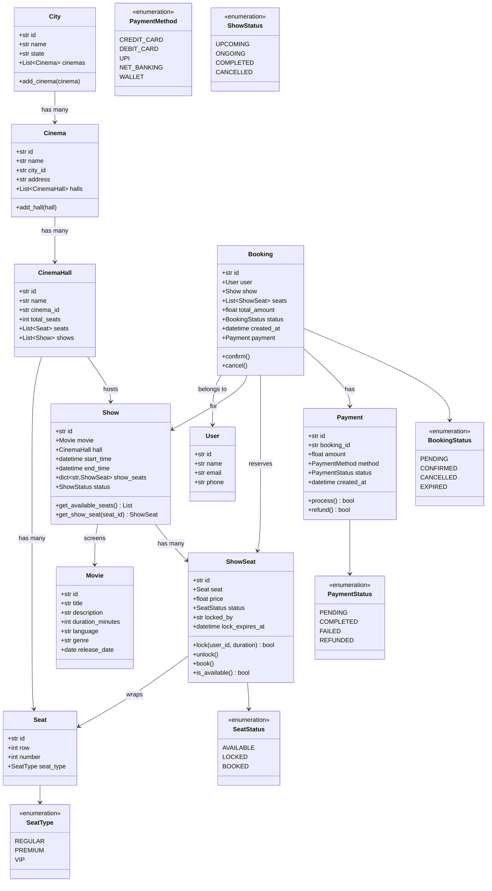
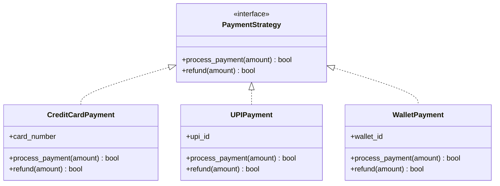
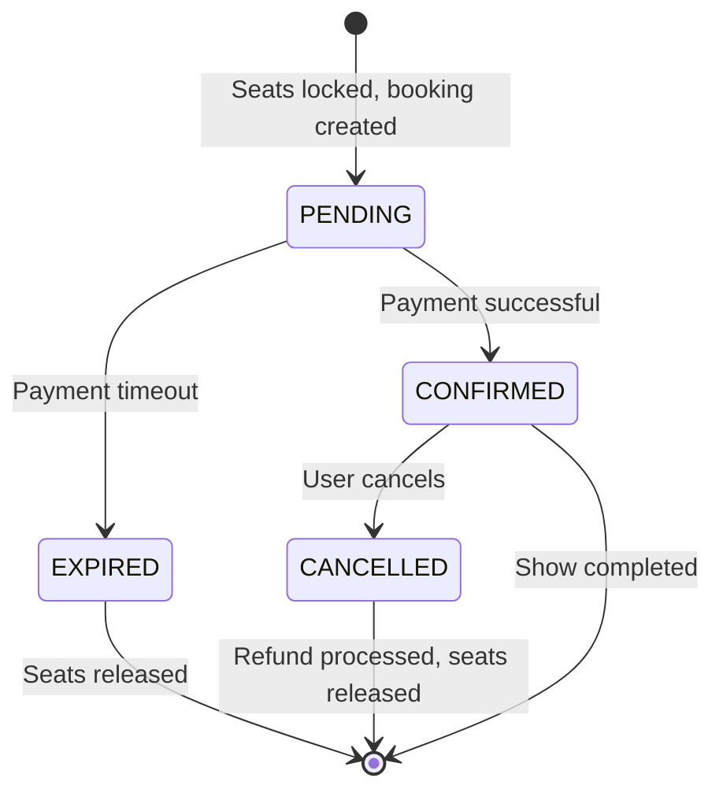
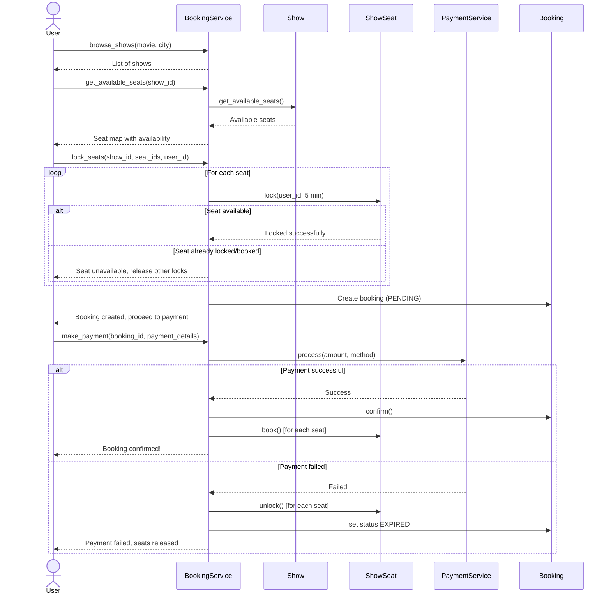
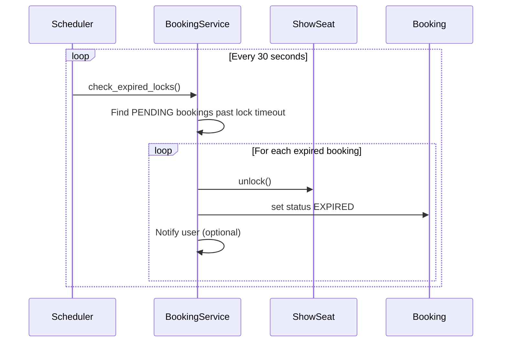

# BookMyShow - Movie Ticket Booking System (Low Level Design)

## 1. Requirements

### Functional Requirements

| Requirement | Detail |
|---|---|
| Browse movies | Search/browse by city and cinema |
| Show timings | View available shows for a movie at a cinema |
| Seat selection | View seat map, select available seats |
| Booking | Book selected seats for a show |
| Seat locking | Temporarily lock seats during booking to prevent double booking |
| Payment | Process payment for booked tickets |
| Cancellation | Cancel booking and process refund |
| Notifications | Confirm booking via email/SMS |

### Non-Functional Requirements

| Requirement | Detail |
|---|---|
| Concurrency | Handle multiple users booking same show simultaneously |
| Consistency | No double booking of the same seat |
| Availability | System should be highly available |
| Timeout | Release locked seats if payment not completed within time limit |

---

## 2. Class Diagram



---

## 3. Key Design Challenges

### Challenge 1: Seat Locking (Preventing Double Booking)

When User A selects a seat, it must be **temporarily locked** so User B cannot book it during User A's payment process.

```
Timeline:
t0: User A selects Seat S1          -> S1 locked for User A (5 min timer)
t1: User B tries to select Seat S1  -> REJECTED (seat is locked)
t2: User A completes payment        -> S1 booked permanently
    -- OR --
t3: 5 minutes pass, no payment      -> S1 lock expires, becomes available
```

### Challenge 2: Concurrency

Multiple users can try to lock the same seat at the same millisecond. We need **atomic lock operations**.

Solution: Use a lock (mutex) per show or per seat, or use database-level optimistic locking.

### Challenge 3: Payment Timeout

If a user locks seats but never pays:
- A background thread/scheduler checks for expired locks.
- Expired locks are released, making seats available again.

---

## 4. Design Patterns

### Singleton - BookingService

One central service manages all bookings to ensure consistency.

### Strategy - Payment Methods

Different payment methods (Credit Card, UPI, Wallet) implement a common interface.



### Observer - Seat Availability Notifications

When a booking is cancelled or a lock expires, notify users who were interested.

### State - Booking Lifecycle



---

## 5. Sequence Diagrams

### Seat Selection and Booking Flow



### Lock Expiry Flow



---

## 6. Complete Python Implementation

### Enums

```python
from enum import Enum
from datetime import datetime, timedelta
from typing import Optional
import threading
import uuid
import time


class SeatType(Enum):
    REGULAR = "regular"
    PREMIUM = "premium"
    VIP = "vip"


class SeatStatus(Enum):
    AVAILABLE = "available"
    LOCKED = "locked"
    BOOKED = "booked"


class BookingStatus(Enum):
    PENDING = "pending"
    CONFIRMED = "confirmed"
    CANCELLED = "cancelled"
    EXPIRED = "expired"


class PaymentStatus(Enum):
    PENDING = "pending"
    COMPLETED = "completed"
    FAILED = "failed"
    REFUNDED = "refunded"


class PaymentMethod(Enum):
    CREDIT_CARD = "credit_card"
    DEBIT_CARD = "debit_card"
    UPI = "upi"
    NET_BANKING = "net_banking"
    WALLET = "wallet"


class ShowStatus(Enum):
    UPCOMING = "upcoming"
    ONGOING = "ongoing"
    COMPLETED = "completed"
    CANCELLED = "cancelled"
```

### Core Models

```python
class Movie:
    def __init__(self, title: str, duration_minutes: int,
                 language: str = "English", genre: str = ""):
        self.id = str(uuid.uuid4())
        self.title = title
        self.duration_minutes = duration_minutes
        self.language = language
        self.genre = genre

    def __repr__(self):
        return f"Movie({self.title})"


class City:
    def __init__(self, name: str, state: str = ""):
        self.id = str(uuid.uuid4())
        self.name = name
        self.state = state
        self.cinemas: list['Cinema'] = []

    def add_cinema(self, cinema: 'Cinema'):
        self.cinemas.append(cinema)


class Cinema:
    def __init__(self, name: str, city: City, address: str = ""):
        self.id = str(uuid.uuid4())
        self.name = name
        self.city = city
        self.address = address
        self.halls: list['CinemaHall'] = []
        city.add_cinema(self)

    def add_hall(self, hall: 'CinemaHall'):
        self.halls.append(hall)

    def __repr__(self):
        return f"Cinema({self.name})"


class Seat:
    def __init__(self, row: int, number: int, seat_type: SeatType = SeatType.REGULAR):
        self.id = str(uuid.uuid4())
        self.row = row
        self.number = number
        self.seat_type = seat_type

    def __repr__(self):
        return f"Seat(R{self.row}-{self.number} {self.seat_type.value})"


class CinemaHall:
    def __init__(self, name: str, cinema: Cinema):
        self.id = str(uuid.uuid4())
        self.name = name
        self.cinema = cinema
        self.seats: list[Seat] = []
        self.shows: list['Show'] = []
        cinema.add_hall(self)

    def add_seats(self, rows: int, seats_per_row: int,
                  seat_type: SeatType = SeatType.REGULAR):
        for r in range(1, rows + 1):
            for s in range(1, seats_per_row + 1):
                self.seats.append(Seat(r, s, seat_type))

    @property
    def total_seats(self) -> int:
        return len(self.seats)
```

### ShowSeat - The Critical Class with Locking

```python
class ShowSeat:
    """
    Represents a specific seat for a specific show.
    Contains the locking mechanism to prevent double booking.
    """

    def __init__(self, seat: Seat, price: float):
        self.id = str(uuid.uuid4())
        self.seat = seat
        self.price = price
        self.status = SeatStatus.AVAILABLE
        self.locked_by: Optional[str] = None
        self.lock_expires_at: Optional[datetime] = None
        self._lock = threading.Lock()  # per-seat lock for thread safety

    def is_available(self) -> bool:
        """Check if seat is available (or if lock has expired)."""
        with self._lock:
            if self.status == SeatStatus.AVAILABLE:
                return True
            if self.status == SeatStatus.LOCKED:
                # Check if lock has expired
                if self.lock_expires_at and datetime.now() > self.lock_expires_at:
                    self._release_lock()
                    return True
            return False

    def lock(self, user_id: str, duration_seconds: int = 300) -> bool:
        """
        Attempt to lock this seat for a user.
        Returns True if lock acquired, False if seat is unavailable.
        Default lock duration: 5 minutes (300 seconds).
        """
        with self._lock:
            # Check for expired lock first
            if (self.status == SeatStatus.LOCKED and
                self.lock_expires_at and datetime.now() > self.lock_expires_at):
                self._release_lock()

            if self.status != SeatStatus.AVAILABLE:
                return False

            self.status = SeatStatus.LOCKED
            self.locked_by = user_id
            self.lock_expires_at = datetime.now() + timedelta(seconds=duration_seconds)
            return True

    def unlock(self) -> None:
        """Release the lock on this seat."""
        with self._lock:
            self._release_lock()

    def book(self) -> bool:
        """Permanently book this seat. Must be locked first."""
        with self._lock:
            if self.status != SeatStatus.LOCKED:
                return False
            self.status = SeatStatus.BOOKED
            self.lock_expires_at = None
            return True

    def release(self) -> None:
        """Release a booked seat (for cancellation)."""
        with self._lock:
            if self.status == SeatStatus.BOOKED:
                self._release_lock()

    def _release_lock(self) -> None:
        """Internal: reset seat to available state."""
        self.status = SeatStatus.AVAILABLE
        self.locked_by = None
        self.lock_expires_at = None

    def __repr__(self):
        return f"ShowSeat({self.seat}, {self.status.value}, ${self.price})"
```

### Show

```python
class Show:
    def __init__(self, movie: Movie, hall: CinemaHall,
                 start_time: datetime, prices: dict[SeatType, float]):
        self.id = str(uuid.uuid4())
        self.movie = movie
        self.hall = hall
        self.start_time = start_time
        self.end_time = start_time + timedelta(minutes=movie.duration_minutes)
        self.status = ShowStatus.UPCOMING
        self.show_seats: dict[str, ShowSeat] = {}

        # Create ShowSeat for each seat in the hall with pricing
        for seat in hall.seats:
            price = prices.get(seat.seat_type, 200.0)
            self.show_seats[seat.id] = ShowSeat(seat, price)

        hall.shows.append(self)

    def get_available_seats(self) -> list[ShowSeat]:
        return [ss for ss in self.show_seats.values() if ss.is_available()]

    def get_show_seat(self, seat_id: str) -> Optional[ShowSeat]:
        return self.show_seats.get(seat_id)

    def __repr__(self):
        available = len(self.get_available_seats())
        total = len(self.show_seats)
        return (f"Show({self.movie.title} at {self.start_time.strftime('%H:%M')} "
                f"- {available}/{total} seats)")
```

### User

```python
class User:
    def __init__(self, name: str, email: str, phone: str = ""):
        self.id = str(uuid.uuid4())
        self.name = name
        self.email = email
        self.phone = phone

    def __repr__(self):
        return f"User({self.name})"
```

### Payment Strategy

```python
class PaymentStrategy:
    """Base class for payment strategies."""
    def process_payment(self, amount: float) -> bool:
        raise NotImplementedError

    def refund(self, amount: float) -> bool:
        raise NotImplementedError


class CreditCardPayment(PaymentStrategy):
    def __init__(self, card_number: str, cvv: str):
        self.card_number = card_number
        self.cvv = cvv

    def process_payment(self, amount: float) -> bool:
        # In real system: call payment gateway API
        print(f"Processing credit card payment of ${amount}")
        return True  # Simulated success

    def refund(self, amount: float) -> bool:
        print(f"Refunding ${amount} to credit card")
        return True


class UPIPayment(PaymentStrategy):
    def __init__(self, upi_id: str):
        self.upi_id = upi_id

    def process_payment(self, amount: float) -> bool:
        print(f"Processing UPI payment of ${amount} via {self.upi_id}")
        return True

    def refund(self, amount: float) -> bool:
        print(f"Refunding ${amount} via UPI to {self.upi_id}")
        return True


class Payment:
    def __init__(self, booking_id: str, amount: float, strategy: PaymentStrategy):
        self.id = str(uuid.uuid4())
        self.booking_id = booking_id
        self.amount = amount
        self.strategy = strategy
        self.status = PaymentStatus.PENDING
        self.created_at = datetime.now()

    def process(self) -> bool:
        success = self.strategy.process_payment(self.amount)
        self.status = PaymentStatus.COMPLETED if success else PaymentStatus.FAILED
        return success

    def refund(self) -> bool:
        if self.status != PaymentStatus.COMPLETED:
            return False
        success = self.strategy.refund(self.amount)
        if success:
            self.status = PaymentStatus.REFUNDED
        return success
```

### Booking

```python
class Booking:
    def __init__(self, user: User, show: Show, show_seats: list[ShowSeat]):
        self.id = str(uuid.uuid4())
        self.user = user
        self.show = show
        self.seats = show_seats
        self.total_amount = sum(ss.price for ss in show_seats)
        self.status = BookingStatus.PENDING
        self.created_at = datetime.now()
        self.payment: Optional[Payment] = None

    def confirm(self, payment: Payment) -> bool:
        """Confirm booking after successful payment."""
        if self.status != BookingStatus.PENDING:
            return False
        self.payment = payment
        self.status = BookingStatus.CONFIRMED
        # Permanently book all seats
        for ss in self.seats:
            ss.book()
        return True

    def cancel(self) -> bool:
        """Cancel a confirmed booking."""
        if self.status != BookingStatus.CONFIRMED:
            return False
        self.status = BookingStatus.CANCELLED
        # Release all seats
        for ss in self.seats:
            ss.release()
        # Process refund
        if self.payment:
            self.payment.refund()
        return True

    def expire(self) -> None:
        """Expire a pending booking (payment timeout)."""
        if self.status != BookingStatus.PENDING:
            return
        self.status = BookingStatus.EXPIRED
        for ss in self.seats:
            ss.unlock()

    def __repr__(self):
        return (f"Booking({self.id[:8]}... {self.user.name} - "
                f"{self.show.movie.title} - {len(self.seats)} seats - "
                f"${self.total_amount} - {self.status.value})")
```

### BookingService - Central Orchestrator (Singleton)

```python
class BookingService:
    """
    Singleton service that manages the entire booking lifecycle.
    Thread-safe seat locking and booking.
    """
    _instance = None
    _init_lock = threading.Lock()

    def __new__(cls):
        with cls._init_lock:
            if cls._instance is None:
                cls._instance = super().__new__(cls)
                cls._instance._initialized = False
            return cls._instance

    def __init__(self):
        if self._initialized:
            return
        self._initialized = True
        self.cities: dict[str, City] = {}
        self.movies: dict[str, Movie] = {}
        self.shows: dict[str, Show] = {}
        self.bookings: dict[str, Booking] = {}
        self._booking_lock = threading.Lock()
        self._cleanup_running = False

    # ---- Data Setup ----

    def add_city(self, city: City):
        self.cities[city.id] = city

    def add_movie(self, movie: Movie):
        self.movies[movie.id] = movie

    def add_show(self, show: Show):
        self.shows[show.id] = show

    # ---- Search ----

    def get_movies_by_city(self, city_id: str) -> list[Movie]:
        """Get all movies currently showing in a city."""
        city = self.cities.get(city_id)
        if not city:
            return []
        movie_ids = set()
        movies = []
        for cinema in city.cinemas:
            for hall in cinema.halls:
                for show in hall.shows:
                    if show.movie.id not in movie_ids:
                        movie_ids.add(show.movie.id)
                        movies.append(show.movie)
        return movies

    def get_shows_for_movie(self, movie_id: str, city_id: str) -> list[Show]:
        """Get all shows for a movie in a city."""
        city = self.cities.get(city_id)
        if not city:
            return []
        shows = []
        for cinema in city.cinemas:
            for hall in cinema.halls:
                for show in hall.shows:
                    if show.movie.id == movie_id and show.status == ShowStatus.UPCOMING:
                        shows.append(show)
        return shows

    def get_available_seats(self, show_id: str) -> list[ShowSeat]:
        """Get available seats for a show."""
        show = self.shows.get(show_id)
        if not show:
            return []
        return show.get_available_seats()

    # ---- Booking Flow ----

    def lock_seats(self, show_id: str, seat_ids: list[str],
                   user_id: str, lock_duration: int = 300) -> Optional[Booking]:
        """
        Attempt to lock the requested seats for a user.
        Returns a Booking in PENDING status if all seats locked successfully.
        Returns None if any seat could not be locked.
        """
        show = self.shows.get(show_id)
        if not show:
            return None

        # Gather ShowSeat objects
        show_seats = []
        for seat_id in seat_ids:
            ss = show.get_show_seat(seat_id)
            if ss is None:
                return None
            show_seats.append(ss)

        # Try to lock all seats atomically
        locked = []
        for ss in show_seats:
            if ss.lock(user_id, lock_duration):
                locked.append(ss)
            else:
                # Rollback: unlock any seats we already locked
                for locked_ss in locked:
                    locked_ss.unlock()
                return None

        # All seats locked - create pending booking
        user = User(user_id, f"{user_id}@example.com")  # simplified
        with self._booking_lock:
            booking = Booking(user, show, locked)
            self.bookings[booking.id] = booking

        return booking

    def make_payment(self, booking_id: str,
                     payment_strategy: PaymentStrategy) -> bool:
        """
        Process payment for a pending booking.
        On success: confirms booking and permanently books seats.
        On failure: releases all locked seats.
        """
        booking = self.bookings.get(booking_id)
        if not booking or booking.status != BookingStatus.PENDING:
            return False

        # Check if booking has expired
        lock_expired = any(
            ss.status != SeatStatus.LOCKED or
            (ss.lock_expires_at and datetime.now() > ss.lock_expires_at)
            for ss in booking.seats
        )
        if lock_expired:
            booking.expire()
            return False

        # Process payment
        payment = Payment(booking_id, booking.total_amount, payment_strategy)
        if payment.process():
            booking.confirm(payment)
            return True
        else:
            booking.expire()
            return False

    def cancel_booking(self, booking_id: str) -> bool:
        """Cancel a confirmed booking and process refund."""
        booking = self.bookings.get(booking_id)
        if not booking:
            return False
        return booking.cancel()

    # ---- Background Cleanup ----

    def start_cleanup_scheduler(self, interval_seconds: int = 30):
        """Start background thread to clean up expired locks."""
        if self._cleanup_running:
            return
        self._cleanup_running = True

        def cleanup_loop():
            while self._cleanup_running:
                self._cleanup_expired_bookings()
                time.sleep(interval_seconds)

        thread = threading.Thread(target=cleanup_loop, daemon=True)
        thread.start()

    def stop_cleanup_scheduler(self):
        self._cleanup_running = False

    def _cleanup_expired_bookings(self):
        """Find and expire bookings with expired seat locks."""
        now = datetime.now()
        with self._booking_lock:
            for booking in list(self.bookings.values()):
                if booking.status != BookingStatus.PENDING:
                    continue
                # Check if any lock has expired
                any_expired = any(
                    ss.lock_expires_at and now > ss.lock_expires_at
                    for ss in booking.seats
                )
                if any_expired:
                    booking.expire()
                    print(f"Expired booking {booking.id[:8]}... "
                          f"(seats released)")
```

### Resetting Singleton (for testing)

```python
    @classmethod
    def reset(cls):
        """Reset singleton instance (for testing only)."""
        with cls._init_lock:
            if cls._instance:
                cls._instance.stop_cleanup_scheduler()
            cls._instance = None
```

---

## 7. Usage Example

```python
if __name__ == "__main__":
    # Reset for clean state
    BookingService.reset()
    service = BookingService()

    # Setup data
    mumbai = City("Mumbai", "Maharashtra")
    service.add_city(mumbai)

    pvr = Cinema("PVR Phoenix", mumbai, "Lower Parel")
    hall1 = CinemaHall("Screen 1", pvr)
    hall1.add_seats(rows=5, seats_per_row=10, seat_type=SeatType.REGULAR)

    movie = Movie("Inception", 148, "English", "Sci-Fi")
    service.add_movie(movie)

    show = Show(
        movie=movie,
        hall=hall1,
        start_time=datetime(2025, 3, 15, 18, 30),
        prices={SeatType.REGULAR: 250.0, SeatType.PREMIUM: 400.0, SeatType.VIP: 600.0}
    )
    service.add_show(show)

    # ---- User Flow ----

    print("=== Browse Movies ===")
    movies = service.get_movies_by_city(mumbai.id)
    for m in movies:
        print(f"  {m.title} ({m.language})")

    print(f"\n=== Shows for {movie.title} ===")
    shows = service.get_shows_for_movie(movie.id, mumbai.id)
    for s in shows:
        print(f"  {s}")

    print(f"\n=== Available Seats ===")
    available = service.get_available_seats(show.id)
    print(f"  {len(available)} seats available")

    # Select first 3 seats
    selected_seat_ids = [available[0].seat.id, available[1].seat.id, available[2].seat.id]

    print(f"\n=== Lock Seats ===")
    booking = service.lock_seats(show.id, selected_seat_ids, "user_123")
    if booking:
        print(f"  {booking}")
        print(f"  Total: ${booking.total_amount}")

        # Another user tries the same seats
        print(f"\n=== Another User Tries Same Seats ===")
        booking2 = service.lock_seats(show.id, selected_seat_ids, "user_456")
        print(f"  Result: {'Locked' if booking2 else 'FAILED - seats already locked'}")

        # First user pays
        print(f"\n=== Payment ===")
        payment_method = CreditCardPayment("4111-1111-1111-1111", "123")
        success = service.make_payment(booking.id, payment_method)
        print(f"  Payment: {'Success' if success else 'Failed'}")
        print(f"  {booking}")

        # Check available seats again
        available_after = service.get_available_seats(show.id)
        print(f"\n=== Seats After Booking ===")
        print(f"  {len(available_after)} seats available (was {len(available)})")

        # Cancel booking
        print(f"\n=== Cancel Booking ===")
        cancelled = service.cancel_booking(booking.id)
        print(f"  Cancelled: {cancelled}")
        print(f"  {booking}")

        available_final = service.get_available_seats(show.id)
        print(f"  {len(available_final)} seats available after cancellation")
    else:
        print("  Failed to lock seats")
```

**Expected Output:**
```
=== Browse Movies ===
  Inception (English)

=== Shows for Inception ===
  Show(Inception at 18:30 - 50/50 seats)

=== Available Seats ===
  50 seats available

=== Lock Seats ===
  Booking(xxxxxxxx... user_123 - Inception - 3 seats - $750.0 - pending)
  Total: $750.0

=== Another User Tries Same Seats ===
  Result: FAILED - seats already locked

=== Payment ===
  Processing credit card payment of $750.0
  Payment: Success
  Booking(xxxxxxxx... user_123 - Inception - 3 seats - $750.0 - confirmed)

=== Seats After Booking ===
  47 seats available (was 50)

=== Cancel Booking ===
  Refunding $750.0 to credit card
  Cancelled: True
  Booking(xxxxxxxx... user_123 - Inception - 3 seats - $750.0 - cancelled)
  50 seats available after cancellation
```

---

## 8. Concurrency Deep Dive

### Why Per-Seat Locking?

A single global lock would serialize all booking operations. Per-seat locks allow:
- Users booking **different seats** to proceed in parallel.
- Only users competing for the **same seat** are serialized.

```python
# Per-seat lock in ShowSeat.__init__:
self._lock = threading.Lock()

# Used in lock(), unlock(), book(), release():
with self._lock:
    # atomic check-and-set
```

### Lock Ordering to Prevent Deadlocks

When locking multiple seats, always acquire locks in a consistent order (e.g., by seat ID) to prevent deadlocks.

```python
def lock_seats_safe(self, show_id, seat_ids, user_id, lock_duration=300):
    """Lock seats in sorted order to prevent deadlocks."""
    sorted_ids = sorted(seat_ids)  # consistent ordering
    # ... proceed with locking in this order
```

### Database-Level Alternative

In production, you would use database transactions with `SELECT ... FOR UPDATE`:

```sql
BEGIN;
SELECT * FROM show_seats
WHERE show_id = ? AND seat_id IN (?, ?, ?) AND status = 'AVAILABLE'
FOR UPDATE;

-- If all seats available:
UPDATE show_seats SET status = 'LOCKED', locked_by = ?, lock_expires_at = ?
WHERE show_id = ? AND seat_id IN (?, ?, ?);
COMMIT;
```

---

## 9. Scaling Considerations

| Challenge | Solution |
|---|---|
| High read traffic (browse/search) | Read replicas, CDN for static data, Redis cache for seat maps |
| Hot shows (high contention) | Partition seats into segments, each with its own lock |
| Payment timeout | Message queue (SQS/Kafka) with delayed messages for expiry |
| Seat map real-time updates | WebSocket push to connected clients when seat status changes |
| Multiple cities/regions | Shard by city; each region has its own database partition |

---

## 10. Interview Tips

| Question | Key Points |
|---|---|
| "How do you prevent double booking?" | Atomic lock-then-book with per-seat mutex or DB `FOR UPDATE` |
| "What if payment takes too long?" | Lock has TTL; background scheduler releases expired locks |
| "How do you handle concurrent users?" | Per-seat locks allow parallel booking of different seats |
| "What if the server crashes after locking?" | DB-level locks with TTL; on restart, clean up stale locks |
| "How would you scale this?" | Shard by city/cinema, cache read-heavy data, async payments via queue |
| "How is this different from flight booking?" | Similar pattern, but flights have fare classes + overbooking. Seat selection is optional for flights |
