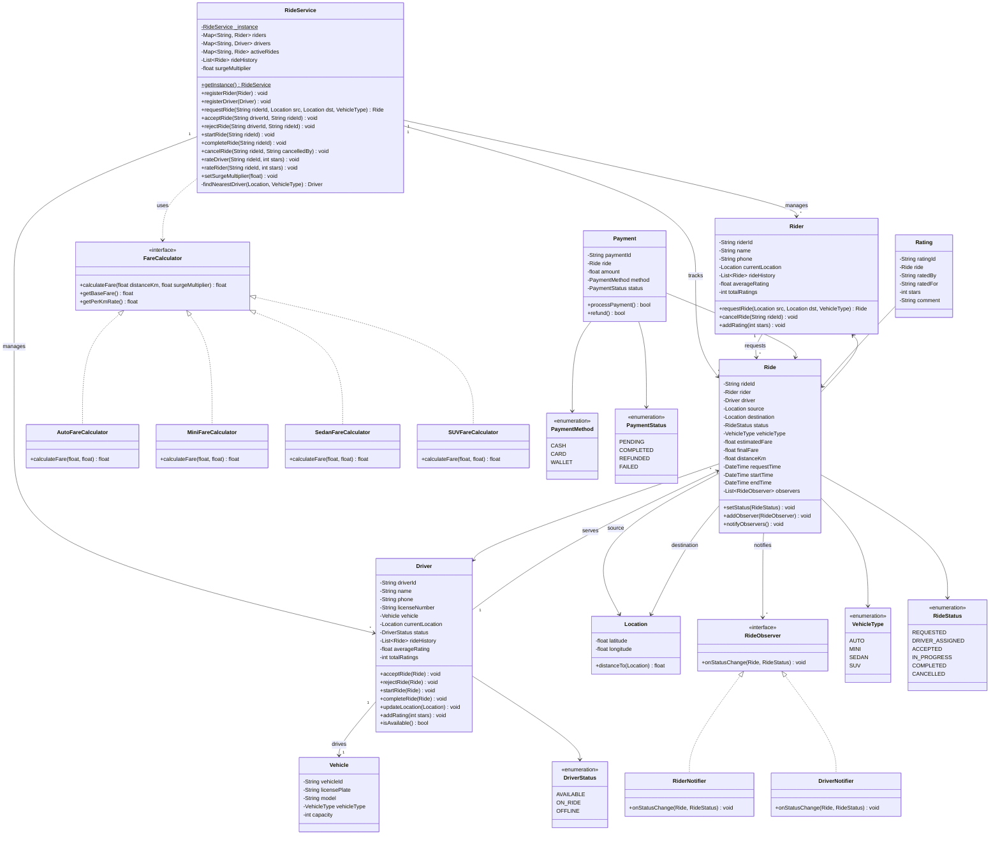
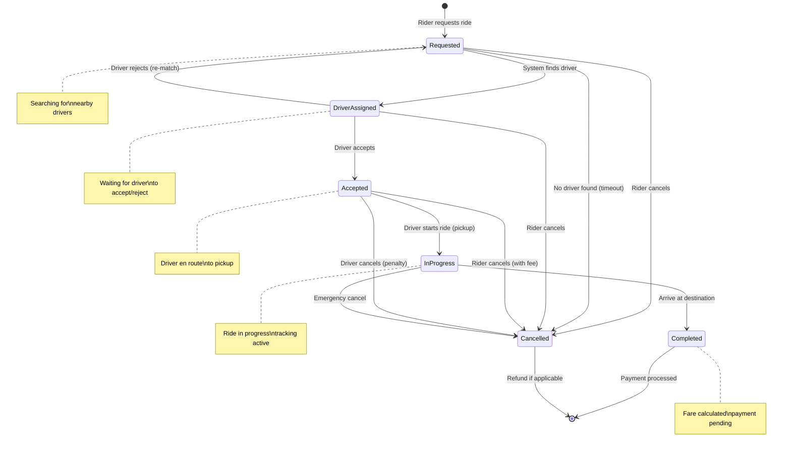
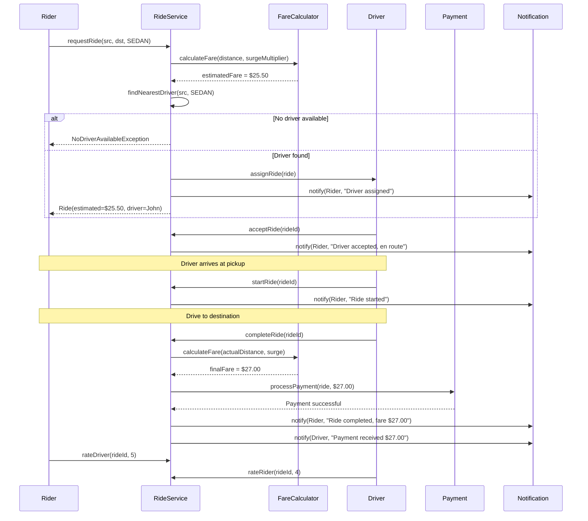
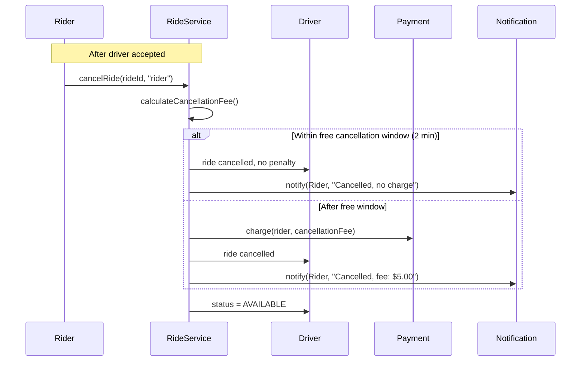

# Cab Booking System (Uber/Ola) - Low Level Design

## 1. Problem Statement

Design a cab booking system that supports:
- Rider requests a ride with source and destination
- System matches the nearest available driver
- Driver accepts or rejects the ride request
- Fare estimation and final calculation
- Real-time trip status tracking
- Rating system for drivers and riders
- Trip history for both parties
- Multiple vehicle types (Auto, Mini, Sedan, SUV)
- Surge pricing during peak demand

---

## 2. Requirements

### Functional Requirements
| # | Requirement |
|---|------------|
| FR-1 | Rider can request a ride (source, destination, vehicle type) |
| FR-2 | System finds and assigns nearest available driver |
| FR-3 | Driver can accept or reject a ride |
| FR-4 | Fare estimation before ride confirmation |
| FR-5 | Real-time ride status updates |
| FR-6 | Fare calculation at ride completion |
| FR-7 | Rating system (1-5 stars, both rider and driver) |
| FR-8 | Trip history for riders and drivers |
| FR-9 | Surge pricing based on demand |
| FR-10 | Cancellation with applicable fees |

### Non-Functional Requirements
- Nearest driver matching with efficient distance calculation
- Extensible fare strategies per vehicle type
- Observable ride state changes for notifications

---

## 3. Class Diagram



---

## 4. State Diagram - Ride Lifecycle



---

## 5. Sequence Diagram - Ride Request Flow



---

## 6. Sequence Diagram - Cancellation Flow



---

## 7. Design Patterns

| Pattern | Usage |
|---------|-------|
| **Singleton** | `RideService` - single instance coordinates all ride operations |
| **Strategy** | `FareCalculator` - different fare strategies per vehicle type |
| **Observer** | `RideObserver` - rider/driver notified on ride status changes |
| **State** | `RideStatus` enum drives behavior at each stage of the ride lifecycle |

---

## 8. Fare Calculation Details

### Base Rates by Vehicle Type

| Vehicle Type | Base Fare | Per Km Rate | Min Fare |
|-------------|-----------|-------------|----------|
| Auto | $2.00 | $0.80 | $3.00 |
| Mini | $3.00 | $1.00 | $5.00 |
| Sedan | $4.00 | $1.50 | $7.00 |
| SUV | $5.00 | $2.00 | $10.00 |

### Surge Pricing

```
finalFare = max(baseFare + (distanceKm * perKmRate), minFare) * surgeMultiplier

Surge multiplier ranges:
  1.0x  - Normal demand
  1.25x - Slightly high demand
  1.5x  - High demand
  2.0x  - Very high demand
  3.0x  - Peak demand (capped)
```

---

## 9. Nearest Driver Algorithm

Simplified Haversine-based distance calculation:

```
function findNearestDriver(riderLocation, vehicleType):
    candidates = drivers.filter(d =>
        d.status == AVAILABLE &&
        d.vehicle.type == vehicleType &&
        d.location.distanceTo(riderLocation) <= MAX_SEARCH_RADIUS
    )

    if candidates is empty:
        throw NoDriverAvailableException

    return candidates.sortBy(d => d.location.distanceTo(riderLocation)).first()
```

---

## 10. Complete Python Implementation

```python
from __future__ import annotations
from abc import ABC, abstractmethod
from enum import Enum
from datetime import datetime, timedelta
from typing import Optional
import uuid
import math
import threading


# ────────────────────────────────────────────
# Enums
# ────────────────────────────────────────────
class VehicleType(Enum):
    AUTO = "auto"
    MINI = "mini"
    SEDAN = "sedan"
    SUV = "suv"


class RideStatus(Enum):
    REQUESTED = "requested"
    DRIVER_ASSIGNED = "driver_assigned"
    ACCEPTED = "accepted"
    IN_PROGRESS = "in_progress"
    COMPLETED = "completed"
    CANCELLED = "cancelled"


class DriverStatus(Enum):
    AVAILABLE = "available"
    ON_RIDE = "on_ride"
    OFFLINE = "offline"


class PaymentMethod(Enum):
    CASH = "cash"
    CARD = "card"
    WALLET = "wallet"


class PaymentStatus(Enum):
    PENDING = "pending"
    COMPLETED = "completed"
    REFUNDED = "refunded"
    FAILED = "failed"


# ────────────────────────────────────────────
# Location
# ────────────────────────────────────────────
class Location:
    def __init__(self, latitude: float, longitude: float):
        self.latitude = latitude
        self.longitude = longitude

    def distance_to(self, other: Location) -> float:
        """
        Haversine formula for distance between two lat/lng points.
        Returns distance in kilometers.
        """
        R = 6371.0  # Earth radius in km
        lat1, lon1 = math.radians(self.latitude), math.radians(self.longitude)
        lat2, lon2 = math.radians(other.latitude), math.radians(other.longitude)

        dlat = lat2 - lat1
        dlon = lon2 - lon1

        a = (math.sin(dlat / 2) ** 2 +
             math.cos(lat1) * math.cos(lat2) * math.sin(dlon / 2) ** 2)
        c = 2 * math.atan2(math.sqrt(a), math.sqrt(1 - a))

        return R * c

    def __repr__(self) -> str:
        return f"({self.latitude:.4f}, {self.longitude:.4f})"


# ────────────────────────────────────────────
# Vehicle
# ────────────────────────────────────────────
class Vehicle:
    def __init__(self, vehicle_id: str, license_plate: str,
                 model: str, vehicle_type: VehicleType, capacity: int):
        self.vehicle_id = vehicle_id
        self.license_plate = license_plate
        self.model = model
        self.vehicle_type = vehicle_type
        self.capacity = capacity

    def __repr__(self) -> str:
        return f"{self.model} ({self.license_plate}) [{self.vehicle_type.value}]"


# ────────────────────────────────────────────
# Strategy Pattern - Fare Calculation
# ────────────────────────────────────────────
class FareCalculator(ABC):
    @abstractmethod
    def calculate_fare(self, distance_km: float,
                       surge_multiplier: float) -> float:
        pass

    @abstractmethod
    def get_base_fare(self) -> float:
        pass

    @abstractmethod
    def get_per_km_rate(self) -> float:
        pass

    @abstractmethod
    def get_min_fare(self) -> float:
        pass


class AutoFareCalculator(FareCalculator):
    def get_base_fare(self) -> float:
        return 2.0

    def get_per_km_rate(self) -> float:
        return 0.8

    def get_min_fare(self) -> float:
        return 3.0

    def calculate_fare(self, distance_km: float,
                       surge_multiplier: float) -> float:
        fare = self.get_base_fare() + (distance_km * self.get_per_km_rate())
        fare = max(fare, self.get_min_fare())
        return round(fare * surge_multiplier, 2)


class MiniFareCalculator(FareCalculator):
    def get_base_fare(self) -> float:
        return 3.0

    def get_per_km_rate(self) -> float:
        return 1.0

    def get_min_fare(self) -> float:
        return 5.0

    def calculate_fare(self, distance_km: float,
                       surge_multiplier: float) -> float:
        fare = self.get_base_fare() + (distance_km * self.get_per_km_rate())
        fare = max(fare, self.get_min_fare())
        return round(fare * surge_multiplier, 2)


class SedanFareCalculator(FareCalculator):
    def get_base_fare(self) -> float:
        return 4.0

    def get_per_km_rate(self) -> float:
        return 1.5

    def get_min_fare(self) -> float:
        return 7.0

    def calculate_fare(self, distance_km: float,
                       surge_multiplier: float) -> float:
        fare = self.get_base_fare() + (distance_km * self.get_per_km_rate())
        fare = max(fare, self.get_min_fare())
        return round(fare * surge_multiplier, 2)


class SUVFareCalculator(FareCalculator):
    def get_base_fare(self) -> float:
        return 5.0

    def get_per_km_rate(self) -> float:
        return 2.0

    def get_min_fare(self) -> float:
        return 10.0

    def calculate_fare(self, distance_km: float,
                       surge_multiplier: float) -> float:
        fare = self.get_base_fare() + (distance_km * self.get_per_km_rate())
        fare = max(fare, self.get_min_fare())
        return round(fare * surge_multiplier, 2)


class FareCalculatorFactory:
    _calculators: dict[VehicleType, FareCalculator] = {
        VehicleType.AUTO: AutoFareCalculator(),
        VehicleType.MINI: MiniFareCalculator(),
        VehicleType.SEDAN: SedanFareCalculator(),
        VehicleType.SUV: SUVFareCalculator(),
    }

    @classmethod
    def get_calculator(cls, vehicle_type: VehicleType) -> FareCalculator:
        return cls._calculators[vehicle_type]


# ────────────────────────────────────────────
# Observer Pattern - Ride Status Notifications
# ────────────────────────────────────────────
class RideObserver(ABC):
    @abstractmethod
    def on_status_change(self, ride: Ride, new_status: RideStatus) -> None:
        pass


class RiderNotifier(RideObserver):
    def on_status_change(self, ride: Ride, new_status: RideStatus) -> None:
        messages = {
            RideStatus.DRIVER_ASSIGNED: (
                f"Driver {ride.driver.name} assigned. "
                f"Vehicle: {ride.driver.vehicle}"
            ),
            RideStatus.ACCEPTED: (
                f"Driver {ride.driver.name} is on the way!"
            ),
            RideStatus.IN_PROGRESS: "Ride started. Enjoy your trip!",
            RideStatus.COMPLETED: (
                f"Ride completed. Fare: ${ride.final_fare:.2f}"
            ),
            RideStatus.CANCELLED: "Ride has been cancelled.",
        }
        msg = messages.get(new_status, f"Ride status: {new_status.value}")
        print(f"  [RIDER NOTIFICATION -> {ride.rider.name}] {msg}")


class DriverNotifier(RideObserver):
    def on_status_change(self, ride: Ride, new_status: RideStatus) -> None:
        messages = {
            RideStatus.DRIVER_ASSIGNED: (
                f"New ride request from {ride.rider.name}. "
                f"Pickup: {ride.source}"
            ),
            RideStatus.CANCELLED: "Ride was cancelled.",
            RideStatus.COMPLETED: (
                f"Ride completed. Earnings: ${ride.final_fare:.2f}"
            ),
        }
        msg = messages.get(new_status)
        if msg and ride.driver:
            print(f"  [DRIVER NOTIFICATION -> {ride.driver.name}] {msg}")


# ────────────────────────────────────────────
# Rating
# ────────────────────────────────────────────
class Rating:
    def __init__(self, ride_id: str, rated_by: str,
                 rated_for: str, stars: int, comment: str = ""):
        self.rating_id = str(uuid.uuid4())[:8]
        self.ride_id = ride_id
        self.rated_by = rated_by
        self.rated_for = rated_for
        self.stars = max(1, min(5, stars))  # clamp 1-5
        self.comment = comment
        self.created_at = datetime.now()

    def __repr__(self) -> str:
        return f"Rating({self.stars} stars by {self.rated_by})"


# ────────────────────────────────────────────
# Payment
# ────────────────────────────────────────────
class Payment:
    def __init__(self, ride: Ride, amount: float,
                 method: PaymentMethod = PaymentMethod.CASH):
        self.payment_id = str(uuid.uuid4())[:8]
        self.ride = ride
        self.amount = amount
        self.method = method
        self.status = PaymentStatus.PENDING
        self.created_at = datetime.now()

    def process_payment(self) -> bool:
        self.status = PaymentStatus.COMPLETED
        print(f"  [PAYMENT] ${self.amount:.2f} via {self.method.value} - "
              f"SUCCESS")
        return True

    def refund(self) -> bool:
        self.status = PaymentStatus.REFUNDED
        print(f"  [REFUND] ${self.amount:.2f} refunded")
        return True

    def __repr__(self) -> str:
        return f"Payment(${self.amount:.2f}, {self.status.value})"


# ────────────────────────────────────────────
# Ride
# ────────────────────────────────────────────
class Ride:
    CANCELLATION_FREE_WINDOW_SECONDS = 120  # 2 minutes
    CANCELLATION_FEE = 5.0

    def __init__(self, rider: Rider, source: Location,
                 destination: Location, vehicle_type: VehicleType):
        self.ride_id = f"RIDE-{uuid.uuid4().hex[:6]}"
        self.rider = rider
        self.driver: Optional[Driver] = None
        self.source = source
        self.destination = destination
        self.vehicle_type = vehicle_type
        self.status = RideStatus.REQUESTED
        self.estimated_fare: float = 0.0
        self.final_fare: float = 0.0
        self.distance_km: float = source.distance_to(destination)
        self.request_time = datetime.now()
        self.start_time: Optional[datetime] = None
        self.end_time: Optional[datetime] = None
        self.payment: Optional[Payment] = None
        self._observers: list[RideObserver] = []

    def set_status(self, new_status: RideStatus) -> None:
        old_status = self.status
        self.status = new_status
        print(f"  Ride {self.ride_id}: {old_status.value} -> "
              f"{new_status.value}")
        self._notify_observers(new_status)

    def add_observer(self, observer: RideObserver) -> None:
        self._observers.append(observer)

    def _notify_observers(self, new_status: RideStatus) -> None:
        for obs in self._observers:
            obs.on_status_change(self, new_status)

    def is_within_free_cancellation(self) -> bool:
        elapsed = (datetime.now() - self.request_time).total_seconds()
        return elapsed <= self.CANCELLATION_FREE_WINDOW_SECONDS

    def __repr__(self) -> str:
        return (f"Ride({self.ride_id}, {self.rider.name}, "
                f"status={self.status.value})")


# ────────────────────────────────────────────
# Rider
# ────────────────────────────────────────────
class Rider:
    def __init__(self, rider_id: str, name: str, phone: str,
                 location: Location):
        self.rider_id = rider_id
        self.name = name
        self.phone = phone
        self.current_location = location
        self.ride_history: list[Ride] = []
        self.average_rating: float = 5.0
        self.total_ratings: int = 0

    def add_rating(self, stars: int) -> None:
        total = self.average_rating * self.total_ratings + stars
        self.total_ratings += 1
        self.average_rating = round(total / self.total_ratings, 2)

    def __repr__(self) -> str:
        return (f"Rider({self.name}, rating={self.average_rating}, "
                f"rides={len(self.ride_history)})")


# ────────────────────────────────────────────
# Driver
# ────────────────────────────────────────────
class Driver:
    def __init__(self, driver_id: str, name: str, phone: str,
                 license_number: str, vehicle: Vehicle,
                 location: Location):
        self.driver_id = driver_id
        self.name = name
        self.phone = phone
        self.license_number = license_number
        self.vehicle = vehicle
        self.current_location = location
        self.status = DriverStatus.AVAILABLE
        self.ride_history: list[Ride] = []
        self.average_rating: float = 5.0
        self.total_ratings: int = 0

    def is_available(self) -> bool:
        return self.status == DriverStatus.AVAILABLE

    def update_location(self, location: Location) -> None:
        self.current_location = location

    def add_rating(self, stars: int) -> None:
        total = self.average_rating * self.total_ratings + stars
        self.total_ratings += 1
        self.average_rating = round(total / self.total_ratings, 2)

    def __repr__(self) -> str:
        return (f"Driver({self.name}, {self.vehicle.vehicle_type.value}, "
                f"rating={self.average_rating}, "
                f"status={self.status.value})")


# ────────────────────────────────────────────
# Singleton - RideService
# ────────────────────────────────────────────
class RideService:
    _instance: Optional[RideService] = None
    _lock = threading.Lock()
    MAX_SEARCH_RADIUS_KM = 10.0

    def __init__(self):
        if RideService._instance is not None:
            raise RuntimeError("Use RideService.get_instance()")
        self.riders: dict[str, Rider] = {}
        self.drivers: dict[str, Driver] = {}
        self.active_rides: dict[str, Ride] = {}
        self.ride_history: list[Ride] = []
        self.surge_multiplier: float = 1.0

    @classmethod
    def get_instance(cls) -> RideService:
        if cls._instance is None:
            with cls._lock:
                if cls._instance is None:
                    cls._instance = RideService()
        return cls._instance

    @classmethod
    def reset_instance(cls) -> None:
        cls._instance = None

    # ── Registration ──
    def register_rider(self, rider: Rider) -> None:
        self.riders[rider.rider_id] = rider
        print(f"Registered rider: {rider.name}")

    def register_driver(self, driver: Driver) -> None:
        self.drivers[driver.driver_id] = driver
        print(f"Registered driver: {driver.name}")

    # ── Ride Request ──
    def request_ride(self, rider_id: str, source: Location,
                     destination: Location,
                     vehicle_type: VehicleType) -> Ride:
        rider = self.riders.get(rider_id)
        if not rider:
            raise ValueError(f"Rider {rider_id} not found.")

        # Check if rider already has an active ride
        for ride in self.active_rides.values():
            if ride.rider.rider_id == rider_id and ride.status not in (
                    RideStatus.COMPLETED, RideStatus.CANCELLED):
                raise ValueError(
                    f"Rider {rider.name} already has an active ride."
                )

        ride = Ride(rider, source, destination, vehicle_type)
        ride.add_observer(RiderNotifier())
        ride.add_observer(DriverNotifier())

        # Calculate estimated fare
        calculator = FareCalculatorFactory.get_calculator(vehicle_type)
        ride.estimated_fare = calculator.calculate_fare(
            ride.distance_km, self.surge_multiplier
        )

        print(f"\nRide requested by {rider.name}")
        print(f"  From: {source} -> To: {destination}")
        print(f"  Distance: {ride.distance_km:.2f} km")
        print(f"  Vehicle: {vehicle_type.value}")
        print(f"  Estimated fare: ${ride.estimated_fare:.2f}"
              f"{' (SURGE x' + str(self.surge_multiplier) + ')' if self.surge_multiplier > 1.0 else ''}")

        # Find nearest driver
        driver = self._find_nearest_driver(source, vehicle_type)
        if not driver:
            ride.set_status(RideStatus.CANCELLED)
            raise ValueError(
                f"No {vehicle_type.value} drivers available nearby."
            )

        ride.driver = driver
        driver.status = DriverStatus.ON_RIDE
        self.active_rides[ride.ride_id] = ride
        ride.set_status(RideStatus.DRIVER_ASSIGNED)

        return ride

    def _find_nearest_driver(self, location: Location,
                             vehicle_type: VehicleType) -> Optional[Driver]:
        """Find nearest available driver within search radius."""
        candidates = []
        for driver in self.drivers.values():
            if (driver.is_available() and
                    driver.vehicle.vehicle_type == vehicle_type):
                dist = driver.current_location.distance_to(location)
                if dist <= self.MAX_SEARCH_RADIUS_KM:
                    candidates.append((driver, dist))

        if not candidates:
            return None

        candidates.sort(key=lambda x: x[1])
        nearest_driver, dist = candidates[0]
        print(f"  Nearest driver: {nearest_driver.name} "
              f"({dist:.2f} km away)")
        return nearest_driver

    # ── Driver Actions ──
    def accept_ride(self, driver_id: str, ride_id: str) -> None:
        ride = self.active_rides.get(ride_id)
        if not ride:
            raise ValueError(f"Ride {ride_id} not found.")
        if ride.driver.driver_id != driver_id:
            raise PermissionError("This ride is not assigned to you.")
        if ride.status != RideStatus.DRIVER_ASSIGNED:
            raise ValueError(f"Ride cannot be accepted in state "
                             f"{ride.status.value}.")

        ride.set_status(RideStatus.ACCEPTED)
        print(f"  Driver {ride.driver.name} accepted the ride.")

    def reject_ride(self, driver_id: str, ride_id: str) -> None:
        ride = self.active_rides.get(ride_id)
        if not ride:
            raise ValueError(f"Ride {ride_id} not found.")

        driver = self.drivers.get(driver_id)
        driver.status = DriverStatus.AVAILABLE
        print(f"  Driver {driver.name} rejected the ride. Re-matching...")

        # Try to find another driver
        new_driver = self._find_nearest_driver(
            ride.source, ride.vehicle_type
        )
        if new_driver:
            ride.driver = new_driver
            new_driver.status = DriverStatus.ON_RIDE
            ride.set_status(RideStatus.DRIVER_ASSIGNED)
        else:
            ride.set_status(RideStatus.CANCELLED)
            del self.active_rides[ride_id]
            print(f"  No other drivers available. Ride cancelled.")

    # ── Ride Lifecycle ──
    def start_ride(self, ride_id: str) -> None:
        ride = self.active_rides.get(ride_id)
        if not ride:
            raise ValueError(f"Ride {ride_id} not found.")
        if ride.status != RideStatus.ACCEPTED:
            raise ValueError(f"Ride cannot start in state "
                             f"{ride.status.value}.")

        ride.start_time = datetime.now()
        ride.set_status(RideStatus.IN_PROGRESS)

    def complete_ride(self, ride_id: str) -> None:
        ride = self.active_rides.get(ride_id)
        if not ride:
            raise ValueError(f"Ride {ride_id} not found.")
        if ride.status != RideStatus.IN_PROGRESS:
            raise ValueError(f"Ride cannot complete in state "
                             f"{ride.status.value}.")

        ride.end_time = datetime.now()

        # Calculate final fare
        calculator = FareCalculatorFactory.get_calculator(ride.vehicle_type)
        ride.final_fare = calculator.calculate_fare(
            ride.distance_km, self.surge_multiplier
        )

        # Process payment
        ride.payment = Payment(ride, ride.final_fare)
        ride.payment.process_payment()

        ride.set_status(RideStatus.COMPLETED)

        # Update histories
        ride.rider.ride_history.append(ride)
        ride.driver.ride_history.append(ride)
        ride.driver.status = DriverStatus.AVAILABLE

        del self.active_rides[ride_id]
        self.ride_history.append(ride)

    def cancel_ride(self, ride_id: str, cancelled_by: str) -> None:
        ride = self.active_rides.get(ride_id)
        if not ride:
            raise ValueError(f"Ride {ride_id} not found.")
        if ride.status in (RideStatus.COMPLETED, RideStatus.CANCELLED):
            raise ValueError(f"Ride is already {ride.status.value}.")

        print(f"\n  Cancellation requested by {cancelled_by}")

        cancellation_fee = 0.0
        if ride.status == RideStatus.ACCEPTED:
            if not ride.is_within_free_cancellation():
                cancellation_fee = Ride.CANCELLATION_FEE
                print(f"  Cancellation fee: ${cancellation_fee:.2f}")
            else:
                print(f"  Within free cancellation window.")

        ride.set_status(RideStatus.CANCELLED)

        if ride.driver:
            ride.driver.status = DriverStatus.AVAILABLE

        if cancellation_fee > 0:
            ride.payment = Payment(ride, cancellation_fee)
            ride.payment.process_payment()

        del self.active_rides[ride_id]
        self.ride_history.append(ride)

    # ── Ratings ──
    def rate_driver(self, ride_id: str, stars: int,
                    comment: str = "") -> Rating:
        ride = self._find_ride_in_history(ride_id)
        if not ride:
            raise ValueError(f"Ride {ride_id} not found.")
        if ride.status != RideStatus.COMPLETED:
            raise ValueError("Can only rate completed rides.")

        rating = Rating(ride_id, ride.rider.rider_id,
                        ride.driver.driver_id, stars, comment)
        ride.driver.add_rating(stars)
        print(f"  {ride.rider.name} rated driver {ride.driver.name}: "
              f"{stars} stars")
        return rating

    def rate_rider(self, ride_id: str, stars: int,
                   comment: str = "") -> Rating:
        ride = self._find_ride_in_history(ride_id)
        if not ride:
            raise ValueError(f"Ride {ride_id} not found.")
        if ride.status != RideStatus.COMPLETED:
            raise ValueError("Can only rate completed rides.")

        rating = Rating(ride_id, ride.driver.driver_id,
                        ride.rider.rider_id, stars, comment)
        ride.rider.add_rating(stars)
        print(f"  {ride.driver.name} rated rider {ride.rider.name}: "
              f"{stars} stars")
        return rating

    def _find_ride_in_history(self, ride_id: str) -> Optional[Ride]:
        for ride in self.ride_history:
            if ride.ride_id == ride_id:
                return ride
        return None

    # ── Surge ──
    def set_surge_multiplier(self, multiplier: float) -> None:
        self.surge_multiplier = min(max(multiplier, 1.0), 3.0)  # cap at 3x
        print(f"\n[SYSTEM] Surge multiplier set to {self.surge_multiplier}x")

    # ── Trip History ──
    def get_rider_history(self, rider_id: str) -> list[Ride]:
        rider = self.riders.get(rider_id)
        if rider:
            return rider.ride_history
        return []

    def get_driver_history(self, driver_id: str) -> list[Ride]:
        driver = self.drivers.get(driver_id)
        if driver:
            return driver.ride_history
        return []


# ────────────────────────────────────────────
# Demo / Driver Code
# ────────────────────────────────────────────
def main():
    RideService.reset_instance()
    service = RideService.get_instance()

    # ── Setup: Register riders ──
    print("=" * 60)
    print("SETUP: Registering riders and drivers")
    print("=" * 60)

    # Locations around a city center (approximate lat/lng)
    rider1 = Rider("R1", "Alice", "555-0001",
                    Location(12.9716, 77.5946))   # Central
    rider2 = Rider("R2", "Bob", "555-0002",
                    Location(12.9800, 77.5900))   # North

    service.register_rider(rider1)
    service.register_rider(rider2)

    # ── Setup: Register drivers ──
    driver1 = Driver(
        "D1", "Dave", "555-1001", "DL-001",
        Vehicle("V1", "KA-01-1234", "Maruti Swift",
                VehicleType.MINI, 4),
        Location(12.9750, 77.5960)  # 0.5 km from Alice
    )
    driver2 = Driver(
        "D2", "Eve", "555-1002", "DL-002",
        Vehicle("V2", "KA-01-5678", "Toyota Innova",
                VehicleType.SUV, 7),
        Location(12.9700, 77.5900)  # nearby
    )
    driver3 = Driver(
        "D3", "Frank", "555-1003", "DL-003",
        Vehicle("V3", "KA-01-9999", "Honda City",
                VehicleType.SEDAN, 4),
        Location(12.9720, 77.5950)  # close
    )
    driver4 = Driver(
        "D4", "Grace", "555-1004", "DL-004",
        Vehicle("V4", "KA-01-7777", "Auto Rickshaw",
                VehicleType.AUTO, 3),
        Location(12.9730, 77.5940)  # close
    )

    service.register_driver(driver1)
    service.register_driver(driver2)
    service.register_driver(driver3)
    service.register_driver(driver4)

    # ── Scenario 1: Successful SEDAN ride ──
    print("\n" + "=" * 60)
    print("SCENARIO 1: Successful Sedan Ride")
    print("=" * 60)

    destination1 = Location(12.9352, 77.6245)  # ~5 km south
    ride1 = service.request_ride("R1", rider1.current_location,
                                  destination1, VehicleType.SEDAN)

    service.accept_ride("D3", ride1.ride_id)
    service.start_ride(ride1.ride_id)
    service.complete_ride(ride1.ride_id)

    # Rate
    service.rate_driver(ride1.ride_id, 5, "Great driver!")
    service.rate_rider(ride1.ride_id, 4, "Good passenger")

    # ── Scenario 2: Driver rejects, re-match ──
    print("\n" + "=" * 60)
    print("SCENARIO 2: Driver Rejection and Re-matching")
    print("=" * 60)

    # Add another MINI driver so re-match can work
    driver5 = Driver(
        "D5", "Henry", "555-1005", "DL-005",
        Vehicle("V5", "KA-01-3333", "Hyundai i10",
                VehicleType.MINI, 4),
        Location(12.9740, 77.5935)
    )
    service.register_driver(driver5)

    destination2 = Location(12.9500, 77.6100)
    ride2 = service.request_ride("R2", rider2.current_location,
                                  destination2, VehicleType.MINI)

    # First driver rejects
    assigned_driver_id = ride2.driver.driver_id
    service.reject_ride(assigned_driver_id, ride2.ride_id)

    # New driver assigned, accepts
    if ride2.status != RideStatus.CANCELLED:
        service.accept_ride(ride2.driver.driver_id, ride2.ride_id)
        service.start_ride(ride2.ride_id)
        service.complete_ride(ride2.ride_id)

    # ── Scenario 3: Cancellation ──
    print("\n" + "=" * 60)
    print("SCENARIO 3: Ride Cancellation After Acceptance")
    print("=" * 60)

    destination3 = Location(12.9600, 77.5800)
    ride3 = service.request_ride("R1", rider1.current_location,
                                  destination3, VehicleType.AUTO)
    service.accept_ride(ride3.driver.driver_id, ride3.ride_id)

    # Simulate past the free cancellation window
    ride3.request_time = datetime.now() - timedelta(minutes=5)
    service.cancel_ride(ride3.ride_id, "rider")

    # ── Scenario 4: Surge pricing ──
    print("\n" + "=" * 60)
    print("SCENARIO 4: Surge Pricing (2x)")
    print("=" * 60)

    service.set_surge_multiplier(2.0)

    destination4 = Location(12.9200, 77.6300)  # ~6-7 km away
    ride4 = service.request_ride("R2", rider2.current_location,
                                  destination4, VehicleType.SUV)
    service.accept_ride(ride4.driver.driver_id, ride4.ride_id)
    service.start_ride(ride4.ride_id)
    service.complete_ride(ride4.ride_id)

    service.set_surge_multiplier(1.0)  # Reset surge

    # ── Scenario 5: No driver available ──
    print("\n" + "=" * 60)
    print("SCENARIO 5: No Driver Available")
    print("=" * 60)

    try:
        # Request SUV but Eve is the only SUV driver and she is now
        # available again after completing ride4. Let's put her offline.
        driver2.status = DriverStatus.OFFLINE
        destination5 = Location(12.9400, 77.5700)
        ride5 = service.request_ride("R1", rider1.current_location,
                                      destination5, VehicleType.SUV)
    except ValueError as e:
        print(f"  Error: {e}")

    # ── Trip History ──
    print("\n" + "=" * 60)
    print("TRIP HISTORY")
    print("=" * 60)
    print(f"\nAlice's ride history:")
    for r in service.get_rider_history("R1"):
        print(f"  {r.ride_id}: {r.status.value}, "
              f"fare=${r.final_fare:.2f}")

    print(f"\nBob's ride history:")
    for r in service.get_rider_history("R2"):
        print(f"  {r.ride_id}: {r.status.value}, "
              f"fare=${r.final_fare:.2f}")

    # ── Driver Ratings ──
    print("\n" + "=" * 60)
    print("DRIVER RATINGS")
    print("=" * 60)
    for d in service.drivers.values():
        print(f"  {d.name}: {d.average_rating} stars "
              f"({d.total_ratings} ratings)")

    print("\nDone.")


if __name__ == "__main__":
    main()
```

---

## 11. Edge Cases Summary

| Edge Case | Handling |
|-----------|----------|
| No drivers available | `ValueError` raised, ride status set to CANCELLED |
| Driver rejects ride | Re-matching attempted with next nearest driver |
| All drivers reject | Ride cancelled after exhausting candidates |
| Rider already has active ride | Blocked from requesting another |
| Cancellation within 2 min | Free cancellation, no fee |
| Cancellation after 2 min | $5.00 cancellation fee charged |
| Surge pricing cap | Multiplier capped at 3.0x maximum |
| Rating out of range | Clamped to 1-5 range |
| Rating before completion | Rejected with error |
| Driver offline | Excluded from matching |
| Distance beyond search radius | Driver not considered (10 km radius) |
| Duplicate ride request | Blocked if rider has active ride |

---

## 12. Nearest Driver Algorithm Details

The `_find_nearest_driver` method uses the **Haversine formula** for distance:

```
d = 2R * arcsin(sqrt(
    sin^2((lat2-lat1)/2) +
    cos(lat1) * cos(lat2) * sin^2((lon2-lon1)/2)
))
```

**Complexity**: O(D) where D is the total number of drivers.

**Production optimization**: In a real system, this would use:
- **Geohashing** or **S2 cells** for spatial indexing
- **R-tree** or **KD-tree** for efficient nearest-neighbor queries
- **Redis GEO** commands for in-memory geospatial queries
- The simplified linear scan shown here works for interview demonstration purposes

---

## 13. Key Interview Talking Points

1. **Strategy Pattern for fares**: Each vehicle type has its own `FareCalculator`. Adding a new vehicle type (e.g., Luxury) requires one new class -- zero changes to existing code.

2. **Observer Pattern for notifications**: Both rider and driver receive real-time updates through `RideObserver`. New notification channels (push, SMS) are added by implementing the interface.

3. **State-driven lifecycle**: The ride progresses through well-defined states (`REQUESTED -> DRIVER_ASSIGNED -> ACCEPTED -> IN_PROGRESS -> COMPLETED`). Invalid transitions are rejected at each step.

4. **Haversine distance**: Demonstrates awareness of geospatial computation. Mention the limitations (Earth is not a perfect sphere) and production alternatives (geohashing, spatial indexes).

5. **Surge pricing**: The multiplier is capped at 3.0x and applied transparently through the fare calculator. The same `calculate_fare` interface handles both normal and surge pricing.

6. **Cancellation policy**: Time-based free window (2 minutes) with fees afterward. The policy is configurable through class constants.

7. **Re-matching on rejection**: When a driver rejects, the system automatically tries to find the next nearest driver -- demonstrating graceful degradation.

8. **Singleton with thread safety**: `RideService` uses double-checked locking, critical for a service that would handle concurrent ride requests in production.
