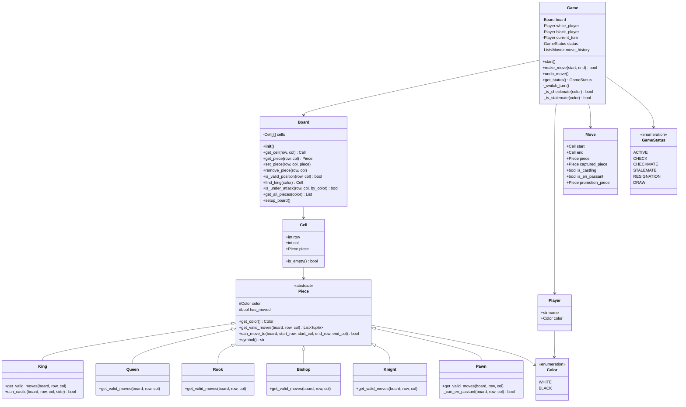
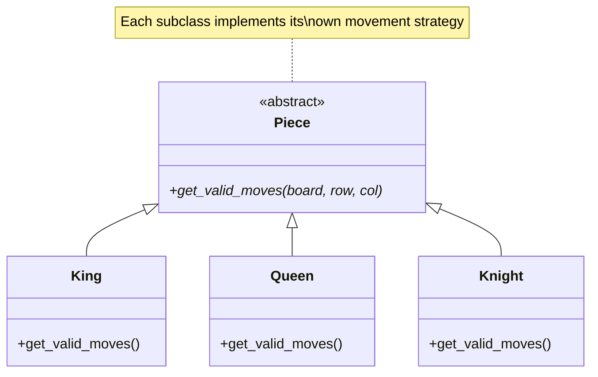
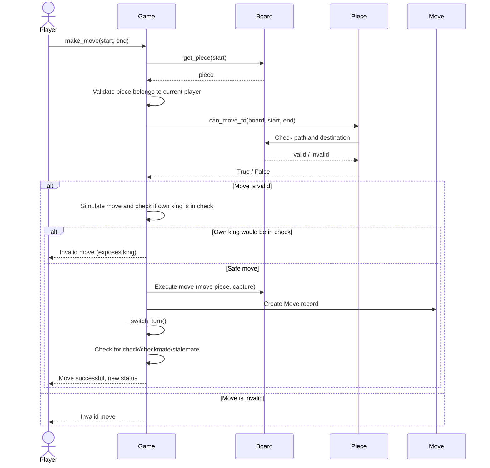
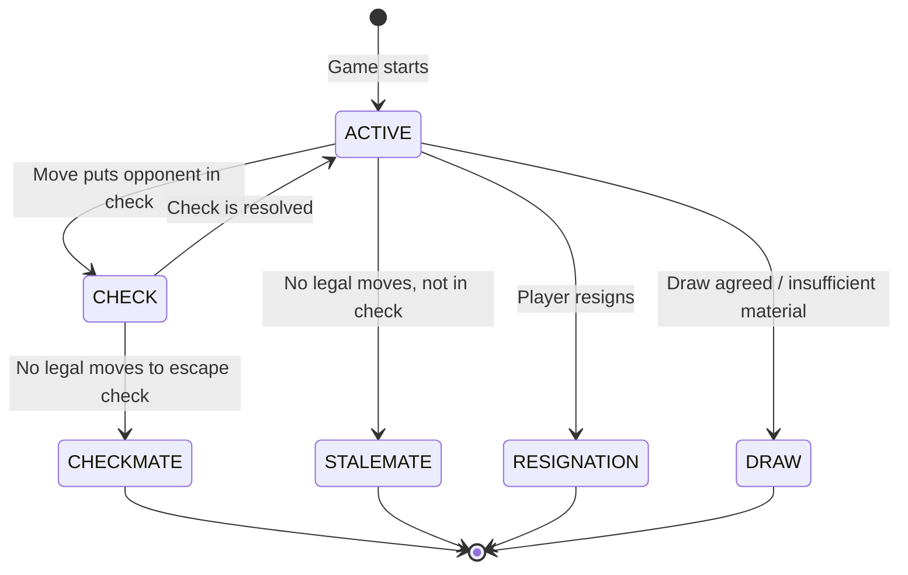

# Chess Game - Low Level Design

## 1. Requirements

### Functional Requirements

| Requirement | Detail |
|---|---|
| Board | Standard 8x8 chess board |
| Players | 2 players - White and Black |
| Pieces | King, Queen, Rook, Bishop, Knight, Pawn (6 types) |
| Movement | Each piece type has unique movement rules |
| Validation | Only legal moves allowed |
| Check | Detect when a King is under attack |
| Checkmate | Detect when a King cannot escape check |
| Stalemate | Detect when a player has no legal moves but is not in check |
| Special moves | Castling, en passant, pawn promotion |
| Turn-based | White moves first, players alternate |
| Move history | Record all moves for undo/review |

### Non-Functional Requirements
- Clean OOP design with SOLID principles
- Extensible for new features (timers, different variants)
- Separation of game logic from UI

---

## 2. Class Diagram



---

## 3. Design Patterns

### Strategy Pattern - Piece Movement

Each piece type encapsulates its own movement logic. The `Piece` base class defines the interface; subclasses implement specific strategies.



### Command Pattern - Moves

Each `Move` is a command object storing enough state to execute and undo.

```
Move:
  - piece, start position, end position
  - captured piece (for undo)
  - special flags (castling, en passant, promotion)

Execute: move piece, capture, update flags
Undo: restore piece, restore captured piece, revert flags
```

### Observer Pattern - Check Detection

After every move, the game checks if the opponent's king is in check, triggering status updates.

---

## 4. Sequence Diagram - Making a Move



---

## 5. Game State Diagram



---

## 6. Complete Python Implementation

### Enums and Constants

```python
from enum import Enum
from abc import ABC, abstractmethod
from copy import deepcopy
from typing import Optional


class Color(Enum):
    WHITE = "white"
    BLACK = "black"

    def opposite(self):
        return Color.BLACK if self == Color.WHITE else Color.WHITE


class GameStatus(Enum):
    ACTIVE = "active"
    CHECK = "check"
    CHECKMATE = "checkmate"
    STALEMATE = "stalemate"
    RESIGNATION = "resignation"
    DRAW = "draw"
```

### Cell / Square

```python
class Cell:
    def __init__(self, row: int, col: int, piece: Optional['Piece'] = None):
        self.row = row
        self.col = col
        self.piece = piece

    def is_empty(self) -> bool:
        return self.piece is None

    def __repr__(self):
        return f"Cell({self.row},{self.col},{self.piece})"
```

### Piece Base Class

```python
class Piece(ABC):
    def __init__(self, color: Color):
        self.color = color
        self.has_moved = False

    @abstractmethod
    def get_valid_moves(self, board: 'Board', row: int, col: int) -> list[tuple[int, int]]:
        """Return list of (row, col) positions this piece can move to."""
        pass

    def can_move_to(self, board: 'Board', start_row: int, start_col: int,
                    end_row: int, end_col: int) -> bool:
        return (end_row, end_col) in self.get_valid_moves(board, start_row, start_col)

    @abstractmethod
    def symbol(self) -> str:
        pass

    def _is_enemy(self, other: Optional['Piece']) -> bool:
        return other is not None and other.color != self.color

    def _is_empty_or_enemy(self, board: 'Board', row: int, col: int) -> bool:
        if not board.is_valid_position(row, col):
            return False
        cell = board.get_cell(row, col)
        return cell.is_empty() or self._is_enemy(cell.piece)

    def _get_sliding_moves(self, board: 'Board', row: int, col: int,
                           directions: list[tuple[int, int]]) -> list[tuple[int, int]]:
        """Get moves for sliding pieces (Queen, Rook, Bishop)."""
        moves = []
        for dr, dc in directions:
            r, c = row + dr, col + dc
            while board.is_valid_position(r, c):
                cell = board.get_cell(r, c)
                if cell.is_empty():
                    moves.append((r, c))
                elif self._is_enemy(cell.piece):
                    moves.append((r, c))
                    break
                else:
                    break  # friendly piece blocks
                r += dr
                c += dc
        return moves

    def __repr__(self):
        return f"{self.symbol()}"
```

### Piece Implementations

```python
class King(Piece):
    def get_valid_moves(self, board: 'Board', row: int, col: int) -> list[tuple[int, int]]:
        moves = []
        for dr in [-1, 0, 1]:
            for dc in [-1, 0, 1]:
                if dr == 0 and dc == 0:
                    continue
                r, c = row + dr, col + dc
                if self._is_empty_or_enemy(board, r, c):
                    moves.append((r, c))

        # Castling
        if not self.has_moved:
            # King-side castling
            if self._can_castle_kingside(board, row, col):
                moves.append((row, col + 2))
            # Queen-side castling
            if self._can_castle_queenside(board, row, col):
                moves.append((row, col - 2))

        return moves

    def _can_castle_kingside(self, board: 'Board', row: int, col: int) -> bool:
        # Check rook at (row, 7)
        rook_cell = board.get_cell(row, 7)
        if rook_cell.is_empty() or not isinstance(rook_cell.piece, Rook):
            return False
        if rook_cell.piece.has_moved:
            return False
        # Squares between must be empty
        if not board.get_cell(row, 5).is_empty() or not board.get_cell(row, 6).is_empty():
            return False
        # King must not pass through or land on attacked square
        enemy = self.color.opposite()
        for c in [col, col + 1, col + 2]:
            if board.is_under_attack(row, c, enemy):
                return False
        return True

    def _can_castle_queenside(self, board: 'Board', row: int, col: int) -> bool:
        rook_cell = board.get_cell(row, 0)
        if rook_cell.is_empty() or not isinstance(rook_cell.piece, Rook):
            return False
        if rook_cell.piece.has_moved:
            return False
        if (not board.get_cell(row, 1).is_empty() or
            not board.get_cell(row, 2).is_empty() or
            not board.get_cell(row, 3).is_empty()):
            return False
        enemy = self.color.opposite()
        for c in [col, col - 1, col - 2]:
            if board.is_under_attack(row, c, enemy):
                return False
        return True

    def symbol(self) -> str:
        return 'K' if self.color == Color.WHITE else 'k'


class Queen(Piece):
    def get_valid_moves(self, board: 'Board', row: int, col: int) -> list[tuple[int, int]]:
        directions = [(-1,-1),(-1,0),(-1,1),(0,-1),(0,1),(1,-1),(1,0),(1,1)]
        return self._get_sliding_moves(board, row, col, directions)

    def symbol(self) -> str:
        return 'Q' if self.color == Color.WHITE else 'q'


class Rook(Piece):
    def get_valid_moves(self, board: 'Board', row: int, col: int) -> list[tuple[int, int]]:
        directions = [(-1,0),(1,0),(0,-1),(0,1)]
        return self._get_sliding_moves(board, row, col, directions)

    def symbol(self) -> str:
        return 'R' if self.color == Color.WHITE else 'r'


class Bishop(Piece):
    def get_valid_moves(self, board: 'Board', row: int, col: int) -> list[tuple[int, int]]:
        directions = [(-1,-1),(-1,1),(1,-1),(1,1)]
        return self._get_sliding_moves(board, row, col, directions)

    def symbol(self) -> str:
        return 'B' if self.color == Color.WHITE else 'b'


class Knight(Piece):
    def get_valid_moves(self, board: 'Board', row: int, col: int) -> list[tuple[int, int]]:
        moves = []
        offsets = [(-2,-1),(-2,1),(-1,-2),(-1,2),(1,-2),(1,2),(2,-1),(2,1)]
        for dr, dc in offsets:
            r, c = row + dr, col + dc
            if self._is_empty_or_enemy(board, r, c):
                moves.append((r, c))
        return moves

    def symbol(self) -> str:
        return 'N' if self.color == Color.WHITE else 'n'


class Pawn(Piece):
    def get_valid_moves(self, board: 'Board', row: int, col: int) -> list[tuple[int, int]]:
        moves = []
        direction = -1 if self.color == Color.WHITE else 1  # White goes up (row decreases)
        start_row = 6 if self.color == Color.WHITE else 1

        # Forward one
        r = row + direction
        if board.is_valid_position(r, col) and board.get_cell(r, col).is_empty():
            moves.append((r, col))

            # Forward two from start
            r2 = row + 2 * direction
            if row == start_row and board.get_cell(r2, col).is_empty():
                moves.append((r2, col))

        # Diagonal captures
        for dc in [-1, 1]:
            r, c = row + direction, col + dc
            if board.is_valid_position(r, c):
                cell = board.get_cell(r, c)
                if not cell.is_empty() and self._is_enemy(cell.piece):
                    moves.append((r, c))

        # En passant
        en_passant_moves = self._get_en_passant_moves(board, row, col, direction)
        moves.extend(en_passant_moves)

        return moves

    def _get_en_passant_moves(self, board: 'Board', row: int, col: int,
                               direction: int) -> list[tuple[int, int]]:
        moves = []
        # En passant is possible when pawn is on rank 4 (white) or rank 3 (black)
        en_passant_row = 3 if self.color == Color.WHITE else 4
        if row != en_passant_row:
            return moves

        if board.last_move is None:
            return moves

        last_move = board.last_move
        # Check if last move was a two-square pawn advance adjacent to us
        if (isinstance(last_move.piece, Pawn) and
            abs(last_move.start_row - last_move.end_row) == 2 and
            last_move.end_row == row and
            abs(last_move.end_col - col) == 1):
            moves.append((row + direction, last_move.end_col))

        return moves

    def symbol(self) -> str:
        return 'P' if self.color == Color.WHITE else 'p'
```

### Move Class

```python
class Move:
    def __init__(self, piece: Piece, start_row: int, start_col: int,
                 end_row: int, end_col: int,
                 captured_piece: Optional[Piece] = None,
                 is_castling: bool = False,
                 is_en_passant: bool = False,
                 promotion_piece: Optional[Piece] = None):
        self.piece = piece
        self.start_row = start_row
        self.start_col = start_col
        self.end_row = end_row
        self.end_col = end_col
        self.captured_piece = captured_piece
        self.is_castling = is_castling
        self.is_en_passant = is_en_passant
        self.promotion_piece = promotion_piece
        self.piece_had_moved = piece.has_moved  # for undo

    def __repr__(self):
        cols = 'abcdefgh'
        start = f"{cols[self.start_col]}{8 - self.start_row}"
        end = f"{cols[self.end_col]}{8 - self.end_row}"
        return f"{self.piece.symbol()}: {start}->{end}"
```

### Board Class

```python
class Board:
    def __init__(self):
        self.cells: list[list[Cell]] = []
        self.last_move: Optional[Move] = None
        self._setup_empty_board()

    def _setup_empty_board(self):
        self.cells = [[Cell(r, c) for c in range(8)] for r in range(8)]

    def setup_board(self):
        """Place all pieces in starting position."""
        # Black pieces (row 0)
        back_row_black = [Rook(Color.BLACK), Knight(Color.BLACK), Bishop(Color.BLACK),
                          Queen(Color.BLACK), King(Color.BLACK), Bishop(Color.BLACK),
                          Knight(Color.BLACK), Rook(Color.BLACK)]
        for c, piece in enumerate(back_row_black):
            self.cells[0][c].piece = piece

        # Black pawns (row 1)
        for c in range(8):
            self.cells[1][c].piece = Pawn(Color.BLACK)

        # White pawns (row 6)
        for c in range(8):
            self.cells[6][c].piece = Pawn(Color.WHITE)

        # White pieces (row 7)
        back_row_white = [Rook(Color.WHITE), Knight(Color.WHITE), Bishop(Color.WHITE),
                          Queen(Color.WHITE), King(Color.WHITE), Bishop(Color.WHITE),
                          Knight(Color.WHITE), Rook(Color.WHITE)]
        for c, piece in enumerate(back_row_white):
            self.cells[7][c].piece = piece

    def get_cell(self, row: int, col: int) -> Cell:
        return self.cells[row][col]

    def get_piece(self, row: int, col: int) -> Optional[Piece]:
        return self.cells[row][col].piece

    def set_piece(self, row: int, col: int, piece: Optional[Piece]):
        self.cells[row][col].piece = piece

    def remove_piece(self, row: int, col: int) -> Optional[Piece]:
        piece = self.cells[row][col].piece
        self.cells[row][col].piece = None
        return piece

    def is_valid_position(self, row: int, col: int) -> bool:
        return 0 <= row < 8 and 0 <= col < 8

    def find_king(self, color: Color) -> tuple[int, int]:
        for r in range(8):
            for c in range(8):
                piece = self.cells[r][c].piece
                if isinstance(piece, King) and piece.color == color:
                    return (r, c)
        raise ValueError(f"No {color} king found")

    def is_under_attack(self, row: int, col: int, by_color: Color) -> bool:
        """Check if a square is attacked by any piece of given color."""
        for r in range(8):
            for c in range(8):
                piece = self.cells[r][c].piece
                if piece is not None and piece.color == by_color:
                    if (row, col) in piece.get_valid_moves(self, r, c):
                        return True
        return False

    def get_all_pieces(self, color: Color) -> list[tuple[int, int, Piece]]:
        """Return list of (row, col, piece) for all pieces of given color."""
        pieces = []
        for r in range(8):
            for c in range(8):
                piece = self.cells[r][c].piece
                if piece is not None and piece.color == color:
                    pieces.append((r, c, piece))
        return pieces

    def display(self) -> str:
        lines = ["  a b c d e f g h"]
        for r in range(8):
            row_str = f"{8 - r} "
            for c in range(8):
                piece = self.cells[r][c].piece
                row_str += (piece.symbol() if piece else '.') + ' '
            row_str += f"{8 - r}"
            lines.append(row_str)
        lines.append("  a b c d e f g h")
        return '\n'.join(lines)
```

### Player Class

```python
class Player:
    def __init__(self, name: str, color: Color):
        self.name = name
        self.color = color

    def __repr__(self):
        return f"Player({self.name}, {self.color.value})"
```

### Game Controller

```python
class Game:
    def __init__(self, white_name: str = "White", black_name: str = "Black"):
        self.board = Board()
        self.board.setup_board()
        self.white_player = Player(white_name, Color.WHITE)
        self.black_player = Player(black_name, Color.BLACK)
        self.current_turn = self.white_player
        self.status = GameStatus.ACTIVE
        self.move_history: list[Move] = []

    def make_move(self, start_row: int, start_col: int,
                  end_row: int, end_col: int,
                  promotion_piece_type: type = Queen) -> bool:
        """
        Attempt to make a move. Returns True if move was successful.
        """
        if self.status in (GameStatus.CHECKMATE, GameStatus.STALEMATE,
                           GameStatus.RESIGNATION, GameStatus.DRAW):
            return False

        piece = self.board.get_piece(start_row, start_col)

        # Validate piece exists and belongs to current player
        if piece is None or piece.color != self.current_turn.color:
            return False

        # Validate move is legal for this piece
        if not piece.can_move_to(self.board, start_row, start_col, end_row, end_col):
            return False

        # Detect special moves
        captured_piece = self.board.get_piece(end_row, end_col)
        is_castling = isinstance(piece, King) and abs(end_col - start_col) == 2
        is_en_passant = (isinstance(piece, Pawn) and
                         start_col != end_col and captured_piece is None)

        if is_en_passant:
            captured_piece = self.board.get_piece(start_row, end_col)

        # Simulate move to check if it leaves own king in check
        if not self._is_safe_move(piece, start_row, start_col, end_row, end_col,
                                   is_castling, is_en_passant):
            return False

        # Execute move
        move = self._execute_move(piece, start_row, start_col, end_row, end_col,
                                   captured_piece, is_castling, is_en_passant,
                                   promotion_piece_type)
        self.move_history.append(move)
        self.board.last_move = move

        # Switch turn and update game status
        self._switch_turn()
        self._update_status()

        return True

    def _execute_move(self, piece, sr, sc, er, ec, captured,
                      is_castling, is_en_passant, promo_type) -> Move:
        promotion_piece = None

        # Handle en passant capture
        if is_en_passant:
            self.board.remove_piece(sr, ec)  # remove captured pawn

        # Handle castling - move the rook
        if is_castling:
            if ec > sc:  # King-side
                rook = self.board.remove_piece(sr, 7)
                self.board.set_piece(sr, 5, rook)
                rook.has_moved = True
            else:  # Queen-side
                rook = self.board.remove_piece(sr, 0)
                self.board.set_piece(sr, 3, rook)
                rook.has_moved = True

        # Move the piece
        self.board.remove_piece(sr, sc)
        self.board.set_piece(er, ec, piece)
        piece.has_moved = True

        # Handle pawn promotion
        if isinstance(piece, Pawn) and (er == 0 or er == 7):
            promotion_piece = promo_type(piece.color)
            self.board.set_piece(er, ec, promotion_piece)

        return Move(piece, sr, sc, er, ec, captured, is_castling,
                    is_en_passant, promotion_piece)

    def _is_safe_move(self, piece, sr, sc, er, ec, is_castling, is_en_passant) -> bool:
        """Simulate the move and check if own king is still safe."""
        # Save state
        dest_piece = self.board.get_piece(er, ec)
        en_passant_captured = None

        # Simulate
        self.board.set_piece(sr, sc, None)
        self.board.set_piece(er, ec, piece)

        if is_en_passant:
            en_passant_captured = self.board.remove_piece(sr, ec)

        # Check if own king is under attack
        king_pos = self.board.find_king(piece.color)
        in_check = self.board.is_under_attack(king_pos[0], king_pos[1],
                                               piece.color.opposite())

        # Restore state
        self.board.set_piece(sr, sc, piece)
        self.board.set_piece(er, ec, dest_piece)

        if is_en_passant and en_passant_captured:
            self.board.set_piece(sr, ec, en_passant_captured)

        return not in_check

    def undo_move(self) -> bool:
        """Undo the last move."""
        if not self.move_history:
            return False

        move = self.move_history.pop()

        # Restore piece to start position
        piece = move.piece
        if move.promotion_piece:
            # Was promoted, put the pawn back
            self.board.set_piece(move.start_row, move.start_col, piece)
        else:
            current_piece = self.board.get_piece(move.end_row, move.end_col)
            self.board.set_piece(move.start_row, move.start_col, current_piece)

        self.board.set_piece(move.end_row, move.end_col, None)
        piece.has_moved = move.piece_had_moved

        # Restore captured piece
        if move.is_en_passant:
            self.board.set_piece(move.start_row, move.end_col, move.captured_piece)
        elif move.captured_piece:
            self.board.set_piece(move.end_row, move.end_col, move.captured_piece)

        # Undo castling rook move
        if move.is_castling:
            if move.end_col > move.start_col:  # King-side
                rook = self.board.remove_piece(move.start_row, 5)
                self.board.set_piece(move.start_row, 7, rook)
                rook.has_moved = False
            else:  # Queen-side
                rook = self.board.remove_piece(move.start_row, 3)
                self.board.set_piece(move.start_row, 0, rook)
                rook.has_moved = False

        self._switch_turn()
        self.board.last_move = self.move_history[-1] if self.move_history else None
        self._update_status()
        return True

    def _switch_turn(self):
        self.current_turn = (self.black_player if self.current_turn == self.white_player
                             else self.white_player)

    def _update_status(self):
        color = self.current_turn.color
        king_pos = self.board.find_king(color)
        in_check = self.board.is_under_attack(king_pos[0], king_pos[1],
                                               color.opposite())
        has_legal = self._has_any_legal_move(color)

        if in_check and not has_legal:
            self.status = GameStatus.CHECKMATE
        elif not in_check and not has_legal:
            self.status = GameStatus.STALEMATE
        elif in_check:
            self.status = GameStatus.CHECK
        else:
            self.status = GameStatus.ACTIVE

    def _has_any_legal_move(self, color: Color) -> bool:
        """Check if the given color has any legal move."""
        for r, c, piece in self.board.get_all_pieces(color):
            for er, ec in piece.get_valid_moves(self.board, r, c):
                is_castling = isinstance(piece, King) and abs(ec - c) == 2
                is_en_passant = (isinstance(piece, Pawn) and
                                 c != ec and self.board.get_cell(er, ec).is_empty())
                if self._is_safe_move(piece, r, c, er, ec, is_castling, is_en_passant):
                    return True
        return False

    def display(self):
        print(self.board.display())
        print(f"Turn: {self.current_turn.name} ({self.current_turn.color.value})")
        print(f"Status: {self.status.value}")
        if self.move_history:
            print(f"Last move: {self.move_history[-1]}")
```

### Usage Example

```python
if __name__ == "__main__":
    game = Game("Alice", "Bob")
    game.display()
    print()

    # Scholar's mate sequence
    moves = [
        (6, 4, 4, 4),  # e2-e4
        (1, 4, 3, 4),  # e7-e5
        (7, 5, 4, 2),  # Bf1-c4
        (1, 1, 2, 2),  # b7-b6 (blunder)
        (7, 3, 3, 7),  # Qd1-h5
        (1, 0, 2, 0),  # a7-a6 (blunder)
        (3, 7, 1, 5),  # Qh5-f7 checkmate!
    ]

    for sr, sc, er, ec in moves:
        success = game.make_move(sr, sc, er, ec)
        if success:
            game.display()
            print()
        else:
            print(f"Invalid move: ({sr},{sc})->({er},{ec})")

        if game.status == GameStatus.CHECKMATE:
            winner = "White" if game.current_turn.color == Color.BLACK else "Black"
            # Note: current_turn already switched, so the previous player won
            # Actually checkmate means current player lost
            print(f"Checkmate! {game.current_turn.color.opposite().value} wins!")
            break
```

---

## 7. Key Design Decisions

### Why abstract `Piece` class?

- **Open/Closed Principle**: Add new piece types (fairy chess) without modifying existing code.
- **Polymorphism**: `piece.get_valid_moves()` works uniformly regardless of piece type.

### Why `Move` as an object?

- **Command Pattern**: Each move stores enough state to undo. The move history is a stack of commands.
- **Immutable record**: Once created, a Move captures a snapshot of that action.

### Check validation approach

Instead of a complex check detection system, we use a simple simulation approach:
1. Temporarily make the move on the board.
2. Check if own king is under attack.
3. Undo the temporary move.
4. Only allow the move if king is safe.

This is clean and correct, though for a chess engine you would optimize this.

---

## 8. Extending the Design

### Adding a Timer

```python
class ChessTimer:
    def __init__(self, time_limit_seconds: float):
        self.white_time = time_limit_seconds
        self.black_time = time_limit_seconds
        self.active_color: Optional[Color] = None
        self.last_switch_time: float = 0

    def start(self, color: Color):
        self.active_color = color
        self.last_switch_time = time.time()

    def switch(self):
        elapsed = time.time() - self.last_switch_time
        if self.active_color == Color.WHITE:
            self.white_time -= elapsed
            self.active_color = Color.BLACK
        else:
            self.black_time -= elapsed
            self.active_color = Color.WHITE
        self.last_switch_time = time.time()

    def is_time_up(self, color: Color) -> bool:
        remaining = self.white_time if color == Color.WHITE else self.black_time
        if color == self.active_color:
            remaining -= (time.time() - self.last_switch_time)
        return remaining <= 0
```

### Adding Move Notation

```python
def to_algebraic(move: Move) -> str:
    cols = 'abcdefgh'
    piece_symbol = '' if isinstance(move.piece, Pawn) else move.piece.symbol().upper()
    capture = 'x' if move.captured_piece else ''
    dest = f"{cols[move.end_col]}{8 - move.end_row}"

    if move.is_castling:
        return "O-O" if move.end_col > move.start_col else "O-O-O"

    if isinstance(move.piece, Pawn) and capture:
        return f"{cols[move.start_col]}x{dest}"

    return f"{piece_symbol}{capture}{dest}"
```

---

## 9. Interview Tips

| Question | Key Points |
|---|---|
| "Design a chess game" | Focus on piece hierarchy, board representation, move validation |
| "How do you detect check?" | After each move, check if opponent's king is attacked by any piece |
| "How do you detect checkmate?" | King is in check AND no legal move for any piece resolves it |
| "How do you handle special moves?" | Castling: King + Rook move together. En passant: captured pawn not on dest square. Promotion: replace pawn with chosen piece |
| "How would you add undo?" | Command pattern - Move objects store full state for reversal |
| "What design patterns?" | Strategy (movement), Command (moves), Observer (check notification) |
