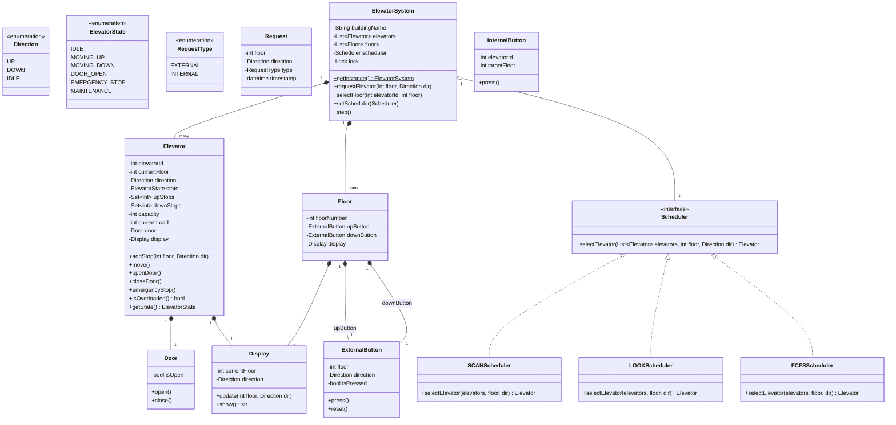

# Elevator System - Low Level Design

> A complete interview-ready LLD solution with requirements, state machines, class design, scheduling algorithms, full Python implementation, and discussion points.

---

## Step 1: Requirements Gathering

### Functional Requirements

| # | Requirement |
|---|------------|
| FR-1 | Multiple elevators serving a building with N floors |
| FR-2 | External request buttons on each floor (Up / Down) |
| FR-3 | Internal request buttons inside each elevator (floor selection) |
| FR-4 | Scheduling algorithm to dispatch the optimal elevator |
| FR-5 | Door open/close mechanism with safety timeout |
| FR-6 | Display current floor and direction on each floor and inside each elevator |
| FR-7 | Emergency stop button inside each elevator |
| FR-8 | Weight limit detection — refuse to move if overloaded |

### Non-Functional Requirements

| # | Requirement |
|---|------------|
| NFR-1 | Minimize average wait time for passengers |
| NFR-2 | Handle concurrent requests from multiple floors simultaneously |
| NFR-3 | Thread-safe operations across all elevators |
| NFR-4 | Pluggable scheduling algorithms (SCAN, LOOK, FCFS) |
| NFR-5 | Real-time display updates |

### Capacity Estimates (for discussion)

- Building: 20 floors, 4 elevators
- Peak traffic: 100+ requests/minute (morning rush)
- Elevator capacity: 10 persons / 800 kg

---

## Step 2: Use Case Identification

### Actors

| Actor | Description |
|-------|------------|
| **Passenger** | Presses external/internal buttons to request elevator service |
| **Elevator** | Moves between floors, opens/closes doors |
| **Scheduler** | Decides which elevator handles which request |
| **Admin** | Puts elevators into maintenance mode |

### Use Case Diagram


---

## Step 3: State Machine

### Elevator State Diagram


### State Definitions

| State | Description |
|-------|------------|
| **Idle** | Elevator is stationary with no pending requests |
| **MovingUp** | Elevator is moving upward toward a target floor |
| **MovingDown** | Elevator is moving downward toward a target floor |
| **DoorOpen** | Elevator has arrived at a floor; door is open for passengers |
| **EmergencyStop** | Emergency button pressed; elevator halts immediately |
| **Maintenance** | Elevator is out of service for maintenance |

---

## Step 4: Class Design

### Core Classes

| Class | Responsibility |
|-------|---------------|
| `ElevatorSystem` | Singleton; owns all elevators and floors; dispatches requests |
| `Elevator` | Represents one elevator car; manages its own state, direction, and request queue |
| `Floor` | Represents a building floor; has up/down external buttons and a display |
| `Request` | Encapsulates a floor request with direction |
| `InternalButton` | Button panel inside the elevator for selecting destination floors |
| `ExternalButton` | Up/Down buttons on each floor |
| `Door` | Door open/close mechanism with safety timer |
| `Display` | Shows current floor and direction |
| `Scheduler` | Strategy interface for dispatching algorithms |
| `SCANScheduler` | SCAN (elevator) algorithm implementation |
| `LOOKScheduler` | LOOK algorithm implementation |
| `FCFSScheduler` | First Come First Served algorithm |

### Class Diagram



---

## Step 5: Design Patterns Used

### 1. Singleton Pattern — ElevatorSystem

One centralized system manages all elevators and dispatching.

### 2. State Pattern — Elevator States

The elevator's behavior changes based on its current state (Idle, MovingUp, MovingDown, DoorOpen, EmergencyStop, Maintenance). Transitions are governed by the state diagram above.

### 3. Strategy Pattern — Scheduling Algorithms

The `Scheduler` interface allows plugging in different algorithms (SCAN, LOOK, FCFS) without changing the `ElevatorSystem` code.

```
Scheduler (interface)
  ├── SCANScheduler
  ├── LOOKScheduler
  └── FCFSScheduler
```

### 4. Observer Pattern — Display Updates

Each `Elevator` updates its `Display` whenever it moves. Each `Floor` display is also updated when an elevator arrives.

### 5. Command Pattern — Button Requests

Each button press creates a `Request` object that is enqueued for processing. This decouples the button press from the dispatch logic.

---

## Step 6: Complete Python Implementation

```python
"""
Elevator System - Low Level Design
Complete, runnable implementation with multiple scheduling algorithms.
"""

import threading
import time
from enum import Enum
from datetime import datetime
from abc import ABC, abstractmethod


# ──────────────────────────── Enums ────────────────────────────

class Direction(Enum):
    UP = "UP"
    DOWN = "DOWN"
    IDLE = "IDLE"


class ElevatorState(Enum):
    IDLE = "IDLE"
    MOVING_UP = "MOVING_UP"
    MOVING_DOWN = "MOVING_DOWN"
    DOOR_OPEN = "DOOR_OPEN"
    EMERGENCY_STOP = "EMERGENCY_STOP"
    MAINTENANCE = "MAINTENANCE"


class RequestType(Enum):
    EXTERNAL = "EXTERNAL"
    INTERNAL = "INTERNAL"


# ──────────────────────────── Request ──────────────────────────

class Request:
    def __init__(self, floor: int, direction: Direction, req_type: RequestType):
        self.floor = floor
        self.direction = direction
        self.type = req_type
        self.timestamp = datetime.now()

    def __repr__(self):
        return f"Request(floor={self.floor}, dir={self.direction.value}, type={self.type.value})"


# ──────────────────────── Door & Display ───────────────────────

class Door:
    def __init__(self):
        self.is_open = False

    def open(self):
        self.is_open = True

    def close(self):
        self.is_open = False


class Display:
    """Observer — updated by its parent (Elevator or Floor)."""

    def __init__(self, label: str):
        self.label = label
        self.current_floor = 0
        self.direction = Direction.IDLE

    def update(self, floor: int, direction: Direction):
        self.current_floor = floor
        self.direction = direction

    def show(self) -> str:
        arrow = {"UP": "^", "DOWN": "v", "IDLE": "-"}[self.direction.value]
        return f"[{self.label}] Floor: {self.current_floor} {arrow}"


# ──────────────────────────── Buttons ──────────────────────────

class ExternalButton:
    def __init__(self, floor: int, direction: Direction):
        self.floor = floor
        self.direction = direction
        self.is_pressed = False

    def press(self) -> Request:
        self.is_pressed = True
        return Request(self.floor, self.direction, RequestType.EXTERNAL)

    def reset(self):
        self.is_pressed = False


class InternalButton:
    def __init__(self, elevator_id: int):
        self.elevator_id = elevator_id

    def press(self, target_floor: int) -> Request:
        return Request(target_floor, Direction.IDLE, RequestType.INTERNAL)


# ──────────────────────────── Floor ────────────────────────────

class Floor:
    def __init__(self, floor_number: int, total_floors: int):
        self.floor_number = floor_number
        # Bottom floor: only UP; top floor: only DOWN; others: both
        self.up_button = ExternalButton(floor_number, Direction.UP) if floor_number < total_floors - 1 else None
        self.down_button = ExternalButton(floor_number, Direction.DOWN) if floor_number > 0 else None
        self.display = Display(f"Floor-{floor_number}")


# ──────────────────────────── Elevator ─────────────────────────

class Elevator:
    def __init__(self, elevator_id: int, total_floors: int, capacity: int = 10):
        self.elevator_id = elevator_id
        self.current_floor = 0
        self.direction = Direction.IDLE
        self.state = ElevatorState.IDLE
        self.total_floors = total_floors
        self.capacity = capacity
        self.current_load = 0

        # Stops the elevator needs to make in each direction
        self.up_stops: set[int] = set()
        self.down_stops: set[int] = set()

        self.door = Door()
        self.display = Display(f"Elevator-{elevator_id}")
        self.internal_button = InternalButton(elevator_id)
        self._lock = threading.Lock()

    def add_stop(self, floor: int, direction: Direction):
        """Add a floor to the appropriate stop set."""
        with self._lock:
            if direction == Direction.UP or (direction == Direction.IDLE and floor >= self.current_floor):
                self.up_stops.add(floor)
            elif direction == Direction.DOWN or (direction == Direction.IDLE and floor < self.current_floor):
                self.down_stops.add(floor)

            # If idle, start moving
            if self.state == ElevatorState.IDLE:
                if floor > self.current_floor:
                    self.state = ElevatorState.MOVING_UP
                    self.direction = Direction.UP
                elif floor < self.current_floor:
                    self.state = ElevatorState.MOVING_DOWN
                    self.direction = Direction.DOWN
                else:
                    # Same floor — open door
                    self.state = ElevatorState.DOOR_OPEN

    def has_pending_stops(self) -> bool:
        return len(self.up_stops) > 0 or len(self.down_stops) > 0

    def is_overloaded(self) -> bool:
        return self.current_load > self.capacity

    def emergency_stop(self):
        with self._lock:
            self.state = ElevatorState.EMERGENCY_STOP
            self.direction = Direction.IDLE
            print(f"    *** Elevator {self.elevator_id}: EMERGENCY STOP ***")

    def set_maintenance(self):
        with self._lock:
            self.state = ElevatorState.MAINTENANCE
            self.direction = Direction.IDLE

    def reset_from_emergency(self):
        with self._lock:
            self.state = ElevatorState.IDLE
            self.direction = Direction.IDLE

    def step(self):
        """
        Advance the elevator by one step (simulate one time tick).
        This is the core state machine transition method.
        """
        with self._lock:
            if self.state in (ElevatorState.EMERGENCY_STOP, ElevatorState.MAINTENANCE):
                return

            if self.state == ElevatorState.DOOR_OPEN:
                self._close_door_and_decide()
                return

            if self.state == ElevatorState.MOVING_UP:
                self._move_up()
                return

            if self.state == ElevatorState.MOVING_DOWN:
                self._move_down()
                return

            if self.state == ElevatorState.IDLE:
                self._decide_from_idle()
                return

    def _move_up(self):
        self.current_floor += 1
        self._update_display()
        print(f"    Elevator {self.elevator_id}: moved UP to floor {self.current_floor}")

        if self.current_floor in self.up_stops:
            self.up_stops.discard(self.current_floor)
            self._open_door()
        elif not self.up_stops:
            # No more up stops; switch direction or idle
            if self.down_stops:
                self.state = ElevatorState.MOVING_DOWN
                self.direction = Direction.DOWN
            else:
                self.state = ElevatorState.IDLE
                self.direction = Direction.IDLE

    def _move_down(self):
        self.current_floor -= 1
        self._update_display()
        print(f"    Elevator {self.elevator_id}: moved DOWN to floor {self.current_floor}")

        if self.current_floor in self.down_stops:
            self.down_stops.discard(self.current_floor)
            self._open_door()
        elif not self.down_stops:
            if self.up_stops:
                self.state = ElevatorState.MOVING_UP
                self.direction = Direction.UP
            else:
                self.state = ElevatorState.IDLE
                self.direction = Direction.IDLE

    def _open_door(self):
        self.door.open()
        self.state = ElevatorState.DOOR_OPEN
        print(f"    Elevator {self.elevator_id}: DOOR OPEN at floor {self.current_floor}")

    def _close_door_and_decide(self):
        self.door.close()
        print(f"    Elevator {self.elevator_id}: door closed at floor {self.current_floor}")

        if self.direction == Direction.UP and self.up_stops:
            self.state = ElevatorState.MOVING_UP
        elif self.direction == Direction.DOWN and self.down_stops:
            self.state = ElevatorState.MOVING_DOWN
        elif self.up_stops:
            self.state = ElevatorState.MOVING_UP
            self.direction = Direction.UP
        elif self.down_stops:
            self.state = ElevatorState.MOVING_DOWN
            self.direction = Direction.DOWN
        else:
            self.state = ElevatorState.IDLE
            self.direction = Direction.IDLE

    def _decide_from_idle(self):
        if self.up_stops:
            self.state = ElevatorState.MOVING_UP
            self.direction = Direction.UP
        elif self.down_stops:
            self.state = ElevatorState.MOVING_DOWN
            self.direction = Direction.DOWN

    def _update_display(self):
        self.display.update(self.current_floor, self.direction)

    def distance_to(self, floor: int) -> int:
        return abs(self.current_floor - floor)

    def __repr__(self):
        stops = sorted(self.up_stops) + sorted(self.down_stops, reverse=True)
        return (f"Elevator({self.elevator_id}, floor={self.current_floor}, "
                f"state={self.state.value}, stops={stops})")


# ──────────────────── Scheduling Strategies ────────────────────

class Scheduler(ABC):
    """Strategy interface for elevator dispatching."""

    @abstractmethod
    def select_elevator(
        self, elevators: list[Elevator], floor: int, direction: Direction
    ) -> Elevator | None:
        ...


class FCFSScheduler(Scheduler):
    """First Come First Served — pick the first idle elevator, else closest."""

    def select_elevator(self, elevators: list[Elevator], floor: int, direction: Direction) -> Elevator | None:
        available = [e for e in elevators if e.state not in
                     (ElevatorState.EMERGENCY_STOP, ElevatorState.MAINTENANCE)]
        if not available:
            return None

        # Prefer idle elevators
        idle = [e for e in available if e.state == ElevatorState.IDLE]
        if idle:
            return min(idle, key=lambda e: e.distance_to(floor))

        # Otherwise pick closest
        return min(available, key=lambda e: e.distance_to(floor))


class SCANScheduler(Scheduler):
    """
    SCAN (Elevator algorithm) — prefer an elevator already moving
    toward the requested floor in the same direction.
    """

    def select_elevator(self, elevators: list[Elevator], floor: int, direction: Direction) -> Elevator | None:
        available = [e for e in elevators if e.state not in
                     (ElevatorState.EMERGENCY_STOP, ElevatorState.MAINTENANCE)]
        if not available:
            return None

        best = None
        best_distance = float("inf")

        for e in available:
            dist = e.distance_to(floor)

            # Prefer elevator moving in same direction and approaching
            if direction == Direction.UP and e.direction == Direction.UP and e.current_floor <= floor:
                if dist < best_distance:
                    best, best_distance = e, dist
            elif direction == Direction.DOWN and e.direction == Direction.DOWN and e.current_floor >= floor:
                if dist < best_distance:
                    best, best_distance = e, dist
            elif e.state == ElevatorState.IDLE:
                if dist < best_distance:
                    best, best_distance = e, dist

        # Fallback: closest elevator
        if best is None:
            best = min(available, key=lambda e: e.distance_to(floor))

        return best


class LOOKScheduler(Scheduler):
    """
    LOOK — like SCAN but only goes as far as the last request in each direction
    (does not go to the end of the shaft). For dispatching, behaves similarly to SCAN
    but we also consider the elevator's pending stop range.
    """

    def select_elevator(self, elevators: list[Elevator], floor: int, direction: Direction) -> Elevator | None:
        available = [e for e in elevators if e.state not in
                     (ElevatorState.EMERGENCY_STOP, ElevatorState.MAINTENANCE)]
        if not available:
            return None

        best = None
        best_score = float("inf")

        for e in available:
            dist = e.distance_to(floor)
            score = dist

            if e.state == ElevatorState.IDLE:
                score = dist  # direct travel
            elif e.direction == Direction.UP and direction == Direction.UP and e.current_floor <= floor:
                # Elevator is heading up and request is above — good fit
                if e.up_stops:
                    max_stop = max(e.up_stops)
                    if floor <= max_stop:
                        score = dist  # on the way
                    else:
                        score = dist + 5  # overshoot penalty
                else:
                    score = dist
            elif e.direction == Direction.DOWN and direction == Direction.DOWN and e.current_floor >= floor:
                if e.down_stops:
                    min_stop = min(e.down_stops)
                    if floor >= min_stop:
                        score = dist
                    else:
                        score = dist + 5
                else:
                    score = dist
            else:
                score = dist + 10  # wrong direction penalty

            if score < best_score:
                best, best_score = e, score

        return best


# ──────────────────── Elevator System (Singleton) ──────────────

class ElevatorSystem:
    """Singleton controller that manages all elevators and floors."""

    _instance: "ElevatorSystem | None" = None
    _init_lock = threading.Lock()

    def __new__(cls, *args, **kwargs):
        if cls._instance is None:
            with cls._init_lock:
                if cls._instance is None:
                    cls._instance = super().__new__(cls)
        return cls._instance

    def __init__(self, building_name: str = "Default Building",
                 num_floors: int = 10, num_elevators: int = 3):
        if hasattr(self, "_initialized"):
            return
        self._initialized = True
        self.building_name = building_name
        self.num_floors = num_floors
        self.num_elevators = num_elevators

        self.floors = [Floor(i, num_floors) for i in range(num_floors)]
        self.elevators = [Elevator(i, num_floors) for i in range(num_elevators)]
        self.scheduler: Scheduler = SCANScheduler()  # default
        self._lock = threading.Lock()

    @classmethod
    def get_instance(cls, **kwargs) -> "ElevatorSystem":
        return cls(**kwargs)

    @classmethod
    def reset(cls):
        cls._instance = None

    def set_scheduler(self, scheduler: Scheduler):
        self.scheduler = scheduler
        print(f"  [System] Scheduler set to {type(scheduler).__name__}")

    # ── External Request (from a floor button) ──

    def request_elevator(self, floor: int, direction: Direction):
        with self._lock:
            print(f"\n>> Floor {floor}: external {direction.value} request")

            elevator = self.scheduler.select_elevator(self.elevators, floor, direction)
            if elevator is None:
                print("  [System] No elevator available!")
                return

            elevator.add_stop(floor, direction)
            print(f"  [System] Dispatched Elevator {elevator.elevator_id} "
                  f"(currently at floor {elevator.current_floor})")

    # ── Internal Request (from inside an elevator) ──

    def select_floor(self, elevator_id: int, floor: int):
        with self._lock:
            if 0 <= elevator_id < len(self.elevators):
                elevator = self.elevators[elevator_id]
                direction = Direction.UP if floor > elevator.current_floor else Direction.DOWN
                elevator.add_stop(floor, direction)
                print(f"  [Elevator {elevator_id}] Internal request: go to floor {floor}")

    # ── Simulation step — advance all elevators by one tick ──

    def step(self):
        """Advance each elevator by one step."""
        for elevator in self.elevators:
            elevator.step()

    def run_steps(self, n: int):
        """Run n simulation steps."""
        for i in range(n):
            print(f"\n--- Step {i + 1} ---")
            self.step()
            self._print_status()

    def _print_status(self):
        for e in self.elevators:
            print(f"    {e}")

    # ── Display ──

    def display_all(self):
        print(f"\n{'='*50}")
        print(f"  {self.building_name} — Elevator Status")
        print(f"{'='*50}")
        for e in self.elevators:
            print(f"  {e.display.show()}  state={e.state.value}")
        print()


# ──────────────────────── Demo / Main ──────────────────────────

def demo_fcfs():
    """Demonstrate the system with FCFS scheduling."""
    ElevatorSystem.reset()
    system = ElevatorSystem(
        building_name="Tech Park Tower",
        num_floors=10,
        num_elevators=3
    )
    system.set_scheduler(FCFSScheduler())

    print("\n" + "=" * 60)
    print("  DEMO: FCFS Scheduler")
    print("=" * 60)

    # External requests
    system.request_elevator(5, Direction.UP)
    system.request_elevator(3, Direction.DOWN)
    system.request_elevator(7, Direction.UP)

    # Run simulation
    system.run_steps(6)

    # Internal request: passenger in elevator 0 wants to go to floor 8
    system.select_floor(0, 8)
    system.run_steps(4)

    system.display_all()


def demo_scan():
    """Demonstrate the system with SCAN scheduling."""
    ElevatorSystem.reset()
    system = ElevatorSystem(
        building_name="City Center Mall",
        num_floors=15,
        num_elevators=4
    )
    system.set_scheduler(SCANScheduler())

    print("\n" + "=" * 60)
    print("  DEMO: SCAN Scheduler")
    print("=" * 60)

    # Simulate rush hour: multiple requests
    system.request_elevator(3, Direction.UP)
    system.request_elevator(7, Direction.UP)
    system.request_elevator(10, Direction.DOWN)
    system.request_elevator(1, Direction.UP)

    system.run_steps(5)

    # Passengers inside elevators press buttons
    system.select_floor(0, 12)
    system.select_floor(1, 5)

    system.run_steps(8)
    system.display_all()


def demo_look():
    """Demonstrate the system with LOOK scheduling."""
    ElevatorSystem.reset()
    system = ElevatorSystem(
        building_name="Residential Tower",
        num_floors=20,
        num_elevators=2
    )
    system.set_scheduler(LOOKScheduler())

    print("\n" + "=" * 60)
    print("  DEMO: LOOK Scheduler")
    print("=" * 60)

    system.request_elevator(15, Direction.DOWN)
    system.request_elevator(5, Direction.UP)
    system.request_elevator(10, Direction.UP)

    system.run_steps(10)

    # Internal requests
    system.select_floor(0, 18)
    system.select_floor(1, 2)

    system.run_steps(10)
    system.display_all()


def demo_emergency():
    """Demonstrate emergency stop functionality."""
    ElevatorSystem.reset()
    system = ElevatorSystem(
        building_name="Office Building",
        num_floors=10,
        num_elevators=2
    )
    system.set_scheduler(SCANScheduler())

    print("\n" + "=" * 60)
    print("  DEMO: Emergency Stop")
    print("=" * 60)

    system.request_elevator(8, Direction.UP)
    system.run_steps(3)

    # Emergency stop on elevator 0
    system.elevators[0].emergency_stop()
    system.run_steps(2)  # elevator 0 should not move

    # New request should go to elevator 1
    system.request_elevator(5, Direction.UP)
    system.run_steps(6)

    # Reset elevator 0
    print("\n  [Admin] Resetting Elevator 0 from emergency stop.")
    system.elevators[0].reset_from_emergency()
    system.run_steps(2)

    system.display_all()


def main():
    demo_fcfs()
    demo_scan()
    demo_look()
    demo_emergency()


if __name__ == "__main__":
    main()
```

---

## Step 7: Sequence Diagrams

### External Request Handling


### Internal Request After Boarding


### Emergency Stop Flow


---

## Step 8: Edge Cases & Discussion Points

### How are simultaneous requests handled?

- The `ElevatorSystem._lock` serializes incoming requests so no two requests race to pick the same elevator.
- Each elevator also has its own `_lock` for thread-safe stop management.

### What if all elevators are busy?

- The scheduler picks the **closest** elevator even if it is busy. The stop is added to that elevator's queue.
- Under extreme load, consider a **request queue** that waits for an elevator to become available.

### What if the elevator is overloaded?

- `Elevator.is_overloaded()` checks `current_load > capacity`.
- If overloaded, the door stays open and a warning is displayed until passengers exit.
- In the real world, a weight sensor triggers this check before the door closes.

### How does SCAN differ from LOOK?

| Algorithm | Behavior |
|-----------|----------|
| **SCAN** | Moves in one direction to the **top/bottom of the shaft**, then reverses. |
| **LOOK** | Moves in one direction only as far as the **last pending request**, then reverses. |
| **FCFS** | Services requests in the order they arrive — simple but can cause excessive back-and-forth. |

### Maintenance mode

- An admin sets `elevator.set_maintenance()`.
- The scheduler excludes this elevator from dispatching.
- Pending requests are redistributed to other elevators.

### Scalability

- For large buildings (50+ floors, 20+ elevators), the scheduling algorithm should be optimized with a priority queue or segment tree for O(log n) lookups.
- Group elevators into **zones** (low-rise, mid-rise, high-rise) to reduce unnecessary stops.

---

## Step 9: Interview Tips

### How to Present in 45 Minutes

| Time | Activity |
|------|----------|
| 0-5 min | Clarify requirements — number of floors, elevators, scheduling needs |
| 5-8 min | Draw the **state diagram** — this impresses interviewers immediately |
| 8-15 min | Identify classes; draw the class diagram with relationships |
| 15-20 min | Explain design patterns (State, Strategy, Observer) |
| 20-35 min | Write core code: `Elevator.step()`, `Scheduler.select_elevator()`, `ElevatorSystem.request_elevator()` |
| 35-40 min | Walk through a sample scenario step by step |
| 40-45 min | Discuss edge cases, concurrency, and scalability |

### Common Follow-Up Questions

1. **"How would you handle peak hour traffic?"**
   - Pre-position elevators at lobby during morning rush.
   - Use destination dispatch: passengers enter their floor at the lobby; system groups them by destination.

2. **"How would you add priority/VIP floors?"**
   - Weight the scheduling score to favor VIP floor requests.
   - Dedicate one elevator exclusively for VIP floors.

3. **"What about power failures?"**
   - All elevators move to the nearest floor and open doors.
   - A UPS powers the controller to manage safe shutdown.

4. **"How would you test this system?"**
   - Unit test each state transition in `Elevator.step()`.
   - Simulate 1000 random requests and verify no elevator deadlocks.
   - Load test with concurrent requests to check thread safety.

5. **"How is this different from a real-world system?"**
   - Real systems use PLC controllers, not software state machines.
   - Our model is a simplification suitable for demonstrating OOP and design pattern knowledge.

### Key Points to Emphasize

- **State machine is the heart** of the elevator design. Draw it early.
- **Strategy pattern** makes the scheduler pluggable and testable.
- **Thread safety** is essential since multiple floors generate requests simultaneously.
- **The code runs** — being able to demo a working simulation shows strong engineering skills.
- **Separation of concerns** — Elevator does not know about scheduling; Scheduler does not know about doors.
