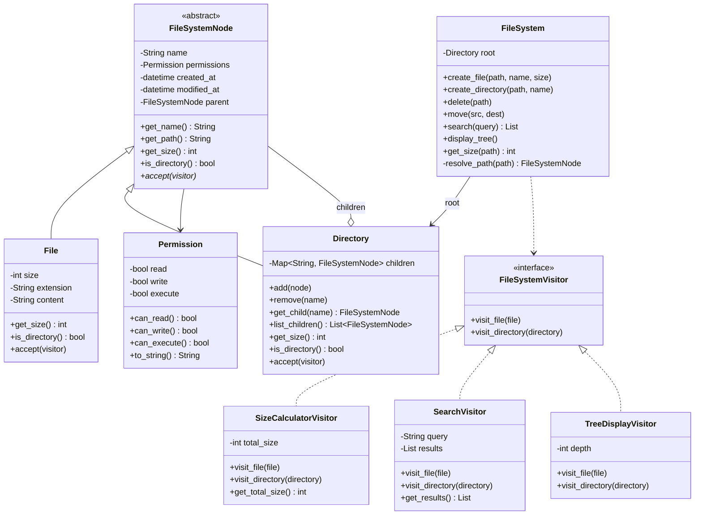
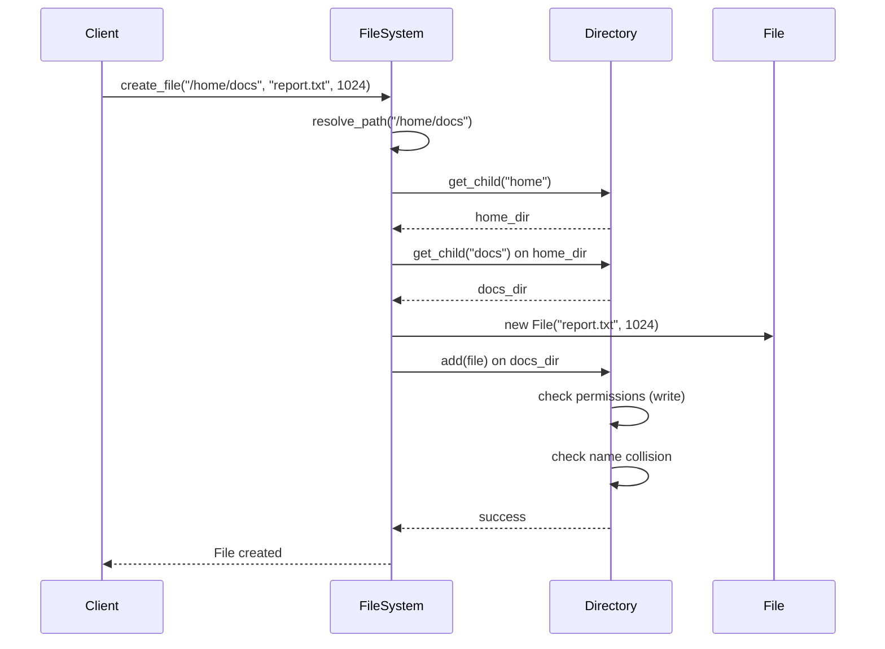
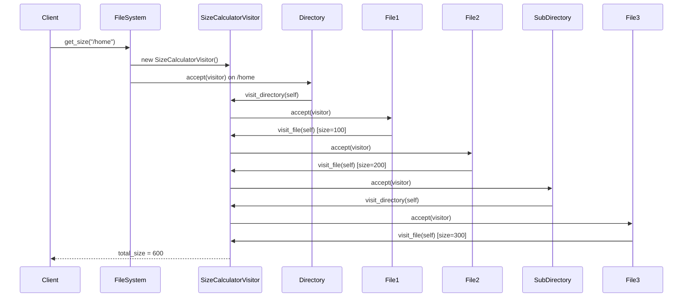

# File System - Low Level Design

## Problem Statement
Design an in-memory file system that supports files and directories, CRUD operations, searching, permissions, tree display, and size calculations. This is a classic showcase of the **Composite pattern**.

---

## Functional Requirements
1. **Create** files and directories
2. **Delete** files and directories (recursive)
3. **Move/Rename** files and directories
4. **Search** by name, extension, or size
5. **Permissions** - Read, Write, Execute per file/directory
6. **Tree Display** - Visual directory tree like `tree` command
7. **Size Calculation** - File size and recursive directory size
8. **Path Navigation** - Absolute path resolution

## Non-Functional Requirements
- Efficient tree traversal for large hierarchies
- Thread-safe for concurrent access
- Support deep nesting without stack overflow

---

## Design Patterns Used

| Pattern | Where Used | Why |
|---------|-----------|-----|
| **Composite** | File/Directory hierarchy | Treat files and directories uniformly |
| **Iterator** | Tree traversal (DFS/BFS) | Traverse tree without exposing internals |
| **Visitor** | Operations (size calc, search, display) | Add new operations without modifying nodes |

### Composite Pattern (Core)
Both `File` and `Directory` implement the `FileSystemNode` interface. A Directory contains a list of `FileSystemNode` children, which can be either Files or other Directories. This allows recursive operations (size, delete, display) to work uniformly.

### Iterator Pattern
Custom iterators for depth-first and breadth-first traversal of the file tree. Clients iterate without knowing the tree structure.

### Visitor Pattern
Operations like size calculation, search, and tree display are implemented as visitors. This lets us add new operations (e.g., "find duplicates", "compress") without modifying the File/Directory classes.

---

## Class Diagram

---

## Sequence Diagram - Creating a File

## Sequence Diagram - Recursive Size Calculation

---

## Edge Cases
1. **Name conflicts** - Cannot create two children with same name in a directory
2. **Delete non-empty directory** - Recursive delete
3. **Move into itself** - Cannot move a directory into its own subtree (cycle)
4. **Path resolution** - Handle `/`, `..`, trailing slashes
5. **Root deletion** - Cannot delete the root directory
6. **Permission denied** - Check write permission before modifications
7. **File vs directory operations** - Cannot add children to a file
8. **Very deep nesting** - Iterative traversal preferred over recursive

## Extensions
- Symbolic links (soft links)
- File content storage and retrieval
- File versioning / history
- Disk space quotas
- File locking for concurrent access
- Compression support
- Wildcard pattern matching (glob)

---

## Interview Tips

1. **Lead with Composite pattern** - This IS the pattern this question tests
2. **Draw the tree structure** - Show how Directory contains FileSystemNode children
3. **Visitor is a bonus** - Not all interviewers expect it, but it demonstrates design maturity
4. **Discuss recursion vs iteration** - Show awareness of stack overflow risk
5. **Permission model** - Keep it simple (rwx booleans), don't over-engineer
6. **Common follow-up**: "How would you implement `find`?" - Use the Visitor or Iterator
7. **Common follow-up**: "Add symbolic links" - Discuss cycle detection
