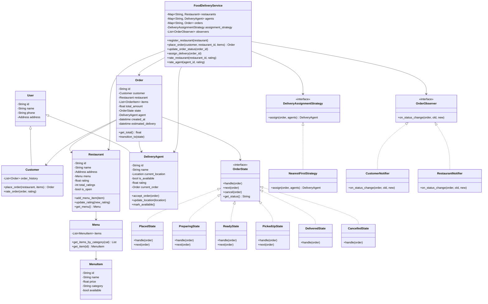
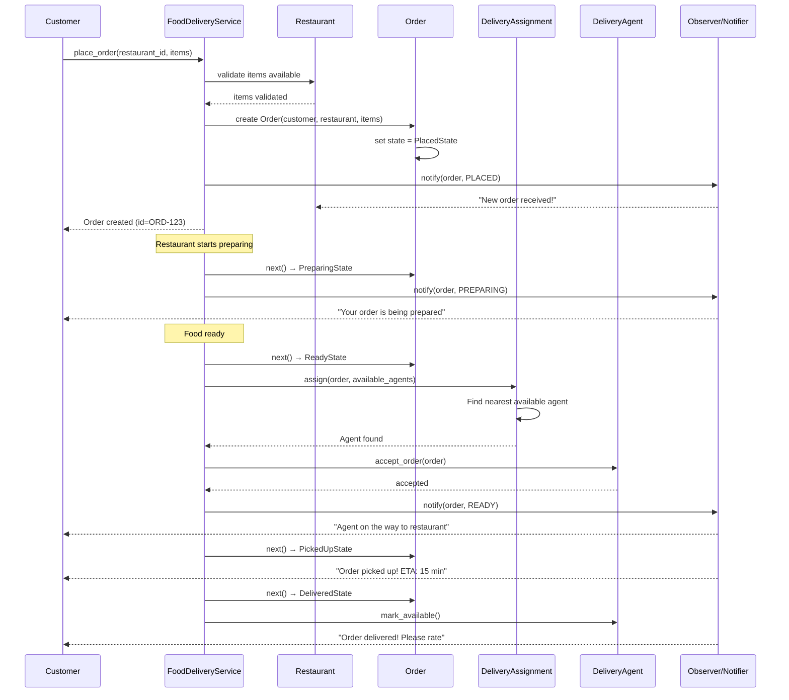
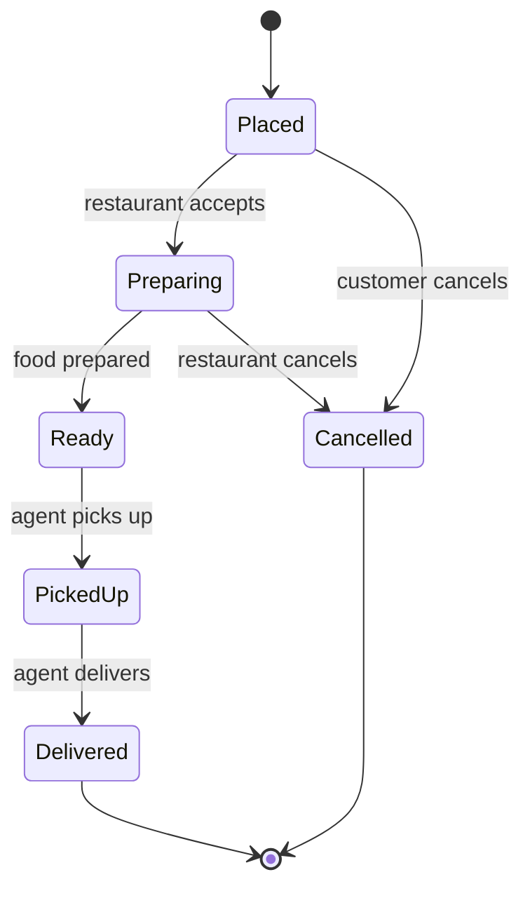

# Food Delivery System (Swiggy/DoorDash) - Low Level Design

## Problem Statement
Design a food delivery system where customers can browse restaurants, place orders, and get food delivered. The system must handle restaurant management, order lifecycle, delivery agent assignment, real-time tracking, ratings, and payment processing.

---

## Functional Requirements
1. **Restaurant Management** - Register restaurants with menus and prices
2. **Customer Ordering** - Browse, add to cart, place order
3. **Delivery Assignment** - Assign nearest available delivery agent
4. **Order Tracking** - Real-time order status updates (lifecycle)
5. **Estimated Delivery Time** - Calculate based on distance and prep time
6. **Rating System** - Rate restaurants and delivery agents
7. **Payment Processing** - Multiple payment methods

## Non-Functional Requirements
- Real-time order status updates
- Fair delivery agent assignment
- Handle concurrent orders
- Accurate ETA calculation

---

## Design Patterns Used

| Pattern | Where Used | Why |
|---------|-----------|-----|
| **State** | Order lifecycle (Placed → Preparing → PickedUp → Delivered) | Clean state transitions with validation |
| **Strategy** | Delivery assignment algorithm, pricing strategy | Swap algorithms without changing core logic |
| **Observer** | Order status notifications to customer, restaurant, agent | Decouple notification from state changes |
| **Factory** | Payment method creation | Encapsulate payment object creation |

### State Pattern -- Order Lifecycle
The order progresses through well-defined states. Each state knows which transitions are valid and what actions to perform on entry/exit. This prevents invalid transitions like "Delivered → Placed".

### Strategy -- Delivery Assignment
Different algorithms for matching delivery agents:
- **Nearest First**: Assign closest available agent
- **Load Balanced**: Assign agent with fewest active orders
- **Rating Based**: Prefer highest-rated agents

---

## Class Diagram

---

## Sequence Diagram - Placing an Order

## Sequence Diagram - Order State Machine

---

## Edge Cases
1. **No available agents** - Queue the order, retry with backoff
2. **Agent cancels after accepting** - Reassign to next nearest agent
3. **Restaurant is closed** - Reject order at placement time
4. **Item out of stock** - Reject order or suggest alternatives
5. **Payment failure** - Retry or cancel order
6. **Delivery address unreachable** - Contact customer, timeout policy
7. **Concurrent orders to same restaurant** - Queue if restaurant is at capacity
8. **Agent location update failure** - Use last known location, mark stale

## Extensions
- Surge pricing during peak hours
- Scheduled orders (order for later)
- Promo codes and discounts
- Split payment between customers
- Restaurant search with filters (cuisine, rating, distance)
- Live order tracking on map
- Chat between customer and delivery agent
- Subscription plans (free delivery)

---

## Interview Tips

1. **Lead with the State pattern** - Draw the state machine diagram first
2. **Discuss delivery assignment** - Show the Strategy pattern with distance calculation
3. **Observer for notifications** - Clean decoupling between order changes and notifications
4. **Mention ETA calculation** - Prep time + travel distance / speed
5. **Rating with weighted average** - `new_avg = (old_avg * count + new_rating) / (count + 1)`
6. **Common follow-up**: "How to handle peak load?" - Queue orders, rate limit, async processing
7. **Common follow-up**: "How to optimize delivery?" - Batching nearby orders for same agent
