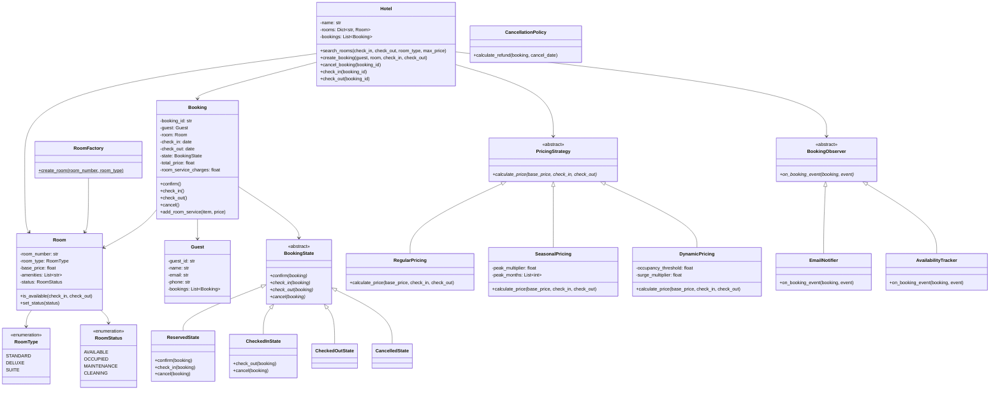
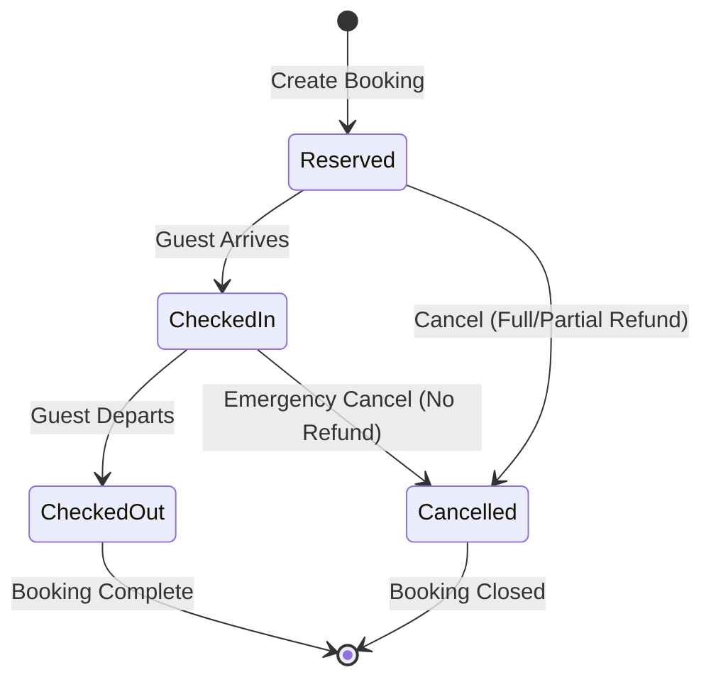
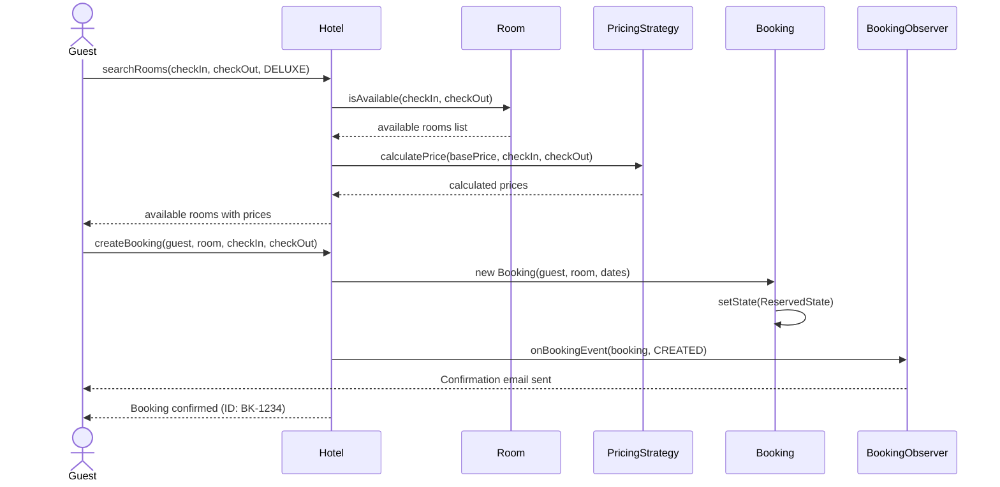

# Hotel Booking System - Low Level Design

## Problem Statement

Design a hotel booking system that allows guests to search and book rooms, manage reservations, handle check-in/check-out, process payments with different pricing strategies, and manage room service.

---

## Requirements

### Functional Requirements
1. **Room Management** - Room types (Standard, Deluxe, Suite) with availability tracking
2. **Search Rooms** - Search by date range, room type, price range, amenities
3. **Book Rooms** - Reserve rooms with check-in/check-out dates
4. **Payment Processing** - Support multiple payment methods with pricing strategies
5. **Cancellation** - Cancel bookings with tiered refund policy
6. **Check-In/Check-Out** - Manage guest arrival and departure
7. **Room Service** - Order food/services charged to room
8. **Guest Profiles** - Store guest information and history

### Non-Functional Requirements
- Handle concurrent booking attempts (avoid double-booking)
- Support seasonal and dynamic pricing
- Maintain booking history and audit trail
- Real-time room availability updates

---

## Design Patterns Used

| Pattern | Where Used | Why |
|---------|-----------|-----|
| **Strategy** | Pricing (Regular, Seasonal, Dynamic) | Different pricing algorithms swappable at runtime |
| **State** | Booking lifecycle (Reserved, CheckedIn, CheckedOut, Cancelled) | Booking behavior changes with state |
| **Observer** | Room status updates, booking notifications | Decouple event producers from consumers |
| **Factory** | Room creation by type | Encapsulate room creation logic |
| **Builder** | Booking creation | Complex object with many optional parameters |

---

## Class Diagram



---

## State Diagram: Booking Lifecycle



---

## Sequence Diagram: Room Search and Booking



---

## Pricing Strategies

### Regular Pricing
Simple per-night calculation:
```
total = base_price * number_of_nights
```

### Seasonal Pricing
Peak months (Jun-Aug, Dec) have a multiplier:
```
for each night:
    if month in peak_months:
        daily_rate = base_price * peak_multiplier (1.5x)
    else:
        daily_rate = base_price
total = sum(daily_rates)
```

### Dynamic Pricing
Based on occupancy levels:
```
if hotel_occupancy > threshold (80%):
    daily_rate = base_price * surge_multiplier (1.3x)
else:
    daily_rate = base_price
```

---

## Cancellation Refund Policy

| Cancellation Time | Refund |
|-------------------|--------|
| 7+ days before check-in | 100% refund |
| 3-7 days before check-in | 50% refund |
| 1-3 days before check-in | 25% refund |
| Less than 24 hours | No refund |
| After check-in | No refund |

---

## Edge Cases

### 1. Double Booking Prevention
```
Two guests try to book the same room for overlapping dates.
Solution: Check availability atomically before confirming.
Use date-range overlap detection:
  overlap = (start1 < end2) and (start2 < end1)
```

### 2. Overbooking Strategy
```
Hotel deliberately overbooks by 5-10%.
If all rooms occupied on arrival:
  → Upgrade to higher room type (if available)
  → Offer compensation + book at partner hotel
```

### 3. No-Show Policy
```
Guest doesn't arrive by midnight on check-in date.
→ Mark as no-show, charge one-night penalty
→ Release room for next day
```

### 4. Early Check-Out
```
Guest checks out before planned date.
→ Charge for actual nights stayed
→ Apply early checkout fee (one-night charge)
```

### 5. Extended Stay
```
Guest wants to extend stay.
→ Check room availability for additional nights
→ Re-calculate price (may differ due to pricing strategy)
→ Create amendment to booking
```

### 6. Room Service Charges
```
Guest orders room service during stay.
→ Charges added to booking total
→ Itemized on final bill at checkout
```

---

## Room Search Algorithm

```
1. Filter by date range:
   - Exclude rooms with overlapping bookings
2. Filter by room type (if specified)
3. Filter by price range:
   - Calculate per-night price using current strategy
   - Apply min/max price filter
4. Filter by amenities (if specified)
5. Sort by price (ascending) or relevance
6. Return paginated results
```

---

## Key Interview Discussion Points

### Why State Pattern for Bookings?
- Booking behavior changes dramatically between states
- A Reserved booking can be checked-in or cancelled, but not checked-out
- Prevents invalid transitions (can't cancel after checkout)
- Each state encapsulates its own rules

### Why Strategy for Pricing?
- Hotels frequently change pricing models
- Seasonal pricing for holidays, dynamic for high-demand periods
- Easy to add new strategies (loyalty discounts, corporate rates)
- Strategy can be swapped at runtime based on business rules

### Thread Safety for Bookings
- Availability check + booking creation must be atomic
- Use locking or optimistic concurrency control
- In databases, use SELECT FOR UPDATE or similar

### Database Design Considerations
- Rooms table with foreign keys to room types
- Bookings table with date range indexes
- Use date range exclusion constraints for preventing overlaps
- Room service as line items linked to bookings

---

## Extensions

1. **Loyalty Program** - Points accumulation and redemption
2. **Multi-Property** - Chain hotel support with cross-property search
3. **Review System** - Post-stay reviews and ratings
4. **Group Bookings** - Conference/event room blocks
5. **Waitlist** - Notify when preferred room becomes available

---

## File Structure

```
Hotel-Booking/
├── README.md
└── code/
    └── hotel_booking.py    # Full implementation with demo
```
