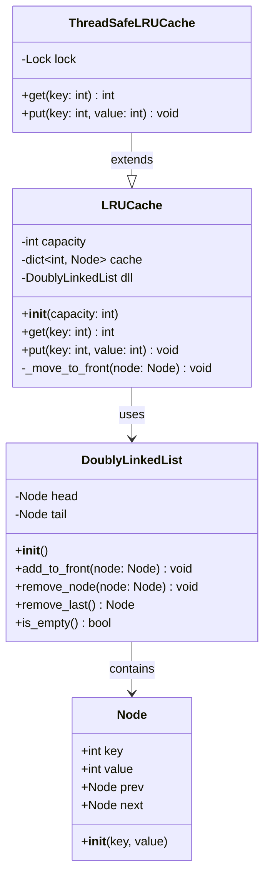
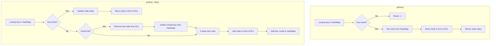
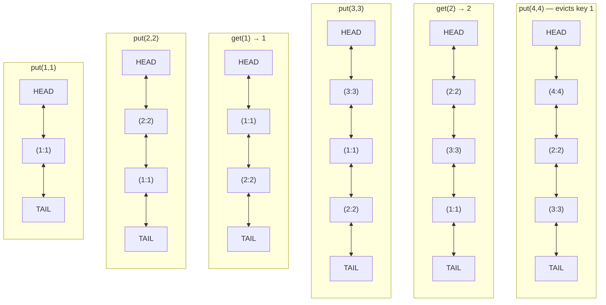

# LRU Cache - Low Level Design

## 1. Problem Statement

An **LRU (Least Recently Used) Cache** is a data structure that stores a fixed number of items and evicts the **least recently accessed** item when the cache reaches capacity.

### Why is it needed?

- **Fast repeated access** - Avoid recomputing or refetching expensive data.
- **Memory constraint** - Cannot cache everything; must evict intelligently.
- **Real-world usage** - CPU caches, database query caches, CDNs, browser caches, DNS resolution caches.

### Core Idea

Every time an item is accessed (read or written), it becomes the "most recently used." When space is needed, the item that has gone the **longest without being accessed** is evicted.

---

## 2. Requirements

| Requirement | Detail |
|---|---|
| Fixed capacity | Cache holds at most `capacity` items |
| `get(key)` | Return value if present, otherwise -1. Mark as recently used. **O(1)** |
| `put(key, value)` | Insert or update. If at capacity, evict LRU item first. **O(1)** |
| Eviction policy | Remove the least recently used entry |
| Thread safety | (Extension) Support concurrent access |

---

## 3. Data Structure Choice

### Why HashMap + Doubly Linked List?

| Requirement | HashMap alone | Linked List alone | HashMap + DLL |
|---|---|---|---|
| O(1) lookup by key | Yes | No (O(n)) | Yes |
| O(1) insert/remove | Yes | Yes (given node ref) | Yes |
| Track access order | No | Yes | Yes |
| O(1) move to front | No | Yes (given node ref) | Yes |

**HashMap** maps keys to **node references** in the doubly linked list.
**Doubly Linked List** maintains access order: head = most recent, tail = least recent.

```
HashMap
+-------+       Doubly Linked List (MRU -> LRU)
| key=1 | ---->  [HEAD] <-> [Node(1,A)] <-> [Node(3,C)] <-> [Node(2,B)] <-> [TAIL]
| key=2 | -----------------------------------------^                            |
| key=3 | ---------------^                                                     |
+-------+                                         Evict from here (before TAIL)
```

- **Get/Put**: HashMap gives O(1) access to the node; move it to head in O(1).
- **Evict**: Remove node just before TAIL sentinel in O(1).

---

## 4. Class Diagram



---

## 5. Operation Flow Diagram



---

## 6. Complete Python Implementation

### Node Class

```python
class Node:
    """Doubly linked list node storing a key-value pair."""

    __slots__ = ('key', 'value', 'prev', 'next')

    def __init__(self, key: int = 0, value: int = 0):
        self.key = key
        self.value = value
        self.prev: 'Node | None' = None
        self.next: 'Node | None' = None

    def __repr__(self):
        return f"Node({self.key}, {self.value})"
```

### DoublyLinkedList Class

```python
class DoublyLinkedList:
    """
    Doubly linked list with sentinel head and tail nodes.

    Structure:  HEAD <-> node1 <-> node2 <-> ... <-> TAIL
    MRU is right after HEAD, LRU is right before TAIL.
    """

    def __init__(self):
        self.head = Node()  # sentinel
        self.tail = Node()  # sentinel
        self.head.next = self.tail
        self.tail.prev = self.head

    def add_to_front(self, node: Node) -> None:
        """Insert node right after HEAD (most recently used position)."""
        node.prev = self.head
        node.next = self.head.next
        self.head.next.prev = node
        self.head.next = node

    def remove_node(self, node: Node) -> None:
        """Remove a node from its current position in the list."""
        node.prev.next = node.next
        node.next.prev = node.prev
        node.prev = None
        node.next = None

    def remove_last(self) -> Node:
        """Remove and return the node right before TAIL (least recently used)."""
        if self.is_empty():
            raise Exception("List is empty")
        lru_node = self.tail.prev
        self.remove_node(lru_node)
        return lru_node

    def is_empty(self) -> bool:
        return self.head.next is self.tail
```

### LRUCache Class

```python
class LRUCache:
    """
    Least Recently Used Cache with O(1) get and put.

    Uses a HashMap (dict) for O(1) key lookup and a Doubly Linked List
    for O(1) order maintenance and eviction.
    """

    def __init__(self, capacity: int):
        if capacity <= 0:
            raise ValueError("Capacity must be positive")
        self.capacity = capacity
        self.cache: dict[int, Node] = {}
        self.dll = DoublyLinkedList()

    def get(self, key: int) -> int:
        """
        Return value for key if present, else -1.
        Marks the key as most recently used.
        """
        if key not in self.cache:
            return -1

        node = self.cache[key]
        # Move to front (mark as most recently used)
        self._move_to_front(node)
        return node.value

    def put(self, key: int, value: int) -> None:
        """
        Insert or update key-value pair.
        If at capacity and key is new, evict LRU entry first.
        """
        if key in self.cache:
            # Update existing
            node = self.cache[key]
            node.value = value
            self._move_to_front(node)
        else:
            # Evict if at capacity
            if len(self.cache) >= self.capacity:
                evicted = self.dll.remove_last()
                del self.cache[evicted.key]

            # Insert new node
            new_node = Node(key, value)
            self.dll.add_to_front(new_node)
            self.cache[key] = new_node

    def _move_to_front(self, node: Node) -> None:
        """Remove node from current position and add to front."""
        self.dll.remove_node(node)
        self.dll.add_to_front(node)

    def __repr__(self):
        """Show cache contents from MRU to LRU."""
        items = []
        current = self.dll.head.next
        while current is not self.dll.tail:
            items.append(f"({current.key}:{current.value})")
            current = current.next
        return f"LRUCache[{' <-> '.join(items)}]"
```

### Thread-Safe Version

```python
import threading


class ThreadSafeLRUCache(LRUCache):
    """Thread-safe LRU Cache using a reentrant lock."""

    def __init__(self, capacity: int):
        super().__init__(capacity)
        self._lock = threading.RLock()

    def get(self, key: int) -> int:
        with self._lock:
            return super().get(key)

    def put(self, key: int, value: int) -> None:
        with self._lock:
            super().put(key, value)
```

---

## 7. Walkthrough Example

Cache capacity = **3**

### Step-by-step trace

```
Operation    | Return | Cache State (MRU -> LRU)     | Notes
-------------|--------|------------------------------|------
put(1, 1)    |   -    | [(1:1)]                      | Insert new
put(2, 2)    |   -    | [(2:2) <-> (1:1)]            | Insert new
get(1)       |   1    | [(1:1) <-> (2:2)]            | Access 1, move to front
put(3, 3)    |   -    | [(3:3) <-> (1:1) <-> (2:2)]  | Insert new, cache full
get(2)       |   2    | [(2:2) <-> (3:3) <-> (1:1)]  | Access 2, move to front
put(4, 4)    |   -    | [(4:4) <-> (2:2) <-> (3:3)]  | Full! Evict LRU (1:1), insert 4
get(1)       |  -1    | [(4:4) <-> (2:2) <-> (3:3)]  | Key 1 was evicted
get(3)       |   3    | [(3:3) <-> (4:4) <-> (2:2)]  | Access 3, move to front
```

### Visual state after each operation



### Test Code

```python
if __name__ == "__main__":
    cache = LRUCache(3)

    cache.put(1, 1)
    print(f"put(1,1)  -> {cache}")

    cache.put(2, 2)
    print(f"put(2,2)  -> {cache}")

    print(f"get(1)={cache.get(1)}  -> {cache}")

    cache.put(3, 3)
    print(f"put(3,3)  -> {cache}")

    print(f"get(2)={cache.get(2)}  -> {cache}")

    cache.put(4, 4)
    print(f"put(4,4)  -> {cache}")

    print(f"get(1)={cache.get(1)}  -> {cache}")   # -1, evicted
    print(f"get(3)={cache.get(3)}  -> {cache}")   # 3
```

**Output:**
```
put(1,1)  -> LRUCache[(1:1)]
put(2,2)  -> LRUCache[(2:2) <-> (1:1)]
get(1)=1  -> LRUCache[(1:1) <-> (2:2)]
put(3,3)  -> LRUCache[(3:3) <-> (1:1) <-> (2:2)]
get(2)=2  -> LRUCache[(2:2) <-> (3:3) <-> (1:1)]
put(4,4)  -> LRUCache[(4:4) <-> (2:2) <-> (3:3)]
get(1)=-1 -> LRUCache[(4:4) <-> (2:2) <-> (3:3)]
get(3)=3  -> LRUCache[(3:3) <-> (4:4) <-> (2:2)]
```

---

## 8. Complexity Analysis

| Operation | Time | Space |
|---|---|---|
| `get(key)` | **O(1)** - HashMap lookup + DLL move | - |
| `put(key, value)` | **O(1)** - HashMap insert/delete + DLL operations | - |
| Overall space | - | **O(capacity)** - HashMap + DLL both store at most `capacity` entries |

Why O(1)?
- HashMap gives O(1) average lookup/insert/delete.
- DLL gives O(1) insert at head, remove given node reference, remove tail.
- We never traverse the list; all operations use direct node references.

---

## 9. Variations

### Variation 1: LFU Cache (Least Frequently Used)

Evicts the item with the **lowest access frequency**. Ties broken by LRU order.

```python
from collections import defaultdict


class LFUCache:
    """
    Least Frequently Used Cache.

    Uses three data structures:
    - key_to_val: key -> value
    - key_to_freq: key -> access frequency
    - freq_to_keys: frequency -> OrderedDict of keys (for LRU tiebreak)
    """

    def __init__(self, capacity: int):
        self.capacity = capacity
        self.min_freq = 0
        self.key_to_val: dict[int, int] = {}
        self.key_to_freq: dict[int, int] = {}
        self.freq_to_keys: dict[int, dict] = defaultdict(dict)
        # Using dict as ordered set (Python 3.7+ dicts maintain insertion order)

    def get(self, key: int) -> int:
        if key not in self.key_to_val:
            return -1
        self._increase_freq(key)
        return self.key_to_val[key]

    def put(self, key: int, value: int) -> None:
        if self.capacity <= 0:
            return

        if key in self.key_to_val:
            self.key_to_val[key] = value
            self._increase_freq(key)
            return

        if len(self.key_to_val) >= self.capacity:
            # Evict the LFU (and LRU among ties)
            evict_keys = self.freq_to_keys[self.min_freq]
            evict_key = next(iter(evict_keys))  # first inserted = LRU
            del evict_keys[evict_key]
            if not evict_keys:
                del self.freq_to_keys[self.min_freq]
            del self.key_to_val[evict_key]
            del self.key_to_freq[evict_key]

        self.key_to_val[key] = value
        self.key_to_freq[key] = 1
        self.freq_to_keys[1][key] = None
        self.min_freq = 1

    def _increase_freq(self, key: int) -> None:
        freq = self.key_to_freq[key]
        self.key_to_freq[key] = freq + 1

        # Remove from old frequency bucket
        del self.freq_to_keys[freq][key]
        if not self.freq_to_keys[freq]:
            del self.freq_to_keys[freq]
            if self.min_freq == freq:
                self.min_freq += 1

        # Add to new frequency bucket
        self.freq_to_keys[freq + 1][key] = None
```

### Variation 2: TTL-based Cache

Items expire after a configurable Time-To-Live.

```python
import time


class TTLCache:
    """LRU Cache with Time-To-Live expiration."""

    def __init__(self, capacity: int, default_ttl: float = 60.0):
        self.capacity = capacity
        self.default_ttl = default_ttl
        self.cache: dict[int, tuple[int, float]] = {}  # key -> (value, expire_time)
        self.dll = DoublyLinkedList()
        self.node_map: dict[int, Node] = {}

    def get(self, key: int) -> int:
        if key not in self.cache:
            return -1

        value, expire_time = self.cache[key]
        if time.time() > expire_time:
            # Expired - remove it
            self._remove(key)
            return -1

        self._move_to_front(key)
        return value

    def put(self, key: int, value: int, ttl: float | None = None) -> None:
        ttl = ttl if ttl is not None else self.default_ttl
        expire_time = time.time() + ttl

        if key in self.cache:
            self.cache[key] = (value, expire_time)
            self._move_to_front(key)
            return

        if len(self.cache) >= self.capacity:
            self._evict()

        node = Node(key, value)
        self.dll.add_to_front(node)
        self.node_map[key] = node
        self.cache[key] = (value, expire_time)

    def _remove(self, key: int) -> None:
        node = self.node_map.pop(key)
        self.dll.remove_node(node)
        del self.cache[key]

    def _move_to_front(self, key: int) -> None:
        node = self.node_map[key]
        self.dll.remove_node(node)
        self.dll.add_to_front(node)

    def _evict(self) -> None:
        # First try to evict expired items
        current = self.dll.tail.prev
        now = time.time()
        while current is not self.dll.head:
            _, expire_time = self.cache[current.key]
            if now > expire_time:
                self._remove(current.key)
                return
            current = current.prev
        # No expired items, evict LRU
        evicted = self.dll.remove_last()
        del self.cache[evicted.key]
        del self.node_map[evicted.key]
```

---

## 10. Java Implementation

### Using LinkedHashMap (Interview Shortcut)

```java
import java.util.LinkedHashMap;
import java.util.Map;

public class LRUCache<K, V> extends LinkedHashMap<K, V> {
    private final int capacity;

    public LRUCache(int capacity) {
        // accessOrder=true makes it LRU (reorder on access)
        super(capacity, 0.75f, true);
        this.capacity = capacity;
    }

    @Override
    protected boolean removeEldestEntry(Map.Entry<K, V> eldest) {
        return size() > capacity;
    }

    public static void main(String[] args) {
        LRUCache<Integer, Integer> cache = new LRUCache<>(3);
        cache.put(1, 1);
        cache.put(2, 2);
        cache.get(1);       // returns 1
        cache.put(3, 3);
        cache.get(2);       // returns 2
        cache.put(4, 4);    // evicts key 1
        System.out.println(cache.get(1));  // null (evicted)
        System.out.println(cache.get(3));  // 3
    }
}
```

### From Scratch in Java

```java
import java.util.HashMap;
import java.util.Map;

public class LRUCacheFromScratch {

    static class Node {
        int key, value;
        Node prev, next;
        Node(int key, int value) {
            this.key = key;
            this.value = value;
        }
    }

    private final int capacity;
    private final Map<Integer, Node> cache;
    private final Node head, tail; // sentinels

    public LRUCacheFromScratch(int capacity) {
        this.capacity = capacity;
        this.cache = new HashMap<>();
        head = new Node(0, 0);
        tail = new Node(0, 0);
        head.next = tail;
        tail.prev = head;
    }

    public int get(int key) {
        if (!cache.containsKey(key)) return -1;
        Node node = cache.get(key);
        moveToFront(node);
        return node.value;
    }

    public void put(int key, int value) {
        if (cache.containsKey(key)) {
            Node node = cache.get(key);
            node.value = value;
            moveToFront(node);
        } else {
            if (cache.size() >= capacity) {
                Node lru = tail.prev;
                removeNode(lru);
                cache.remove(lru.key);
            }
            Node newNode = new Node(key, value);
            addToFront(newNode);
            cache.put(key, newNode);
        }
    }

    private void addToFront(Node node) {
        node.prev = head;
        node.next = head.next;
        head.next.prev = node;
        head.next = node;
    }

    private void removeNode(Node node) {
        node.prev.next = node.next;
        node.next.prev = node.prev;
    }

    private void moveToFront(Node node) {
        removeNode(node);
        addToFront(node);
    }
}
```

---

## 11. Interview Follow-Up Questions

### Q1: How would you make this cache distributed?

**Answer:** Use **consistent hashing** to partition keys across cache nodes. Each node runs a local LRU. A client library hashes the key to determine which node owns it. For replication, write to multiple nodes. Options: Redis Cluster, Memcached.

### Q2: How would you add TTL (Time To Live)?

**Answer:** Store `(value, expiry_timestamp)` in each node. On `get()`, check if expired; if so, delete and return -1. Optionally run a background thread to lazily clean up expired entries.

### Q3: What if `get` and `put` need to be atomic across threads?

**Answer:** Use a single lock (mutex/RLock) around both operations. For higher concurrency, use **striped locking** - partition keys into segments, each with its own lock, so different keys can be accessed concurrently.

### Q4: How to handle cache stampede?

**Answer:** When a popular key expires, many threads try to recompute simultaneously. Solutions:
- **Lock per key** - Only one thread recomputes; others wait.
- **Stale-while-revalidate** - Serve stale data while one thread refreshes.
- **Probabilistic early refresh** - Refresh slightly before expiry.

### Q5: LRU vs LFU - when to use which?

| Aspect | LRU | LFU |
|---|---|---|
| Evicts | Least recently accessed | Least frequently accessed |
| Good for | Temporal locality (recent = likely again) | Frequency-based access patterns |
| Problem | Scan pollution (one-time full scan evicts useful data) | Frequency accumulation (old popular items stay forever) |

### Q6: Can you implement LRU with O(1) operations using only one data structure?

**Answer:** Python's `OrderedDict` supports `move_to_end()` and `popitem(last=False)` both in O(1), giving a very concise implementation:

```python
from collections import OrderedDict

class LRUCacheSimple:
    def __init__(self, capacity: int):
        self.cache = OrderedDict()
        self.capacity = capacity

    def get(self, key: int) -> int:
        if key not in self.cache:
            return -1
        self.cache.move_to_end(key)
        return self.cache[key]

    def put(self, key: int, value: int) -> None:
        if key in self.cache:
            self.cache.move_to_end(key)
        self.cache[key] = value
        if len(self.cache) > self.capacity:
            self.cache.popitem(last=False)
```

---

## 12. Summary Cheat Sheet

```
LRU Cache = HashMap + Doubly Linked List

HashMap:  key -> Node reference          (O(1) lookup)
DLL:     HEAD <-> MRU <-> ... <-> LRU <-> TAIL   (O(1) insert/remove)

get(key):
  1. HashMap lookup -> node
  2. Move node to head of DLL
  3. Return node.value

put(key, val):
  1. If key exists: update value, move to head
  2. If full: remove node before TAIL, delete from HashMap
  3. Create node, add after HEAD, add to HashMap

All operations: O(1) time, O(capacity) space
```
