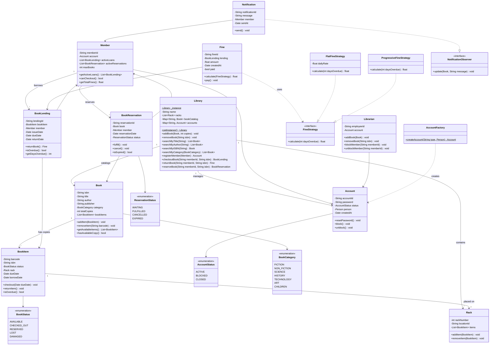

# Library Management System - Low Level Design

## 1. Problem Statement

Design a Library Management System that supports:
- Adding, removing, and searching books (by title, author, ISBN, category)
- Member registration and management
- Book checkout and return with date tracking
- Fine calculation for late returns
- Book reservation/hold system
- Multiple copies of the same book
- Librarian and Member roles with different permissions

---

## 2. Requirements

### Functional Requirements
| # | Requirement |
|---|------------|
| FR-1 | Add, update, and remove books from the catalog |
| FR-2 | Search books by title, author, ISBN, or category |
| FR-3 | Register and manage members |
| FR-4 | Checkout books (max 5 per member) |
| FR-5 | Return books with automatic fine calculation |
| FR-6 | Reserve books that are currently checked out |
| FR-7 | Notify members when reserved books become available |
| FR-8 | Track multiple physical copies of the same book |

### Non-Functional Requirements
- Thread-safe singleton library instance
- Extensible fine calculation strategies
- Observer-based notification system

---

## 3. Class Diagram



---

## 4. Sequence Diagram - Book Checkout Flow


---

## 5. Sequence Diagram - Reservation Flow


---

## 6. State Diagram - BookItem Lifecycle


---

## 7. Design Patterns Used

| Pattern | Usage |
|---------|-------|
| **Singleton** | `Library` class - single instance manages all operations |
| **Observer** | `NotificationObserver` - members get notified when reserved books become available |
| **Strategy** | `FineStrategy` - pluggable fine calculation (flat rate vs progressive) |
| **Factory** | `AccountFactory` - creates Member or Librarian accounts |

---

## 8. Complete Python Implementation

```python
from __future__ import annotations
from enum import Enum
from datetime import datetime, timedelta
from abc import ABC, abstractmethod
from typing import Optional
import uuid
import threading


# ────────────────────────────────────────────
# Enums
# ────────────────────────────────────────────
class BookStatus(Enum):
    AVAILABLE = "available"
    CHECKED_OUT = "checked_out"
    RESERVED = "reserved"
    LOST = "lost"
    DAMAGED = "damaged"


class AccountStatus(Enum):
    ACTIVE = "active"
    BLOCKED = "blocked"
    CLOSED = "closed"


class ReservationStatus(Enum):
    WAITING = "waiting"
    FULFILLED = "fulfilled"
    CANCELLED = "cancelled"
    EXPIRED = "expired"


class BookCategory(Enum):
    FICTION = "fiction"
    NON_FICTION = "non_fiction"
    SCIENCE = "science"
    HISTORY = "history"
    TECHNOLOGY = "technology"
    ART = "art"
    CHILDREN = "children"


# ────────────────────────────────────────────
# Strategy Pattern - Fine Calculation
# ────────────────────────────────────────────
class FineStrategy(ABC):
    @abstractmethod
    def calculate(self, days_overdue: int) -> float:
        pass


class FlatFineStrategy(FineStrategy):
    """Flat rate: fixed amount per day."""
    def __init__(self, daily_rate: float = 1.0):
        self.daily_rate = daily_rate

    def calculate(self, days_overdue: int) -> float:
        if days_overdue <= 0:
            return 0.0
        return days_overdue * self.daily_rate


class ProgressiveFineStrategy(FineStrategy):
    """
    Progressive rate:
    - Days 1-7:   $1/day
    - Days 8-14:  $2/day
    - Days 15+:   $5/day
    """
    def calculate(self, days_overdue: int) -> float:
        if days_overdue <= 0:
            return 0.0
        fine = 0.0
        for day in range(1, days_overdue + 1):
            if day <= 7:
                fine += 1.0
            elif day <= 14:
                fine += 2.0
            else:
                fine += 5.0
        return fine


# ────────────────────────────────────────────
# Observer Pattern - Notifications
# ────────────────────────────────────────────
class NotificationObserver(ABC):
    @abstractmethod
    def update(self, book: Book, message: str) -> None:
        pass


class EmailNotification(NotificationObserver):
    def update(self, book: Book, message: str) -> None:
        print(f"[EMAIL] {message} - Book: '{book.title}'")


class SMSNotification(NotificationObserver):
    def update(self, book: Book, message: str) -> None:
        print(f"[SMS] {message} - Book: '{book.title}'")


class Notification:
    def __init__(self, member: Member, message: str):
        self.notification_id = str(uuid.uuid4())[:8]
        self.message = message
        self.member = member
        self.sent_at = datetime.now()

    def send(self) -> None:
        print(f"[NOTIFICATION -> {self.member.name}] {self.message}")


# ────────────────────────────────────────────
# Core Domain Classes
# ────────────────────────────────────────────
class Rack:
    def __init__(self, rack_number: int, location_id: str):
        self.rack_number = rack_number
        self.location_id = location_id
        self.items: list[BookItem] = []

    def add_item(self, item: BookItem) -> None:
        self.items.append(item)
        item.rack = self

    def remove_item(self, item: BookItem) -> None:
        self.items.remove(item)

    def __repr__(self) -> str:
        return f"Rack({self.rack_number}, loc={self.location_id})"


class BookItem:
    def __init__(self, barcode: str, isbn: str):
        self.barcode = barcode
        self.isbn = isbn
        self.status = BookStatus.AVAILABLE
        self.rack: Optional[Rack] = None
        self.due_date: Optional[datetime] = None
        self.borrow_date: Optional[datetime] = None

    def checkout(self, due_date: datetime) -> None:
        self.status = BookStatus.CHECKED_OUT
        self.borrow_date = datetime.now()
        self.due_date = due_date

    def return_item(self) -> None:
        self.status = BookStatus.AVAILABLE
        self.due_date = None
        self.borrow_date = None

    def is_overdue(self) -> bool:
        if self.due_date and self.status == BookStatus.CHECKED_OUT:
            return datetime.now() > self.due_date
        return False

    def __repr__(self) -> str:
        return f"BookItem({self.barcode}, status={self.status.value})"


class Book:
    def __init__(self, isbn: str, title: str, author: str,
                 publisher: str, category: BookCategory):
        self.isbn = isbn
        self.title = title
        self.author = author
        self.publisher = publisher
        self.category = category
        self.book_items: list[BookItem] = []
        self._observers: list[NotificationObserver] = []

    def add_item(self, item: BookItem) -> None:
        self.book_items.append(item)

    def remove_item(self, barcode: str) -> None:
        self.book_items = [i for i in self.book_items if i.barcode != barcode]

    def get_available_items(self) -> list[BookItem]:
        return [i for i in self.book_items if i.status == BookStatus.AVAILABLE]

    def has_available_copy(self) -> bool:
        return len(self.get_available_items()) > 0

    @property
    def total_copies(self) -> int:
        return len(self.book_items)

    # Observer methods
    def add_observer(self, observer: NotificationObserver) -> None:
        self._observers.append(observer)

    def remove_observer(self, observer: NotificationObserver) -> None:
        self._observers.remove(observer)

    def notify_observers(self, message: str) -> None:
        for obs in self._observers:
            obs.update(self, message)

    def __repr__(self) -> str:
        return f"Book('{self.title}' by {self.author}, ISBN={self.isbn})"


# ────────────────────────────────────────────
# Accounts and People
# ────────────────────────────────────────────
class Account:
    def __init__(self, account_id: str, password: str, status: AccountStatus):
        self.account_id = account_id
        self.password = password
        self.status = status
        self.created_at = datetime.now()

    def reset_password(self, new_password: str) -> None:
        self.password = new_password

    def block(self) -> None:
        self.status = AccountStatus.BLOCKED

    def unblock(self) -> None:
        self.status = AccountStatus.ACTIVE

    def is_active(self) -> bool:
        return self.status == AccountStatus.ACTIVE


class AccountFactory:
    """Factory Pattern - create different account types."""
    @staticmethod
    def create_account(account_type: str, name: str, password: str) -> Account:
        account_id = f"{account_type[:3].upper()}-{uuid.uuid4().hex[:6]}"
        return Account(account_id, password, AccountStatus.ACTIVE)


class Fine:
    def __init__(self, lending: BookLending, strategy: FineStrategy):
        self.fine_id = str(uuid.uuid4())[:8]
        self.lending = lending
        self.strategy = strategy
        self.amount = 0.0
        self.created_at = datetime.now()
        self.paid = False

    def calculate(self) -> float:
        days = self.lending.get_days_overdue()
        self.amount = self.strategy.calculate(days)
        return self.amount

    def pay(self) -> None:
        self.paid = True
        print(f"Fine {self.fine_id} of ${self.amount:.2f} paid.")

    def __repr__(self) -> str:
        return f"Fine(${self.amount:.2f}, paid={self.paid})"


class BookLending:
    def __init__(self, book_item: BookItem, member: Member,
                 issue_date: datetime, due_date: datetime):
        self.lending_id = str(uuid.uuid4())[:8]
        self.book_item = book_item
        self.member = member
        self.issue_date = issue_date
        self.due_date = due_date
        self.return_date: Optional[datetime] = None

    def return_book(self, fine_strategy: FineStrategy) -> Optional[Fine]:
        self.return_date = datetime.now()
        self.book_item.return_item()
        if self.is_overdue():
            fine = Fine(self, fine_strategy)
            fine.calculate()
            return fine
        return None

    def is_overdue(self) -> bool:
        check_date = self.return_date or datetime.now()
        return check_date > self.due_date

    def get_days_overdue(self) -> int:
        check_date = self.return_date or datetime.now()
        if check_date <= self.due_date:
            return 0
        return (check_date - self.due_date).days

    def __repr__(self) -> str:
        return (f"BookLending({self.book_item.barcode} -> "
                f"{self.member.name}, due={self.due_date.date()})")


class BookReservation:
    EXPIRY_DAYS = 3

    def __init__(self, book: Book, member: Member):
        self.reservation_id = str(uuid.uuid4())[:8]
        self.book = book
        self.member = member
        self.reservation_date = datetime.now()
        self.status = ReservationStatus.WAITING

    def fulfill(self) -> None:
        self.status = ReservationStatus.FULFILLED

    def cancel(self) -> None:
        self.status = ReservationStatus.CANCELLED

    def is_expired(self) -> bool:
        expiry = self.reservation_date + timedelta(days=self.EXPIRY_DAYS)
        return datetime.now() > expiry and self.status == ReservationStatus.WAITING

    def __repr__(self) -> str:
        return (f"Reservation({self.book.title} for "
                f"{self.member.name}, status={self.status.value})")


class Member:
    MAX_BOOKS = 5

    def __init__(self, member_id: str, name: str, email: str):
        self.member_id = member_id
        self.name = name
        self.email = email
        self.account: Optional[Account] = None
        self.active_loans: list[BookLending] = []
        self.active_reservations: list[BookReservation] = []
        self.fines: list[Fine] = []

    def can_checkout(self) -> bool:
        if self.account and not self.account.is_active():
            return False
        return len(self.active_loans) < self.MAX_BOOKS

    def add_loan(self, lending: BookLending) -> None:
        self.active_loans.append(lending)

    def remove_loan(self, lending: BookLending) -> None:
        self.active_loans.remove(lending)

    def get_total_fines(self) -> float:
        return sum(f.amount for f in self.fines if not f.paid)

    def __repr__(self) -> str:
        return f"Member({self.name}, loans={len(self.active_loans)})"


class Librarian:
    def __init__(self, employee_id: str, name: str):
        self.employee_id = employee_id
        self.name = name
        self.account: Optional[Account] = None

    def __repr__(self) -> str:
        return f"Librarian({self.name})"


# ────────────────────────────────────────────
# Singleton - Library
# ────────────────────────────────────────────
class Library:
    _instance: Optional[Library] = None
    _lock = threading.Lock()

    def __init__(self, name: str):
        if Library._instance is not None:
            raise RuntimeError("Use Library.get_instance()")
        self.name = name
        self.book_catalog: dict[str, Book] = {}        # isbn -> Book
        self.members: dict[str, Member] = {}            # member_id -> Member
        self.librarians: dict[str, Librarian] = {}
        self.racks: list[Rack] = []
        self.reservations: dict[str, list[BookReservation]] = {}  # isbn -> reservations
        self.fine_strategy: FineStrategy = FlatFineStrategy(1.0)
        self.lending_days = 14

    @classmethod
    def get_instance(cls, name: str = "Central Library") -> Library:
        if cls._instance is None:
            with cls._lock:
                if cls._instance is None:
                    cls._instance = Library(name)
        return cls._instance

    @classmethod
    def reset_instance(cls) -> None:
        """For testing purposes."""
        cls._instance = None

    # ── Book Management ──
    def add_book(self, book: Book, rack: Optional[Rack] = None) -> None:
        self.book_catalog[book.isbn] = book
        if rack:
            for item in book.book_items:
                rack.add_item(item)
        print(f"Added book: {book}")

    def remove_book(self, isbn: str) -> None:
        if isbn in self.book_catalog:
            del self.book_catalog[isbn]
            print(f"Removed book with ISBN: {isbn}")

    # ── Search ──
    def search_by_title(self, title: str) -> list[Book]:
        title_lower = title.lower()
        return [b for b in self.book_catalog.values()
                if title_lower in b.title.lower()]

    def search_by_author(self, author: str) -> list[Book]:
        author_lower = author.lower()
        return [b for b in self.book_catalog.values()
                if author_lower in b.author.lower()]

    def search_by_isbn(self, isbn: str) -> Optional[Book]:
        return self.book_catalog.get(isbn)

    def search_by_category(self, category: BookCategory) -> list[Book]:
        return [b for b in self.book_catalog.values()
                if b.category == category]

    # ── Member Management ──
    def register_member(self, name: str, email: str) -> Member:
        member_id = f"MEM-{uuid.uuid4().hex[:6]}"
        member = Member(member_id, name, email)
        account = AccountFactory.create_account("member", name, "default123")
        member.account = account
        self.members[member_id] = member
        print(f"Registered member: {member}")
        return member

    # ── Checkout ──
    def checkout_book(self, member_id: str, isbn: str) -> BookLending:
        member = self.members.get(member_id)
        if not member:
            raise ValueError(f"Member {member_id} not found.")
        if not member.can_checkout():
            raise PermissionError(
                f"Member {member.name} cannot checkout. "
                f"Max books reached or account blocked."
            )
        if member.get_total_fines() > 0:
            raise PermissionError(
                f"Member {member.name} has unpaid fines: "
                f"${member.get_total_fines():.2f}"
            )

        book = self.book_catalog.get(isbn)
        if not book:
            raise ValueError(f"Book with ISBN {isbn} not found.")

        available = book.get_available_items()
        if not available:
            raise ValueError(
                f"No available copies of '{book.title}'. "
                f"Consider reserving."
            )

        book_item = available[0]
        due_date = datetime.now() + timedelta(days=self.lending_days)
        book_item.checkout(due_date)

        lending = BookLending(book_item, member, datetime.now(), due_date)
        member.add_loan(lending)

        print(f"Checked out: '{book.title}' to {member.name}, "
              f"due {due_date.date()}")
        return lending

    # ── Return ──
    def return_book(self, member_id: str, isbn: str) -> Optional[Fine]:
        member = self.members.get(member_id)
        if not member:
            raise ValueError(f"Member {member_id} not found.")

        lending = None
        for loan in member.active_loans:
            if loan.book_item.isbn == isbn:
                lending = loan
                break

        if not lending:
            raise ValueError(
                f"No active loan found for ISBN {isbn} "
                f"by member {member.name}."
            )

        fine = lending.return_book(self.fine_strategy)
        member.remove_loan(lending)

        if fine:
            member.fines.append(fine)
            print(f"Returned: '{self.book_catalog[isbn].title}' by "
                  f"{member.name} - OVERDUE fine: ${fine.amount:.2f}")
        else:
            print(f"Returned: '{self.book_catalog[isbn].title}' by "
                  f"{member.name} - On time")

        # Check reservations for this book
        self._process_reservations(isbn)
        return fine

    # ── Reservation ──
    def reserve_book(self, member_id: str, isbn: str) -> BookReservation:
        member = self.members.get(member_id)
        if not member:
            raise ValueError(f"Member {member_id} not found.")

        book = self.book_catalog.get(isbn)
        if not book:
            raise ValueError(f"Book with ISBN {isbn} not found.")

        if book.has_available_copy():
            raise ValueError(
                f"'{book.title}' has available copies. "
                f"Checkout directly instead."
            )

        reservation = BookReservation(book, member)
        member.active_reservations.append(reservation)
        self.reservations.setdefault(isbn, []).append(reservation)

        print(f"Reserved: '{book.title}' for {member.name}")
        return reservation

    def _process_reservations(self, isbn: str) -> None:
        if isbn not in self.reservations:
            return
        book = self.book_catalog.get(isbn)
        if not book or not book.has_available_copy():
            return

        waiting = [r for r in self.reservations[isbn]
                   if r.status == ReservationStatus.WAITING and not r.is_expired()]

        if waiting:
            reservation = waiting[0]
            reservation.fulfill()
            notification = Notification(
                reservation.member,
                f"Your reserved book '{book.title}' is now available. "
                f"Pick up within {BookReservation.EXPIRY_DAYS} days."
            )
            notification.send()
            book.notify_observers(
                f"Book '{book.title}' available for {reservation.member.name}"
            )

    def set_fine_strategy(self, strategy: FineStrategy) -> None:
        self.fine_strategy = strategy
        print(f"Fine strategy changed to {type(strategy).__name__}")


# ────────────────────────────────────────────
# Demo / Driver Code
# ────────────────────────────────────────────
def main():
    Library.reset_instance()
    lib = Library.get_instance("City Central Library")

    # Create racks
    rack1 = Rack(1, "A1")
    rack2 = Rack(2, "B1")
    lib.racks.extend([rack1, rack2])

    # Create books with multiple copies
    book1 = Book("978-0-13-468599-1", "Clean Code",
                 "Robert C. Martin", "Pearson", BookCategory.TECHNOLOGY)
    book1.add_item(BookItem("CC-001", book1.isbn))
    book1.add_item(BookItem("CC-002", book1.isbn))

    book2 = Book("978-0-201-63361-0", "Design Patterns",
                 "Gang of Four", "Addison-Wesley", BookCategory.TECHNOLOGY)
    book2.add_item(BookItem("DP-001", book2.isbn))

    book3 = Book("978-0-06-112008-4", "To Kill a Mockingbird",
                 "Harper Lee", "Harper Perennial", BookCategory.FICTION)
    book3.add_item(BookItem("TKM-001", book3.isbn))
    book3.add_item(BookItem("TKM-002", book3.isbn))
    book3.add_item(BookItem("TKM-003", book3.isbn))

    # Add observer
    book2.add_observer(EmailNotification())

    # Add books to library
    lib.add_book(book1, rack1)
    lib.add_book(book2, rack1)
    lib.add_book(book3, rack2)

    # Register members
    alice = lib.register_member("Alice Johnson", "alice@example.com")
    bob = lib.register_member("Bob Smith", "bob@example.com")

    print("\n" + "=" * 60)
    print("SEARCH TESTS")
    print("=" * 60)
    print(f"By title 'clean': {lib.search_by_title('clean')}")
    print(f"By author 'Harper': {lib.search_by_author('Harper')}")
    print(f"By ISBN: {lib.search_by_isbn('978-0-201-63361-0')}")
    print(f"By category TECH: {lib.search_by_category(BookCategory.TECHNOLOGY)}")

    print("\n" + "=" * 60)
    print("CHECKOUT TESTS")
    print("=" * 60)
    loan1 = lib.checkout_book(alice.member_id, book1.isbn)
    loan2 = lib.checkout_book(bob.member_id, book1.isbn)
    loan3 = lib.checkout_book(bob.member_id, book2.isbn)

    print(f"\nAlice active loans: {alice.active_loans}")
    print(f"Bob active loans: {bob.active_loans}")
    print(f"Clean Code available: {book1.get_available_items()}")

    print("\n" + "=" * 60)
    print("RESERVATION TEST")
    print("=" * 60)
    # Design Patterns has no more copies
    try:
        reservation = lib.reserve_book(alice.member_id, book2.isbn)
        print(f"Reservation: {reservation}")
    except ValueError as e:
        print(f"Reservation error: {e}")

    print("\n" + "=" * 60)
    print("RETURN TESTS")
    print("=" * 60)
    fine = lib.return_book(alice.member_id, book1.isbn)

    # Simulate overdue return for Bob's Design Patterns
    # Manually set the due date to the past for testing
    loan3.due_date = datetime.now() - timedelta(days=5)
    loan3.book_item.due_date = datetime.now() - timedelta(days=5)
    fine2 = lib.return_book(bob.member_id, book2.isbn)
    if fine2:
        print(f"Bob's fine: {fine2}")
        fine2.pay()

    print("\n" + "=" * 60)
    print("PROGRESSIVE FINE STRATEGY TEST")
    print("=" * 60)
    lib.set_fine_strategy(ProgressiveFineStrategy())
    # Checkout and simulate overdue again
    loan4 = lib.checkout_book(alice.member_id, book2.isbn)
    loan4.due_date = datetime.now() - timedelta(days=10)
    loan4.book_item.due_date = datetime.now() - timedelta(days=10)
    fine3 = lib.return_book(alice.member_id, book2.isbn)
    if fine3:
        print(f"Progressive fine for 10 days overdue: ${fine3.amount:.2f}")
        fine3.pay()

    print("\n" + "=" * 60)
    print("EDGE CASES")
    print("=" * 60)
    # Max books limit
    print("\nTesting max checkout limit (5 books):")
    extra_books = []
    for i in range(6):
        b = Book(f"EXTRA-{i}", f"Extra Book {i}",
                 "Author", "Pub", BookCategory.FICTION)
        b.add_item(BookItem(f"EB-{i}", b.isbn))
        lib.add_book(b)
        extra_books.append(b)

    for i in range(6):
        try:
            lib.checkout_book(alice.member_id, extra_books[i].isbn)
        except PermissionError as e:
            print(f"  Blocked at book {i}: {e}")
            break

    # Checkout nonexistent book
    print("\nCheckout nonexistent book:")
    try:
        lib.checkout_book(alice.member_id, "FAKE-ISBN")
    except ValueError as e:
        print(f"  Error: {e}")

    # Blocked account
    print("\nBlocked account checkout:")
    alice.account.block()
    try:
        lib.checkout_book(alice.member_id, book3.isbn)
    except PermissionError as e:
        print(f"  Error: {e}")
    alice.account.unblock()

    print("\nDone.")


if __name__ == "__main__":
    main()
```

---

## 9. Edge Cases Summary

| Edge Case | Handling |
|-----------|----------|
| Max books reached (5) | `can_checkout()` returns False, raises `PermissionError` |
| Unpaid fines | Checkout blocked until fines are paid |
| No available copies | Raises `ValueError`, suggests reservation |
| Book already available when reserving | Tells member to checkout directly |
| Overdue return | Automatically calculates fine using configured strategy |
| Blocked account | Checkout and reservation denied |
| Reservation expiry | 3-day window; expired reservations skipped |
| Nonexistent book/member | Raises `ValueError` with descriptive message |
| Duplicate ISBN | Overwrites existing entry in catalog |
| Return without active loan | Raises `ValueError` |

---

## 10. Key Interview Talking Points

1. **Singleton with thread safety**: The `Library` uses double-checked locking with `threading.Lock` to ensure only one instance exists even in concurrent environments.

2. **Strategy Pattern for fines**: Swapping between `FlatFineStrategy` and `ProgressiveFineStrategy` at runtime demonstrates the Open/Closed Principle - new fine policies require zero changes to existing code.

3. **Observer Pattern**: When a book is returned, the system checks reservations and notifies waiting members. The `Book` class maintains a list of observers that get triggered on availability changes.

4. **Book vs BookItem separation**: `Book` represents the logical entity (title, author, ISBN), while `BookItem` represents a physical copy (barcode, status, rack location). This models real-world libraries where multiple copies exist.

5. **Factory Pattern**: `AccountFactory.create_account()` centralizes account creation logic, making it easy to add new account types (e.g., Student, Faculty) without modifying callers.
