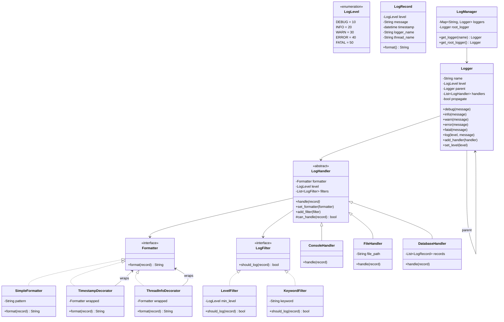
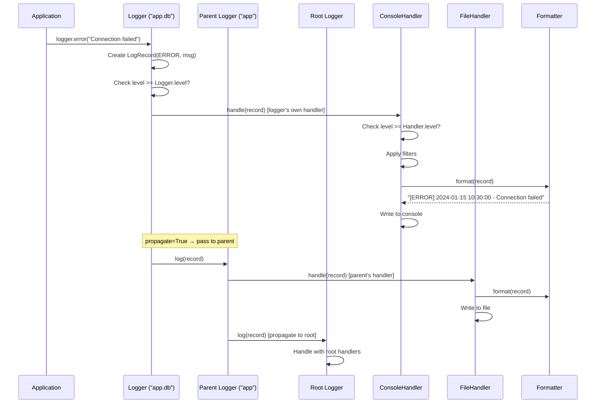
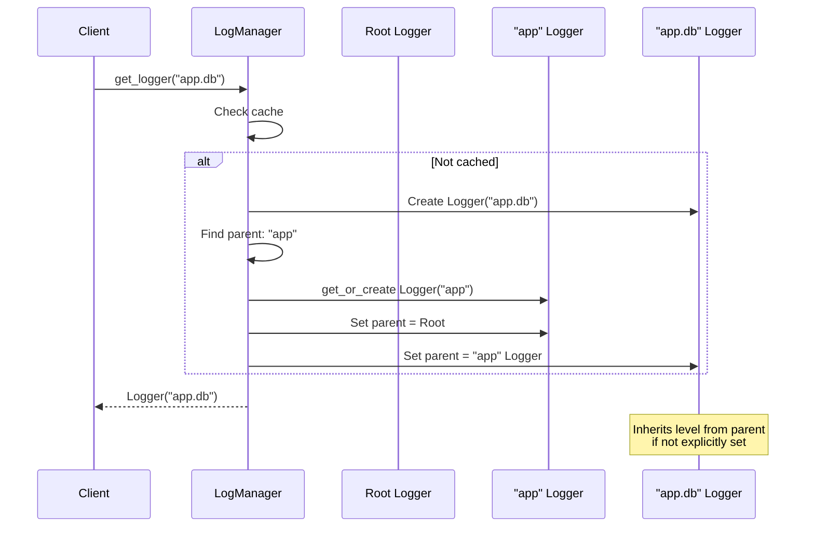

# Logging Framework - Low Level Design

## Problem Statement
Design a flexible logging framework similar to Log4j / Python's logging module. The system should support multiple log levels, output handlers, formatters, filtering, and a logger hierarchy. This problem is a **design pattern showcase** -- it naturally uses 5+ patterns.

---

## Functional Requirements
1. **Log Levels** - DEBUG, INFO, WARN, ERROR, FATAL (with level filtering)
2. **Multiple Handlers** - Console, File, Database (pluggable)
3. **Log Formatting** - Customizable templates (timestamp, level, message, thread)
4. **Logger Hierarchy** - Root logger with child loggers that inherit config
5. **Filtering** - Filter by level, keyword, or custom predicate
6. **Thread-Safe** - Safe for concurrent logging

## Non-Functional Requirements
- Minimal performance overhead when logging is disabled
- No log message loss under high concurrency
- Lazy message formatting (don't format if level is filtered out)

---

## Design Patterns Used (5+)

This problem is a **pattern showcase** -- one of the richest pattern-dense designs:

| Pattern | Where Used | Why |
|---------|-----------|-----|
| **Chain of Responsibility** | Log level filtering through logger hierarchy | Pass log record up the chain until handled |
| **Strategy** | Output handlers (Console, File, Database) | Different output destinations, same interface |
| **Singleton** | Root logger | Single global entry point |
| **Observer** | Handler notification on log events | Decouple log generation from output |
| **Decorator** | Adding timestamp, thread-id, formatting layers | Enhance log records without modifying core |
| **Template Method** | Handler base class with format/write/flush template | Common algorithm, customizable steps |

### Chain of Responsibility -- Logger Hierarchy
```
RootLogger (WARN) → AppLogger (INFO) → DBLogger (DEBUG)
```
A log record flows from child to parent. Each logger checks its level threshold and passes to its handlers if appropriate, then delegates to its parent.

### Strategy -- Output Handlers
Each handler (Console, File, Database) implements the same interface but writes to different destinations. You can attach any combination of handlers to any logger.

### Decorator -- Log Enhancement
Decorators wrap a formatter to add layers: timestamp, thread name, stack trace, etc. Each decorator adds one piece of information without knowing about others.

---

## Class Diagram



---

## Sequence Diagram - Logging a Message



## Sequence Diagram - Logger Hierarchy Resolution



---

## Edge Cases
1. **Circular logger hierarchy** - Prevent parent cycles
2. **Handler exceptions** - Handler failure shouldn't crash the app
3. **Lazy formatting** - Don't format message if level is filtered out
4. **Null handler** - Logger with no handlers (discard silently)
5. **File rotation** - Handle log files growing too large
6. **Thread name in logs** - Include thread context for debugging
7. **Log during shutdown** - Flush all handlers on application exit
8. **Performance** - Logging in hot paths; use level checks before formatting

## Extensions
- Structured logging (JSON format)
- Log rotation (size-based, time-based)
- Remote log shipping (to ELK, Splunk)
- Async logging (background thread for I/O)
- MDC (Mapped Diagnostic Context) per-thread
- Log sampling (log 1% of DEBUG in production)
- Log correlation IDs for distributed tracing

---

## Interview Tips

1. **Emphasize patterns** - This question is about demonstrating pattern knowledge; name every pattern you use
2. **Draw the logger hierarchy** - Root → app → app.db shows Chain of Responsibility
3. **Explain Decorator for formatting** - Stack formatters: base → timestamp → thread → stack trace
4. **Mention Singleton for root** - Single entry point to the logging subsystem
5. **Discuss lazy evaluation** - `logger.debug(f"Expensive: {compute()}")` should NOT call compute() if DEBUG is disabled; show how to use `logger.isEnabledFor(level)` or lambda-based messages
6. **Compare with real frameworks** - Reference Log4j, Python logging, SLF4J
7. **Common follow-up**: "How to handle logging in microservices?" - Structured logging + correlation IDs + centralized aggregation
