# Notification System - Low Level Design

## Problem Statement

Design a notification system that supports multiple channels (Email, SMS, Push, In-App, Slack), priority levels, template-based messages, rate limiting, retry with exponential backoff, scheduled notifications, and user channel preferences.

---

## Requirements

### Functional Requirements
1. **Multiple Channels** - Email, SMS, Push Notification, In-App, Slack
2. **Priority Levels** - Critical, High, Medium, Low
3. **Template-Based Messages** - Reusable message templates with variable substitution
4. **Rate Limiting** - Limit notifications per user per time window
5. **Retry Mechanism** - Retry failed notifications with exponential backoff
6. **Scheduled Notifications** - Send at a specified future time
7. **User Preferences** - Opt-in/opt-out per channel
8. **Batch Notifications** - Group similar notifications to reduce noise

### Non-Functional Requirements
- High throughput for notification processing
- At-least-once delivery guarantee
- Configurable retry policies
- Extensible to new channels without modifying core logic

---

## Design Patterns Used

| Pattern | Where Used | Why |
|---------|-----------|-----|
| **Strategy** | Notification channels (Email, SMS, Push, etc.) | Each channel has different send logic |
| **Observer** | Event-based triggering | Decouple event producers from notification sending |
| **Decorator** | Add priority, retry, rate-limiting layers | Layer behaviors on base notification without modification |
| **Template Method** | Message formatting per channel | Common formatting algorithm with channel-specific steps |
| **Builder** | Notification construction | Complex object with many optional parameters |
| **Chain of Responsibility** | Processing pipeline (validate -> rate-limit -> format -> send -> log) | Each step handles its concern, passes to next |

---

## Class Diagram

```mermaid
classDiagram
    class NotificationService {
        -pipeline: PipelineHandler
        -channels: Dict~str, NotificationChannel~
        -user_prefs: Dict~str, UserPreferences~
        +send(notification)
        +send_batch(notifications)
        +schedule(notification, send_at)
        +register_channel(name, channel)
    }

    class Notification {
        -notification_id: str
        -recipient: str
        -channel: str
        -subject: str
        -body: str
        -priority: Priority
        -template: str
        -template_vars: Dict
        -scheduled_at: datetime
        -status: NotificationStatus
        -attempts: int
        -max_retries: int
    }

    class NotificationBuilder {
        +set_recipient(recipient)
        +set_channel(channel)
        +set_subject(subject)
        +set_body(body)
        +set_priority(priority)
        +set_template(template, vars)
        +set_schedule(send_at)
        +build()
    }

    class Priority {
        <<enumeration>>
        CRITICAL
        HIGH
        MEDIUM
        LOW
    }

    class NotificationChannel {
        <<abstract>>
        +send(notification)*
        +format_message(notification)*
    }

    class EmailChannel {
        +send(notification)
        +format_message(notification)
    }

    class SMSChannel {
        +send(notification)
        +format_message(notification)
    }

    class PushChannel {
        +send(notification)
        +format_message(notification)
    }

    class InAppChannel {
        +send(notification)
        +format_message(notification)
    }

    class SlackChannel {
        +send(notification)
        +format_message(notification)
    }

    class PipelineHandler {
        <<abstract>>
        -next_handler: PipelineHandler
        +handle(notification)*
        +set_next(handler)
    }

    class ValidationHandler {
        +handle(notification)
    }

    class RateLimitHandler {
        -limits: Dict~str, RateLimit~
        +handle(notification)
    }

    class PreferenceHandler {
        +handle(notification)
    }

    class FormatHandler {
        +handle(notification)
    }

    class SendHandler {
        +handle(notification)
    }

    class LogHandler {
        +handle(notification)
    }

    class RetryHandler {
        -max_retries: int
        -base_delay: float
        +handle(notification)
    }

    class RateLimit {
        -max_count: int
        -window_seconds: int
        -timestamps: List~datetime~
        +is_allowed()
        +record()
    }

    class UserPreferences {
        -user_id: str
        -enabled_channels: Set~str~
        -quiet_hours: Tuple~int, int~
        +is_channel_enabled(channel)
        +is_quiet_hours()
    }

    class NotificationTemplate {
        -template_id: str
        -subject_template: str
        -body_template: str
        +render(variables)
    }

    NotificationService --> PipelineHandler
    NotificationService --> NotificationChannel
    NotificationService --> UserPreferences
    Notification --> Priority
    NotificationBuilder --> Notification
    NotificationChannel <|-- EmailChannel
    NotificationChannel <|-- SMSChannel
    NotificationChannel <|-- PushChannel
    NotificationChannel <|-- InAppChannel
    NotificationChannel <|-- SlackChannel
    PipelineHandler <|-- ValidationHandler
    PipelineHandler <|-- RateLimitHandler
    PipelineHandler <|-- PreferenceHandler
    PipelineHandler <|-- FormatHandler
    PipelineHandler <|-- SendHandler
    PipelineHandler <|-- LogHandler
    PipelineHandler <|-- RetryHandler
    RateLimitHandler --> RateLimit
```



---

## Pipeline Architecture


### Pipeline Steps

| Step | Handler | Responsibility |
|------|---------|---------------|
| 1 | ValidationHandler | Validate required fields, check recipient exists |
| 2 | RateLimitHandler | Check if user exceeded notification limit |
| 3 | PreferenceHandler | Check user's channel opt-in/opt-out |
| 4 | FormatHandler | Apply template, format message for channel |
| 5 | SendHandler | Dispatch to appropriate channel |
| 6 | RetryHandler | Retry with exponential backoff on failure |
| 7 | LogHandler | Log outcome (success/failure) for audit |

---

## Sequence Diagram: Send Notification


---

## Rate Limiting Algorithm

### Sliding Window Counter

```
For each user+channel pair:
  - Maintain a list of send timestamps
  - On new notification:
    1. Remove timestamps older than window (e.g., 1 hour)
    2. Count remaining timestamps
    3. If count >= limit, reject notification
    4. Otherwise, add current timestamp and allow

Example:
  User "alice" + "email": max 5 per hour
  Timestamps: [10:01, 10:15, 10:30, 10:45, 10:55]
  New notification at 10:58:
    → 5 sends in window → REJECTED (rate limited)
  New notification at 11:05:
    → Remove 10:01 (older than 1 hour) → 4 sends → ALLOWED
```

### Rate Limits by Priority

| Priority | Rate Limit |
|----------|-----------|
| CRITICAL | No limit (always send) |
| HIGH | 20 per hour |
| MEDIUM | 10 per hour |
| LOW | 5 per hour |

---

## Retry with Exponential Backoff

```
Base delay: 1 second
Max retries: 3
Backoff multiplier: 2

Attempt 1: Immediate send
  → Failed
Attempt 2: Wait 1s, retry
  → Failed
Attempt 3: Wait 2s, retry
  → Failed
Attempt 4: Wait 4s, retry
  → Failed → Send to Dead Letter Queue (DLQ)

Formula: delay = base_delay * (2 ^ (attempt - 1))
  Attempt 1: 1 * 2^0 = 1s
  Attempt 2: 1 * 2^1 = 2s
  Attempt 3: 1 * 2^2 = 4s

With jitter (to avoid thundering herd):
  delay = base_delay * (2 ^ attempt) + random(0, base_delay)
```

---

## Template System

### Template Format
```
Subject: "Order {{order_id}} - {{status}}"
Body: "Hi {{user_name}}, your order #{{order_id}} has been {{status}}.
       Estimated delivery: {{delivery_date}}"

Variables: {
    "user_name": "Alice",
    "order_id": "ORD-123",
    "status": "shipped",
    "delivery_date": "March 15, 2025"
}

Rendered:
  Subject: "Order ORD-123 - shipped"
  Body: "Hi Alice, your order #ORD-123 has been shipped.
         Estimated delivery: March 15, 2025"
```

---

## Edge Cases

### 1. Channel Failure
```
Email server down, Push service unreachable.
→ Retry with backoff
→ If all retries fail, log to DLQ for manual review
→ For CRITICAL: fallback to alternative channel
```

### 2. Rate Limit with Critical Notifications
```
User exceeds rate limit, but receives a CRITICAL notification.
→ CRITICAL bypasses rate limits
→ Consider grouping non-critical notifications into digest
```

### 3. User Opts Out of All Channels
```
User disables all notification channels.
→ CRITICAL notifications still sent via at least one channel
→ Log warning: user has no active channels
```

### 4. Template Variable Missing
```
Template expects {{user_name}} but variable not provided.
→ Replace with placeholder: "[user_name]"
→ Log warning for missing variables
```

### 5. Duplicate Notifications
```
Same notification triggered twice (e.g., event replay).
→ Use idempotency key (notification_id)
→ Skip if already processed within dedup window
```

### 6. Scheduled Notification for Past Time
```
Notification scheduled for 10:00 AM, processed at 10:05 AM.
→ Send immediately (grace period)
→ If more than 1 hour late, skip and log
```

---

## Builder Pattern: Notification Construction

```python
notification = (NotificationBuilder()
    .set_recipient("alice")
    .set_channel("email")
    .set_subject("Order Shipped!")
    .set_body("Your order has been shipped.")
    .set_priority(Priority.HIGH)
    .set_template("order_update", {"order_id": "123"})
    .build())
```

Benefits:
- Clear construction of complex notifications
- Optional parameters have defaults
- Validates at build time
- Method chaining for readability

---

## Key Interview Discussion Points

### Why Chain of Responsibility for Pipeline?
- Each handler has single responsibility (validation, rate limiting, etc.)
- Handlers are composable and reorderable
- Easy to add new pipeline steps
- A handler can short-circuit the pipeline (rate limit → reject)

### Why Strategy for Channels?
- Each channel has completely different send logic
- New channels added without modifying service
- Channel selection at runtime
- Same interface for all channels

### Why Decorator for Features?
- Priority, retry, rate-limiting are orthogonal concerns
- Can be combined in any order
- Base notification stays simple
- Features are opt-in per notification

### Scalability Considerations
- Queue-based architecture for high throughput
- Separate worker pools per channel
- Priority queues for critical notifications
- Dead letter queue for failed notifications
- Horizontal scaling of send workers

---

## Extensions

1. **A/B Testing** - Test different message templates
2. **Analytics** - Track open rates, click rates
3. **Digest Mode** - Aggregate low-priority notifications
4. **Webhook Channel** - Send notifications to custom endpoints
5. **Multi-Language** - Template localization
6. **Feedback Loop** - Handle bounces, unsubscribes

---

## File Structure

```
Notification-System/
├── README.md
└── code/
    └── notification_system.py    # Full implementation with demo
```
