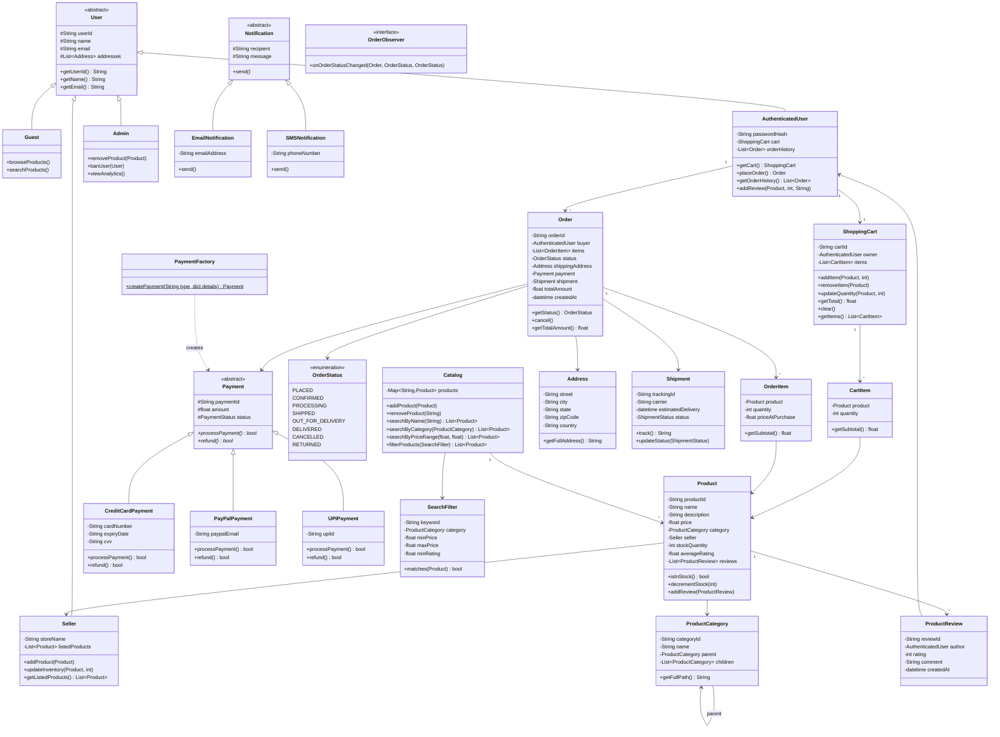
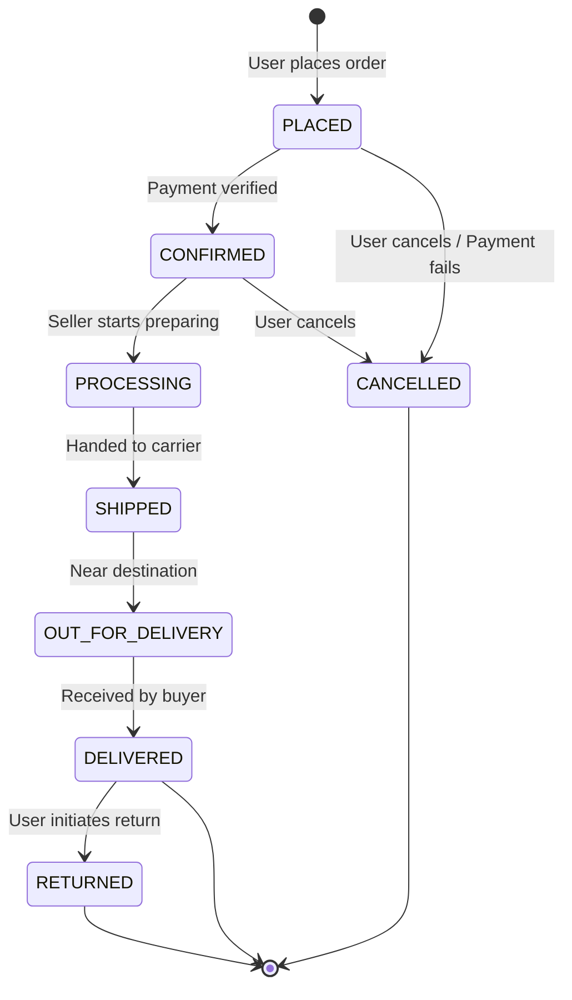
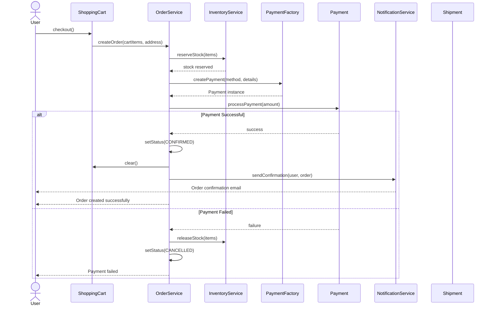

# Online Shopping System (Amazon-like) - Low Level Design

## Problem Statement

Design an online shopping system similar to Amazon. The system should allow users to browse products, search by various criteria, add items to a shopping cart, place orders, make payments, and track their orders. Sellers can list products and manage inventory. Admins can manage the platform.

---

## Requirements

### Functional Requirements
1. **User Management**: Registration, login, profile management (Guest, Authenticated, Seller, Admin)
2. **Product Catalog**: Browse products by categories, view details
3. **Search**: Search products by name, category, price range, rating
4. **Shopping Cart**: Add/remove/update items, view cart, calculate totals
5. **Order Management**: Place orders, view order history, cancel orders
6. **Payment Processing**: Support multiple payment methods (Credit Card, PayPal, UPI)
7. **Order Tracking**: Track order status through its lifecycle
8. **Reviews & Ratings**: Rate and review purchased products
9. **Inventory Management**: Track stock levels, prevent overselling
10. **Notifications**: Email/SMS for order confirmations, shipping updates

### Non-Functional Requirements
- Extensible payment and shipping methods
- Clean separation of concerns
- Thread-safe cart and inventory operations
- Scalable catalog search

---

## Core Entities

| Entity | Responsibility |
|--------|---------------|
| `User` (abstract) | Base user with common attributes |
| `Guest` | Browse-only, no purchase capability |
| `AuthenticatedUser` | Full shopping capability |
| `Seller` | List and manage products |
| `Admin` | Platform management |
| `Product` | Item available for purchase |
| `ProductCategory` | Hierarchical product categorization |
| `ProductReview` | User review with rating and text |
| `ShoppingCart` | Holds items a user intends to buy |
| `CartItem` | A product + quantity in a cart |
| `Order` | A placed purchase with items and status |
| `OrderItem` | A product + quantity in an order |
| `Payment` (abstract) | Payment processing base |
| `Address` | Shipping/billing address |
| `Shipment` | Delivery tracking for an order |
| `Notification` | Alerts sent to users |
| `Catalog` | Central product registry and search |

---

## Class Diagram



---

## Design Patterns Used

### 1. Strategy Pattern - Payment & Shipping

Each payment method implements the same `Payment` interface. The order does not care which method is used.

```
Payment (abstract)
  |-- CreditCardPayment
  |-- PayPalPayment
  |-- UPIPayment
```

**Why?** Payment logic varies by method. Strategy encapsulates each method independently.

### 2. Factory Pattern - Payment Creation

`PaymentFactory.create_payment("credit_card", details)` returns the appropriate `Payment` subclass. Callers do not instantiate concrete payment classes directly.

**Why?** Centralizes creation logic. Adding a new payment method only requires a new class and a factory entry.

### 3. Observer Pattern - Order Status Changes

When an order's status changes, all registered `OrderObserver` instances are notified (e.g., send email, update dashboard, trigger shipping).

**Why?** Decouples order state changes from notification logic. Multiple systems can react independently.

### 4. State Pattern - Order Lifecycle

The `Order` transitions through defined states: PLACED -> CONFIRMED -> PROCESSING -> SHIPPED -> DELIVERED. Each state defines which transitions are valid.

**Why?** Prevents invalid state transitions (e.g., cannot go from DELIVERED to PLACED). Each state encapsulates its own rules.

### 5. Decorator Pattern - Product Enhancements

Product bundles, gift wrapping, and extended warranties can wrap a base product to modify its price and description without altering the original class.

**Why?** Dynamically adds behavior to products at runtime without inheritance explosion.

### 6. Singleton Pattern - Catalog Service

The `Catalog` is a single shared instance across the system.

**Why?** All users and services must query the same product catalog.

---

## State Diagram - Order Lifecycle



---

## Sequence Diagram - Order Placement



---

## Complete Python Implementation

```python
"""
Online Shopping System - Low Level Design
Amazon-like e-commerce platform with users, products, cart, orders,
payments, reviews, and notifications.
"""

import uuid
from abc import ABC, abstractmethod
from datetime import datetime, timedelta
from enum import Enum
from typing import List, Dict, Optional


# ─────────────────────────────────────────────
# Enumerations
# ─────────────────────────────────────────────

class OrderStatus(Enum):
    PLACED = "PLACED"
    CONFIRMED = "CONFIRMED"
    PROCESSING = "PROCESSING"
    SHIPPED = "SHIPPED"
    OUT_FOR_DELIVERY = "OUT_FOR_DELIVERY"
    DELIVERED = "DELIVERED"
    CANCELLED = "CANCELLED"
    RETURNED = "RETURNED"


class PaymentStatus(Enum):
    PENDING = "PENDING"
    COMPLETED = "COMPLETED"
    FAILED = "FAILED"
    REFUNDED = "REFUNDED"


# Valid state transitions for Order
VALID_TRANSITIONS = {
    OrderStatus.PLACED: [OrderStatus.CONFIRMED, OrderStatus.CANCELLED],
    OrderStatus.CONFIRMED: [OrderStatus.PROCESSING, OrderStatus.CANCELLED],
    OrderStatus.PROCESSING: [OrderStatus.SHIPPED],
    OrderStatus.SHIPPED: [OrderStatus.OUT_FOR_DELIVERY],
    OrderStatus.OUT_FOR_DELIVERY: [OrderStatus.DELIVERED],
    OrderStatus.DELIVERED: [OrderStatus.RETURNED],
    OrderStatus.CANCELLED: [],
    OrderStatus.RETURNED: [],
}


# ─────────────────────────────────────────────
# Address
# ─────────────────────────────────────────────

class Address:
    def __init__(self, street: str, city: str, state: str, zip_code: str, country: str):
        self.street = street
        self.city = city
        self.state = state
        self.zip_code = zip_code
        self.country = country

    def get_full_address(self) -> str:
        return f"{self.street}, {self.city}, {self.state} {self.zip_code}, {self.country}"

    def __repr__(self):
        return self.get_full_address()


# ─────────────────────────────────────────────
# Product Category
# ─────────────────────────────────────────────

class ProductCategory:
    def __init__(self, name: str, parent: Optional["ProductCategory"] = None):
        self.category_id = str(uuid.uuid4())[:8]
        self.name = name
        self.parent = parent
        self.children: List["ProductCategory"] = []
        if parent:
            parent.children.append(self)

    def get_full_path(self) -> str:
        if self.parent:
            return f"{self.parent.get_full_path()} > {self.name}"
        return self.name

    def __repr__(self):
        return self.name


# ─────────────────────────────────────────────
# Product Review
# ─────────────────────────────────────────────

class ProductReview:
    def __init__(self, author_name: str, rating: int, comment: str):
        if not 1 <= rating <= 5:
            raise ValueError("Rating must be between 1 and 5")
        self.review_id = str(uuid.uuid4())[:8]
        self.author_name = author_name
        self.rating = rating
        self.comment = comment
        self.created_at = datetime.now()

    def __repr__(self):
        return f"Review({self.author_name}: {self.rating}/5 - {self.comment[:30]})"


# ─────────────────────────────────────────────
# Product
# ─────────────────────────────────────────────

class Product:
    def __init__(self, name: str, description: str, price: float,
                 category: ProductCategory, seller_name: str, stock: int = 0):
        self.product_id = str(uuid.uuid4())[:8]
        self.name = name
        self.description = description
        self.price = price
        self.category = category
        self.seller_name = seller_name
        self.stock_quantity = stock
        self.reviews: List[ProductReview] = []

    @property
    def average_rating(self) -> float:
        if not self.reviews:
            return 0.0
        return sum(r.rating for r in self.reviews) / len(self.reviews)

    def is_in_stock(self) -> bool:
        return self.stock_quantity > 0

    def decrement_stock(self, quantity: int):
        if quantity > self.stock_quantity:
            raise ValueError(f"Insufficient stock for {self.name}")
        self.stock_quantity -= quantity

    def increment_stock(self, quantity: int):
        self.stock_quantity += quantity

    def add_review(self, review: ProductReview):
        self.reviews.append(review)

    def __repr__(self):
        return f"Product({self.name}, ${self.price:.2f}, stock={self.stock_quantity})"


# ─────────────────────────────────────────────
# Search Filter
# ─────────────────────────────────────────────

class SearchFilter:
    def __init__(self, keyword: str = "", category: ProductCategory = None,
                 min_price: float = 0, max_price: float = float('inf'),
                 min_rating: float = 0):
        self.keyword = keyword.lower()
        self.category = category
        self.min_price = min_price
        self.max_price = max_price
        self.min_rating = min_rating

    def matches(self, product: Product) -> bool:
        if self.keyword and self.keyword not in product.name.lower():
            return False
        if self.category and product.category != self.category:
            return False
        if not (self.min_price <= product.price <= self.max_price):
            return False
        if product.average_rating < self.min_rating:
            return False
        return True


# ─────────────────────────────────────────────
# Catalog (Singleton)
# ─────────────────────────────────────────────

class Catalog:
    _instance = None

    def __new__(cls):
        if cls._instance is None:
            cls._instance = super().__new__(cls)
            cls._instance._products: Dict[str, Product] = {}
        return cls._instance

    def add_product(self, product: Product):
        self._products[product.product_id] = product

    def remove_product(self, product_id: str):
        self._products.pop(product_id, None)

    def get_product(self, product_id: str) -> Optional[Product]:
        return self._products.get(product_id)

    def search_by_name(self, name: str) -> List[Product]:
        name_lower = name.lower()
        return [p for p in self._products.values() if name_lower in p.name.lower()]

    def search_by_category(self, category: ProductCategory) -> List[Product]:
        return [p for p in self._products.values() if p.category == category]

    def search_by_price_range(self, min_p: float, max_p: float) -> List[Product]:
        return [p for p in self._products.values() if min_p <= p.price <= max_p]

    def filter_products(self, search_filter: SearchFilter) -> List[Product]:
        return [p for p in self._products.values() if search_filter.matches(p)]

    def get_all_products(self) -> List[Product]:
        return list(self._products.values())


# ─────────────────────────────────────────────
# Shopping Cart
# ─────────────────────────────────────────────

class CartItem:
    def __init__(self, product: Product, quantity: int):
        self.product = product
        self.quantity = quantity

    @property
    def subtotal(self) -> float:
        return self.product.price * self.quantity

    def __repr__(self):
        return f"CartItem({self.product.name} x{self.quantity} = ${self.subtotal:.2f})"


class ShoppingCart:
    def __init__(self, owner_name: str):
        self.cart_id = str(uuid.uuid4())[:8]
        self.owner_name = owner_name
        self._items: Dict[str, CartItem] = {}  # product_id -> CartItem

    def add_item(self, product: Product, quantity: int = 1):
        if not product.is_in_stock():
            raise ValueError(f"{product.name} is out of stock")
        if quantity > product.stock_quantity:
            raise ValueError(f"Only {product.stock_quantity} units of {product.name} available")

        if product.product_id in self._items:
            self._items[product.product_id].quantity += quantity
        else:
            self._items[product.product_id] = CartItem(product, quantity)

    def remove_item(self, product: Product):
        self._items.pop(product.product_id, None)

    def update_quantity(self, product: Product, quantity: int):
        if product.product_id in self._items:
            if quantity <= 0:
                self.remove_item(product)
            else:
                self._items[product.product_id].quantity = quantity

    @property
    def total(self) -> float:
        return sum(item.subtotal for item in self._items.values())

    @property
    def items(self) -> List[CartItem]:
        return list(self._items.values())

    def clear(self):
        self._items.clear()

    def is_empty(self) -> bool:
        return len(self._items) == 0

    def __repr__(self):
        return f"Cart({self.owner_name}: {len(self._items)} items, ${self.total:.2f})"


# ─────────────────────────────────────────────
# Payment - Strategy + Factory
# ─────────────────────────────────────────────

class Payment(ABC):
    def __init__(self, amount: float):
        self.payment_id = str(uuid.uuid4())[:8]
        self.amount = amount
        self.status = PaymentStatus.PENDING

    @abstractmethod
    def process_payment(self) -> bool:
        pass

    @abstractmethod
    def refund(self) -> bool:
        pass


class CreditCardPayment(Payment):
    def __init__(self, amount: float, card_number: str, expiry: str, cvv: str):
        super().__init__(amount)
        self.card_number = card_number
        self.expiry = expiry
        self.cvv = cvv

    def process_payment(self) -> bool:
        # Simulate payment processing
        print(f"  Processing credit card payment of ${self.amount:.2f} "
              f"(card ending {self.card_number[-4:]})")
        self.status = PaymentStatus.COMPLETED
        return True

    def refund(self) -> bool:
        print(f"  Refunding ${self.amount:.2f} to card ending {self.card_number[-4:]}")
        self.status = PaymentStatus.REFUNDED
        return True


class PayPalPayment(Payment):
    def __init__(self, amount: float, paypal_email: str):
        super().__init__(amount)
        self.paypal_email = paypal_email

    def process_payment(self) -> bool:
        print(f"  Processing PayPal payment of ${self.amount:.2f} ({self.paypal_email})")
        self.status = PaymentStatus.COMPLETED
        return True

    def refund(self) -> bool:
        print(f"  Refunding ${self.amount:.2f} to PayPal ({self.paypal_email})")
        self.status = PaymentStatus.REFUNDED
        return True


class UPIPayment(Payment):
    def __init__(self, amount: float, upi_id: str):
        super().__init__(amount)
        self.upi_id = upi_id

    def process_payment(self) -> bool:
        print(f"  Processing UPI payment of ${self.amount:.2f} ({self.upi_id})")
        self.status = PaymentStatus.COMPLETED
        return True

    def refund(self) -> bool:
        print(f"  Refunding ${self.amount:.2f} to UPI ({self.upi_id})")
        self.status = PaymentStatus.REFUNDED
        return True


class PaymentFactory:
    """Factory to create payment instances based on method type."""

    @staticmethod
    def create_payment(method: str, amount: float, **details) -> Payment:
        if method == "credit_card":
            return CreditCardPayment(
                amount,
                details["card_number"],
                details["expiry"],
                details["cvv"]
            )
        elif method == "paypal":
            return PayPalPayment(amount, details["email"])
        elif method == "upi":
            return UPIPayment(amount, details["upi_id"])
        else:
            raise ValueError(f"Unknown payment method: {method}")


# ─────────────────────────────────────────────
# Notification - Observer
# ─────────────────────────────────────────────

class Notification(ABC):
    @abstractmethod
    def send(self, recipient: str, message: str):
        pass


class EmailNotification(Notification):
    def send(self, recipient: str, message: str):
        print(f"  EMAIL to {recipient}: {message}")


class SMSNotification(Notification):
    def send(self, recipient: str, message: str):
        print(f"  SMS to {recipient}: {message}")


class OrderObserver(ABC):
    @abstractmethod
    def on_order_status_changed(self, order: "Order",
                                 old_status: OrderStatus, new_status: OrderStatus):
        pass


class EmailOrderObserver(OrderObserver):
    def __init__(self):
        self._notifier = EmailNotification()

    def on_order_status_changed(self, order: "Order",
                                 old_status: OrderStatus, new_status: OrderStatus):
        self._notifier.send(
            order.buyer_name,
            f"Order {order.order_id} status changed: {old_status.value} -> {new_status.value}"
        )


class SMSOrderObserver(OrderObserver):
    def __init__(self):
        self._notifier = SMSNotification()

    def on_order_status_changed(self, order: "Order",
                                 old_status: OrderStatus, new_status: OrderStatus):
        self._notifier.send(
            order.buyer_name,
            f"Order {order.order_id}: {new_status.value}"
        )


# ─────────────────────────────────────────────
# Shipment
# ─────────────────────────────────────────────

class Shipment:
    def __init__(self, carrier: str = "FastShip"):
        self.tracking_id = str(uuid.uuid4())[:8]
        self.carrier = carrier
        self.estimated_delivery = datetime.now() + timedelta(days=5)

    def track(self) -> str:
        return (f"Tracking ID: {self.tracking_id}, Carrier: {self.carrier}, "
                f"Estimated Delivery: {self.estimated_delivery.strftime('%Y-%m-%d')}")


# ─────────────────────────────────────────────
# Order (with State Pattern for lifecycle)
# ─────────────────────────────────────────────

class OrderItem:
    def __init__(self, product: Product, quantity: int):
        self.product = product
        self.quantity = quantity
        self.price_at_purchase = product.price

    @property
    def subtotal(self) -> float:
        return self.price_at_purchase * self.quantity

    def __repr__(self):
        return f"OrderItem({self.product.name} x{self.quantity} @ ${self.price_at_purchase:.2f})"


class Order:
    def __init__(self, buyer_name: str, items: List[OrderItem],
                 shipping_address: Address, payment: Payment):
        self.order_id = str(uuid.uuid4())[:8]
        self.buyer_name = buyer_name
        self.items = items
        self.shipping_address = shipping_address
        self.payment = payment
        self.shipment: Optional[Shipment] = None
        self._status = OrderStatus.PLACED
        self.created_at = datetime.now()
        self._observers: List[OrderObserver] = []

    @property
    def total_amount(self) -> float:
        return sum(item.subtotal for item in self.items)

    @property
    def status(self) -> OrderStatus:
        return self._status

    def add_observer(self, observer: OrderObserver):
        self._observers.append(observer)

    def _notify_status_change(self, old_status: OrderStatus, new_status: OrderStatus):
        for observer in self._observers:
            observer.on_order_status_changed(self, old_status, new_status)

    def transition_to(self, new_status: OrderStatus):
        """State Pattern: Only allow valid transitions."""
        valid_next = VALID_TRANSITIONS.get(self._status, [])
        if new_status not in valid_next:
            raise ValueError(
                f"Invalid transition: {self._status.value} -> {new_status.value}. "
                f"Valid: {[s.value for s in valid_next]}"
            )
        old_status = self._status
        self._status = new_status
        self._notify_status_change(old_status, new_status)

        if new_status == OrderStatus.SHIPPED:
            self.shipment = Shipment()

    def cancel(self):
        self.transition_to(OrderStatus.CANCELLED)
        self.payment.refund()

    def __repr__(self):
        return (f"Order({self.order_id}, {self.buyer_name}, "
                f"${self.total_amount:.2f}, {self._status.value})")


# ─────────────────────────────────────────────
# Order Service (Orchestrator)
# ─────────────────────────────────────────────

class OrderService:
    """Orchestrates the order placement process."""

    def __init__(self):
        self._orders: Dict[str, Order] = {}
        self._observers: List[OrderObserver] = []

    def add_default_observer(self, observer: OrderObserver):
        self._observers.append(observer)

    def place_order(self, cart: ShoppingCart, buyer_name: str,
                    shipping_address: Address, payment: Payment) -> Optional[Order]:
        """
        Places an order from the cart contents.
        Validates stock, processes payment, and creates the order.
        """
        if cart.is_empty():
            print("  Cannot place order: cart is empty")
            return None

        # Validate stock
        for cart_item in cart.items:
            if cart_item.quantity > cart_item.product.stock_quantity:
                print(f"  Insufficient stock for {cart_item.product.name}")
                return None

        # Process payment
        if not payment.process_payment():
            print("  Payment failed")
            return None

        # Create order items and decrement stock
        order_items = []
        for cart_item in cart.items:
            cart_item.product.decrement_stock(cart_item.quantity)
            order_items.append(OrderItem(cart_item.product, cart_item.quantity))

        # Create order
        order = Order(buyer_name, order_items, shipping_address, payment)
        for obs in self._observers:
            order.add_observer(obs)

        self._orders[order.order_id] = order
        cart.clear()

        # Transition to CONFIRMED since payment succeeded
        order.transition_to(OrderStatus.CONFIRMED)
        return order

    def get_order(self, order_id: str) -> Optional[Order]:
        return self._orders.get(order_id)

    def get_orders_by_user(self, buyer_name: str) -> List[Order]:
        return [o for o in self._orders.values() if o.buyer_name == buyer_name]


# ─────────────────────────────────────────────
# Decorator Pattern: Product Enhancements
# ─────────────────────────────────────────────

class ProductDecorator(ABC):
    """Base decorator that wraps a Product to add extra pricing/description."""

    def __init__(self, product: Product):
        self._product = product

    @property
    def name(self) -> str:
        return self._product.name

    @property
    def price(self) -> float:
        return self._product.price

    @property
    def description(self) -> str:
        return self._product.description


class GiftWrapped(ProductDecorator):
    WRAP_COST = 4.99

    @property
    def name(self) -> str:
        return f"{self._product.name} [Gift Wrapped]"

    @property
    def price(self) -> float:
        return self._product.price + self.WRAP_COST

    @property
    def description(self) -> str:
        return f"{self._product.description} (includes gift wrapping)"


class ExtendedWarranty(ProductDecorator):
    WARRANTY_COST = 19.99

    @property
    def name(self) -> str:
        return f"{self._product.name} [+ Extended Warranty]"

    @property
    def price(self) -> float:
        return self._product.price + self.WARRANTY_COST

    @property
    def description(self) -> str:
        return f"{self._product.description} (includes 2-year extended warranty)"


# ─────────────────────────────────────────────
# Main Simulation
# ─────────────────────────────────────────────

def run_simulation():
    print("=" * 60)
    print("  ONLINE SHOPPING SYSTEM - SIMULATION")
    print("=" * 60)

    # ── Setup Catalog ──
    catalog = Catalog()

    electronics = ProductCategory("Electronics")
    phones = ProductCategory("Phones", parent=electronics)
    laptops = ProductCategory("Laptops", parent=electronics)
    books = ProductCategory("Books")

    p1 = Product("iPhone 15", "Latest Apple phone", 999.99, phones, "Apple Store", 50)
    p2 = Product("MacBook Pro", "M3 Pro laptop", 1999.99, laptops, "Apple Store", 30)
    p3 = Product("Galaxy S24", "Samsung flagship", 849.99, phones, "Samsung Store", 40)
    p4 = Product("Clean Code", "Robert C. Martin", 39.99, books, "BookWorld", 100)
    p5 = Product("Design Patterns", "GoF classic", 49.99, books, "BookWorld", 80)

    for p in [p1, p2, p3, p4, p5]:
        catalog.add_product(p)

    # ── Add Reviews ──
    p1.add_review(ProductReview("Alice", 5, "Amazing phone, love the camera"))
    p1.add_review(ProductReview("Bob", 4, "Great but expensive"))
    p4.add_review(ProductReview("Charlie", 5, "Must read for every developer"))

    # ── Search Products ──
    print("\n--- Search: 'phone' ---")
    results = catalog.search_by_name("phone")
    for r in results:
        print(f"  {r.name} - ${r.price:.2f} (rating: {r.average_rating:.1f})")

    print("\n--- Filter: Books under $45 ---")
    book_filter = SearchFilter(category=books, max_price=45)
    results = catalog.filter_products(book_filter)
    for r in results:
        print(f"  {r.name} - ${r.price:.2f}")

    # ── Shopping Cart ──
    print("\n--- Shopping Cart ---")
    cart = ShoppingCart("Alice")
    cart.add_item(p1, 1)
    cart.add_item(p4, 2)
    cart.add_item(p5, 1)
    print(f"  Cart: {cart}")
    for item in cart.items:
        print(f"    {item}")
    print(f"  Total: ${cart.total:.2f}")

    # Update quantity
    cart.update_quantity(p4, 1)
    print(f"  After update (Clean Code x1): Total = ${cart.total:.2f}")

    # ── Place Order ──
    print("\n--- Placing Order ---")
    address = Address("123 Main St", "San Francisco", "CA", "94105", "USA")
    payment = PaymentFactory.create_payment(
        "credit_card", cart.total,
        card_number="4111111111111234", expiry="12/26", cvv="123"
    )

    order_service = OrderService()
    order_service.add_default_observer(EmailOrderObserver())
    order_service.add_default_observer(SMSOrderObserver())

    order = order_service.place_order(cart, "Alice", address, payment)
    if order:
        print(f"  Order placed: {order}")
        print(f"  Cart after order: {cart}")

    # ── Order Lifecycle ──
    print("\n--- Order Lifecycle ---")
    if order:
        print(f"  Current status: {order.status.value}")
        order.transition_to(OrderStatus.PROCESSING)
        print(f"  Status: {order.status.value}")
        order.transition_to(OrderStatus.SHIPPED)
        print(f"  Status: {order.status.value}")
        print(f"  Shipment: {order.shipment.track()}")
        order.transition_to(OrderStatus.OUT_FOR_DELIVERY)
        order.transition_to(OrderStatus.DELIVERED)
        print(f"  Final status: {order.status.value}")

    # ── Invalid Transition ──
    print("\n--- Testing Invalid Transition ---")
    if order:
        try:
            order.transition_to(OrderStatus.PLACED)
        except ValueError as e:
            print(f"  Caught: {e}")

    # ── Decorator Pattern ──
    print("\n--- Decorator: Gift Wrap + Warranty ---")
    wrapped = GiftWrapped(p3)
    print(f"  {wrapped.name}: ${wrapped.price:.2f}")
    warranted = ExtendedWarranty(p3)
    print(f"  {warranted.name}: ${warranted.price:.2f}")
    both = ExtendedWarranty(GiftWrapped(p3))
    print(f"  {both.name}: ${both.price:.2f}")

    # ── Inventory Check ──
    print("\n--- Inventory After Order ---")
    print(f"  iPhone 15 stock: {p1.stock_quantity}")
    print(f"  Clean Code stock: {p4.stock_quantity}")

    print("\n" + "=" * 60)
    print("  SIMULATION COMPLETE")
    print("=" * 60)


if __name__ == "__main__":
    run_simulation()
```

---

## Sample Output

```
============================================================
  ONLINE SHOPPING SYSTEM - SIMULATION
============================================================

--- Search: 'phone' ---
  iPhone 15 - $999.99 (rating: 4.5)
  Galaxy S24 - $849.99 (rating: 0.0)

--- Filter: Books under $45 ---
  Clean Code - $39.99

--- Shopping Cart ---
  Cart: Cart(Alice: 3 items, $1129.96)
    CartItem(iPhone 15 x1 = $999.99)
    CartItem(Clean Code x2 = $79.98)
    CartItem(Design Patterns x1 = $49.99)
  Total: $1129.96
  After update (Clean Code x1): Total = $1089.97

--- Placing Order ---
  Processing credit card payment of $1089.97 (card ending 1234)
  EMAIL to Alice: Order abc123 status changed: PLACED -> CONFIRMED
  SMS to Alice: Order abc123: CONFIRMED
  Order placed: Order(abc123, Alice, $1089.97, CONFIRMED)
  Cart after order: Cart(Alice: 0 items, $0.00)

--- Order Lifecycle ---
  Current status: CONFIRMED
  EMAIL to Alice: Order abc123 status changed: CONFIRMED -> PROCESSING
  Status: PROCESSING
  EMAIL to Alice: Order abc123 status changed: PROCESSING -> SHIPPED
  Status: SHIPPED
  Shipment: Tracking ID: xyz789, Carrier: FastShip, Estimated Delivery: 2026-02-11
  ...
  Final status: DELIVERED

--- Testing Invalid Transition ---
  Caught: Invalid transition: DELIVERED -> PLACED. Valid: ['RETURNED']

--- Decorator: Gift Wrap + Warranty ---
  Galaxy S24 [Gift Wrapped]: $854.98
  Galaxy S24 [+ Extended Warranty]: $869.98
  Galaxy S24 [Gift Wrapped] [+ Extended Warranty]: $874.97

--- Inventory After Order ---
  iPhone 15 stock: 49
  Clean Code stock: 99

============================================================
  SIMULATION COMPLETE
============================================================
```

---

## Key Design Decisions

### 1. State Pattern for Orders
Orders follow a strict lifecycle (PLACED -> CONFIRMED -> ... -> DELIVERED). The `VALID_TRANSITIONS` map enforces which transitions are legal, preventing invalid state changes like going from DELIVERED back to PLACED.

### 2. Factory for Payments
`PaymentFactory.create_payment()` centralizes payment object creation. Adding a new payment method (e.g., Bitcoin) only requires a new class and one factory entry. No other code changes.

### 3. Singleton Catalog
The `Catalog` is a singleton because all parts of the system must see the same product inventory. In production, this would be replaced by a database-backed service.

### 4. Decorator for Product Add-ons
Gift wrapping and extended warranties wrap the product rather than modifying it. Multiple decorators can be stacked. This avoids combinatorial subclass explosion (GiftWrappedProduct, WarrantyProduct, GiftWrappedWarrantyProduct, etc.).

### 5. Observer for Notifications
Order status changes are broadcast to observers (email, SMS). Adding push notifications only requires a new observer class. The order itself does not know about notification channels.

---

## Complexity Analysis

| Operation | Time Complexity | Notes |
|-----------|----------------|-------|
| Search by name | O(N) | Linear scan of catalog |
| Search by category | O(N) | Could be O(1) with category index |
| Add to cart | O(1) | HashMap lookup |
| Place order | O(K) | K = cart items |
| State transition | O(1) | HashMap lookup for valid transitions |
| Payment processing | O(1) | Simulated |

---

## Interview Tips

1. **Start with the user types**: Guest, AuthenticatedUser, Seller, Admin. This grounds the discussion.
2. **Draw the order lifecycle early**: The state diagram is a powerful visual that clarifies most of the complexity.
3. **Name the patterns explicitly**: "I am using Factory for payment creation, Observer for notifications, State for order lifecycle."
4. **Mention thread safety**: Cart operations and inventory decrements need synchronization in production.
5. **Keep payment simulation simple**: Do not implement actual payment gateway logic. Show the interface and stub the implementation.
