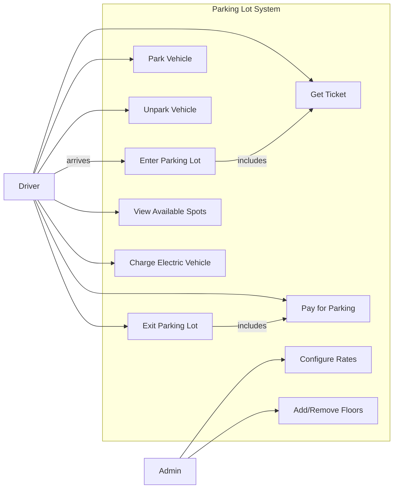
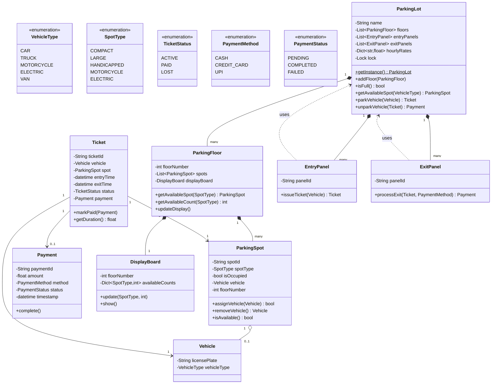
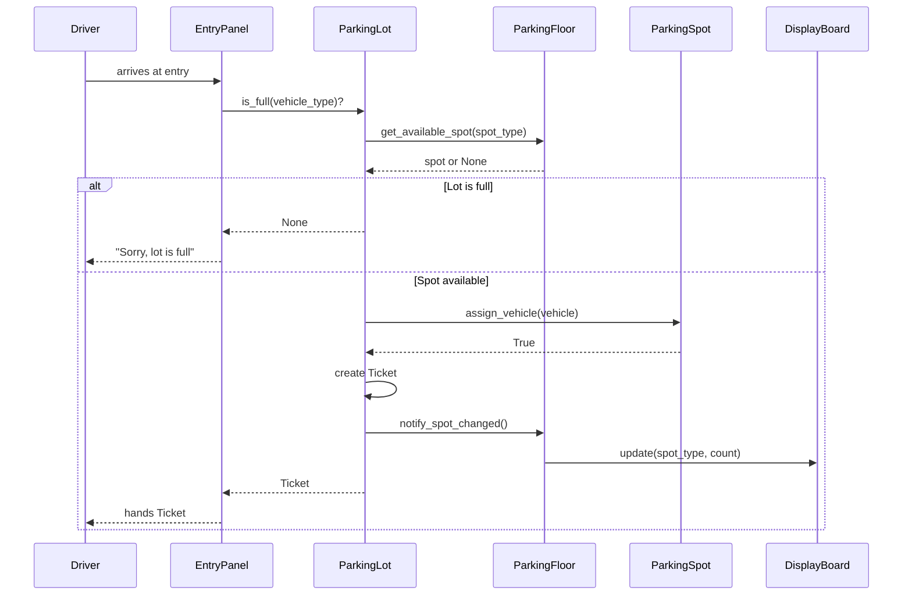
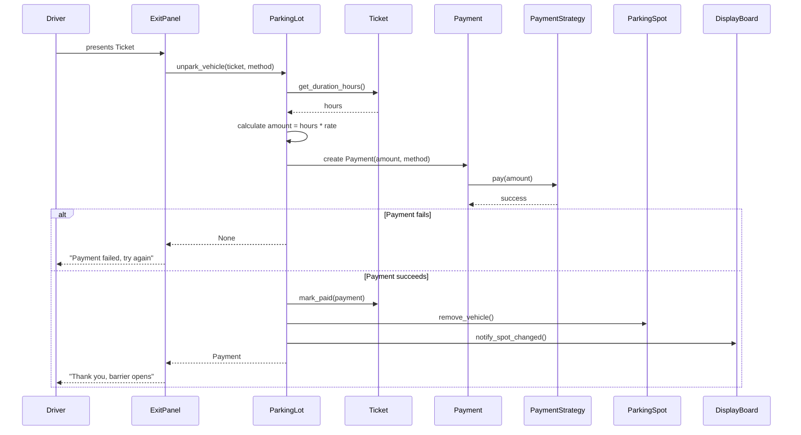

# Parking Lot System - Low Level Design

> A complete interview-ready LLD solution with requirements, class design, design patterns, full Python implementation, and discussion points.

---

## Step 1: Requirements Gathering

### Functional Requirements

| # | Requirement |
|---|------------|
| FR-1 | Multi-floor parking lot with different spot sizes: Compact, Large, Handicapped, Motorcycle, Electric |
| FR-2 | Multiple entry and exit points |
| FR-3 | Ticket-based system — issue a ticket at entry, pay at exit |
| FR-4 | Hourly rate based on vehicle type |
| FR-5 | Display available spots per floor in real time |
| FR-6 | Support electric vehicle charging at designated spots |
| FR-7 | Different payment methods: Cash, Credit Card, UPI |

### Non-Functional Requirements

| # | Requirement |
|---|------------|
| NFR-1 | Handle concurrent entry/exit (thread safety) |
| NFR-2 | High availability — system should not have single point of failure |
| NFR-3 | Real-time spot availability updates on display boards |
| NFR-4 | Scalable — easy to add floors, spots, or entry/exit points |

### Capacity Estimates (for discussion)

- Floors: 5
- Spots per floor: ~200 (mix of types)
- Entry points: 3, Exit points: 3
- Peak throughput: ~100 vehicles/hour

---

## Step 2: Use Case Identification

### Actors

| Actor | Description |
|-------|------------|
| **Driver** | Parks vehicle, picks up ticket, pays, exits |
| **Parking Agent** | Manages entry/exit panels manually if needed |
| **Admin** | Configures floors, spots, rates; views reports |
| **System** | Assigns spots, calculates charges, updates displays |

### Use Case Diagram



### Use Case Details

| Use Case | Pre-condition | Flow | Post-condition |
|----------|--------------|------|----------------|
| Enter Parking Lot | Lot is not full | Driver arrives at entry panel; system checks capacity; issues ticket | Ticket issued, spot count decremented |
| Park Vehicle | Valid ticket | Driver drives to assigned floor; parks in assigned spot | Spot marked occupied |
| Pay for Parking | Vehicle is unparked | System calculates hourly charge; driver pays via chosen method | Payment recorded on ticket |
| Exit Parking Lot | Ticket is paid | Driver scans ticket at exit; barrier opens | Spot freed, count updated |

---

## Step 3: Class Design

### Core Classes Identified

| Class | Responsibility |
|-------|---------------|
| `ParkingLot` | Singleton; owns floors, entry/exit panels; orchestrates operations |
| `ParkingFloor` | Owns spots and a display board for that floor |
| `ParkingSpot` | Represents a single spot; knows its type, whether occupied |
| `Vehicle` | Represents a parked vehicle; knows its type and license plate |
| `Ticket` | Issued at entry; records entry time, spot, vehicle, payment |
| `Payment` | Encapsulates amount, method, and status |
| `EntryPanel` | Issues tickets, triggers spot assignment |
| `ExitPanel` | Accepts ticket, processes payment, opens barrier |
| `DisplayBoard` | Shows available spots per type on a floor |

### Class Diagram



### Design Decisions

1. **ParkingSpot stores SpotType, not VehicleType** — a spot's size is fixed; we map vehicle types to compatible spot types at assignment time.
2. **Ticket is the central transaction object** — it links vehicle, spot, time, and payment together.
3. **DisplayBoard per floor** — each floor independently tracks and displays its own availability.
4. **ParkingLot is the facade** — all external interactions go through ParkingLot; internal details are hidden.

---

## Step 4: Design Patterns Used

### 1. Singleton Pattern — ParkingLot

There is exactly one parking lot instance in the system. Multiple entry/exit panels reference the same lot.

```
ParkingLot.get_instance()  # always returns the same object
```

### 2. Strategy Pattern — Payment

Different payment methods share a common interface. New methods (e.g., Apple Pay) can be added without modifying existing code.

```
PaymentStrategy (interface)
  ├── CashPayment
  ├── CreditCardPayment
  └── UPIPayment
```

### 3. Factory Pattern — Vehicle & Spot Mapping

A factory maps VehicleType to compatible SpotTypes, encapsulating the assignment logic.

### 4. Observer Pattern — Display Board Updates

When a spot's status changes, the floor notifies its DisplayBoard to refresh counts. This keeps displays in sync without polling.

---

## Step 5: Complete Python Implementation

```python
"""
Parking Lot System - Low Level Design
Complete, runnable implementation.
"""

import uuid
import threading
from enum import Enum
from datetime import datetime
from abc import ABC, abstractmethod


# ──────────────────────────── Enums ────────────────────────────

class VehicleType(Enum):
    CAR = "CAR"
    TRUCK = "TRUCK"
    MOTORCYCLE = "MOTORCYCLE"
    ELECTRIC = "ELECTRIC"
    VAN = "VAN"


class SpotType(Enum):
    COMPACT = "COMPACT"
    LARGE = "LARGE"
    HANDICAPPED = "HANDICAPPED"
    MOTORCYCLE = "MOTORCYCLE"
    ELECTRIC = "ELECTRIC"


class TicketStatus(Enum):
    ACTIVE = "ACTIVE"
    PAID = "PAID"
    LOST = "LOST"


class PaymentMethod(Enum):
    CASH = "CASH"
    CREDIT_CARD = "CREDIT_CARD"
    UPI = "UPI"


class PaymentStatus(Enum):
    PENDING = "PENDING"
    COMPLETED = "COMPLETED"
    FAILED = "FAILED"


# ──────────────────── Vehicle-to-Spot Mapping ──────────────────

VEHICLE_SPOT_MAPPING: dict[VehicleType, list[SpotType]] = {
    VehicleType.MOTORCYCLE: [SpotType.MOTORCYCLE],
    VehicleType.CAR: [SpotType.COMPACT, SpotType.LARGE],
    VehicleType.VAN: [SpotType.LARGE],
    VehicleType.TRUCK: [SpotType.LARGE],
    VehicleType.ELECTRIC: [SpotType.ELECTRIC, SpotType.COMPACT, SpotType.LARGE],
}

HOURLY_RATES: dict[VehicleType, float] = {
    VehicleType.MOTORCYCLE: 10.0,
    VehicleType.CAR: 20.0,
    VehicleType.VAN: 30.0,
    VehicleType.TRUCK: 40.0,
    VehicleType.ELECTRIC: 25.0,
}


# ──────────────────────────── Vehicle ──────────────────────────

class Vehicle:
    def __init__(self, license_plate: str, vehicle_type: VehicleType):
        self.license_plate = license_plate
        self.vehicle_type = vehicle_type

    def __repr__(self):
        return f"Vehicle({self.license_plate}, {self.vehicle_type.value})"


# ────────────────────────── ParkingSpot ────────────────────────

class ParkingSpot:
    def __init__(self, spot_id: str, spot_type: SpotType, floor_number: int):
        self.spot_id = spot_id
        self.spot_type = spot_type
        self.floor_number = floor_number
        self._is_occupied = False
        self._vehicle: Vehicle | None = None

    def is_available(self) -> bool:
        return not self._is_occupied

    def assign_vehicle(self, vehicle: Vehicle) -> bool:
        if self._is_occupied:
            return False
        self._vehicle = vehicle
        self._is_occupied = True
        return True

    def remove_vehicle(self) -> Vehicle | None:
        vehicle = self._vehicle
        self._vehicle = None
        self._is_occupied = False
        return vehicle

    def __repr__(self):
        status = "Free" if not self._is_occupied else f"Occupied({self._vehicle})"
        return f"Spot({self.spot_id}, {self.spot_type.value}, {status})"


# ────────────────────────── DisplayBoard ───────────────────────

class DisplayBoard:
    """Observer — updated whenever spot availability changes on a floor."""

    def __init__(self, floor_number: int):
        self.floor_number = floor_number
        self.available_counts: dict[SpotType, int] = {st: 0 for st in SpotType}

    def update(self, spot_type: SpotType, count: int):
        self.available_counts[spot_type] = count

    def show(self) -> str:
        lines = [f"--- Floor {self.floor_number} Availability ---"]
        for spot_type, count in self.available_counts.items():
            lines.append(f"  {spot_type.value:15s}: {count}")
        return "\n".join(lines)


# ───────────────────────── ParkingFloor ────────────────────────

class ParkingFloor:
    def __init__(self, floor_number: int):
        self.floor_number = floor_number
        self.spots: list[ParkingSpot] = []
        self.display_board = DisplayBoard(floor_number)

    def add_spot(self, spot: ParkingSpot):
        self.spots.append(spot)
        self._update_display()

    def get_available_spot(self, spot_type: SpotType) -> ParkingSpot | None:
        for spot in self.spots:
            if spot.spot_type == spot_type and spot.is_available():
                return spot
        return None

    def get_available_count(self, spot_type: SpotType) -> int:
        return sum(
            1 for s in self.spots
            if s.spot_type == spot_type and s.is_available()
        )

    def _update_display(self):
        """Observer notification — refresh the display board."""
        for spot_type in SpotType:
            self.display_board.update(spot_type, self.get_available_count(spot_type))

    def notify_spot_changed(self):
        """Called after any spot assign/remove to keep display in sync."""
        self._update_display()


# ──────────────────── Payment Strategy ─────────────────────────

class PaymentStrategy(ABC):
    @abstractmethod
    def pay(self, amount: float) -> bool:
        """Return True if payment succeeds."""
        ...


class CashPayment(PaymentStrategy):
    def pay(self, amount: float) -> bool:
        print(f"  [CashPayment] Collected ${amount:.2f} in cash.")
        return True


class CreditCardPayment(PaymentStrategy):
    def pay(self, amount: float) -> bool:
        print(f"  [CreditCardPayment] Charged ${amount:.2f} to card.")
        return True


class UPIPayment(PaymentStrategy):
    def pay(self, amount: float) -> bool:
        print(f"  [UPIPayment] Received ${amount:.2f} via UPI.")
        return True


PAYMENT_STRATEGIES: dict[PaymentMethod, PaymentStrategy] = {
    PaymentMethod.CASH: CashPayment(),
    PaymentMethod.CREDIT_CARD: CreditCardPayment(),
    PaymentMethod.UPI: UPIPayment(),
}


# ──────────────────────────── Payment ──────────────────────────

class Payment:
    def __init__(self, amount: float, method: PaymentMethod):
        self.payment_id = str(uuid.uuid4())[:8]
        self.amount = amount
        self.method = method
        self.status = PaymentStatus.PENDING
        self.timestamp: datetime | None = None

    def complete(self) -> bool:
        strategy = PAYMENT_STRATEGIES[self.method]
        success = strategy.pay(self.amount)
        if success:
            self.status = PaymentStatus.COMPLETED
            self.timestamp = datetime.now()
        else:
            self.status = PaymentStatus.FAILED
        return success

    def __repr__(self):
        return (f"Payment({self.payment_id}, ${self.amount:.2f}, "
                f"{self.method.value}, {self.status.value})")


# ──────────────────────────── Ticket ───────────────────────────

class Ticket:
    def __init__(self, vehicle: Vehicle, spot: ParkingSpot):
        self.ticket_id = str(uuid.uuid4())[:8]
        self.vehicle = vehicle
        self.spot = spot
        self.entry_time = datetime.now()
        self.exit_time: datetime | None = None
        self.status = TicketStatus.ACTIVE
        self.payment: Payment | None = None

    def get_duration_hours(self) -> float:
        end = self.exit_time or datetime.now()
        delta = end - self.entry_time
        hours = delta.total_seconds() / 3600
        return max(1.0, hours)  # minimum 1-hour charge

    def mark_paid(self, payment: Payment):
        self.payment = payment
        self.exit_time = datetime.now()
        self.status = TicketStatus.PAID

    def __repr__(self):
        return (f"Ticket({self.ticket_id}, {self.vehicle}, "
                f"spot={self.spot.spot_id}, {self.status.value})")


# ───────────────────────── ParkingLot ──────────────────────────

class ParkingLot:
    """Singleton facade for the entire parking lot system."""

    _instance: "ParkingLot | None" = None
    _init_lock = threading.Lock()

    def __new__(cls, *args, **kwargs):
        if cls._instance is None:
            with cls._init_lock:
                if cls._instance is None:
                    cls._instance = super().__new__(cls)
        return cls._instance

    def __init__(self, name: str = "Main Parking Lot"):
        if hasattr(self, "_initialized"):
            return
        self._initialized = True
        self.name = name
        self.floors: list[ParkingFloor] = []
        self.entry_panels: list["EntryPanel"] = []
        self.exit_panels: list["ExitPanel"] = []
        self.active_tickets: dict[str, Ticket] = {}  # ticket_id -> Ticket
        self._lock = threading.Lock()

    @classmethod
    def get_instance(cls, name: str = "Main Parking Lot") -> "ParkingLot":
        return cls(name)

    @classmethod
    def reset(cls):
        """For testing — destroy the singleton."""
        cls._instance = None

    # ── Configuration ──

    def add_floor(self, floor: ParkingFloor):
        self.floors.append(floor)

    def add_entry_panel(self, panel: "EntryPanel"):
        self.entry_panels.append(panel)

    def add_exit_panel(self, panel: "ExitPanel"):
        self.exit_panels.append(panel)

    # ── Core Operations (thread-safe) ──

    def is_full(self, vehicle_type: VehicleType) -> bool:
        return self._find_spot(vehicle_type) is None

    def _find_spot(self, vehicle_type: VehicleType) -> ParkingSpot | None:
        compatible_types = VEHICLE_SPOT_MAPPING.get(vehicle_type, [])
        for floor in self.floors:
            for spot_type in compatible_types:
                spot = floor.get_available_spot(spot_type)
                if spot:
                    return spot
        return None

    def park_vehicle(self, vehicle: Vehicle) -> Ticket | None:
        with self._lock:
            spot = self._find_spot(vehicle.vehicle_type)
            if spot is None:
                print(f"  [ParkingLot] No available spot for {vehicle}.")
                return None

            spot.assign_vehicle(vehicle)
            ticket = Ticket(vehicle, spot)
            self.active_tickets[ticket.ticket_id] = ticket

            # Notify floor display (Observer pattern)
            floor = self.floors[spot.floor_number]
            floor.notify_spot_changed()

            print(f"  [ParkingLot] Parked {vehicle} at spot {spot.spot_id} "
                  f"(Floor {spot.floor_number}). Ticket: {ticket.ticket_id}")
            return ticket

    def unpark_vehicle(self, ticket: Ticket, method: PaymentMethod) -> Payment | None:
        with self._lock:
            if ticket.status != TicketStatus.ACTIVE:
                print(f"  [ParkingLot] Ticket {ticket.ticket_id} is not active.")
                return None

            # Calculate charge
            hours = ticket.get_duration_hours()
            rate = HOURLY_RATES.get(ticket.vehicle.vehicle_type, 20.0)
            amount = round(hours * rate, 2)

            # Process payment (Strategy pattern)
            payment = Payment(amount, method)
            success = payment.complete()

            if not success:
                print(f"  [ParkingLot] Payment failed for ticket {ticket.ticket_id}.")
                return None

            # Free the spot
            ticket.mark_paid(payment)
            ticket.spot.remove_vehicle()
            del self.active_tickets[ticket.ticket_id]

            # Notify floor display
            floor = self.floors[ticket.spot.floor_number]
            floor.notify_spot_changed()

            print(f"  [ParkingLot] Unparked {ticket.vehicle}. "
                  f"Charged ${amount:.2f} for {hours:.1f} hrs.")
            return payment

    def display_availability(self):
        print(f"\n{'='*40}")
        print(f"  {self.name} — Availability")
        print(f"{'='*40}")
        for floor in self.floors:
            print(floor.display_board.show())
        print()


# ────────────────────── Entry & Exit Panels ────────────────────

class EntryPanel:
    def __init__(self, panel_id: str):
        self.panel_id = panel_id

    def issue_ticket(self, vehicle: Vehicle) -> Ticket | None:
        lot = ParkingLot.get_instance()
        print(f"\n>> EntryPanel {self.panel_id}: {vehicle} arriving...")
        if lot.is_full(vehicle.vehicle_type):
            print(f"  [EntryPanel] Sorry, lot is full for {vehicle.vehicle_type.value}.")
            return None
        return lot.park_vehicle(vehicle)


class ExitPanel:
    def __init__(self, panel_id: str):
        self.panel_id = panel_id

    def process_exit(self, ticket: Ticket, method: PaymentMethod) -> Payment | None:
        lot = ParkingLot.get_instance()
        print(f"\n>> ExitPanel {self.panel_id}: processing ticket {ticket.ticket_id}...")
        return lot.unpark_vehicle(ticket, method)


# ──────────────────────── Demo / Main ──────────────────────────

def build_parking_lot() -> ParkingLot:
    """Factory function to configure the parking lot."""
    ParkingLot.reset()
    lot = ParkingLot.get_instance("City Center Parking")

    for floor_num in range(3):
        floor = ParkingFloor(floor_num)

        # Add a mix of spots to each floor
        for i in range(5):
            floor.add_spot(ParkingSpot(f"F{floor_num}-C{i}", SpotType.COMPACT, floor_num))
        for i in range(3):
            floor.add_spot(ParkingSpot(f"F{floor_num}-L{i}", SpotType.LARGE, floor_num))
        for i in range(2):
            floor.add_spot(ParkingSpot(f"F{floor_num}-M{i}", SpotType.MOTORCYCLE, floor_num))
        for i in range(2):
            floor.add_spot(ParkingSpot(f"F{floor_num}-E{i}", SpotType.ELECTRIC, floor_num))
        floor.add_spot(ParkingSpot(f"F{floor_num}-H0", SpotType.HANDICAPPED, floor_num))

        lot.add_floor(floor)

    lot.add_entry_panel(EntryPanel("ENTRY-1"))
    lot.add_entry_panel(EntryPanel("ENTRY-2"))
    lot.add_exit_panel(ExitPanel("EXIT-1"))
    lot.add_exit_panel(ExitPanel("EXIT-2"))

    return lot


def main():
    lot = build_parking_lot()
    entry1 = lot.entry_panels[0]
    entry2 = lot.entry_panels[1]
    exit1 = lot.exit_panels[0]

    lot.display_availability()

    # --- Vehicles arrive ---
    car1 = Vehicle("KA-01-1234", VehicleType.CAR)
    car2 = Vehicle("KA-02-5678", VehicleType.CAR)
    bike = Vehicle("KA-03-0001", VehicleType.MOTORCYCLE)
    ev = Vehicle("KA-04-ELEC", VehicleType.ELECTRIC)
    truck = Vehicle("KA-05-TRUK", VehicleType.TRUCK)

    ticket_car1 = entry1.issue_ticket(car1)
    ticket_car2 = entry2.issue_ticket(car2)
    ticket_bike = entry1.issue_ticket(bike)
    ticket_ev = entry2.issue_ticket(ev)
    ticket_truck = entry1.issue_ticket(truck)

    lot.display_availability()

    # --- Vehicles exit ---
    if ticket_car1:
        exit1.process_exit(ticket_car1, PaymentMethod.CREDIT_CARD)
    if ticket_bike:
        exit1.process_exit(ticket_bike, PaymentMethod.CASH)
    if ticket_ev:
        exit1.process_exit(ticket_ev, PaymentMethod.UPI)

    lot.display_availability()

    # --- Attempt to pay with already-paid ticket ---
    if ticket_car1:
        exit1.process_exit(ticket_car1, PaymentMethod.CASH)

    print("\nActive tickets remaining:", list(lot.active_tickets.keys()))


if __name__ == "__main__":
    main()
```

---

## Step 6: Sequence Diagrams

### Vehicle Entry Flow



### Vehicle Exit & Payment Flow



---

## Step 7: Edge Cases & Discussion Points

### What if the lot is full?

- `EntryPanel.issue_ticket()` checks `ParkingLot.is_full()` first.
- The system returns `None` and displays a "full" message.
- **Enhancement**: maintain a waitlist or redirect to nearby lots.

### What if payment fails?

- `Payment.complete()` returns `False`; the vehicle stays parked.
- The driver can retry with a different `PaymentMethod`.
- After N failures, escalate to a human agent.

### How to handle lost tickets?

- Add `TicketStatus.LOST` — charge a flat penalty fee (e.g., full-day rate).
- Alternatively, look up the vehicle by license plate in `active_tickets`.

### Concurrency & Thread Safety

- All spot assignment and release is protected by `ParkingLot._lock`.
- This prevents two entry panels from assigning the same spot simultaneously.
- **Enhancement**: per-floor locks for finer granularity if throughput demands it.

### Scalability Considerations

- **Horizontal**: separate entry/exit panel services can run independently; they call the central ParkingLot service via an API.
- **Database-backed**: replace in-memory dicts with a database for persistence.
- **Caching**: cache floor availability counts; invalidate on spot changes.
- **Async displays**: push updates to display boards via WebSocket or message queue.

### Electric Vehicle Charging

- Electric spots can track charging state and duration.
- Charge an additional rate for electricity consumed.
- Notify the driver when charging is complete (via app notification).

---

## Step 8: Interview Tips

### How to Present in 45 Minutes

| Time | Activity |
|------|----------|
| 0-5 min | Clarify requirements — ask about scale, vehicle types, payment methods |
| 5-10 min | Identify actors & use cases; sketch on whiteboard |
| 10-25 min | Draw class diagram; explain relationships and design patterns |
| 25-40 min | Write key methods: `park_vehicle`, `unpark_vehicle`, payment logic |
| 40-45 min | Discuss edge cases, concurrency, scalability |

### Common Follow-Up Questions

1. **"How would you handle multi-level priority?"** — Add a priority queue for VIP vehicles; assign closest spots first.
2. **"How do you scale to millions of spots?"** — Shard by floor/zone; use a database with indexed queries on spot availability.
3. **"How would you add a reservation system?"** — Add a `Reservation` class that temporarily holds a spot for a future time window.
4. **"What if there are multiple parking lots?"** — The Singleton becomes a Registry; each lot has its own instance, and a `ParkingLotManager` routes vehicles.
5. **"How would you generate reports?"** — Add a `ReportService` that queries historical tickets for revenue, peak hours, average duration, etc.

### Key Points to Emphasize

- **Clean separation of concerns** — each class has one responsibility.
- **Design patterns are used purposefully**, not just to show off.
- **Thread safety** is called out explicitly.
- **The code compiles and runs** — this shows you can move from design to implementation.
