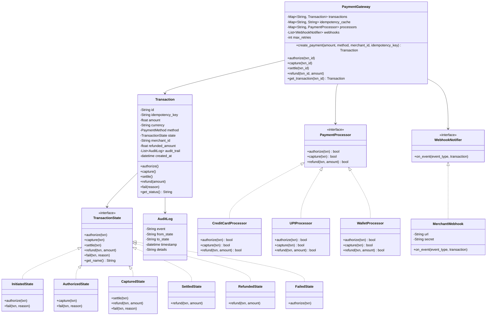
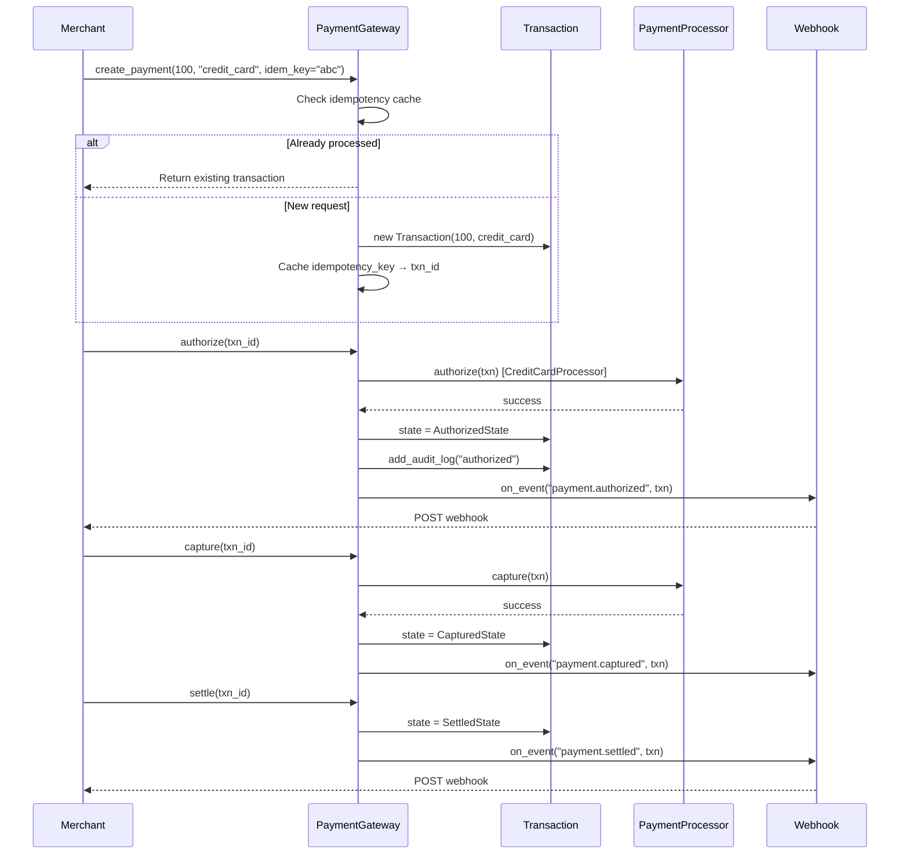
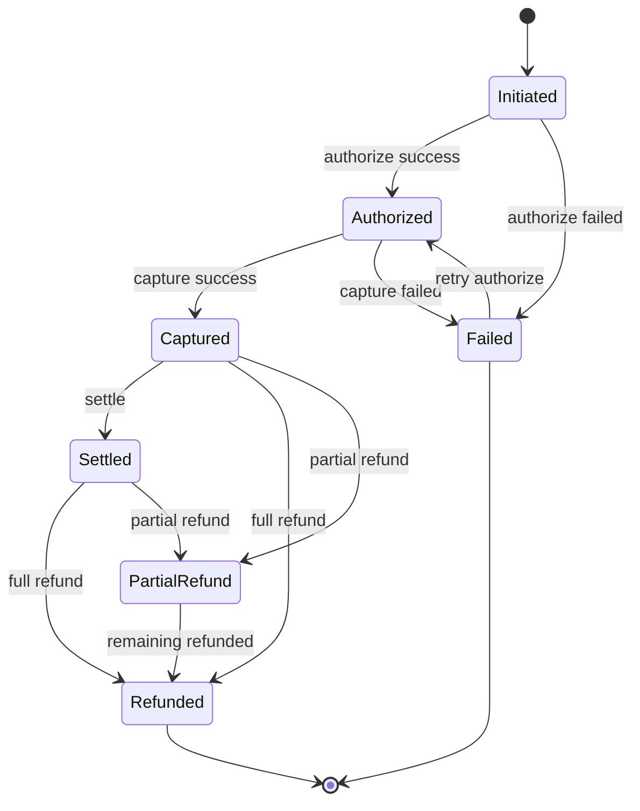
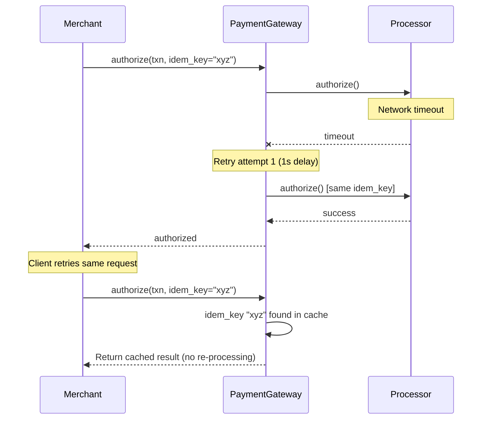

# Payment Gateway - Low Level Design

## Problem Statement
Design a payment gateway that processes payments through multiple methods (credit card, debit card, UPI, wallet), manages the full transaction lifecycle, supports refunds, implements retry with idempotency, and sends webhook notifications.

---

## Functional Requirements
1. **Process Payments** - Credit card, debit card, UPI, wallet
2. **Transaction Lifecycle** - Initiate → Authorize → Capture → Settle (or fail at any point)
3. **Refund Handling** - Full and partial refunds
4. **Idempotency** - Same request processed only once (using idempotency key)
5. **Retry Logic** - Automatic retry on transient failures
6. **Webhook Notifications** - Notify merchants of payment events
7. **Transaction Logging** - Audit trail for every state change

## Non-Functional Requirements
- Idempotent processing (critical for financial systems)
- Atomic state transitions
- Complete audit trail
- PCI DSS compliance awareness
- Sub-second processing time
- 99.99% availability

---

## Design Patterns Used

| Pattern | Where Used | Why |
|---------|-----------|-----|
| **State** | Transaction lifecycle (Initiated → Authorized → Captured → Settled) | Enforce valid transitions, state-specific behavior |
| **Strategy** | Payment processors (CreditCard, UPI, Wallet) | Different processing logic per method |
| **Observer** | Webhook notifications | Decouple payment events from merchant notifications |
| **Command** | Transaction operations (for undo/retry) | Encapsulate operations for retry and reversal |

### State Pattern -- Transaction Lifecycle
This is the core of the payment gateway. Each state knows:
- Which transitions are valid
- What actions to perform
- How to handle failures

### Command Pattern -- Transaction Operations
Each operation (authorize, capture, refund) is encapsulated as a command. This enables:
- **Retry**: Re-execute the same command
- **Idempotency**: Check if command was already executed
- **Audit**: Log every command execution

---

## Class Diagram

---

## Sequence Diagram - Payment Flow

## Sequence Diagram - Transaction State Machine

## Sequence Diagram - Retry with Idempotency

---

## Edge Cases
1. **Duplicate payment** - Idempotency key prevents double charge
2. **Partial capture** - Capture less than authorized amount
3. **Refund > captured amount** - Reject with clear error
4. **Multiple partial refunds** - Track cumulative refunded amount
5. **Processor timeout** - Retry with exponential backoff
6. **State race condition** - Lock transaction before state transition
7. **Webhook delivery failure** - Queue and retry with backoff
8. **Currency mismatch** - Validate at payment creation
9. **Expired authorization** - Auth typically expires in 7 days
10. **Void vs Refund** - Void if not captured, refund if captured

## Extensions
- 3D Secure authentication
- Multi-currency support
- Subscription/recurring payments
- Payout to merchants (settlement cycle)
- Fraud detection (velocity checks, blacklists)
- PCI DSS tokenization (store tokens, not card numbers)
- Payment links and hosted checkout
- Dispute/chargeback management

---

## Interview Tips

1. **Lead with the state machine** - Draw the state diagram immediately; this is the core
2. **Emphasize idempotency** - Critical for financial systems; show the idempotency key mechanism
3. **Discuss two-phase capture** - Auth + Capture is standard (hotels, gas stations pre-auth more)
4. **Mention retry strategy** - Exponential backoff with max retries
5. **Audit trail** - Every state change must be logged; show the AuditLog class
6. **Security** - Never store raw card numbers, use tokenization
7. **Common follow-up**: "How to handle distributed transactions?" - Saga pattern, eventual consistency
8. **Common follow-up**: "How to ensure exactly-once processing?" - Idempotency keys + database transactions
