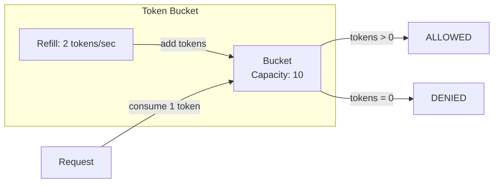
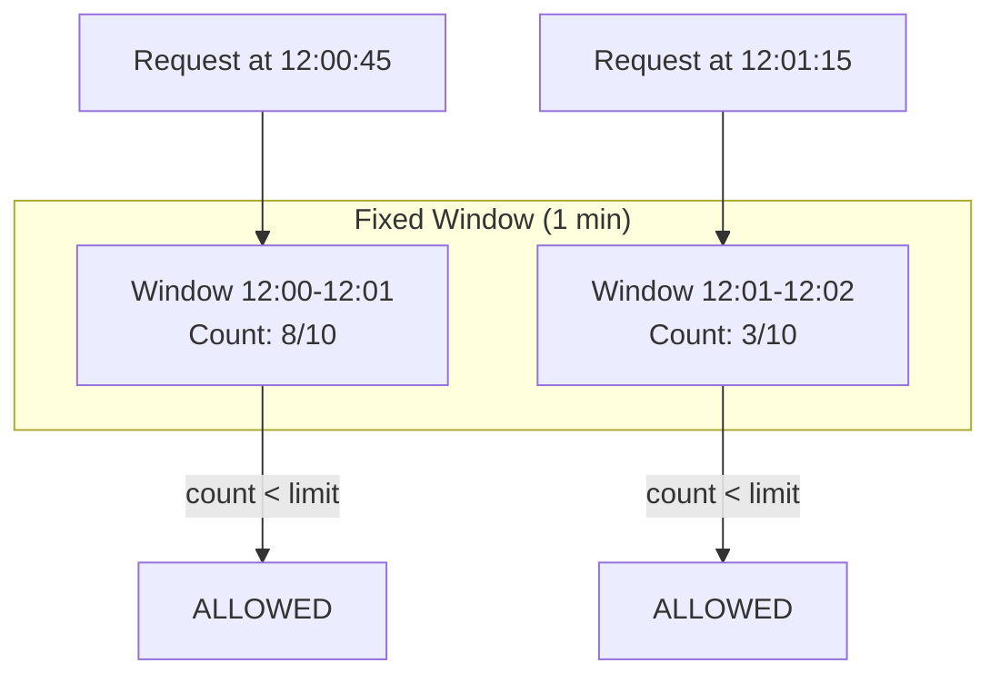
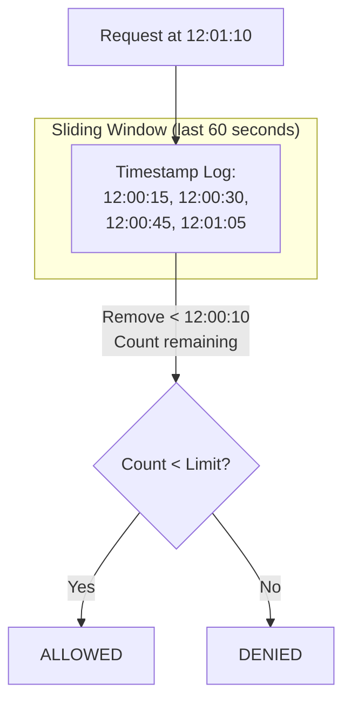
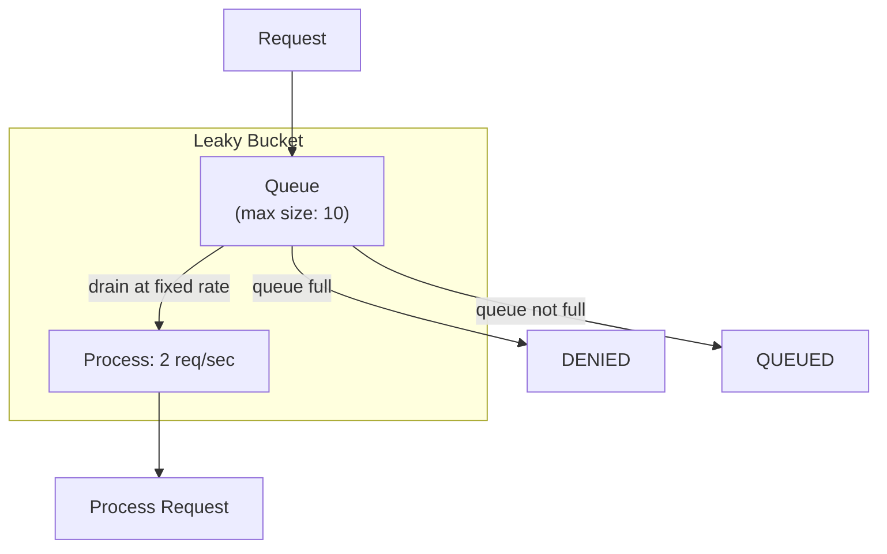
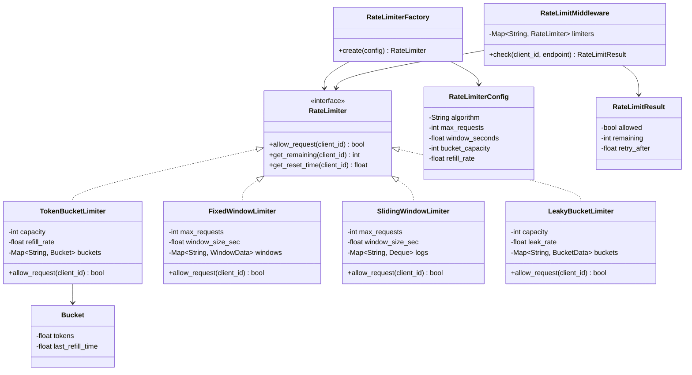
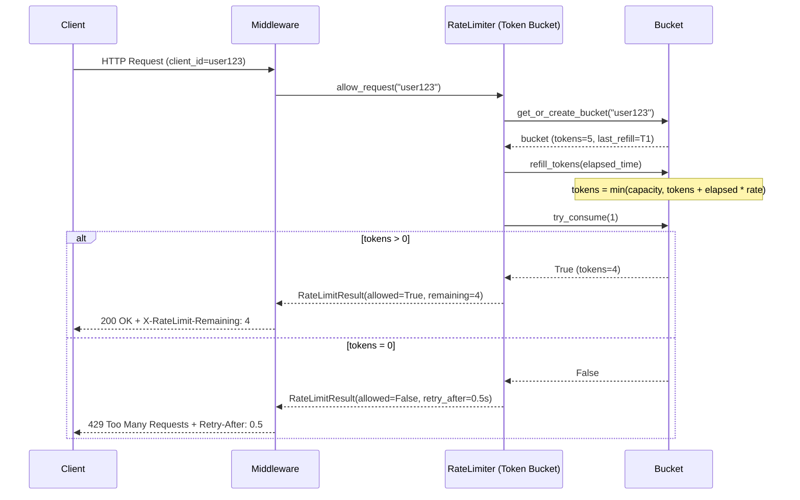

# Rate Limiter - Low Level Design

## Problem Statement
Design a rate limiter that can restrict the number of requests a client can make within a time window. Support multiple algorithms: Token Bucket, Sliding Window, Fixed Window, and Leaky Bucket. The system should be thread-safe, configurable, and support per-user limits.

---

## Functional Requirements
1. **Limit Requests** - Allow or deny based on rate limit rules
2. **Multiple Algorithms** - Token Bucket, Sliding Window, Fixed Window, Leaky Bucket
3. **Per-User Limiting** - Different limits per client/API key
4. **Configurable Limits** - Requests per second/minute/hour
5. **Thread-Safe** - Handle concurrent requests correctly
6. **Rate Limit Headers** - Return remaining quota, reset time

## Non-Functional Requirements
- Sub-millisecond decision time
- Minimal memory per client
- Accurate under high concurrency
- Graceful degradation

---

## Design Patterns Used

| Pattern | Where Used | Why |
|---------|-----------|-----|
| **Strategy** | Algorithm selection (Token Bucket, Sliding Window, etc.) | Swap algorithms without changing client code |
| **Singleton** | Global rate limiter instance | Single point of enforcement |
| **Factory** | Create appropriate limiter per config | Encapsulate creation logic |

---

## How Each Algorithm Works

### 1. Token Bucket

- Bucket holds tokens up to a max capacity
- Tokens are added at a fixed rate
- Each request consumes one token
- **Pros**: Allows bursts up to bucket size
- **Best for**: APIs that allow short bursts

### 2. Fixed Window

- Divide time into fixed windows (e.g., per minute)
- Count requests in current window
- Reset count at window boundary
- **Cons**: Boundary problem (2x burst at window edges)
- **Best for**: Simple rate limiting

### 3. Sliding Window Log

- Keep a log of all request timestamps
- For each request, remove timestamps outside the window
- Count remaining entries
- **Pros**: Most accurate, no boundary issues
- **Cons**: Memory-intensive (stores all timestamps)
- **Best for**: Strict accuracy requirements

### 4. Leaky Bucket

- Requests enter a queue (bucket)
- Queue drains at a fixed rate
- If queue is full, requests are rejected
- **Pros**: Smooth output rate, no bursts
- **Best for**: Protecting downstream services from bursts

---

## Class Diagram

---

## Sequence Diagram - Request Flow

---

## Algorithm Comparison

| Algorithm | Burst Handling | Memory | Accuracy | Complexity |
|-----------|---------------|--------|----------|------------|
| Token Bucket | Allows bursts | O(1) per user | Good | Low |
| Fixed Window | Boundary burst | O(1) per user | Moderate | Low |
| Sliding Window | No bursts | O(n) per user | Best | Medium |
| Leaky Bucket | Smooths output | O(1) per user | Good | Low |

---

## Edge Cases
1. **Clock skew** - Use monotonic clock, not wall clock
2. **Distributed system** - Need Redis/centralized store for consistency
3. **Race conditions** - Lock per client_id, not global lock
4. **Large number of clients** - Lazy cleanup of expired state
5. **Negative refill** - Handle system clock going backward
6. **0-capacity bucket** - Reject all requests immediately
7. **Burst at window boundary** - Fixed window allows 2x burst; use sliding window
8. **Long idle clients** - Cap token refill at max capacity

## Extensions
- Distributed rate limiting with Redis
- Rate limiting by IP, API key, or endpoint
- Dynamic rate limit adjustment based on load
- Rate limit tiers (free vs premium)
- Exponential backoff recommendations in 429 responses
- Rate limit dashboard and monitoring

---

## Interview Tips

1. **Know all 4 algorithms** - Be ready to explain trade-offs between each
2. **Start with Token Bucket** - Most commonly asked, best balance of simplicity and features
3. **Discuss thread safety** - Critical for production; mention locks or atomic operations
4. **Mention distributed case** - "In production, I'd use Redis with Lua scripts for atomicity"
5. **Draw the bucket diagram** - Visual explanation is very effective
6. **Common follow-up**: "How to rate limit in a microservices architecture?" - API gateway, sidecar proxy
7. **Common follow-up**: "Token Bucket vs Leaky Bucket?" - Token allows bursts, Leaky smooths output
