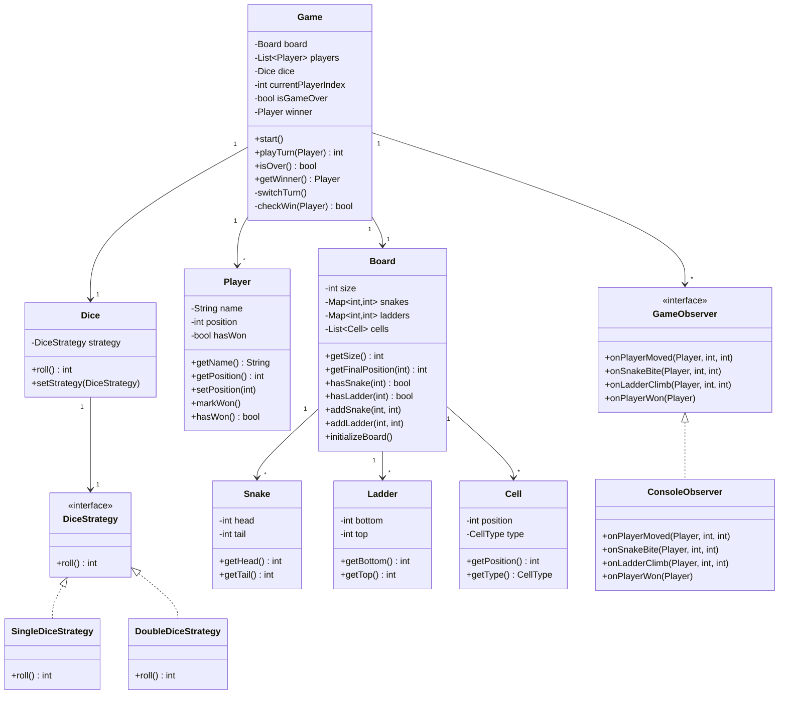
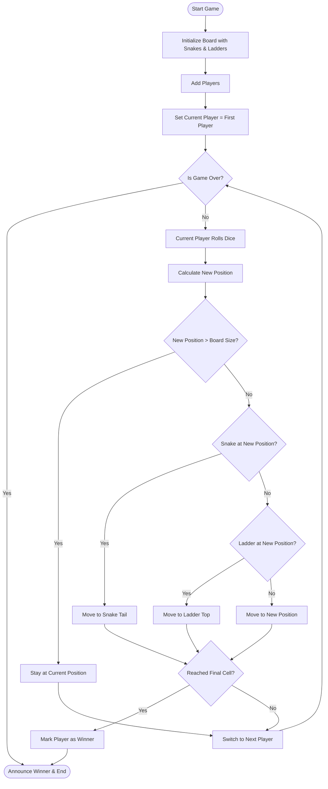
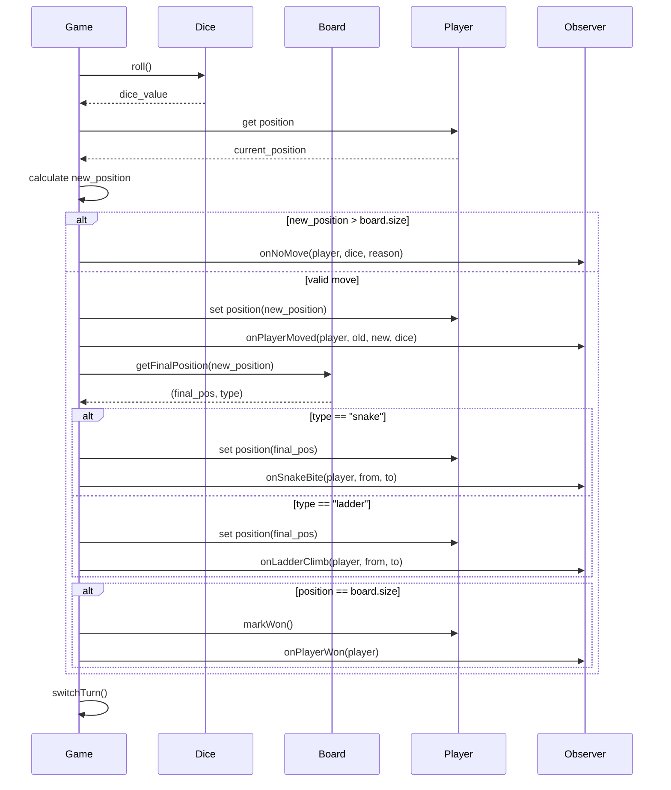

# Snake and Ladder Game - Low Level Design

## Problem Statement

Design a Snake and Ladder board game that supports multiple players on an N x N board (typically 10x10 = 100 cells). Players take turns rolling dice and move forward. Landing on a snake head moves the player down to the snake's tail; landing at the bottom of a ladder moves the player up to the top. The first player to reach cell 100 wins.

---

## Requirements

### Functional Requirements
1. Support an N x N board (default 10x10 = 100 cells)
2. Support 2-4 players
3. Dice rolling (configurable: single die or double dice)
4. Snakes: move the player from head (higher cell) to tail (lower cell)
5. Ladders: move the player from bottom (lower cell) to top (higher cell)
6. Win condition: first player to reach or exceed cell N*N wins
7. Turn-based gameplay with sequential player turns
8. A snake and a ladder cannot start on the same cell
9. No snake or ladder at cell 1 or cell 100

### Non-Functional Requirements
- Extensible for different board sizes
- Clean separation between game logic and presentation
- Easy to add new game rules (e.g., extra turn on rolling 6)

---

## Core Entities

| Entity  | Responsibility |
|---------|---------------|
| `Game`  | Orchestrates gameplay, manages turns, detects winner |
| `Board` | Holds the grid, snakes, ladders, and cell mapping |
| `Player`| Tracks name, current position, and game status |
| `Dice`  | Generates random roll values (strategy-based) |
| `Snake` | Defines head (start) and tail (end) positions |
| `Ladder`| Defines bottom (start) and top (end) positions |
| `Cell`  | Represents a position on the board |

---

## Class Diagram



---

## Design Patterns Used

### 1. Strategy Pattern - Dice Rolling

The dice rolling mechanism is abstracted behind a `DiceStrategy` interface. This allows the game to switch between single-die and double-dice modes without changing the `Dice` class.

```
DiceStrategy (interface)
   |-- SingleDiceStrategy (rolls 1 die: 1-6)
   |-- DoubleDiceStrategy (rolls 2 dice: 2-12)
```

**Why?** Different game variants use different numbers of dice. Strategy lets us swap behavior at runtime.

### 2. Observer Pattern - Game Events

Game events (player moved, snake bite, ladder climb, player won) are broadcast to registered observers. This decouples the game logic from the UI/logging layer.

```
GameObserver (interface)
   |-- ConsoleObserver (prints events to console)
   |-- (future: GUIObserver, LogObserver, etc.)
```

**Why?** The game engine should not know or care about how events are displayed. Multiple listeners can react to the same event independently.

### 3. Template Method Pattern - Game Flow

The `Game.start()` method defines the overall skeleton of the game loop:
1. Initialize board
2. Loop: roll dice -> move player -> check snakes/ladders -> check win -> switch turn
3. Announce winner

Subclasses could override specific steps (e.g., extra turn on 6, skip turn rules).

---

## Activity Diagram - Game Flow



---

## Complete Python Implementation

```python
"""
Snake and Ladder Game - Low Level Design
Supports: N x N board, 2-4 players, configurable dice strategy,
snakes, ladders, observer notifications, and win detection.
"""

import random
from abc import ABC, abstractmethod
from typing import List, Dict, Optional, Tuple


# ─────────────────────────────────────────────
# Strategy Pattern: Dice Strategies
# ─────────────────────────────────────────────

class DiceStrategy(ABC):
    """Interface for dice rolling strategies."""

    @abstractmethod
    def roll(self) -> int:
        pass


class SingleDiceStrategy(DiceStrategy):
    """Rolls a single 6-faced die."""

    def roll(self) -> int:
        return random.randint(1, 6)


class DoubleDiceStrategy(DiceStrategy):
    """Rolls two 6-faced dice and returns the sum."""

    def roll(self) -> int:
        return random.randint(1, 6) + random.randint(1, 6)


# ─────────────────────────────────────────────
# Dice
# ─────────────────────────────────────────────

class Dice:
    """Dice that delegates rolling to a strategy."""

    def __init__(self, strategy: DiceStrategy = None):
        self._strategy = strategy or SingleDiceStrategy()

    def roll(self) -> int:
        return self._strategy.roll()

    def set_strategy(self, strategy: DiceStrategy):
        self._strategy = strategy


# ─────────────────────────────────────────────
# Board Elements
# ─────────────────────────────────────────────

class Snake:
    """A snake with a head (higher cell) and tail (lower cell)."""

    def __init__(self, head: int, tail: int):
        if head <= tail:
            raise ValueError(f"Snake head ({head}) must be greater than tail ({tail})")
        self._head = head
        self._tail = tail

    @property
    def head(self) -> int:
        return self._head

    @property
    def tail(self) -> int:
        return self._tail

    def __repr__(self):
        return f"Snake({self._head} -> {self._tail})"


class Ladder:
    """A ladder with a bottom (lower cell) and top (higher cell)."""

    def __init__(self, bottom: int, top: int):
        if bottom >= top:
            raise ValueError(f"Ladder bottom ({bottom}) must be less than top ({top})")
        self._bottom = bottom
        self._top = top

    @property
    def bottom(self) -> int:
        return self._bottom

    @property
    def top(self) -> int:
        return self._top

    def __repr__(self):
        return f"Ladder({self._bottom} -> {self._top})"


class Cell:
    """Represents a single cell on the board."""

    def __init__(self, position: int):
        self._position = position

    @property
    def position(self) -> int:
        return self._position


# ─────────────────────────────────────────────
# Board
# ─────────────────────────────────────────────

class Board:
    """
    The game board containing cells, snakes, and ladders.
    Board size = dimension * dimension (e.g., 10x10 = 100).
    """

    def __init__(self, dimension: int = 10):
        self._dimension = dimension
        self._size = dimension * dimension
        self._snakes: Dict[int, int] = {}    # head -> tail
        self._ladders: Dict[int, int] = {}   # bottom -> top
        self._cells: List[Cell] = [Cell(i) for i in range(self._size + 1)]

    @property
    def size(self) -> int:
        return self._size

    def add_snake(self, head: int, tail: int):
        snake = Snake(head, tail)
        if head == 1 or head == self._size or tail == self._size:
            raise ValueError("Cannot place snake at cell 1 or final cell")
        if head in self._ladders:
            raise ValueError(f"Cell {head} already has a ladder start")
        self._snakes[head] = tail

    def add_ladder(self, bottom: int, top: int):
        ladder = Ladder(bottom, top)
        if bottom == 1 or top == self._size and bottom == self._size:
            raise ValueError("Cannot place ladder at invalid positions")
        if bottom in self._snakes:
            raise ValueError(f"Cell {bottom} already has a snake head")
        self._ladders[bottom] = top

    def get_final_position(self, position: int) -> Tuple[int, str]:
        """
        Returns the final position after applying snake/ladder rules.
        Also returns the type of transition: 'snake', 'ladder', or 'normal'.
        """
        if position in self._snakes:
            return self._snakes[position], "snake"
        elif position in self._ladders:
            return self._ladders[position], "ladder"
        return position, "normal"

    def has_snake(self, position: int) -> bool:
        return position in self._snakes

    def has_ladder(self, position: int) -> bool:
        return position in self._ladders

    @property
    def snakes(self) -> Dict[int, int]:
        return dict(self._snakes)

    @property
    def ladders(self) -> Dict[int, int]:
        return dict(self._ladders)


# ─────────────────────────────────────────────
# Player
# ─────────────────────────────────────────────

class Player:
    """Represents a player in the game."""

    def __init__(self, name: str):
        self._name = name
        self._position = 0  # 0 means not yet on the board
        self._has_won = False

    @property
    def name(self) -> str:
        return self._name

    @property
    def position(self) -> int:
        return self._position

    @position.setter
    def position(self, value: int):
        self._position = value

    @property
    def has_won(self) -> bool:
        return self._has_won

    def mark_won(self):
        self._has_won = True

    def __repr__(self):
        return f"Player({self._name}, pos={self._position})"


# ─────────────────────────────────────────────
# Observer Pattern: Game Events
# ─────────────────────────────────────────────

class GameObserver(ABC):
    """Interface for observing game events."""

    @abstractmethod
    def on_player_moved(self, player: Player, old_pos: int, new_pos: int, dice_value: int):
        pass

    @abstractmethod
    def on_snake_bite(self, player: Player, from_pos: int, to_pos: int):
        pass

    @abstractmethod
    def on_ladder_climb(self, player: Player, from_pos: int, to_pos: int):
        pass

    @abstractmethod
    def on_player_won(self, player: Player):
        pass

    @abstractmethod
    def on_no_move(self, player: Player, dice_value: int, reason: str):
        pass


class ConsoleObserver(GameObserver):
    """Prints game events to the console."""

    def on_player_moved(self, player: Player, old_pos: int, new_pos: int, dice_value: int):
        print(f"  {player.name} rolled a {dice_value} and moved from {old_pos} to {new_pos}")

    def on_snake_bite(self, player: Player, from_pos: int, to_pos: int):
        print(f"  SNAKE BITE! {player.name} slides down from {from_pos} to {to_pos}")

    def on_ladder_climb(self, player: Player, from_pos: int, to_pos: int):
        print(f"  LADDER! {player.name} climbs up from {from_pos} to {to_pos}")

    def on_player_won(self, player: Player):
        print(f"\n  {player.name} WINS the game!")

    def on_no_move(self, player: Player, dice_value: int, reason: str):
        print(f"  {player.name} rolled a {dice_value} but cannot move ({reason})")


# ─────────────────────────────────────────────
# Board Initializer (Random Snakes & Ladders)
# ─────────────────────────────────────────────

class BoardInitializer:
    """Generates random snakes and ladders on a board."""

    @staticmethod
    def setup_random(board: Board, num_snakes: int = 6, num_ladders: int = 6):
        """Places random snakes and ladders on the board, avoiding conflicts."""
        occupied = set()
        size = board.size

        # Place snakes
        placed = 0
        while placed < num_snakes:
            head = random.randint(2, size - 1)
            tail = random.randint(1, head - 1)
            if head not in occupied and tail not in occupied:
                board.add_snake(head, tail)
                occupied.add(head)
                placed += 1

        # Place ladders
        placed = 0
        while placed < num_ladders:
            bottom = random.randint(2, size - 1)
            top = random.randint(bottom + 1, size)
            if bottom not in occupied and top not in occupied and top != size:
                # Allow top == size only if bottom is valid
                board.add_ladder(bottom, top)
                occupied.add(bottom)
                placed += 1

    @staticmethod
    def setup_fixed(board: Board):
        """Places a known set of snakes and ladders (for reproducible games)."""
        # Snakes: head -> tail
        snakes = [(16, 6), (47, 26), (49, 11), (56, 53), (62, 19),
                  (64, 60), (87, 24), (93, 73), (95, 75), (98, 78)]
        for head, tail in snakes:
            if head <= board.size and tail >= 1:
                board.add_snake(head, tail)

        # Ladders: bottom -> top
        ladders = [(1, 38), (4, 14), (9, 31), (21, 42), (28, 84),
                   (36, 44), (51, 67), (71, 91), (80, 99)]
        for bottom, top in ladders:
            if top <= board.size and bottom >= 1:
                board.add_ladder(bottom, top)


# ─────────────────────────────────────────────
# Game Engine
# ─────────────────────────────────────────────

class Game:
    """
    Orchestrates the Snake and Ladder game.
    Uses Template Method pattern for the game loop.
    """

    def __init__(self, board: Board, players: List[Player], dice: Dice):
        if len(players) < 2:
            raise ValueError("Need at least 2 players")
        if len(players) > 4:
            raise ValueError("Maximum 4 players allowed")

        self._board = board
        self._players = players
        self._dice = dice
        self._current_player_index = 0
        self._is_game_over = False
        self._winner: Optional[Player] = None
        self._observers: List[GameObserver] = []

    def add_observer(self, observer: GameObserver):
        self._observers.append(observer)

    def remove_observer(self, observer: GameObserver):
        self._observers.remove(observer)

    # ── Notification helpers ──

    def _notify_moved(self, player: Player, old_pos: int, new_pos: int, dice_val: int):
        for obs in self._observers:
            obs.on_player_moved(player, old_pos, new_pos, dice_val)

    def _notify_snake(self, player: Player, from_pos: int, to_pos: int):
        for obs in self._observers:
            obs.on_snake_bite(player, from_pos, to_pos)

    def _notify_ladder(self, player: Player, from_pos: int, to_pos: int):
        for obs in self._observers:
            obs.on_ladder_climb(player, from_pos, to_pos)

    def _notify_won(self, player: Player):
        for obs in self._observers:
            obs.on_player_won(player)

    def _notify_no_move(self, player: Player, dice_val: int, reason: str):
        for obs in self._observers:
            obs.on_no_move(player, dice_val, reason)

    # ── Core game logic ──

    @property
    def is_over(self) -> bool:
        return self._is_game_over

    @property
    def winner(self) -> Optional[Player]:
        return self._winner

    def _get_current_player(self) -> Player:
        return self._players[self._current_player_index]

    def _switch_turn(self):
        self._current_player_index = (
            (self._current_player_index + 1) % len(self._players)
        )

    def play_turn(self) -> Optional[Player]:
        """
        Plays a single turn for the current player.
        Returns the winning player if the game ends, else None.
        """
        if self._is_game_over:
            return self._winner

        player = self._get_current_player()
        dice_value = self._dice.roll()
        old_position = player.position
        new_position = old_position + dice_value

        # Check if move exceeds board
        if new_position > self._board.size:
            self._notify_no_move(player, dice_value, "exceeds board size")
            self._switch_turn()
            return None

        # Move player
        player.position = new_position
        self._notify_moved(player, old_position, new_position, dice_value)

        # Check for snake or ladder
        final_position, transition = self._board.get_final_position(new_position)
        if transition == "snake":
            self._notify_snake(player, new_position, final_position)
            player.position = final_position
        elif transition == "ladder":
            self._notify_ladder(player, new_position, final_position)
            player.position = final_position

        # Check win
        if player.position == self._board.size:
            player.mark_won()
            self._is_game_over = True
            self._winner = player
            self._notify_won(player)
            return player

        self._switch_turn()
        return None

    def start(self, max_turns: int = 1000) -> Optional[Player]:
        """
        Runs the entire game until someone wins or max_turns is reached.
        Template Method: initialize -> loop (roll, move, check) -> announce.
        """
        print("=" * 50)
        print("  SNAKE AND LADDER GAME")
        print("=" * 50)
        print(f"\nPlayers: {', '.join(p.name for p in self._players)}")
        print(f"Board size: {self._board.size}")
        print(f"Snakes: {self._board.snakes}")
        print(f"Ladders: {self._board.ladders}")
        print(f"\n{'─' * 50}")

        turn = 0
        while not self._is_game_over and turn < max_turns:
            turn += 1
            current = self._get_current_player()
            print(f"\nTurn {turn} - {current.name} (at position {current.position}):")
            winner = self.play_turn()
            if winner:
                print(f"\nGame finished in {turn} turns!")
                return winner

        if not self._is_game_over:
            print(f"\nGame ended after {max_turns} turns with no winner.")
        return self._winner


# ─────────────────────────────────────────────
# Game Builder (Convenience)
# ─────────────────────────────────────────────

class GameBuilder:
    """Fluent builder to construct a Game instance."""

    def __init__(self):
        self._dimension = 10
        self._player_names: List[str] = []
        self._dice_strategy: DiceStrategy = SingleDiceStrategy()
        self._use_fixed_board = False
        self._num_snakes = 6
        self._num_ladders = 6

    def with_dimension(self, dim: int) -> "GameBuilder":
        self._dimension = dim
        return self

    def with_players(self, *names: str) -> "GameBuilder":
        self._player_names = list(names)
        return self

    def with_dice_strategy(self, strategy: DiceStrategy) -> "GameBuilder":
        self._dice_strategy = strategy
        return self

    def with_fixed_board(self) -> "GameBuilder":
        self._use_fixed_board = True
        return self

    def with_random_board(self, snakes: int = 6, ladders: int = 6) -> "GameBuilder":
        self._use_fixed_board = False
        self._num_snakes = snakes
        self._num_ladders = ladders
        return self

    def build(self) -> Game:
        board = Board(self._dimension)
        if self._use_fixed_board:
            BoardInitializer.setup_fixed(board)
        else:
            BoardInitializer.setup_random(board, self._num_snakes, self._num_ladders)

        players = [Player(name) for name in self._player_names]
        dice = Dice(self._dice_strategy)
        game = Game(board, players, dice)
        game.add_observer(ConsoleObserver())
        return game


# ─────────────────────────────────────────────
# Main: Run the Game
# ─────────────────────────────────────────────

if __name__ == "__main__":
    random.seed(42)  # For reproducible output

    game = (
        GameBuilder()
        .with_dimension(10)
        .with_players("Alice", "Bob", "Charlie")
        .with_dice_strategy(SingleDiceStrategy())
        .with_fixed_board()
        .build()
    )

    game.start()
```

---

## Sample Game Output

```
==================================================
  SNAKE AND LADDER GAME
==================================================

Players: Alice, Bob, Charlie
Board size: 100
Snakes: {16: 6, 47: 26, 49: 11, 56: 53, 62: 19, 64: 60, 87: 24, 93: 73, 95: 75, 98: 78}
Ladders: {1: 38, 4: 14, 9: 31, 21: 42, 28: 84, 36: 44, 51: 67, 71: 91, 80: 99}

──────────────────────────────────────────────────

Turn 1 - Alice (at position 0):
  Alice rolled a 1 and moved from 0 to 1
  LADDER! Alice climbs up from 1 to 38

Turn 2 - Bob (at position 0):
  Bob rolled a 1 and moved from 0 to 1
  LADDER! Bob climbs up from 1 to 38

Turn 3 - Charlie (at position 0):
  Charlie rolled a 6 and moved from 0 to 6

Turn 4 - Alice (at position 38):
  Alice rolled a 6 and moved from 38 to 44

Turn 5 - Bob (at position 38):
  Bob rolled a 4 and moved from 38 to 42

...

Turn 47 - Bob (at position 96):
  Bob rolled a 4 and moved from 96 to 100

  Bob WINS the game!

Game finished in 47 turns!
```

---

## Key Design Decisions

### 1. Position 0 = Not on Board
Players start at position 0 (off-board). Their first roll places them on the board. This avoids needing a special "start" cell.

### 2. Exceeding Board Size
If a player's new position would exceed 100, they stay in place. This is the standard "exact landing" rule.

### 3. No Chained Snakes/Ladders
Landing on a snake tail that happens to be a ladder bottom does NOT trigger the ladder. Only the initial landing cell is checked. This simplifies logic and avoids infinite loops.

### 4. Observer for Output
All game output goes through observers. The game engine itself is silent. This makes it easy to swap console output for a GUI, logging system, or test harness.

### 5. Builder for Construction
The `GameBuilder` provides a clean, fluent API for constructing games with different configurations without requiring complex constructor signatures.

---

## Extending the Design

| Extension | How to Implement |
|-----------|-----------------|
| Extra turn on rolling 6 | Override `play_turn` or add a rule engine |
| Power-ups on cells | Add `CellEffect` strategy on `Cell` |
| Multiplayer network play | Add `RemotePlayer` subclass + network observer |
| Undo last move | Store move history, implement Command pattern |
| GUI rendering | Add `GUIObserver` implementing `GameObserver` |
| Tournament mode | Wrap `Game` in a `Tournament` class with rankings |

---

## Sequence Diagram - Single Turn



---

## Complexity Analysis

| Operation | Time Complexity | Space Complexity |
|-----------|----------------|-----------------|
| Roll dice | O(1) | O(1) |
| Move player | O(1) | O(1) |
| Check snake/ladder | O(1) - HashMap lookup | O(S + L) where S=snakes, L=ladders |
| Check win | O(1) | O(1) |
| Full game | O(T) where T = total turns | O(N + S + L + P) |
| Board initialization | O(S + L) | O(N) for cells |

---

## Interview Tips

1. **Start with requirements**: Clarify board size, number of players, dice rules, and win conditions.
2. **Identify core entities first**: Board, Player, Dice, Snake, Ladder, Game.
3. **Apply patterns where natural**: Strategy for dice is an easy win; Observer for decoupling output is clean.
4. **Keep it simple**: Do NOT over-engineer. No need for database, networking, or fancy UIs in an interview.
5. **Discuss trade-offs**: Mention chained snakes/ladders, exact-landing rules, and extensibility.
