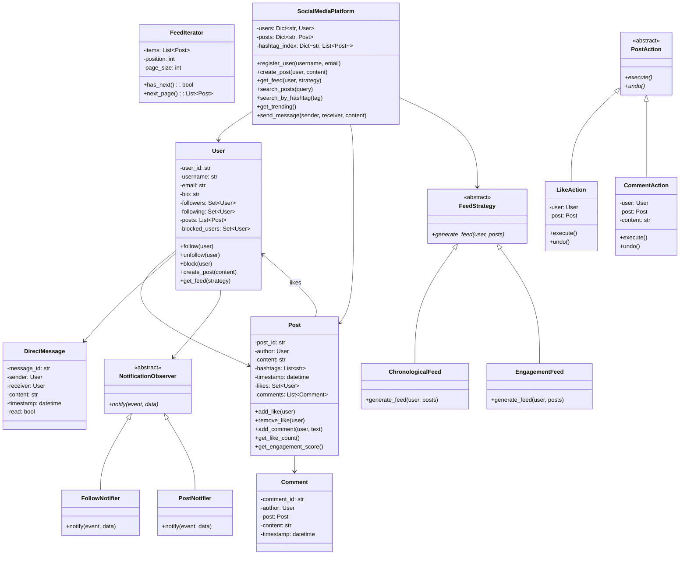
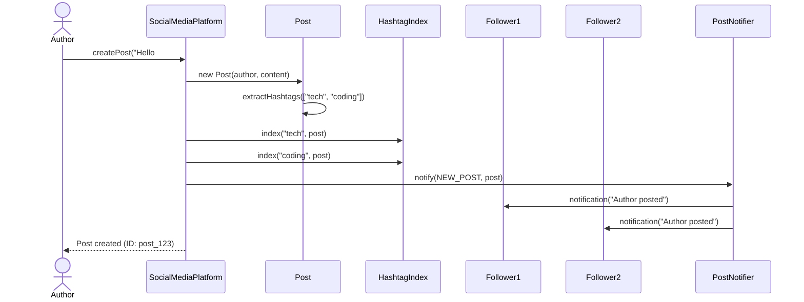
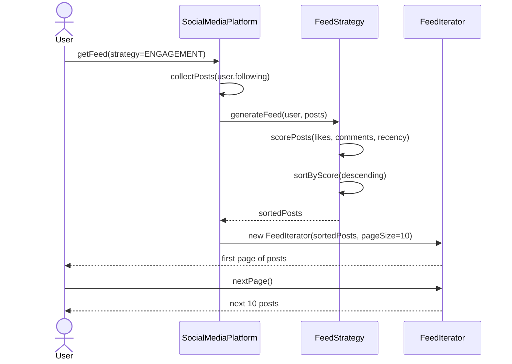
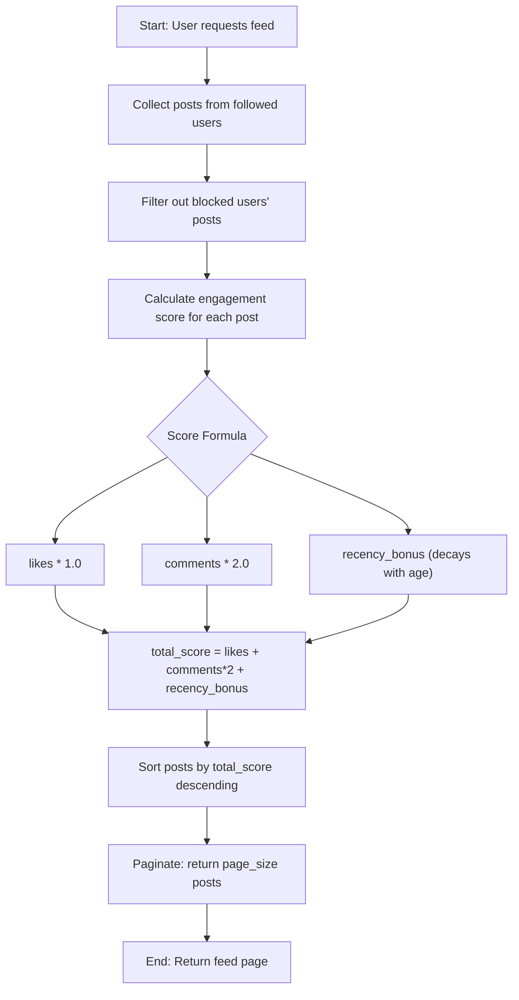

# Social Media Platform (Twitter-like) - Low Level Design

## Problem Statement

Design a Twitter-like social media platform that supports user registration, posting tweets, following/unfollowing users, news feed generation, likes, comments, hashtag support, and direct messaging.

---

## Requirements

### Functional Requirements
1. **User Registration & Profiles** - Create accounts, update profile info
2. **Post/Tweet Creation** - Create text posts with optional hashtags
3. **Follow/Unfollow** - Follow or unfollow other users
4. **News Feed** - Generate personalized feed from followed users
5. **Like/Unlike Posts** - Like or unlike any post
6. **Comment on Posts** - Add comments to posts
7. **Search** - Search for posts by content or hashtags, search for users
8. **Direct Messages** - Send private messages between users
9. **Hashtag Support** - Tag posts with hashtags, view trending topics

### Non-Functional Requirements
- Feed generation should be efficient
- Support different feed algorithms (chronological, engagement-based)
- Handle user blocking gracefully
- Maintain notification delivery for relevant events

---

## Design Patterns Used

| Pattern | Where Used | Why |
|---------|-----------|-----|
| **Observer** | Follow system, notifications | Notify followers when new post is created |
| **Strategy** | Feed generation algorithms | Swap between chronological, engagement-based feeds |
| **Factory** | Content creation (text, image posts) | Uniform creation interface for different content types |
| **Iterator** | Feed pagination | Iterate through feed items without exposing internal structure |
| **Command** | Post actions (like, comment) with undo | Encapsulate actions as objects, support undo |

---

## Class Diagram



---

## Sequence Diagram: Create Post and Notify Followers



---

## Sequence Diagram: Feed Generation



---

## Activity Diagram: Feed Algorithm (Engagement-Based)



---

## Feed Generation Strategies

### Chronological Feed
- Collect all posts from followed users
- Sort by timestamp (newest first)
- Simple and predictable for users

### Engagement-Based Feed
- Score each post: `score = likes * 1.0 + comments * 2.0 + recency_bonus`
- Recency bonus decays over time: `bonus = max(0, 100 - hours_old * 2)`
- Posts with high engagement rise to the top
- Balances freshness with popularity

---

## Hashtag and Search System

### Hashtag Extraction
```
Input:  "Excited about #Python and #LLD interviews!"
Output: ["python", "lld"]
Process: regex find all #\w+, lowercase, deduplicate
```

### Hashtag Index
```
hashtag_index = {
    "python": [post_1, post_5, post_12],
    "lld": [post_3, post_5],
    "coding": [post_2, post_8, post_12]
}
```

### Trending Algorithm
```
1. Count posts per hashtag in last 24 hours
2. Sort by count descending
3. Return top N hashtags
```

---

## Command Pattern: Actions with Undo

### Like Action
```
execute(): Add user to post.likes
undo():    Remove user from post.likes
```

### Comment Action
```
execute(): Add comment to post.comments
undo():    Remove comment from post.comments
```

This enables:
- Action history tracking
- Undo support (unlike, delete comment)
- Batch operations

---

## Edge Cases

### 1. Private Accounts
```
User sets account to private.
- Follow requests require approval
- Posts only visible to approved followers
- Profile shows limited info to non-followers
```

### 2. Blocked Users
```
User A blocks User B:
- B cannot see A's posts or profile
- B's posts filtered from A's feed
- B cannot send DMs to A
- Existing follows are removed
```

### 3. Self-Interactions
```
- User cannot follow themselves
- User cannot like their own post (optional rule)
- User cannot send DM to themselves
```

### 4. Trending Manipulation
```
Spam detection for hashtags:
- Rate limit: max posts per hour per user
- Duplicate content detection
- Minimum account age for trending eligibility
```

### 5. Feed Edge Cases
```
- New user with no follows: show suggested/popular posts
- User follows no active accounts: show trending posts
- All followed users blocked: empty feed with suggestion
```

### 6. Message Delivery
```
- Receiver has blocked sender: reject silently
- Receiver account deleted: return error
- Offline receiver: store for later delivery
```

---

## Key Interview Discussion Points

### Why Observer for Follows?
- When User A follows User B, A is now "observing" B
- New posts by B automatically propagate to A's feed
- Clean decoupling: B doesn't need to know who follows them
- Easy to add notification types (email, push, in-app)

### Why Strategy for Feed?
- Different users may prefer different feed styles
- Business can A/B test feed algorithms
- New algorithms added without changing core logic
- Strategy swappable at request time

### Why Command for Actions?
- Like/unlike is naturally a reversible command
- Enables activity history and analytics
- Supports undo/redo in UI
- Actions can be queued for batch processing

### Scalability Considerations
- Fan-out on write vs. fan-out on read for feeds
- Hashtag index as inverted index (like search engines)
- Caching hot feeds (celebrity users)
- Eventual consistency for like counts

---

## Extensions

1. **Retweet/Repost** - Share others' posts to your followers
2. **Polls** - Create polls within posts
3. **Stories** - Ephemeral posts that expire in 24 hours
4. **Verified Accounts** - Badge system for verified users
5. **Analytics Dashboard** - Post performance metrics
6. **Content Moderation** - AI-based content filtering

---

## File Structure

```
Social-Media/
├── README.md
└── code/
    └── social_media.py    # Full implementation with demo
```
