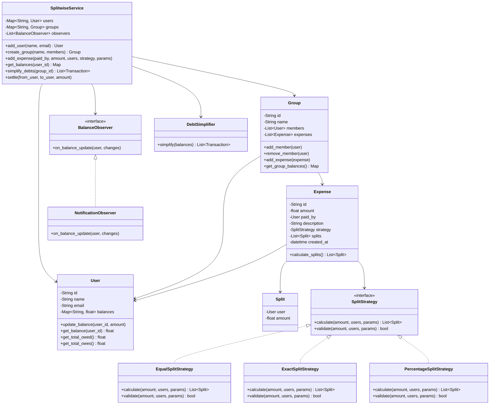
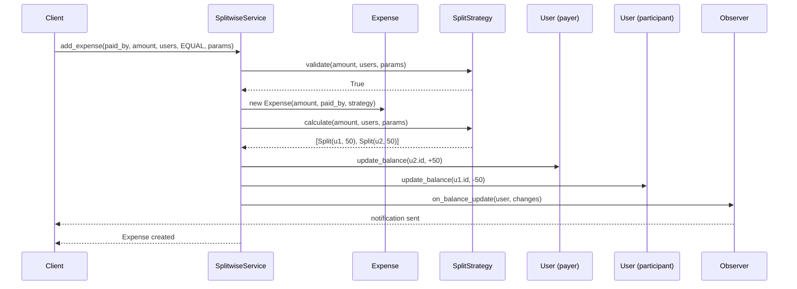
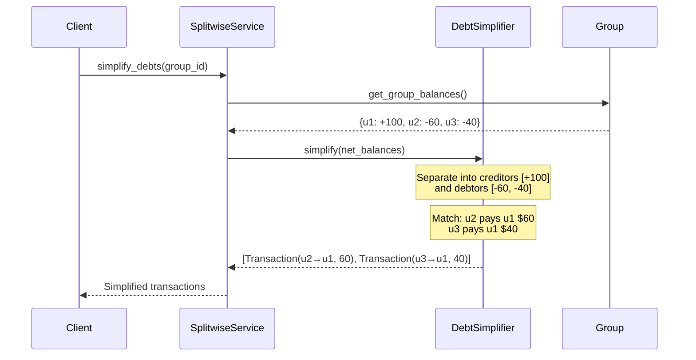

# Splitwise / Expense Splitter - Low Level Design

## Problem Statement
Design a system like Splitwise that allows users to split expenses among groups. Users can add expenses with different split strategies, track balances, and settle debts with a minimum number of transactions.

---

## Functional Requirements
1. **User Management** - Add/remove users with unique IDs
2. **Group Management** - Create groups, add/remove members
3. **Add Expenses** - Support equal, exact amount, and percentage splits
4. **Track Balances** - Maintain who owes whom and how much
5. **Simplify Debts** - Minimize the number of transactions needed to settle
6. **Settlement** - Record payments between users to settle debts
7. **Expense History** - View past expenses for a user or group

## Non-Functional Requirements
- Consistent balance tracking (no money leaks)
- Handle concurrent expense additions
- Scale to thousands of users per group
- Accurate floating-point handling for currency

---

## Design Patterns Used

| Pattern | Where Used | Why |
|---------|-----------|-----|
| **Strategy** | Split strategies (Equal, Exact, Percentage) | Different split algorithms without changing expense logic |
| **Observer** | Balance update notifications | Notify users when their balance changes |
| **Facade** | SplitwiseService | Simplify complex subsystem interactions |

### Strategy Pattern - Split Strategies
The core challenge is supporting multiple split types. Each strategy implements the same interface but computes shares differently:
- **EqualSplit**: Divides equally among all participants
- **ExactSplit**: Each person pays a specified exact amount
- **PercentageSplit**: Each person pays a percentage of the total

### Observer Pattern - Balance Updates
When an expense is added, all affected users are notified of their updated balances. This decouples the expense logic from notification logic.

---

## Class Diagram

---

## Sequence Diagram - Adding an Expense

## Sequence Diagram - Debt Simplification

---

## Debt Simplification Algorithm

The key algorithmic challenge. Given N users with net balances, find minimum transactions to settle all debts:

1. **Calculate net balances** - For each user, sum all amounts owed minus all amounts they owe
2. **Separate into creditors (+) and debtors (-)**
3. **Greedy matching** - Match the largest debtor with the largest creditor
4. **Reduce** - The smaller amount is fully settled, continue with remainder

> **Note**: The optimal solution (minimum transactions) is NP-hard. The greedy approach gives a good approximation. For exact minimum, you'd use subset-sum based approaches.

---

## Edge Cases
1. **Rounding errors** - $100 split 3 ways = $33.33 + $33.33 + $33.34 (last person absorbs remainder)
2. **Self-expense** - User pays and is also a participant
3. **Zero-amount splits** - Validate that all split amounts are positive
4. **Percentage doesn't sum to 100%** - Reject the expense
5. **Exact amounts don't sum to total** - Reject the expense
6. **Empty group** - Cannot add expenses
7. **User not in group** - Cannot split with non-members
8. **Concurrent settlements** - Two users settling simultaneously

## Extensions
- Support for multiple currencies with exchange rates
- Recurring expenses (monthly rent, subscriptions)
- Expense categories and spending analytics
- Receipt image attachment
- Export to CSV/PDF
- Integration with payment gateways for direct settlement

---

## Interview Tips

1. **Start with the Strategy pattern** - This is the most natural fit for split types and interviewers expect it
2. **Discuss the simplification algorithm** - Shows algorithmic thinking beyond just OOP
3. **Mention rounding** - A subtle but important production concern
4. **Draw the class diagram first** - Show User, Group, Expense, SplitStrategy hierarchy
5. **Mention thread safety** - Balance updates should be atomic in production
6. **Common follow-up**: "How would you handle millions of users?" - Discuss sharding by user/group, eventual consistency
