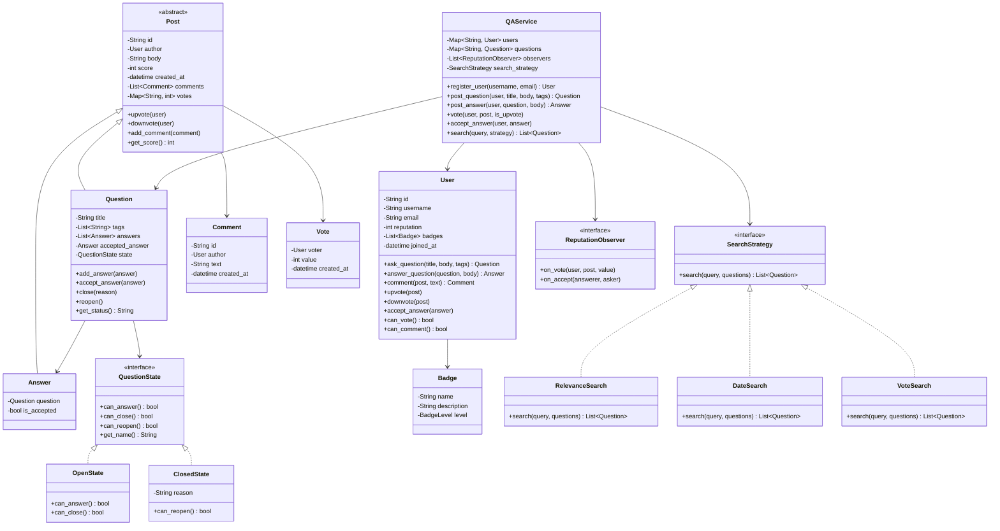
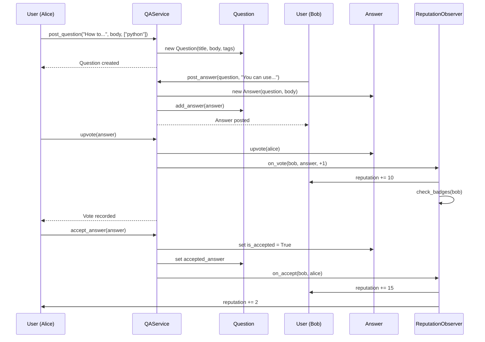
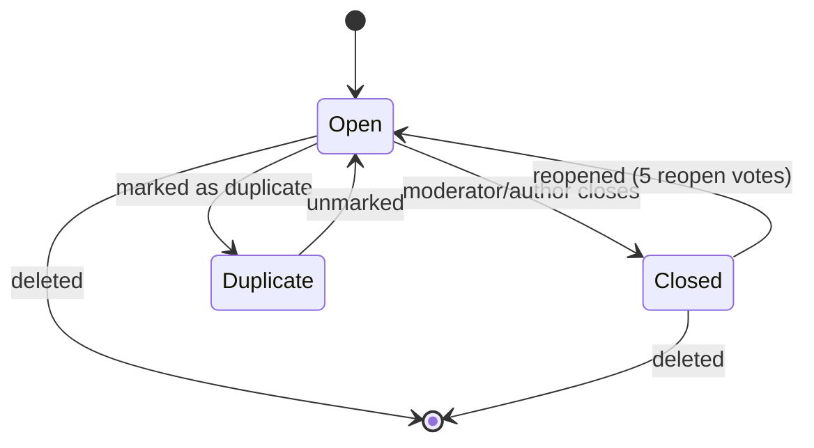

# Stack Overflow / Q&A Forum - Low Level Design

## Problem Statement
Design a Q&A platform like Stack Overflow where users can post questions, provide answers, vote, comment, earn reputation, and search content. The system must handle reputation-based privileges, voting logic, and content moderation.

---

## Functional Requirements
1. **Post Questions** - With title, body, and tags
2. **Post Answers** - Multiple answers per question
3. **Voting** - Upvote/downvote questions and answers
4. **Accept Answer** - Question author marks best answer
5. **Comments** - On both questions and answers
6. **Search** - By tags, title keywords, or author
7. **Reputation System** - Earn/lose reputation from votes
8. **Badges** - Award badges for achievements
9. **Question Status** - Open, Closed, Duplicate

## Non-Functional Requirements
- Prevent vote manipulation (no self-voting, one vote per user per post)
- Scalable search functionality
- Consistent reputation calculation
- Fast feed generation

---

## Design Patterns Used

| Pattern | Where Used | Why |
|---------|-----------|-----|
| **Observer** | Reputation updates, badge checks | Decouple vote events from reputation logic |
| **Strategy** | Search/ranking algorithms | Different search strategies (by relevance, date, votes) |
| **State** | Question status (Open → Closed → Reopened) | Valid state transitions |
| **Composite** | Comments on questions and answers (both are "Commentable") | Uniform interface for posting comments |

### Observer -- Reputation Updates
When a user receives an upvote, multiple things happen:
- Their reputation increases
- Badge eligibility is checked
- Activity feed is updated

All these are decoupled through the observer pattern.

### Reputation Rules
| Action | Reputation Change |
|--------|------------------|
| Question upvoted | +10 |
| Question downvoted | -2 |
| Answer upvoted | +10 |
| Answer downvoted | -2 |
| Answer accepted | +15 |
| Accepted answer (asker) | +2 |
| Downvoting others | -1 (cost to voter) |

---

## Class Diagram

---

## Sequence Diagram - Posting and Voting

## Sequence Diagram - Question State Transitions

---

## Edge Cases
1. **Self-voting** - Users cannot vote on their own posts
2. **Duplicate votes** - One vote per user per post (can change vote direction)
3. **Accepting own answer** - Allowed (no reputation awarded for accepting own answer)
4. **Negative reputation** - Floor at 1 (minimum reputation)
5. **Closed question** - Cannot add new answers, but can still vote/comment
6. **Privilege levels** - Need 15 rep to upvote, 125 to downvote, 50 to comment
7. **Undo vote** - Users can retract their vote
8. **Delete question with answers** - Only if score <= 0 and no answers with score > 0
9. **Answer on closed question** - Rejected

## Extensions
- Bounty system (offer reputation for answers)
- Review queues (close/reopen/edit review)
- User activity history and analytics
- Markdown rendering with code highlighting
- Related questions recommendation
- Answer wiki (community-editable)
- Moderator tools (ban, merge, migrate)

---

## Interview Tips

1. **Start with the data model** - User, Question, Answer, Comment, Vote
2. **Discuss reputation rules** - Shows you understand the domain deeply
3. **Highlight voting constraints** - No self-voting, one vote per post, vote cost
4. **State pattern for questions** - Open/Closed/Duplicate transitions
5. **Observer for reputation** - Decouples voting from reputation calculation
6. **Common follow-up**: "How to prevent gaming?" - Rate limiting votes, fraud detection
7. **Common follow-up**: "How to rank search results?" - TF-IDF, vote score, recency, accepted answers
