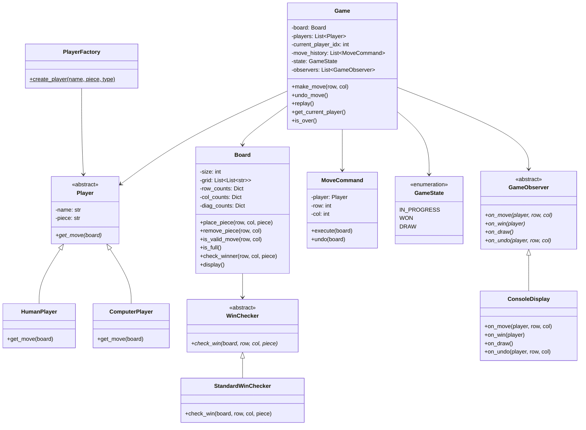
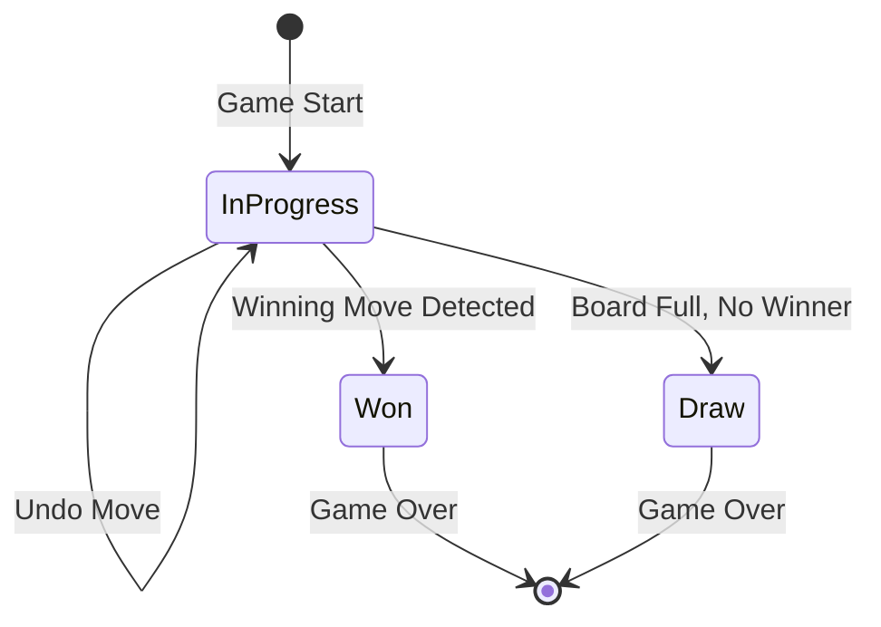

# Tic-Tac-Toe (Extensible NxN) - Low Level Design

## Problem Statement

Design an extensible Tic-Tac-Toe game that supports NxN boards (default 3x3), multiple players with different piece types, undo functionality, win/draw detection, and game replay.

---

## Requirements

### Functional Requirements
1. **NxN Board** - Configurable board size (default 3x3)
2. **2+ Players** - Support for multiple players with unique pieces
3. **Move Placement** - Players take turns placing pieces on the board
4. **Win Detection** - Detect wins across rows, columns, and diagonals
5. **Draw Detection** - Detect when board is full with no winner
6. **Undo Move** - Undo the last move(s)
7. **Game Replay** - Replay all moves from game history
8. **Computer Player** - Optional AI player for single-player mode

### Non-Functional Requirements
- Efficient win detection (O(1) per move possible for NxN)
- Clean separation of game logic from display
- Extensible to different board shapes or rules

---

## Design Patterns Used

| Pattern | Where Used | Why |
|---------|-----------|-----|
| **Command** | Move as command (for undo/redo) | Encapsulate moves, enable undo and replay |
| **Strategy** | Win checking algorithms | Different algorithms for different board sizes |
| **Factory** | Player creation (Human, Computer) | Create players uniformly |
| **Observer** | Game event notifications | Decouple game logic from display/logging |

---

## Class Diagram



---

## State Diagram



---

## Win Detection Algorithm

### Approach: Counter-Based O(1) Check Per Move

Instead of scanning the entire board after each move, maintain counters:

```
For an NxN board with piece 'X':
- row_counts[row]['X'] += 1      → if equals N, X wins on that row
- col_counts[col]['X'] += 1      → if equals N, X wins on that column
- diag_counts[0]['X'] += 1       → if row == col (main diagonal)
- diag_counts[1]['X'] += 1       → if row + col == N-1 (anti-diagonal)
```

### Example: 3x3 Board

```
After X places at (0,0):
  row_counts[0]['X'] = 1
  col_counts[0]['X'] = 1
  diag_counts[0]['X'] = 1  (main diagonal: 0==0)

After X places at (1,1):
  row_counts[1]['X'] = 1
  col_counts[1]['X'] = 1
  diag_counts[0]['X'] = 2  (main diagonal: 1==1)
  diag_counts[1]['X'] = 1  (anti-diagonal: 1+1==2)

After X places at (2,2):
  row_counts[2]['X'] = 1
  col_counts[2]['X'] = 1
  diag_counts[0]['X'] = 3  → X WINS (main diagonal)!
```

### Complexity
- **Place move**: O(1) to check win
- **Undo move**: O(1) to decrement counters
- **Space**: O(N) for counters (vs O(N^2) for brute force scan)

### Brute Force Alternative (for comparison)
For each move, scan the entire row, column, and both diagonals:
- Time: O(N) per move check
- Simpler but slower for large boards

---

## Extension to NxN

### Standard Rule: N-in-a-row wins
For a 3x3 board, you need 3 in a row. For 5x5, you need 5 in a row.

### Modified Rule: K-in-a-row on NxN board
Example: 5x5 board where 4-in-a-row wins (like Gomoku with smaller board).
This requires a sliding window check along rows, columns, and diagonals.

### Scaling Considerations

| Board Size | Players | Win Condition | Notes |
|-----------|---------|---------------|-------|
| 3x3 | 2 | 3-in-a-row | Classic Tic-Tac-Toe |
| 4x4 | 2-3 | 4-in-a-row | Slightly more strategic |
| 5x5 | 2-4 | 5-in-a-row | Approaches Gomoku |
| 15x15 | 2 | 5-in-a-row | Full Gomoku |

---

## Command Pattern: Move with Undo

```
MoveCommand:
  execute():
    1. Place piece on board at (row, col)
    2. Update win counters
    3. Add to history stack

  undo():
    1. Remove piece from board at (row, col)
    2. Decrement win counters
    3. Pop from history stack
    4. Revert to previous player
```

### Replay
```
1. Reset board to empty
2. For each move in history:
   a. Print board state
   b. Execute move
   c. Print updated board
3. Show final result
```

---

## Edge Cases

### 1. Invalid Move
```
Player tries to place on occupied cell.
→ Reject move, display error, same player retries.
```

### 2. Out of Bounds
```
Player enters coordinates outside board range.
→ Reject, display valid range.
```

### 3. Undo at Game Start
```
No moves to undo.
→ Display "No moves to undo."
```

### 4. Undo After Game Over
```
Game is won/drawn, player tries to undo.
→ Allow undo to resume play (reset game state to IN_PROGRESS).
```

### 5. Multiple Players Same Piece
```
Two players try to use 'X'.
→ Validate unique pieces at game creation.
```

### 6. 1x1 Board
```
Board is 1x1, first player wins immediately.
→ Handle as valid edge case.
```

### 7. Large Board Performance
```
100x100 board.
→ Counter-based approach handles this efficiently (O(1) per move).
→ Display becomes the bottleneck, not game logic.
```

---

## Key Interview Discussion Points

### Why Command Pattern for Moves?
- Natural undo/redo capability
- Complete game replay from history
- Each move is a self-contained, reversible action
- History enables analysis and debugging

### Why Strategy for Win Checking?
- Different board sizes may need different algorithms
- Counter-based for standard NxN-in-a-row
- Sliding window for K-in-a-row on NxN
- Easy to swap without changing game logic

### Why Factory for Players?
- Uniform creation interface for Human and Computer players
- Easy to add new player types (network player, AI levels)
- Decouples player creation from game logic

### Computer Player Strategies
- **Random**: Pick any valid empty cell (simplest)
- **Minimax**: Optimal play for small boards (exponential for large)
- **Alpha-Beta Pruning**: Optimized minimax
- **Heuristic**: Rule-based (take center, block opponent, etc.)

---

## Extensions

1. **Online Multiplayer** - Network-based play with turns
2. **Tournament Mode** - Multiple games with scoring
3. **Spectator Mode** - Observer pattern for live viewing
4. **Custom Win Shapes** - L-shaped wins, T-shaped wins
5. **Game Save/Load** - Serialize game state to disk

---

## File Structure

```
Tic-Tac-Toe/
├── README.md
└── code/
    └── tic_tac_toe.py    # Full implementation with demo
```
