# URL Shortener (TinyURL) - Low Level Design

## Problem Statement
Design a URL shortening service like TinyURL / bit.ly. Users can shorten long URLs, access them via short codes, create custom aliases, set expiration times, and view click analytics.

---

## Functional Requirements
1. **Shorten URL** - Generate a short code for a long URL
2. **Redirect** - Given a short code, return the original URL
3. **Custom Aliases** - Allow user-defined short codes
4. **Expiration/TTL** - URLs expire after a configurable time
5. **Click Analytics** - Track click count, last accessed time
6. **Collision Handling** - Handle hash collisions gracefully

## Non-Functional Requirements
- Short codes should be as short as possible (6-8 chars)
- Read-heavy workload (100:1 read to write ratio)
- Low latency redirects (< 10ms)
- High availability
- No predictable/sequential codes (security)

---

## Design Patterns Used

| Pattern | Where Used | Why |
|---------|-----------|-----|
| **Strategy** | Encoding strategies (Base62, MD5, Counter-based) | Swap code generation algorithms |
| **Factory** | Create appropriate encoder | Encapsulate encoder creation |

---

## Short Code Generation Approaches

### 1. Base62 Counter
- Maintain an auto-increment counter
- Convert counter to Base62 (a-z, A-Z, 0-9)
- **Pros**: No collisions, simple
- **Cons**: Predictable, requires coordination in distributed system

### 2. Hash-based (MD5/SHA256)
- Hash the long URL, take first 6-8 characters
- If collision, append counter and re-hash
- **Pros**: Deterministic (same URL = same code)
- **Cons**: Collisions possible, longer computation

### 3. Random Generation
- Generate random Base62 string
- Check for collision, retry if needed
- **Pros**: Unpredictable
- **Cons**: Collision risk increases with scale

---

## Class Diagram

---

## Sequence Diagram - Shortening a URL

## Sequence Diagram - Redirect Flow

```mermaid
sequenceDiagram
    participant C as Client/Browser
    participant S as URLShortenerService
    participant Store as URLStore
    participant A as Analytics

    C->>S: redirect("xK9mP2")
    S->>Store: find_by_code("xK9mP2")
    alt Not found
        Store-->>S: null
        S-->>C: 404 Not Found
    else Found
        Store-->>S: URLEntry
        S->>S: check is_expired()
        alt Expired
            S-->>C: 410 Gone (URL expired)
        else Valid
            S->>A: record_click("xK9mP2", metadata)
            S-->>C: 302 Redirect → long_url
        end
    end
```

---

## Capacity Estimation

| Metric | Value |
|--------|-------|
| New URLs per day | 1 million |
| Reads per day | 100 million (100:1) |
| Code length | 6 characters |
| Base62 capacity | 62^6 = ~56.8 billion |
| Storage per entry | ~500 bytes |
| Storage per year | ~180 GB |

---

## Edge Cases
1. **Hash collision** - Retry with salt, up to max_retries
2. **Custom alias taken** - Return error, suggest alternatives
3. **Expired URL access** - Return 410 Gone, not 404
4. **Same URL shortened twice** - Return existing short code (idempotent)
5. **Invalid URL** - Validate URL format before shortening
6. **Malicious URLs** - Check against blocklist
7. **Very long custom alias** - Enforce max length
8. **Rate limiting** - Prevent abuse of shortening endpoint
9. **Case sensitivity** - Decide: "aBc" vs "abc" (Base62 is case-sensitive)

## Extensions
- User accounts with URL management dashboard
- QR code generation for short URLs
- URL preview (show destination before redirect)
- Geographic analytics (clicks by country)
- A/B testing with multiple destinations
- Bulk URL shortening API
- Password-protected URLs

---

## Interview Tips

1. **Discuss code generation trade-offs** - Counter vs Hash vs Random
2. **Calculate capacity** - 62^6 = 56B codes, show the math
3. **Mention 301 vs 302** - 301 is cached (fewer hits), 302 allows analytics
4. **Discuss read-heavy optimization** - Cache short code lookups
5. **Mention distributed counter** - Zookeeper ranges, Twitter Snowflake
6. **Security** - Don't allow short codes that look like existing routes
7. **Common follow-up**: "How to handle distributed ID generation?" - Range-based counter assignment per server
