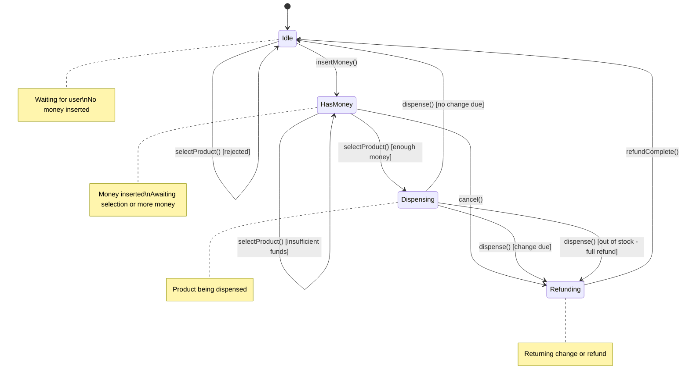
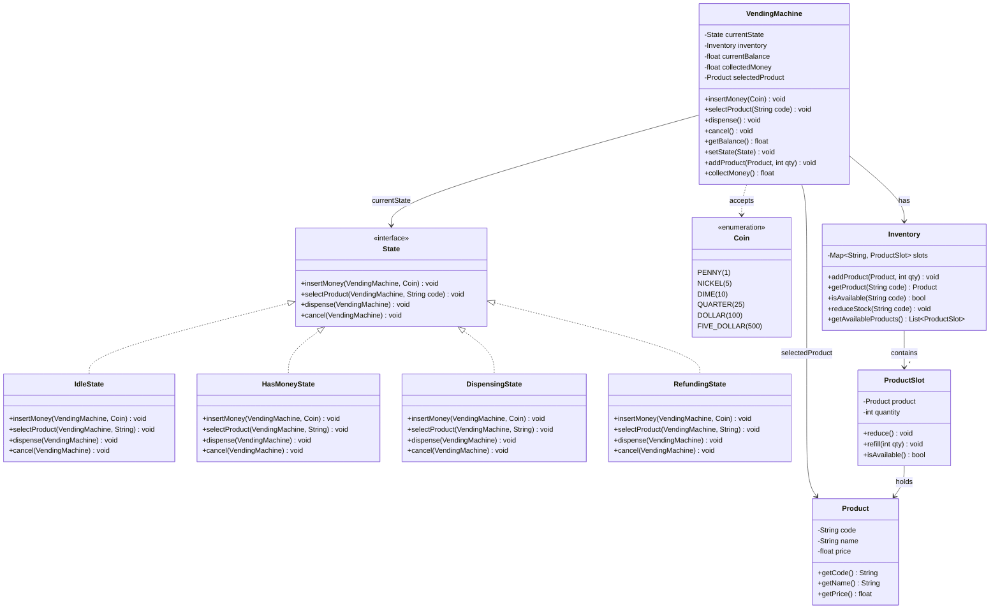
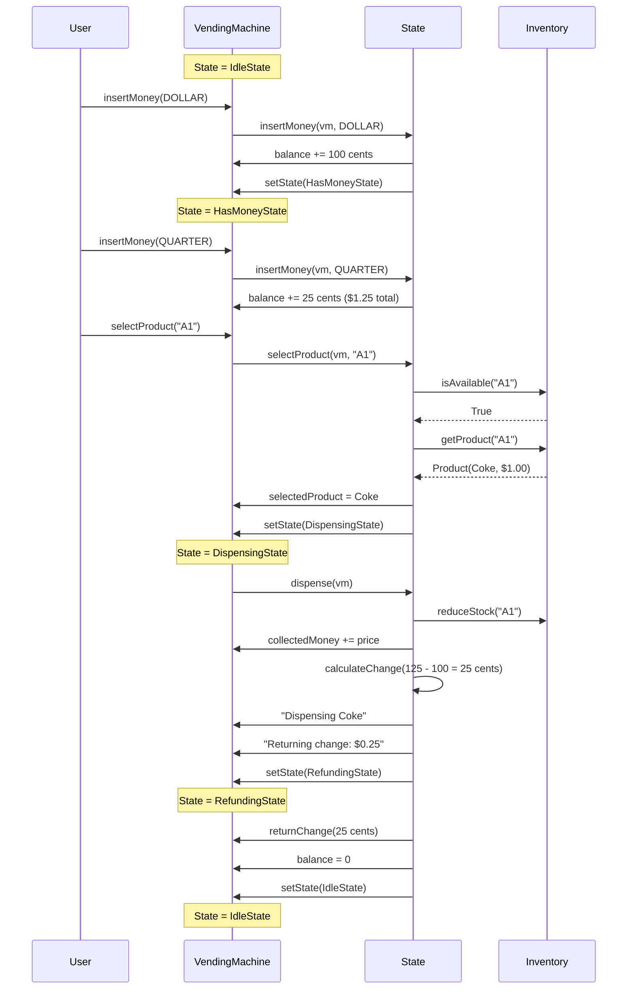
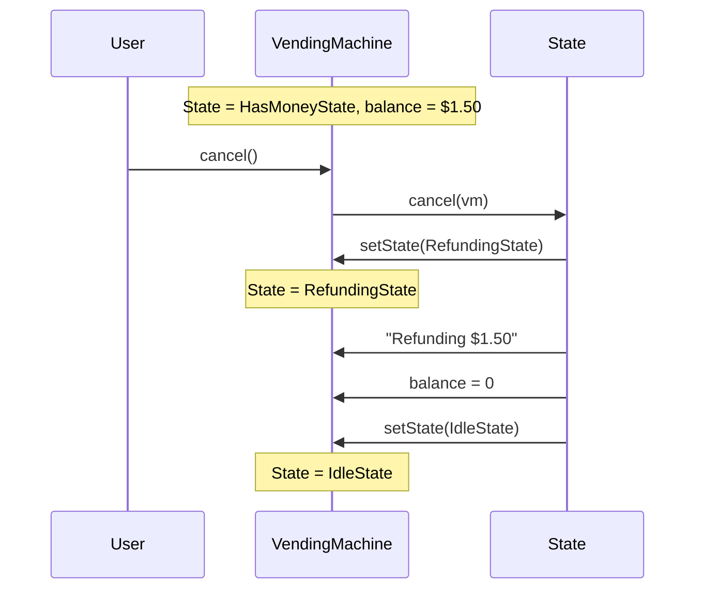

# Vending Machine - Low Level Design

## 1. Problem Statement

Design a Vending Machine system that supports:
- Inserting coins and notes
- Selecting a product
- Dispensing product and returning change
- Cancelling a transaction with full refund
- Admin operations: add products, collect money, refill inventory

This problem is a **State Pattern showcase** -- the machine transitions between well-defined states, and behavior changes based on the current state.

---

## 2. Requirements

### Functional Requirements
| # | Requirement |
|---|------------|
| FR-1 | Accept coins (1, 5, 10, 25 cents) and notes ($1, $5) |
| FR-2 | Display available products and prices |
| FR-3 | Allow product selection |
| FR-4 | Dispense product if sufficient payment |
| FR-5 | Return change after dispensing |
| FR-6 | Cancel transaction and refund full amount |
| FR-7 | Admin: add/refill products |
| FR-8 | Admin: collect accumulated money |

### Non-Functional Requirements
- Clear state transitions with no invalid operations
- Accurate change calculation
- Thread-safe inventory updates

---

## 3. State Diagram (Critical)



---

## 4. Class Diagram



---

## 5. Sequence Diagram - Successful Purchase



---

## 6. Sequence Diagram - Cancellation Flow



---

## 7. Design Pattern - State Pattern Deep Dive

The State Pattern is the **core** of this design. Each state encapsulates the behavior for that phase of the machine's operation:

| State | insertMoney | selectProduct | dispense | cancel |
|-------|-------------|---------------|----------|--------|
| **Idle** | Accept, move to HasMoney | Reject (no money) | Reject | No-op |
| **HasMoney** | Accept, stay | Validate & move to Dispensing | Reject | Refund all, move to Idle |
| **Dispensing** | Reject | Reject | Dispense + change, move to Idle/Refunding | Reject |
| **Refunding** | Reject | Reject | Reject | Reject (already refunding) |

---

## 8. Complete Python Implementation

```python
from __future__ import annotations
from abc import ABC, abstractmethod
from enum import Enum
from typing import Optional
import uuid


# ────────────────────────────────────────────
# Enums
# ────────────────────────────────────────────
class Coin(Enum):
    """All values in cents for precision."""
    PENNY = 1
    NICKEL = 5
    DIME = 10
    QUARTER = 25
    DOLLAR = 100
    FIVE_DOLLAR = 500


# ────────────────────────────────────────────
# Product & Inventory
# ────────────────────────────────────────────
class Product:
    def __init__(self, code: str, name: str, price_cents: int):
        self.code = code
        self.name = name
        self.price_cents = price_cents  # stored in cents

    @property
    def price_display(self) -> str:
        return f"${self.price_cents / 100:.2f}"

    def __repr__(self) -> str:
        return f"{self.name} ({self.code}) - {self.price_display}"


class ProductSlot:
    def __init__(self, product: Product, quantity: int):
        self.product = product
        self.quantity = quantity

    def is_available(self) -> bool:
        return self.quantity > 0

    def reduce(self) -> None:
        if self.quantity > 0:
            self.quantity -= 1

    def refill(self, qty: int) -> None:
        self.quantity += qty

    def __repr__(self) -> str:
        return f"[{self.product.code}] {self.product.name}: {self.quantity} left"


class Inventory:
    def __init__(self):
        self.slots: dict[str, ProductSlot] = {}

    def add_product(self, product: Product, quantity: int) -> None:
        if product.code in self.slots:
            self.slots[product.code].refill(quantity)
        else:
            self.slots[product.code] = ProductSlot(product, quantity)

    def get_product(self, code: str) -> Optional[Product]:
        slot = self.slots.get(code)
        return slot.product if slot else None

    def is_available(self, code: str) -> bool:
        slot = self.slots.get(code)
        return slot is not None and slot.is_available()

    def reduce_stock(self, code: str) -> None:
        if code in self.slots:
            self.slots[code].reduce()

    def get_available_products(self) -> list[ProductSlot]:
        return [s for s in self.slots.values() if s.is_available()]

    def display(self) -> None:
        print("\n--- Available Products ---")
        for slot in self.slots.values():
            status = "IN STOCK" if slot.is_available() else "SOLD OUT"
            print(f"  {slot.product}  qty={slot.quantity}  [{status}]")
        print("-" * 30)


# ────────────────────────────────────────────
# State Interface
# ────────────────────────────────────────────
class State(ABC):
    @abstractmethod
    def insert_money(self, machine: VendingMachine, coin: Coin) -> None:
        pass

    @abstractmethod
    def select_product(self, machine: VendingMachine, code: str) -> None:
        pass

    @abstractmethod
    def dispense(self, machine: VendingMachine) -> None:
        pass

    @abstractmethod
    def cancel(self, machine: VendingMachine) -> None:
        pass


# ────────────────────────────────────────────
# Concrete States
# ────────────────────────────────────────────
class IdleState(State):
    def insert_money(self, machine: VendingMachine, coin: Coin) -> None:
        machine.current_balance += coin.value
        print(f"Inserted {coin.name} ({coin.value} cents). "
              f"Balance: {machine.balance_display}")
        machine.set_state(HasMoneyState())

    def select_product(self, machine: VendingMachine, code: str) -> None:
        print("Please insert money first.")

    def dispense(self, machine: VendingMachine) -> None:
        print("Please insert money and select a product first.")

    def cancel(self, machine: VendingMachine) -> None:
        print("No transaction to cancel.")

    def __repr__(self) -> str:
        return "IdleState"


class HasMoneyState(State):
    def insert_money(self, machine: VendingMachine, coin: Coin) -> None:
        machine.current_balance += coin.value
        print(f"Inserted {coin.name} ({coin.value} cents). "
              f"Balance: {machine.balance_display}")

    def select_product(self, machine: VendingMachine, code: str) -> None:
        product = machine.inventory.get_product(code)

        if not product:
            print(f"Invalid product code: {code}")
            return

        if not machine.inventory.is_available(code):
            print(f"Sorry, {product.name} is sold out.")
            return

        if machine.current_balance < product.price_cents:
            deficit = product.price_cents - machine.current_balance
            print(f"Insufficient funds for {product.name} "
                  f"({product.price_display}). "
                  f"Insert {deficit} more cents.")
            return

        # Sufficient funds and product available
        machine.selected_product = product
        print(f"Selected: {product.name} ({product.price_display})")
        machine.set_state(DispensingState())
        # Auto-trigger dispense
        machine.dispense()

    def dispense(self, machine: VendingMachine) -> None:
        print("Please select a product first.")

    def cancel(self, machine: VendingMachine) -> None:
        print(f"Transaction cancelled.")
        machine.set_state(RefundingState())
        machine.current_state.refund(machine, machine.current_balance)

    def __repr__(self) -> str:
        return "HasMoneyState"


class DispensingState(State):
    def insert_money(self, machine: VendingMachine, coin: Coin) -> None:
        print("Please wait, dispensing in progress.")

    def select_product(self, machine: VendingMachine, code: str) -> None:
        print("Please wait, dispensing in progress.")

    def dispense(self, machine: VendingMachine) -> None:
        product = machine.selected_product
        if not product:
            print("Error: no product selected.")
            machine.set_state(RefundingState())
            machine.current_state.refund(machine, machine.current_balance)
            return

        # Double check stock
        if not machine.inventory.is_available(product.code):
            print(f"Sorry, {product.name} just went out of stock. "
                  f"Full refund.")
            machine.set_state(RefundingState())
            machine.current_state.refund(machine, machine.current_balance)
            return

        # Dispense the product
        machine.inventory.reduce_stock(product.code)
        machine.collected_money += product.price_cents
        change = machine.current_balance - product.price_cents
        machine.current_balance = 0
        machine.selected_product = None

        print(f"*** Dispensing: {product.name} ***")

        if change > 0:
            machine.set_state(RefundingState())
            machine.current_state.refund(machine, change)
        else:
            print("No change due.")
            machine.set_state(IdleState())

    def cancel(self, machine: VendingMachine) -> None:
        print("Cannot cancel, dispensing in progress.")

    def __repr__(self) -> str:
        return "DispensingState"


class RefundingState(State):
    def insert_money(self, machine: VendingMachine, coin: Coin) -> None:
        print("Please wait, refund in progress.")

    def select_product(self, machine: VendingMachine, code: str) -> None:
        print("Please wait, refund in progress.")

    def dispense(self, machine: VendingMachine) -> None:
        print("Please wait, refund in progress.")

    def cancel(self, machine: VendingMachine) -> None:
        print("Already processing refund.")

    def refund(self, machine: VendingMachine, amount: int) -> None:
        if amount <= 0:
            machine.set_state(IdleState())
            return

        change_coins = self._calculate_change(amount)
        print(f"Returning change: ${amount / 100:.2f}")
        print(f"  Coins returned: {change_coins}")
        machine.current_balance = 0
        machine.selected_product = None
        machine.set_state(IdleState())

    @staticmethod
    def _calculate_change(amount_cents: int) -> dict[str, int]:
        """Greedy algorithm: return fewest coins possible."""
        coins_returned: dict[str, int] = {}
        denominations = [
            ("$5.00", 500),
            ("$1.00", 100),
            ("$0.25", 25),
            ("$0.10", 10),
            ("$0.05", 5),
            ("$0.01", 1),
        ]
        remaining = amount_cents
        for name, value in denominations:
            if remaining >= value:
                count = remaining // value
                coins_returned[name] = count
                remaining -= count * value
        return coins_returned

    def __repr__(self) -> str:
        return "RefundingState"


# ────────────────────────────────────────────
# Vending Machine
# ────────────────────────────────────────────
class VendingMachine:
    def __init__(self):
        self.inventory = Inventory()
        self.current_balance: int = 0       # in cents
        self.collected_money: int = 0       # total revenue in cents
        self.selected_product: Optional[Product] = None
        self.current_state: State = IdleState()
        self.transaction_log: list[str] = []

    @property
    def balance_display(self) -> str:
        return f"${self.current_balance / 100:.2f}"

    def set_state(self, state: State) -> None:
        print(f"  [State: {self.current_state} -> {state}]")
        self.current_state = state

    # ── User Operations ──
    def insert_money(self, coin: Coin) -> None:
        self.current_state.insert_money(self, coin)

    def select_product(self, code: str) -> None:
        self.current_state.select_product(self, code)

    def dispense(self) -> None:
        self.current_state.dispense(self)

    def cancel(self) -> None:
        self.current_state.cancel(self)

    # ── Admin Operations ──
    def add_product(self, product: Product, quantity: int) -> None:
        self.inventory.add_product(product, quantity)
        print(f"[ADMIN] Added {quantity}x {product.name} at "
              f"{product.price_display}")

    def collect_money(self) -> int:
        amount = self.collected_money
        self.collected_money = 0
        print(f"[ADMIN] Collected ${amount / 100:.2f}")
        return amount

    def display_products(self) -> None:
        self.inventory.display()

    def get_state_name(self) -> str:
        return str(self.current_state)


# ────────────────────────────────────────────
# Demo / Driver Code
# ────────────────────────────────────────────
def main():
    vm = VendingMachine()

    # Admin setup
    print("=" * 60)
    print("ADMIN: STOCKING THE MACHINE")
    print("=" * 60)
    vm.add_product(Product("A1", "Coke", 100), 5)
    vm.add_product(Product("A2", "Pepsi", 100), 3)
    vm.add_product(Product("B1", "Chips", 150), 4)
    vm.add_product(Product("B2", "Candy Bar", 75), 10)
    vm.add_product(Product("C1", "Water", 50), 8)
    vm.add_product(Product("C2", "Energy Drink", 200), 2)

    vm.display_products()

    # ── Scenario 1: Successful purchase with exact change ──
    print("\n" + "=" * 60)
    print("SCENARIO 1: Exact change purchase")
    print("=" * 60)
    vm.insert_money(Coin.DOLLAR)
    vm.select_product("A1")  # Coke $1.00

    # ── Scenario 2: Purchase with change ──
    print("\n" + "=" * 60)
    print("SCENARIO 2: Purchase with change returned")
    print("=" * 60)
    vm.insert_money(Coin.DOLLAR)
    vm.insert_money(Coin.QUARTER)
    vm.select_product("B2")  # Candy Bar $0.75, should get $0.50 change

    # ── Scenario 3: Insufficient funds ──
    print("\n" + "=" * 60)
    print("SCENARIO 3: Insufficient funds")
    print("=" * 60)
    vm.insert_money(Coin.QUARTER)
    vm.select_product("B1")  # Chips $1.50, only have $0.25
    # Insert more money
    vm.insert_money(Coin.DOLLAR)
    vm.insert_money(Coin.QUARTER)
    vm.select_product("B1")  # Now have $1.50 = exact match

    # ── Scenario 4: Cancellation ──
    print("\n" + "=" * 60)
    print("SCENARIO 4: Transaction cancellation")
    print("=" * 60)
    vm.insert_money(Coin.DOLLAR)
    vm.insert_money(Coin.DOLLAR)
    print(f"Balance before cancel: {vm.balance_display}")
    vm.cancel()

    # ── Scenario 5: Invalid operations in wrong state ──
    print("\n" + "=" * 60)
    print("SCENARIO 5: Invalid operations")
    print("=" * 60)
    print(f"Current state: {vm.get_state_name()}")
    vm.select_product("A1")   # No money inserted
    vm.dispense()             # No money, no selection
    vm.cancel()               # Nothing to cancel

    # ── Scenario 6: Out of stock ──
    print("\n" + "=" * 60)
    print("SCENARIO 6: Buying all stock, then out of stock")
    print("=" * 60)
    # Buy both energy drinks
    vm.insert_money(Coin.DOLLAR)
    vm.insert_money(Coin.DOLLAR)
    vm.select_product("C2")   # Energy Drink 1 of 2

    vm.insert_money(Coin.DOLLAR)
    vm.insert_money(Coin.DOLLAR)
    vm.select_product("C2")   # Energy Drink 2 of 2

    # Try to buy when sold out
    vm.insert_money(Coin.DOLLAR)
    vm.insert_money(Coin.DOLLAR)
    vm.select_product("C2")   # Should say sold out
    vm.cancel()               # Get refund

    # ── Scenario 7: Invalid product code ──
    print("\n" + "=" * 60)
    print("SCENARIO 7: Invalid product code")
    print("=" * 60)
    vm.insert_money(Coin.DOLLAR)
    vm.select_product("Z9")   # Does not exist
    vm.cancel()

    # ── Scenario 8: Multiple coins, large change ──
    print("\n" + "=" * 60)
    print("SCENARIO 8: Large overpayment with change")
    print("=" * 60)
    vm.insert_money(Coin.FIVE_DOLLAR)
    vm.select_product("C1")   # Water $0.50, change = $4.50

    # ── Admin: Collect money ──
    print("\n" + "=" * 60)
    print("ADMIN: COLLECTING REVENUE")
    print("=" * 60)
    vm.collect_money()
    vm.display_products()


def test_change_calculation():
    """Unit test for greedy change algorithm."""
    print("\n" + "=" * 60)
    print("UNIT TEST: Change Calculation")
    print("=" * 60)
    test_cases = [
        (0, {}),
        (1, {"$0.01": 1}),
        (5, {"$0.05": 1}),
        (25, {"$0.25": 1}),
        (30, {"$0.25": 1, "$0.05": 1}),
        (99, {"$0.25": 3, "$0.10": 2, "$0.01": 4}),
        (100, {"$1.00": 1}),
        (450, {"$1.00": 4, "$0.25": 2}),
        (575, {"$5.00": 1, "$0.25": 3}),
    ]
    for amount, expected in test_cases:
        result = RefundingState._calculate_change(amount)
        status = "PASS" if result == expected else "FAIL"
        print(f"  {status}: {amount} cents -> {result}")
        if result != expected:
            print(f"         Expected: {expected}")


if __name__ == "__main__":
    main()
    test_change_calculation()
```

---

## 9. State Transition Table

| Current State | Event | Condition | Next State | Action |
|--------------|-------|-----------|------------|--------|
| Idle | insertMoney | -- | HasMoney | Add to balance |
| Idle | selectProduct | -- | Idle | Reject: no money |
| Idle | cancel | -- | Idle | No-op |
| HasMoney | insertMoney | -- | HasMoney | Add to balance |
| HasMoney | selectProduct | balance >= price AND in stock | Dispensing | Set selected product |
| HasMoney | selectProduct | balance < price | HasMoney | Show deficit |
| HasMoney | selectProduct | out of stock | HasMoney | Show sold out |
| HasMoney | cancel | -- | Refunding | Refund full balance |
| Dispensing | dispense | change = 0 | Idle | Dispense, collect money |
| Dispensing | dispense | change > 0 | Refunding | Dispense, return change |
| Dispensing | dispense | out of stock (race) | Refunding | Full refund |
| Refunding | refundComplete | -- | Idle | Reset balance |

---

## 10. Change Calculation Algorithm

The change calculation uses a **greedy algorithm** that returns the fewest coins possible:

```
function calculateChange(amount_cents):
    denominations = [500, 100, 25, 10, 5, 1]  # sorted descending
    result = {}
    remaining = amount_cents

    for each denomination in denominations:
        if remaining >= denomination:
            count = remaining // denomination
            result[denomination] = count
            remaining -= count * denomination

    return result
```

**Time Complexity**: O(D) where D is the number of denominations (constant = 6).

This greedy approach works correctly for US coin denominations because they form a canonical coin system.

---

## 11. Edge Cases Summary

| Edge Case | Handling |
|-----------|----------|
| No money inserted, try to select | Rejected in IdleState |
| Insufficient funds | Shows deficit, stays in HasMoneyState |
| Product sold out | Message shown, stays in HasMoneyState |
| Invalid product code | "Invalid product code" message |
| Cancel with no money | No-op in IdleState |
| Cancel with money | Full refund via RefundingState |
| Exact change | No change returned, direct to IdleState |
| Large overpayment | Greedy change algorithm returns fewest coins |
| Actions during dispensing | All rejected with "wait" message |
| Actions during refunding | All rejected with "wait" message |
| Race condition: stock depleted during dispense | Full refund triggered |

---

## 12. Key Interview Talking Points

1. **State Pattern is the core**: Every operation's behavior depends on the current state. This eliminates complex nested if-else chains and makes it trivial to add new states (e.g., a `MaintenanceState`).

2. **All amounts in cents**: Using integers for money avoids floating-point precision issues. Display formatting converts to dollars only at the output layer.

3. **Greedy change algorithm**: Works optimally for US denominations. In an interview, you should mention that for arbitrary denominations you would need dynamic programming.

4. **Auto-trigger pattern**: When a product is selected with sufficient funds, `HasMoneyState.select_product` transitions to `DispensingState` and immediately calls `dispense()`. This models the real machine behavior where selection triggers dispensing.

5. **Open/Closed Principle**: Adding a new state (e.g., `MaintenanceState`) requires creating one new class implementing `State` -- no changes to existing states or the `VendingMachine`.

6. **Separation of concerns**: `Inventory` manages stock, `State` classes manage behavior, `VendingMachine` is the context that delegates to the current state. Each class has a single responsibility.
