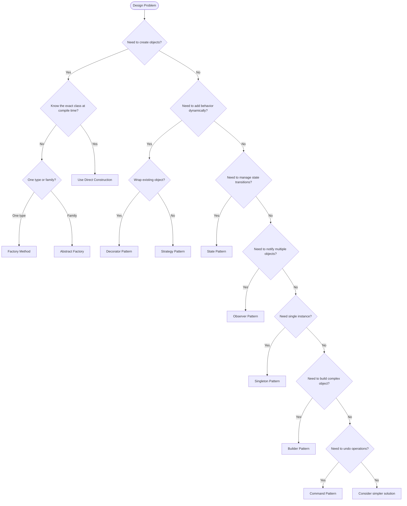

# LLD Interview Guide - The Ultimate Preparation Framework

> A comprehensive, battle-tested guide for acing Low Level Design interviews.
> Covers the step-by-step approach, common mistakes, design pattern selection,
> top 50 questions, anti-patterns, and quick reference cards.

---

## Table of Contents

1. [The LLD Interview Framework](#1-the-lld-interview-framework)
2. [Common Mistakes to Avoid](#2-common-mistakes-to-avoid)
3. [Design Pattern Selection Guide](#3-design-pattern-selection-guide)
4. [Top 50 LLD Interview Questions](#4-top-50-lld-interview-questions)
5. [Code Quality Checklist](#5-code-quality-checklist)
6. [Anti-Patterns Reference](#6-anti-patterns-reference)
7. [Quick Reference Cards](#7-quick-reference-cards)

---

## 1. The LLD Interview Framework

Every LLD interview follows a predictable structure. Mastering this framework turns an open-ended design problem into a methodical exercise.

### The 7-Step Process

```
+-------------------------------------------------------+
| Step 1: Clarify Requirements              (5 minutes)  |
| Step 2: Identify Core Objects/Entities    (5 minutes)  |
| Step 3: Define Relationships              (5 minutes)  |
| Step 4: Draw Class Diagram               (10 minutes)  |
| Step 5: Write Key Methods/Interfaces     (10 minutes)  |
| Step 6: Apply Design Patterns             (5 minutes)  |
| Step 7: Discuss Trade-offs & Edge Cases   (5 minutes)  |
+-------------------------------------------------------+
                   Total: ~45 minutes
```

---

### Step 1: Clarify Requirements (5 minutes)

**Goal**: Eliminate ambiguity. Define the scope. Do NOT start designing before this step.

**What to ask**:
- What are the core use cases? (list 5-8)
- What is the scale? (single machine vs distributed)
- Who are the actors? (user types: admin, guest, member)
- What are the constraints? (real-time, concurrent users, data volume)
- What is NOT in scope? (helps you avoid over-engineering)

**Template**:
```
"Before I start designing, let me clarify a few things..."
- "Should we support [feature X] or is that out of scope?"
- "How many concurrent users should we expect?"
- "Should the system handle [edge case Y]?"
- "Are there specific design patterns you'd like me to focus on?"
```

**Pro Tip**: Write down the requirements as a bulleted list on the whiteboard. Refer back to them as you design to show that your solution actually addresses the requirements.

**Example** (Parking Lot):
```
Requirements I've confirmed:
- Multiple floors, each with multiple spots
- 3 vehicle types: Motorcycle, Car, Truck
- Different spot sizes for each vehicle type
- Hourly billing with per-type pricing
- Entry/exit terminals with ticket dispensing
- NOT in scope: reservations, valet, EV charging
```

---

### Step 2: Identify Core Objects/Entities (5 minutes)

**Goal**: Extract nouns from the requirements. These become your classes.

**Technique**: Read each requirement and underline the nouns.

| Requirement | Nouns (Candidates) |
|------------|-------------------|
| "Users browse products" | User, Product |
| "Add items to cart" | Cart, CartItem |
| "Place an order" | Order |
| "Make a payment" | Payment |

**Filtering criteria**:
- Does it have attributes? (If yes, it is a class)
- Does it have behavior? (If yes, it is a class)
- Is it just a primitive value? (If yes, it is an attribute, not a class)

**Pro Tip**: Start with 5-8 core classes. You can always add more later. Resist the urge to model everything upfront.

---

### Step 3: Define Relationships (5 minutes)

**Goal**: Connect the objects. Determine cardinality and direction.

**Relationship Types**:

| Relationship | UML | Meaning | Example |
|-------------|-----|---------|---------|
| Association | `-->` | "uses" / "has-a" | Order --> Payment |
| Aggregation | `o-->` | "contains" (weak) | Department o--> Employee |
| Composition | `*-->` | "owns" (strong lifecycle) | Order *--> OrderItem |
| Inheritance | `<\|--` | "is-a" | CreditCard <\|-- Payment |
| Implementation | `<\|..` | "implements" | Sortable <\|.. ArrayList |
| Dependency | `..>` | "depends on" | Factory ..> Product |

**Cardinality**:
```
1    : exactly one
0..1 : zero or one (optional)
*    : zero or more
1..* : one or more
```

**Quick mental model**:
```
"A User HAS many Orders"       -> User 1 --> * Order
"An Order CONTAINS OrderItems"  -> Order 1 *--> * OrderItem (composition)
"A Payment IS-A CreditCard"     -> CreditCardPayment --|> Payment (inheritance)
```

---

### Step 4: Draw the Class Diagram (10 minutes)

**Goal**: Create a UML class diagram with classes, attributes, methods, and relationships.

**Template for each class**:
```
+-------------------+
|    ClassName       |
+-------------------+
| - attribute: Type  |
| # protected: Type  |
+-------------------+
| + publicMethod()   |
| - privateMethod()  |
+-------------------+
```

**Rules of thumb**:
1. Keep classes focused (Single Responsibility)
2. Use private fields with public getters (encapsulation)
3. Put the most important methods only (not every getter/setter)
4. Show relationships with arrows and cardinality
5. Mark abstract classes and interfaces clearly

**Common pitfall**: Do NOT draw every attribute and method. Focus on the 3-5 most important ones per class. The interviewer wants to see design thinking, not exhaustive typing.

---

### Step 5: Write Key Methods/Interfaces (10 minutes)

**Goal**: Write the signature and core logic of 2-3 critical methods.

**What to write**:
- The most complex algorithm (e.g., search, allocation, matching)
- Interface definitions (what the contract looks like)
- A key orchestration method (e.g., `placeOrder()`, `bookTicket()`)

**What NOT to write**:
- Simple getters/setters
- Constructors (unless complex)
- toString / equals / hashCode

**Example**: For a Parking Lot, write:
```python
def park_vehicle(self, vehicle: Vehicle) -> Optional[ParkingTicket]:
    """Core algorithm: find a spot, assign it, generate ticket."""
    spot = self._find_available_spot(vehicle.type)
    if not spot:
        raise ParkingFullException(f"No spot for {vehicle.type}")
    spot.assign(vehicle)
    return ParkingTicket(vehicle, spot, datetime.now())
```

---

### Step 6: Apply Design Patterns (5 minutes)

**Goal**: Identify 2-3 design patterns that naturally fit your design.

**How to spot them**:

| Signal in Requirements | Pattern |
|-----------------------|---------|
| "Multiple ways to do X" | Strategy |
| "Notify when Y changes" | Observer |
| "Create objects without specifying class" | Factory |
| "Object goes through states" | State |
| "Add behavior without modifying class" | Decorator |
| "Single global instance" | Singleton |
| "Complex object construction" | Builder |
| "Undo operations" | Command |
| "Access elements sequentially" | Iterator |

**How to present**: Name the pattern, explain WHY you chose it, and show WHERE it fits in your diagram.

```
"I'm using the Strategy pattern for payment processing because
we need to support multiple payment methods (Credit Card, PayPal, UPI)
and the algorithm differs for each. This keeps the Order class clean
and makes adding new payment methods trivial."
```

---

### Step 7: Discuss Trade-offs & Edge Cases (5 minutes)

**Goal**: Show senior-level thinking. Every design has trade-offs.

**Trade-off categories**:
- Simplicity vs Extensibility
- Performance vs Readability
- Consistency vs Availability (for distributed)
- Space vs Time complexity

**Edge cases to mention**:
- Concurrent access (thread safety)
- Empty/null inputs
- Maximum capacity reached
- Duplicate requests
- Failure scenarios (payment fails, network drops)

**Template**:
```
"One trade-off I made is [X]. I chose [approach A] over [approach B]
because [reason]. If requirements changed to need [Z], I would
reconsider and switch to [approach B]."
```

---

## 2. Common Mistakes to Avoid

### Mistake 1: Jumping to Code Immediately

**Bad**: "Let me start writing the classes..."

**Good**: "Let me first clarify the requirements and identify the core entities."

The interviewer wants to see your THOUGHT PROCESS, not your typing speed. Spend 10-15 minutes on design before writing any code.

---

### Mistake 2: Over-Engineering

**Bad**:
```python
class VehicleParkingSpotAllocationStrategyFactoryProvider:
    def create_strategy_factory(self, config: AllocationConfig) -> AbstractStrategyFactory:
        ...
```

**Good**:
```python
class ParkingLot:
    def find_spot(self, vehicle_type: VehicleType) -> Optional[ParkingSpot]:
        ...
```

Design for the current requirements, not hypothetical future ones. The interviewer will tell you if they want more complexity. YAGNI (You Ain't Gonna Need It) is your friend.

---

### Mistake 3: God Classes

**Bad**: A single `System` class with 30 methods doing everything.

```python
class ParkingSystem:
    def park_vehicle(self): ...
    def process_payment(self): ...
    def send_notification(self): ...
    def generate_report(self): ...
    def manage_employee(self): ...
    # 25 more methods...
```

**Good**: Split into focused classes, each with a single responsibility.

```python
class ParkingLot:       # Manages spots and vehicles
class PaymentService:   # Handles payments
class NotificationService:  # Sends alerts
```

---

### Mistake 4: Ignoring SOLID Principles

| Principle | Violation | Fix |
|-----------|-----------|-----|
| SRP | Order class handles payment, shipping, and email | Extract PaymentService, ShippingService |
| OCP | Adding new vehicle type requires modifying ParkingLot | Use VehicleType enum + strategy |
| LSP | Square extends Rectangle but breaks setWidth() | Use separate Shape subclasses |
| ISP | IWorker interface forces Robot to implement eat() | Split into IWorkable, IFeedable |
| DIP | ParkingLot creates MySQLDatabase directly | Inject IDatabase interface |

---

### Mistake 5: Not Clarifying Requirements

Never assume. If the problem says "design a parking lot," ask:
- How many floors?
- What vehicle types?
- Is it hourly or flat rate?
- Do we need reservations?
- Entry/exit terminals?

Assumptions you do not clarify will bite you when the interviewer asks "But what about X?"

---

### Mistake 6: Tight Coupling

**Bad**:
```python
class Order:
    def place(self):
        payment = CreditCardPayment()  # Hard-coded dependency
        payment.charge(self.total)
        email = GmailService()  # Another hard-coded dependency
        email.send(self.user.email, "Order placed")
```

**Good**:
```python
class Order:
    def place(self, payment: Payment, notifier: Notification):
        payment.charge(self.total)
        notifier.send(self.user.email, "Order placed")
```

Always depend on abstractions (interfaces), not concrete implementations. This is the Dependency Inversion Principle in action.

---

## 3. Design Pattern Selection Guide

### Decision Flowchart



### Pattern Cheat Sheet

| Pattern | One-Liner | When to Use |
|---------|-----------|-------------|
| **Singleton** | One instance to rule them all | Global config, connection pool, cache |
| **Factory Method** | Let subclass decide which class to instantiate | Payment types, notification channels |
| **Abstract Factory** | Family of related objects | UI themes (dark/light), cross-platform widgets |
| **Builder** | Step-by-step complex object construction | Query builders, meal combos, config objects |
| **Prototype** | Clone existing objects | Expensive-to-create objects, templates |
| **Adapter** | Square peg in round hole | Legacy system integration, API wrappers |
| **Bridge** | Separate abstraction from implementation | Shape + Color, Device + Remote |
| **Composite** | Tree structure of objects | File system, org chart, menu hierarchy |
| **Decorator** | Add toppings without changing pizza | Logging, compression, encryption wrappers |
| **Facade** | Simple interface to complex subsystem | Order placement (inventory + payment + shipping) |
| **Proxy** | Control access to an object | Lazy loading, access control, caching |
| **Chain of Responsibility** | Pass request along a chain | Middleware, approval workflows, logging |
| **Command** | Encapsulate request as object | Undo/redo, task queues, macros |
| **Iterator** | Sequential access to collection elements | Custom collections, paginated results |
| **Mediator** | Centralize complex communication | Chat room, air traffic control |
| **Memento** | Capture and restore state | Undo, checkpointing, game save |
| **Observer** | Publish-subscribe for state changes | Event systems, UI updates, notifications |
| **State** | Object behavior changes with state | Order lifecycle, vending machine, traffic light |
| **Strategy** | Swap algorithms at runtime | Sorting, payment, routing, pricing |
| **Template Method** | Skeleton algorithm, subclasses fill in steps | Game loop, document parsing, ETL pipeline |
| **Visitor** | Add operations to classes without modifying them | Tax calculation, serialization, code analysis |

---

### Patterns by LLD Problem

| Problem | Patterns Commonly Used |
|---------|----------------------|
| Parking Lot | Strategy, Factory, Observer, Singleton |
| Snake & Ladder | Strategy, Observer, Template Method |
| Chess | Strategy, Observer, Command, State |
| Elevator System | State, Observer, Strategy, Singleton |
| Library Management | Observer, Factory, Strategy |
| Hotel Booking | Strategy, Observer, State, Factory |
| Food Delivery | Strategy, Observer, State, Factory, Chain of Responsibility |
| Social Media | Observer, Factory, Strategy, Composite |
| ATM | State, Strategy, Chain of Responsibility |
| File System | Composite, Iterator, Observer |
| LRU Cache | Singleton, Strategy |
| Notification System | Observer, Strategy, Factory |
| Movie Ticket Booking | Strategy, Observer, State, Singleton |

---

## 4. Top 50 LLD Interview Questions

### Category 1: Game Design

| # | Problem | Key Entities | Key Patterns | Approach Hint |
|---|---------|-------------|-------------|---------------|
| 1 | **Chess** | Board, Piece (King, Queen, etc.), Player, Move | Strategy (move validation), Command (undo), Observer | Model each piece type with its own move strategy; Board validates legality |
| 2 | **Snake and Ladder** | Board, Player, Dice, Snake, Ladder | Strategy (dice), Observer, Template Method | Board maps cell -> destination; Game loop rolls + moves + checks |
| 3 | **Tic Tac Toe** | Board, Player, Cell, GameState | Strategy (AI opponent), State | 3x3 grid; check rows/cols/diagonals after each move |
| 4 | **Minesweeper** | Board, Cell, Mine | Observer, Strategy | Recursive reveal for empty cells; count adjacent mines |
| 5 | **Sudoku Solver** | Board, Cell, Solver | Strategy (solving algorithms), Backtracking | Constraint propagation + backtracking; validate rows/cols/boxes |
| 6 | **Card Game (Blackjack)** | Deck, Card, Hand, Player, Dealer | Strategy (player actions), State (game phases) | Deck deals cards; compare hand values; bust/stand logic |
| 7 | **Ludo / Parcheesi** | Board, Player, Piece, Dice | State (piece states), Strategy | Pieces have states: HOME, ACTIVE, FINISHED; safe zones |
| 8 | **Battleship** | Board, Ship, Cell, Player | Strategy, Observer | Two boards per player; track hits and misses |

### Category 2: Booking Systems

| # | Problem | Key Entities | Key Patterns | Approach Hint |
|---|---------|-------------|-------------|---------------|
| 9 | **Movie Ticket Booking** | Movie, Theater, Screen, Seat, Show, Booking | Strategy (pricing), State (seat), Observer | Seat states: AVAILABLE, LOCKED, BOOKED; lock during payment |
| 10 | **Hotel Booking** | Hotel, Room, Guest, Reservation, Payment | State (room), Strategy (pricing), Factory (room types) | Room availability by date range; overbooking handling |
| 11 | **Flight Booking** | Flight, Seat, Passenger, Booking, Airline | Strategy (pricing), State (booking), Observer | Seat map per flight; class-based pricing; waitlist |
| 12 | **Restaurant Reservation** | Restaurant, Table, TimeSlot, Reservation | Strategy (table assignment), Observer | Tables have capacity; time-slot based availability |
| 13 | **Meeting Room Scheduler** | Room, Meeting, TimeSlot, User | Strategy (room selection), Observer | Conflict detection; recurring meetings; room capacity |
| 14 | **Cab Booking (Uber/Ola)** | Ride, Driver, Passenger, Location, Trip | Strategy (pricing/matching), Observer, State | Match nearest driver; surge pricing; trip lifecycle |
| 15 | **Event Ticket System** | Event, Venue, Ticket, Seat, Attendee | Strategy, State, Factory | Tiered pricing; seat categories; bulk booking |

### Category 3: Management Systems

| # | Problem | Key Entities | Key Patterns | Approach Hint |
|---|---------|-------------|-------------|---------------|
| 16 | **Library Management** | Book, Member, Librarian, Loan, Fine | Observer (due dates), Strategy (fine calculation) | Track copies; loan period; fine on overdue |
| 17 | **Parking Lot** | ParkingLot, Floor, Spot, Vehicle, Ticket | Strategy (spot allocation), Factory (vehicle types), Observer | Multi-floor; spot types match vehicle types; hourly billing |
| 18 | **Inventory Management** | Product, Warehouse, Stock, Order, Supplier | Observer (low stock), Strategy (reorder) | Track quantities; reorder thresholds; multi-warehouse |
| 19 | **Hospital Management** | Patient, Doctor, Appointment, Ward, Prescription | Strategy (scheduling), State (appointment), Observer | Doctor availability; appointment booking; prescription workflow |
| 20 | **School/University** | Student, Teacher, Course, Grade, Schedule | Observer, Strategy (grading), Composite (departments) | Enrollment; prerequisite checking; GPA calculation |
| 21 | **Task Manager (Jira-like)** | Task, Sprint, User, Board, Comment | State (task lifecycle), Observer, Composite | Kanban board; task states: TODO, IN_PROGRESS, DONE |
| 22 | **Employee Management** | Employee, Department, PayRoll, Leave, Manager | Composite (org hierarchy), Strategy (pay calculation) | Org tree; different pay strategies for hourly/salaried |
| 23 | **Vending Machine** | Machine, Product, Slot, Payment, Display | State (machine states), Strategy (payment) | States: IDLE, SELECTING, PAYING, DISPENSING; coin handling |

### Category 4: Social & Communication

| # | Problem | Key Entities | Key Patterns | Approach Hint |
|---|---------|-------------|-------------|---------------|
| 24 | **Chat Application** | User, Message, Conversation, Group | Observer, Mediator, Strategy (encryption) | 1:1 and group chats; message delivery status |
| 25 | **Social Media (Facebook)** | User, Post, Comment, Like, FriendRequest, Feed | Observer, Strategy (feed ranking), Composite | News feed generation; friend graph; privacy settings |
| 26 | **Twitter/Microblogging** | User, Tweet, Hashtag, Follow, Timeline | Observer, Strategy (timeline algo), Iterator | Follow graph; fan-out on write vs read; trending |
| 27 | **Notification System** | Notification, Channel, Template, User, Preference | Strategy (channel), Factory, Observer | Multi-channel: email, SMS, push; user preferences; rate limiting |
| 28 | **Email Client** | Email, Folder, Contact, Attachment, Filter | Composite (folders), Strategy (filtering), Observer | Inbox, Sent, Trash; filter rules; search |
| 29 | **Stack Overflow / Q&A** | Question, Answer, User, Vote, Tag, Comment | Observer, Strategy (ranking), Composite | Voting; accepted answer; reputation system |
| 30 | **Online Forum / Reddit** | Post, Subreddit, Comment, Vote, User, Moderator | Composite (comment tree), Observer, Strategy | Nested comments; karma; moderation actions |

### Category 5: Caching & Storage

| # | Problem | Key Entities | Key Patterns | Approach Hint |
|---|---------|-------------|-------------|---------------|
| 31 | **LRU Cache** | Cache, Node, DoublyLinkedList | Singleton, Strategy (eviction) | HashMap + DLL; O(1) get/put; evict least recently used |
| 32 | **File System** | File, Directory, Path, Permission | Composite, Iterator, Observer | Tree structure; path resolution; read/write/execute permissions |
| 33 | **Key-Value Store** | Store, Entry, TTL, Shard | Strategy (eviction), Observer, Singleton | Hash-based storage; TTL expiration; optional sharding |
| 34 | **Database Connection Pool** | Pool, Connection, Config | Singleton, Factory, Strategy (allocation) | Max/min connections; checkout/checkin; timeout handling |
| 35 | **Object Pool** | Pool, Reusable, PoolConfig | Singleton, Factory | Generic reusable resource pool; thread-safe checkout |
| 36 | **Rate Limiter** | Limiter, Window, Token, Rule | Strategy (algorithm), Singleton | Token bucket / sliding window / fixed window algorithms |

### Category 6: Payment & Financial

| # | Problem | Key Entities | Key Patterns | Approach Hint |
|---|---------|-------------|-------------|---------------|
| 37 | **ATM System** | ATM, Account, Card, Transaction, CashDispenser | State (ATM states), Chain of Responsibility (cash dispensing) | States: IDLE, CARD_INSERTED, PIN_VERIFIED; denomination selection |
| 38 | **Digital Wallet** | Wallet, User, Transaction, Balance, PaymentMethod | Strategy (payment), Observer, State | Balance management; transaction history; top-up + pay |
| 39 | **Splitwise / Expense Sharing** | User, Group, Expense, Split, Balance | Strategy (split type), Observer | Equal/exact/percentage splits; simplify debts algorithm |
| 40 | **Stock Trading System** | Stock, Order, Portfolio, Trader, Exchange | Strategy (order matching), Observer, State | Limit/market orders; order book; price matching engine |

### Category 7: E-commerce & Delivery

| # | Problem | Key Entities | Key Patterns | Approach Hint |
|---|---------|-------------|-------------|---------------|
| 41 | **Online Shopping (Amazon)** | User, Product, Cart, Order, Payment | Strategy, Factory, Observer, State, Decorator | Full cart-to-order pipeline; order lifecycle states |
| 42 | **Food Delivery (Swiggy)** | Restaurant, MenuItem, Order, DeliveryAgent, Customer | Strategy (assignment), Observer, State | Restaurant menu; order tracking; agent assignment |
| 43 | **Auction System (eBay)** | Auction, Item, Bid, User, Timer | Observer, State, Strategy | Timed auctions; bid validation; auto-extend on last-minute bids |
| 44 | **Coupon/Discount System** | Coupon, Cart, Rule, Discount | Strategy (discount calculation), Chain of Responsibility | Stackable vs exclusive; min-purchase rules; expiry |

### Category 8: Infrastructure & Utility

| # | Problem | Key Entities | Key Patterns | Approach Hint |
|---|---------|-------------|-------------|---------------|
| 45 | **Elevator System** | Elevator, Floor, Request, Controller | State, Strategy (scheduling), Observer | Direction state; request queue; nearest-elevator dispatch |
| 46 | **Traffic Signal System** | Signal, Intersection, Timer, Sensor | State, Observer, Strategy | Cycle through states: RED, YELLOW, GREEN; sensor-triggered |
| 47 | **Logger / Logging Framework** | Logger, Handler, Formatter, Level | Singleton, Chain of Responsibility, Strategy | Log levels; multiple handlers (file, console, remote) |
| 48 | **Pub-Sub Message Queue** | Topic, Publisher, Subscriber, Message, Broker | Observer, Strategy (delivery), Factory | Topic-based routing; at-least-once / at-most-once delivery |
| 49 | **URL Shortener** | URL, ShortCode, User, Analytics | Factory, Strategy (hashing) | Base62 encoding; collision handling; click analytics |
| 50 | **Cron Job Scheduler** | Job, Schedule, Trigger, Executor | Command, Strategy (scheduling), Observer | Cron expression parsing; thread pool execution; retry logic |

---

## 5. Code Quality Checklist

Use this checklist before presenting your solution:

### Naming Conventions
- [ ] Class names are **PascalCase** nouns: `ShoppingCart`, `PaymentService`
- [ ] Method names are **camelCase** (Java) or **snake_case** (Python) verbs: `placeOrder()`, `calculate_total()`
- [ ] Variables are descriptive: `total_amount` not `ta`, `current_player` not `cp`
- [ ] Constants are **UPPER_SNAKE_CASE**: `MAX_PLAYERS`, `DEFAULT_TIMEOUT`
- [ ] Boolean variables/methods read as questions: `is_empty()`, `has_won`, `can_park()`
- [ ] Avoid abbreviations: `customer` not `cust`, `repository` not `repo` (in interviews)

### SOLID Compliance Check
- [ ] **S** - Each class has ONE reason to change
- [ ] **O** - Can add new behavior WITHOUT modifying existing classes
- [ ] **L** - Subclasses can replace parent classes without breaking code
- [ ] **I** - No class is forced to implement methods it does not use
- [ ] **D** - High-level modules depend on abstractions, not concrete classes

### Pattern Appropriateness
- [ ] Each pattern SOLVES a real problem (not applied for show)
- [ ] Pattern is named and justified when presenting
- [ ] No more than 3-4 patterns per design (avoid pattern soup)
- [ ] Pattern does not add unnecessary complexity

### Error Handling
- [ ] Validate inputs at public method boundaries
- [ ] Throw meaningful exceptions with context: `ValueError("Cannot park: lot is full")`
- [ ] Handle edge cases: empty collections, null references, boundary values
- [ ] Do NOT catch generic `Exception` unless re-raising

### Thread Safety Considerations
- [ ] Identify shared mutable state (inventory, available seats, account balance)
- [ ] Mention synchronization strategy: locks, atomic operations, concurrent collections
- [ ] Consider race conditions in booking/payment flows
- [ ] Mention optimistic vs pessimistic locking trade-offs

### General Code Quality
- [ ] Methods are under 20 lines (ideally under 10)
- [ ] No magic numbers: use named constants
- [ ] No deep nesting (max 2-3 levels)
- [ ] Return early to avoid else blocks
- [ ] Use enums for fixed sets of values (not strings)

---

## 6. Anti-Patterns Reference

These are designs you should recognize and avoid.

### God Object / God Class
**What**: One class that knows too much and does too much.
**Sign**: A class with 20+ methods spanning multiple responsibilities.
**Fix**: Split into focused classes following SRP.
```
BAD:  SystemManager (handles users, orders, payments, notifications, reports)
GOOD: UserService, OrderService, PaymentService, NotificationService
```

### Lava Flow
**What**: Dead code that nobody dares to remove because "it might be needed."
**Sign**: Commented-out code blocks, unused imports, unreachable branches.
**Fix**: Delete dead code. Version control exists for a reason.

### Golden Hammer
**What**: Using a familiar pattern/technology for every problem.
**Sign**: "Let's use Observer pattern here too!" (even when not needed)
**Fix**: Choose the right tool for the job. Not every nail needs a hammer.

### Spaghetti Code
**What**: Code with no clear structure; tangled control flow.
**Sign**: Methods calling methods calling methods with no clear hierarchy.
**Fix**: Refactor into layers: Controller -> Service -> Repository.

### Poltergeist / Gypsy Wagon
**What**: Classes that exist only to invoke methods on other classes with no real responsibility.
**Sign**: A class with one method that just delegates to another class.
**Fix**: Remove the intermediary; call the target directly.

### Copy-Paste Programming
**What**: Duplicating code instead of abstracting common logic.
**Sign**: Multiple methods/classes with near-identical code.
**Fix**: Extract shared logic into a base class, utility method, or template.

### Circular Dependency
**What**: Class A depends on B, and B depends on A.
**Sign**: Import cycles; cannot instantiate one without the other.
**Fix**: Introduce an interface/abstraction to break the cycle.

### Premature Optimization
**What**: Optimizing code before understanding the bottleneck.
**Sign**: Complex caching, pooling, or batching for code that runs once.
**Fix**: Make it work, make it right, THEN make it fast. Profile first.

### Feature Envy
**What**: A method that uses more data from another class than its own.
**Sign**: `order.getUser().getAddress().getCity()` (Law of Demeter violation)
**Fix**: Move the method to the class whose data it uses most.

### Swiss Army Knife / Interface Bloat
**What**: An interface with too many methods, forcing implementers to stub unused ones.
**Sign**: Classes implement an interface but throw `NotImplementedError` for half the methods.
**Fix**: Split into smaller, focused interfaces (Interface Segregation Principle).

---

## 7. Quick Reference Cards

### Card 1: Design Patterns at a Glance

```
CREATIONAL (object creation)
+------------------+--------------------------------------------+
| Singleton        | Ensure one instance globally               |
| Factory Method   | Subclass decides what to create            |
| Abstract Factory | Family of related objects                  |
| Builder          | Step-by-step complex construction           |
| Prototype        | Clone existing objects                     |
+------------------+--------------------------------------------+

STRUCTURAL (object composition)
+------------------+--------------------------------------------+
| Adapter          | Make incompatible interfaces work together |
| Bridge           | Separate abstraction from implementation   |
| Composite        | Tree structures (part-whole hierarchy)     |
| Decorator        | Add behavior dynamically (wrapping)        |
| Facade           | Simplified interface to complex subsystem  |
| Proxy            | Control access to an object                |
| Flyweight        | Share common state among many objects      |
+------------------+--------------------------------------------+

BEHAVIORAL (object interaction)
+------------------+--------------------------------------------+
| Observer         | Publish-subscribe notifications            |
| Strategy         | Swap algorithms at runtime                 |
| State            | Behavior changes with internal state       |
| Command          | Encapsulate action as object (undo/redo)   |
| Template Method  | Define skeleton, subclass fills in steps   |
| Chain of Resp.   | Pass request along handler chain           |
| Iterator         | Sequential access without exposing internals|
| Mediator         | Centralized communication hub              |
| Memento          | Capture and restore object state           |
| Visitor          | Add operations without modifying classes   |
| Interpreter      | Grammar/language evaluation                |
+------------------+--------------------------------------------+
```

### Card 2: SOLID Principles at a Glance

```
+---+---------------------------+----------------------------------------+
| S | Single Responsibility     | A class should have one reason to      |
|   |                           | change. Split classes that do too much. |
+---+---------------------------+----------------------------------------+
| O | Open/Closed               | Open for extension, closed for         |
|   |                           | modification. Use interfaces/abstract.  |
+---+---------------------------+----------------------------------------+
| L | Liskov Substitution       | Subtypes must be substitutable for     |
|   |                           | their base types without breaking code. |
+---+---------------------------+----------------------------------------+
| I | Interface Segregation     | Clients should not depend on methods   |
|   |                           | they do not use. Keep interfaces small. |
+---+---------------------------+----------------------------------------+
| D | Dependency Inversion      | Depend on abstractions, not concrete   |
|   |                           | classes. Inject dependencies.           |
+---+---------------------------+----------------------------------------+
```

### Card 3: UML Notation at a Glance

```
CLASS NOTATION:
+-------------------+
|   <<interface>>   |    (stereotype)
|    ClassName       |
+-------------------+
| - private: Type   |    (-) private
| # protected: Type |    (#) protected
| + public: Type    |    (+) public
| ~ package: Type   |    (~) package
+-------------------+
| + method(): Type  |
| + static()$       |    ($) static
| + abstract()*     |    (*) abstract/italic
+-------------------+

RELATIONSHIPS:
─────────>          Association (uses)
────────*>          Composition (owns, lifecycle tied)
────────o>          Aggregation (has, independent lifecycle)
- - - - ->          Dependency (uses temporarily)
─────────|>         Inheritance (is-a)
- - - - -|>        Implementation (implements interface)

MULTIPLICITY:
1                   Exactly one
0..1                Zero or one
*                   Zero or more
1..*                One or more
3..7                Between 3 and 7
```

### Card 4: Complexity Cheat Sheet

```
COMMON DATA STRUCTURE OPERATIONS:
+---------------------+--------+--------+--------+--------+
| Structure           | Insert | Delete | Search | Access |
+---------------------+--------+--------+--------+--------+
| Array               | O(n)   | O(n)   | O(n)   | O(1)   |
| Linked List         | O(1)*  | O(1)*  | O(n)   | O(n)   |
| Hash Map            | O(1)   | O(1)   | O(1)   | O(1)   |
| Binary Search Tree  | O(lgn) | O(lgn) | O(lgn) | O(lgn) |
| Heap (Priority Q)   | O(lgn) | O(lgn) | O(n)   | O(1)*  |
| Stack/Queue         | O(1)   | O(1)   | O(n)   | O(1)*  |
+---------------------+--------+--------+--------+--------+
  * = amortized or specific element (top/front)

COMMON ALGORITHM COMPLEXITIES:
+----------------------+---------------+
| Linear search        | O(n)          |
| Binary search        | O(log n)      |
| Sorting (comparison) | O(n log n)    |
| Hash table lookup    | O(1) average  |
| BFS/DFS graph        | O(V + E)      |
| Dijkstra             | O(E log V)    |
+----------------------+---------------+

QUICK RULES:
- If you need O(1) lookup   -> Use HashMap
- If you need sorted order  -> Use TreeMap / sorted list
- If you need FIFO          -> Use Queue
- If you need LIFO          -> Use Stack
- If you need min/max fast  -> Use Heap
- If you need key-value     -> Use HashMap
- If you need uniqueness    -> Use HashSet
```

### Card 5: Interview Communication Templates

**Opening**:
```
"Let me start by clarifying the requirements to make sure
we're on the same page..."
```

**Transitioning to design**:
```
"Based on these requirements, I've identified the following
core entities: [list]. Let me draw the class diagram..."
```

**Explaining a pattern choice**:
```
"I'm using [Pattern Name] here because [specific reason].
This gives us [benefit] and makes it easy to [extension point]."
```

**Discussing trade-offs**:
```
"One trade-off to note: I chose [approach] for simplicity,
but if we needed [different requirement], we could switch to
[alternative approach]."
```

**Wrapping up**:
```
"To summarize, the key design decisions are:
1. [Decision 1] because [reason]
2. [Decision 2] because [reason]
3. [Decision 3] because [reason]
If you'd like, I can dive deeper into any of these areas."
```

---

## Appendix: 15-Minute Speed Template

When time is extremely limited, use this compressed approach:

```
[2 min] Requirements: List 5 bullet points
[3 min] Entities: Identify 5-7 classes with 2-3 key attributes each
[5 min] Class Diagram: Draw classes + relationships + cardinality
[3 min] Key Method: Write ONE critical algorithm/method
[2 min] Patterns: Name 2 patterns with 1-sentence justification each
```

**Minimum viable output for any LLD interview**:
1. Clear requirements list
2. Class diagram with relationships
3. One working method with actual logic
4. Two named design patterns with justification

This gets you through even the most time-pressured interviews.

---

## Appendix: Recommended Practice Order

If you are starting from scratch, practice in this order to build incrementally:

| Week | Problems | Skills Learned |
|------|---------|---------------|
| 1 | Parking Lot, Tic Tac Toe | Class modeling, basic patterns (Strategy, Singleton) |
| 2 | Snake & Ladder, Library Management | Observer, Template Method, game loops |
| 3 | Movie Ticket Booking, Elevator | State pattern, booking flows, concurrency |
| 4 | Online Shopping, Food Delivery | Full system: multiple patterns, order lifecycle |
| 5 | LRU Cache, Rate Limiter, Logger | Data structures, algorithm-heavy designs |
| 6 | Chess, Social Media, Chat App | Complex relationships, composite, mediator |
| 7 | ATM, Splitwise, Cron Scheduler | Financial flows, command pattern, scheduling |
| 8 | Mock interviews (timed practice) | Speed, communication, handling curveballs |

---

## Final Words

The LLD interview is not about writing perfect production code. It is about demonstrating:

1. **Structured thinking**: You follow a clear process, not random code.
2. **Object-oriented design skills**: Classes are focused, relationships are clear.
3. **Pattern awareness**: You know when and why to use patterns.
4. **Trade-off analysis**: You can reason about alternatives.
5. **Communication**: You explain your decisions clearly.

The best LLD candidates write less code but design more. Master the framework, practice 15-20 problems, and you will walk into any LLD interview with confidence.
