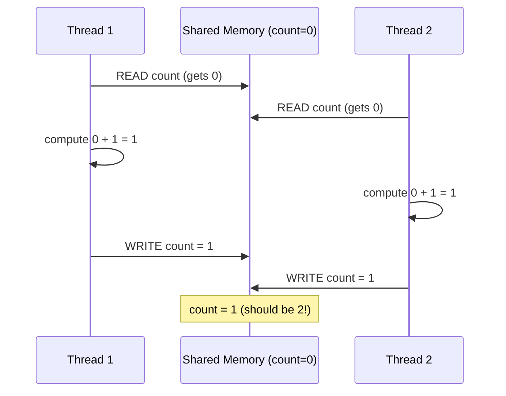
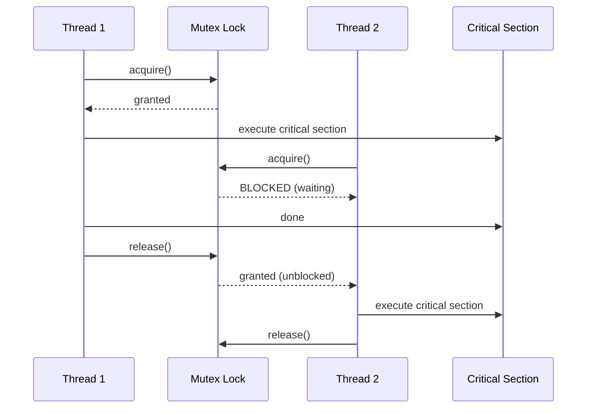
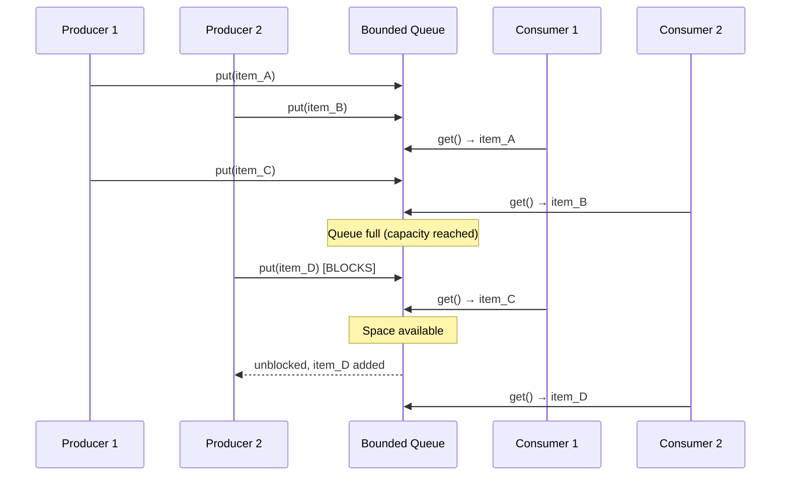
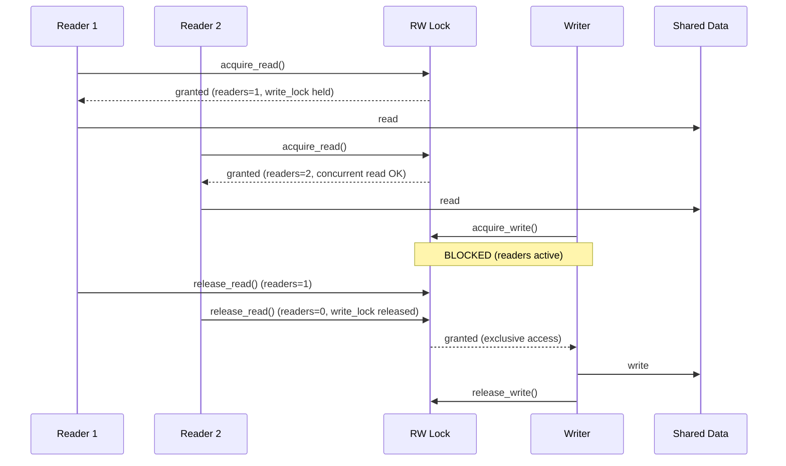
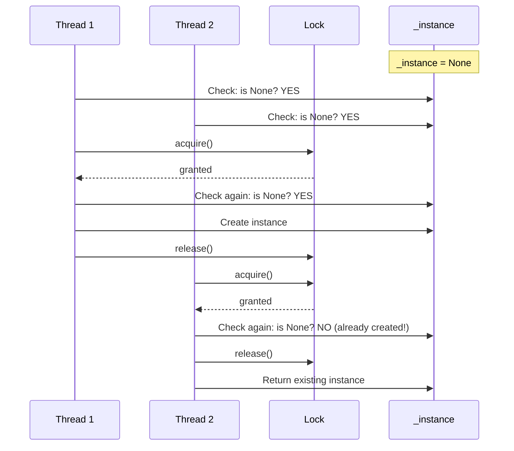
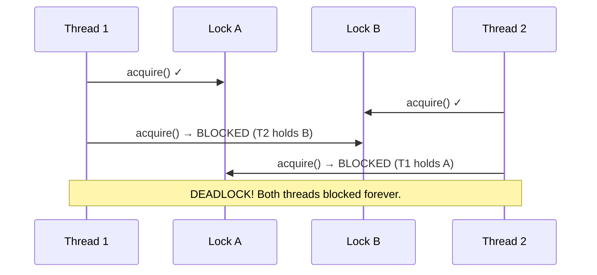

# Concurrency Patterns for LLD Interviews

## Table of Contents
- [Introduction](#introduction)
- [1. Thread Safety Basics](#1-thread-safety-basics)
- [2. Mutex / Lock Patterns](#2-mutex--lock-patterns)
- [3. Producer-Consumer Pattern](#3-producer-consumer-pattern)
- [4. Reader-Writer Pattern](#4-reader-writer-pattern)
- [5. Thread Pool Pattern](#5-thread-pool-pattern)
- [6. Singleton Thread Safety](#6-singleton-thread-safety)
- [7. Double-Checked Locking](#7-double-checked-locking)
- [8. Immutable Objects for Thread Safety](#8-immutable-objects-for-thread-safety)
- [9. Concurrent Data Structures](#9-concurrent-data-structures)
- [10. Deadlock, Livelock, Starvation](#10-deadlock-livelock-starvation)

---

## Introduction

Concurrency is essential for building scalable systems. In LLD interviews, you are often asked to make your designs **thread-safe** -- especially for problems like Parking Lot, LRU Cache, Rate Limiter, and Logging frameworks.

This guide covers the concurrency patterns you need, with Python examples. The concepts apply to any language.

**Key Python concurrency modules**:
- `threading` -- Thread-based parallelism (most relevant for LLD interviews)
- `multiprocessing` -- Process-based parallelism (bypasses GIL)
- `asyncio` -- Async I/O (cooperative concurrency)
- `concurrent.futures` -- High-level thread/process pool API

---

## 1. Thread Safety Basics

### What Is Thread Safety?

A piece of code is **thread-safe** if it functions correctly when accessed from multiple threads simultaneously, without requiring external synchronization.

### Race Condition

A race condition occurs when the outcome depends on the unpredictable order of thread execution.

```python
import threading

# UNSAFE: Race condition on shared counter
class UnsafeCounter:
    def __init__(self):
        self.count = 0

    def increment(self):
        # This is NOT atomic! It is: read -> modify -> write
        self.count += 1  # Three operations, not one


counter = UnsafeCounter()

def worker():
    for _ in range(100_000):
        counter.increment()

threads = [threading.Thread(target=worker) for _ in range(5)]
for t in threads:
    t.start()
for t in threads:
    t.join()

print(counter.count)  # Expected: 500,000. Actual: less (e.g., 387,421)
```

### Why It Fails: The Interleaving Problem



### Critical Section

A **critical section** is a portion of code that accesses shared resources and must not be executed by more than one thread at a time.

```python
# SAFE: Protected critical section
class SafeCounter:
    def __init__(self):
        self._count = 0
        self._lock = threading.Lock()

    def increment(self):
        with self._lock:  # Only one thread at a time
            self._count += 1

    @property
    def count(self) -> int:
        with self._lock:
            return self._count
```

---

## 2. Mutex / Lock Patterns

### Basic Lock (Mutex)

A **mutex** (mutual exclusion) ensures only one thread can access a critical section at a time.

```python
import threading

class BankAccount:
    def __init__(self, balance: float):
        self._balance = balance
        self._lock = threading.Lock()

    def withdraw(self, amount: float) -> bool:
        with self._lock:
            if self._balance >= amount:
                self._balance -= amount
                return True
            return False

    def deposit(self, amount: float) -> None:
        with self._lock:
            self._balance += amount

    @property
    def balance(self) -> float:
        with self._lock:
            return self._balance
```

### Reentrant Lock (RLock)

A **reentrant lock** can be acquired multiple times by the **same thread**. Useful when a method that holds a lock calls another method that also needs the lock.

```python
import threading

class FileManager:
    def __init__(self):
        self._lock = threading.RLock()  # Reentrant!
        self._open_files: dict[str, str] = {}

    def open_file(self, path: str) -> str:
        with self._lock:
            if path not in self._open_files:
                self._open_files[path] = f"handle:{path}"
            return self._open_files[path]

    def read_file(self, path: str) -> str:
        with self._lock:
            handle = self.open_file(path)  # Calls method that also acquires _lock
            return f"content of {handle}"  # RLock allows this; Lock would deadlock
```

### Lock Flow Diagram



### Condition Variable

Condition variables let threads **wait** for a specific condition and **notify** other threads when the condition changes.

```python
import threading

class BoundedBuffer:
    def __init__(self, capacity: int):
        self._buffer: list = []
        self._capacity = capacity
        self._lock = threading.Lock()
        self._not_full = threading.Condition(self._lock)
        self._not_empty = threading.Condition(self._lock)

    def put(self, item) -> None:
        with self._not_full:
            while len(self._buffer) >= self._capacity:
                self._not_full.wait()  # Release lock and wait
            self._buffer.append(item)
            self._not_empty.notify()  # Wake up a consumer

    def get(self):
        with self._not_empty:
            while len(self._buffer) == 0:
                self._not_empty.wait()  # Release lock and wait
            item = self._buffer.pop(0)
            self._not_full.notify()  # Wake up a producer
            return item
```

### Semaphore

A semaphore allows a **limited number** of threads to access a resource simultaneously.

```python
import threading
import time

class ConnectionPool:
    def __init__(self, max_connections: int):
        self._semaphore = threading.Semaphore(max_connections)
        self._connections: list = [f"conn-{i}" for i in range(max_connections)]
        self._lock = threading.Lock()

    def acquire_connection(self) -> str:
        self._semaphore.acquire()  # Block if all connections in use
        with self._lock:
            return self._connections.pop()

    def release_connection(self, conn: str) -> None:
        with self._lock:
            self._connections.append(conn)
        self._semaphore.release()  # Allow another thread to acquire
```

---

## 3. Producer-Consumer Pattern

The most common concurrency pattern. Producers generate data, consumers process it, and a **shared buffer** decouples them.

### Implementation with Queue

```python
import threading
import queue
import time
import random

class ProducerConsumer:
    def __init__(self, buffer_size: int = 10):
        self._queue: queue.Queue = queue.Queue(maxsize=buffer_size)
        self._shutdown = threading.Event()

    def producer(self, producer_id: int) -> None:
        while not self._shutdown.is_set():
            item = random.randint(1, 100)
            try:
                self._queue.put(item, timeout=1.0)
                print(f"Producer-{producer_id} produced: {item}")
            except queue.Full:
                continue  # Buffer full, retry

    def consumer(self, consumer_id: int) -> None:
        while not self._shutdown.is_set():
            try:
                item = self._queue.get(timeout=1.0)
                print(f"Consumer-{consumer_id} consumed: {item}")
                self._queue.task_done()
            except queue.Empty:
                continue  # Buffer empty, retry

    def run(self, num_producers: int = 2, num_consumers: int = 3, duration: float = 5.0):
        threads = []
        for i in range(num_producers):
            t = threading.Thread(target=self.producer, args=(i,), daemon=True)
            threads.append(t)
            t.start()

        for i in range(num_consumers):
            t = threading.Thread(target=self.consumer, args=(i,), daemon=True)
            threads.append(t)
            t.start()

        time.sleep(duration)
        self._shutdown.set()

        for t in threads:
            t.join(timeout=2.0)
```

### Producer-Consumer Flow



### Real-World LLD Applications

- **Logging Framework**: Log producers (application threads) write to a queue; a single consumer writes to disk
- **Task Scheduler**: Tasks are produced by users, consumed by worker threads
- **Message Queue**: Publishers produce messages, subscribers consume them

---

## 4. Reader-Writer Pattern

Multiple threads can **read** simultaneously, but **writing** requires exclusive access. This optimizes for read-heavy workloads.

### Implementation

```python
import threading

class ReadWriteLock:
    """Multiple readers OR one writer at a time."""

    def __init__(self):
        self._readers = 0
        self._readers_lock = threading.Lock()
        self._write_lock = threading.Lock()

    def acquire_read(self):
        with self._readers_lock:
            self._readers += 1
            if self._readers == 1:
                self._write_lock.acquire()  # First reader blocks writers

    def release_read(self):
        with self._readers_lock:
            self._readers -= 1
            if self._readers == 0:
                self._write_lock.release()  # Last reader unblocks writers

    def acquire_write(self):
        self._write_lock.acquire()

    def release_write(self):
        self._write_lock.release()


class ThreadSafeCache:
    """A cache that allows concurrent reads but exclusive writes."""

    def __init__(self):
        self._data: dict = {}
        self._rw_lock = ReadWriteLock()

    def get(self, key: str):
        self._rw_lock.acquire_read()
        try:
            return self._data.get(key)
        finally:
            self._rw_lock.release_read()

    def put(self, key: str, value) -> None:
        self._rw_lock.acquire_write()
        try:
            self._data[key] = value
        finally:
            self._rw_lock.release_write()

    def delete(self, key: str) -> None:
        self._rw_lock.acquire_write()
        try:
            self._data.pop(key, None)
        finally:
            self._rw_lock.release_write()
```

### Reader-Writer Flow



### Variant: Writer-Preferred Lock

The basic implementation above is **reader-preferred** (writers can starve). A writer-preferred version ensures writers get priority:

```python
class WriterPreferredRWLock:
    def __init__(self):
        self._readers = 0
        self._writers_waiting = 0
        self._lock = threading.Lock()
        self._readers_ok = threading.Condition(self._lock)
        self._writers_ok = threading.Condition(self._lock)
        self._writing = False

    def acquire_read(self):
        with self._lock:
            while self._writing or self._writers_waiting > 0:
                self._readers_ok.wait()  # Wait if writers are waiting
            self._readers += 1

    def release_read(self):
        with self._lock:
            self._readers -= 1
            if self._readers == 0:
                self._writers_ok.notify()

    def acquire_write(self):
        with self._lock:
            self._writers_waiting += 1
            while self._writing or self._readers > 0:
                self._writers_ok.wait()
            self._writers_waiting -= 1
            self._writing = True

    def release_write(self):
        with self._lock:
            self._writing = False
            self._readers_ok.notify_all()
            self._writers_ok.notify()
```

---

## 5. Thread Pool Pattern

Instead of creating a new thread for every task (expensive), maintain a **pool of reusable threads** that pick up tasks from a queue.

### Implementation

```python
import threading
import queue
from typing import Callable, Any

class ThreadPool:
    def __init__(self, num_workers: int):
        self._task_queue: queue.Queue = queue.Queue()
        self._workers: list[threading.Thread] = []
        self._shutdown = False

        for i in range(num_workers):
            worker = threading.Thread(target=self._worker_loop, name=f"Worker-{i}", daemon=True)
            self._workers.append(worker)
            worker.start()

    def _worker_loop(self):
        while True:
            task = self._task_queue.get()
            if task is None:  # Poison pill
                break
            func, args, kwargs, future = task
            try:
                result = func(*args, **kwargs)
                future["result"] = result
                future["done"] = True
            except Exception as e:
                future["error"] = e
                future["done"] = True
            finally:
                self._task_queue.task_done()

    def submit(self, func: Callable, *args, **kwargs) -> dict:
        future = {"done": False, "result": None, "error": None}
        self._task_queue.put((func, args, kwargs, future))
        return future

    def shutdown(self, wait: bool = True):
        for _ in self._workers:
            self._task_queue.put(None)  # Send poison pills
        if wait:
            for worker in self._workers:
                worker.join()


# Usage
pool = ThreadPool(num_workers=4)

def process_order(order_id: int) -> str:
    return f"Order {order_id} processed"

futures = [pool.submit(process_order, i) for i in range(10)]
pool.shutdown(wait=True)
```

### Using Python's Built-in ThreadPoolExecutor

```python
from concurrent.futures import ThreadPoolExecutor, as_completed

def fetch_url(url: str) -> str:
    import urllib.request
    with urllib.request.urlopen(url) as response:
        return response.read().decode()

# Much simpler with the standard library
with ThreadPoolExecutor(max_workers=5) as executor:
    urls = ["https://example.com"] * 10
    futures = {executor.submit(fetch_url, url): url for url in urls}

    for future in as_completed(futures):
        url = futures[future]
        try:
            data = future.result()
            print(f"{url}: {len(data)} bytes")
        except Exception as e:
            print(f"{url}: error - {e}")
```

### Thread Pool Architecture

```
┌──────────────────────────────────────────────────┐
│                  Thread Pool                      │
│                                                   │
│  ┌────────────────────────────────────────────┐   │
│  │            Task Queue (Bounded)            │   │
│  │  [Task1] [Task2] [Task3] [Task4] ...       │   │
│  └────────────────┬───────────────────────────┘   │
│                   │                               │
│         ┌─────────┼─────────┐                     │
│         ▼         ▼         ▼                     │
│    ┌─────────┐┌─────────┐┌─────────┐              │
│    │Worker 1 ││Worker 2 ││Worker 3 │   ...        │
│    │(Thread) ││(Thread) ││(Thread) │              │
│    └─────────┘└─────────┘└─────────┘              │
│                                                   │
│    Workers pick tasks from queue, execute them,   │
│    and return to pick the next task.              │
└──────────────────────────────────────────────────┘
```

---

## 6. Singleton Thread Safety

The Singleton pattern is notoriously tricky to implement correctly in a multithreaded environment.

### Naive Singleton (NOT Thread-Safe)

```python
# UNSAFE: Two threads can both see _instance as None
class NaiveSingleton:
    _instance = None

    def __new__(cls):
        if cls._instance is None:       # Thread 1 checks: None
            # Thread 2 also checks: None (context switch happened)
            cls._instance = super().__new__(cls)  # Two instances created!
        return cls._instance
```

### Thread-Safe Singleton with Lock

```python
import threading

class ThreadSafeSingleton:
    _instance = None
    _lock = threading.Lock()

    def __new__(cls):
        with cls._lock:  # Every call acquires the lock (performance cost)
            if cls._instance is None:
                cls._instance = super().__new__(cls)
        return cls._instance
```

### Thread-Safe Singleton with Module-Level Instance (Pythonic)

Python's module import system is inherently thread-safe. The simplest approach:

```python
# singleton.py
class _DatabaseConnection:
    def __init__(self):
        self.connection = self._connect()

    def _connect(self):
        return "connected"

    def execute(self, query: str):
        return f"Executing: {query}"

# Module-level instance (created once on first import, thread-safe)
db = _DatabaseConnection()

# Usage in other files:
# from singleton import db
# db.execute("SELECT * FROM users")
```

### Thread-Safe Singleton with Metaclass

```python
import threading

class SingletonMeta(type):
    _instances = {}
    _lock = threading.Lock()

    def __call__(cls, *args, **kwargs):
        with cls._lock:
            if cls not in cls._instances:
                instance = super().__call__(*args, **kwargs)
                cls._instances[cls] = instance
        return cls._instances[cls]


class Logger(metaclass=SingletonMeta):
    def __init__(self):
        self._log_file = "app.log"

    def log(self, message: str):
        print(f"[LOG] {message}")

# Both get the same instance, thread-safe
logger1 = Logger()
logger2 = Logger()
assert logger1 is logger2
```

---

## 7. Double-Checked Locking

Double-checked locking reduces the overhead of acquiring a lock by first checking the condition **without the lock**, then verifying again **with the lock**.

### The Pattern

```python
import threading

class ExpensiveResource:
    _instance = None
    _lock = threading.Lock()

    @classmethod
    def get_instance(cls) -> "ExpensiveResource":
        if cls._instance is None:          # First check (no lock, fast path)
            with cls._lock:
                if cls._instance is None:  # Second check (with lock, safe)
                    cls._instance = cls()
        return cls._instance

    def __init__(self):
        # Expensive initialization
        self.data = self._load_data()

    def _load_data(self):
        return {"config": "loaded"}
```

### Why Double-Check?



Without the first check, every call would acquire the lock (expensive). After initialization, the first check succeeds and the lock is never touched (fast path).

### Caveat in Python

In CPython, the GIL (Global Interpreter Lock) provides some protection against the worst memory-ordering issues that plague double-checked locking in languages like Java or C++. However, it is still best practice to use the pattern correctly for clarity and portability.

---

## 8. Immutable Objects for Thread Safety

Immutable objects are inherently thread-safe because they cannot be modified after creation. No synchronization needed.

### Mutable (Unsafe Without Locks)

```python
# UNSAFE: Mutable config can be partially updated
class MutableConfig:
    def __init__(self, host: str, port: int, db_name: str):
        self.host = host
        self.port = port
        self.db_name = db_name

    def update(self, host: str = None, port: int = None, db_name: str = None):
        if host: self.host = host      # Thread 1 updates host
        if port: self.port = port      # Thread 2 reads here: host is new, port is old!
        if db_name: self.db_name = db_name
```

### Immutable (Inherently Thread-Safe)

```python
from dataclasses import dataclass

@dataclass(frozen=True)
class ImmutableConfig:
    host: str
    port: int
    db_name: str

    def with_host(self, host: str) -> "ImmutableConfig":
        return ImmutableConfig(host=host, port=self.port, db_name=self.db_name)

    def with_port(self, port: int) -> "ImmutableConfig":
        return ImmutableConfig(host=self.host, port=port, db_name=self.db_name)


# Thread-safe config updates via atomic reference swap
import threading

class ConfigManager:
    def __init__(self, initial: ImmutableConfig):
        self._config = initial
        self._lock = threading.Lock()

    @property
    def config(self) -> ImmutableConfig:
        return self._config  # Reading a reference is atomic in CPython

    def update_config(self, new_config: ImmutableConfig) -> None:
        with self._lock:
            self._config = new_config  # Atomic swap of immutable object
```

### Copy-on-Write Pattern

```python
import threading
import copy

class CopyOnWriteList:
    """Thread-safe list using copy-on-write semantics.
    Reads are lock-free, writes copy the entire list."""

    def __init__(self):
        self._data: tuple = ()  # Immutable tuple
        self._write_lock = threading.Lock()

    def get(self, index: int):
        return self._data[index]  # No lock needed (reading immutable tuple)

    def get_all(self) -> tuple:
        return self._data  # No lock needed

    def add(self, item) -> None:
        with self._write_lock:
            self._data = self._data + (item,)  # New tuple

    def remove(self, item) -> None:
        with self._write_lock:
            lst = list(self._data)
            lst.remove(item)
            self._data = tuple(lst)  # New tuple
```

---

## 9. Concurrent Data Structures

### Thread-Safe Queue (from standard library)

```python
import queue

# Already thread-safe, ready to use
task_queue = queue.Queue(maxsize=100)        # FIFO
priority_queue = queue.PriorityQueue()        # Priority-based
lifo_queue = queue.LifoQueue()                # LIFO (stack)

# All operations are thread-safe:
task_queue.put("task1")          # Blocks if full
task_queue.put("task2", timeout=5)  # Blocks up to 5 seconds
item = task_queue.get()          # Blocks if empty
item = task_queue.get_nowait()   # Raises queue.Empty if empty
```

### Thread-Safe LRU Cache

A common LLD interview question:

```python
import threading
from collections import OrderedDict

class ThreadSafeLRUCache:
    def __init__(self, capacity: int):
        self._capacity = capacity
        self._cache: OrderedDict = OrderedDict()
        self._lock = threading.Lock()

    def get(self, key: str):
        with self._lock:
            if key not in self._cache:
                return None
            self._cache.move_to_end(key)  # Mark as recently used
            return self._cache[key]

    def put(self, key: str, value) -> None:
        with self._lock:
            if key in self._cache:
                self._cache.move_to_end(key)
                self._cache[key] = value
            else:
                if len(self._cache) >= self._capacity:
                    self._cache.popitem(last=False)  # Evict LRU
                self._cache[key] = value

    def delete(self, key: str) -> bool:
        with self._lock:
            if key in self._cache:
                del self._cache[key]
                return True
            return False

    @property
    def size(self) -> int:
        with self._lock:
            return len(self._cache)
```

### Thread-Safe Counter (using atomic operations)

```python
import threading

class AtomicCounter:
    """Thread-safe counter without explicit locking in CPython.
    Uses threading.Lock for portable correctness."""

    def __init__(self, initial: int = 0):
        self._value = initial
        self._lock = threading.Lock()

    def increment(self, delta: int = 1) -> int:
        with self._lock:
            self._value += delta
            return self._value

    def decrement(self, delta: int = 1) -> int:
        with self._lock:
            self._value -= delta
            return self._value

    @property
    def value(self) -> int:
        with self._lock:
            return self._value
```

### Thread-Safe HashMap with Fine-Grained Locking

Instead of one global lock (bottleneck), use **striped locks** -- one lock per hash bucket.

```python
import threading

class ConcurrentHashMap:
    def __init__(self, num_buckets: int = 16):
        self._num_buckets = num_buckets
        self._buckets: list[list[tuple]] = [[] for _ in range(num_buckets)]
        self._locks = [threading.Lock() for _ in range(num_buckets)]

    def _get_bucket_index(self, key: str) -> int:
        return hash(key) % self._num_buckets

    def get(self, key: str):
        idx = self._get_bucket_index(key)
        with self._locks[idx]:
            for k, v in self._buckets[idx]:
                if k == key:
                    return v
            return None

    def put(self, key: str, value) -> None:
        idx = self._get_bucket_index(key)
        with self._locks[idx]:
            bucket = self._buckets[idx]
            for i, (k, v) in enumerate(bucket):
                if k == key:
                    bucket[i] = (key, value)
                    return
            bucket.append((key, value))

    def delete(self, key: str) -> bool:
        idx = self._get_bucket_index(key)
        with self._locks[idx]:
            bucket = self._buckets[idx]
            for i, (k, v) in enumerate(bucket):
                if k == key:
                    bucket.pop(i)
                    return True
            return False
```

---

## 10. Deadlock, Livelock, Starvation

### Deadlock

Two or more threads are **permanently blocked**, each waiting for the other to release a resource.

**Four necessary conditions** (Coffman Conditions):
1. **Mutual Exclusion** -- Resources cannot be shared
2. **Hold and Wait** -- Thread holds one resource while waiting for another
3. **No Preemption** -- Resources cannot be forcibly taken
4. **Circular Wait** -- Thread A waits for B, B waits for A

```python
import threading

# DEADLOCK: Classic example
lock_a = threading.Lock()
lock_b = threading.Lock()

def thread_1():
    with lock_a:                  # Holds lock_a
        print("T1: acquired A")
        with lock_b:              # Waits for lock_b (held by T2)
            print("T1: acquired B")

def thread_2():
    with lock_b:                  # Holds lock_b
        print("T2: acquired B")
        with lock_a:              # Waits for lock_a (held by T1)
            print("T2: acquired A")

# This will deadlock!
t1 = threading.Thread(target=thread_1)
t2 = threading.Thread(target=thread_2)
t1.start()
t2.start()
```

### Deadlock Flow



### Deadlock Prevention: Lock Ordering

Break the circular wait condition by always acquiring locks in a **consistent order**.

```python
# FIX: Always acquire locks in a consistent order (e.g., by id)
def transfer(from_account, to_account, amount):
    # Sort by id to ensure consistent ordering
    first, second = sorted([from_account, to_account], key=lambda a: id(a))

    with first._lock:
        with second._lock:
            from_account._balance -= amount
            to_account._balance += amount
```

### Deadlock Prevention: Timeout

```python
import threading

lock_a = threading.Lock()
lock_b = threading.Lock()

def safe_thread_1():
    while True:
        acquired_a = lock_a.acquire(timeout=1.0)
        if acquired_a:
            acquired_b = lock_b.acquire(timeout=1.0)
            if acquired_b:
                try:
                    # Do work
                    print("T1: acquired both locks")
                    break
                finally:
                    lock_b.release()
                    lock_a.release()
            else:
                lock_a.release()  # Release and retry
                print("T1: couldn't get B, retrying...")
```

### Livelock

Threads are not blocked but make **no progress** because they keep responding to each other.

```python
# LIVELOCK: Two polite threads keep yielding to each other
import threading
import time

class PoliteWorker:
    def __init__(self, name: str):
        self.name = name
        self.active = True

    def work(self, resource, other: "PoliteWorker"):
        while self.active:
            with resource._lock:
                if resource.owner is not None and resource.owner != self:
                    # Politely yield
                    print(f"{self.name}: After you, {other.name}!")
                    continue  # Livelock! Both keep yielding

            time.sleep(0.01)

# Prevention: Add randomized backoff
import random

class SmartWorker:
    def __init__(self, name: str):
        self.name = name
        self.active = True

    def work(self, resource, other: "SmartWorker"):
        while self.active:
            with resource._lock:
                if resource.owner is None:
                    resource.owner = self
                    # Do work
                    self.active = False
                else:
                    pass  # Resource busy

            # Random backoff breaks the livelock cycle
            time.sleep(random.uniform(0.01, 0.1))
```

### Starvation

A thread is **perpetually denied access** to a resource because other threads always get priority.

**Common causes**:
- Priority inversion (high-priority threads always win)
- Reader-preferred RW lock (writers starve if readers are constant)
- Unfair lock implementation

**Prevention**:
- Use **fair locks** (FIFO ordering)
- Use **writer-preferred** RW locks when writes are important
- Set **timeouts** so no thread waits forever
- Use **priority aging** (gradually increase priority of waiting threads)

```python
import threading
import time
from collections import deque

class FairLock:
    """A lock that grants access in FIFO order (no starvation)."""

    def __init__(self):
        self._lock = threading.Lock()
        self._queue: deque[threading.Event] = deque()
        self._locked = False

    def acquire(self):
        event = threading.Event()
        with self._lock:
            if not self._locked and len(self._queue) == 0:
                self._locked = True
                return
            self._queue.append(event)

        event.wait()  # Block until it's our turn

    def release(self):
        with self._lock:
            if self._queue:
                next_event = self._queue.popleft()
                next_event.set()  # Wake up next in line (FIFO)
            else:
                self._locked = False
```

### Comparison Table

| Problem | Threads Blocked? | Progress? | Detection | Prevention |
|---------|-----------------|-----------|-----------|------------|
| **Deadlock** | Yes | No | Cycle detection in resource graph | Lock ordering, timeouts |
| **Livelock** | No (active) | No | Monitor for lack of progress | Random backoff |
| **Starvation** | Some | Partial | Track wait times | Fair scheduling, priority aging |

---

## Interview Tips: Concurrency

1. **Always identify shared mutable state** -- That is where bugs live
2. **Prefer immutability** -- If it never changes, it is thread-safe for free
3. **Use the simplest synchronization that works** -- `queue.Queue` before raw locks
4. **Know the standard library** -- `threading.Lock`, `queue.Queue`, `concurrent.futures`
5. **Mention trade-offs** -- Fine-grained locking vs coarse-grained locking (contention vs complexity)
6. **Draw concurrency flows** -- Sequence diagrams showing thread interactions impress interviewers

---

## Quick Reference Card

```
SYNCHRONIZATION PRIMITIVES:
  Lock (Mutex)     → One thread at a time
  RLock            → Reentrant (same thread can acquire multiple times)
  Semaphore        → N threads at a time
  Condition        → Wait/notify on a condition
  Event            → One-time signal (set/clear/wait)
  Barrier          → Wait for N threads to reach a point

PATTERNS:
  Producer-Consumer  → Queue decouples producers from consumers
  Reader-Writer      → Multiple readers OR one writer
  Thread Pool        → Reuse threads, bounded concurrency
  Double-Checked     → Fast path avoids lock acquisition
  Copy-on-Write      → Lock-free reads, copy on mutation

THREAD SAFETY STRATEGIES:
  1. Immutability           → Cannot be modified = no races
  2. Confinement            → Data owned by one thread only
  3. Synchronization        → Locks, semaphores, conditions
  4. Atomic operations      → Single indivisible operations
  5. Thread-safe collections → queue.Queue, ConcurrentHashMap

PROBLEMS:
  Deadlock      → Circular wait, all blocked
  Livelock      → Not blocked but no progress
  Starvation    → Some threads never get access

DEADLOCK PREVENTION:
  1. Lock ordering      → Always acquire in same order
  2. Timeouts           → Don't wait forever
  3. Try-lock           → Non-blocking acquire attempt
  4. Reduce lock scope  → Hold locks for minimum time
```

---

*Next: [Interview Guide](../07-Interview-Guide/README.md) | Back to [LLD Problems](../06-LLD-Problems/README.md)*
