# Design Patterns Cheat Sheet — All 23 GoF Patterns

> Scannable, visual, interview-ready reference for every Gang of Four pattern.

---

## Pattern Selection Decision Tree

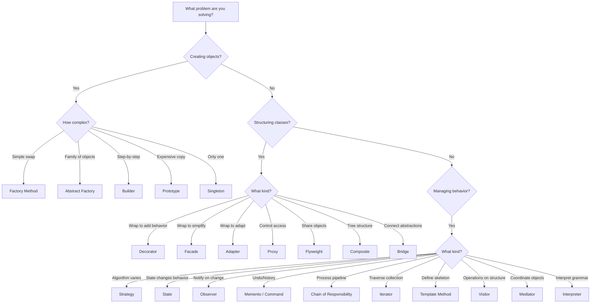
```mermaid
flowchart TD
    A[What problem are you solving?] --> B{Creating objects?}
    B -->|Yes| C{How complex?}
    C -->|Simple swap| F1[Factory Method]
    C -->|Family of objects| F2[Abstract Factory]
    C -->|Step-by-step| F3[Builder]
    C -->|Expensive copy| F4[Prototype]
    C -->|Only one| F5[Singleton]

    B -->|No| D{Structuring classes?}
    D -->|Yes| E{What kind?}
    E -->|Wrap to add behavior| S1[Decorator]
    E -->|Wrap to simplify| S2[Facade]
    E -->|Wrap to adapt| S3[Adapter]
    E -->|Control access| S4[Proxy]
    E -->|Share objects| S5[Flyweight]
    E -->|Tree structure| S6[Composite]
    E -->|Connect abstractions| S7[Bridge]

    D -->|No| G{Managing behavior?}
    G -->|Yes| H{What kind?}
    H -->|Algorithm varies| B1[Strategy]
    H -->|State changes behavior| B2[State]
    H -->|Notify on change| B3[Observer]
    H -->|Undo/history| B4[Memento / Command]
    H -->|Process pipeline| B5[Chain of Responsibility]
    H -->|Traverse collection| B6[Iterator]
    H -->|Define skeleton| B7[Template Method]
    H -->|Operations on structure| B8[Visitor]
    H -->|Coordinate objects| B9[Mediator]
    H -->|Interpret grammar| B10[Interpreter]
```

---

## "If You See X, Think Y" — Quick Mapping

| If You See...                              | Think...                  |
|--------------------------------------------|---------------------------|
| "Only one instance allowed"                | Singleton                 |
| "Create without specifying exact class"    | Factory Method            |
| "Family of related objects"                | Abstract Factory          |
| "Complex object, step-by-step"             | Builder                   |
| "Clone existing object"                    | Prototype                 |
| "Make incompatible interfaces work"        | Adapter                   |
| "Decouple abstraction from implementation" | Bridge                    |
| "Tree / part-whole hierarchy"              | Composite                 |
| "Add responsibilities dynamically"         | Decorator                 |
| "Simplify complex subsystem"              | Facade                    |
| "Share fine-grained objects"              | Flyweight                 |
| "Control access / lazy load"              | Proxy                     |
| "Pass requests along a chain"             | Chain of Responsibility   |
| "Encapsulate request as object"           | Command                   |
| "Grammar / parsing rules"                 | Interpreter               |
| "Traverse collection uniformly"           | Iterator                  |
| "Reduce many-to-many dependencies"        | Mediator                  |
| "Save and restore state"                  | Memento                   |
| "Notify dependents of change"             | Observer                  |
| "Behavior depends on internal state"      | State                     |
| "Swap algorithm at runtime"               | Strategy                  |
| "Define algorithm skeleton, vary steps"   | Template Method           |
| "Add operations without changing classes"  | Visitor                   |

---

## Patterns That Work Well Together

| Combination                     | Use Case                                    |
|---------------------------------|---------------------------------------------|
| Factory + Singleton             | Single factory instance creating products    |
| Strategy + Factory              | Factory picks the right strategy             |
| Observer + Mediator             | Mediator coordinates observers               |
| Composite + Iterator            | Iterate over tree structures                 |
| Decorator + Strategy            | Wrap strategy with extra behavior             |
| Command + Memento               | Undo/redo with saved state                   |
| State + Strategy                | State internally uses strategy switching      |
| Builder + Composite             | Build complex tree structures step-by-step    |
| Proxy + Decorator               | Proxy controls access, decorator adds behavior|
| Abstract Factory + Prototype    | Clone prototypical products                   |

---

# CREATIONAL PATTERNS

---

## Factory Method — Creational

**Intent:** Define an interface for creating objects; let subclasses decide which class to instantiate.

**When:**
- You don't know exact types ahead of time
- You want subclasses to control instantiation
- Creation logic is complex and should be centralized

**Structure:**
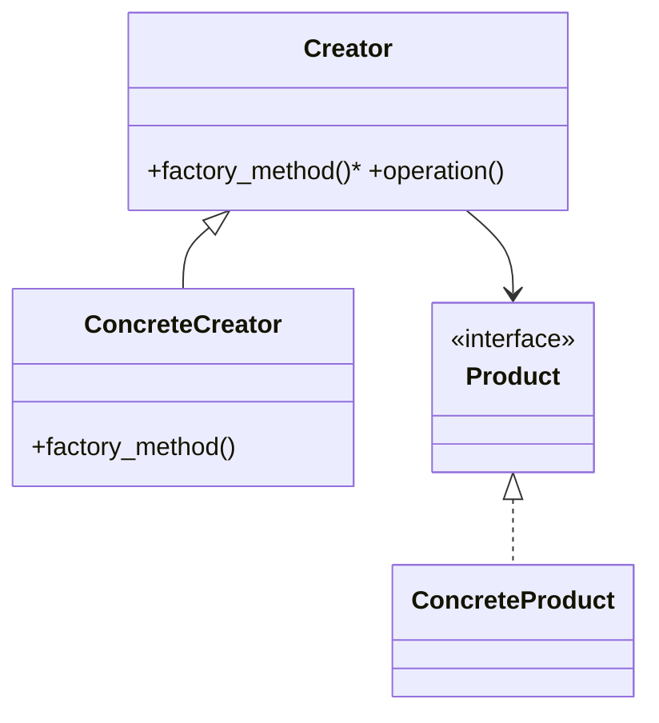
```mermaid
classDiagram
    class Creator { +factory_method()* +operation() }
    class ConcreteCreator { +factory_method() }
    class Product { <<interface>> }
    class ConcreteProduct
    Creator <|-- ConcreteCreator
    Product <|.. ConcreteProduct
    Creator --> Product
```

**Key Code:**
```python
from abc import ABC, abstractmethod

class Notification(ABC):
    @abstractmethod
    def send(self, message: str): ...

class EmailNotification(Notification):
    def send(self, message): print(f"Email: {message}")

class SMSNotification(Notification):
    def send(self, message): print(f"SMS: {message}")

class NotificationFactory:
    @staticmethod
    def create(channel: str) -> Notification:
        return {"email": EmailNotification, "sms": SMSNotification}[channel]()
```

**Real World:** Logging frameworks, UI widget toolkits, payment gateways

**Remember:** "A pizza store where each branch makes pizza differently, but all follow the same menu."

---

## Abstract Factory — Creational

**Intent:** Provide an interface for creating families of related objects without specifying concrete classes.

**When:**
- System must work with multiple families of products
- Products in a family must be used together
- You want to enforce consistency across products

**Structure:**
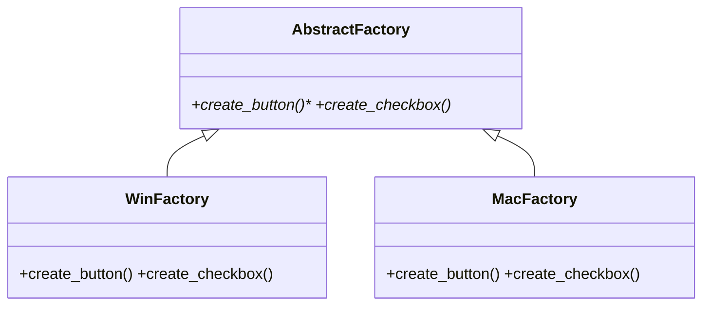
```mermaid
classDiagram
    class AbstractFactory { +create_button()* +create_checkbox()* }
    class WinFactory { +create_button() +create_checkbox() }
    class MacFactory { +create_button() +create_checkbox() }
    AbstractFactory <|-- WinFactory
    AbstractFactory <|-- MacFactory
```

**Key Code:**
```python
class UIFactory(ABC):
    @abstractmethod
    def create_button(self): ...
    @abstractmethod
    def create_checkbox(self): ...

class DarkThemeFactory(UIFactory):
    def create_button(self): return DarkButton()
    def create_checkbox(self): return DarkCheckbox()

class LightThemeFactory(UIFactory):
    def create_button(self): return LightButton()
    def create_checkbox(self): return LightCheckbox()
```

**Real World:** Cross-platform UI (Windows/Mac), database driver families, theme engines

**Remember:** "A furniture store that sells matching sets — you pick the style, everything matches."

---

## Builder — Creational

**Intent:** Separate construction of a complex object from its representation so the same process creates different representations.

**When:**
- Object requires many constructor parameters
- Object creation involves multiple steps
- You want to create different representations

**Structure:**
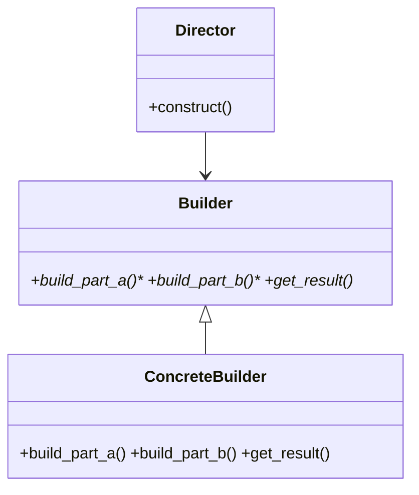
```mermaid
classDiagram
    class Director { +construct() }
    class Builder { +build_part_a()* +build_part_b()* +get_result()* }
    class ConcreteBuilder { +build_part_a() +build_part_b() +get_result() }
    Director --> Builder
    Builder <|-- ConcreteBuilder
```

**Key Code:**
```python
class QueryBuilder:
    def __init__(self):
        self._table = self._conditions = self._order = ""

    def table(self, t):    self._table = t; return self
    def where(self, c):    self._conditions = c; return self
    def order_by(self, o): self._order = o; return self

    def build(self) -> str:
        q = f"SELECT * FROM {self._table}"
        if self._conditions: q += f" WHERE {self._conditions}"
        if self._order:      q += f" ORDER BY {self._order}"
        return q

# Usage: QueryBuilder().table("users").where("age > 18").order_by("name").build()
```

**Real World:** SQL query builders, meal builders, document builders (HTML/PDF)

**Remember:** "Like ordering a custom sandwich — you pick bread, filling, sauce step by step."

---

## Prototype — Creational

**Intent:** Create new objects by copying an existing object (prototype) instead of building from scratch.

**When:**
- Object creation is expensive (DB calls, network)
- You need many similar objects with slight variations
- Class to instantiate is determined at runtime

**Structure:**
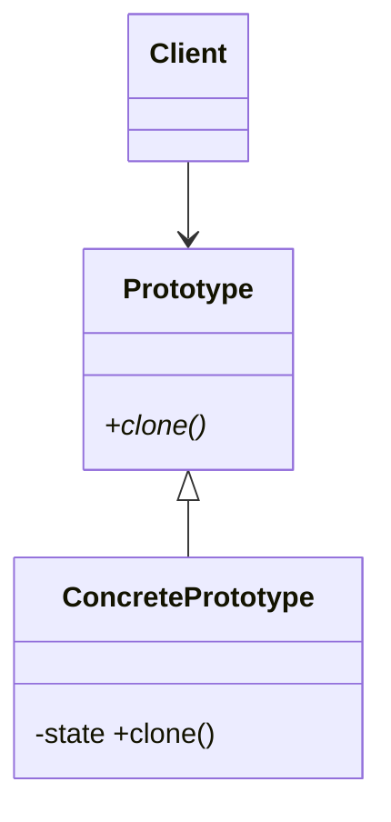
```mermaid
classDiagram
    class Prototype { +clone()* }
    class ConcretePrototype { -state +clone() }
    Prototype <|-- ConcretePrototype
    Client --> Prototype
```

**Key Code:**
```python
import copy

class GameUnit:
    def __init__(self, hp, attack, sprite):
        self.hp, self.attack, self.sprite = hp, attack, sprite

    def clone(self):
        return copy.deepcopy(self)

# Create prototype once, clone many
orc_template = GameUnit(100, 15, load_sprite("orc"))  # expensive
orc1 = orc_template.clone()
orc2 = orc_template.clone()
```

**Real World:** Game object spawning, document templates, cell division in biology

**Remember:** "Photocopy machine — don't rewrite the document, just copy it."

---

## Singleton — Creational

**Intent:** Ensure a class has only one instance and provide a global point of access.

**When:**
- Exactly one instance needed (config, thread pool, cache)
- Global access point required
- Lazy initialization needed

**Structure:**
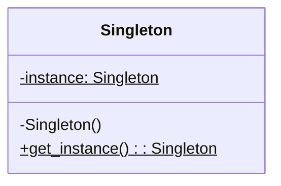
```mermaid
classDiagram
    class Singleton {
        -instance: Singleton$
        -Singleton()
        +get_instance(): Singleton$
    }
```

**Key Code:**
```python
class DatabasePool:
    _instance = None

    def __new__(cls):
        if cls._instance is None:
            cls._instance = super().__new__(cls)
            cls._instance._pool = create_connections(10)
        return cls._instance

# Thread-safe version (Python):
import threading
class Singleton:
    _instance = None
    _lock = threading.Lock()

    @classmethod
    def get_instance(cls):
        with cls._lock:
            if not cls._instance:
                cls._instance = cls()
        return cls._instance
```

**Real World:** Database connection pool, logger, configuration manager, print spooler

**Remember:** "The President — there is only one at a time, and everyone knows how to reach them."

---

# STRUCTURAL PATTERNS

---

## Adapter — Structural

**Intent:** Convert the interface of a class into another interface clients expect.

**When:**
- Integrating legacy or third-party code
- Interfaces are incompatible but functionality is similar
- You want to reuse existing class with wrong interface

**Structure:**
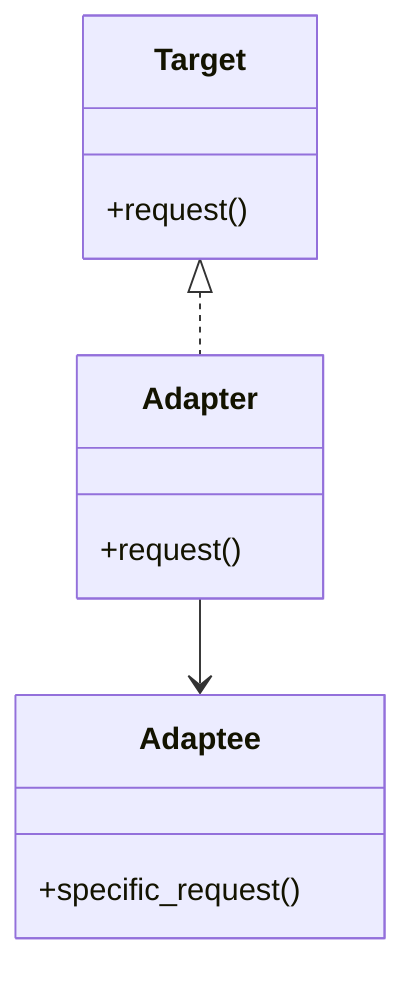
```mermaid
classDiagram
    class Target { +request() }
    class Adaptee { +specific_request() }
    class Adapter { +request() }
    Target <|.. Adapter
    Adapter --> Adaptee
```

**Key Code:**
```python
class EuropeanPlug:
    def provide_220v(self): return 220

class USSocket:
    def provide_110v(self): return 110

class PlugAdapter(USSocket):
    def __init__(self, euro_plug: EuropeanPlug):
        self._plug = euro_plug
    def provide_110v(self):
        return self._plug.provide_220v() // 2  # Convert
```

**Real World:** Power adapters, XML-to-JSON converters, legacy API wrappers

**Remember:** "Travel plug adapter — same device, different socket."

---

## Bridge — Structural

**Intent:** Decouple an abstraction from its implementation so they can vary independently.

**When:**
- You want to avoid permanent binding between abstraction and implementation
- Both abstraction and implementation should be extensible via subclassing
- Changes in implementation should not affect client code

**Structure:**
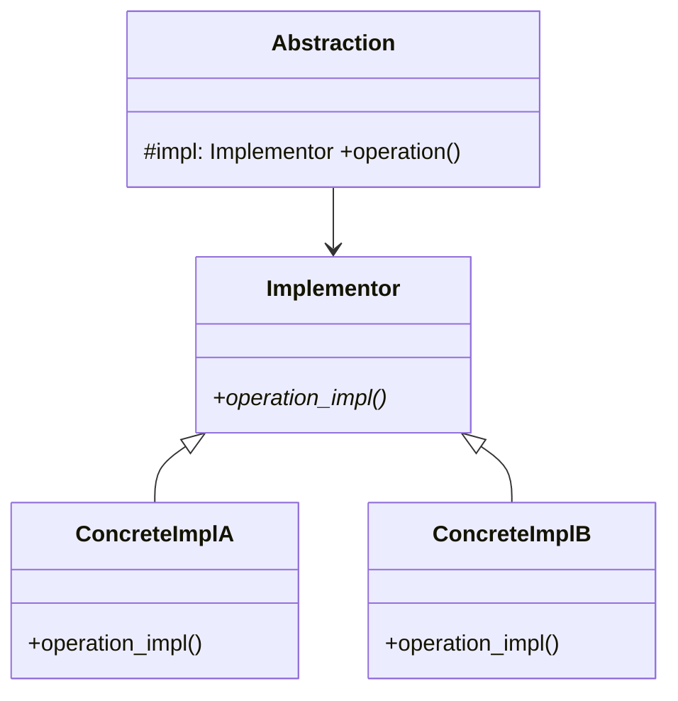
```mermaid
classDiagram
    class Abstraction { #impl: Implementor +operation() }
    class Implementor { +operation_impl()* }
    class ConcreteImplA { +operation_impl() }
    class ConcreteImplB { +operation_impl() }
    Abstraction --> Implementor
    Implementor <|-- ConcreteImplA
    Implementor <|-- ConcreteImplB
```

**Key Code:**
```python
class Renderer(ABC):
    @abstractmethod
    def render_circle(self, radius): ...

class VectorRenderer(Renderer):
    def render_circle(self, r): print(f"Drawing vector circle r={r}")

class RasterRenderer(Renderer):
    def render_circle(self, r): print(f"Drawing pixels for circle r={r}")

class Circle:
    def __init__(self, renderer: Renderer, radius):
        self.renderer, self.radius = renderer, radius
    def draw(self):
        self.renderer.render_circle(self.radius)
```

**Real World:** Cross-platform GUI, database drivers, remote control + device

**Remember:** "Remote control (abstraction) works with any TV (implementation)."

---

## Composite — Structural

**Intent:** Compose objects into tree structures; let clients treat individual objects and compositions uniformly.

**When:**
- Representing part-whole hierarchies
- Clients should treat leaf and composite objects the same
- Tree-structured data (files, menus, org charts)

**Structure:**
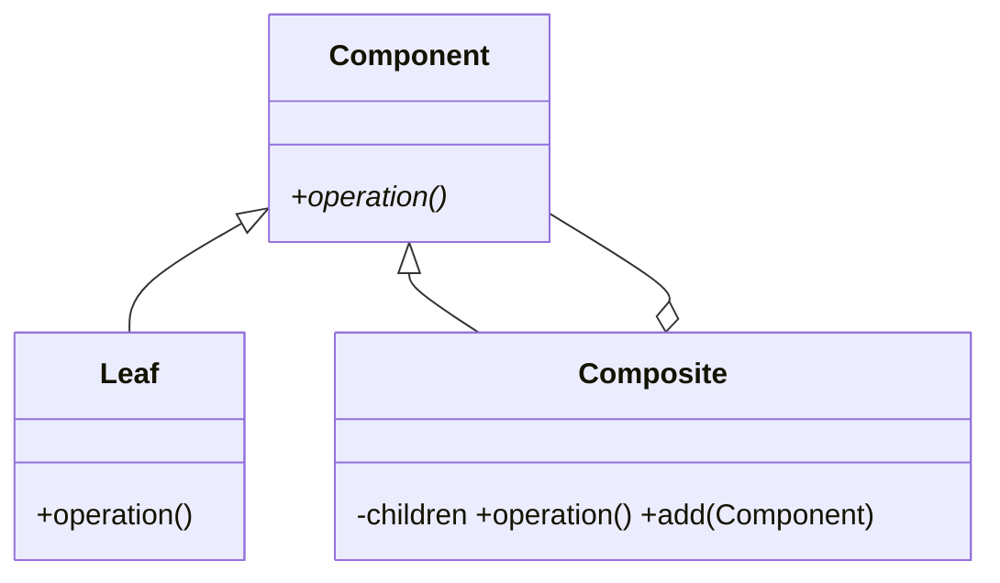
```mermaid
classDiagram
    class Component { +operation()* }
    class Leaf { +operation() }
    class Composite { -children +operation() +add(Component) }
    Component <|-- Leaf
    Component <|-- Composite
    Composite o-- Component
```

**Key Code:**
```python
class FileSystemItem(ABC):
    @abstractmethod
    def get_size(self) -> int: ...

class File(FileSystemItem):
    def __init__(self, size): self._size = size
    def get_size(self): return self._size

class Folder(FileSystemItem):
    def __init__(self): self._children = []
    def add(self, item: FileSystemItem): self._children.append(item)
    def get_size(self): return sum(c.get_size() for c in self._children)
```

**Real World:** File systems, UI component trees, org charts, menu systems

**Remember:** "A box that can contain items OR other boxes — recursion in real life."

---

## Decorator — Structural

**Intent:** Attach additional responsibilities to an object dynamically, as a flexible alternative to subclassing.

**When:**
- Add behavior without modifying existing code
- Responsibilities can be added/removed at runtime
- Subclassing would lead to class explosion

**Structure:**
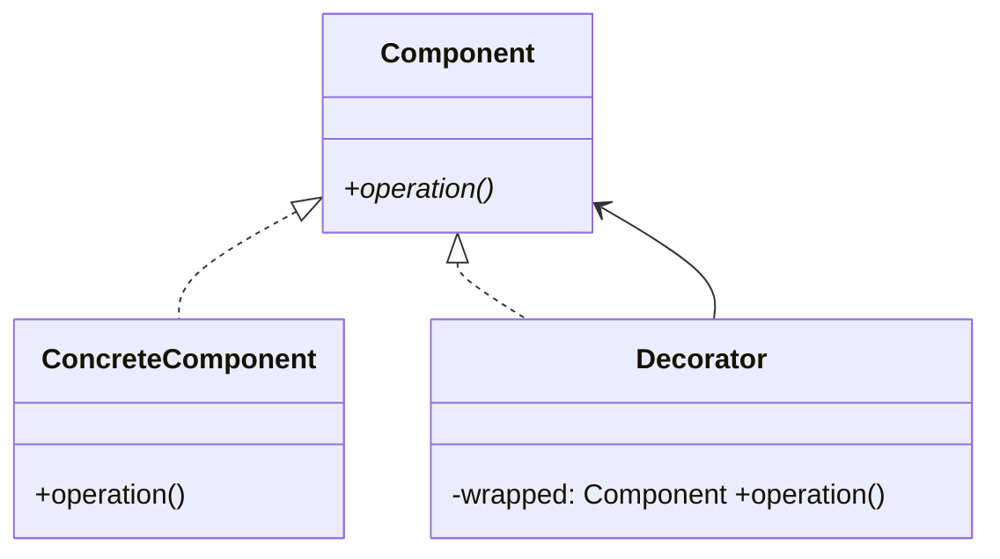
```mermaid
classDiagram
    class Component { +operation()* }
    class ConcreteComponent { +operation() }
    class Decorator { -wrapped: Component +operation() }
    Component <|.. ConcreteComponent
    Component <|.. Decorator
    Decorator --> Component
```

**Key Code:**
```python
class Coffee:
    def cost(self): return 5

class MilkDecorator:
    def __init__(self, coffee): self._coffee = coffee
    def cost(self): return self._coffee.cost() + 2

class SugarDecorator:
    def __init__(self, coffee): self._coffee = coffee
    def cost(self): return self._coffee.cost() + 1

# Usage: SugarDecorator(MilkDecorator(Coffee())).cost()  # 8
```

**Real World:** Java I/O streams, middleware pipelines, pizza toppings

**Remember:** "Gift wrapping — each layer adds something, you can stack as many as you want."

---

## Facade — Structural

**Intent:** Provide a simplified interface to a complex subsystem.

**When:**
- Complex subsystem with many classes
- Clients need simple entry point
- You want to layer your subsystems

**Structure:**
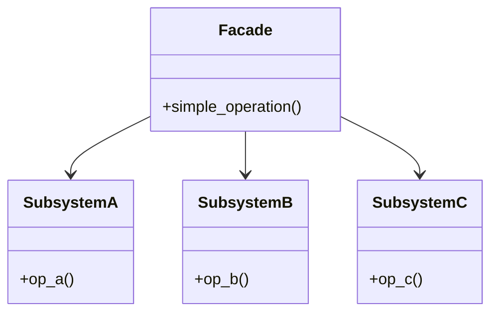
```mermaid
classDiagram
    class Facade { +simple_operation() }
    class SubsystemA { +op_a() }
    class SubsystemB { +op_b() }
    class SubsystemC { +op_c() }
    Facade --> SubsystemA
    Facade --> SubsystemB
    Facade --> SubsystemC
```

**Key Code:**
```python
class OrderFacade:
    def __init__(self):
        self.inventory = InventoryService()
        self.payment = PaymentService()
        self.shipping = ShippingService()

    def place_order(self, item, card, address):
        self.inventory.reserve(item)
        self.payment.charge(card, item.price)
        self.shipping.ship(item, address)
```

**Real World:** Starting a car (turn key = fuel + ignition + starter), compiler API, home theater remote

**Remember:** "Hotel concierge — one person handles restaurant, taxi, tickets for you."

---

## Flyweight — Structural

**Intent:** Share objects to support large numbers of fine-grained objects efficiently.

**When:**
- Application uses a huge number of similar objects
- Most object state can be made extrinsic
- Memory is a constraint

**Structure:**
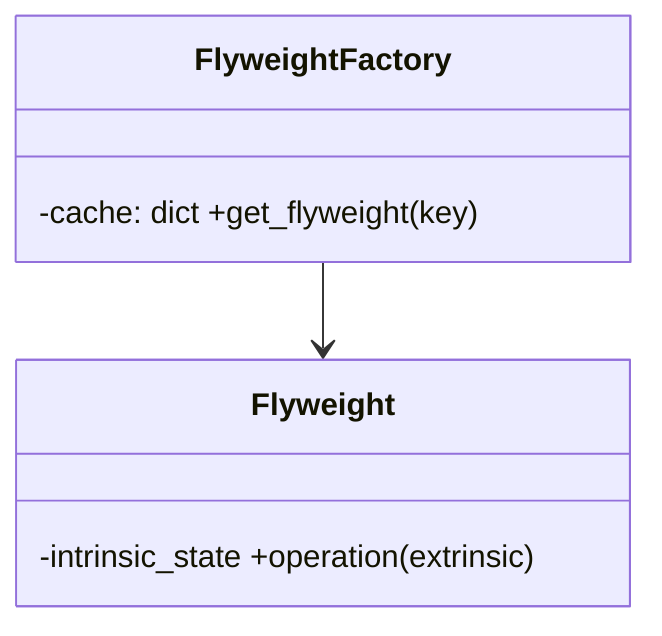
```mermaid
classDiagram
    class FlyweightFactory { -cache: dict +get_flyweight(key) }
    class Flyweight { -intrinsic_state +operation(extrinsic) }
    FlyweightFactory --> Flyweight
```

**Key Code:**
```python
class CharacterStyle:  # Flyweight
    def __init__(self, font, size, color):
        self.font, self.size, self.color = font, size, color

class StyleFactory:
    _cache = {}
    @classmethod
    def get(cls, font, size, color):
        key = (font, size, color)
        if key not in cls._cache:
            cls._cache[key] = CharacterStyle(font, size, color)
        return cls._cache[key]

# 1M characters but only ~20 unique styles in memory
```

**Real World:** Text editor character formatting, game tiles/trees, browser DOM nodes

**Remember:** "Font in a word processor — millions of characters but only a few font objects."

---

## Proxy — Structural

**Intent:** Provide a surrogate or placeholder for another object to control access.

**When:**
- Lazy initialization (virtual proxy)
- Access control (protection proxy)
- Logging/caching (smart proxy)
- Remote objects (remote proxy)

**Structure:**
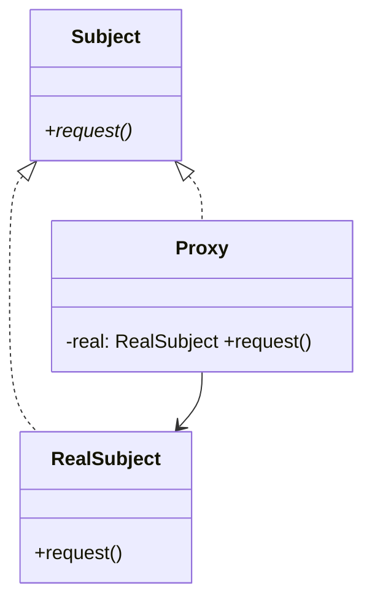
```mermaid
classDiagram
    class Subject { +request()* }
    class RealSubject { +request() }
    class Proxy { -real: RealSubject +request() }
    Subject <|.. RealSubject
    Subject <|.. Proxy
    Proxy --> RealSubject
```

**Key Code:**
```python
class DatabaseProxy:
    def __init__(self):
        self._db = None  # Lazy init
        self._cache = {}

    def query(self, sql):
        if sql in self._cache:
            return self._cache[sql]      # Cache proxy
        if self._db is None:
            self._db = RealDatabase()     # Virtual proxy
        result = self._db.query(sql)
        self._cache[sql] = result
        return result
```

**Real World:** Lazy image loading, ORM lazy relationships, API rate limiters, VPN

**Remember:** "Security guard at a building — controls who gets in and when."

---

# BEHAVIORAL PATTERNS

---

## Chain of Responsibility — Behavioral

**Intent:** Pass a request along a chain of handlers; each decides to process it or pass it on.

**When:**
- Multiple objects can handle a request
- Handler isn't known in advance
- Request should be handled by first capable handler

**Structure:**
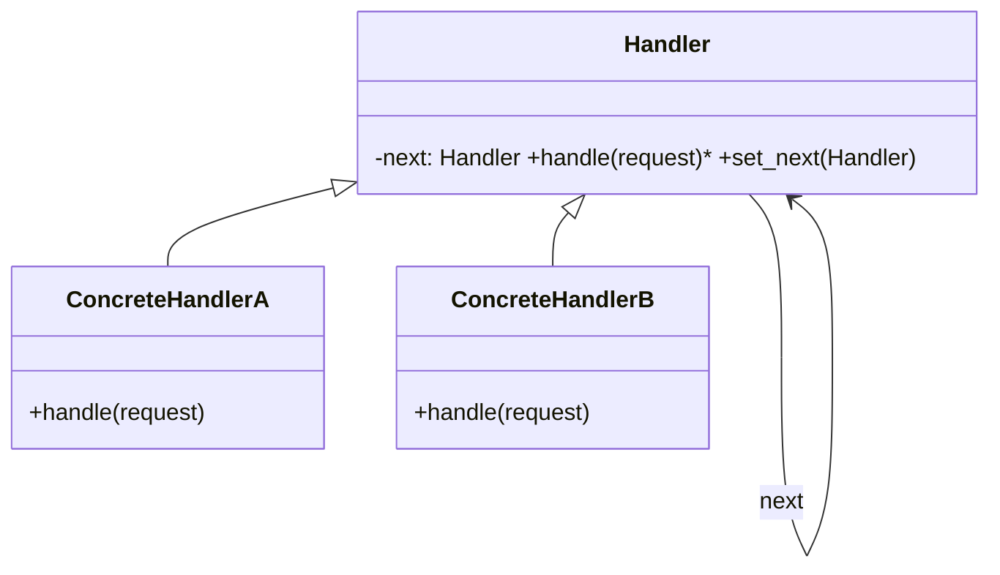
```mermaid
classDiagram
    class Handler { -next: Handler +handle(request)* +set_next(Handler) }
    class ConcreteHandlerA { +handle(request) }
    class ConcreteHandlerB { +handle(request) }
    Handler <|-- ConcreteHandlerA
    Handler <|-- ConcreteHandlerB
    Handler --> Handler : next
```

**Key Code:**
```python
class SupportHandler:
    def __init__(self): self._next = None
    def set_next(self, handler): self._next = handler; return handler

    def handle(self, ticket):
        if self._next:
            return self._next.handle(ticket)
        return "Unhandled"

class L1Support(SupportHandler):
    def handle(self, ticket):
        if ticket.severity == "low": return "L1 resolved"
        return super().handle(ticket)
```

**Real World:** Middleware pipelines, exception handling, approval workflows, event bubbling

**Remember:** "Customer support escalation — L1 to L2 to L3 until someone handles it."

---

## Command — Behavioral

**Intent:** Encapsulate a request as an object, allowing parameterization, queuing, logging, and undo.

**When:**
- Need undo/redo functionality
- Queue or schedule operations
- Need to log all operations
- Decouple invoker from receiver

**Structure:**
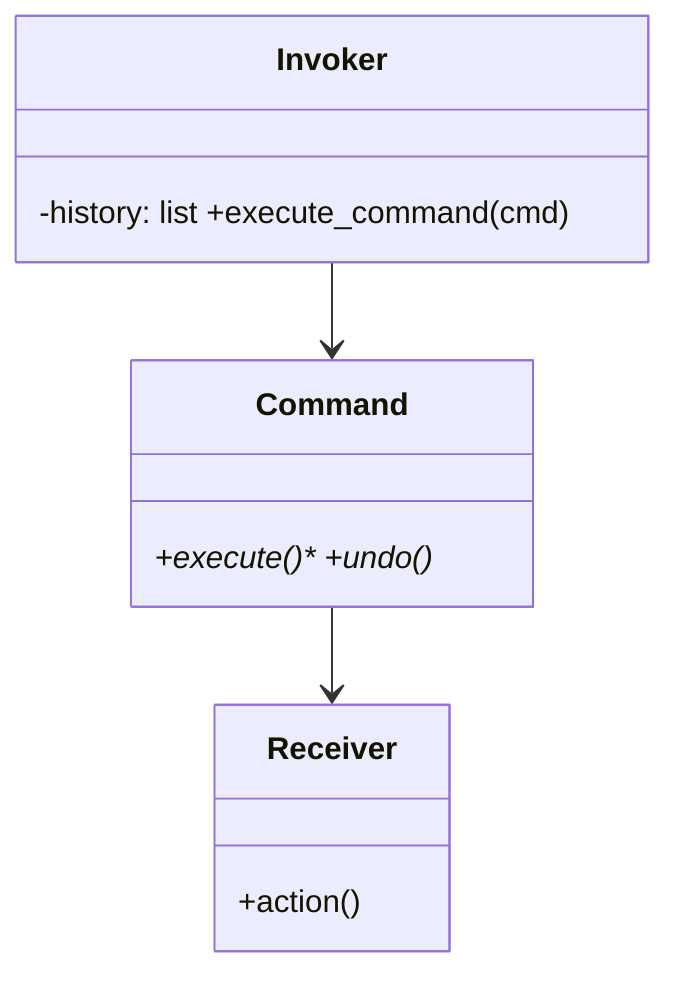
```mermaid
classDiagram
    class Command { +execute()* +undo()* }
    class Invoker { -history: list +execute_command(cmd) }
    class Receiver { +action() }
    Command --> Receiver
    Invoker --> Command
```

**Key Code:**
```python
class Command(ABC):
    @abstractmethod
    def execute(self): ...
    @abstractmethod
    def undo(self): ...

class AddTextCommand(Command):
    def __init__(self, doc, text):
        self.doc, self.text = doc, text
    def execute(self): self.doc.append(self.text)
    def undo(self):   self.doc.pop()

class Editor:
    def __init__(self): self.history = []
    def execute(self, cmd):
        cmd.execute(); self.history.append(cmd)
    def undo(self):
        if self.history: self.history.pop().undo()
```

**Real World:** Text editor undo, transaction systems, macro recording, task queues

**Remember:** "Restaurant order slip — captures what to do, who does it, can be cancelled."

---

## Interpreter — Behavioral

**Intent:** Define a grammar for a language and an interpreter that uses the representation to interpret sentences.

**When:**
- Simple grammar that can be represented as a tree
- Efficiency is not critical
- Domain-specific languages

**Key Code:**
```python
class Expression(ABC):
    @abstractmethod
    def interpret(self, context: dict) -> int: ...

class Number(Expression):
    def __init__(self, value): self.value = value
    def interpret(self, ctx): return self.value

class Add(Expression):
    def __init__(self, left, right): self.left, self.right = left, right
    def interpret(self, ctx): return self.left.interpret(ctx) + self.right.interpret(ctx)
```

**Real World:** SQL parsers, regex engines, mathematical expression evaluators, rule engines

**Remember:** "A calculator that breaks `3 + 5` into a tree and evaluates it."

---

## Iterator — Behavioral

**Intent:** Provide a way to access elements of a collection sequentially without exposing its structure.

**When:**
- Traverse a collection without exposing internals
- Support multiple traversal types
- Provide uniform interface for different collections

**Key Code:**
```python
class BSTIterator:
    """In-order iterator for binary search tree."""
    def __init__(self, root):
        self._stack = []
        self._push_left(root)

    def _push_left(self, node):
        while node:
            self._stack.append(node)
            node = node.left

    def __iter__(self): return self
    def __next__(self):
        if not self._stack: raise StopIteration
        node = self._stack.pop()
        self._push_left(node.right)
        return node.val
```

**Real World:** Python iterators/generators, database cursors, file line readers

**Remember:** "TV remote channel buttons — next, previous — you don't care how channels are stored."

---

## Mediator — Behavioral

**Intent:** Define an object that encapsulates how a set of objects interact, promoting loose coupling.

**When:**
- Many objects communicate in complex ways
- Reusing objects is difficult due to dependencies
- Central control point needed for interactions

**Structure:**
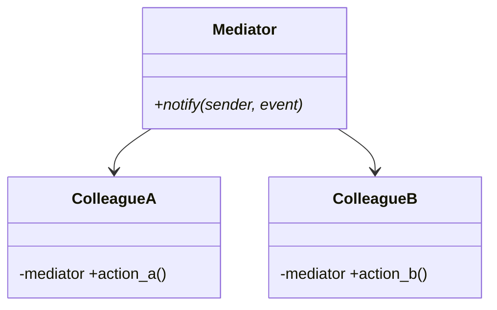
```mermaid
classDiagram
    class Mediator { +notify(sender, event)* }
    class ColleagueA { -mediator +action_a() }
    class ColleagueB { -mediator +action_b() }
    Mediator --> ColleagueA
    Mediator --> ColleagueB
```

**Key Code:**
```python
class ChatRoom:  # Mediator
    def __init__(self): self._users = {}
    def register(self, user): self._users[user.name] = user
    def send(self, message, sender, recipient):
        if recipient in self._users:
            self._users[recipient].receive(message, sender)

class User:
    def __init__(self, name, room):
        self.name, self.room = name, room
    def send(self, msg, to): self.room.send(msg, self.name, to)
    def receive(self, msg, fr): print(f"{fr} -> {self.name}: {msg}")
```

**Real World:** Chat rooms, air traffic control, UI form validation, event buses

**Remember:** "Air traffic control tower — planes don't talk to each other, they talk to the tower."

---

## Memento — Behavioral

**Intent:** Capture and externalize an object's internal state so it can be restored later.

**When:**
- Need checkpoint/rollback (save/load)
- Need undo functionality
- Must preserve encapsulation

**Key Code:**
```python
from dataclasses import dataclass

@dataclass(frozen=True)
class EditorMemento:
    content: str
    cursor: int

class TextEditor:
    def __init__(self): self.content, self.cursor = "", 0

    def save(self) -> EditorMemento:
        return EditorMemento(self.content, self.cursor)

    def restore(self, memento: EditorMemento):
        self.content, self.cursor = memento.content, memento.cursor
```

**Real World:** Text editor undo, game save points, database transactions, version control

**Remember:** "Save game — snapshot everything so you can reload later."

---

## Observer — Behavioral

**Intent:** Define a one-to-many dependency so when one object changes, all dependents are notified.

**When:**
- One object's change should trigger updates in others
- Number of dependents is dynamic
- Loose coupling between subject and observers

**Structure:**
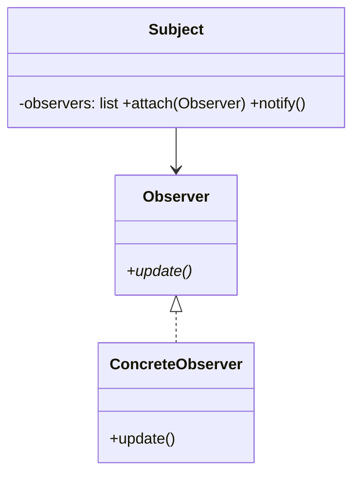
```mermaid
classDiagram
    class Subject { -observers: list +attach(Observer) +notify() }
    class Observer { +update()* }
    class ConcreteObserver { +update() }
    Subject --> Observer
    Observer <|.. ConcreteObserver
```

**Key Code:**
```python
class EventEmitter:
    def __init__(self): self._listeners = {}

    def on(self, event, callback):
        self._listeners.setdefault(event, []).append(callback)

    def emit(self, event, data=None):
        for cb in self._listeners.get(event, []):
            cb(data)

# Usage:
store = EventEmitter()
store.on("price_drop", lambda p: print(f"New price: {p}"))
store.emit("price_drop", 29.99)
```

**Real World:** Event systems, stock tickers, MVC pattern, pub/sub messaging, UI data binding

**Remember:** "YouTube subscription — subscribe once, get notified on every new video."

---

## State — Behavioral

**Intent:** Allow an object to alter its behavior when its internal state changes; the object appears to change its class.

**When:**
- Object behavior depends on state and changes at runtime
- Large conditional statements based on state
- State transitions are well-defined

**Structure:**
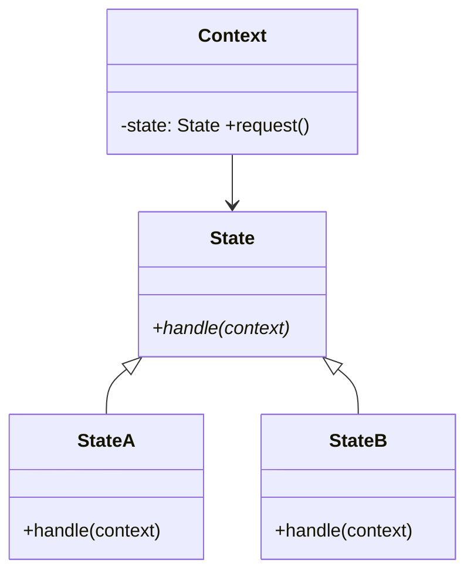
```mermaid
classDiagram
    class Context { -state: State +request() }
    class State { +handle(context)* }
    class StateA { +handle(context) }
    class StateB { +handle(context) }
    Context --> State
    State <|-- StateA
    State <|-- StateB
```

**Key Code:**
```python
class VendingMachineState(ABC):
    @abstractmethod
    def insert_coin(self, machine): ...
    @abstractmethod
    def dispense(self, machine): ...

class IdleState(VendingMachineState):
    def insert_coin(self, m): m.state = HasCoinState()
    def dispense(self, m):    print("Insert coin first")

class HasCoinState(VendingMachineState):
    def insert_coin(self, m): print("Coin already inserted")
    def dispense(self, m):    print("Dispensing..."); m.state = IdleState()
```

**Real World:** Vending machines, TCP connections, document workflows, game character states

**Remember:** "Traffic light — same light, different behavior depending on color (state)."

---

## Strategy — Behavioral

**Intent:** Define a family of algorithms, encapsulate each, and make them interchangeable.

**When:**
- Multiple algorithms for the same task
- Algorithm should be selected at runtime
- Avoid conditional statements for algorithm selection

**Structure:**
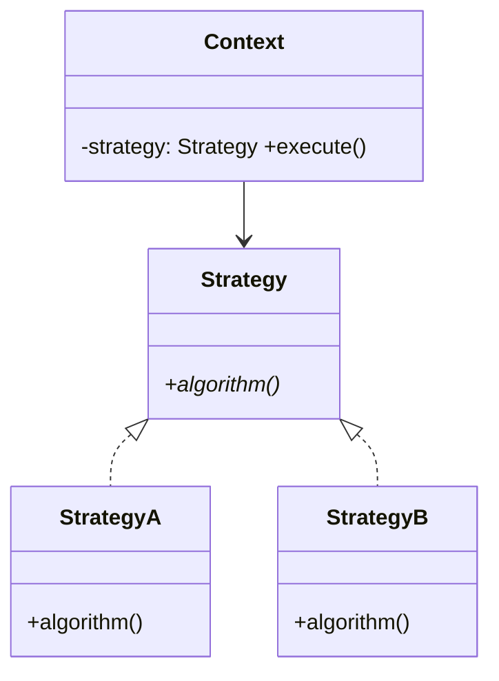
```mermaid
classDiagram
    class Context { -strategy: Strategy +execute() }
    class Strategy { +algorithm()* }
    class StrategyA { +algorithm() }
    class StrategyB { +algorithm() }
    Context --> Strategy
    Strategy <|.. StrategyA
    Strategy <|.. StrategyB
```

**Key Code:**
```python
class SortStrategy(ABC):
    @abstractmethod
    def sort(self, data: list) -> list: ...

class QuickSort(SortStrategy):
    def sort(self, data): return sorted(data)  # simplified

class BubbleSort(SortStrategy):
    def sort(self, data): ...  # bubble sort impl

class Sorter:
    def __init__(self, strategy: SortStrategy):
        self._strategy = strategy
    def sort(self, data):
        return self._strategy.sort(data)
```

**Real World:** Sorting algorithms, payment methods, compression, routing strategies

**Remember:** "GPS navigation — same destination, different route strategies (fastest, shortest, scenic)."

---

## Template Method — Behavioral

**Intent:** Define the skeleton of an algorithm in a base class; let subclasses override specific steps.

**When:**
- Several classes have similar algorithms with minor differences
- You want to control which steps can be overridden
- Common behavior should be centralized

**Key Code:**
```python
class DataMiner(ABC):
    def mine(self, path):           # Template method
        data = self.extract(path)
        data = self.transform(data)
        self.analyze(data)

    @abstractmethod
    def extract(self, path): ...    # Subclasses override
    @abstractmethod
    def transform(self, data): ...  # Subclasses override

    def analyze(self, data):        # Common step
        print(f"Analyzing {len(data)} records")

class CSVMiner(DataMiner):
    def extract(self, path): return read_csv(path)
    def transform(self, data): return clean(data)
```

**Real World:** Data processing pipelines, build tools, test frameworks (setUp/test/tearDown)

**Remember:** "Recipe template — steps are defined, but each chef seasons differently."

---

## Visitor — Behavioral

**Intent:** Add new operations to existing object structures without modifying them.

**When:**
- Many distinct operations on object structure
- Object structure rarely changes but operations change often
- Operations don't belong in the element classes

**Key Code:**
```python
class ShapeVisitor(ABC):
    @abstractmethod
    def visit_circle(self, c): ...
    @abstractmethod
    def visit_rect(self, r): ...

class AreaCalculator(ShapeVisitor):
    def visit_circle(self, c): return 3.14 * c.radius ** 2
    def visit_rect(self, r):   return r.width * r.height

class Circle:
    def __init__(self, r): self.radius = r
    def accept(self, visitor): return visitor.visit_circle(self)
```

**Real World:** Compilers (AST visitors), document exporters, tax calculators

**Remember:** "Taxi meter — the visitor (meter) calculates fare differently for each zone (element)."

---

## Quick Pattern Count Summary

| Category     | Count | Patterns                                                            |
|-------------|-------|---------------------------------------------------------------------|
| Creational  | 5     | Factory Method, Abstract Factory, Builder, Prototype, Singleton     |
| Structural  | 7     | Adapter, Bridge, Composite, Decorator, Facade, Flyweight, Proxy    |
| Behavioral  | 11    | Chain of Resp, Command, Interpreter, Iterator, Mediator, Memento, Observer, State, Strategy, Template Method, Visitor |
| **Total**   | **23**|                                                                     |

---

*Last updated: 2026-02-06 | Interview-ready cheat sheet*
