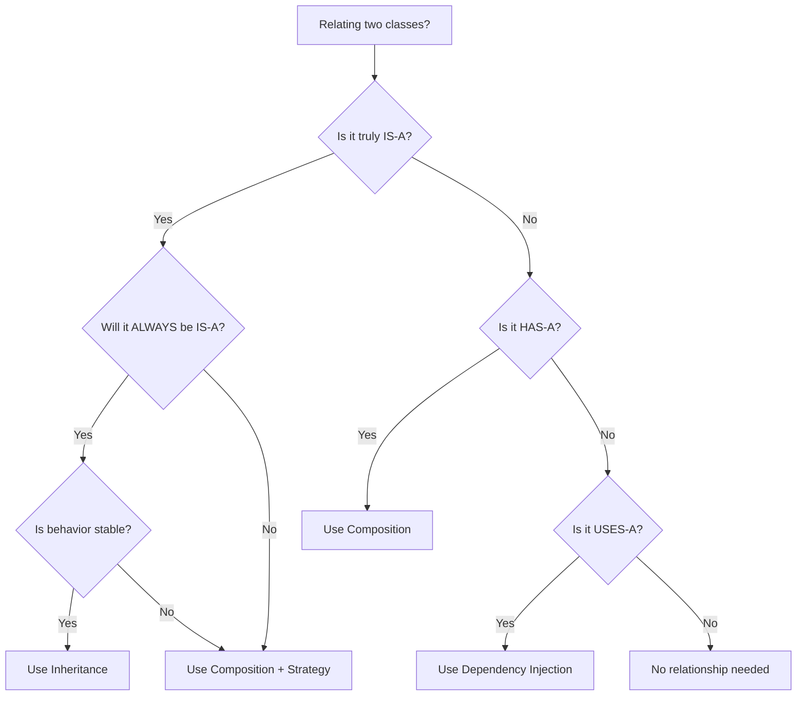
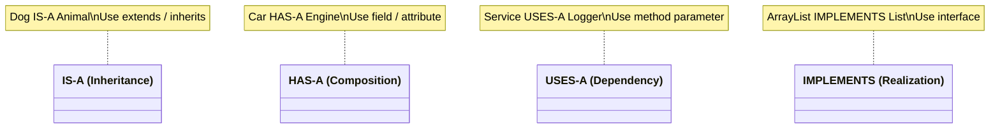

# OOP Cheat Sheet

> Quick reference for the 4 pillars, key comparisons, and common interview points.

---

## The 4 Pillars of OOP

### 1. Encapsulation — "Bundle data + methods, hide internals"

```python
class BankAccount:
    def __init__(self, balance):
        self.__balance = balance          # Private

    def deposit(self, amount):
        if amount > 0:                    # Controlled access
            self.__balance += amount

    def get_balance(self):                # Read-only access
        return self.__balance
```

**Key point:** Access data ONLY through methods. Internals can change without affecting callers.

---

### 2. Abstraction — "Show what, hide how"

```python
class PaymentGateway(ABC):
    @abstractmethod
    def pay(self, amount: float) -> bool: ...   # What (interface)

class StripeGateway(PaymentGateway):
    def pay(self, amount):
        # How (hidden complexity: API calls, retries, logging)
        return self._call_stripe_api(amount)
```

**Key point:** Callers know `pay(amount)` exists, not how it works internally.

---

### 3. Inheritance — "Reuse by extending"

```python
class Animal:
    def __init__(self, name):
        self.name = name
    def speak(self):
        raise NotImplementedError

class Dog(Animal):
    def speak(self):
        return f"{self.name} says Woof!"

class Cat(Animal):
    def speak(self):
        return f"{self.name} says Meow!"
```

**Key point:** Subclass IS-A parent. `Dog` is-a `Animal`. Reuse parent code, override as needed.

---

### 4. Polymorphism — "One interface, many forms"

```python
def make_sound(animal: Animal):   # Same function
    print(animal.speak())         # Different behavior

make_sound(Dog("Rex"))    # "Rex says Woof!"
make_sound(Cat("Whiskers"))  # "Whiskers says Meow!"
```

**Types of Polymorphism:**
| Type          | Mechanism                  | Example                    |
|---------------|----------------------------|----------------------------|
| Compile-time  | Method overloading         | `add(int)` vs `add(float)` |
| Runtime       | Method overriding          | `dog.speak()` vs `cat.speak()` |
| Ad-hoc        | Operator overloading       | `+` for int vs string      |
| Parametric    | Generics                   | `List<T>`                  |

**Key point:** Same method call, different behavior depending on the object type at runtime.

---

## Composition vs Inheritance Decision Tree



### Quick Comparison

| Aspect              | Inheritance                     | Composition                      |
|---------------------|--------------------------------|----------------------------------|
| Relationship        | IS-A                           | HAS-A                            |
| Coupling            | Tight (parent-child bound)     | Loose (plug and play)            |
| Flexibility         | Fixed at compile time          | Changeable at runtime            |
| Code reuse          | Extends parent class           | Delegates to contained object    |
| Fragile base class  | Yes (changing parent breaks child) | No                            |
| Diamond problem     | Possible (C++, Python)         | Not applicable                   |
| Testing             | Harder (needs parent context)  | Easier (mock dependencies)       |

**Rule of thumb:** Favor composition over inheritance. Use inheritance only for genuine IS-A with stable behavior.

---

## Abstract Class vs Interface

| Feature              | Abstract Class                  | Interface                        |
|----------------------|--------------------------------|----------------------------------|
| Methods              | Abstract + concrete            | Abstract only (Java 8+ has default) |
| Fields               | Can have state                 | Constants only (Java)            |
| Constructor          | Yes                            | No                               |
| Multiple inheritance | No (Java), Yes (Python)        | Yes (implement many)             |
| Access modifiers     | Any                            | Public (implicitly)              |
| When to use          | Shared behavior + state        | Define a contract / capability   |

**In Python:** Both use `ABC` — no strict distinction. Use ABCs for contracts, mixins for shared behavior.

```python
# Abstract class — shared state + behavior
class Animal(ABC):
    def __init__(self, name): self.name = name
    @abstractmethod
    def speak(self): ...
    def breathe(self): print("Breathing")   # Shared behavior

# Interface (Python style) — pure contract
class Flyable(ABC):
    @abstractmethod
    def fly(self): ...

class Eagle(Animal, Flyable):  # Multiple "interfaces"
    def speak(self): return "Screech"
    def fly(self):   return "Soaring"
```

---

## Access Modifier Table

### Java

| Modifier      | Class | Package | Subclass | World |
|---------------|-------|---------|----------|-------|
| `public`      | Yes   | Yes     | Yes      | Yes   |
| `protected`   | Yes   | Yes     | Yes      | No    |
| (default)     | Yes   | Yes     | No       | No    |
| `private`     | Yes   | No      | No       | No    |

### Python (Convention-based)

| Convention     | Meaning                  | Access         |
|----------------|--------------------------|----------------|
| `name`         | Public                   | Anywhere       |
| `_name`        | Protected (convention)   | Class + subclass |
| `__name`       | Private (name mangling)  | Class only     |
| `__name__`     | Dunder / magic method    | Special Python methods |

---

## Common OOP Interview One-Liners

| Question                                      | Answer                                                      |
|-----------------------------------------------|-------------------------------------------------------------|
| What is encapsulation?                        | Bundling data + methods and restricting direct access         |
| What is abstraction?                          | Hiding complexity, exposing only necessary interface          |
| Difference between abstraction & encapsulation?| Abstraction = what to show; Encapsulation = how to hide     |
| What is polymorphism?                         | Same interface, different implementations at runtime         |
| Overloading vs Overriding?                    | Overloading = same name, different params (compile-time); Overriding = same signature, different class (runtime) |
| What is the diamond problem?                  | Ambiguity when class inherits from two classes with same method |
| Why favor composition over inheritance?       | Loose coupling, runtime flexibility, avoids fragile base class |
| What is method resolution order (MRO)?        | Algorithm (C3 linearization in Python) to resolve diamond problem |
| What is a mixin?                              | A class that provides methods to other classes without being a parent |
| Can you have polymorphism without inheritance? | Yes — duck typing (Python), interfaces, generics            |

---

## Class Relationship Summary



---

## Quick OOPS Principles Recap

| Principle                    | Summary                                          |
|------------------------------|--------------------------------------------------|
| DRY (Don't Repeat Yourself)  | Extract common code into methods/classes          |
| KISS (Keep It Simple)        | Simpler solution is usually better                |
| YAGNI (You Ain't Gonna Need It) | Don't build features you don't need yet        |
| Law of Demeter               | Only talk to your immediate friends               |
| Favor Composition            | HAS-A over IS-A when possible                    |
| Program to Interface         | Depend on abstractions, not concretions           |

---

*Last updated: 2026-02-06 | Interview-ready cheat sheet*
