# Design Pattern Relationships and Selection Guide

> How the 23 GoF patterns connect, evolve, complement, and compete with each other. Use this to navigate pattern selection in LLD interviews.

---

## 1. Pattern Evolution Map

Patterns don't exist in isolation. Many evolved from simpler ideas, and understanding these evolutionary paths helps you choose the right one.

### Creation Evolution


**Reading the evolution:**
- Start with `new Object()` (direct instantiation)
- When you need to parameterize what gets created -> **Factory Method**
- When Factory Method needs to create families -> **Abstract Factory**
- When construction needs multiple steps -> **Builder**
- When creating from existing configured object -> **Prototype**
- When only one instance is allowed -> **Singleton**

### Algorithm Evolution


**Reading the evolution:**
- Start with `if/else` or `switch` for conditional behavior
- When each branch is a full algorithm -> **Strategy**
- When current state determines the algorithm AND transitions matter -> **State**
- When the algorithm structure is fixed but steps vary -> **Template Method**

### Wrapping Evolution


**Reading the evolution:**
- Start with a direct method call
- When the interface doesn't match -> **Adapter**
- When you need to add responsibilities dynamically -> **Decorator**
- When decorators become a processing pipeline -> **Chain of Responsibility**
- When you need to control access or add indirection -> **Proxy**
- When a subsystem is too complex -> **Facade**

### Communication Evolution


---

## 2. Patterns That Work Together

These are proven pattern combinations that frequently appear in real systems and interview answers.

### Combination Map


### Detailed Combination Descriptions

#### Builder + Composite
**Use when:** Building tree-structured objects step by step.
**Example:** An HTML document builder that constructs nested elements.
```
DocumentBuilder.addSection("Header")
    .addParagraph("Welcome")
    .addSection("Body")
        .addList(items)
    .build()  // Returns a Composite tree
```

#### Factory + Prototype
**Use when:** Creating pre-configured objects by cloning templates from a registry.
**Example:** A game unit factory that clones prototype units rather than constructing from scratch.
```
UnitFactory.register("warrior", warriorPrototype);
Unit newWarrior = UnitFactory.create("warrior"); // clones
```

#### Strategy + Template Method
**Use when:** You need a fixed algorithm structure but want to swap individual steps.
**Example:** A data processing pipeline with fixed stages (read -> process -> write) where each stage is a strategy.
```
DataPipeline pipeline = new DataPipeline(
    new CsvReader(),       // Strategy for reading
    new FilterProcessor(), // Strategy for processing
    new JsonWriter()       // Strategy for writing
);
pipeline.execute(); // Template Method controls the flow
```

#### Observer + Mediator
**Use when:** Multiple objects need to communicate but direct observer relationships create a tangled web.
**Example:** A chat application where a ChatRoom mediator handles message routing between users.
```
ChatRoom mediator observes UserJoined, UserLeft, MessageSent events
and routes notifications to the right users
```

#### Command + Memento
**Use when:** Implementing undo/redo functionality.
**Example:** A text editor where each command saves a memento before executing.
```
class TypeCommand implements Command {
    Memento before;
    void execute() {
        before = editor.save();  // Memento
        editor.type(text);
    }
    void undo() {
        editor.restore(before);  // Restore from Memento
    }
}
```

#### Facade + Singleton
**Use when:** A complex subsystem needs a single, simplified entry point.
**Example:** `DatabaseFacade.getInstance()` wraps connection pooling, query building, and result mapping.

#### Iterator + Composite
**Use when:** Traversing tree-structured data uniformly.
**Example:** A file system where the iterator traverses both files and nested directories transparently.

#### State + Singleton
**Use when:** State objects are stateless and can be shared across all context instances.
**Example:** VendingMachine states (`IdleState`, `DispensingState`) are singletons since they hold no per-machine data.

#### Proxy + Decorator
**Use when:** You need both access control and behavior enhancement.
**Example:** A `LoggingProxy` controls access AND a `CachingDecorator` adds caching to a remote service call.

---

## 3. Pattern Selection Decision Tree

Use this flowchart to pick the right pattern based on your problem.

```mermaid
flowchart TD
    Start["What problem are you solving?"]

    Start -->|"Creating objects"| Create
    Start -->|"Structuring objects"| Structure
    Start -->|"Defining behavior"| Behavior

    Create{"Creational Problem"}
    Create -->|"Only one instance needed?"| Singleton["Singleton"]
    Create -->|"Family of related objects?"| AF["Abstract Factory"]
    Create -->|"Complex multi-step construction?"| Builder["Builder"]
    Create -->|"Clone from existing object?"| Prototype["Prototype"]
    Create -->|"Subclass decides what to create?"| FM["Factory Method"]

    Structure{"Structural Problem"}
    Structure -->|"Incompatible interfaces?"| Adapter["Adapter"]
    Structure -->|"Add behavior dynamically?"| Decorator["Decorator"]
    Structure -->|"Simplify complex subsystem?"| Facade["Facade"]
    Structure -->|"Control access to object?"| Proxy["Proxy"]
    Structure -->|"Part-whole tree hierarchy?"| Composite["Composite"]
    Structure -->|"Reduce memory with sharing?"| Flyweight["Flyweight"]
    Structure -->|"Vary abstraction & implementation?"| Bridge["Bridge"]

    Behavior{"Behavioral Problem"}
    Behavior -->|"Swap algorithms at runtime?"| Strategy["Strategy"]
    Behavior -->|"Object changes behavior with state?"| State["State"]
    Behavior -->|"Notify many on change?"| Observer["Observer"]
    Behavior -->|"Encapsulate request as object?"| Command["Command"]
    Behavior -->|"Fixed algorithm, variable steps?"| TM["Template Method"]
    Behavior -->|"Traverse collection?"| Iterator["Iterator"]
    Behavior -->|"Pass request along chain?"| CoR["Chain of Responsibility"]
    Behavior -->|"Reduce N-to-N dependencies?"| Mediator["Mediator"]
    Behavior -->|"Save and restore state?"| Memento["Memento"]
    Behavior -->|"Add operations to structure?"| Visitor["Visitor"]

    style Start fill:#4a90d9,color:white
    style Create fill:#ff9999
    style Structure fill:#99ccff
    style Behavior fill:#99ff99
    style Singleton fill:#ffe6cc
    style AF fill:#ffe6cc
    style Builder fill:#ffe6cc
    style Prototype fill:#ffe6cc
    style FM fill:#ffe6cc
    style Adapter fill:#cce6ff
    style Decorator fill:#cce6ff
    style Facade fill:#cce6ff
    style Proxy fill:#cce6ff
    style Composite fill:#cce6ff
    style Flyweight fill:#cce6ff
    style Bridge fill:#cce6ff
    style Strategy fill:#ccffcc
    style State fill:#ccffcc
    style Observer fill:#ccffcc
    style Command fill:#ccffcc
    style TM fill:#ccffcc
    style Iterator fill:#ccffcc
    style CoR fill:#ccffcc
    style Mediator fill:#ccffcc
    style Memento fill:#ccffcc
    style Visitor fill:#ccffcc
```



### Quick Pattern Selection Questions

| If you're thinking... | Consider this pattern |
|------------------------|----------------------|
| "I need exactly one of these" | Singleton |
| "I need to create groups of related things" | Abstract Factory |
| "Construction has too many parameters" | Builder |
| "I need a copy of this configured object" | Prototype |
| "The subclass should decide what to create" | Factory Method |
| "This interface doesn't match what I need" | Adapter |
| "I want to add features without subclassing" | Decorator |
| "This subsystem is too complex to use directly" | Facade |
| "I need a placeholder/gatekeeper for this object" | Proxy |
| "Files and folders should be treated the same" | Composite |
| "Too many similar objects wasting memory" | Flyweight |
| "I want to change implementation independently" | Bridge |
| "Different algorithms for the same task" | Strategy |
| "Behavior changes depending on state" | State |
| "Many objects need to know when this changes" | Observer |
| "Wrap this action for undo/queue/log" | Command |
| "Same overall process, different details" | Template Method |
| "Loop through this collection" | Iterator |
| "Try handler A, then B, then C" | Chain of Responsibility |
| "Too many objects talking to each other" | Mediator |
| "I need to undo/restore to a previous state" | Memento |
| "Add operations without modifying the classes" | Visitor |

---

## 4. Pattern Frequency in Interviews

### High Frequency (Appear in 70%+ of LLD interviews)

| Pattern | Most Common Problem | Quick Identification Hint |
|---------|--------------------|-----------------------------|
| **Strategy** | Payment processing, sorting | "Multiple algorithms, swap at runtime" |
| **Observer** | Notification systems, event handling | "One changes, many need to know" |
| **Factory Method** | Object creation with conditions | "Subclass decides which class to instantiate" |
| **Singleton** | Configuration, connection pools | "Only one instance in entire system" |
| **Builder** | Complex object construction | "Too many constructor parameters" |
| **Decorator** | Stream processing, UI components | "Add responsibilities without subclassing" |
| **State** | Vending machine, order workflow | "Behavior changes based on internal state" |
| **Command** | Undo/redo, task queues | "Encapsulate action as an object" |

### Medium Frequency (Appear in 30-70% of LLD interviews)

| Pattern | Most Common Problem | Quick Identification Hint |
|---------|--------------------|-----------------------------|
| **Abstract Factory** | Cross-platform UI, theme engines | "Create families of related objects" |
| **Composite** | File systems, org hierarchies | "Part-whole tree, treat uniformly" |
| **Adapter** | Legacy integration | "Convert interface A to interface B" |
| **Facade** | Complex subsystem access | "Simple interface to complex subsystem" |
| **Iterator** | Collection traversal | "Traverse without exposing internals" |
| **Template Method** | Data parsers, game loops | "Fixed skeleton, customizable steps" |
| **Chain of Responsibility** | Middleware, validation | "Pass request through handler chain" |
| **Proxy** | Lazy loading, access control | "Stand-in for another object" |

### Lower Frequency (Appear in <30% of LLD interviews)

| Pattern | Most Common Problem | Quick Identification Hint |
|---------|--------------------|-----------------------------|
| **Mediator** | Chat rooms, air traffic control | "Central hub for object communication" |
| **Memento** | Text editor undo, game save | "Capture and restore object state" |
| **Flyweight** | Text editors, game particles | "Share common state among many objects" |
| **Bridge** | Multi-platform rendering | "Separate what from how" |
| **Prototype** | Game unit cloning | "Create by copying existing object" |
| **Visitor** | AST processing, report generation | "Add operations without modifying classes" |

---

## 5. Anti-Pattern to Pattern Mapping

When you spot a code smell or anti-pattern, here's which design pattern to apply.

### God Object / God Class
**Smell:** One class does everything -- handles UI, business logic, data access, and more.
**Fix:** Apply **SRP** + **Facade**
```
God Object
    ├── Extract: UserValidator (validation logic)
    ├── Extract: UserRepository (data access)
    ├── Extract: UserNotifier (notifications)
    └── Facade: UserService (simplified interface to above)
```

### Spaghetti Code / Complex Conditionals
**Smell:** Deeply nested if/else or switch blocks scattered throughout the code.
**Fix:** Apply **Strategy** + **Template Method**
```
// Before: Spaghetti
if (type == "A") { ... 50 lines ... }
else if (type == "B") { ... 50 lines ... }

// After: Strategy
processor = ProcessorFactory.create(type);
processor.process(data);
```

### Tight Coupling
**Smell:** Classes create their own dependencies using `new`, making testing and changes difficult.
**Fix:** Apply **Observer** + **Mediator** + **Dependency Inversion**
```
// Before: Tight Coupling
class OrderService {
    EmailService email = new EmailService(); // hard dependency
}

// After: DIP + Observer
class OrderService {
    List<OrderListener> listeners; // loose coupling
    void placeOrder() { listeners.forEach(l -> l.onOrderPlaced(order)); }
}
```

### Switch Statement Smell
**Smell:** Same switch/case or if/else chain repeated in multiple places, typically switching on a type field.
**Fix:** Apply **Strategy** or **State** or **Factory**
```
// Before: Repeated switches
switch(shape.type) {
    case CIRCLE: return PI * r * r;
    case SQUARE: return side * side;
}

// After: Polymorphism via Strategy
shape.calculateArea(); // each shape knows its own formula
```

### Duplicate Code
**Smell:** Same or very similar code blocks appearing in multiple places.
**Fix:** Apply **Template Method** + **Strategy**
```
// Before: Duplicate code in CsvParser and JsonParser
// Both do: open file -> validate -> parse -> close file

// After: Template Method
abstract class DataParser {
    final void parse() {
        openFile();      // shared
        validate();      // shared
        doParse();       // abstract -- subclasses implement
        closeFile();     // shared
    }
}
```

### Leaky Abstraction
**Smell:** Implementation details leak through an abstraction, forcing callers to know about internals.
**Fix:** Apply **Facade** + **Adapter**
```
// Before: Callers must know about SQL
userRepo.execute("SELECT * FROM users WHERE id = ?", id);

// After: Clean abstraction
userRepo.findById(id);
```

### Feature Envy
**Smell:** A method accesses data from another class more than its own class.
**Fix:** Move the method to the class it envies, apply **Information Expert (GRASP)**
```
// Before: Feature envy
class OrderPrinter {
    void print(Order o) {
        // Accesses o.getItems(), o.getTotal(), o.getCustomer() heavily
    }
}

// After: Move to Order
class Order {
    String toPrintableString() { ... } // Order knows its own data
}
```

### Callback Hell / Event Spaghetti
**Smell:** Deeply nested callbacks or tangled event listeners.
**Fix:** Apply **Command** + **Chain of Responsibility**
```
// Before: Nested callbacks
onClick(() -> {
    validate(() -> {
        save(() -> {
            notify(() -> { ... });
        });
    });
});

// After: Command chain
Pipeline.of(validateCmd, saveCmd, notifyCmd).execute();
```

---

## 6. Pattern Comparison Quick Reference

### Patterns Often Confused With Each Other

| Pattern A | Pattern B | Key Difference |
|-----------|-----------|---------------|
| **Strategy** | **State** | Strategy: caller chooses algorithm. State: object changes behavior internally based on state. |
| **Strategy** | **Template Method** | Strategy: swap entire algorithm via composition. Template Method: vary steps via inheritance. |
| **Adapter** | **Decorator** | Adapter: changes interface. Decorator: adds behavior, same interface. |
| **Adapter** | **Facade** | Adapter: wraps one class. Facade: wraps entire subsystem. |
| **Decorator** | **Proxy** | Decorator: adds responsibilities. Proxy: controls access. Same wrapping structure. |
| **Factory Method** | **Abstract Factory** | Factory Method: one product, subclass decides. Abstract Factory: families of products, one factory. |
| **Observer** | **Mediator** | Observer: one-to-many notification. Mediator: many-to-many through central hub. |
| **Command** | **Strategy** | Command: encapsulates request with receiver. Strategy: encapsulates algorithm only. |
| **Composite** | **Decorator** | Composite: tree structure, uniform interface. Decorator: single wrapper chain. |
| **Memento** | **Command** | Memento: saves state snapshots. Command: encapsulates actions (can use Memento for undo). |

---

## 7. Patterns by GoF Category with Relationships

### Creational Patterns (5)


### Structural Patterns (7)


### Behavioral Patterns (11)


---

## 8. Real-World Pattern Mapping

| Real-World System | Primary Patterns Used |
|---|---|
| **Text Editor** | Command + Memento (undo), Composite (document structure), Iterator (cursor), Observer (UI updates) |
| **E-commerce** | Strategy (payment/shipping), Observer (order events), Factory (product creation), State (order lifecycle) |
| **Game Engine** | Flyweight (particles), Composite (scene graph), State (character AI), Observer (events), Prototype (unit spawning) |
| **Chat App** | Mediator (chat room), Observer (messages), Command (actions), Iterator (message history) |
| **File System** | Composite (files/folders), Iterator (traversal), Visitor (search/scan), Proxy (permissions) |
| **Logging Framework** | Chain of Responsibility (log levels), Singleton (logger instance), Strategy (output format), Decorator (filters) |
| **UI Framework** | Composite (widget tree), Observer (events), Decorator (borders/scrolling), Factory (widget creation), Strategy (layout) |

---

*Use this guide to quickly identify pattern relationships in LLD interviews. When you choose a pattern, explain WHY it fits and what patterns it works well with.*
