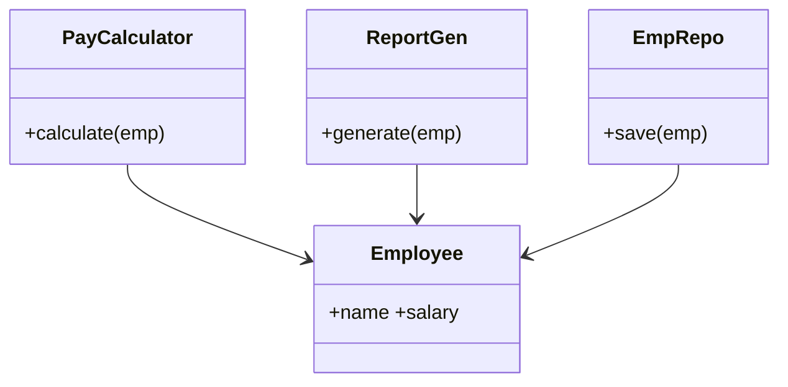
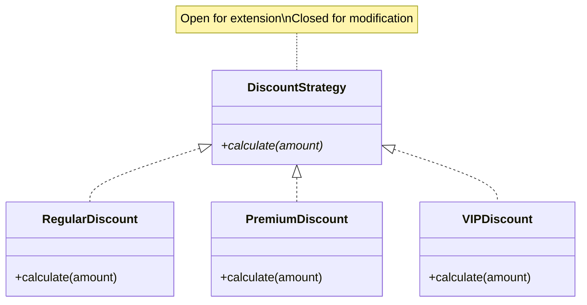
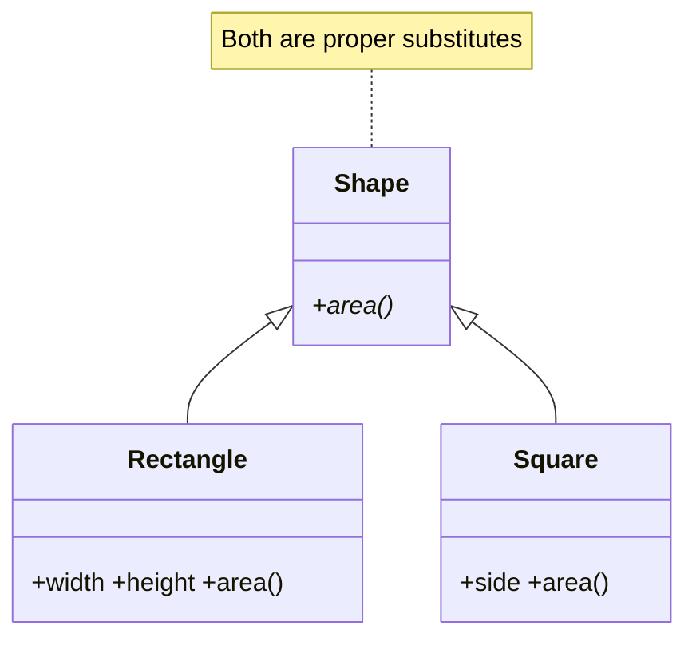
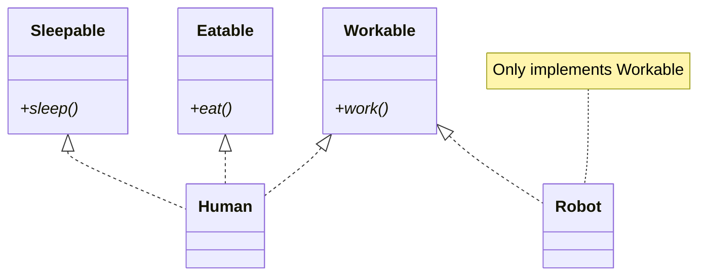
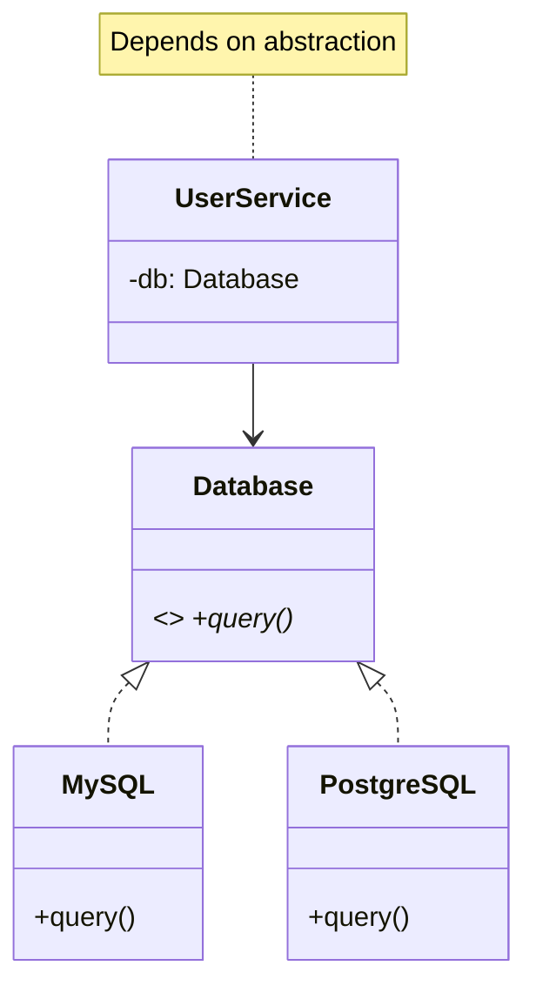
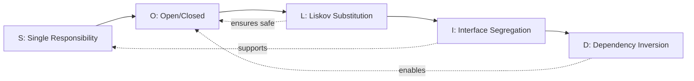

# SOLID Principles Cheat Sheet

> Quick reference with violation detection, mini code examples, and visual diagrams.

---

## At a Glance

| Letter | Principle                  | One-Liner                                                    |
|--------|----------------------------|--------------------------------------------------------------|
| **S**  | Single Responsibility      | A class should have only one reason to change                |
| **O**  | Open/Closed                | Open for extension, closed for modification                  |
| **L**  | Liskov Substitution        | Subtypes must be substitutable for their base types          |
| **I**  | Interface Segregation      | No client should be forced to depend on methods it doesn't use |
| **D**  | Dependency Inversion       | Depend on abstractions, not concretions                      |

---

## S — Single Responsibility Principle (SRP)

**Definition:** A class should have only one reason to change — one job, one actor.

**BAD:**
```python
class Employee:
    def calculate_pay(self): ...     # Accounting owns this
    def generate_report(self): ...   # Reporting owns this
    def save_to_db(self): ...        # DBA owns this
```

**GOOD:**
```python
class Employee:           pass  # Data only
class PayCalculator:      def calculate(self, emp): ...
class ReportGenerator:    def generate(self, emp): ...
class EmployeeRepository: def save(self, emp): ...
```

**Smell Test — You're violating SRP if:**
- [ ] Class name contains "And" or "Manager" or "Handler" with 10+ methods
- [ ] You change the class for unrelated reasons
- [ ] Class imports from 5+ unrelated modules
- [ ] Class has methods used by different stakeholders

**Diagram:**


---

## O — Open/Closed Principle (OCP)

**Definition:** Software entities should be open for extension, closed for modification.

**BAD:**
```python
class DiscountCalculator:
    def calculate(self, customer_type, amount):
        if customer_type == "regular": return amount * 0.1
        elif customer_type == "premium": return amount * 0.2
        # Must MODIFY this class for every new type!
```

**GOOD:**
```python
class DiscountStrategy(ABC):
    @abstractmethod
    def calculate(self, amount): ...

class RegularDiscount(DiscountStrategy):
    def calculate(self, amount): return amount * 0.1

class PremiumDiscount(DiscountStrategy):
    def calculate(self, amount): return amount * 0.2

# Add new types WITHOUT modifying existing code:
class VIPDiscount(DiscountStrategy):
    def calculate(self, amount): return amount * 0.3
```

**Smell Test — You're violating OCP if:**
- [ ] Adding a new type requires modifying existing `if/elif/else` or `switch`
- [ ] You fear touching existing code when adding new features
- [ ] Multiple places change when adding a new variant
- [ ] You see comments like `# Add new types here`

**Diagram:**


---

## L — Liskov Substitution Principle (LSP)

**Definition:** Objects of a superclass should be replaceable with objects of a subclass without breaking correctness.

**BAD:**
```python
class Rectangle:
    def set_width(self, w):  self.width = w
    def set_height(self, h): self.height = h
    def area(self): return self.width * self.height

class Square(Rectangle):
    def set_width(self, w):  self.width = self.height = w  # BREAKS!
    def set_height(self, h): self.width = self.height = h  # BREAKS!
```

**GOOD:**
```python
class Shape(ABC):
    @abstractmethod
    def area(self) -> float: ...

class Rectangle(Shape):
    def __init__(self, w, h): self.width, self.height = w, h
    def area(self): return self.width * self.height

class Square(Shape):
    def __init__(self, side): self.side = side
    def area(self): return self.side ** 2
```

**Smell Test — You're violating LSP if:**
- [ ] Subclass overrides a method to throw `NotImplementedError`
- [ ] Subclass weakens postconditions or strengthens preconditions
- [ ] Tests that pass for parent fail for child
- [ ] You check `isinstance()` before calling a method

**Diagram:**


**Key Rule:** If it looks like a duck but needs batteries, you broke LSP.

---

## I — Interface Segregation Principle (ISP)

**Definition:** No client should be forced to depend on methods it doesn't use.

**BAD:**
```python
class Worker(ABC):
    @abstractmethod
    def work(self): ...
    @abstractmethod
    def eat(self): ...     # Robots don't eat!
    @abstractmethod
    def sleep(self): ...   # Robots don't sleep!
```

**GOOD:**
```python
class Workable(ABC):
    @abstractmethod
    def work(self): ...

class Eatable(ABC):
    @abstractmethod
    def eat(self): ...

class Human(Workable, Eatable):
    def work(self): ...
    def eat(self): ...

class Robot(Workable):  # Only implements what it needs
    def work(self): ...
```

**Smell Test — You're violating ISP if:**
- [ ] Classes implement methods with `pass` or `raise NotImplementedError`
- [ ] Interface has 10+ methods and most implementors only use a few
- [ ] Changing one method forces recompilation of unrelated clients
- [ ] You see "fat" interfaces that try to do everything

**Diagram:**


---

## D — Dependency Inversion Principle (DIP)

**Definition:** High-level modules should not depend on low-level modules. Both should depend on abstractions.

**BAD:**
```python
class MySQLDatabase:
    def query(self, sql): ...

class UserService:
    def __init__(self):
        self.db = MySQLDatabase()  # Concrete dependency!
```

**GOOD:**
```python
class Database(ABC):
    @abstractmethod
    def query(self, sql): ...

class MySQLDatabase(Database):
    def query(self, sql): ...

class UserService:
    def __init__(self, db: Database):  # Depends on abstraction!
        self.db = db

# Inject: UserService(MySQLDatabase())
```

**Smell Test — You're violating DIP if:**
- [ ] High-level class instantiates low-level classes directly (`self.x = ConcreteClass()`)
- [ ] Changing database/API/framework requires modifying business logic
- [ ] You can't unit test without real dependencies
- [ ] Import statements bring in concrete implementations into business modules

**Diagram:**


---

## SOLID Violation Detector Checklist

Answer these yes/no questions for any class you write:

### Quick Scan (takes 30 seconds)

| #  | Question                                                          | If YES...            |
|----|-------------------------------------------------------------------|----------------------|
| 1  | Does the class have more than one reason to change?               | Violates **SRP**     |
| 2  | Do you need to modify existing code to add new behavior?          | Violates **OCP**     |
| 3  | Can a subclass NOT be used wherever the parent is used?           | Violates **LSP**     |
| 4  | Are implementors forced to have empty/stub methods?               | Violates **ISP**     |
| 5  | Does a high-level module directly create low-level objects?       | Violates **DIP**     |

### Deep Scan (takes 2 minutes)

| #  | Question                                                          | If YES...            |
|----|-------------------------------------------------------------------|----------------------|
| 6  | Does the class have > 200 lines?                                  | Likely **SRP**       |
| 7  | Is there a long `if/elif/else` chain based on type?               | Likely **OCP**       |
| 8  | Does a subclass throw NotImplementedError for inherited methods?  | Likely **LSP + ISP** |
| 9  | Does an interface have > 5 methods?                               | Likely **ISP**       |
| 10 | Is the class hard to unit test without a real DB/API?             | Likely **DIP**       |
| 11 | Does the constructor create its own dependencies?                 | Likely **DIP**       |
| 12 | Do you use `isinstance()` checks frequently?                     | Likely **OCP + LSP** |

---

## SOLID Relationship Map



**How they connect:**
- SRP makes classes small enough to extend (supports OCP)
- OCP relies on LSP to ensure extensions are safe
- ISP keeps interfaces small (supports SRP at interface level)
- DIP enables OCP by depending on abstractions

---

## One-Line Mnemonics

| Principle | Mnemonic                                       |
|-----------|-------------------------------------------------|
| SRP       | "A class should do one thing and do it well"   |
| OCP       | "Add new code, don't change old code"          |
| LSP       | "Children should behave like their parents"    |
| ISP       | "Don't make clients pay for what they don't use"|
| DIP       | "Program to interfaces, not implementations"   |

---

*Last updated: 2026-02-06 | Interview-ready cheat sheet*
