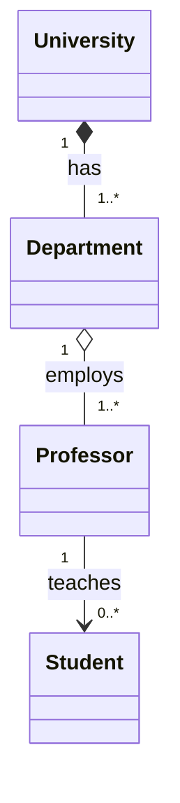
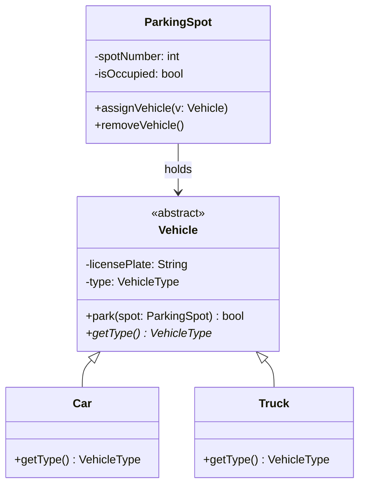
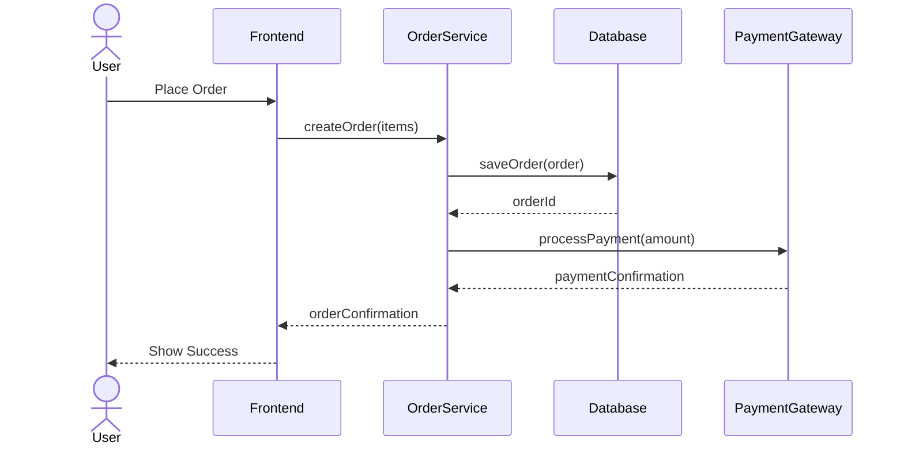
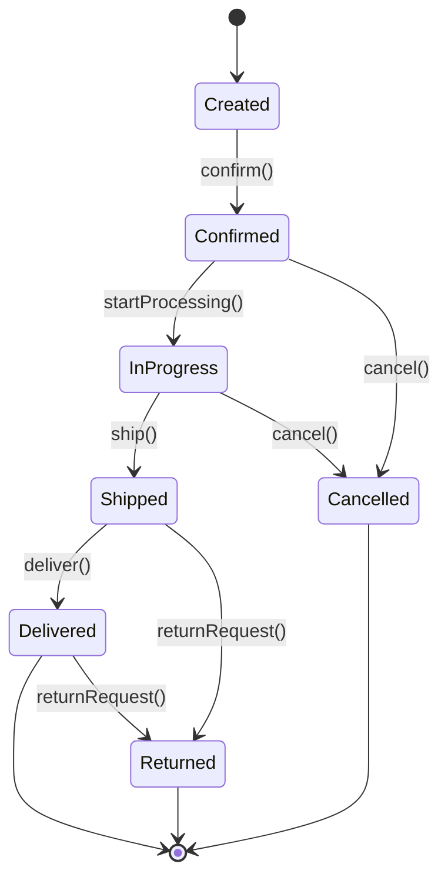
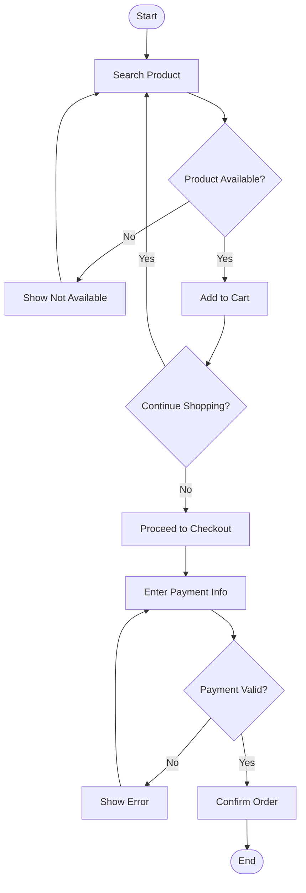
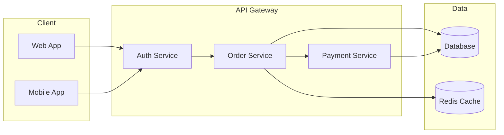

# UML Cheat Sheet

> Quick visual reference for UML notation, relationships, and diagrams used in LLD interviews.

---

## All Relationship Types at a Glance

| Relationship      | Symbol        | Mermaid Syntax     | Meaning                              | Strength |
|-------------------|---------------|---------------------|--------------------------------------|----------|
| Association       | ———>          | `A --> B`           | A uses/knows B                       | Weak     |
| Dependency        | - - - ->      | `A ..> B`           | A temporarily uses B                 | Weakest  |
| Aggregation       | ◇———>         | `A o-- B`           | A has B (B can exist without A)      | Medium   |
| Composition       | ◆———>         | `A *-- B`           | A owns B (B dies with A)             | Strong   |
| Inheritance       | ———▷          | `A <\|-- B`         | B is-a A (extends)                   | Strongest|
| Realization       | - - -▷        | `A <\|.. B`         | B implements A (interface)           | Strong   |

### Memory Aid

```
Dependency:    "uses temporarily"     (..>)   dashed arrow
Association:   "uses / knows"         (-->)   solid arrow
Aggregation:   "has-a (shared)"       (o--)   empty diamond
Composition:   "has-a (owned)"        (*--)   filled diamond
Inheritance:   "is-a (extends)"       (<|--)  empty triangle
Realization:   "implements"           (<|..)  dashed triangle
```

---

## Visibility and Modifiers

| Symbol | Meaning    | Java         | Python           |
|--------|------------|--------------|------------------|
| `+`    | Public     | `public`     | `self.name`      |
| `-`    | Private    | `private`    | `self.__name`    |
| `#`    | Protected  | `protected`  | `self._name`     |
| `~`    | Package    | (default)    | N/A              |

### Static and Abstract Notation

| Notation          | Meaning             | Mermaid           |
|-------------------|---------------------|-------------------|
| _underline_       | Static member       | `+method()$`      |
| *italic*          | Abstract            | `+method()*`      |
| `<<interface>>`   | Interface           | `class I { <<interface>> }` |
| `<<abstract>>`    | Abstract class      | `class A { <<abstract>> }`  |
| `<<enum>>`        | Enumeration         | `class E { <<enum>> }`      |

---

## Multiplicity Notation

| Notation  | Meaning                |
|-----------|------------------------|
| `1`       | Exactly one            |
| `0..1`    | Zero or one (optional) |
| `*`       | Zero or more           |
| `1..*`    | One or more            |
| `n..m`    | Between n and m        |

### Example with multiplicity:


---

## Which Diagram for Which Interview Question?

| Question Type                          | Diagram to Use       | Focus On              |
|----------------------------------------|---------------------|-----------------------|
| "Design a parking lot"                 | Class Diagram       | Classes, relationships|
| "How does checkout work?"              | Sequence Diagram    | Object interactions   |
| "What states can an order have?"       | State Diagram       | State transitions     |
| "Walk me through the booking flow"     | Activity Diagram    | Workflow / decisions  |
| "What components does the system have?"| Component Diagram   | High-level modules    |
| "How are objects created?"             | Sequence + Class    | Factory patterns      |

**Rule of thumb:** Start with Class Diagram (always), add Sequence for complex flows, State for objects with lifecycle.

---

## Template 1: Class Diagram (Most Common)



---

## Template 2: Sequence Diagram (Show Interactions)



---

## Template 3: State Diagram (Object Lifecycle)



---

## Template 4: Activity Diagram (Workflow)



---

## Template 5: Component Diagram (System Overview)



---

## Class Diagram Notation Quick Reference

### Class Box Format
```
+---------------------------+
|      <<stereotype>>       |
|       ClassName            |
+---------------------------+
| -privateField: Type       |
| #protectedField: Type     |
| +publicField: Type        |
+---------------------------+
| +publicMethod(): RetType  |
| -privateMethod(): void    |
| #protectedMethod()*       |  <- abstract
| +staticMethod()$          |  <- static
+---------------------------+
```

### Mermaid Class Syntax Reference
```
class ClassName {
    <<interface>>
    -privateAttr: String
    #protectedAttr: int
    +publicAttr: bool
    +method() ReturnType
    +abstractMethod()* ReturnType
    +staticMethod()$ ReturnType
}
```

---

## Relationship Selection Quick Guide

```
Q: Does B exist independently of A?
├── Yes: Association (-->)  or  Aggregation (o--)
│   └── Q: Does A have a collection of B?
│       ├── Yes: Aggregation (o--)
│       └── No: Association (-->)
└── No: Composition (*--)

Q: Is B a kind of A?
├── Yes, and A is a class: Inheritance (<|--)
└── Yes, and A is an interface: Realization (<|..)

Q: Does A just call a method on B briefly?
└── Yes: Dependency (..>)
```

---

## Common Mistakes in UML Interviews

| Mistake                                | Fix                                         |
|----------------------------------------|---------------------------------------------|
| Using inheritance when composition fits | Ask "is-a" vs "has-a"                       |
| Missing multiplicity labels            | Always label: 1, 0..1, *, 1..*             |
| Too many classes in one diagram        | Focus on 5-8 core classes                   |
| No interface/abstract classes          | Use them for Strategy, Factory patterns     |
| Forgetting access modifiers            | Default to private fields, public methods   |
| Missing method return types            | Always show: `+method(): RetType`           |
| No diagram for flows                   | Add Sequence diagram for key interactions   |

---

## Mermaid Syntax Quick Reference

```
%% Class Diagram
classDiagram
    A <|-- B           %% Inheritance
    A <|.. B           %% Realization (interface)
    A *-- B            %% Composition
    A o-- B            %% Aggregation
    A --> B            %% Association
    A ..> B            %% Dependency
    A -- B             %% Link (no direction)
    A "1" --> "0..*" B %% With multiplicity

%% Sequence Diagram
sequenceDiagram
    A->>B: Sync call
    B-->>A: Response
    A-)B: Async call
    Note over A,B: Comment

%% State Diagram
stateDiagram-v2
    [*] --> StateA
    StateA --> StateB : event
    StateB --> [*]

%% Flowchart (Activity Diagram)
flowchart TD
    A[Action] --> B{Decision}
    B -->|Yes| C[Action]
    B -->|No| D[Action]
```

---

*Last updated: 2026-02-06 | Interview-ready cheat sheet*
