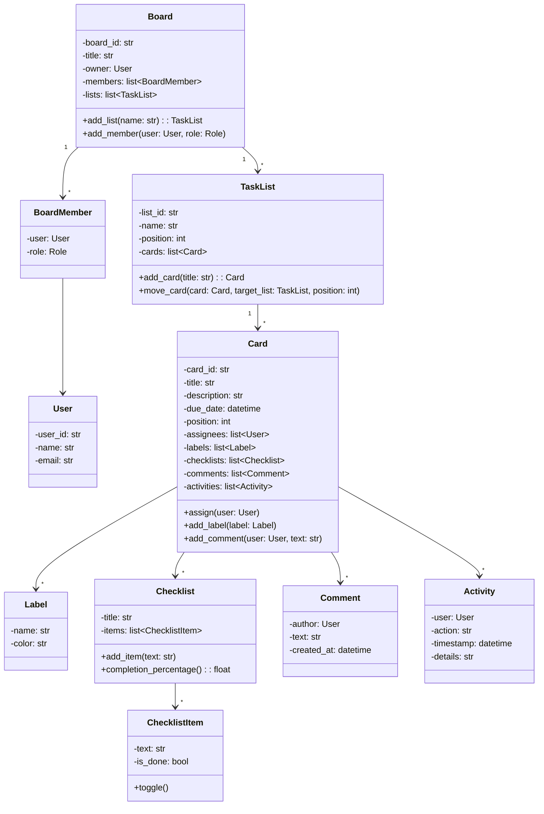
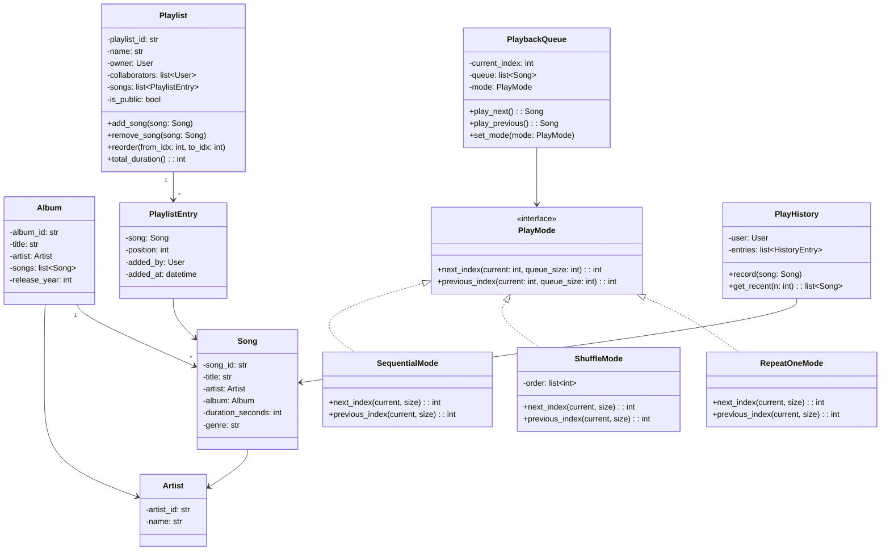
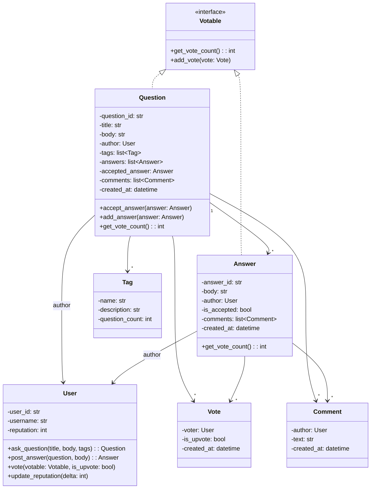
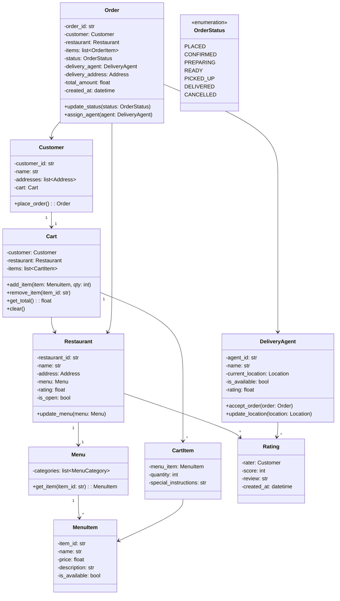
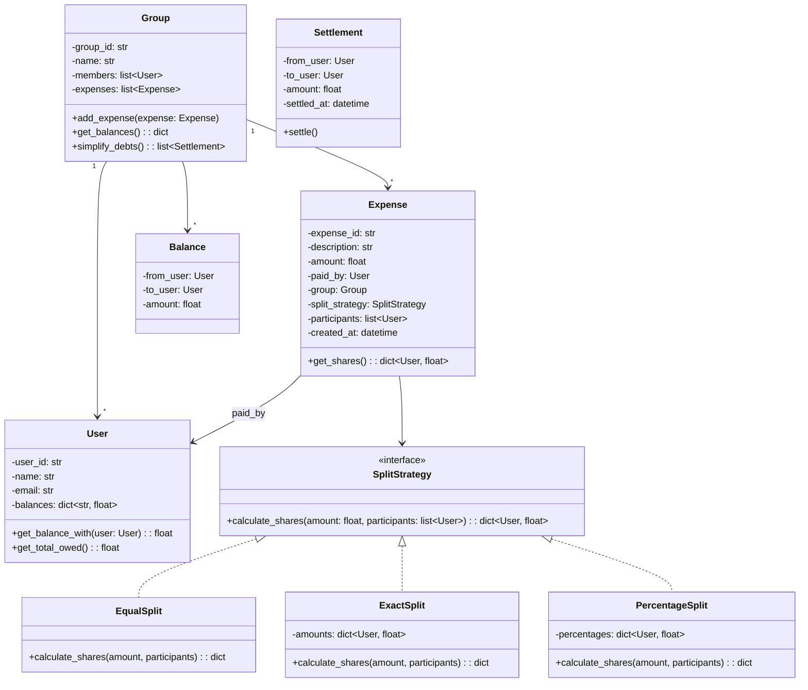
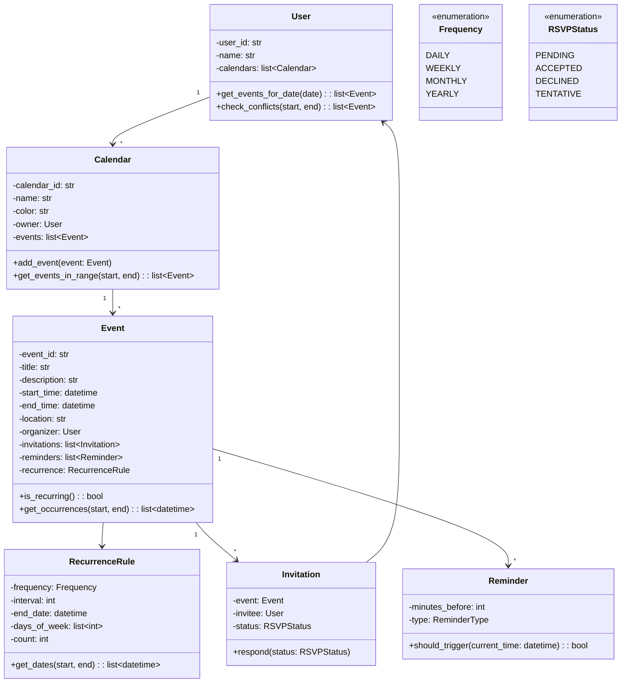
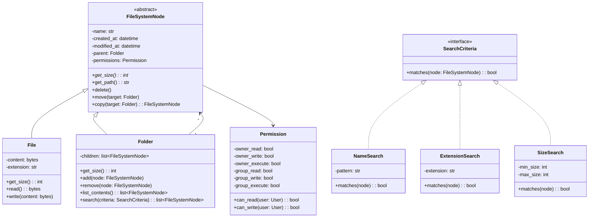
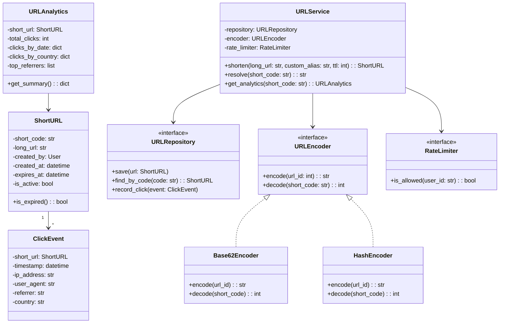
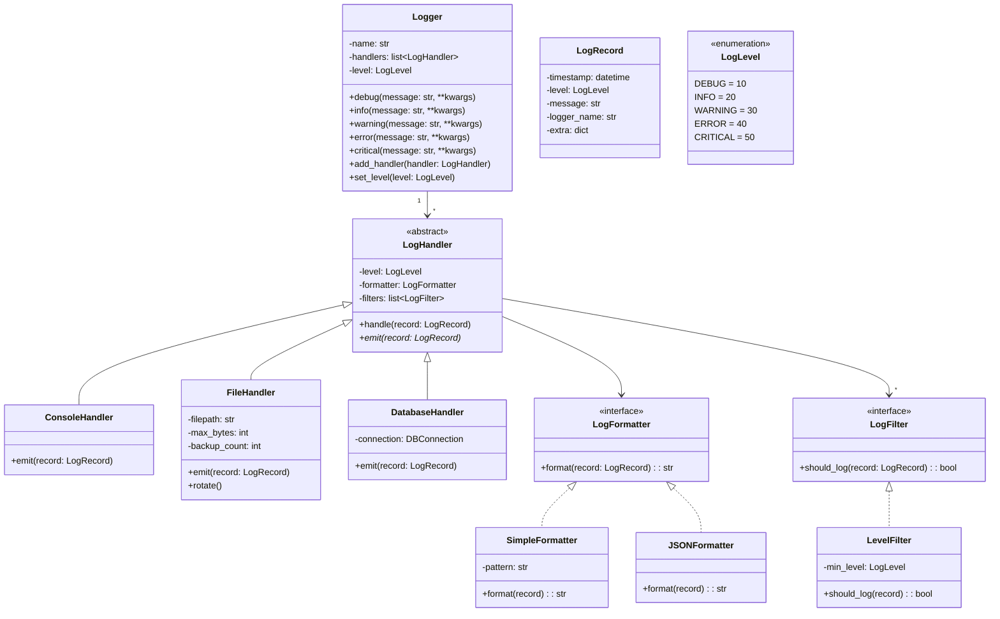
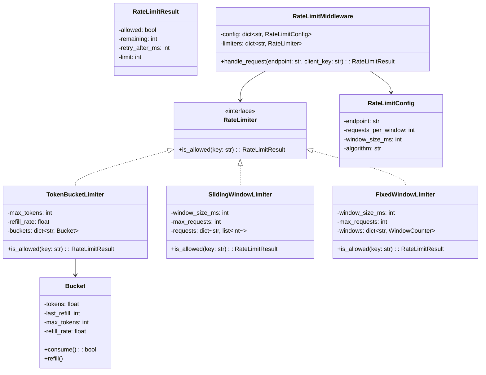

# LLD Mini Problem Exercises

10 mini LLD problems designed as 15-minute exercises. Each focuses on identifying key classes, relationships, and design patterns.

---

## Problem 1: Task Management System (Trello-like)

### Requirements
- Users can create boards, each containing multiple lists
- Lists contain cards (tasks) that can be moved between lists
- Cards have title, description, due date, assignees, labels, and checklists
- Users can comment on cards
- Support drag-and-drop reordering within and across lists
- Activity history for all changes on a card

### Key Classes to Identify

Click to reveal hints

- Board, List, Card — core domain objects
- User — with roles (owner, member, viewer)
- Comment — linked to card and user
- Label — reusable across cards
- Checklist and ChecklistItem — nested in card
- Activity — audit log entry

### Solution

### Design Decisions
- **Composite potential:** Checklists within cards are a lightweight composite
- **Observer pattern:** Activity log acts as an observer, recording all card mutations
- **Position field:** Enables drag-and-drop reordering without restructuring the list
- **BoardMember vs User:** Separates user identity from board-specific role

---

## Problem 2: Playlist Manager

### Requirements
- Users can create, rename, and delete playlists
- Songs have title, artist, album, duration, and genre
- Playlists support add, remove, and reorder songs
- Play modes: sequential, shuffle, repeat-one, repeat-all
- Recently played history tracked per user
- Collaborative playlists (multiple editors)

### Key Classes to Identify

Click to reveal hints

- Song, Artist, Album — core music entities
- Playlist — collection of songs with ordering
- PlaybackQueue — current playback state with mode
- PlayMode (Strategy) — shuffle, sequential, repeat
- PlayHistory — recently played songs

### Solution

### Design Decisions
- **Strategy pattern** for PlayMode: Easily swap playback behavior
- **PlaylistEntry** wraps Song with metadata (position, who added it, when)
- **PlaybackQueue** is separate from Playlist — a queue is ephemeral runtime state
- **PlayHistory** is per-user, decoupled from playback logic

---

## Problem 3: Stack Overflow (Q&A Platform)

### Requirements
- Users can post questions with tags and descriptions
- Other users post answers; one answer can be accepted
- Voting (upvote/downvote) on questions and answers
- Users earn reputation based on votes
- Tags for categorization with search support
- Comments on questions and answers

### Key Classes to Identify

Click to reveal hints

- Question, Answer — core content types
- User — with reputation system
- Vote — tracks who voted on what
- Tag — shared across questions
- Comment — attached to questions or answers
- Votable (interface) — shared between Question and Answer

### Solution

### Design Decisions
- **Votable interface:** Both Question and Answer share voting behavior (ISP)
- **Reputation is derived:** Upvotes on your content increase rep (+10 for question, +15 for answer accepted)
- **Accepted answer** is a single reference on Question, not a flag on all answers
- **Observer pattern opportunity:** Notify question author when a new answer is posted

### Applicable Patterns
- **Observer:** Notify on new answers, votes, comments
- **Strategy:** Ranking algorithms for answers (by votes, by date, by acceptance)
- **Template Method:** Common voting logic shared between Question and Answer

---

## Problem 4: Food Delivery System

### Requirements
- Restaurants register with menus containing items and prices
- Customers browse restaurants, add items to cart, place orders
- Orders go through status changes: placed, confirmed, preparing, picked up, delivered
- Delivery agents assigned to orders based on location
- Rating system for restaurants and delivery agents
- Estimated delivery time calculation

### Key Classes to Identify

Click to reveal hints

- Restaurant, Menu, MenuItem — food catalog
- Customer, DeliveryAgent — user types
- Cart, CartItem — pre-order state
- Order, OrderItem — placed order
- OrderStatus (State pattern) — lifecycle
- Rating — shared across restaurants and agents

### Solution

### Design Decisions
- **Cart is per-customer, single-restaurant:** Simplifies ordering; clear on checkout
- **State pattern** for OrderStatus: Each state defines valid transitions
- **Strategy pattern** for agent assignment: Nearest agent, round-robin, load-balanced
- **Observer pattern:** Notify customer on status changes, notify agent on new orders

---

## Problem 5: Splitwise (Expense Sharing)

### Requirements
- Users create groups with members
- Members add expenses with amounts and who paid
- Split types: equal, exact amounts, percentage-based
- Track balances between every pair of users
- Simplify debts (minimize number of transactions to settle)
- Transaction history and settlement tracking

### Key Classes to Identify

Click to reveal hints

- User — with balance tracking
- Group — collection of users
- Expense — who paid, how much, how to split
- SplitStrategy (Strategy pattern) — equal, exact, percentage
- Balance — tracks net amounts between user pairs
- Settlement — records debt payments

### Solution

### Design Decisions
- **Strategy pattern** for split types: Each split algorithm is interchangeable
- **Balance simplification:** Use a greedy algorithm — find max creditor and max debtor, settle between them, repeat
- **Expense stores split strategy:** Each expense can have a different split approach
- **Group-scoped balances:** Balances are tracked per group to avoid cross-group confusion

---

## Problem 6: Calendar Application

### Requirements
- Users create events with title, time, location, and attendees
- Support recurring events (daily, weekly, monthly, custom)
- Reminders at configurable times before events
- Conflict detection for overlapping events
- Multiple calendars per user (work, personal)
- RSVP for event invitations (accept, decline, tentative)

### Key Classes to Identify

Click to reveal hints

- Calendar, Event — core entities
- RecurrenceRule — defines repeat pattern
- Reminder — notification before event
- Invitation — RSVP tracking
- TimeSlot — for conflict detection

### Solution

### Applicable Patterns
- **Strategy:** Different recurrence rules (daily, weekly, custom)
- **Observer:** Notify attendees on event changes, trigger reminders
- **Iterator:** Iterate over recurring event occurrences

---

## Problem 7: File System

### Requirements
- Files have name, size, content, and permissions
- Folders can contain files or other folders (nested)
- Permissions: read, write, execute for owner/group/others
- Search by name, extension, or size
- Calculate total size of a folder (recursive)
- Copy, move, delete operations

### Key Classes to Identify

Click to reveal hints

- FileSystemNode (abstract) — shared interface
- File, Folder — composite pattern
- Permission — read/write/execute
- SearchCriteria — for flexible file search

### Solution

### Applicable Patterns
- **Composite:** File and Folder share interface; Folder contains children
- **Strategy:** SearchCriteria implementations for flexible search
- **Visitor:** Could traverse the tree applying operations (size calc, permission check)

---

## Problem 8: URL Shortener

### Requirements
- Generate short URLs from long URLs
- Redirect short URL to original long URL
- Track click analytics (count, referrer, geo, timestamp)
- Custom aliases (user-defined short codes)
- URL expiration after a configurable TTL
- Rate limiting for URL creation

### Key Classes to Identify

Click to reveal hints

- URL (ShortURL) — maps short code to long URL
- URLEncoder — generates short codes (Strategy)
- ClickEvent — analytics per click
- RateLimiter — limits creation frequency
- ExpirationPolicy — TTL management

### Solution

### Design Decisions
- **Strategy for encoding:** Base62 (compact) vs. hash-based (unpredictable)
- **Repository abstraction:** Switch between Redis, SQL, NoSQL
- **ClickEvent is append-only:** High write throughput for analytics
- **Rate limiter as dependency:** Can swap token bucket, sliding window, etc.

---

## Problem 9: Logging Framework

### Requirements
- Log messages at levels: DEBUG, INFO, WARNING, ERROR, CRITICAL
- Multiple output destinations: console, file, database, remote server
- Configurable log format (timestamp, level, message, source)
- Log filtering by level threshold
- Support for structured logging (key-value pairs)
- Log rotation for file-based logging

### Key Classes to Identify

Click to reveal hints

- Logger — main entry point
- LogHandler (abstract) — output destinations
- LogFormatter — controls output format
- LogLevel — enumeration with ordering
- LogRecord — single log entry
- LogFilter — determines if a record should be processed

### Solution

### Applicable Patterns
- **Chain of Responsibility:** Logger hierarchy (child -> parent propagation)
- **Strategy:** Formatters and filters are interchangeable strategies
- **Observer:** Handlers are observers of log events
- **Template Method:** LogHandler.handle() does filtering, then calls abstract emit()

---

## Problem 10: Rate Limiter

### Requirements
- Limit API requests per user/IP to a configured threshold
- Support multiple algorithms: token bucket, sliding window, fixed window
- Configurable limits per API endpoint
- Return remaining quota information in responses
- Distributed rate limiting across multiple servers
- Graceful handling when limit is exceeded (return 429 with retry-after)

### Key Classes to Identify

Click to reveal hints

- RateLimiter (interface) — check if request is allowed
- TokenBucketLimiter — refills tokens at fixed rate
- SlidingWindowLimiter — counts requests in rolling window
- FixedWindowLimiter — counts per fixed time window
- RateLimitConfig — per-endpoint configuration
- RateLimitResult — allowed/denied with metadata

### Solution

### Design Decisions
- **Strategy pattern:** Swap algorithms per endpoint without changing middleware
- **RateLimitResult:** Rich response object includes remaining quota and retry hint
- **Key-based limiting:** Same algorithm, different keys (user ID, IP, API key)
- **Distributed extension:** Replace in-memory dict with Redis for multi-server support

### Algorithm Comparison

| Algorithm | Pros | Cons |
|-----------|------|------|
| Token Bucket | Smooth, allows bursts | Memory per bucket |
| Sliding Window | Accurate, no boundary issues | More memory (stores timestamps) |
| Fixed Window | Simple, low memory | Allows 2x burst at window boundary |
