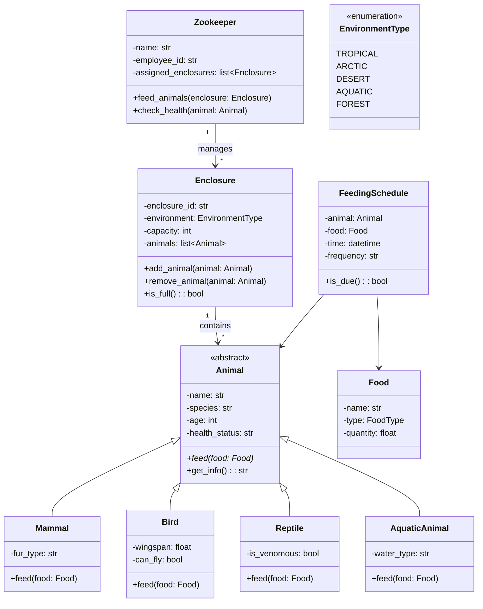
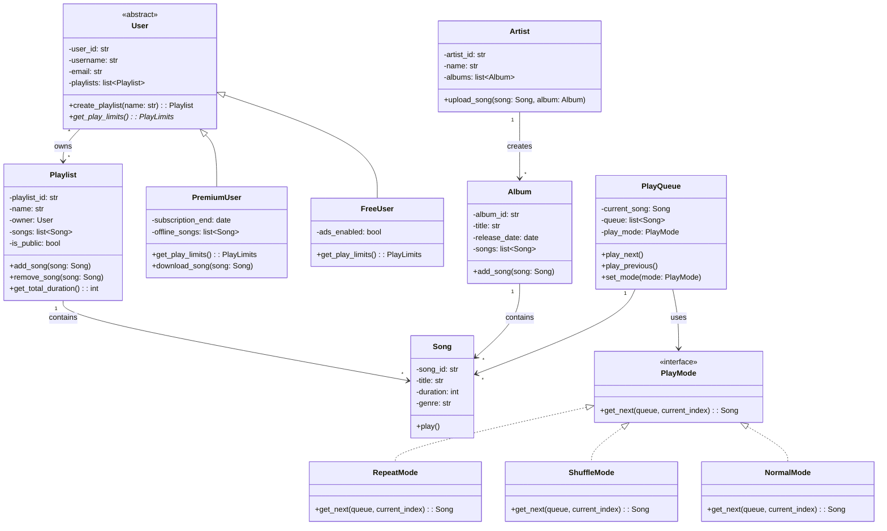
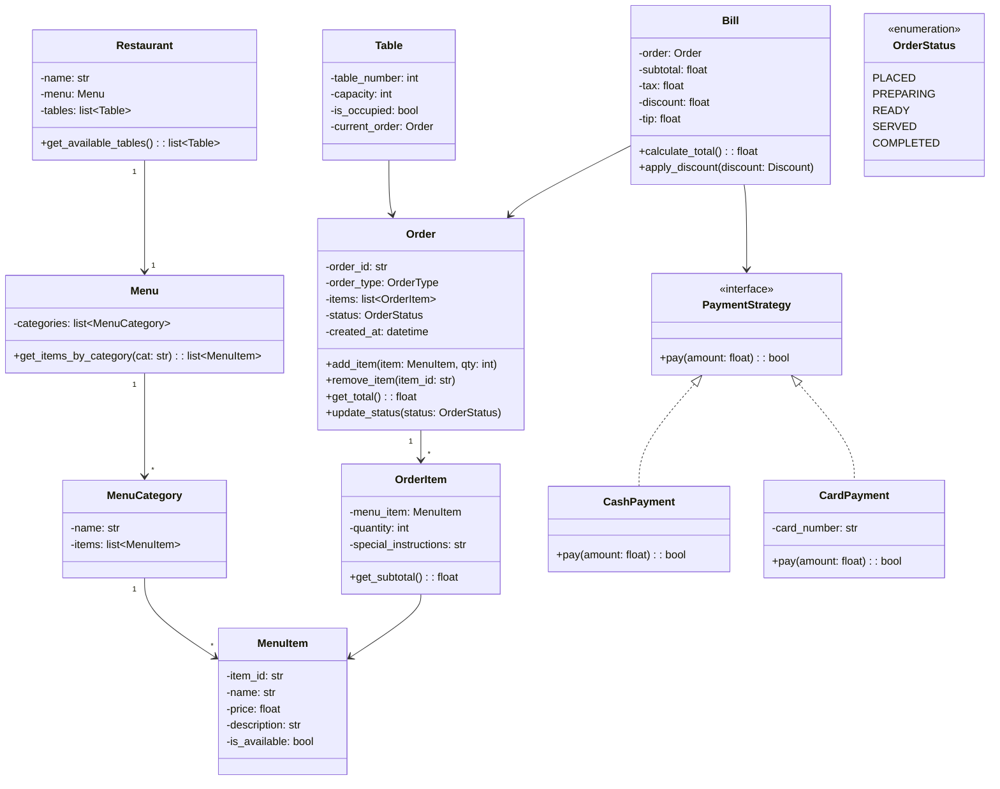
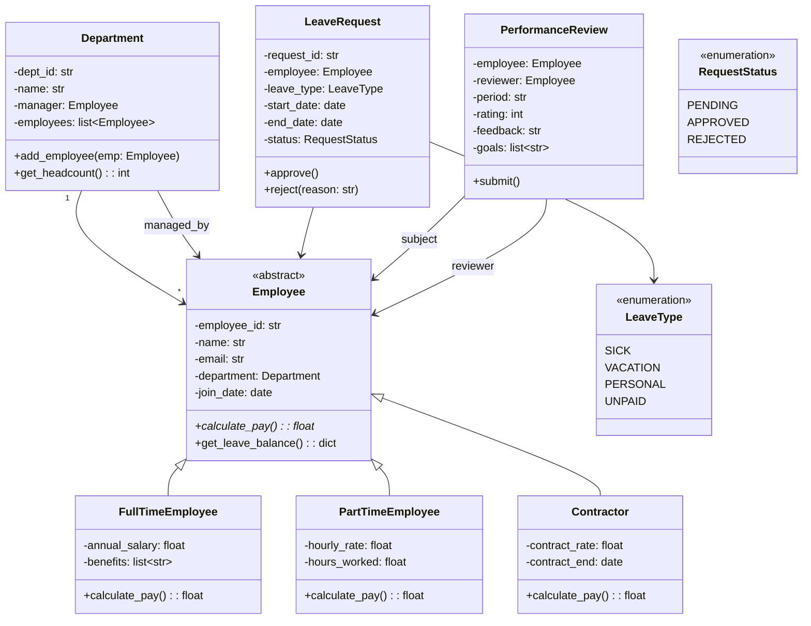
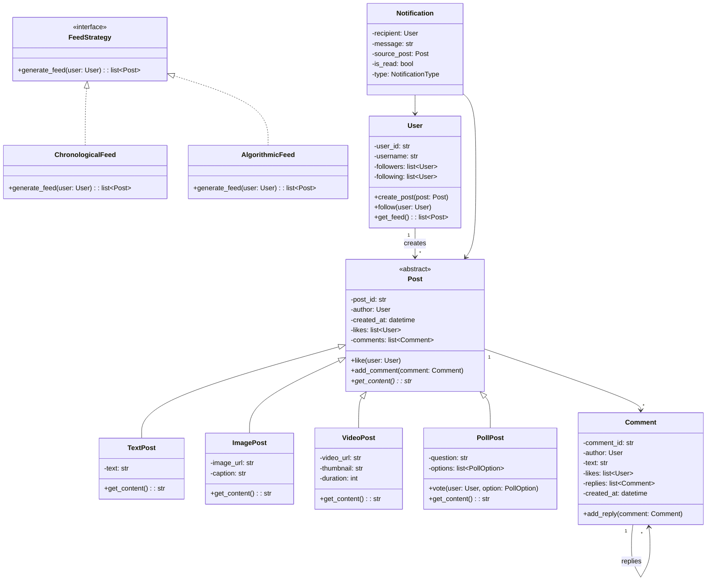

# OOP Practice Exercises

## Section A: Concept Questions

### Q1: What is the difference between abstraction and encapsulation?
**Options:**
- A) They are the same thing
- B) Abstraction hides complexity; encapsulation hides data
- C) Encapsulation is about inheritance; abstraction is about polymorphism
- D) Abstraction is a language feature; encapsulation is a design concept

**Answer:** B) Abstraction hides unnecessary complexity by exposing only relevant details (e.g., an interface with `drive()` hides engine internals). Encapsulation bundles data and methods together and restricts direct access to internal state (e.g., private fields with getters/setters).

---

### Q2: Which of the following is NOT a benefit of polymorphism?
- A) Code reusability
- B) Loose coupling
- C) Faster execution at runtime
- D) Extensibility without modifying existing code

**Answer:** C) Polymorphism (especially dynamic dispatch) actually adds a small runtime overhead. The benefits are design-related: reusability, loose coupling, and extensibility.

---

### Q3: When should you prefer composition over inheritance?
- A) When there is a clear "is-a" relationship
- B) When you want to reuse behavior from multiple sources
- C) When the parent class will never change
- D) When you need compile-time type checking

**Answer:** B) Composition lets you combine behaviors from multiple objects, avoiding the diamond problem and rigid hierarchies. Use inheritance for genuine "is-a" relationships; use composition for "has-a" or to mix capabilities.

---

### Q4: What is the output of this code?

```python
class Animal:
    def speak(self):
        return "..."

class Dog(Animal):
    def speak(self):
        return "Woof!"

class Cat(Animal):
    def speak(self):
        return "Meow!"

animals = [Dog(), Cat(), Dog(), Cat()]
print([a.speak() for a in animals])
```

**Answer:** `['Woof!', 'Meow!', 'Woof!', 'Meow!']` — This demonstrates runtime polymorphism. Each object's `speak()` method is resolved based on the actual object type, not the declared type.

---

### Q5: What is method overloading vs method overriding?

**Answer:**
- **Overloading:** Same method name, different parameter signatures, resolved at compile time. Python doesn't natively support overloading (uses default args or `*args`).
- **Overriding:** Subclass provides a specific implementation of a method already defined in its superclass, resolved at runtime.

---

### Q6: What is the purpose of the `super()` function in Python?

**Answer:** `super()` returns a proxy object that delegates method calls to a parent or sibling class. It is essential for:
1. Calling the parent class constructor: `super().__init__()`
2. Extending (not replacing) parent behavior
3. Supporting cooperative multiple inheritance via MRO (Method Resolution Order)

---

### Q7: What is the diamond problem? How does Python solve it?

**Answer:** The diamond problem occurs when a class inherits from two classes that share a common ancestor, creating ambiguity about which path to follow. Python uses C3 Linearization (MRO) to create a deterministic, consistent order for method resolution. You can inspect it with `ClassName.__mro__`.

---

### Q8: What is the difference between an abstract class and an interface?

**Answer:**
| Feature | Abstract Class | Interface (Protocol in Python) |
|---------|---------------|-------------------------------|
| Can have implementation | Yes | No (traditionally) |
| State (instance variables) | Yes | No |
| Multiple inheritance | Language-dependent | Typically yes |
| Purpose | Shared base with partial impl | Pure contract/capability |

In Python, `ABC` provides abstract classes; `Protocol` (typing module) provides structural subtyping (interfaces).

---

### Q9: Explain the Liskov Substitution Principle in simple terms.

**Answer:** Any code that works with a parent class should also work correctly with any of its subclasses without knowing the difference. If `Square` inherits from `Rectangle`, then everywhere you use a `Rectangle`, a `Square` should work without breaking expectations.

---

### Q10: What is the difference between `__str__` and `__repr__` in Python?

**Answer:**
- `__repr__`: Unambiguous representation for developers/debugging. Should ideally be valid Python to recreate the object.
- `__str__`: Human-readable representation for end users.
- `print()` calls `__str__`; the interactive interpreter calls `__repr__`.
- If `__str__` is not defined, Python falls back to `__repr__`.

---

## Section B: Code Analysis

### Problem 1: Identify the Issue

```python
class Employee:
    def __init__(self, name, salary, department):
        self.name = name
        self.salary = salary
        self.department = department

    def calculate_bonus(self):
        if self.department == "Engineering":
            return self.salary * 0.15
        elif self.department == "Sales":
            return self.salary * 0.10
        elif self.department == "HR":
            return self.salary * 0.08
        else:
            return self.salary * 0.05

    def generate_report(self):
        return f"Employee: {self.name}, Dept: {self.department}, Bonus: {self.calculate_bonus()}"

    def save_to_database(self):
        print(f"INSERT INTO employees VALUES ('{self.name}', {self.salary})")
```

**Question:** Which OOP/design principle is being violated?

**Answer:** This violates the **Single Responsibility Principle**. The `Employee` class has three reasons to change:
1. Business logic changes (bonus calculation)
2. Report format changes
3. Database schema changes

**Refactored:**
```python
class Employee:
    def __init__(self, name, salary, department):
        self.name = name
        self.salary = salary
        self.department = department

class BonusCalculator:
    RATES = {"Engineering": 0.15, "Sales": 0.10, "HR": 0.08}

    def calculate(self, employee):
        rate = self.RATES.get(employee.department, 0.05)
        return employee.salary * rate

class EmployeeReportGenerator:
    def generate(self, employee, bonus):
        return f"Employee: {employee.name}, Dept: {employee.department}, Bonus: {bonus}"

class EmployeeRepository:
    def save(self, employee):
        # Use parameterized queries in production
        print(f"Saving {employee.name} to database")
```

---

### Problem 2: What's Wrong Here?

```python
class Bird:
    def fly(self):
        return "Flying high!"

    def eat(self):
        return "Eating seeds"

class Eagle(Bird):
    def fly(self):
        return "Soaring through the sky!"

class Penguin(Bird):
    def fly(self):
        raise NotImplementedError("Penguins can't fly!")
```

**Question:** What principle is violated? How to fix?

**Answer:** This violates the **Liskov Substitution Principle**. Code expecting a `Bird` that calls `fly()` will break with `Penguin`. A penguin IS-A bird, but not all birds can fly.

**Refactored:**
```python
from abc import ABC, abstractmethod

class Bird(ABC):
    @abstractmethod
    def eat(self):
        pass

class FlyingBird(Bird):
    @abstractmethod
    def fly(self):
        pass

class Eagle(FlyingBird):
    def fly(self):
        return "Soaring through the sky!"

    def eat(self):
        return "Eating prey"

class Penguin(Bird):
    def eat(self):
        return "Eating fish"

    def swim(self):
        return "Swimming gracefully!"
```

---

### Problem 3: Spot the Encapsulation Issue

```python
class BankAccount:
    def __init__(self, owner, balance):
        self.owner = owner
        self.balance = balance

account = BankAccount("Alice", 1000)
account.balance = -500  # No validation!
print(account.balance)  # -500
```

**Question:** What's wrong and how to fix it?

**Answer:** The `balance` field is publicly accessible, so anyone can set it to an invalid value. **Encapsulation is violated** — internal state is not protected.

**Refactored:**
```python
class BankAccount:
    def __init__(self, owner, balance):
        self._owner = owner
        self._balance = balance

    @property
    def balance(self):
        return self._balance

    @property
    def owner(self):
        return self._owner

    def deposit(self, amount):
        if amount <= 0:
            raise ValueError("Deposit amount must be positive")
        self._balance += amount

    def withdraw(self, amount):
        if amount <= 0:
            raise ValueError("Withdrawal amount must be positive")
        if amount > self._balance:
            raise ValueError("Insufficient funds")
        self._balance -= amount
```

---

### Problem 4: Identify the Relationship

```python
class Engine:
    def start(self):
        return "Engine started"

class Car:
    def __init__(self):
        self.engine = Engine()

    def start(self):
        return self.engine.start()
```

vs.

```python
class Car(Engine):
    def start(self):
        return super().start()
```

**Question:** Which approach is better and why?

**Answer:** The first approach (composition) is better. A `Car` is NOT an `Engine` — it HAS an `Engine`. Benefits:
1. The engine can be swapped (e.g., electric vs. gasoline)
2. `Car` doesn't inherit irrelevant `Engine` internals
3. Changes to `Engine` don't unexpectedly break `Car`
4. You can inject different engine types for testing

---

### Problem 5: What Design Issue Exists?

```python
class Shape:
    def __init__(self, shape_type, **kwargs):
        self.shape_type = shape_type
        self.kwargs = kwargs

    def area(self):
        if self.shape_type == "circle":
            return 3.14 * self.kwargs["radius"] ** 2
        elif self.shape_type == "rectangle":
            return self.kwargs["width"] * self.kwargs["height"]
        elif self.shape_type == "triangle":
            return 0.5 * self.kwargs["base"] * self.kwargs["height"]

    def perimeter(self):
        if self.shape_type == "circle":
            return 2 * 3.14 * self.kwargs["radius"]
        elif self.shape_type == "rectangle":
            return 2 * (self.kwargs["width"] + self.kwargs["height"])
        elif self.shape_type == "triangle":
            return self.kwargs["a"] + self.kwargs["b"] + self.kwargs["c"]
```

**Question:** What principles are violated? Refactor using proper OOP.

**Answer:** Violations:
1. **No polymorphism** — uses conditionals instead of class hierarchy
2. **Open/Closed Principle** — adding a new shape requires modifying existing code
3. **No encapsulation** — raw kwargs with string keys, no validation

**Refactored:**
```python
from abc import ABC, abstractmethod
import math

class Shape(ABC):
    @abstractmethod
    def area(self) -> float:
        pass

    @abstractmethod
    def perimeter(self) -> float:
        pass

class Circle(Shape):
    def __init__(self, radius: float):
        self._radius = radius

    def area(self):
        return math.pi * self._radius ** 2

    def perimeter(self):
        return 2 * math.pi * self._radius

class Rectangle(Shape):
    def __init__(self, width: float, height: float):
        self._width = width
        self._height = height

    def area(self):
        return self._width * self._height

    def perimeter(self):
        return 2 * (self._width + self._height)

class Triangle(Shape):
    def __init__(self, a: float, b: float, c: float):
        self._a, self._b, self._c = a, b, c

    def area(self):
        s = self.perimeter() / 2
        return math.sqrt(s * (s - self._a) * (s - self._b) * (s - self._c))

    def perimeter(self):
        return self._a + self._b + self._c
```

---

## Section C: Design Exercises

### Exercise 1: Zoo Management System

**Problem:** Design a class hierarchy for a zoo that manages different types of animals, their enclosures, feeding schedules, and zookeepers.

**Requirements:**
- Animals have species, name, age, health status
- Different animal types: mammals, birds, reptiles, aquatic
- Enclosures have capacity and environment type
- Zookeepers are assigned to specific enclosures
- Feeding schedules vary by animal type

**Hints:**
- Use abstract base class for Animal
- Think about what behaviors vary (flying, swimming) vs. shared
- Consider composition for enclosure-animal relationship

**Solution:**



---

### Exercise 2: Music Streaming App

**Problem:** Design a class hierarchy for a music streaming application (like Spotify).

**Requirements:**
- Users can be free or premium
- Songs have artist, album, duration, genre
- Playlists are user-created collections of songs
- Support play queue with shuffle and repeat modes
- Artists can upload songs

**Hints:**
- User types suggest inheritance or strategy pattern
- Queue behavior (shuffle/repeat) could use Strategy pattern
- Think about the relationship between Song, Album, and Artist

**Solution:**



---

### Exercise 3: Restaurant Ordering System

**Problem:** Design classes and relationships for a restaurant ordering system.

**Requirements:**
- Menu has categories and items with prices
- Customers can dine-in or order takeout
- Orders contain multiple items with quantities
- Bills include tax, discounts, and tips
- Kitchen receives and tracks order status

**Hints:**
- Order states (placed, preparing, ready, served) suggest State pattern
- Menu item customization could use Decorator
- Payment processing could use Strategy

**Solution:**



---

### Exercise 4: Employee Management System

**Problem:** Design a class hierarchy for an employee management system (like BambooHR).

**Requirements:**
- Different employee types: full-time, part-time, contractor
- Each has different pay calculation logic
- Departments contain employees with a manager
- Leave management (sick, vacation, personal)
- Performance reviews with ratings

**Hints:**
- Employee types with different pay calculation: classic polymorphism
- Department-employee is composition
- Leave types could use inheritance or enumeration

**Solution:**



---

### Exercise 5: Social Media Post System

**Problem:** Design a class hierarchy for a social media platform's post system (like Instagram/Twitter).

**Requirements:**
- Multiple post types: text, image, video, poll
- Users can like, comment, and share posts
- Comments can be nested (replies to comments)
- Feed generation with different algorithms
- Notifications for interactions

**Hints:**
- Post types: abstract base with concrete implementations
- Nested comments: Composite pattern
- Feed algorithms: Strategy pattern
- Notifications: Observer pattern

**Solution:**


