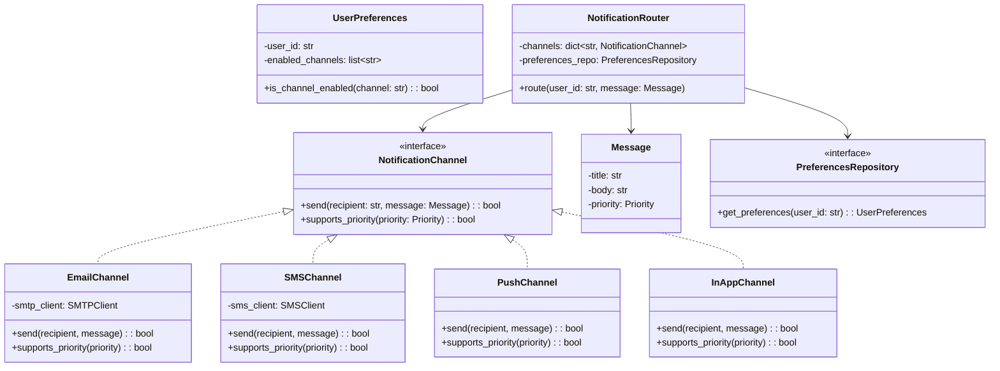
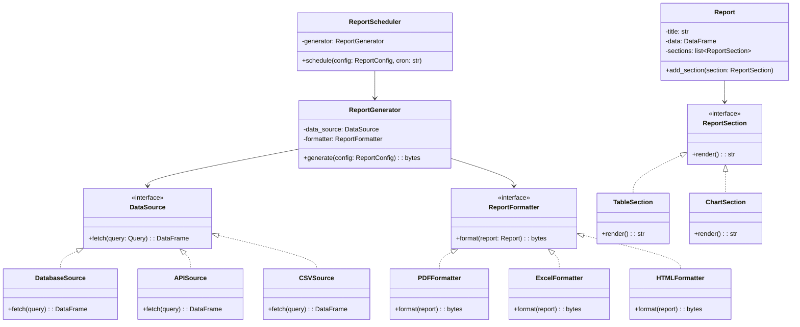
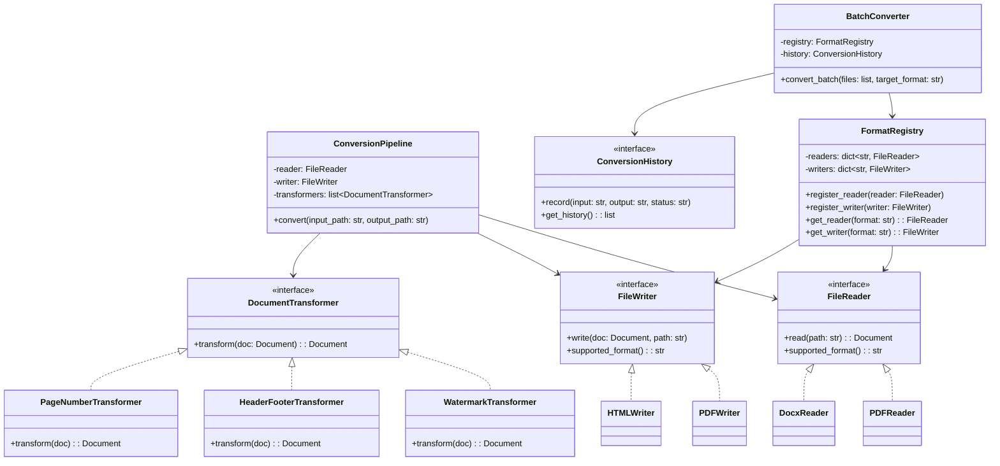

# SOLID Principles Practice Exercises

## Section A: Identify the Violation

### Snippet 1

```python
class UserManager:
    def create_user(self, name, email):
        # Validate
        if "@" not in email:
            raise ValueError("Invalid email")
        # Save to DB
        db.execute(f"INSERT INTO users VALUES ('{name}', '{email}')")
        # Send welcome email
        smtp = smtplib.SMTP("smtp.gmail.com")
        smtp.send_message(f"Welcome {name}!")
        # Log
        with open("app.log", "a") as f:
            f.write(f"User created: {name}\n")
```

**Violation:** **Single Responsibility Principle (SRP)**
The `UserManager` has four responsibilities: validation, persistence, email sending, and logging. Each should be a separate class.

**Fix:**
```python
class UserValidator:
    def validate(self, name, email):
        if "@" not in email:
            raise ValueError("Invalid email")

class UserRepository:
    def save(self, name, email):
        db.execute("INSERT INTO users VALUES (?, ?)", (name, email))

class EmailService:
    def send_welcome(self, name, email):
        smtp = smtplib.SMTP("smtp.gmail.com")
        smtp.send_message(f"Welcome {name}!")

class UserManager:
    def __init__(self, validator, repo, email_service):
        self._validator = validator
        self._repo = repo
        self._email = email_service

    def create_user(self, name, email):
        self._validator.validate(name, email)
        self._repo.save(name, email)
        self._email.send_welcome(name, email)
```

---

### Snippet 2

```python
class AreaCalculator:
    def calculate(self, shapes):
        total = 0
        for shape in shapes:
            if isinstance(shape, Circle):
                total += 3.14 * shape.radius ** 2
            elif isinstance(shape, Rectangle):
                total += shape.width * shape.height
            elif isinstance(shape, Triangle):
                total += 0.5 * shape.base * shape.height
            # Need to add more elif for each new shape!
        return total
```

**Violation:** **Open/Closed Principle (OCP)**
Adding a new shape requires modifying `AreaCalculator`. The class is not closed for modification.

**Fix:**
```python
from abc import ABC, abstractmethod

class Shape(ABC):
    @abstractmethod
    def area(self) -> float:
        pass

class Circle(Shape):
    def __init__(self, radius):
        self.radius = radius
    def area(self):
        return 3.14 * self.radius ** 2

class AreaCalculator:
    def calculate(self, shapes: list[Shape]) -> float:
        return sum(shape.area() for shape in shapes)
```

---

### Snippet 3

```python
class Rectangle:
    def __init__(self, width, height):
        self._width = width
        self._height = height

    @property
    def width(self):
        return self._width

    @width.setter
    def width(self, value):
        self._width = value

    @property
    def height(self):
        return self._height

    @height.setter
    def height(self, value):
        self._height = value

    def area(self):
        return self._width * self._height

class Square(Rectangle):
    def __init__(self, side):
        super().__init__(side, side)

    @Rectangle.width.setter
    def width(self, value):
        self._width = value
        self._height = value  # Must keep square!

    @Rectangle.height.setter
    def height(self, value):
        self._width = value
        self._height = value
```

**Violation:** **Liskov Substitution Principle (LSP)**
A `Square` overrides `width` and `height` setters to enforce equal sides. Code expecting a `Rectangle` will break:

```python
def test_rectangle(rect: Rectangle):
    rect.width = 5
    rect.height = 10
    assert rect.area() == 50  # Fails for Square! area = 100
```

**Fix:** Don't inherit `Square` from `Rectangle`. Use a common `Shape` base.

---

### Snippet 4

```python
class Worker:
    def work(self):
        pass
    def eat(self):
        pass
    def sleep(self):
        pass
    def attend_meeting(self):
        pass

class Robot(Worker):
    def work(self):
        return "Assembling parts"
    def eat(self):
        raise NotImplementedError("Robots don't eat")  # Forced to implement
    def sleep(self):
        raise NotImplementedError("Robots don't sleep")
    def attend_meeting(self):
        raise NotImplementedError("Robots don't attend meetings")
```

**Violation:** **Interface Segregation Principle (ISP)**
`Worker` is a fat interface. `Robot` is forced to implement methods it doesn't need.

**Fix:**
```python
from abc import ABC, abstractmethod

class Workable(ABC):
    @abstractmethod
    def work(self): pass

class Feedable(ABC):
    @abstractmethod
    def eat(self): pass

class Sleepable(ABC):
    @abstractmethod
    def sleep(self): pass

class Robot(Workable):
    def work(self):
        return "Assembling parts"

class Human(Workable, Feedable, Sleepable):
    def work(self): return "Coding"
    def eat(self): return "Eating lunch"
    def sleep(self): return "Sleeping"
```

---

### Snippet 5

```python
class EmailNotifier:
    def send(self, message, recipient):
        print(f"Sending email to {recipient}: {message}")

class OrderService:
    def __init__(self):
        self.notifier = EmailNotifier()  # Direct dependency on concrete class

    def place_order(self, order):
        # Process order...
        self.notifier.send(f"Order {order.id} placed", order.customer.email)
```

**Violation:** **Dependency Inversion Principle (DIP)**
`OrderService` depends directly on concrete `EmailNotifier`. Cannot switch to SMS, push notification, etc.

**Fix:**
```python
from abc import ABC, abstractmethod

class Notifier(ABC):
    @abstractmethod
    def send(self, message: str, recipient: str): pass

class EmailNotifier(Notifier):
    def send(self, message, recipient):
        print(f"Email to {recipient}: {message}")

class SMSNotifier(Notifier):
    def send(self, message, recipient):
        print(f"SMS to {recipient}: {message}")

class OrderService:
    def __init__(self, notifier: Notifier):  # Depends on abstraction
        self._notifier = notifier

    def place_order(self, order):
        self._notifier.send(f"Order {order.id} placed", order.customer.email)
```

---

### Snippet 6

```python
class ReportGenerator:
    def generate(self, data, format_type):
        if format_type == "pdf":
            return self._generate_pdf(data)
        elif format_type == "csv":
            return self._generate_csv(data)
        elif format_type == "html":
            return self._generate_html(data)

    def _generate_pdf(self, data):
        # 50 lines of PDF generation
        pass

    def _generate_csv(self, data):
        # 30 lines of CSV generation
        pass

    def _generate_html(self, data):
        # 40 lines of HTML generation
        pass
```

**Violation:** **Open/Closed Principle (OCP)** and **Single Responsibility Principle (SRP)**
Adding a new format requires modifying `ReportGenerator`. Each format is a different responsibility.

**Fix:** Use Strategy pattern — each format is a separate class.

---

### Snippet 7

```python
class Animal:
    def __init__(self, name, animal_type):
        self.name = name
        self.animal_type = animal_type

    def make_sound(self):
        if self.animal_type == "dog":
            return "Woof!"
        elif self.animal_type == "cat":
            return "Meow!"
        elif self.animal_type == "duck":
            return "Quack!"

    def move(self):
        if self.animal_type == "dog":
            return "Running"
        elif self.animal_type == "cat":
            return "Sneaking"
        elif self.animal_type == "duck":
            return "Waddling"
```

**Violation:** **OCP** — Classic case of using conditionals instead of polymorphism.

**Fix:** Create `Dog`, `Cat`, `Duck` subclasses of abstract `Animal`.

---

### Snippet 8

```python
class MultiFunctionPrinter:
    def print_document(self, doc): ...
    def scan_document(self, doc): ...
    def fax_document(self, doc): ...
    def staple_document(self, doc): ...

class SimplePrinter(MultiFunctionPrinter):
    def print_document(self, doc):
        return "Printing..."
    def scan_document(self, doc):
        raise NotImplementedError
    def fax_document(self, doc):
        raise NotImplementedError
    def staple_document(self, doc):
        raise NotImplementedError
```

**Violation:** **Interface Segregation Principle (ISP)** — `SimplePrinter` forced to implement unwanted methods.

**Fix:** Split into `Printable`, `Scannable`, `Faxable`, `Stapleable` interfaces.

---

### Snippet 9

```python
class MySQLDatabase:
    def connect(self):
        return "Connected to MySQL"
    def query(self, sql):
        return f"MySQL executing: {sql}"

class UserRepository:
    def __init__(self):
        self.db = MySQLDatabase()

    def find_user(self, user_id):
        return self.db.query(f"SELECT * FROM users WHERE id={user_id}")
```

**Violation:** **Dependency Inversion Principle (DIP)** — `UserRepository` is tightly coupled to MySQL. Switching to PostgreSQL requires changing `UserRepository`.

**Fix:** Inject a `Database` abstraction.

---

### Snippet 10

```python
class FileManager:
    def read_file(self, path):
        with open(path, 'r') as f:
            return f.read()

    def write_file(self, path, content):
        with open(path, 'w') as f:
            f.write(content)

    def compress_file(self, path):
        import zipfile
        # compression logic...

    def encrypt_file(self, path, key):
        # encryption logic...

    def upload_to_s3(self, path, bucket):
        # S3 upload logic...
```

**Violation:** **SRP** — File I/O, compression, encryption, and cloud upload are all different responsibilities mixed into one class.

**Fix:** Split into `FileReader`, `FileWriter`, `FileCompressor`, `FileEncryptor`, `S3Uploader`.

---

## Section B: Refactoring Challenges

### Challenge 1: Payment Processor

**Original Code (violates SRP, OCP, DIP):**

```python
class PaymentProcessor:
    def __init__(self):
        self.transactions = []

    def process_payment(self, amount, method, card_number=None, upi_id=None):
        if method == "credit_card":
            if not self._validate_card(card_number):
                raise ValueError("Invalid card")
            fee = amount * 0.03
            result = f"Charged ${amount + fee} to card {card_number[-4:]}"
        elif method == "debit_card":
            if not self._validate_card(card_number):
                raise ValueError("Invalid card")
            fee = amount * 0.01
            result = f"Charged ${amount + fee} to debit {card_number[-4:]}"
        elif method == "upi":
            if not upi_id:
                raise ValueError("UPI ID required")
            fee = 0
            result = f"Charged ${amount} via UPI {upi_id}"
        elif method == "wallet":
            fee = 0
            result = f"Charged ${amount} from wallet"
        else:
            raise ValueError(f"Unknown method: {method}")

        self.transactions.append({
            "amount": amount, "fee": fee, "method": method, "result": result
        })
        self._send_receipt(result)
        self._log_transaction(result)
        return result

    def _validate_card(self, number):
        return number and len(number) == 16

    def _send_receipt(self, result):
        print(f"Receipt: {result}")

    def _log_transaction(self, result):
        with open("transactions.log", "a") as f:
            f.write(result + "\n")
```

**Violations:**
1. **SRP** — Processing, validation, receipts, logging all in one class
2. **OCP** — Adding new payment methods requires modifying `process_payment`
3. **DIP** — Directly uses file system for logging, hardcoded receipt sending

**Refactored Solution:**

```python
from abc import ABC, abstractmethod
from dataclasses import dataclass

@dataclass
class PaymentResult:
    amount: float
    fee: float
    method: str
    description: str

class PaymentMethod(ABC):
    @abstractmethod
    def validate(self, **kwargs) -> bool:
        pass

    @abstractmethod
    def calculate_fee(self, amount: float) -> float:
        pass

    @abstractmethod
    def charge(self, amount: float, **kwargs) -> str:
        pass

class CreditCardPayment(PaymentMethod):
    def validate(self, card_number=None, **kwargs):
        return card_number is not None and len(card_number) == 16

    def calculate_fee(self, amount):
        return amount * 0.03

    def charge(self, amount, card_number=None, **kwargs):
        return f"Charged ${amount + self.calculate_fee(amount):.2f} to card {card_number[-4:]}"

class UPIPayment(PaymentMethod):
    def validate(self, upi_id=None, **kwargs):
        return upi_id is not None and "@" in upi_id

    def calculate_fee(self, amount):
        return 0

    def charge(self, amount, upi_id=None, **kwargs):
        return f"Charged ${amount:.2f} via UPI {upi_id}"

class TransactionLogger(ABC):
    @abstractmethod
    def log(self, result: PaymentResult): pass

class FileTransactionLogger(TransactionLogger):
    def __init__(self, filepath: str):
        self._filepath = filepath
    def log(self, result: PaymentResult):
        with open(self._filepath, "a") as f:
            f.write(f"{result.description}\n")

class ReceiptSender(ABC):
    @abstractmethod
    def send(self, result: PaymentResult): pass

class ConsoleReceiptSender(ReceiptSender):
    def send(self, result: PaymentResult):
        print(f"Receipt: {result.description}")

class PaymentProcessor:
    def __init__(self, logger: TransactionLogger, receipt_sender: ReceiptSender):
        self._logger = logger
        self._receipt_sender = receipt_sender
        self._transactions: list[PaymentResult] = []

    def process(self, method: PaymentMethod, amount: float, **kwargs) -> PaymentResult:
        if not method.validate(**kwargs):
            raise ValueError("Payment validation failed")

        fee = method.calculate_fee(amount)
        description = method.charge(amount, **kwargs)
        result = PaymentResult(amount, fee, method.__class__.__name__, description)

        self._transactions.append(result)
        self._logger.log(result)
        self._receipt_sender.send(result)
        return result
```

---

### Challenge 2: User Notification System

**Original Code (violates SRP, OCP, ISP, DIP):**

```python
class NotificationService:
    def __init__(self):
        import smtplib
        self.smtp = smtplib.SMTP("smtp.gmail.com", 587)
        self.sms_api_key = "hardcoded_key_123"

    def notify(self, user, message, channels):
        for channel in channels:
            if channel == "email":
                self.smtp.sendmail("noreply@app.com", user.email, message)
                print(f"Email sent to {user.email}")
            elif channel == "sms":
                import requests
                requests.post("https://sms-api.com/send", json={
                    "to": user.phone, "message": message,
                    "api_key": self.sms_api_key
                })
                print(f"SMS sent to {user.phone}")
            elif channel == "push":
                # Push notification logic
                print(f"Push sent to {user.device_token}")
            elif channel == "slack":
                import requests
                requests.post(user.slack_webhook, json={"text": message})
                print(f"Slack sent to {user.slack_webhook}")

    def notify_all_users(self, users, message, channels):
        for user in users:
            self.notify(user, message, channels)
```

**Violations:**
1. **SRP** — One class handles email, SMS, push, Slack
2. **OCP** — New channel = modify `notify()`
3. **DIP** — Hardcoded SMTP, API keys, HTTP client
4. **ISP** — User must have email, phone, device_token, slack_webhook even if only one channel is used

**Refactored Solution:**

```python
from abc import ABC, abstractmethod

class NotificationChannel(ABC):
    @abstractmethod
    def send(self, recipient: str, message: str) -> bool:
        pass

class EmailChannel(NotificationChannel):
    def __init__(self, smtp_client):
        self._smtp = smtp_client

    def send(self, recipient: str, message: str) -> bool:
        self._smtp.sendmail("noreply@app.com", recipient, message)
        return True

class SMSChannel(NotificationChannel):
    def __init__(self, sms_client):
        self._sms = sms_client

    def send(self, recipient: str, message: str) -> bool:
        self._sms.send(to=recipient, body=message)
        return True

class PushChannel(NotificationChannel):
    def __init__(self, push_client):
        self._push = push_client

    def send(self, recipient: str, message: str) -> bool:
        self._push.notify(device_token=recipient, message=message)
        return True

class UserContactResolver(ABC):
    @abstractmethod
    def get_contact(self, user, channel_name: str) -> str:
        pass

class NotificationService:
    def __init__(self, contact_resolver: UserContactResolver):
        self._channels: dict[str, NotificationChannel] = {}
        self._resolver = contact_resolver

    def register_channel(self, name: str, channel: NotificationChannel):
        self._channels[name] = channel

    def notify(self, user, message: str, channel_names: list[str]):
        results = {}
        for name in channel_names:
            channel = self._channels.get(name)
            if not channel:
                results[name] = False
                continue
            contact = self._resolver.get_contact(user, name)
            results[name] = channel.send(contact, message)
        return results
```

---

### Challenge 3: Analytics Dashboard

**Original Code (violates OCP, SRP, DIP):**

```python
class AnalyticsDashboard:
    def __init__(self):
        import psycopg2
        self.conn = psycopg2.connect("dbname=analytics")

    def get_data(self, metric_type, start_date, end_date):
        if metric_type == "revenue":
            query = f"SELECT date, revenue FROM sales WHERE date BETWEEN '{start_date}' AND '{end_date}'"
        elif metric_type == "users":
            query = f"SELECT date, count FROM user_signups WHERE date BETWEEN '{start_date}' AND '{end_date}'"
        elif metric_type == "pageviews":
            query = f"SELECT date, views FROM page_analytics WHERE date BETWEEN '{start_date}' AND '{end_date}'"
        else:
            raise ValueError(f"Unknown metric: {metric_type}")

        cursor = self.conn.cursor()
        cursor.execute(query)
        data = cursor.fetchall()
        return data

    def generate_chart(self, data, chart_type):
        if chart_type == "bar":
            print("Generating bar chart...")
        elif chart_type == "line":
            print("Generating line chart...")
        elif chart_type == "pie":
            print("Generating pie chart...")

    def export(self, data, format_type):
        if format_type == "csv":
            print("Exporting CSV...")
        elif format_type == "pdf":
            print("Exporting PDF...")
```

**Violations:**
1. **SRP** — Data retrieval, charting, and export in one class
2. **OCP** — New metric/chart/format = modify existing methods
3. **DIP** — Hardcoded database connection

**Refactored Solution:**

```python
from abc import ABC, abstractmethod

class MetricQuery(ABC):
    @abstractmethod
    def get_query(self, start_date: str, end_date: str) -> str:
        pass

class RevenueMetric(MetricQuery):
    def get_query(self, start_date, end_date):
        return "SELECT date, revenue FROM sales WHERE date BETWEEN %s AND %s"

class UserSignupMetric(MetricQuery):
    def get_query(self, start_date, end_date):
        return "SELECT date, count FROM user_signups WHERE date BETWEEN %s AND %s"

class DataRepository:
    def __init__(self, db_connection):
        self._conn = db_connection

    def fetch(self, metric: MetricQuery, start_date: str, end_date: str):
        query = metric.get_query(start_date, end_date)
        cursor = self._conn.cursor()
        cursor.execute(query, (start_date, end_date))
        return cursor.fetchall()

class ChartRenderer(ABC):
    @abstractmethod
    def render(self, data) -> bytes: pass

class BarChartRenderer(ChartRenderer):
    def render(self, data): ...

class LineChartRenderer(ChartRenderer):
    def render(self, data): ...

class DataExporter(ABC):
    @abstractmethod
    def export(self, data, filename: str): pass

class CSVExporter(DataExporter):
    def export(self, data, filename): ...

class PDFExporter(DataExporter):
    def export(self, data, filename): ...

class AnalyticsDashboard:
    def __init__(self, repo: DataRepository):
        self._repo = repo

    def get_chart(self, metric: MetricQuery, renderer: ChartRenderer,
                  start: str, end: str) -> bytes:
        data = self._repo.fetch(metric, start, end)
        return renderer.render(data)

    def export_data(self, metric: MetricQuery, exporter: DataExporter,
                    start: str, end: str, filename: str):
        data = self._repo.fetch(metric, start, end)
        exporter.export(data, filename)
```

---

### Challenge 4: Vehicle Rental System

**Original Code (violates LSP, OCP, SRP):**

```python
class Vehicle:
    def __init__(self, vehicle_type, make, model, fuel_capacity):
        self.vehicle_type = vehicle_type
        self.make = make
        self.model = model
        self.fuel_capacity = fuel_capacity
        self.is_rented = False

    def calculate_rental_cost(self, days):
        if self.vehicle_type == "car":
            return days * 50
        elif self.vehicle_type == "bike":
            return days * 20
        elif self.vehicle_type == "truck":
            return days * 100
        elif self.vehicle_type == "bicycle":
            return days * 5

    def refuel(self, amount):
        if self.vehicle_type == "bicycle":
            raise Exception("Bicycles don't need fuel!")
        return f"Refueled {amount} liters"

    def rent(self, customer_name):
        self.is_rented = True
        self.customer = customer_name
        # Send email
        print(f"Sending confirmation email to {customer_name}")
        # Log
        print(f"Logged: {customer_name} rented {self.make} {self.model}")
        return f"Rented to {customer_name}"
```

**Violations:**
1. **OCP** — `calculate_rental_cost` needs modification for new vehicle types
2. **LSP** — `refuel` throws for bicycle (not all vehicles are fuel-powered)
3. **SRP** — `rent()` handles rental logic, email, and logging

**Refactored Solution:**

```python
from abc import ABC, abstractmethod

class Vehicle(ABC):
    def __init__(self, make: str, model: str):
        self.make = make
        self.model = model

    @abstractmethod
    def daily_rate(self) -> float:
        pass

    def rental_cost(self, days: int) -> float:
        return days * self.daily_rate()

class FuelVehicle(Vehicle):
    def __init__(self, make, model, fuel_capacity):
        super().__init__(make, model)
        self.fuel_capacity = fuel_capacity

    def refuel(self, amount):
        return f"Refueled {amount} liters"

class Car(FuelVehicle):
    def daily_rate(self): return 50.0

class Truck(FuelVehicle):
    def daily_rate(self): return 100.0

class Bicycle(Vehicle):
    def daily_rate(self): return 5.0

class RentalService:
    def __init__(self, notifier, logger):
        self._notifier = notifier
        self._logger = logger
        self._rentals = {}

    def rent(self, vehicle: Vehicle, customer: str):
        self._rentals[vehicle] = customer
        self._notifier.notify(customer, f"Rented {vehicle.make} {vehicle.model}")
        self._logger.log(f"{customer} rented {vehicle.make} {vehicle.model}")
```

---

### Challenge 5: Content Management System

**Original Code (violates all 5 SOLID principles):**

```python
class ContentManager:
    def __init__(self):
        self.contents = []

    def create_content(self, content_type, title, body, author):
        content = {"type": content_type, "title": title, "body": body, "author": author}

        # Validate
        if content_type == "article":
            if len(body) < 100:
                raise ValueError("Article must be at least 100 chars")
        elif content_type == "tweet":
            if len(body) > 280:
                raise ValueError("Tweet must be under 280 chars")
        elif content_type == "blog":
            if not title:
                raise ValueError("Blog must have title")

        # Format
        if content_type == "article":
            content["formatted"] = f"<article><h1>{title}</h1><p>{body}</p></article>"
        elif content_type == "tweet":
            content["formatted"] = body[:280]
        elif content_type == "blog":
            content["formatted"] = f"# {title}\n\n{body}"

        # Save
        self.contents.append(content)

        # Publish
        if content_type == "tweet":
            print(f"Posted to Twitter: {body[:50]}...")
        else:
            print(f"Published to website: {title}")

        # Notify subscribers
        print(f"Notifying all subscribers about new {content_type}")

        return content
```

**All SOLID Violations:**
1. **SRP** — Validation, formatting, storage, publishing, notifications
2. **OCP** — New content type = modify every conditional
3. **LSP** — Different content types have incompatible rules crammed together
4. **ISP** — All content forced through same interface (tweets don't need titles)
5. **DIP** — Hardcoded publishing and notification mechanisms

**Refactored Solution:**

```python
from abc import ABC, abstractmethod
from dataclasses import dataclass

@dataclass
class ContentData:
    title: str
    body: str
    author: str

class Content(ABC):
    def __init__(self, data: ContentData):
        self._data = data
        self.validate()

    @abstractmethod
    def validate(self): pass

    @abstractmethod
    def format(self) -> str: pass

    @property
    def data(self):
        return self._data

class Article(Content):
    def validate(self):
        if len(self._data.body) < 100:
            raise ValueError("Article must be at least 100 chars")

    def format(self):
        return f"<article><h1>{self._data.title}</h1><p>{self._data.body}</p></article>"

class Tweet(Content):
    def validate(self):
        if len(self._data.body) > 280:
            raise ValueError("Tweet must be under 280 chars")

    def format(self):
        return self._data.body[:280]

class BlogPost(Content):
    def validate(self):
        if not self._data.title:
            raise ValueError("Blog must have a title")

    def format(self):
        return f"# {self._data.title}\n\n{self._data.body}"

class ContentRepository(ABC):
    @abstractmethod
    def save(self, content: Content): pass

class Publisher(ABC):
    @abstractmethod
    def publish(self, content: Content): pass

class SubscriberNotifier(ABC):
    @abstractmethod
    def notify(self, content: Content): pass

class ContentManager:
    def __init__(self, repo: ContentRepository, publisher: Publisher,
                 notifier: SubscriberNotifier):
        self._repo = repo
        self._publisher = publisher
        self._notifier = notifier

    def create(self, content: Content):
        formatted = content.format()
        self._repo.save(content)
        self._publisher.publish(content)
        self._notifier.notify(content)
        return formatted
```

---

## Section C: Design Questions

### Design 1: Notification System Following SOLID

**Requirements:**
- Support email, SMS, push, in-app notifications
- Users can configure preferred channels
- Notifications have different priorities (urgent, normal, low)
- Urgent notifications go to all channels, low only to in-app
- Must be easy to add new channels

**Solution:**



**Key SOLID Points:**
- **SRP:** Each channel handles only its own delivery logic
- **OCP:** New channels implement `NotificationChannel` without modifying router
- **LSP:** All channels honor the same contract
- **ISP:** `NotificationChannel` has minimal interface
- **DIP:** `NotificationRouter` depends on abstractions, not concrete channels

---

### Design 2: Report Generator Following SOLID

**Requirements:**
- Generate reports from various data sources (DB, API, CSV)
- Multiple output formats (PDF, Excel, HTML, JSON)
- Reports need headers, footers, charts, tables
- Some reports need approval workflow
- Scheduled and on-demand generation

**Solution:**



---

### Design 3: File Converter Following SOLID

**Requirements:**
- Convert between file formats (PDF, DOCX, TXT, HTML, Markdown)
- Support batch conversion
- Add watermarks, headers, page numbers during conversion
- Track conversion history
- Plugin architecture for new formats

**Solution:**



**Key SOLID Points:**
- **SRP:** Readers, writers, transformers each have one job
- **OCP:** New formats are plugins — register reader/writer without modifying core
- **LSP:** All readers/writers are interchangeable through their interface
- **ISP:** Reading and writing are separate interfaces (a format might only support one)
- **DIP:** `ConversionPipeline` and `BatchConverter` depend on abstractions
