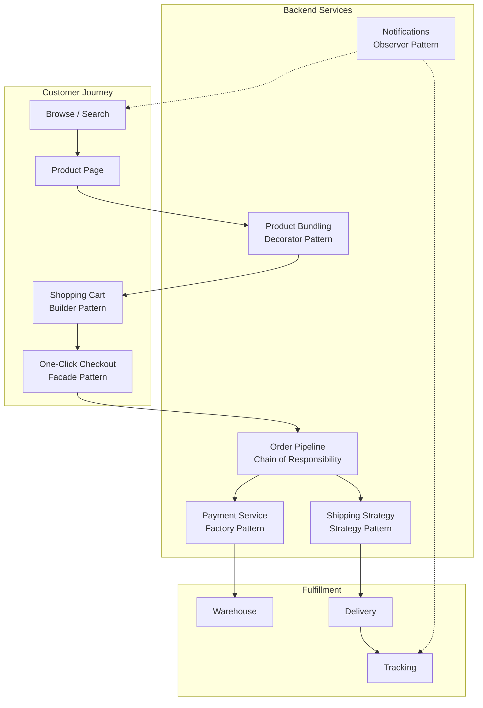
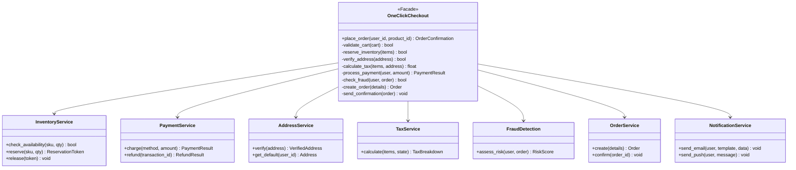
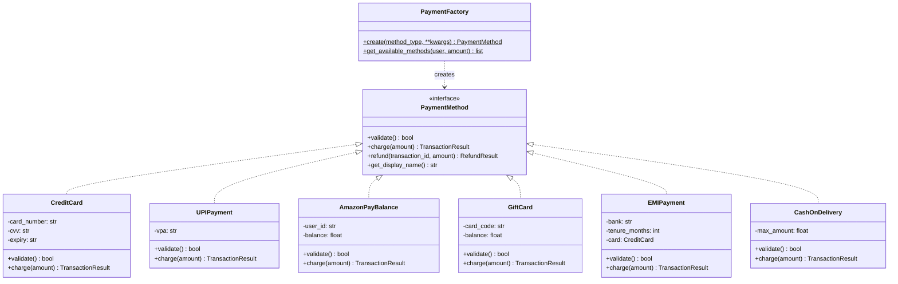
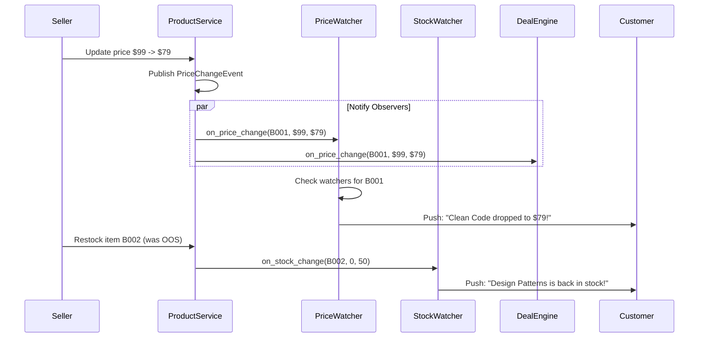
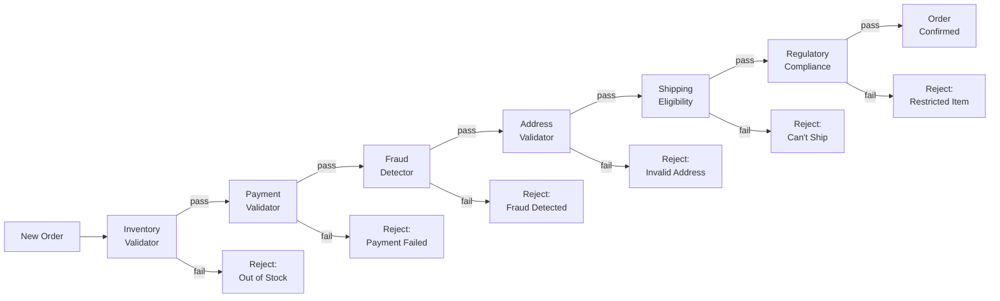
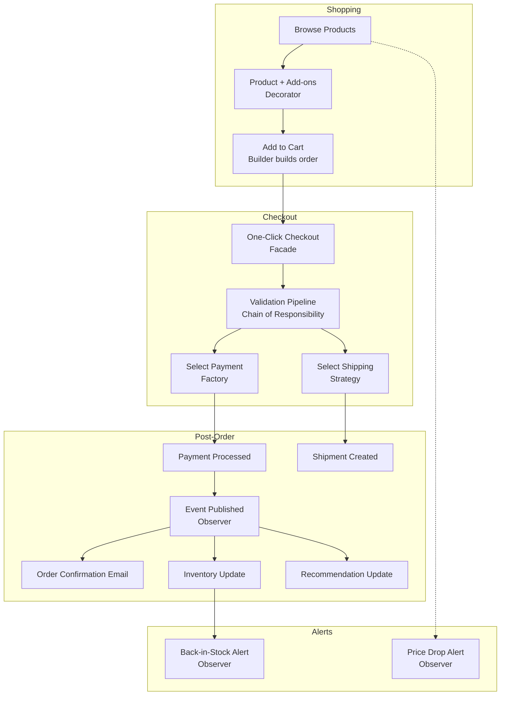

# Amazon: Design Patterns in Practice

## System Context

Amazon processes 66,000+ orders per second during peak events like Prime Day. Their e-commerce platform spans product catalog, search, recommendations, cart, checkout, payments, fulfillment, and delivery -- all operating as independent services. The "two-pizza team" culture means each service is owned by a small team, making clean interfaces (and therefore design patterns) essential.



---

## 1. Facade Pattern: One-Click Checkout

### The Problem
Completing a purchase involves 7+ subsystems: cart validation, inventory reservation, address verification, tax calculation, payment processing, fraud detection, order creation, and confirmation. Exposing this complexity to the UI would be a maintenance nightmare and create tight coupling.

### How Amazon Solves It
The famous "Buy Now with 1-Click" button hides enormous complexity behind a single `place_order()` call. The checkout facade orchestrates all subsystems.



### Code

```python
from dataclasses import dataclass
from enum import Enum


# --- Subsystem classes (simplified) ---

@dataclass
class Address:
    street: str
    city: str
    state: str
    zip_code: str
    country: str = "US"


@dataclass
class PaymentResult:
    success: bool
    transaction_id: str
    message: str


class InventoryService:
    def check_and_reserve(self, sku: str, quantity: int) -> str | None:
        print(f"  [Inventory] Checking {sku} x{quantity}... Available!")
        return f"RSV-{sku}-001"  # Reservation token

    def release(self, token: str):
        print(f"  [Inventory] Released reservation {token}")


class AddressService:
    def get_default_address(self, user_id: str) -> Address:
        return Address("123 Main St", "Seattle", "WA", "98101")

    def verify(self, address: Address) -> bool:
        print(f"  [Address] Verified: {address.city}, {address.state}")
        return True


class TaxService:
    STATE_RATES = {"WA": 0.065, "CA": 0.0725, "NY": 0.08, "TX": 0.0625}

    def calculate(self, amount: float, state: str) -> float:
        rate = self.STATE_RATES.get(state, 0.05)
        tax = round(amount * rate, 2)
        print(f"  [Tax] {state} rate {rate*100}%: ${tax}")
        return tax


class PaymentService:
    def charge(self, user_id: str, method_id: str, amount: float) -> PaymentResult:
        print(f"  [Payment] Charging ${amount:.2f} to method {method_id}")
        return PaymentResult(True, "TXN-abc123", "Approved")


class FraudDetection:
    def assess(self, user_id: str, amount: float, address: Address) -> bool:
        print(f"  [Fraud] Risk assessment for ${amount:.2f} -> LOW RISK")
        return True  # Safe to proceed


class OrderService:
    def create(self, user_id: str, items: list, total: float, txn_id: str) -> str:
        order_id = "ORD-2024-789"
        print(f"  [Order] Created {order_id}: {len(items)} items, ${total:.2f}")
        return order_id


class NotificationService:
    def send_confirmation(self, user_id: str, order_id: str, email: str):
        print(f"  [Notification] Confirmation email sent to {email}")


# --- The Facade ---

@dataclass
class OrderConfirmation:
    order_id: str
    total: float
    estimated_delivery: str
    transaction_id: str


class OneClickCheckout:
    """Facade: hides the complexity of 7 subsystems behind one method.

    This is what powers Amazon's '1-Click' ordering patent (US Patent 5,960,411).
    """

    def __init__(self):
        self._inventory = InventoryService()
        self._address = AddressService()
        self._tax = TaxService()
        self._payment = PaymentService()
        self._fraud = FraudDetection()
        self._orders = OrderService()
        self._notifications = NotificationService()

    def place_order(self, user_id: str, items: list[dict],
                    payment_method_id: str = "default") -> OrderConfirmation:
        """One method call to handle the entire checkout flow.

        Args:
            user_id: Customer ID
            items: [{"sku": "B001", "name": "...", "price": 29.99, "qty": 1}]
            payment_method_id: Saved payment method
        Returns:
            OrderConfirmation with order details
        """
        print(f"=== One-Click Checkout for {user_id} ===")

        # Step 1: Reserve inventory
        reservations = []
        for item in items:
            token = self._inventory.check_and_reserve(item["sku"], item["qty"])
            if not token:
                # Rollback any previous reservations
                for t in reservations:
                    self._inventory.release(t)
                raise Exception(f"Item {item['sku']} out of stock")
            reservations.append(token)

        # Step 2: Get and verify shipping address
        address = self._address.get_default_address(user_id)
        if not self._address.verify(address):
            raise Exception("Address verification failed")

        # Step 3: Calculate total with tax
        subtotal = sum(i["price"] * i["qty"] for i in items)
        tax = self._tax.calculate(subtotal, address.state)
        total = round(subtotal + tax, 2)

        # Step 4: Fraud check
        if not self._fraud.assess(user_id, total, address):
            for t in reservations:
                self._inventory.release(t)
            raise Exception("Order flagged for fraud review")

        # Step 5: Process payment
        payment = self._payment.charge(user_id, payment_method_id, total)
        if not payment.success:
            for t in reservations:
                self._inventory.release(t)
            raise Exception(f"Payment failed: {payment.message}")

        # Step 6: Create order
        order_id = self._orders.create(user_id, items, total, payment.transaction_id)

        # Step 7: Send confirmation
        self._notifications.send_confirmation(user_id, order_id, "user@email.com")

        print(f"=== Order Complete: {order_id} - ${total:.2f} ===\n")
        return OrderConfirmation(order_id, total, "Feb 8-10", payment.transaction_id)


# --- Usage: The simplicity a customer experiences ---
checkout = OneClickCheckout()
confirmation = checkout.place_order(
    user_id="cust_42",
    items=[
        {"sku": "B0001", "name": "Clean Code", "price": 34.99, "qty": 1},
        {"sku": "B0002", "name": "Design Patterns", "price": 44.99, "qty": 1},
    ]
)
print(f"Order {confirmation.order_id}: ${confirmation.total}")
```

### Why Facade?
- **Simplicity**: UI calls one method instead of orchestrating 7 services
- **Decoupling**: Subsystems can be replaced independently (swap payment processor, change tax service)
- **Amazon insight**: The 1-Click patent (expired 2017) was one of Amazon's most valuable assets, enabled by this clean facade over complex backend

---

## 2. Factory Pattern: Payment Method Creation

### The Problem
Amazon supports 10+ payment methods: credit cards, debit cards, UPI, Amazon Pay balance, gift cards, EMI, net banking, cash on delivery, cryptocurrency (limited), and corporate accounts. Each has different validation, processing, and refund logic.



### Code

```python
from abc import ABC, abstractmethod
from dataclasses import dataclass
from enum import Enum


class PaymentType(Enum):
    CREDIT_CARD = "credit_card"
    DEBIT_CARD = "debit_card"
    UPI = "upi"
    AMAZON_PAY = "amazon_pay"
    GIFT_CARD = "gift_card"
    EMI = "emi"
    COD = "cod"


@dataclass
class TransactionResult:
    success: bool
    transaction_id: str
    message: str
    requires_redirect: bool = False
    redirect_url: str = ""


class PaymentMethod(ABC):
    @abstractmethod
    def validate(self) -> bool:
        pass

    @abstractmethod
    def charge(self, amount: float) -> TransactionResult:
        pass

    @abstractmethod
    def refund(self, transaction_id: str, amount: float) -> TransactionResult:
        pass

    @abstractmethod
    def get_display_name(self) -> str:
        pass


class CreditCard(PaymentMethod):
    def __init__(self, card_number: str, cvv: str, expiry: str, name: str):
        self._card_number = card_number
        self._cvv = cvv
        self._expiry = expiry
        self._name = name

    def validate(self) -> bool:
        # Luhn check, expiry validation, etc.
        return len(self._card_number) == 16 and len(self._cvv) == 3

    def charge(self, amount: float) -> TransactionResult:
        print(f"  [CreditCard] Charging ${amount:.2f} to ****{self._card_number[-4:]}")
        return TransactionResult(True, "CC-TXN-001", "Approved")

    def refund(self, transaction_id: str, amount: float) -> TransactionResult:
        print(f"  [CreditCard] Refunding ${amount:.2f} for {transaction_id}")
        return TransactionResult(True, f"REF-{transaction_id}", "Refund initiated (5-7 days)")

    def get_display_name(self) -> str:
        return f"Credit Card ending in {self._card_number[-4:]}"


class UPIPayment(PaymentMethod):
    def __init__(self, vpa: str):
        self._vpa = vpa  # e.g., user@upi

    def validate(self) -> bool:
        return "@" in self._vpa

    def charge(self, amount: float) -> TransactionResult:
        print(f"  [UPI] Requesting ${amount:.2f} from {self._vpa}")
        return TransactionResult(True, "UPI-TXN-001", "Payment approved",
                                 requires_redirect=True, redirect_url="upi://pay?...")

    def refund(self, transaction_id: str, amount: float) -> TransactionResult:
        return TransactionResult(True, f"REF-{transaction_id}", "Instant refund to UPI")

    def get_display_name(self) -> str:
        return f"UPI: {self._vpa}"


class AmazonPayBalance(PaymentMethod):
    def __init__(self, user_id: str, balance: float):
        self._user_id = user_id
        self._balance = balance

    def validate(self) -> bool:
        return self._balance > 0

    def charge(self, amount: float) -> TransactionResult:
        if amount > self._balance:
            return TransactionResult(False, "", f"Insufficient balance: ${self._balance:.2f}")
        self._balance -= amount
        print(f"  [AmazonPay] Deducted ${amount:.2f}, remaining: ${self._balance:.2f}")
        return TransactionResult(True, "AP-TXN-001", "Paid via Amazon Pay")

    def refund(self, transaction_id: str, amount: float) -> TransactionResult:
        self._balance += amount
        return TransactionResult(True, f"REF-{transaction_id}", "Instant refund to balance")

    def get_display_name(self) -> str:
        return f"Amazon Pay Balance (${self._balance:.2f})"


class CashOnDelivery(PaymentMethod):
    MAX_COD_AMOUNT = 500.00

    def __init__(self, delivery_address: str):
        self._address = delivery_address

    def validate(self) -> bool:
        return True  # COD available for verified addresses

    def charge(self, amount: float) -> TransactionResult:
        if amount > self.MAX_COD_AMOUNT:
            return TransactionResult(False, "", f"COD limit ${self.MAX_COD_AMOUNT}")
        print(f"  [COD] Order placed - ${amount:.2f} to be collected on delivery")
        return TransactionResult(True, "COD-TXN-001", "Pay on delivery")

    def refund(self, transaction_id: str, amount: float) -> TransactionResult:
        return TransactionResult(True, f"REF-{transaction_id}",
                                 "Refund to bank account (7-10 days)")

    def get_display_name(self) -> str:
        return "Cash on Delivery"


class EMIPayment(PaymentMethod):
    EMI_BANKS = {
        "HDFC": {3: 0.0, 6: 0.12, 9: 0.13, 12: 0.14},  # tenure -> annual rate
        "SBI": {3: 0.0, 6: 0.13, 9: 0.14, 12: 0.15},
    }

    def __init__(self, card: CreditCard, bank: str, tenure_months: int):
        self._card = card
        self._bank = bank
        self._tenure = tenure_months

    def validate(self) -> bool:
        return (self._bank in self.EMI_BANKS and
                self._tenure in self.EMI_BANKS[self._bank] and
                self._card.validate())

    def charge(self, amount: float) -> TransactionResult:
        rate = self.EMI_BANKS[self._bank][self._tenure]
        monthly = amount * (1 + rate * self._tenure / 12) / self._tenure
        print(f"  [EMI] {self._bank} {self._tenure}mo EMI: ${monthly:.2f}/month")
        return self._card.charge(amount)

    def refund(self, transaction_id: str, amount: float) -> TransactionResult:
        return self._card.refund(transaction_id, amount)

    def get_display_name(self) -> str:
        return f"EMI via {self._bank} ({self._tenure} months)"


class PaymentFactory:
    """Factory for creating the correct payment method."""

    @staticmethod
    def create(payment_type: PaymentType, **kwargs) -> PaymentMethod:
        factories = {
            PaymentType.CREDIT_CARD: lambda: CreditCard(
                kwargs["card_number"], kwargs["cvv"],
                kwargs["expiry"], kwargs.get("name", "")),
            PaymentType.UPI: lambda: UPIPayment(kwargs["vpa"]),
            PaymentType.AMAZON_PAY: lambda: AmazonPayBalance(
                kwargs["user_id"], kwargs.get("balance", 0)),
            PaymentType.COD: lambda: CashOnDelivery(kwargs.get("address", "")),
            PaymentType.EMI: lambda: EMIPayment(
                CreditCard(kwargs["card_number"], kwargs["cvv"],
                           kwargs["expiry"], kwargs.get("name", "")),
                kwargs["bank"], kwargs["tenure"]),
        }
        creator = factories.get(payment_type)
        if not creator:
            raise ValueError(f"Unsupported payment type: {payment_type}")
        return creator()

    @staticmethod
    def get_available_methods(order_amount: float) -> list[PaymentType]:
        """Returns payment types valid for the given amount."""
        methods = [PaymentType.CREDIT_CARD, PaymentType.UPI, PaymentType.AMAZON_PAY]
        if order_amount <= CashOnDelivery.MAX_COD_AMOUNT:
            methods.append(PaymentType.COD)
        if order_amount >= 50.00:  # EMI minimum
            methods.append(PaymentType.EMI)
        return methods


# --- Usage ---
# Customer picks UPI
payment = PaymentFactory.create(PaymentType.UPI, vpa="customer@okbank")
payment.validate()
result = payment.charge(79.99)
print(f"Result: {result.message}")

# Another customer picks EMI
payment = PaymentFactory.create(
    PaymentType.EMI,
    card_number="4111111111111111", cvv="123", expiry="12/25",
    bank="HDFC", tenure=6
)
payment.charge(499.99)
```

### Why Factory?
- **Centralized creation**: Adding a new payment method (crypto, BNPL) means adding one class and one factory entry
- **Validation at creation**: Factory can reject invalid configurations
- **Amazon insight**: Different regions show different payment options (UPI in India, iDEAL in Netherlands) -- the factory handles regional variations

---

## 3. Observer Pattern: Price Drop and Back-in-Stock Alerts

### The Problem
Customers want to be notified when: prices drop on wishlisted items, out-of-stock items return, lightning deals start, and orders ship. These are independent notification triggers that shouldn't be coupled to the services that generate them.



### Code

```python
from abc import ABC, abstractmethod
from dataclasses import dataclass, field
from enum import Enum


class AlertType(Enum):
    PRICE_DROP = "price_drop"
    BACK_IN_STOCK = "back_in_stock"
    DEAL_ALERT = "deal_alert"
    PRICE_TARGET = "price_target"


@dataclass
class ProductEvent:
    product_id: str
    product_name: str
    event_data: dict


@dataclass
class Alert:
    user_id: str
    alert_type: AlertType
    message: str
    product_id: str


class ProductObserver(ABC):
    @abstractmethod
    def on_price_change(self, product_id: str, product_name: str,
                        old_price: float, new_price: float) -> list[Alert]:
        pass

    @abstractmethod
    def on_stock_change(self, product_id: str, product_name: str,
                        old_qty: int, new_qty: int) -> list[Alert]:
        pass


class ProductCatalog:
    """Subject: publishes product change events."""

    def __init__(self):
        self._observers: list[ProductObserver] = []
        self._products: dict[str, dict] = {}

    def subscribe(self, observer: ProductObserver):
        self._observers.append(observer)

    def update_price(self, product_id: str, name: str, old_price: float, new_price: float):
        print(f"\n[Catalog] Price update: {name} ${old_price} -> ${new_price}")
        alerts = []
        for obs in self._observers:
            alerts.extend(obs.on_price_change(product_id, name, old_price, new_price))
        return alerts

    def update_stock(self, product_id: str, name: str, old_qty: int, new_qty: int):
        print(f"\n[Catalog] Stock update: {name} {old_qty} -> {new_qty}")
        alerts = []
        for obs in self._observers:
            alerts.extend(obs.on_stock_change(product_id, name, old_qty, new_qty))
        return alerts


class PriceDropWatcher(ProductObserver):
    """Notifies users who wishlisted items when prices drop."""

    def __init__(self):
        # user_id -> set of product_ids they're watching
        self._watchers: dict[str, set[str]] = {}
        # user_id -> {product_id: target_price}
        self._price_targets: dict[str, dict[str, float]] = {}

    def add_to_wishlist(self, user_id: str, product_id: str):
        self._watchers.setdefault(user_id, set()).add(product_id)

    def set_price_target(self, user_id: str, product_id: str, target: float):
        self._price_targets.setdefault(user_id, {})[product_id] = target

    def on_price_change(self, product_id: str, product_name: str,
                        old_price: float, new_price: float) -> list[Alert]:
        alerts = []
        if new_price >= old_price:
            return alerts  # Only notify on drops

        pct_drop = ((old_price - new_price) / old_price) * 100

        for user_id, watched in self._watchers.items():
            if product_id in watched:
                alerts.append(Alert(
                    user_id, AlertType.PRICE_DROP,
                    f"Price drop! {product_name}: ${old_price:.2f} -> ${new_price:.2f} "
                    f"(-{pct_drop:.0f}%)",
                    product_id
                ))

        # Check price targets
        for user_id, targets in self._price_targets.items():
            if product_id in targets and new_price <= targets[product_id]:
                alerts.append(Alert(
                    user_id, AlertType.PRICE_TARGET,
                    f"Target price reached! {product_name} is now ${new_price:.2f} "
                    f"(your target: ${targets[product_id]:.2f})",
                    product_id
                ))

        for a in alerts:
            print(f"  [Alert -> {a.user_id}] {a.message}")
        return alerts

    def on_stock_change(self, product_id, product_name, old_qty, new_qty):
        return []


class BackInStockWatcher(ProductObserver):
    """Notifies users when out-of-stock items are restocked."""

    def __init__(self):
        self._waitlist: dict[str, list[str]] = {}  # product_id -> [user_ids]

    def join_waitlist(self, user_id: str, product_id: str):
        self._waitlist.setdefault(product_id, []).append(user_id)

    def on_price_change(self, product_id, product_name, old_price, new_price):
        return []

    def on_stock_change(self, product_id: str, product_name: str,
                        old_qty: int, new_qty: int) -> list[Alert]:
        alerts = []
        # Only trigger when going from 0 to >0
        if old_qty == 0 and new_qty > 0:
            waiters = self._waitlist.get(product_id, [])
            for user_id in waiters:
                alerts.append(Alert(
                    user_id, AlertType.BACK_IN_STOCK,
                    f"Back in stock! {product_name} - Only {new_qty} left, order now!",
                    product_id
                ))
                print(f"  [Alert -> {user_id}] {product_name} back in stock!")
            # Clear waitlist after notification
            self._waitlist[product_id] = []
        return alerts


class DealEngine(ProductObserver):
    """Detects when prices hit deal thresholds and creates lightning deals."""

    DEAL_THRESHOLD_PCT = 30  # 30% or more off = potential deal

    def on_price_change(self, product_id: str, product_name: str,
                        old_price: float, new_price: float) -> list[Alert]:
        pct_off = ((old_price - new_price) / old_price) * 100
        if pct_off >= self.DEAL_THRESHOLD_PCT:
            print(f"  [DealEngine] {product_name} qualifies for Lightning Deal! ({pct_off:.0f}% off)")
        return []

    def on_stock_change(self, product_id, product_name, old_qty, new_qty):
        return []


# --- Usage ---
catalog = ProductCatalog()

price_watcher = PriceDropWatcher()
stock_watcher = BackInStockWatcher()
deal_engine = DealEngine()

catalog.subscribe(price_watcher)
catalog.subscribe(stock_watcher)
catalog.subscribe(deal_engine)

# User sets up alerts
price_watcher.add_to_wishlist("alice", "B001")
price_watcher.set_price_target("bob", "B001", 30.00)
stock_watcher.join_waitlist("charlie", "B002")

# Seller drops price
catalog.update_price("B001", "Clean Code", 44.99, 29.99)
# Alice gets price drop alert, Bob gets price target alert, DealEngine detects 33% off

# Item restocked
catalog.update_stock("B002", "Design Patterns Book", 0, 25)
# Charlie gets back-in-stock alert
```

---

## 4. Strategy Pattern: Shipping Strategies

### The Problem
Amazon offers multiple shipping speeds (Standard 5-7 days, Express 2-day, Same Day, Drone delivery) with different costs, carrier selections, and routing algorithms. Prime members get free 2-day shipping, and the optimal strategy depends on warehouse proximity, carrier availability, and item type.

### Code

```python
from abc import ABC, abstractmethod
from dataclasses import dataclass
from datetime import datetime, timedelta


@dataclass
class ShippingQuote:
    method: str
    cost: float
    estimated_delivery: datetime
    carrier: str
    is_prime_eligible: bool


@dataclass
class Package:
    weight_kg: float
    dimensions_cm: tuple  # (l, w, h)
    is_fragile: bool
    is_hazmat: bool
    warehouse_zip: str
    destination_zip: str


class ShippingStrategy(ABC):
    @abstractmethod
    def calculate(self, package: Package, is_prime: bool) -> ShippingQuote:
        pass


class StandardShipping(ShippingStrategy):
    def calculate(self, package: Package, is_prime: bool) -> ShippingQuote:
        cost = 3.99 + package.weight_kg * 0.50
        if is_prime:
            cost = 0.0
        delivery = datetime.now() + timedelta(days=7)
        return ShippingQuote("Standard (5-7 days)", cost, delivery, "USPS", True)


class ExpressShipping(ShippingStrategy):
    def calculate(self, package: Package, is_prime: bool) -> ShippingQuote:
        cost = 9.99 + package.weight_kg * 1.00
        if is_prime:
            cost = 0.0  # Prime 2-day free
        delivery = datetime.now() + timedelta(days=2)
        return ShippingQuote("Express (2-day)", cost, delivery, "UPS", True)


class SameDayShipping(ShippingStrategy):
    ELIGIBLE_ZIPS = {"98101", "98102", "10001", "10002", "94102"}  # Major metro areas

    def calculate(self, package: Package, is_prime: bool) -> ShippingQuote:
        if package.destination_zip not in self.ELIGIBLE_ZIPS:
            raise ValueError("Same-day not available in this area")
        if package.weight_kg > 20:
            raise ValueError("Too heavy for same-day delivery")
        cost = 12.99 if is_prime else 14.99
        delivery = datetime.now() + timedelta(hours=8)
        return ShippingQuote("Same Day", cost, delivery, "Amazon Logistics", True)


class DroneDelivery(ShippingStrategy):
    MAX_WEIGHT_KG = 2.27  # FAA limit ~5 lbs

    def calculate(self, package: Package, is_prime: bool) -> ShippingQuote:
        if package.weight_kg > self.MAX_WEIGHT_KG:
            raise ValueError(f"Exceeds drone weight limit ({self.MAX_WEIGHT_KG}kg)")
        if package.is_hazmat:
            raise ValueError("Hazmat items not eligible for drone delivery")
        cost = 7.99 if is_prime else 9.99
        delivery = datetime.now() + timedelta(minutes=30)
        return ShippingQuote("Prime Air (30 min)", cost, delivery, "Amazon Drone", True)


class ShippingEngine:
    def __init__(self, strategy: ShippingStrategy):
        self._strategy = strategy

    def set_strategy(self, strategy: ShippingStrategy):
        self._strategy = strategy

    def get_quote(self, package: Package, is_prime: bool) -> ShippingQuote:
        return self._strategy.calculate(package, is_prime)

    @staticmethod
    def get_all_quotes(package: Package, is_prime: bool) -> list[ShippingQuote]:
        """Get quotes from all eligible strategies."""
        strategies = [StandardShipping(), ExpressShipping(),
                      SameDayShipping(), DroneDelivery()]
        quotes = []
        for s in strategies:
            try:
                quotes.append(s.calculate(package, is_prime))
            except ValueError:
                pass  # Strategy not eligible for this package
        return quotes


# --- Usage ---
package = Package(weight_kg=0.5, dimensions_cm=(20, 15, 5),
                  is_fragile=False, is_hazmat=False,
                  warehouse_zip="98101", destination_zip="98102")

quotes = ShippingEngine.get_all_quotes(package, is_prime=True)
for q in quotes:
    print(f"  {q.method}: ${q.cost:.2f} via {q.carrier} "
          f"(by {q.estimated_delivery.strftime('%b %d %H:%M')})")
```

---

## 5. Builder Pattern: Complex Order Building

### The Problem
An Amazon order can have: multiple items, different shipping per item (split shipments), gift wrapping, gift messages, gift receipts, scheduled delivery, installation services, protection plans, and bundle deals. A constructor with 15+ parameters is unreadable.

### Code

```python
from dataclasses import dataclass, field
from datetime import datetime


@dataclass
class OrderItem:
    sku: str
    name: str
    price: float
    quantity: int


@dataclass
class GiftOptions:
    is_gift: bool = False
    wrap_style: str = ""
    gift_message: str = ""
    gift_receipt: bool = False
    wrap_cost: float = 0.0


@dataclass
class Order:
    order_id: str
    items: list[OrderItem]
    subtotal: float
    tax: float
    shipping_cost: float
    total: float
    shipping_address: str
    shipping_method: str
    payment_method: str
    gift_options: GiftOptions
    scheduled_delivery: datetime | None
    is_prime: bool
    special_instructions: str
    protection_plans: list[str]


class OrderBuilder:
    """Builder for constructing complex Amazon orders step by step."""

    def __init__(self, order_id: str):
        self._order_id = order_id
        self._items: list[OrderItem] = []
        self._shipping_address = ""
        self._shipping_method = "standard"
        self._payment_method = ""
        self._gift = GiftOptions()
        self._scheduled_delivery: datetime | None = None
        self._is_prime = False
        self._instructions = ""
        self._protection_plans: list[str] = []

    def add_item(self, sku: str, name: str, price: float, qty: int = 1) -> 'OrderBuilder':
        self._items.append(OrderItem(sku, name, price, qty))
        return self

    def ship_to(self, address: str) -> 'OrderBuilder':
        self._shipping_address = address
        return self

    def shipping_method(self, method: str) -> 'OrderBuilder':
        self._shipping_method = method
        return self

    def pay_with(self, method: str) -> 'OrderBuilder':
        self._payment_method = method
        return self

    def as_gift(self, wrap_style: str = "standard", message: str = "",
                include_receipt: bool = True) -> 'OrderBuilder':
        wrap_costs = {"standard": 3.99, "premium": 6.99, "holiday": 5.99}
        self._gift = GiftOptions(
            is_gift=True, wrap_style=wrap_style, gift_message=message,
            gift_receipt=include_receipt, wrap_cost=wrap_costs.get(wrap_style, 3.99))
        return self

    def schedule_delivery(self, date: datetime) -> 'OrderBuilder':
        self._scheduled_delivery = date
        return self

    def prime_member(self) -> 'OrderBuilder':
        self._is_prime = True
        return self

    def add_protection_plan(self, plan: str) -> 'OrderBuilder':
        self._protection_plans.append(plan)
        return self

    def special_instructions(self, instructions: str) -> 'OrderBuilder':
        self._instructions = instructions
        return self

    def build(self) -> Order:
        if not self._items:
            raise ValueError("Order must have at least one item")
        if not self._shipping_address:
            raise ValueError("Shipping address required")
        if not self._payment_method:
            raise ValueError("Payment method required")

        subtotal = sum(i.price * i.quantity for i in self._items)
        shipping_cost = 0.0 if self._is_prime else 5.99
        tax = round(subtotal * 0.08, 2)
        gift_cost = self._gift.wrap_cost if self._gift.is_gift else 0
        total = round(subtotal + tax + shipping_cost + gift_cost, 2)

        return Order(
            order_id=self._order_id,
            items=self._items,
            subtotal=subtotal,
            tax=tax,
            shipping_cost=shipping_cost,
            total=total,
            shipping_address=self._shipping_address,
            shipping_method=self._shipping_method,
            payment_method=self._payment_method,
            gift_options=self._gift,
            scheduled_delivery=self._scheduled_delivery,
            is_prime=self._is_prime,
            special_instructions=self._instructions,
            protection_plans=self._protection_plans,
        )


# --- Usage: Fluent API ---
order = (OrderBuilder("ORD-2024-001")
    .add_item("B001", "Kindle Paperwhite", 139.99)
    .add_item("B002", "Kindle Cover", 29.99)
    .add_item("B003", "USB-C Cable", 9.99)
    .ship_to("123 Main St, Seattle, WA 98101")
    .shipping_method("express")
    .pay_with("Visa ending 4242")
    .as_gift(wrap_style="premium", message="Happy Birthday!")
    .prime_member()
    .add_protection_plan("2-year Kindle protection: $19.99")
    .build())

print(f"Order: {order.order_id}")
print(f"Items: {len(order.items)}")
print(f"Total: ${order.total}")
print(f"Gift: {order.gift_options.wrap_style} wrap")
print(f"Shipping: {order.shipping_method} (free for Prime)")
```

---

## 6. Decorator Pattern: Product Bundling and Add-ons

### The Problem
Products can be enhanced with: extended warranty, accidental damage protection, gift wrapping, premium packaging, installation service, and bundle discounts. These combine in arbitrary ways and each adds to the price and description.

### Code

```python
from abc import ABC, abstractmethod


class Product(ABC):
    @abstractmethod
    def get_description(self) -> str:
        pass

    @abstractmethod
    def get_price(self) -> float:
        pass


class BaseProduct(Product):
    def __init__(self, name: str, price: float, sku: str):
        self._name = name
        self._price = price
        self._sku = sku

    def get_description(self) -> str:
        return self._name

    def get_price(self) -> float:
        return self._price


class ProductDecorator(Product, ABC):
    def __init__(self, product: Product):
        self._product = product


class WarrantyDecorator(ProductDecorator):
    PLANS = {"1year": 19.99, "2year": 34.99, "3year": 49.99}

    def __init__(self, product: Product, plan: str):
        super().__init__(product)
        self._plan = plan

    def get_description(self) -> str:
        return f"{self._product.get_description()} + {self._plan} warranty"

    def get_price(self) -> float:
        return self._product.get_price() + self.PLANS.get(self._plan, 0)


class GiftWrapDecorator(ProductDecorator):
    def __init__(self, product: Product, message: str = ""):
        super().__init__(product)
        self._message = message

    def get_description(self) -> str:
        desc = f"{self._product.get_description()} + Gift Wrap"
        if self._message:
            desc += f' ("{self._message}")'
        return desc

    def get_price(self) -> float:
        return self._product.get_price() + 4.99


class PremiumPackaging(ProductDecorator):
    def get_description(self) -> str:
        return f"{self._product.get_description()} + Premium Box"

    def get_price(self) -> float:
        return self._product.get_price() + 7.99


class InstallationService(ProductDecorator):
    def __init__(self, product: Product, service_type: str = "standard"):
        super().__init__(product)
        self._service_type = service_type
        self._costs = {"standard": 49.99, "premium": 99.99, "expert": 149.99}

    def get_description(self) -> str:
        return f"{self._product.get_description()} + {self._service_type} installation"

    def get_price(self) -> float:
        return self._product.get_price() + self._costs.get(self._service_type, 49.99)


class BundleDiscount(ProductDecorator):
    def __init__(self, product: Product, discount_pct: float, bundle_name: str):
        super().__init__(product)
        self._discount_pct = discount_pct
        self._bundle_name = bundle_name

    def get_description(self) -> str:
        return f"{self._product.get_description()} [{self._bundle_name} -{self._discount_pct}%]"

    def get_price(self) -> float:
        return self._product.get_price() * (1 - self._discount_pct / 100)


# --- Usage ---
# Kindle as a gift with warranty
product = BaseProduct("Kindle Paperwhite", 139.99, "B08KTZ8249")
product = WarrantyDecorator(product, "2year")
product = GiftWrapDecorator(product, "Happy Birthday, Dad!")
product = PremiumPackaging(product)

print(f"Product: {product.get_description()}")
print(f"Price: ${product.get_price():.2f}")
# Kindle Paperwhite + 2year warranty + Gift Wrap ("Happy Birthday, Dad!") + Premium Box
# Price: $187.96

# TV with installation and bundle discount
tv = BaseProduct("Samsung 55\" 4K TV", 549.99, "TV-SAM-55")
tv = InstallationService(tv, "premium")
tv = WarrantyDecorator(tv, "3year")
tv = BundleDiscount(tv, 10, "TV Bundle")

print(f"\nProduct: {tv.get_description()}")
print(f"Price: ${tv.get_price():.2f}")
```

---

## 7. Chain of Responsibility: Order Validation Pipeline

### The Problem
Before an order is confirmed, it must pass through multiple validation steps: inventory check, payment verification, fraud screening, address validation, shipping eligibility, regulatory compliance, and quantity limits. Each step can reject the order, and steps should be independently configurable.



### Code

```python
from abc import ABC, abstractmethod
from dataclasses import dataclass


@dataclass
class OrderRequest:
    order_id: str
    user_id: str
    items: list[dict]   # [{"sku": ..., "qty": ..., "price": ...}]
    total: float
    payment_method: str
    shipping_address: str
    shipping_country: str


@dataclass
class ValidationResult:
    passed: bool
    stage: str
    message: str


class OrderValidator(ABC):
    """Base handler in the chain."""

    def __init__(self):
        self._next: OrderValidator | None = None

    def set_next(self, handler: 'OrderValidator') -> 'OrderValidator':
        self._next = handler
        return handler  # Enable chaining

    def handle(self, order: OrderRequest) -> ValidationResult:
        result = self.validate(order)
        if not result.passed:
            return result  # Stop the chain
        if self._next:
            return self._next.handle(order)  # Pass to next
        return ValidationResult(True, "complete", "All validations passed")

    @abstractmethod
    def validate(self, order: OrderRequest) -> ValidationResult:
        pass


class InventoryValidator(OrderValidator):
    STOCK = {"B001": 10, "B002": 0, "B003": 50}  # sku -> quantity

    def validate(self, order: OrderRequest) -> ValidationResult:
        for item in order.items:
            available = self.STOCK.get(item["sku"], 0)
            if available < item["qty"]:
                return ValidationResult(
                    False, "inventory",
                    f"Item {item['sku']} out of stock (need {item['qty']}, have {available})")
        print(f"  [Inventory] All items available")
        return ValidationResult(True, "inventory", "OK")


class PaymentValidator(OrderValidator):
    def validate(self, order: OrderRequest) -> ValidationResult:
        if not order.payment_method:
            return ValidationResult(False, "payment", "No payment method provided")
        # Simulate payment pre-auth
        print(f"  [Payment] Pre-authorized ${order.total:.2f}")
        return ValidationResult(True, "payment", "OK")


class FraudDetector(OrderValidator):
    FLAGGED_USERS = {"suspicious_user_99"}
    MAX_ORDER_AMOUNT = 10000.00

    def validate(self, order: OrderRequest) -> ValidationResult:
        if order.user_id in self.FLAGGED_USERS:
            return ValidationResult(False, "fraud", "Account flagged for review")
        if order.total > self.MAX_ORDER_AMOUNT:
            return ValidationResult(False, "fraud",
                                    f"Order exceeds ${self.MAX_ORDER_AMOUNT} limit - manual review required")
        print(f"  [Fraud] Risk check passed")
        return ValidationResult(True, "fraud", "OK")


class AddressValidator(OrderValidator):
    def validate(self, order: OrderRequest) -> ValidationResult:
        if not order.shipping_address or len(order.shipping_address) < 10:
            return ValidationResult(False, "address", "Invalid shipping address")
        print(f"  [Address] Verified")
        return ValidationResult(True, "address", "OK")


class ShippingEligibility(OrderValidator):
    RESTRICTED_COUNTRIES = {"NK", "IR", "SY"}  # Sanctions

    def validate(self, order: OrderRequest) -> ValidationResult:
        if order.shipping_country in self.RESTRICTED_COUNTRIES:
            return ValidationResult(False, "shipping", "Shipping not available to this country")
        # Check for oversized items, hazmat, etc.
        print(f"  [Shipping] Eligible for {order.shipping_country}")
        return ValidationResult(True, "shipping", "OK")


class QuantityLimitValidator(OrderValidator):
    MAX_QTY_PER_ITEM = 10  # Prevent reseller abuse

    def validate(self, order: OrderRequest) -> ValidationResult:
        for item in order.items:
            if item["qty"] > self.MAX_QTY_PER_ITEM:
                return ValidationResult(
                    False, "quantity",
                    f"Max {self.MAX_QTY_PER_ITEM} units per item (requested {item['qty']})")
        print(f"  [Quantity] Within limits")
        return ValidationResult(True, "quantity", "OK")


# --- Build the chain ---
inventory = InventoryValidator()
payment = PaymentValidator()
fraud = FraudDetector()
address = AddressValidator()
shipping = ShippingEligibility()
quantity = QuantityLimitValidator()

# Chain: inventory -> payment -> fraud -> address -> shipping -> quantity
inventory.set_next(payment).set_next(fraud).set_next(address).set_next(shipping).set_next(quantity)

# --- Valid order ---
order = OrderRequest(
    order_id="ORD-001", user_id="cust_42",
    items=[{"sku": "B001", "qty": 2, "price": 34.99},
           {"sku": "B003", "qty": 1, "price": 9.99}],
    total=79.97, payment_method="Visa 4242",
    shipping_address="123 Main St, Seattle, WA 98101",
    shipping_country="US"
)

print("=== Validating valid order ===")
result = inventory.handle(order)
print(f"Result: {result.passed} - {result.message}\n")

# --- Order with out-of-stock item ---
bad_order = OrderRequest(
    order_id="ORD-002", user_id="cust_42",
    items=[{"sku": "B002", "qty": 1, "price": 44.99}],  # B002 has 0 stock
    total=44.99, payment_method="Visa 4242",
    shipping_address="123 Main St, Seattle, WA 98101",
    shipping_country="US"
)

print("=== Validating out-of-stock order ===")
result = inventory.handle(bad_order)
print(f"Result: {result.passed} - {result.message}")
# Stops at inventory stage, never reaches payment/fraud/etc.
```

### Why Chain of Responsibility?
- **Independent validators**: Add/remove/reorder validation steps without affecting others
- **Short-circuit**: Fails fast at the first issue
- **Amazon insight**: Different product categories have different validation chains (digital goods skip shipping, marketplace items add seller verification)

---

## How Patterns Interact at Amazon



---

## Key Takeaways for Interviews

| Pattern | Amazon Use Case | Key Benefit |
|---------|----------------|-------------|
| Facade | One-Click Checkout | Hides 7+ subsystems behind one call |
| Factory | Payment methods | Regional payment variety (15+ types) |
| Observer | Price/stock alerts | Decoupled notification system |
| Strategy | Shipping options | Per-package optimization |
| Builder | Order construction | Complex object with optional fields |
| Decorator | Product add-ons | Combinatorial feature stacking |
| Chain of Responsibility | Order validation | Configurable validation pipeline |

> **Interview tip**: When discussing Amazon, emphasize **scale** (66K orders/sec at peak), **service independence** (two-pizza teams own end-to-end services), and how patterns enable **regional customization** -- the same checkout facade works across 20+ countries with different payment methods, tax rules, and shipping options.
