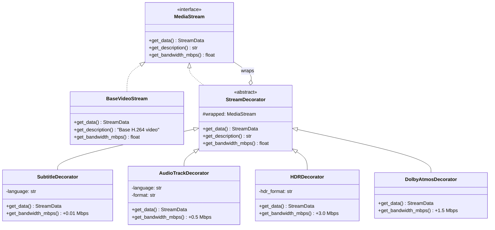

# Netflix: Design Patterns in Practice

## Architecture Overview

Netflix serves 230M+ subscribers across 190+ countries, streaming billions of hours of content monthly. Their microservices architecture (800+ microservices) is a masterclass in applying design patterns at scale.


---

## 1. Strategy Pattern: Adaptive Streaming Quality

### The Problem
Netflix must deliver video to devices ranging from 4K TVs on fiber connections to phones on spotty 3G. A single encoding approach would either waste bandwidth or deliver poor quality.

### How Netflix Solves It
Netflix uses Adaptive Bitrate (ABR) streaming where the quality algorithm is swapped dynamically based on network conditions, device capabilities, and user plan.


### Code

```python
from abc import ABC, abstractmethod
from dataclasses import dataclass
from enum import Enum


class Resolution(Enum):
    SD_480 = (854, 480, 1.5)      # width, height, min_mbps
    HD_720 = (1280, 720, 3.0)
    FHD_1080 = (1920, 1080, 5.0)
    UHD_4K = (3840, 2160, 15.0)


@dataclass
class StreamSession:
    bandwidth_mbps: float
    buffer_seconds: float
    device_max_resolution: Resolution
    plan_max_resolution: Resolution
    is_mobile: bool


@dataclass
class StreamConfig:
    resolution: Resolution
    bitrate_mbps: float
    codec: str


class QualityStrategy(ABC):
    """Strategy interface for selecting streaming quality."""

    @abstractmethod
    def select_quality(self, session: StreamSession) -> StreamConfig:
        pass


class BandwidthBasedStrategy(QualityStrategy):
    """Selects quality purely based on available bandwidth.
    Used when buffer is healthy and connection is stable."""

    def select_quality(self, session: StreamSession) -> StreamConfig:
        # Pick highest resolution that fits within 80% of bandwidth
        usable_bw = session.bandwidth_mbps * 0.8
        best = Resolution.SD_480
        for res in Resolution:
            if res.value[2] <= usable_bw:
                best = res
        # Cap by device and plan limits
        best = min(best, session.device_max_resolution,
                   session.plan_max_resolution, key=lambda r: r.value[2])
        return StreamConfig(
            resolution=best,
            bitrate_mbps=best.value[2],
            codec="H.265" if best == Resolution.UHD_4K else "H.264"
        )


class BufferBasedStrategy(QualityStrategy):
    """Adjusts quality based on buffer health.
    Prioritizes avoiding rebuffering over quality."""

    CRITICAL_BUFFER = 5.0   # seconds
    LOW_BUFFER = 15.0

    def select_quality(self, session: StreamSession) -> StreamConfig:
        if session.buffer_seconds < self.CRITICAL_BUFFER:
            res = Resolution.SD_480  # Drop to lowest immediately
        elif session.buffer_seconds < self.LOW_BUFFER:
            res = Resolution.HD_720
        else:
            res = Resolution.FHD_1080
        res = min(res, session.device_max_resolution,
                  session.plan_max_resolution, key=lambda r: r.value[2])
        return StreamConfig(resolution=res, bitrate_mbps=res.value[2], codec="H.264")


class MobileDataSaverStrategy(QualityStrategy):
    """Caps quality on mobile networks to save data.
    Netflix mobile users can set data usage preferences."""

    def select_quality(self, session: StreamSession) -> StreamConfig:
        # Mobile data saver: cap at 720p, 1.5 Mbps max
        max_bitrate = 1.5
        if session.bandwidth_mbps >= 1.5:
            res = Resolution.HD_720
        else:
            res = Resolution.SD_480
        return StreamConfig(resolution=res, bitrate_mbps=min(max_bitrate, res.value[2]), codec="H.264")


class StreamingContext:
    """Context that delegates quality decisions to the active strategy."""

    def __init__(self, strategy: QualityStrategy):
        self._strategy = strategy

    def set_strategy(self, strategy: QualityStrategy):
        self._strategy = strategy

    def get_stream_config(self, session: StreamSession) -> StreamConfig:
        return self._strategy.select_quality(session)


# --- Usage ---
session = StreamSession(
    bandwidth_mbps=8.5,
    buffer_seconds=25.0,
    device_max_resolution=Resolution.UHD_4K,
    plan_max_resolution=Resolution.FHD_1080,
    is_mobile=False
)

ctx = StreamingContext(BandwidthBasedStrategy())
config = ctx.get_stream_config(session)
print(f"Quality: {config.resolution.name} @ {config.bitrate_mbps} Mbps")
# Output: Quality: FHD_1080 @ 5.0 Mbps (capped by plan)

# Network degrades → switch strategy at runtime
session.buffer_seconds = 4.0
ctx.set_strategy(BufferBasedStrategy())
config = ctx.get_stream_config(session)
print(f"Quality: {config.resolution.name} @ {config.bitrate_mbps} Mbps")
# Output: Quality: SD_480 @ 1.5 Mbps (buffer critical)
```

### Why Strategy?
- **Open/Closed**: New algorithms (ML-based, per-title optimized) added without touching existing code
- **Runtime switching**: Network conditions change every few seconds
- **A/B testing**: Netflix tests different ABR algorithms on different user segments simultaneously

---

## 2. Observer Pattern: Recommendation Engine

### The Problem
Netflix's recommendation system must react to every user action (play, pause, skip, rate, browse) in real-time to update personalized rankings across all content rows.

### How Netflix Solves It
Viewing events are published to interested services. The recommendation engine, analytics, "Continue Watching," and personalization services all subscribe independently.


### Code

```python
from abc import ABC, abstractmethod
from dataclasses import dataclass, field
from enum import Enum
from typing import Optional
import time


class EventType(Enum):
    PLAY = "play"
    PAUSE = "pause"
    STOP = "stop"
    SEEK = "seek"
    COMPLETE = "complete"
    NEAR_COMPLETE = "near_complete"
    THUMBS_UP = "thumbs_up"
    THUMBS_DOWN = "thumbs_down"


@dataclass
class ViewingEvent:
    user_id: str
    content_id: str
    event_type: EventType
    timestamp: float = field(default_factory=time.time)
    metadata: dict = field(default_factory=dict)  # position, duration, etc.


class ViewingObserver(ABC):
    """Observer interface for viewing events."""

    @abstractmethod
    def on_viewing_event(self, event: ViewingEvent) -> None:
        pass


class PlaybackService:
    """Subject: publishes viewing events to all observers."""

    def __init__(self):
        self._observers: list[ViewingObserver] = []

    def subscribe(self, observer: ViewingObserver):
        self._observers.append(observer)

    def unsubscribe(self, observer: ViewingObserver):
        self._observers.remove(observer)

    def _notify(self, event: ViewingEvent):
        for observer in self._observers:
            observer.on_viewing_event(event)

    def record_play(self, user_id: str, content_id: str):
        self._notify(ViewingEvent(user_id, content_id, EventType.PLAY))

    def record_completion(self, user_id: str, content_id: str, pct: float):
        event_type = EventType.NEAR_COMPLETE if pct >= 0.9 else EventType.STOP
        self._notify(ViewingEvent(
            user_id, content_id, event_type,
            metadata={"completion_pct": pct}
        ))


class RecommendationEngine(ViewingObserver):
    """Updates user taste profiles and content rankings in real-time."""

    def __init__(self):
        # genre -> score mapping per user
        self._taste_profiles: dict[str, dict[str, float]] = {}

    # Simplified content-to-genre mapping
    CONTENT_GENRES = {
        "stranger_things": ["sci-fi", "horror", "drama"],
        "the_crown": ["drama", "historical"],
        "squid_game": ["thriller", "drama", "korean"],
    }

    def on_viewing_event(self, event: ViewingEvent):
        if event.event_type in (EventType.PLAY, EventType.NEAR_COMPLETE, EventType.THUMBS_UP):
            profile = self._taste_profiles.setdefault(event.user_id, {})
            genres = self.CONTENT_GENRES.get(event.content_id, [])
            boost = 2.0 if event.event_type == EventType.NEAR_COMPLETE else 1.0
            for genre in genres:
                profile[genre] = profile.get(genre, 0) + boost
            print(f"[Reco] Updated {event.user_id} profile: {profile}")


class ContinueWatchingService(ViewingObserver):
    """Manages the 'Continue Watching' row for each user."""

    def __init__(self):
        self._rows: dict[str, list[dict]] = {}  # user_id -> list of items

    def on_viewing_event(self, event: ViewingEvent):
        row = self._rows.setdefault(event.user_id, [])
        if event.event_type == EventType.PLAY:
            # Move to front of continue watching
            row = [r for r in row if r["content_id"] != event.content_id]
            row.insert(0, {"content_id": event.content_id, "position": 0})
            self._rows[event.user_id] = row
            print(f"[CW] {event.content_id} added to front for {event.user_id}")
        elif event.event_type == EventType.NEAR_COMPLETE:
            # Remove completed, suggest next episode
            self._rows[event.user_id] = [
                r for r in row if r["content_id"] != event.content_id
            ]
            next_ep = self._get_next_episode(event.content_id)
            if next_ep:
                self._rows[event.user_id].insert(0, {"content_id": next_ep, "position": 0})
                print(f"[CW] Queued next: {next_ep} for {event.user_id}")

    def _get_next_episode(self, content_id: str) -> Optional[str]:
        # Simplified: in reality, queries content catalog
        return f"{content_id}_next_ep"


class AnalyticsService(ViewingObserver):
    """Tracks engagement metrics for content and business intelligence."""

    def __init__(self):
        self._play_counts: dict[str, int] = {}

    def on_viewing_event(self, event: ViewingEvent):
        if event.event_type == EventType.PLAY:
            self._play_counts[event.content_id] = self._play_counts.get(event.content_id, 0) + 1
            print(f"[Analytics] {event.content_id} total plays: {self._play_counts[event.content_id]}")


# --- Wire it up ---
playback = PlaybackService()
playback.subscribe(RecommendationEngine())
playback.subscribe(ContinueWatchingService())
playback.subscribe(AnalyticsService())

playback.record_play("user_42", "stranger_things")
playback.record_completion("user_42", "stranger_things", 0.95)
```

### Why Observer?
- **Decoupled services**: Playback doesn't know or care what reacts to events
- **Scalable**: New consumers (A/B test tracker, parental controls) added without changing publisher
- **At Netflix scale**: Implemented via Apache Kafka as the event bus, with each service as an independent consumer group

---

## 3. Circuit Breaker Pattern: Hystrix (Resilience)

### The Problem
With 800+ microservices, a single slow dependency can cascade and bring down the entire system. In 2012, Netflix experienced cascading failures that took down the entire site during peak hours.

### How Netflix Solves It
Netflix built Hystrix (now in maintenance, succeeded by Resilience4j) implementing the circuit breaker pattern. When a service starts failing, the circuit "opens" and requests are short-circuited to a fallback.


### Code

```python
import time
from enum import Enum
from dataclasses import dataclass
from typing import Callable, Any, Optional


class CircuitState(Enum):
    CLOSED = "closed"       # Normal operation
    OPEN = "open"           # Failing, reject requests
    HALF_OPEN = "half_open" # Testing recovery


@dataclass
class CircuitStats:
    total_requests: int = 0
    failures: int = 0
    last_failure_time: float = 0.0


class CircuitBreaker:
    """Netflix Hystrix-inspired circuit breaker."""

    def __init__(
        self,
        name: str,
        failure_threshold: float = 0.5,   # 50% failure rate
        min_requests: int = 20,            # minimum before tripping
        timeout_seconds: float = 5.0,      # time before half-open
        fallback: Optional[Callable] = None
    ):
        self.name = name
        self.failure_threshold = failure_threshold
        self.min_requests = min_requests
        self.timeout_seconds = timeout_seconds
        self.fallback = fallback

        self._state = CircuitState.CLOSED
        self._stats = CircuitStats()

    @property
    def state(self) -> CircuitState:
        if self._state == CircuitState.OPEN:
            # Check if timeout has passed → move to half-open
            if time.time() - self._stats.last_failure_time >= self.timeout_seconds:
                self._state = CircuitState.HALF_OPEN
        return self._state

    def execute(self, func: Callable, *args, **kwargs) -> Any:
        current_state = self.state

        if current_state == CircuitState.OPEN:
            return self._handle_open()

        try:
            result = func(*args, **kwargs)
            self._on_success()
            return result
        except Exception as e:
            self._on_failure()
            if self.fallback:
                return self.fallback()
            raise

    def _handle_open(self):
        print(f"[CircuitBreaker:{self.name}] OPEN - short-circuiting to fallback")
        if self.fallback:
            return self.fallback()
        raise Exception(f"Circuit {self.name} is OPEN")

    def _on_success(self):
        if self._state == CircuitState.HALF_OPEN:
            print(f"[CircuitBreaker:{self.name}] Recovery confirmed -> CLOSED")
            self._state = CircuitState.CLOSED
            self._stats = CircuitStats()  # Reset

    def _on_failure(self):
        self._stats.total_requests += 1
        self._stats.failures += 1
        self._stats.last_failure_time = time.time()

        if self._state == CircuitState.HALF_OPEN:
            print(f"[CircuitBreaker:{self.name}] Recovery failed -> OPEN")
            self._state = CircuitState.OPEN
        elif (self._stats.total_requests >= self.min_requests and
              self._stats.failures / self._stats.total_requests >= self.failure_threshold):
            print(f"[CircuitBreaker:{self.name}] Threshold exceeded -> OPEN")
            self._state = CircuitState.OPEN


# --- Netflix Usage Example ---

class RecommendationService:
    """The actual recommendation service that might be down."""
    def get_personalized(self, user_id: str) -> list[str]:
        # In reality: calls ML model service
        raise ConnectionError("Recommendation service timeout!")


class FallbackRecommendations:
    """Pre-cached popular content as fallback."""
    POPULAR = ["Stranger Things", "Wednesday", "Squid Game", "The Crown"]

    @staticmethod
    def get() -> list[str]:
        print("[Fallback] Serving cached popular titles")
        return FallbackRecommendations.POPULAR


# Wire up circuit breaker around recommendation service
reco_service = RecommendationService()
reco_breaker = CircuitBreaker(
    name="recommendation-service",
    failure_threshold=0.5,
    min_requests=5,         # Lower for demo
    timeout_seconds=10.0,
    fallback=FallbackRecommendations.get
)

# Simulate requests - service is failing
for i in range(7):
    result = reco_breaker.execute(reco_service.get_personalized, "user_42")
    print(f"  Request {i+1}: {result}")
# After 5 failures at 100% rate → circuit opens
# Requests 6, 7 go straight to fallback without hitting the broken service
```

### Why Circuit Breaker?
- **Prevents cascade**: One broken service doesn't drag down 800 others
- **Fast failure**: Users get cached/popular content in 10ms instead of waiting 30s for a timeout
- **Self-healing**: Half-open state automatically tests recovery
- **Netflix insight**: They found that showing popular content as fallback had only ~2% lower engagement than personalized results

---

## 4. Proxy Pattern: Open Connect CDN

### The Problem
Streaming 4K video from a central US data center to a user in Tokyo would be unwatchable (latency, congestion). Netflix accounts for ~15% of global internet traffic.

### How Netflix Solves It
Netflix's Open Connect CDN places proxy servers (Open Connect Appliances) inside ISP networks worldwide. These proxies cache and serve content, acting as local representatives of Netflix's origin servers.


### Code

```python
from abc import ABC, abstractmethod
from dataclasses import dataclass
from collections import OrderedDict


@dataclass
class StreamChunk:
    data: bytes
    bitrate: float
    segment_id: int


@dataclass
class GeoLocation:
    city: str
    country: str
    isp: str
    lat: float
    lon: float


class ContentServer(ABC):
    """Interface for any server that can stream content."""

    @abstractmethod
    def stream_segment(self, content_id: str, segment_id: int) -> StreamChunk:
        pass


class OriginServer(ContentServer):
    """Netflix's master content library in AWS."""

    def stream_segment(self, content_id: str, segment_id: int) -> StreamChunk:
        print(f"[Origin] Fetching {content_id}:seg{segment_id} from master library (slow)")
        return StreamChunk(data=b"video_data", bitrate=5.0, segment_id=segment_id)


class CDNEdgeProxy(ContentServer):
    """Open Connect Appliance - proxy inside ISP network.

    Acts as a transparent proxy:
    - Same interface as origin server
    - Caches popular content locally
    - Falls back to origin on cache miss
    - Adds access logging and bandwidth tracking
    """

    def __init__(self, location: GeoLocation, origin: OriginServer, cache_size: int = 1000):
        self._location = location
        self._origin = origin
        self._cache: OrderedDict[str, StreamChunk] = OrderedDict()
        self._cache_size = cache_size
        self._stats = {"cache_hits": 0, "cache_misses": 0}

    def stream_segment(self, content_id: str, segment_id: int) -> StreamChunk:
        cache_key = f"{content_id}:{segment_id}"

        # Check local cache first
        if cache_key in self._cache:
            self._stats["cache_hits"] += 1
            self._cache.move_to_end(cache_key)  # LRU update
            print(f"[CDN:{self._location.city}] Cache HIT for {cache_key}")
            return self._cache[cache_key]

        # Cache miss - fetch from origin
        self._stats["cache_misses"] += 1
        print(f"[CDN:{self._location.city}] Cache MISS for {cache_key}, fetching from origin")
        chunk = self._origin.stream_segment(content_id, segment_id)

        # Store in cache (evict LRU if full)
        if len(self._cache) >= self._cache_size:
            self._cache.popitem(last=False)  # Remove oldest
        self._cache[cache_key] = chunk
        return chunk

    @property
    def hit_rate(self) -> float:
        total = self._stats["cache_hits"] + self._stats["cache_misses"]
        return self._stats["cache_hits"] / total if total > 0 else 0.0


class SteeringService:
    """Directs users to the best CDN edge server based on location and load."""

    def __init__(self):
        self._edges: list[CDNEdgeProxy] = []

    def register_edge(self, edge: CDNEdgeProxy):
        self._edges.append(edge)

    def get_server(self, user_location: GeoLocation) -> ContentServer:
        # Simplified: pick edge in same country
        for edge in self._edges:
            if edge._location.country == user_location.country:
                return edge
        return self._edges[0]  # Nearest available


# --- Usage ---
origin = OriginServer()
tokyo_edge = CDNEdgeProxy(
    GeoLocation("Tokyo", "Japan", "NTT", 35.68, 139.69), origin
)

# First request: cache miss
tokyo_edge.stream_segment("stranger_things_s4e1", 1)
# Second request: cache hit (fast!)
tokyo_edge.stream_segment("stranger_things_s4e1", 1)

print(f"Cache hit rate: {tokyo_edge.hit_rate:.0%}")
# Output: Cache hit rate: 50%
```

### Why Proxy?
- **Transparent**: Clients use the same interface regardless of origin vs CDN
- **Performance**: Cache hit rate >95% means most content is served locally
- **Netflix insight**: Open Connect serves ~95% of all Netflix traffic from ISP-local appliances

---

## 5. Factory Pattern: Device-Specific Player Creation

### The Problem
Netflix runs on 2000+ device types: Smart TVs (Samsung, LG, Sony), game consoles (PS5, Xbox), phones (iOS, Android), browsers, Roku, Fire TV. Each needs a different player implementation with different codec support, DRM, and UI capabilities.


### Code

```python
from abc import ABC, abstractmethod
from dataclasses import dataclass
from enum import Enum


class DeviceType(Enum):
    WEB_CHROME = "web_chrome"
    WEB_SAFARI = "web_safari"
    IOS = "ios"
    ANDROID = "android"
    SMART_TV_SAMSUNG = "smart_tv_samsung"
    SMART_TV_LG = "smart_tv_lg"
    PLAYSTATION = "playstation"
    FIRE_TV = "fire_tv"


@dataclass
class DeviceInfo:
    device_type: DeviceType
    os_version: str
    app_version: str
    screen_width: int
    screen_height: int


class VideoPlayer(ABC):
    @abstractmethod
    def initialize(self) -> None:
        pass

    @abstractmethod
    def play(self, content_id: str) -> None:
        pass

    @abstractmethod
    def get_supported_codecs(self) -> list[str]:
        pass

    @abstractmethod
    def get_drm_system(self) -> str:
        pass


class WebPlayer(VideoPlayer):
    def __init__(self, browser: str):
        self._browser = browser

    def initialize(self):
        print(f"[WebPlayer] Init MSE-based player for {self._browser}")

    def play(self, content_id: str):
        print(f"[WebPlayer] Streaming {content_id} via DASH/MSE")

    def get_supported_codecs(self) -> list[str]:
        if self._browser == "safari":
            return ["H.264"]  # Safari limited H.265 support
        return ["H.264", "VP9", "AV1"]

    def get_drm_system(self) -> str:
        return "FairPlay" if self._browser == "safari" else "Widevine"


class MobilePlayer(VideoPlayer):
    def __init__(self, platform: str):
        self._platform = platform

    def initialize(self):
        print(f"[MobilePlayer] Init native player for {self._platform}")

    def play(self, content_id: str):
        print(f"[MobilePlayer] Streaming {content_id} with offline support")

    def get_supported_codecs(self) -> list[str]:
        return ["H.264", "H.265"]

    def get_drm_system(self) -> str:
        return "FairPlay" if self._platform == "ios" else "Widevine"


class SmartTVPlayer(VideoPlayer):
    def __init__(self, manufacturer: str):
        self._manufacturer = manufacturer

    def initialize(self):
        print(f"[SmartTVPlayer] Init for {self._manufacturer} TV platform")

    def play(self, content_id: str):
        print(f"[SmartTVPlayer] 4K HDR streaming {content_id}")

    def get_supported_codecs(self) -> list[str]:
        return ["H.264", "H.265", "AV1", "Dolby Vision"]

    def get_drm_system(self) -> str:
        return "PlayReady"


class PlayerFactory:
    """Creates the correct player based on device capabilities.

    Netflix's actual player selection considers hundreds of device
    profiles stored in a device database.
    """

    _DEVICE_MAP = {
        DeviceType.WEB_CHROME: lambda: WebPlayer("chrome"),
        DeviceType.WEB_SAFARI: lambda: WebPlayer("safari"),
        DeviceType.IOS: lambda: MobilePlayer("ios"),
        DeviceType.ANDROID: lambda: MobilePlayer("android"),
        DeviceType.SMART_TV_SAMSUNG: lambda: SmartTVPlayer("Samsung"),
        DeviceType.SMART_TV_LG: lambda: SmartTVPlayer("LG"),
        DeviceType.PLAYSTATION: lambda: SmartTVPlayer("PlayStation"),
        DeviceType.FIRE_TV: lambda: SmartTVPlayer("Amazon"),
    }

    @classmethod
    def create(cls, device_info: DeviceInfo) -> VideoPlayer:
        creator = cls._DEVICE_MAP.get(device_info.device_type)
        if not creator:
            raise ValueError(f"Unsupported device: {device_info.device_type}")
        player = creator()
        player.initialize()
        return player


# --- Usage ---
device = DeviceInfo(DeviceType.SMART_TV_SAMSUNG, "Tizen 7.0", "5.2.1", 3840, 2160)
player = PlayerFactory.create(device)
print(f"Codecs: {player.get_supported_codecs()}")
print(f"DRM: {player.get_drm_system()}")
player.play("wednesday_s1e1")
```

---

## 6. Decorator Pattern: Stream Enhancement Layers

### The Problem
A base video stream needs to be progressively enhanced with subtitles, multiple audio tracks, HDR metadata, Dolby Atmos, and accessibility features. Different users need different combinations of these features.



### Code

```python
from abc import ABC, abstractmethod


class MediaStream(ABC):
    @abstractmethod
    def get_description(self) -> str:
        pass

    @abstractmethod
    def get_bandwidth_mbps(self) -> float:
        pass


class BaseVideoStream(MediaStream):
    def __init__(self, content_id: str, resolution: str = "1080p"):
        self._content_id = content_id
        self._resolution = resolution

    def get_description(self) -> str:
        return f"Base video [{self._content_id}] @ {self._resolution}"

    def get_bandwidth_mbps(self) -> float:
        return 5.0  # Base 1080p stream


class StreamDecorator(MediaStream, ABC):
    def __init__(self, wrapped: MediaStream):
        self._wrapped = wrapped

    def get_description(self) -> str:
        return self._wrapped.get_description()

    def get_bandwidth_mbps(self) -> float:
        return self._wrapped.get_bandwidth_mbps()


class SubtitleDecorator(StreamDecorator):
    def __init__(self, wrapped: MediaStream, language: str):
        super().__init__(wrapped)
        self._language = language

    def get_description(self) -> str:
        return f"{self._wrapped.get_description()} + Subtitles({self._language})"

    def get_bandwidth_mbps(self) -> float:
        return self._wrapped.get_bandwidth_mbps() + 0.01  # Text is tiny


class AudioTrackDecorator(StreamDecorator):
    def __init__(self, wrapped: MediaStream, language: str, format: str = "AAC 5.1"):
        super().__init__(wrapped)
        self._language = language
        self._format = format

    def get_description(self) -> str:
        return f"{self._wrapped.get_description()} + Audio({self._language} {self._format})"

    def get_bandwidth_mbps(self) -> float:
        return self._wrapped.get_bandwidth_mbps() + 0.5


class HDRDecorator(StreamDecorator):
    def __init__(self, wrapped: MediaStream, hdr_format: str = "Dolby Vision"):
        super().__init__(wrapped)
        self._hdr_format = hdr_format

    def get_description(self) -> str:
        return f"{self._wrapped.get_description()} + {self._hdr_format}"

    def get_bandwidth_mbps(self) -> float:
        return self._wrapped.get_bandwidth_mbps() + 3.0


class DolbyAtmosDecorator(StreamDecorator):
    def __init__(self, wrapped: MediaStream):
        super().__init__(wrapped)

    def get_description(self) -> str:
        return f"{self._wrapped.get_description()} + Dolby Atmos"

    def get_bandwidth_mbps(self) -> float:
        return self._wrapped.get_bandwidth_mbps() + 1.5


# --- Build a premium stream for a 4K TV viewer in Japan ---
stream = BaseVideoStream("stranger_things_s4e1", "4K")
stream = HDRDecorator(stream, "Dolby Vision")
stream = DolbyAtmosDecorator(stream)
stream = AudioTrackDecorator(stream, "Japanese", "AAC 5.1")
stream = AudioTrackDecorator(stream, "English", "Atmos")
stream = SubtitleDecorator(stream, "Japanese")
stream = SubtitleDecorator(stream, "English")

print(stream.get_description())
# Base video [stranger_things_s4e1] @ 4K + Dolby Vision + Dolby Atmos
#   + Audio(Japanese AAC 5.1) + Audio(English Atmos) + Subtitles(Japanese) + Subtitles(English)

print(f"Total bandwidth: {stream.get_bandwidth_mbps():.2f} Mbps")
# Total bandwidth: 11.52 Mbps
```

### Why Decorator?
- **Combinatorial explosion avoidance**: 5 subtitle languages x 3 audio formats x 2 HDR types = 30 combinations. Decorators compose freely instead of creating 30 classes
- **Dynamic composition**: Each user gets a different combination based on preferences and device
- **Single Responsibility**: Each decorator handles one concern

---

## How Patterns Interact at Netflix


### The Full Play Request Journey

1. **Factory Pattern** creates the right player for the device
2. **Strategy Pattern** selects the quality algorithm based on network/device
3. **Decorator Pattern** layers subtitles, audio, HDR onto the base stream
4. **Proxy Pattern** serves content from the nearest CDN edge
5. **Circuit Breaker** protects against service failures with graceful fallbacks
6. **Observer Pattern** captures viewing behavior for recommendations (async)

---

## Key Takeaways for Interviews

| Pattern | Netflix Use Case | Key Benefit |
|---------|-----------------|-------------|
| Strategy | Adaptive bitrate streaming | Runtime algorithm switching |
| Observer | Recommendation engine events | Decoupled event processing |
| Circuit Breaker | Hystrix service resilience | Cascade failure prevention |
| Proxy | Open Connect CDN | Transparent caching layer |
| Factory | Multi-device player creation | Centralized creation logic |
| Decorator | Stream enhancement layers | Composable feature stacking |

> **Interview tip**: When discussing Netflix architecture, emphasize the **scale** (230M subscribers, 800+ microservices, 15% of internet traffic) and how patterns enable **independent service evolution** - teams can deploy 100+ times per day because patterns enforce clean boundaries between services.
