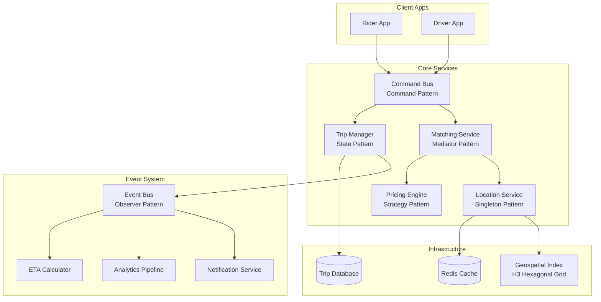
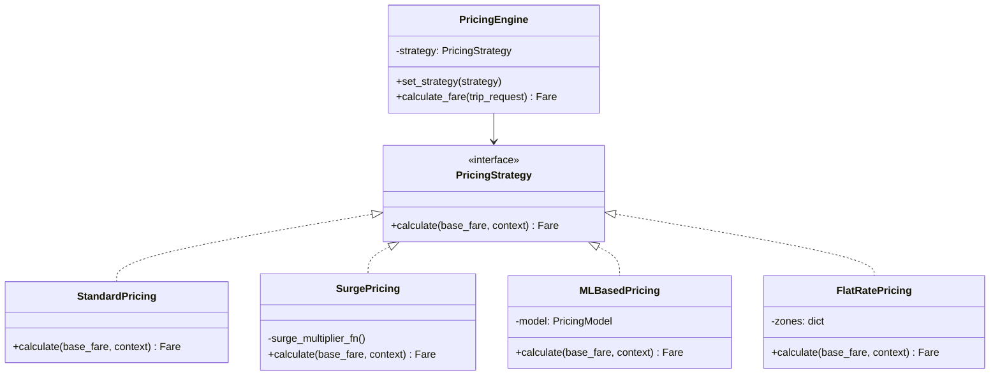
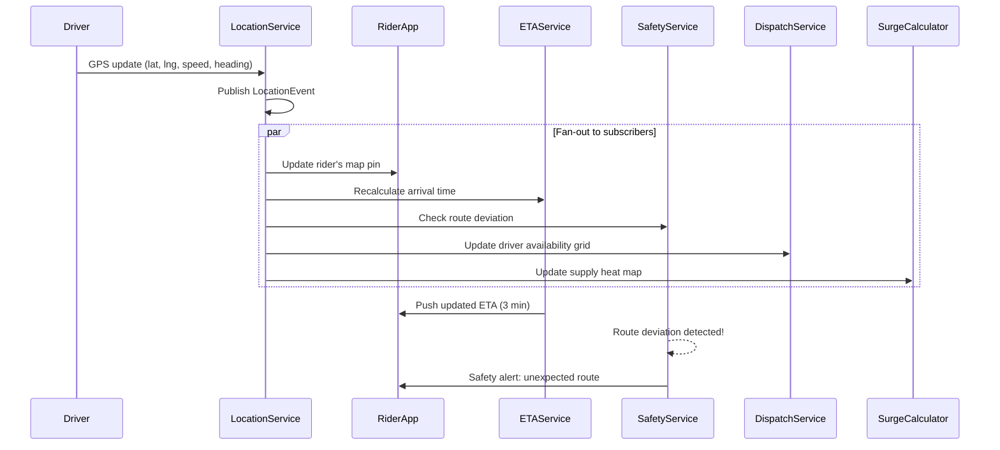
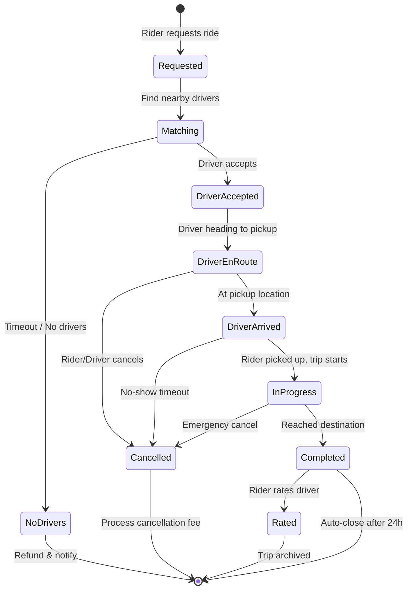
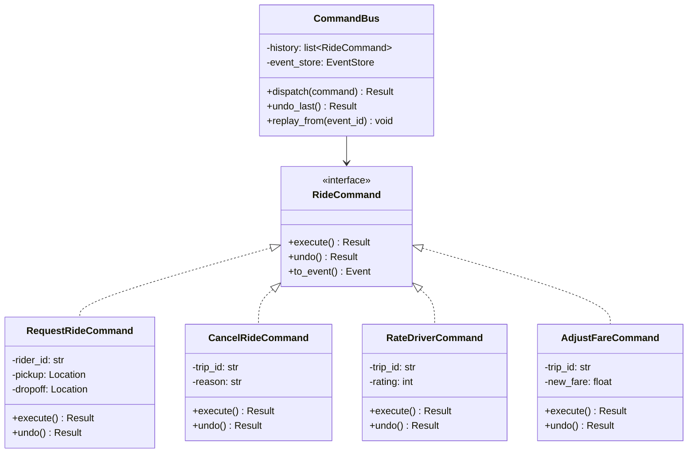
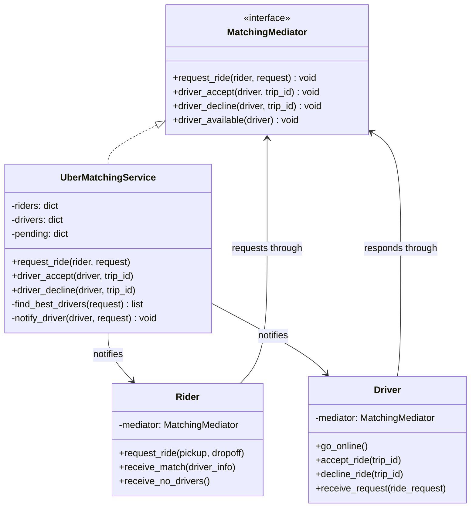
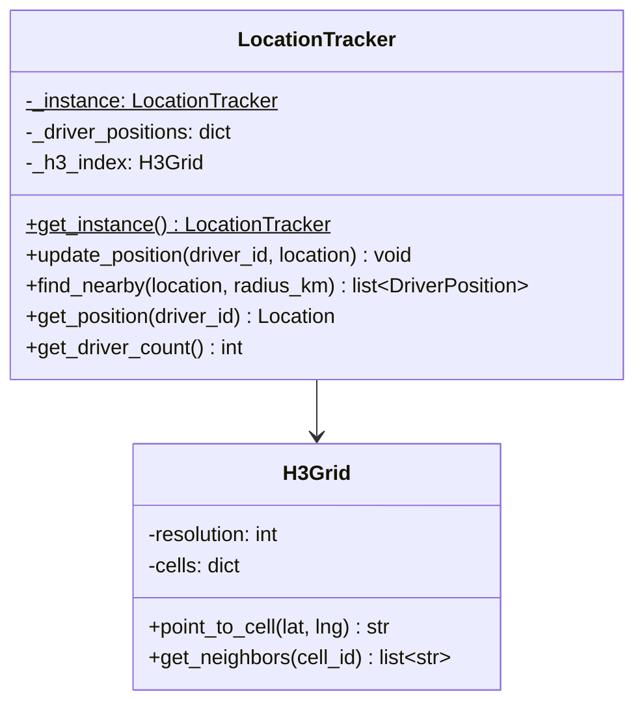
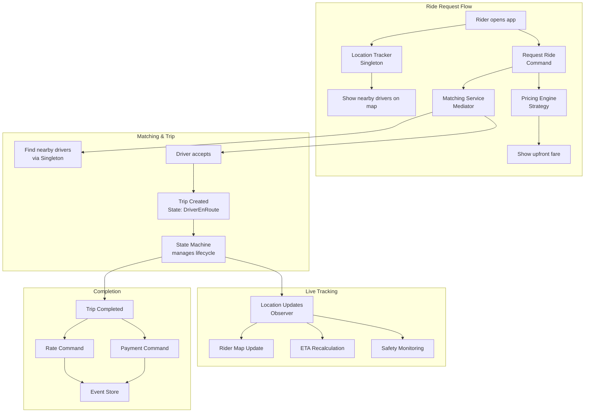

# Uber: Design Patterns in Practice

## System Context

Uber processes millions of trips daily across 70+ countries. Their real-time platform matches riders with drivers, calculates dynamic pricing, tracks locations, and processes payments -- all within seconds. The engineering challenges of real-time geospatial matching at scale make Uber a rich case study for design patterns.



---

## 1. Strategy Pattern: Dynamic Pricing (Surge)

### The Problem
Uber needs to balance supply (drivers) and demand (riders) in real-time. When demand spikes (rainstorm, concert ending, New Year's Eve), prices must increase to incentivize more drivers to come online. Different cities, times, and events need different pricing algorithms.

### How Uber Solves It
The pricing engine uses interchangeable strategies. Each strategy can factor in different signals, and Uber A/B tests new pricing algorithms on different markets.



### Code

```python
from abc import ABC, abstractmethod
from dataclasses import dataclass
from enum import Enum


class RideType(Enum):
    UBER_X = "UberX"
    UBER_XL = "UberXL"
    UBER_BLACK = "UberBlack"
    UBER_POOL = "UberPool"


@dataclass
class GeoPoint:
    lat: float
    lng: float


@dataclass
class PricingContext:
    pickup: GeoPoint
    dropoff: GeoPoint
    distance_km: float
    duration_minutes: float
    ride_type: RideType
    demand_in_area: int      # Active ride requests in region
    supply_in_area: int      # Available drivers in region
    time_of_day: int         # Hour (0-23)
    is_airport: bool = False
    is_event: bool = False


@dataclass
class Fare:
    base_amount: float
    surge_multiplier: float
    final_amount: float
    currency: str = "USD"
    breakdown: dict = None


class PricingStrategy(ABC):
    @abstractmethod
    def calculate(self, base_fare: float, context: PricingContext) -> Fare:
        pass


class StandardPricing(PricingStrategy):
    """Normal pricing: base + per-km + per-minute."""

    RATES = {
        RideType.UBER_X:     {"per_km": 1.00, "per_min": 0.20, "minimum": 5.00},
        RideType.UBER_XL:    {"per_km": 1.50, "per_min": 0.30, "minimum": 8.00},
        RideType.UBER_BLACK:  {"per_km": 2.50, "per_min": 0.50, "minimum": 15.00},
        RideType.UBER_POOL:  {"per_km": 0.70, "per_min": 0.10, "minimum": 3.00},
    }

    def calculate(self, base_fare: float, context: PricingContext) -> Fare:
        rates = self.RATES[context.ride_type]
        amount = (base_fare +
                  context.distance_km * rates["per_km"] +
                  context.duration_minutes * rates["per_min"])
        amount = max(amount, rates["minimum"])
        return Fare(
            base_amount=amount,
            surge_multiplier=1.0,
            final_amount=round(amount, 2),
            breakdown={"base": base_fare, "distance": context.distance_km * rates["per_km"],
                       "time": context.duration_minutes * rates["per_min"]}
        )


class SurgePricing(PricingStrategy):
    """Classic surge pricing based on supply/demand ratio."""

    SURGE_TIERS = [
        (0.3, 3.0),  # demand/supply ratio > 0.3 → 3.0x
        (0.5, 2.0),  # ratio > 0.5 → 2.0x
        (0.7, 1.5),  # ratio > 0.7 → 1.5x
        (0.9, 1.25), # ratio > 0.9 → 1.25x
    ]

    def calculate(self, base_fare: float, context: PricingContext) -> Fare:
        standard = StandardPricing().calculate(base_fare, context)
        supply_ratio = context.supply_in_area / max(context.demand_in_area, 1)

        multiplier = 1.0
        for ratio_threshold, surge in self.SURGE_TIERS:
            if supply_ratio <= ratio_threshold:
                multiplier = surge
                break

        return Fare(
            base_amount=standard.base_amount,
            surge_multiplier=multiplier,
            final_amount=round(standard.base_amount * multiplier, 2),
            breakdown={**standard.breakdown, "surge": f"{multiplier}x"}
        )


class MLBasedPricing(PricingStrategy):
    """ML model predicts willingness-to-pay and optimal price.
    Uber moved from simple surge to 'Upfront Pricing' using ML."""

    def calculate(self, base_fare: float, context: PricingContext) -> Fare:
        standard = StandardPricing().calculate(base_fare, context)

        # Simulated ML factors
        time_factor = 1.3 if 7 <= context.time_of_day <= 9 or 17 <= context.time_of_day <= 19 else 1.0
        airport_factor = 1.15 if context.is_airport else 1.0
        event_factor = 1.4 if context.is_event else 1.0

        ml_multiplier = time_factor * airport_factor * event_factor
        # Cap to prevent extreme prices
        ml_multiplier = min(ml_multiplier, 3.5)

        return Fare(
            base_amount=standard.base_amount,
            surge_multiplier=round(ml_multiplier, 2),
            final_amount=round(standard.base_amount * ml_multiplier, 2),
            breakdown={**standard.breakdown, "ml_multiplier": ml_multiplier}
        )


class FlatRatePricing(PricingStrategy):
    """Fixed price between predefined zones (e.g., airport to downtown)."""

    ZONE_RATES = {
        ("airport", "downtown"): 45.00,
        ("airport", "midtown"): 55.00,
        ("downtown", "airport"): 45.00,
    }

    def calculate(self, base_fare: float, context: PricingContext) -> Fare:
        zone_key = self._get_zone_pair(context.pickup, context.dropoff)
        flat_rate = self.ZONE_RATES.get(zone_key)
        if flat_rate:
            return Fare(base_amount=flat_rate, surge_multiplier=1.0,
                        final_amount=flat_rate, breakdown={"flat_rate": flat_rate})
        # Fallback to standard
        return StandardPricing().calculate(base_fare, context)

    def _get_zone_pair(self, pickup: GeoPoint, dropoff: GeoPoint):
        # Simplified zone detection
        return ("airport", "downtown")


class PricingEngine:
    """Context that delegates pricing to the active strategy."""

    def __init__(self, strategy: PricingStrategy):
        self._strategy = strategy

    def set_strategy(self, strategy: PricingStrategy):
        self._strategy = strategy

    def calculate_fare(self, context: PricingContext) -> Fare:
        base = 2.50  # Base fare
        return self._strategy.calculate(base, context)


# --- Usage ---
ctx = PricingContext(
    pickup=GeoPoint(40.7128, -74.0060),
    dropoff=GeoPoint(40.7580, -73.9855),
    distance_km=8.5,
    duration_minutes=22,
    ride_type=RideType.UBER_X,
    demand_in_area=150,
    supply_in_area=30,  # Very few drivers!
    time_of_day=18,
    is_event=True
)

engine = PricingEngine(SurgePricing())
fare = engine.calculate_fare(ctx)
print(f"Surge fare: ${fare.final_amount} ({fare.surge_multiplier}x)")
# Surge fare: $39.90 (3.0x) - supply/ratio = 30/150 = 0.2 → 3.0x

# Switch to ML-based for A/B test group
engine.set_strategy(MLBasedPricing())
fare = engine.calculate_fare(ctx)
print(f"ML fare: ${fare.final_amount} ({fare.surge_multiplier}x)")
# ML fare: $24.22 (1.82x) - rush hour 1.3 * event 1.4
```

### Why Strategy?
- **A/B testing**: Different pricing algorithms tested on different user segments
- **Market-specific**: Some cities use surge, others use flat rates, some use ML
- **Regulatory compliance**: Some regions ban surge pricing; easy to swap strategies

---

## 2. Observer Pattern: Real-Time Trip Tracking

### The Problem
When a trip is in progress, multiple systems need real-time location updates: the rider's map, ETA calculations, safety monitoring, driver earnings tracker, and the dispatch system for nearby ride requests.

### How Uber Solves It
Location updates are published as events. Each service subscribes independently, processing the same location stream for different purposes.



### Code

```python
from abc import ABC, abstractmethod
from dataclasses import dataclass, field
from enum import Enum
import time
import math


@dataclass
class Location:
    lat: float
    lng: float
    speed_kmh: float = 0.0
    heading: float = 0.0      # Degrees from north
    accuracy_m: float = 5.0
    timestamp: float = field(default_factory=time.time)


class LocationEventType(Enum):
    UPDATE = "update"
    TRIP_START = "trip_start"
    TRIP_END = "trip_end"
    DRIVER_ONLINE = "driver_online"
    DRIVER_OFFLINE = "driver_offline"


@dataclass
class LocationEvent:
    driver_id: str
    trip_id: str | None
    location: Location
    event_type: LocationEventType


class LocationObserver(ABC):
    @abstractmethod
    def on_location_event(self, event: LocationEvent) -> None:
        pass


class LocationService:
    """Central location hub - publishes driver location events."""

    def __init__(self):
        self._observers: list[LocationObserver] = []
        self._driver_locations: dict[str, Location] = {}

    def subscribe(self, observer: LocationObserver):
        self._observers.append(observer)

    def update_location(self, driver_id: str, trip_id: str | None, location: Location):
        self._driver_locations[driver_id] = location
        event = LocationEvent(driver_id, trip_id, location, LocationEventType.UPDATE)
        for observer in self._observers:
            observer.on_location_event(event)


class RiderMapUpdater(LocationObserver):
    """Pushes real-time driver position to the rider's app via WebSocket."""

    def on_location_event(self, event: LocationEvent):
        if event.trip_id and event.event_type == LocationEventType.UPDATE:
            print(f"[RiderMap] Driver {event.driver_id} at "
                  f"({event.location.lat:.4f}, {event.location.lng:.4f}) "
                  f"speed={event.location.speed_kmh}km/h")


class ETACalculator(LocationObserver):
    """Recalculates estimated time of arrival on each location update."""

    def __init__(self):
        self._destinations: dict[str, Location] = {}  # trip_id -> destination

    def set_destination(self, trip_id: str, dest: Location):
        self._destinations[trip_id] = dest

    def on_location_event(self, event: LocationEvent):
        if event.trip_id in self._destinations:
            dest = self._destinations[event.trip_id]
            distance = self._haversine(event.location, dest)
            speed = max(event.location.speed_kmh, 20)  # Assume min 20 km/h
            eta_minutes = (distance / speed) * 60
            print(f"[ETA] Trip {event.trip_id}: {eta_minutes:.1f} min remaining "
                  f"({distance:.1f} km at {speed} km/h)")

    def _haversine(self, a: Location, b: Location) -> float:
        R = 6371  # Earth radius in km
        dlat = math.radians(b.lat - a.lat)
        dlng = math.radians(b.lng - a.lng)
        x = (math.sin(dlat/2)**2 +
             math.cos(math.radians(a.lat)) * math.cos(math.radians(b.lat)) *
             math.sin(dlng/2)**2)
        return R * 2 * math.atan2(math.sqrt(x), math.sqrt(1-x))


class SafetyMonitor(LocationObserver):
    """Detects route deviations and unsafe driving patterns."""

    def __init__(self):
        self._expected_routes: dict[str, list[Location]] = {}
        self.MAX_DEVIATION_KM = 0.5

    def set_expected_route(self, trip_id: str, waypoints: list[Location]):
        self._expected_routes[trip_id] = waypoints

    def on_location_event(self, event: LocationEvent):
        if event.trip_id in self._expected_routes:
            route = self._expected_routes[event.trip_id]
            min_dist = min(self._distance(event.location, wp) for wp in route)
            if min_dist > self.MAX_DEVIATION_KM:
                print(f"[SAFETY ALERT] Trip {event.trip_id}: "
                      f"Driver deviated {min_dist:.2f}km from expected route!")

        # Speed check
        if event.location.speed_kmh > 140:
            print(f"[SAFETY ALERT] Driver {event.driver_id}: "
                  f"Excessive speed {event.location.speed_kmh}km/h!")

    def _distance(self, a: Location, b: Location) -> float:
        # Simplified euclidean approximation for short distances
        return math.sqrt((a.lat - b.lat)**2 + (a.lng - b.lng)**2) * 111  # ~111 km per degree


class SupplyHeatMapper(LocationObserver):
    """Tracks driver density across the city for surge pricing."""

    def __init__(self, grid_size: float = 0.01):
        self._grid: dict[tuple, int] = {}  # (grid_lat, grid_lng) -> driver count
        self._grid_size = grid_size

    def on_location_event(self, event: LocationEvent):
        if event.event_type == LocationEventType.UPDATE:
            cell = (round(event.location.lat / self._grid_size) * self._grid_size,
                    round(event.location.lng / self._grid_size) * self._grid_size)
            self._grid[cell] = self._grid.get(cell, 0) + 1

    def get_supply_at(self, lat: float, lng: float) -> int:
        cell = (round(lat / self._grid_size) * self._grid_size,
                round(lng / self._grid_size) * self._grid_size)
        return self._grid.get(cell, 0)


# --- Wire up ---
loc_service = LocationService()

rider_map = RiderMapUpdater()
eta_calc = ETACalculator()
safety = SafetyMonitor()
supply = SupplyHeatMapper()

loc_service.subscribe(rider_map)
loc_service.subscribe(eta_calc)
loc_service.subscribe(safety)
loc_service.subscribe(supply)

# Set up trip context
eta_calc.set_destination("trip_123", Location(40.7580, -73.9855))

# Simulate driver movement
loc_service.update_location("driver_42", "trip_123",
    Location(40.7128, -74.0060, speed_kmh=45, heading=30))
# [RiderMap] Driver driver_42 at (40.7128, -74.0060) speed=45km/h
# [ETA] Trip trip_123: 7.2 min remaining (5.4 km at 45 km/h)
```

### Why Observer?
- **Independent scaling**: ETA service can scale separately from safety monitoring
- **At Uber's scale**: Location updates flow through Apache Kafka, each service consumes independently
- **Uber engineering insight**: They process ~1 million location updates per second globally

---

## 3. State Pattern: Trip Lifecycle

### The Problem
A trip goes through many states: Requested, Matching, DriverEnRoute, Arrived, InProgress, Completed, Cancelled, Disputed. Each state has different allowed actions and behaviors. Managing this with if/else chains becomes unmaintainable.

### How Uber Solves It
Each state is an object that encapsulates the behavior for that phase. Transitions are explicit and validated.



### Code

```python
from abc import ABC, abstractmethod
from dataclasses import dataclass, field
from enum import Enum
from datetime import datetime


class TripStatus(Enum):
    REQUESTED = "requested"
    MATCHING = "matching"
    DRIVER_ACCEPTED = "driver_accepted"
    DRIVER_EN_ROUTE = "driver_en_route"
    DRIVER_ARRIVED = "driver_arrived"
    IN_PROGRESS = "in_progress"
    COMPLETED = "completed"
    CANCELLED = "cancelled"


@dataclass
class TripData:
    trip_id: str
    rider_id: str
    driver_id: str | None = None
    pickup_lat: float = 0.0
    pickup_lng: float = 0.0
    dropoff_lat: float = 0.0
    dropoff_lng: float = 0.0
    fare: float = 0.0
    started_at: datetime | None = None
    completed_at: datetime | None = None
    cancellation_fee: float = 0.0
    history: list[str] = field(default_factory=list)


class TripState(ABC):
    """Base state - defines all possible actions.
    Default implementation raises errors for invalid transitions."""

    @abstractmethod
    def get_status(self) -> TripStatus:
        pass

    def assign_driver(self, trip: 'Trip', driver_id: str):
        raise InvalidTransition(f"Cannot assign driver in {self.get_status().value} state")

    def driver_arrived(self, trip: 'Trip'):
        raise InvalidTransition(f"Cannot mark arrived in {self.get_status().value} state")

    def start_trip(self, trip: 'Trip'):
        raise InvalidTransition(f"Cannot start trip in {self.get_status().value} state")

    def complete_trip(self, trip: 'Trip', fare: float):
        raise InvalidTransition(f"Cannot complete trip in {self.get_status().value} state")

    def cancel(self, trip: 'Trip', cancelled_by: str):
        raise InvalidTransition(f"Cannot cancel in {self.get_status().value} state")


class InvalidTransition(Exception):
    pass


class RequestedState(TripState):
    def get_status(self) -> TripStatus:
        return TripStatus.REQUESTED

    def assign_driver(self, trip: 'Trip', driver_id: str):
        trip.data.driver_id = driver_id
        trip.data.history.append(f"Driver {driver_id} assigned")
        trip._set_state(DriverEnRouteState())
        print(f"[Trip:{trip.data.trip_id}] Driver {driver_id} accepted, en route to pickup")

    def cancel(self, trip: 'Trip', cancelled_by: str):
        trip.data.history.append(f"Cancelled by {cancelled_by} (no fee - before match)")
        trip._set_state(CancelledState())
        print(f"[Trip:{trip.data.trip_id}] Cancelled before matching - no fee")


class DriverEnRouteState(TripState):
    def get_status(self) -> TripStatus:
        return TripStatus.DRIVER_EN_ROUTE

    def driver_arrived(self, trip: 'Trip'):
        trip.data.history.append("Driver arrived at pickup")
        trip._set_state(DriverArrivedState())
        print(f"[Trip:{trip.data.trip_id}] Driver arrived at pickup point")

    def cancel(self, trip: 'Trip', cancelled_by: str):
        if cancelled_by == "rider":
            trip.data.cancellation_fee = 5.00  # Rider cancels after match
            trip.data.history.append(f"Rider cancelled - $5 fee")
        else:
            trip.data.cancellation_fee = 0.00  # Driver cancel, no fee to rider
            trip.data.history.append(f"Driver cancelled - no fee")
        trip._set_state(CancelledState())
        print(f"[Trip:{trip.data.trip_id}] Cancelled by {cancelled_by}, "
              f"fee=${trip.data.cancellation_fee}")


class DriverArrivedState(TripState):
    def get_status(self) -> TripStatus:
        return TripStatus.DRIVER_ARRIVED

    def start_trip(self, trip: 'Trip'):
        trip.data.started_at = datetime.now()
        trip.data.history.append("Trip started - rider picked up")
        trip._set_state(InProgressState())
        print(f"[Trip:{trip.data.trip_id}] Trip started!")

    def cancel(self, trip: 'Trip', cancelled_by: str):
        # No-show: rider gets charged
        trip.data.cancellation_fee = 5.00
        trip.data.history.append("No-show cancellation")
        trip._set_state(CancelledState())


class InProgressState(TripState):
    def get_status(self) -> TripStatus:
        return TripStatus.IN_PROGRESS

    def complete_trip(self, trip: 'Trip', fare: float):
        trip.data.fare = fare
        trip.data.completed_at = datetime.now()
        trip.data.history.append(f"Trip completed - fare ${fare:.2f}")
        trip._set_state(CompletedState())
        print(f"[Trip:{trip.data.trip_id}] Completed! Fare: ${fare:.2f}")

    def cancel(self, trip: 'Trip', cancelled_by: str):
        # Emergency cancel during trip - partial fare charged
        elapsed = (datetime.now() - trip.data.started_at).seconds / 60
        trip.data.fare = elapsed * 0.20  # Per-minute rate for partial
        trip.data.history.append(f"Emergency cancel at {elapsed:.0f} min")
        trip._set_state(CancelledState())


class CompletedState(TripState):
    def get_status(self) -> TripStatus:
        return TripStatus.COMPLETED

    # No transitions allowed from completed - trip is done


class CancelledState(TripState):
    def get_status(self) -> TripStatus:
        return TripStatus.CANCELLED

    # No transitions allowed from cancelled


class Trip:
    """Trip context - delegates all actions to the current state."""

    def __init__(self, trip_id: str, rider_id: str, pickup: tuple, dropoff: tuple):
        self.data = TripData(
            trip_id=trip_id, rider_id=rider_id,
            pickup_lat=pickup[0], pickup_lng=pickup[1],
            dropoff_lat=dropoff[0], dropoff_lng=dropoff[1]
        )
        self._state: TripState = RequestedState()
        self.data.history.append("Trip requested")

    def _set_state(self, state: TripState):
        self._state = state

    @property
    def status(self) -> TripStatus:
        return self._state.get_status()

    def assign_driver(self, driver_id: str):
        self._state.assign_driver(self, driver_id)

    def driver_arrived(self):
        self._state.driver_arrived(self)

    def start_trip(self):
        self._state.start_trip(self)

    def complete_trip(self, fare: float):
        self._state.complete_trip(self, fare)

    def cancel(self, cancelled_by: str):
        self._state.cancel(self, cancelled_by)


# --- Happy path ---
trip = Trip("T-001", "rider_42", (40.7128, -74.0060), (40.7580, -73.9855))
print(f"Status: {trip.status.value}")   # requested

trip.assign_driver("driver_99")          # Driver accepted, en route
trip.driver_arrived()                     # Driver arrived at pickup
trip.start_trip()                         # Trip started
trip.complete_trip(23.50)                 # Trip completed, fare $23.50

print(f"\nTrip history: {trip.data.history}")

# --- Invalid transition ---
try:
    trip.cancel("rider")  # Can't cancel a completed trip!
except InvalidTransition as e:
    print(f"\nBlocked: {e}")
    # Blocked: Cannot cancel in completed state
```

### Why State?
- **Eliminates giant if/else**: Each state class handles only its valid transitions
- **Self-documenting**: Reading the state classes shows exactly what actions are allowed when
- **Uber insight**: Their actual trip state machine has ~15 states and ~40 transitions, validated by formal verification tools

---

## 4. Command Pattern: Ride Operations with Event Sourcing

### The Problem
Uber needs to: (1) undo operations (cancel a ride, reverse a charge), (2) log every action for audit/compliance, (3) replay events to rebuild state after failures, and (4) queue operations during peak load.

### How Uber Solves It
Every ride operation is encapsulated as a command object. Commands are stored in an event log (event sourcing) and can be replayed, undone, or queued.



### Code

```python
from abc import ABC, abstractmethod
from dataclasses import dataclass, field
from datetime import datetime
from typing import Any


@dataclass
class Event:
    event_id: str
    event_type: str
    timestamp: datetime
    data: dict
    undone: bool = False


@dataclass
class Result:
    success: bool
    message: str
    data: Any = None


class EventStore:
    """Append-only event log - the source of truth."""

    def __init__(self):
        self._events: list[Event] = []
        self._counter = 0

    def append(self, event: Event):
        self._events.append(event)
        print(f"  [EventStore] Stored: {event.event_type} ({event.event_id})")

    def get_all(self) -> list[Event]:
        return [e for e in self._events if not e.undone]

    def mark_undone(self, event_id: str):
        for e in self._events:
            if e.event_id == event_id:
                e.undone = True


class RideCommand(ABC):
    @abstractmethod
    def execute(self) -> Result:
        pass

    @abstractmethod
    def undo(self) -> Result:
        pass

    @abstractmethod
    def to_event(self) -> Event:
        pass


class RequestRideCommand(RideCommand):
    def __init__(self, rider_id: str, pickup: tuple, dropoff: tuple):
        self.rider_id = rider_id
        self.pickup = pickup
        self.dropoff = dropoff
        self._trip_id = None

    def execute(self) -> Result:
        import uuid
        self._trip_id = f"T-{uuid.uuid4().hex[:8]}"
        print(f"  [Execute] Ride requested: {self._trip_id} for {self.rider_id}")
        return Result(True, f"Ride {self._trip_id} created", {"trip_id": self._trip_id})

    def undo(self) -> Result:
        print(f"  [Undo] Ride {self._trip_id} cancelled (undo)")
        return Result(True, f"Ride {self._trip_id} undone")

    def to_event(self) -> Event:
        return Event(
            event_id=f"EVT-{self._trip_id}",
            event_type="RIDE_REQUESTED",
            timestamp=datetime.now(),
            data={"rider_id": self.rider_id, "trip_id": self._trip_id,
                  "pickup": self.pickup, "dropoff": self.dropoff}
        )


class AdjustFareCommand(RideCommand):
    def __init__(self, trip_id: str, new_fare: float, reason: str):
        self.trip_id = trip_id
        self.new_fare = new_fare
        self.reason = reason
        self._old_fare: float | None = None

    def execute(self) -> Result:
        self._old_fare = 23.50  # Would fetch from DB
        print(f"  [Execute] Fare adjusted: {self.trip_id} "
              f"${self._old_fare} -> ${self.new_fare} ({self.reason})")
        return Result(True, f"Fare adjusted to ${self.new_fare}")

    def undo(self) -> Result:
        print(f"  [Undo] Fare reverted: {self.trip_id} back to ${self._old_fare}")
        return Result(True, f"Fare reverted to ${self._old_fare}")

    def to_event(self) -> Event:
        return Event(
            event_id=f"EVT-FARE-{self.trip_id}",
            event_type="FARE_ADJUSTED",
            timestamp=datetime.now(),
            data={"trip_id": self.trip_id, "old_fare": self._old_fare,
                  "new_fare": self.new_fare, "reason": self.reason}
        )


class RateDriverCommand(RideCommand):
    def __init__(self, trip_id: str, rating: int, comment: str = ""):
        self.trip_id = trip_id
        self.rating = rating
        self.comment = comment

    def execute(self) -> Result:
        print(f"  [Execute] Driver rated {self.rating}/5 for trip {self.trip_id}")
        return Result(True, f"Rating {self.rating} submitted")

    def undo(self) -> Result:
        print(f"  [Undo] Rating removed for trip {self.trip_id}")
        return Result(True, "Rating removed")

    def to_event(self) -> Event:
        return Event(
            event_id=f"EVT-RATE-{self.trip_id}",
            event_type="DRIVER_RATED",
            timestamp=datetime.now(),
            data={"trip_id": self.trip_id, "rating": self.rating}
        )


class CommandBus:
    """Dispatches commands, maintains history, supports undo and replay."""

    def __init__(self, event_store: EventStore):
        self._event_store = event_store
        self._history: list[RideCommand] = []

    def dispatch(self, command: RideCommand) -> Result:
        result = command.execute()
        if result.success:
            self._history.append(command)
            self._event_store.append(command.to_event())
        return result

    def undo_last(self) -> Result:
        if not self._history:
            return Result(False, "Nothing to undo")
        command = self._history.pop()
        result = command.undo()
        event = command.to_event()
        self._event_store.mark_undone(event.event_id)
        return result


# --- Usage ---
store = EventStore()
bus = CommandBus(store)

# Rider requests ride
result = bus.dispatch(RequestRideCommand("rider_42", (40.71, -74.00), (40.75, -73.98)))

# Support agent adjusts fare after complaint
bus.dispatch(AdjustFareCommand("T-abc123", 18.00, "route deviation by driver"))

# Rider rates driver
bus.dispatch(RateDriverCommand("T-abc123", 4, "Good ride but took longer route"))

# Rider changes mind about rating
bus.undo_last()

print(f"\nEvent log: {len(store.get_all())} active events")
```

### Why Command?
- **Audit trail**: Every action is recorded as an event
- **Undo support**: Fare adjustments, ratings can be reversed
- **Event sourcing**: State can be rebuilt by replaying events
- **Uber insight**: Their Schemaless database stores events, enabling complete trip history reconstruction

---

## 5. Mediator Pattern: Ride Matching Service

### The Problem
Riders and drivers need to find each other, but direct communication between them before matching would be chaotic. The matching logic involves: proximity, driver rating, vehicle type, driver preferences, rider history, ETA, route efficiency, and fairness (not always sending rides to the same driver).

### How Uber Solves It
A central matching service acts as mediator. Riders and drivers never communicate directly -- the mediator handles all coordination.



### Code

```python
from abc import ABC, abstractmethod
from dataclasses import dataclass
import math
import uuid


@dataclass
class Location:
    lat: float
    lng: float


@dataclass
class RideRequest:
    request_id: str
    rider_id: str
    pickup: Location
    dropoff: Location
    ride_type: str = "UberX"


class MatchingMediator(ABC):
    """Mediator interface - coordinates riders and drivers."""

    @abstractmethod
    def request_ride(self, rider: 'Rider', pickup: Location, dropoff: Location):
        pass

    @abstractmethod
    def driver_accept(self, driver: 'Driver', request_id: str):
        pass

    @abstractmethod
    def driver_decline(self, driver: 'Driver', request_id: str):
        pass

    @abstractmethod
    def driver_online(self, driver: 'Driver'):
        pass


class Rider:
    """Riders only communicate through the mediator."""

    def __init__(self, rider_id: str, mediator: MatchingMediator):
        self.rider_id = rider_id
        self._mediator = mediator

    def request_ride(self, pickup: Location, dropoff: Location):
        print(f"[Rider:{self.rider_id}] Requesting ride...")
        self._mediator.request_ride(self, pickup, dropoff)

    def receive_match(self, driver_name: str, eta_minutes: float):
        print(f"[Rider:{self.rider_id}] Matched with {driver_name}, "
              f"arriving in {eta_minutes:.0f} min")

    def receive_no_drivers(self):
        print(f"[Rider:{self.rider_id}] No drivers available, please try again")


class Driver:
    """Drivers only communicate through the mediator."""

    def __init__(self, driver_id: str, name: str, location: Location,
                 rating: float, mediator: MatchingMediator):
        self.driver_id = driver_id
        self.name = name
        self.location = location
        self.rating = rating
        self.is_available = False
        self._mediator = mediator

    def go_online(self):
        self.is_available = True
        self._mediator.driver_online(self)
        print(f"[Driver:{self.name}] Online at ({self.location.lat}, {self.location.lng})")

    def receive_request(self, request: RideRequest, fare_estimate: float):
        print(f"[Driver:{self.name}] Ride request from ({request.pickup.lat}, {request.pickup.lng})"
              f" - Est. ${fare_estimate:.2f}")
        # Auto-accept for demo (in reality, driver decides)
        self._mediator.driver_accept(self, request.request_id)

    def accept_ride(self, request_id: str):
        self._mediator.driver_accept(self, request_id)

    def decline_ride(self, request_id: str):
        self._mediator.driver_decline(self, request_id)


class UberMatchingService(MatchingMediator):
    """Concrete mediator: Uber's ride matching algorithm.

    Handles all coordination logic between riders and drivers.
    Neither riders nor drivers know about each other directly.
    """

    MAX_SEARCH_RADIUS_KM = 5.0
    MAX_DRIVERS_TO_NOTIFY = 3

    def __init__(self):
        self._available_drivers: dict[str, Driver] = {}
        self._pending_requests: dict[str, RideRequest] = {}
        self._request_riders: dict[str, Rider] = {}
        self._notified_drivers: dict[str, list[str]] = {}  # request_id -> [driver_ids]

    def driver_online(self, driver: Driver):
        self._available_drivers[driver.driver_id] = driver

    def request_ride(self, rider: Rider, pickup: Location, dropoff: Location):
        request = RideRequest(
            request_id=f"REQ-{uuid.uuid4().hex[:8]}",
            rider_id=rider.rider_id,
            pickup=pickup,
            dropoff=dropoff
        )
        self._pending_requests[request.request_id] = request
        self._request_riders[request.request_id] = rider

        # Find best drivers
        candidates = self._find_best_drivers(request)
        if not candidates:
            rider.receive_no_drivers()
            return

        # Notify top candidates
        self._notified_drivers[request.request_id] = []
        fare = self._estimate_fare(pickup, dropoff)
        for driver in candidates[:self.MAX_DRIVERS_TO_NOTIFY]:
            self._notified_drivers[request.request_id].append(driver.driver_id)
            driver.receive_request(request, fare)

    def driver_accept(self, driver: Driver, request_id: str):
        if request_id not in self._pending_requests:
            return  # Already matched

        request = self._pending_requests.pop(request_id)
        rider = self._request_riders.pop(request_id)

        # Mark driver unavailable
        driver.is_available = False
        del self._available_drivers[driver.driver_id]

        # Notify rider of match
        eta = self._calculate_eta(driver.location, request.pickup)
        rider.receive_match(driver.name, eta)
        print(f"[Mediator] Matched rider {request.rider_id} with driver {driver.name}")

    def driver_decline(self, driver: Driver, request_id: str):
        if request_id in self._notified_drivers:
            notified = self._notified_drivers[request_id]
            if driver.driver_id in notified:
                notified.remove(driver.driver_id)
            # If all notified drivers declined, expand search
            if not notified:
                print(f"[Mediator] All drivers declined {request_id}, expanding search")

    def _find_best_drivers(self, request: RideRequest) -> list[Driver]:
        """Rank available drivers by distance, rating, and acceptance rate."""
        scored = []
        for driver in self._available_drivers.values():
            if not driver.is_available:
                continue
            dist = self._distance_km(driver.location, request.pickup)
            if dist <= self.MAX_SEARCH_RADIUS_KM:
                # Score: closer + higher rated = better
                score = (1.0 / max(dist, 0.1)) * driver.rating
                scored.append((score, driver))
        scored.sort(key=lambda x: x[0], reverse=True)
        return [d for _, d in scored]

    def _distance_km(self, a: Location, b: Location) -> float:
        return math.sqrt((a.lat - b.lat)**2 + (a.lng - b.lng)**2) * 111

    def _calculate_eta(self, driver_loc: Location, pickup: Location) -> float:
        dist = self._distance_km(driver_loc, pickup)
        return (dist / 30) * 60  # Assume 30 km/h average city speed

    def _estimate_fare(self, pickup: Location, dropoff: Location) -> float:
        dist = self._distance_km(pickup, dropoff)
        return 2.50 + dist * 1.00 + (dist / 30) * 60 * 0.20


# --- Usage ---
matching = UberMatchingService()

# Create riders and drivers (all use mediator)
rider = Rider("R-001", matching)

driver1 = Driver("D-001", "Alice", Location(40.7130, -74.0050), 4.9, matching)
driver2 = Driver("D-002", "Bob", Location(40.7200, -74.0100), 4.7, matching)
driver3 = Driver("D-003", "Charlie", Location(40.8000, -73.9000), 4.8, matching)

driver1.go_online()
driver2.go_online()
driver3.go_online()

# Rider requests ride - mediator finds best driver
rider.request_ride(Location(40.7128, -74.0060), Location(40.7580, -73.9855))
# Alice is closest with highest rating -> matched first
```

### Why Mediator?
- **Decoupled**: Riders and drivers don't reference each other
- **Centralized logic**: Matching algorithm changes don't affect rider/driver code
- **Uber insight**: Their matching service (called "Supply Positioning") uses ML to predict demand and pre-position drivers

---

## 6. Singleton Pattern: Location Tracking Service

### The Problem
The location tracking service must maintain a single, consistent view of all driver positions globally. Multiple instances would lead to inconsistent state, making matching unreliable.

### How Uber Solves It
A single location service instance (per region) maintains the geospatial index of driver positions. Uber uses H3 (hexagonal hierarchical spatial index) for efficient geospatial queries.



### Code

```python
import threading
import math
from dataclasses import dataclass, field
import time


@dataclass
class DriverPosition:
    driver_id: str
    lat: float
    lng: float
    speed_kmh: float
    heading: float
    last_updated: float = field(default_factory=time.time)


class LocationTracker:
    """Thread-safe singleton for tracking all driver positions.

    In Uber's real system, this would be a distributed service backed
    by a geospatial database, but the singleton pattern ensures a
    single coordination point per region.
    """

    _instance = None
    _lock = threading.Lock()

    def __new__(cls):
        if cls._instance is None:
            with cls._lock:
                # Double-checked locking
                if cls._instance is None:
                    cls._instance = super().__new__(cls)
                    cls._instance._initialized = False
        return cls._instance

    def __init__(self):
        if self._initialized:
            return
        self._initialized = True
        self._positions: dict[str, DriverPosition] = {}
        self._grid: dict[str, set[str]] = {}  # grid_cell -> {driver_ids}
        self._grid_size = 0.01  # ~1.1 km cells
        self._data_lock = threading.Lock()
        print("[LocationTracker] Singleton initialized")

    def update_position(self, driver_id: str, lat: float, lng: float,
                        speed: float = 0, heading: float = 0):
        with self._data_lock:
            # Remove from old grid cell
            if driver_id in self._positions:
                old = self._positions[driver_id]
                old_cell = self._to_cell(old.lat, old.lng)
                if old_cell in self._grid:
                    self._grid[old_cell].discard(driver_id)

            # Update position
            self._positions[driver_id] = DriverPosition(
                driver_id, lat, lng, speed, heading
            )

            # Add to new grid cell
            new_cell = self._to_cell(lat, lng)
            if new_cell not in self._grid:
                self._grid[new_cell] = set()
            self._grid[new_cell].add(driver_id)

    def find_nearby(self, lat: float, lng: float, radius_km: float = 3.0) -> list[DriverPosition]:
        """Find all drivers within radius using grid-based spatial lookup."""
        results = []
        center_cell = self._to_cell(lat, lng)
        cells_to_check = self._get_nearby_cells(center_cell, radius_km)

        with self._data_lock:
            for cell in cells_to_check:
                for driver_id in self._grid.get(cell, set()):
                    pos = self._positions[driver_id]
                    dist = self._haversine(lat, lng, pos.lat, pos.lng)
                    if dist <= radius_km:
                        results.append(pos)

        results.sort(key=lambda p: self._haversine(lat, lng, p.lat, p.lng))
        return results

    def get_position(self, driver_id: str) -> DriverPosition | None:
        return self._positions.get(driver_id)

    def remove_driver(self, driver_id: str):
        with self._data_lock:
            if driver_id in self._positions:
                pos = self._positions.pop(driver_id)
                cell = self._to_cell(pos.lat, pos.lng)
                if cell in self._grid:
                    self._grid[cell].discard(driver_id)

    @property
    def driver_count(self) -> int:
        return len(self._positions)

    def _to_cell(self, lat: float, lng: float) -> str:
        return f"{round(lat/self._grid_size)*self._grid_size:.3f}," \
               f"{round(lng/self._grid_size)*self._grid_size:.3f}"

    def _get_nearby_cells(self, center: str, radius_km: float) -> list[str]:
        lat, lng = map(float, center.split(","))
        cells_needed = int(radius_km / (self._grid_size * 111)) + 1
        cells = []
        for dlat in range(-cells_needed, cells_needed + 1):
            for dlng in range(-cells_needed, cells_needed + 1):
                cell_lat = round((lat + dlat * self._grid_size) / self._grid_size) * self._grid_size
                cell_lng = round((lng + dlng * self._grid_size) / self._grid_size) * self._grid_size
                cells.append(f"{cell_lat:.3f},{cell_lng:.3f}")
        return cells

    def _haversine(self, lat1, lng1, lat2, lng2) -> float:
        R = 6371
        dlat = math.radians(lat2 - lat1)
        dlng = math.radians(lng2 - lng1)
        a = (math.sin(dlat/2)**2 +
             math.cos(math.radians(lat1)) * math.cos(math.radians(lat2)) *
             math.sin(dlng/2)**2)
        return R * 2 * math.atan2(math.sqrt(a), math.sqrt(1-a))


# --- Usage ---
# Both references point to the same instance
tracker1 = LocationTracker()
tracker2 = LocationTracker()
assert tracker1 is tracker2  # Same object!

# Simulate drivers
tracker1.update_position("D-001", 40.7128, -74.0060, speed=30)
tracker1.update_position("D-002", 40.7135, -74.0050, speed=0)
tracker1.update_position("D-003", 40.7200, -74.0100, speed=45)
tracker1.update_position("D-004", 40.8000, -73.9000, speed=60)  # Far away

# Find drivers near Times Square
nearby = tracker1.find_nearby(40.7128, -74.0060, radius_km=2.0)
print(f"Found {len(nearby)} drivers within 2km:")
for d in nearby:
    dist = tracker1._haversine(40.7128, -74.0060, d.lat, d.lng)
    print(f"  {d.driver_id}: {dist:.2f}km away, {d.speed_kmh}km/h")
# D-004 excluded (too far)
```

### Why Singleton?
- **Consistent state**: One source of truth for driver positions
- **Thread-safe**: Concurrent location updates don't corrupt data
- **Note**: At Uber's scale, this is a distributed singleton (one per region via service discovery), not a simple in-process singleton

---

## How Patterns Interact in Uber



### The Full Ride Journey Through Patterns

1. **Singleton** (LocationTracker) maintains real-time driver positions
2. **Command** (RequestRideCommand) captures the ride request as an auditable event
3. **Strategy** (PricingEngine) calculates the upfront fare using the active algorithm
4. **Mediator** (MatchingService) coordinates rider-driver matching without direct coupling
5. **State** (Trip) manages the lifecycle from Requested to Completed with valid transitions
6. **Observer** (LocationService) broadcasts real-time updates to all interested services
7. **Command** (RateCommand, PaymentCommand) captures post-trip actions for event sourcing

---

## Key Takeaways for Interviews

| Pattern | Uber Use Case | Key Benefit |
|---------|--------------|-------------|
| Strategy | Dynamic pricing / Surge | A/B test pricing algorithms per market |
| Observer | Real-time trip tracking | Independent service scaling |
| State | Trip lifecycle management | Valid transitions, no illegal states |
| Command | Ride operations + event sourcing | Audit trail, undo, replay |
| Mediator | Rider-driver matching | Centralized coordination logic |
| Singleton | Location tracking service | Consistent geospatial state |

> **Interview tip**: When discussing Uber, emphasize the **real-time constraints** (match in <10 seconds, location updates every 4 seconds, pricing in <200ms) and how patterns help manage **complexity at scale** (millions of concurrent trips, billions of location updates daily).
