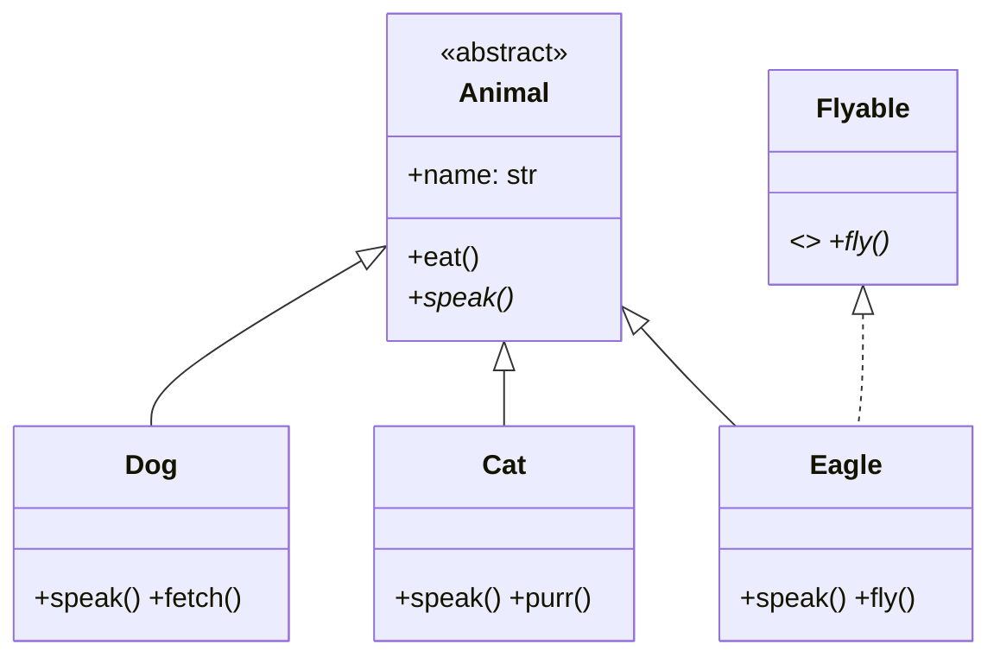

# One-Page OOP Revision

> Everything OOP in one page — definitions, code, diagrams.

---

## The 4 Pillars

### Encapsulation — Hide data, expose behavior
```python
class Account:
    def __init__(self):     self.__balance = 0    # Private
    def deposit(self, amt): self.__balance += amt  # Controlled
    def balance(self):      return self.__balance   # Read-only
```

### Abstraction — Show what, hide how
```python
class Payment(ABC):
    @abstractmethod
    def pay(self, amount): ...  # Contract only

class Stripe(Payment):
    def pay(self, amount):      # Implementation hidden
        self._api_call(amount)
```

### Inheritance — Reuse by extending
```python
class Animal:
    def eat(self): print("Eating")

class Dog(Animal):           # Dog IS-A Animal
    def bark(self): print("Woof")
```

### Polymorphism — One interface, many forms
```python
def process(p: Payment):   # Same interface
    p.pay(100)             # Different behavior

process(Stripe())          # Stripe payment
process(PayPal())          # PayPal payment
```

---

## Key Comparisons

| Encapsulation vs Abstraction | Inheritance vs Composition  |
|-----------------------------|-----------------------------|
| Encap = how to hide         | Inheritance = IS-A, tight   |
| Abstract = what to show     | Composition = HAS-A, loose  |
| Encap = private + getters   | Prefer composition          |
| Abstract = ABC + interfaces | Use inheritance when IS-A is permanent |

---

## Relationships

```
IS-A       → Inheritance    (Dog IS-A Animal)
HAS-A      → Composition    (Car HAS-A Engine)
USES-A     → Dependency     (Service USES-A Logger)
IMPLEMENTS → Realization    (ArrayList IMPLEMENTS List)
```

---

## Abstract Class vs Interface

| Feature         | Abstract Class        | Interface              |
|-----------------|-----------------------|------------------------|
| State           | Can have fields       | No state (Java)        |
| Constructor     | Yes                   | No                     |
| Multiple        | No (Java)             | Yes (many interfaces)  |
| Methods         | Abstract + concrete   | Abstract only (mostly) |
| Use when        | Shared behavior       | Pure contract          |

---

## Polymorphism Types

| Type        | Mechanism       | Binding     | Example                    |
|-------------|-----------------|-------------|----------------------------|
| Compile-time| Overloading     | Static      | `add(int)` vs `add(float)` |
| Runtime     | Overriding      | Dynamic     | `dog.speak()` at runtime   |
| Parametric  | Generics        | Compile     | `List<T>`                  |
| Duck typing | No type check   | Runtime     | Python: if it quacks...    |

---

## Access Modifiers

```
Python:  name (public) | _name (protected) | __name (private)
Java:    public > protected > default > private
```

---

## SOLID in 5 Lines

- **S**RP: One class = one reason to change
- **O**CP: Open for extension, closed for modification
- **L**SP: Subtypes must substitute base types
- **I**SP: Don't force unused methods on implementors
- **D**IP: Depend on abstractions, not concretions

---

## Quick Diagram



---

## Interview One-Liners

- **Encapsulation:** "Data hiding through access modifiers and methods"
- **Abstraction:** "Exposing only relevant details, hiding complexity"
- **Inheritance:** "Acquiring properties of parent class — IS-A relationship"
- **Polymorphism:** "Same method behaves differently based on object type"
- **Composition > Inheritance:** "Flexible, loosely coupled, changeable at runtime"
- **Diamond Problem:** "Ambiguity when inheriting same method from two parents; Python uses MRO (C3 linearization)"

---

*One-page revision | 2026-02-06*
