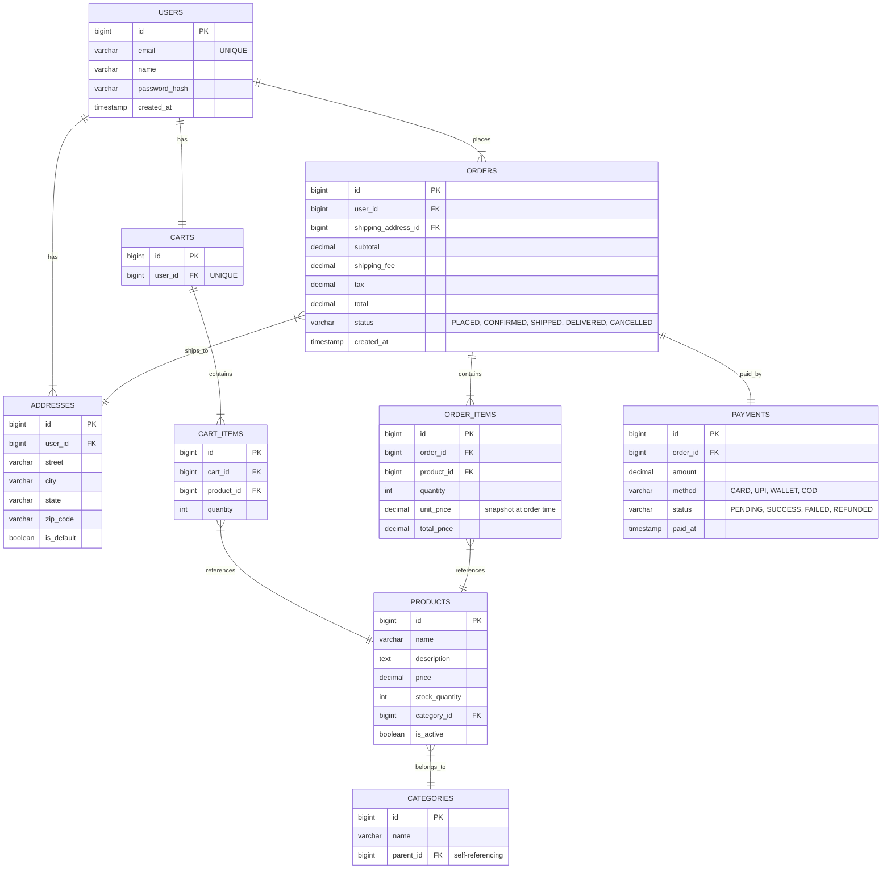

# Database Schema Design for LLD

> How to translate class diagrams into database schemas, with practical examples from common LLD problems.

---

## 1. Schema Design Fundamentals

### Tables, Primary Keys, Foreign Keys

```sql
-- Every table needs a primary key (PK)
CREATE TABLE users (
    id          BIGINT PRIMARY KEY AUTO_INCREMENT,
    email       VARCHAR(255) UNIQUE NOT NULL,
    name        VARCHAR(100) NOT NULL,
    created_at  TIMESTAMP DEFAULT CURRENT_TIMESTAMP
);

-- Foreign key (FK) establishes relationships
CREATE TABLE orders (
    id          BIGINT PRIMARY KEY AUTO_INCREMENT,
    user_id     BIGINT NOT NULL,
    status      VARCHAR(20) NOT NULL DEFAULT 'CREATED',
    total       DECIMAL(10, 2) NOT NULL,
    created_at  TIMESTAMP DEFAULT CURRENT_TIMESTAMP,
    FOREIGN KEY (user_id) REFERENCES users(id)
);
```

### Relationship Types

#### One-to-One

```
User 1---1 UserProfile
FK goes on either side (usually the dependent side)
```

```sql
CREATE TABLE user_profiles (
    id          BIGINT PRIMARY KEY,
    user_id     BIGINT UNIQUE NOT NULL,  -- UNIQUE makes it 1-to-1
    bio         TEXT,
    avatar_url  VARCHAR(500),
    FOREIGN KEY (user_id) REFERENCES users(id)
);
```

#### One-to-Many

```
User 1---* Order
FK goes on the "many" side
```

```sql
CREATE TABLE orders (
    id          BIGINT PRIMARY KEY AUTO_INCREMENT,
    user_id     BIGINT NOT NULL,          -- FK on the many side
    total       DECIMAL(10, 2),
    FOREIGN KEY (user_id) REFERENCES users(id)
);
```

#### Many-to-Many

```
Student *---* Course
Requires a junction/bridge table
```

```sql
CREATE TABLE student_courses (
    student_id  BIGINT NOT NULL,
    course_id   BIGINT NOT NULL,
    enrolled_at TIMESTAMP DEFAULT CURRENT_TIMESTAMP,
    PRIMARY KEY (student_id, course_id),   -- Composite PK
    FOREIGN KEY (student_id) REFERENCES students(id),
    FOREIGN KEY (course_id) REFERENCES courses(id)
);
```

### Normalization

#### 1NF: Atomic Values (No Lists in Columns)

```
BAD:  | id | name  | phone_numbers       |
      | 1  | Alice | 111-1111, 222-2222  |   <-- NOT atomic

GOOD: | id | name  |      phone_numbers table:
      | 1  | Alice |      | user_id | phone    |
                           | 1       | 111-1111 |
                           | 1       | 222-2222 |
```

#### 2NF: No Partial Dependencies (All Non-Key Columns Depend on Full PK)

```
BAD (composite PK, partial dependency):
| student_id | course_id | student_name | grade |
  student_name depends only on student_id, not full PK

GOOD: Split into students table and enrollment table
```

#### 3NF: No Transitive Dependencies

```
BAD:
| employee_id | dept_id | dept_name |
  dept_name depends on dept_id, not on employee_id

GOOD: Move dept_name to departments table
```

**Interview Rule of Thumb:** Normalize to 3NF, then selectively denormalize for performance.

---

## 2. Mapping Classes to Tables

### Class --> Table

```java
public class User {                    // --> users table
    private Long id;                   // --> id BIGINT PK
    private String name;               // --> name VARCHAR
    private String email;              // --> email VARCHAR UNIQUE
    private LocalDateTime createdAt;   // --> created_at TIMESTAMP
}
```

### Attribute --> Column

| Java Type | SQL Type |
|-----------|----------|
| `String` | `VARCHAR(n)` or `TEXT` |
| `int` / `Integer` | `INT` |
| `long` / `Long` | `BIGINT` |
| `double` / `Double` | `DECIMAL(p, s)` or `DOUBLE` |
| `boolean` / `Boolean` | `BOOLEAN` or `TINYINT(1)` |
| `LocalDateTime` | `TIMESTAMP` or `DATETIME` |
| `LocalDate` | `DATE` |
| `Enum` | `VARCHAR(20)` or `ENUM(...)` |
| `List<X>` | Separate table with FK |

### Association --> Foreign Key

```java
public class Order {
    private User user;              // --> user_id BIGINT FK
    private List<OrderItem> items;  // --> order_items table with order_id FK
}
```

### Inheritance Mapping Strategies

#### Strategy 1: Single Table Inheritance

All subclasses in ONE table with a discriminator column.


```sql
CREATE TABLE vehicles (
    id                 BIGINT PRIMARY KEY AUTO_INCREMENT,
    type               VARCHAR(20) NOT NULL,  -- discriminator
    license_plate      VARCHAR(20) NOT NULL,
    -- CAR fields
    num_doors          INT,
    -- TRUCK fields
    payload_capacity   DOUBLE,
    -- MOTORCYCLE fields
    has_sidecar        BOOLEAN
);
```

**Pros:** Simple, fast queries (no joins). **Cons:** Nullable columns, wasted space.

#### Strategy 2: Table Per Class

Each concrete class gets its own table.


**Pros:** No nulls, clean tables. **Cons:** Cannot query all vehicles easily, duplicate columns.

#### Strategy 3: Joined Table (Class Table Inheritance)

Base table + separate table per subclass, joined by PK.


```sql
CREATE TABLE vehicles (
    id             BIGINT PRIMARY KEY AUTO_INCREMENT,
    type           VARCHAR(20) NOT NULL,
    license_plate  VARCHAR(20) NOT NULL
);

CREATE TABLE cars (
    id         BIGINT PRIMARY KEY,
    num_doors  INT NOT NULL,
    FOREIGN KEY (id) REFERENCES vehicles(id)
);
```

**Pros:** Normalized, no nulls. **Cons:** Requires JOIN for full object.

#### When to Use Which

| Strategy | Best When |
|----------|-----------|
| Single Table | Few subclasses, few extra fields, read-heavy |
| Table Per Class | Subclasses are very different, rarely queried together |
| Joined Table | Many subclasses, need to query base type, write-heavy |

---

## 3. Schema Design for Common LLD Problems

### Parking Lot


```sql
CREATE TABLE parking_lots (
    id          BIGINT PRIMARY KEY AUTO_INCREMENT,
    name        VARCHAR(100) NOT NULL,
    address     VARCHAR(255) NOT NULL,
    total_floors INT NOT NULL
);

CREATE TABLE parking_floors (
    id            BIGINT PRIMARY KEY AUTO_INCREMENT,
    lot_id        BIGINT NOT NULL,
    floor_number  INT NOT NULL,
    total_spots   INT NOT NULL,
    FOREIGN KEY (lot_id) REFERENCES parking_lots(id),
    UNIQUE (lot_id, floor_number)
);

CREATE TABLE parking_spots (
    id            BIGINT PRIMARY KEY AUTO_INCREMENT,
    floor_id      BIGINT NOT NULL,
    spot_number   VARCHAR(10) NOT NULL,
    spot_type     ENUM('COMPACT', 'REGULAR', 'LARGE', 'HANDICAPPED') NOT NULL,
    is_available  BOOLEAN DEFAULT TRUE,
    FOREIGN KEY (floor_id) REFERENCES parking_floors(id),
    UNIQUE (floor_id, spot_number)
);

CREATE TABLE vehicles (
    id             BIGINT PRIMARY KEY AUTO_INCREMENT,
    license_plate  VARCHAR(20) UNIQUE NOT NULL,
    vehicle_type   ENUM('CAR', 'MOTORCYCLE', 'TRUCK', 'BUS') NOT NULL
);

CREATE TABLE tickets (
    id              BIGINT PRIMARY KEY AUTO_INCREMENT,
    vehicle_id      BIGINT NOT NULL,
    spot_id         BIGINT NOT NULL,
    entry_time      TIMESTAMP NOT NULL DEFAULT CURRENT_TIMESTAMP,
    exit_time       TIMESTAMP,
    amount_charged  DECIMAL(10, 2),
    status          ENUM('ACTIVE', 'PAID', 'LOST') DEFAULT 'ACTIVE',
    FOREIGN KEY (vehicle_id) REFERENCES vehicles(id),
    FOREIGN KEY (spot_id) REFERENCES parking_spots(id)
);

-- Key indexes
CREATE INDEX idx_spots_available ON parking_spots(floor_id, is_available, spot_type);
CREATE INDEX idx_tickets_active ON tickets(status) WHERE status = 'ACTIVE';
CREATE INDEX idx_vehicles_plate ON vehicles(license_plate);
```

---

### BookMyShow


```sql
CREATE TABLE shows (
    id          BIGINT PRIMARY KEY AUTO_INCREMENT,
    movie_id    BIGINT NOT NULL,
    screen_id   BIGINT NOT NULL,
    start_time  TIMESTAMP NOT NULL,
    end_time    TIMESTAMP NOT NULL,
    FOREIGN KEY (movie_id) REFERENCES movies(id),
    FOREIGN KEY (screen_id) REFERENCES screens(id)
);

CREATE TABLE show_seats (
    id          BIGINT PRIMARY KEY AUTO_INCREMENT,
    show_id     BIGINT NOT NULL,
    seat_id     BIGINT NOT NULL,
    price       DECIMAL(10, 2) NOT NULL,
    status      ENUM('AVAILABLE', 'BLOCKED', 'BOOKED') DEFAULT 'AVAILABLE',
    booking_id  BIGINT,
    FOREIGN KEY (show_id) REFERENCES shows(id),
    FOREIGN KEY (seat_id) REFERENCES seats(id),
    FOREIGN KEY (booking_id) REFERENCES bookings(id),
    UNIQUE (show_id, seat_id)
);

-- Key indexes
CREATE INDEX idx_shows_movie ON shows(movie_id, start_time);
CREATE INDEX idx_shows_screen ON shows(screen_id, start_time);
CREATE INDEX idx_show_seats_available ON show_seats(show_id, status);
```

---

### Library Management


```sql
CREATE TABLE book_copies (
    id        BIGINT PRIMARY KEY AUTO_INCREMENT,
    book_id   BIGINT NOT NULL,
    barcode   VARCHAR(50) UNIQUE NOT NULL,
    status    ENUM('AVAILABLE', 'BORROWED', 'RESERVED', 'LOST') DEFAULT 'AVAILABLE',
    FOREIGN KEY (book_id) REFERENCES books(id)
);

CREATE TABLE loans (
    id             BIGINT PRIMARY KEY AUTO_INCREMENT,
    copy_id        BIGINT NOT NULL,
    member_id      BIGINT NOT NULL,
    borrowed_date  DATE NOT NULL,
    due_date       DATE NOT NULL,
    returned_date  DATE,
    fine_amount    DECIMAL(10, 2) DEFAULT 0,
    FOREIGN KEY (copy_id) REFERENCES book_copies(id),
    FOREIGN KEY (member_id) REFERENCES members(id)
);

-- Key indexes
CREATE INDEX idx_copies_status ON book_copies(book_id, status);
CREATE INDEX idx_loans_active ON loans(member_id, returned_date);
CREATE INDEX idx_loans_overdue ON loans(due_date) WHERE returned_date IS NULL;
```

---

### Online Shopping



```sql
CREATE TABLE orders (
    id                   BIGINT PRIMARY KEY AUTO_INCREMENT,
    user_id              BIGINT NOT NULL,
    shipping_address_id  BIGINT NOT NULL,
    subtotal             DECIMAL(12, 2) NOT NULL,
    shipping_fee         DECIMAL(10, 2) DEFAULT 0,
    tax                  DECIMAL(10, 2) DEFAULT 0,
    total                DECIMAL(12, 2) NOT NULL,
    status               ENUM('PLACED','CONFIRMED','SHIPPED','DELIVERED','CANCELLED')
                         DEFAULT 'PLACED',
    created_at           TIMESTAMP DEFAULT CURRENT_TIMESTAMP,
    FOREIGN KEY (user_id) REFERENCES users(id),
    FOREIGN KEY (shipping_address_id) REFERENCES addresses(id)
);

CREATE TABLE order_items (
    id          BIGINT PRIMARY KEY AUTO_INCREMENT,
    order_id    BIGINT NOT NULL,
    product_id  BIGINT NOT NULL,
    quantity    INT NOT NULL,
    unit_price  DECIMAL(10, 2) NOT NULL,   -- Price snapshot
    total_price DECIMAL(10, 2) NOT NULL,
    FOREIGN KEY (order_id) REFERENCES orders(id),
    FOREIGN KEY (product_id) REFERENCES products(id)
);

-- Key indexes
CREATE INDEX idx_orders_user ON orders(user_id, created_at DESC);
CREATE INDEX idx_orders_status ON orders(status);
CREATE INDEX idx_products_category ON products(category_id, is_active);
CREATE INDEX idx_products_search ON products(name, is_active);
```

---

## 4. Indexing Strategy

### When to Add Indexes

```
ADD INDEX when:
- Column used in WHERE clauses frequently
- Column used in JOIN conditions
- Column used in ORDER BY
- Column with high selectivity (many distinct values)
- Foreign key columns (usually auto-indexed)

DO NOT INDEX when:
- Table is very small (< 1000 rows)
- Column with low selectivity (e.g., boolean with 50/50 split)
- Table is write-heavy with rare reads
- Column is frequently updated
```

### Index Types

```sql
-- Single column index
CREATE INDEX idx_users_email ON users(email);

-- Composite index (order matters!)
CREATE INDEX idx_orders_user_status ON orders(user_id, status);
-- Supports: WHERE user_id = ? AND status = ?
-- Supports: WHERE user_id = ?
-- Does NOT efficiently support: WHERE status = ?  (not leftmost prefix)

-- Partial index (PostgreSQL)
CREATE INDEX idx_active_tickets ON tickets(spot_id)
    WHERE status = 'ACTIVE';

-- Unique index (also enforces constraint)
CREATE UNIQUE INDEX idx_unique_email ON users(email);
```

### Composite Index Ordering Rules

```
Rule: Put columns in this order:
1. Equality conditions first (WHERE col = value)
2. Range conditions next (WHERE col > value)
3. ORDER BY columns last

Example query: WHERE user_id = ? AND status = ? ORDER BY created_at DESC
Best index:   (user_id, status, created_at)
```

### Trade-offs

| Aspect | More Indexes | Fewer Indexes |
|--------|-------------|---------------|
| Read speed | Faster | Slower |
| Write speed | Slower (index update) | Faster |
| Storage | More disk space | Less disk space |
| Maintenance | Higher | Lower |

**Rule of thumb:** Index columns that appear in WHERE, JOIN, and ORDER BY clauses of your most critical queries. Do not over-index.

---

## 5. Schema Design Interview Tips

### How to Discuss Schema in an LLD Interview

```
Step 1: Identify entities from requirements
        "The main entities are User, Order, Product, and Payment"

Step 2: Define relationships
        "A User places many Orders (1-to-Many)"
        "An Order contains many Products (Many-to-Many via OrderItems)"

Step 3: Draw ER diagram (simplified)
        Boxes with key attributes, lines showing relationships

Step 4: Write key CREATE TABLE statements
        Focus on the 2-3 most important tables

Step 5: Discuss indexing for key queries
        "For the 'get orders by user' query, I'd index (user_id, created_at)"

Step 6: Mention trade-offs
        "I've denormalized X for read performance at the cost of..."
```

### Common Follow-Up Questions

**Q: "How would you handle soft deletes?"**
```sql
-- Add is_deleted flag + filter in queries
ALTER TABLE users ADD COLUMN is_deleted BOOLEAN DEFAULT FALSE;
ALTER TABLE users ADD COLUMN deleted_at TIMESTAMP;
CREATE INDEX idx_active_users ON users(is_deleted) WHERE is_deleted = FALSE;
```

**Q: "How do you handle audit trails?"**
```sql
CREATE TABLE audit_log (
    id          BIGINT PRIMARY KEY AUTO_INCREMENT,
    table_name  VARCHAR(50) NOT NULL,
    record_id   BIGINT NOT NULL,
    action      ENUM('INSERT', 'UPDATE', 'DELETE') NOT NULL,
    old_value   JSON,
    new_value   JSON,
    changed_by  BIGINT,
    changed_at  TIMESTAMP DEFAULT CURRENT_TIMESTAMP
);
```

**Q: "How do you handle concurrent booking (race condition)?"**
```sql
-- Option 1: SELECT FOR UPDATE (pessimistic locking)
BEGIN;
SELECT * FROM show_seats WHERE show_id = ? AND seat_id = ? FOR UPDATE;
UPDATE show_seats SET status = 'BOOKED', booking_id = ? WHERE id = ?;
COMMIT;

-- Option 2: Optimistic locking with version column
UPDATE show_seats
SET status = 'BOOKED', booking_id = ?, version = version + 1
WHERE id = ? AND version = ? AND status = 'AVAILABLE';
-- If 0 rows affected, someone else booked it
```

**Q: "How do you store price in orders?"**
```
Always snapshot the price at order time in order_items.unit_price.
Never reference the current product price for historical orders.
Use DECIMAL, never FLOAT/DOUBLE for money.
```

**Q: "Normalize or denormalize?"**
```
Start normalized (3NF), denormalize selectively:
- Denormalize for read-heavy queries (e.g., store user_name in orders)
- Keep normalized for write-heavy data
- Use materialized views for complex aggregations
- Cache computed values (e.g., order total) rather than computing on read
```

---

## 6. Quick Reference: Class to Schema Mapping

| Class Concept | Schema Equivalent |
|--------------|-------------------|
| Class | Table |
| Attribute | Column |
| Private field | Column (no direct access) |
| Enum field | ENUM type or VARCHAR |
| List/Collection | Separate table with FK |
| Composition (has-a, strong) | FK with ON DELETE CASCADE |
| Aggregation (has-a, weak) | FK with ON DELETE SET NULL |
| Inheritance | Single table / Joined table / Table per class |
| Interface | No direct mapping (behavior, not data) |
| Many-to-Many | Junction table with composite PK |
| Computed property | Derived column or application logic |

---

*Next: See [hld-to-lld-bridge.md](./hld-to-lld-bridge.md) for how HLD decisions influence schema choices.*
