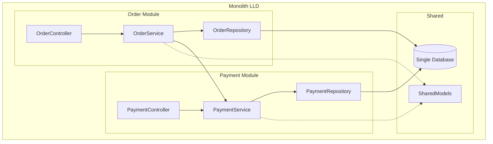
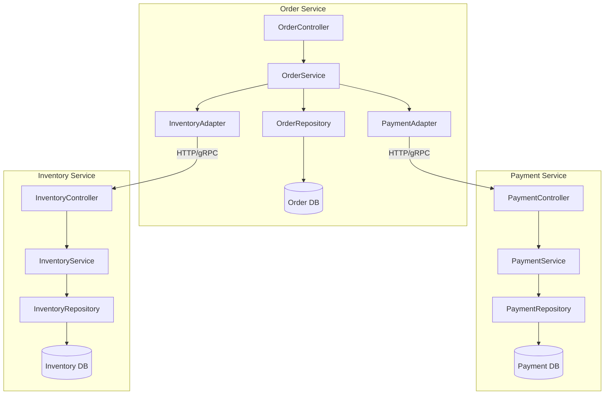
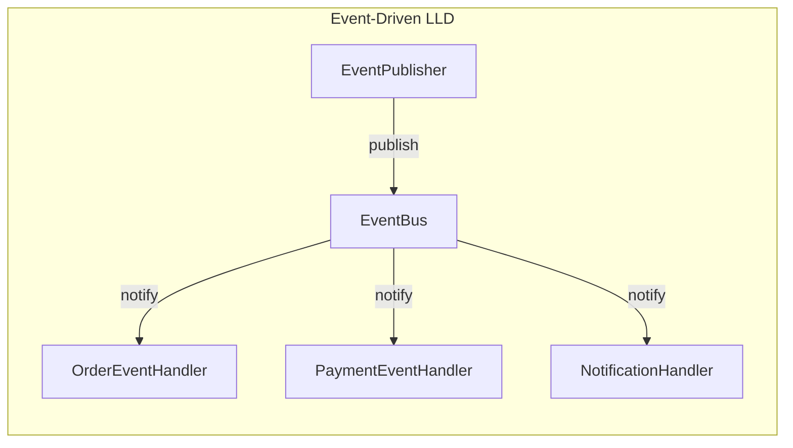
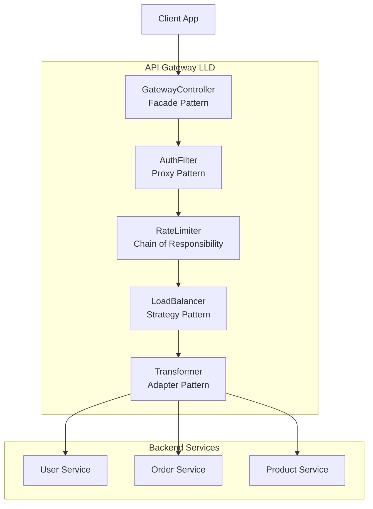
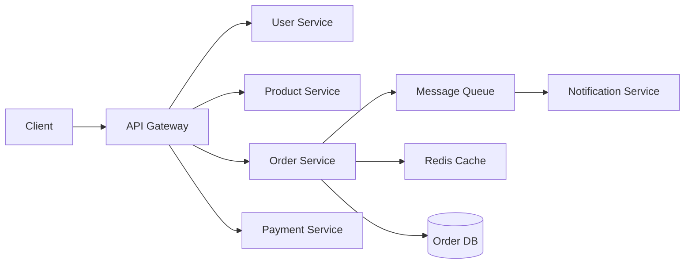
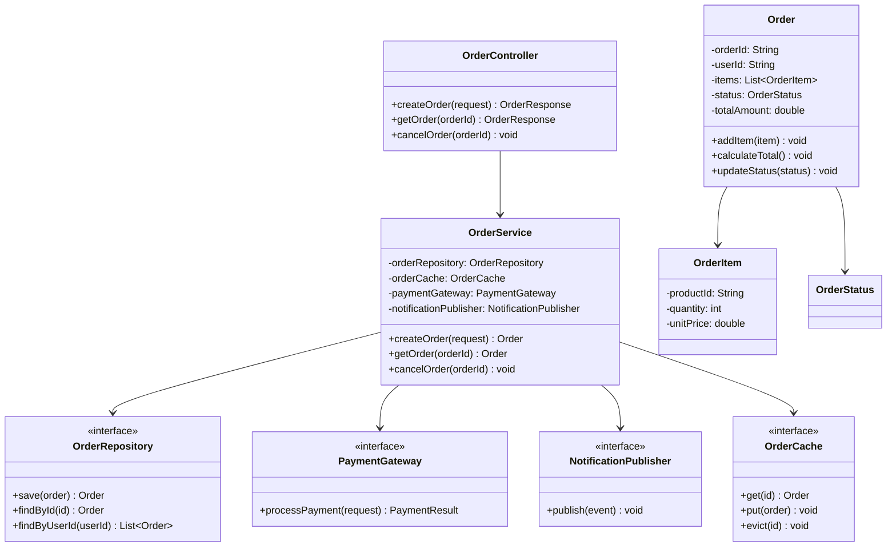
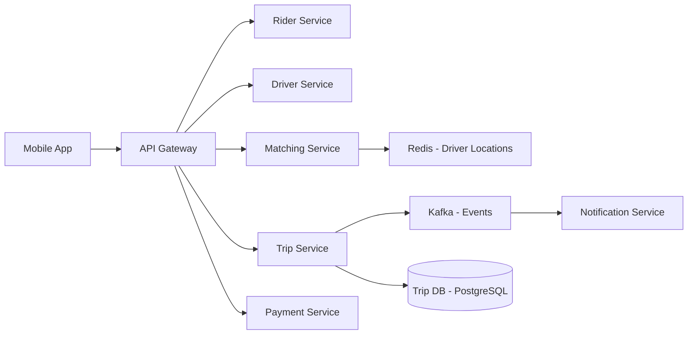

# System Design to LLD Bridge

## How High-Level Design Decisions Directly Impact Low-Level Design

> **Why this matters:** In interviews, you may be asked to design a system end-to-end. Understanding how HLD choices constrain and shape your class design is the mark of a senior engineer.

---

## 1. Monolith vs Microservices --> LLD Impact

### Monolith Architecture

```
Monolith Characteristics:
- Single deployable unit
- Shared database across all modules
- Internal method calls between components
- Shared memory space

LLD Implications:
- Classes communicate via direct method calls
- Shared models across modules (risk of God Objects)
- Repository pattern for shared database access
- Need STRICT SRP at class level to avoid coupling
- Package-level boundaries replace service boundaries
```



**Monolith LLD Example:**
```java
// Direct method call -- tight coupling but simple
public class OrderService {
    private final PaymentService paymentService; // Direct reference
    private final InventoryService inventoryService;

    public Order placeOrder(OrderRequest request) {
        inventoryService.reserve(request.getItems()); // Internal call
        paymentService.charge(request.getPayment());  // Internal call
        return orderRepository.save(new Order(request));
    }
}
```

### Microservices Architecture

```
Microservices Characteristics:
- Independent deployable services
- Each service owns its database
- Network calls between services
- Independent scaling

LLD Implications:
- Adapter pattern for inter-service communication
- DTOs for API contracts (separate from domain models)
- Circuit Breaker pattern for resilience
- Eventually consistent models
- Anti-corruption layer between services
```



**Microservices LLD Example:**
```java
// Adapter pattern -- decouples from remote service
public interface PaymentGateway {
    PaymentResult charge(PaymentRequest request);
}

public class PaymentServiceAdapter implements PaymentGateway {
    private final RestTemplate restTemplate;
    private final CircuitBreaker circuitBreaker;

    @Override
    public PaymentResult charge(PaymentRequest request) {
        return circuitBreaker.execute(() ->
            restTemplate.postForObject("/api/payments", request, PaymentResult.class)
        );
    }
}

public class OrderService {
    private final PaymentGateway paymentGateway; // Interface, not concrete service
    // Can swap between local (monolith) and remote (microservice) implementations
}
```

### Key Comparison

| Aspect | Monolith LLD | Microservices LLD |
|--------|-------------|-------------------|
| Communication | Direct method calls | HTTP/gRPC/Message Queue |
| Data Access | Shared Repository | Separate DB per service |
| Models | Shared domain models | DTOs + domain models per service |
| Error Handling | Try-catch | Circuit Breaker, Retry, Fallback |
| Transactions | ACID (single DB) | Saga pattern (distributed) |
| Testing | Integration tests | Contract tests + mocks |

---

## 2. Synchronous vs Asynchronous --> LLD Impact

### Synchronous Design

```
Characteristics:
- Caller waits for response
- Direct request-response
- Simpler mental model
- Thread blocked during call

LLD Implications:
- Simple class method calls
- Thread pool management needed
- Blocking I/O patterns
- Straightforward error handling
```

```java
// Synchronous -- caller blocks until result is available
public class OrderService {
    public OrderResult placeOrder(OrderRequest req) {
        InventoryResult inv = inventoryService.reserve(req.getItems()); // blocks
        PaymentResult pay = paymentService.charge(req.getPayment());   // blocks
        return new OrderResult(inv, pay);
    }
}
```

### Asynchronous Design

```
Characteristics:
- Caller does not wait
- Event-driven / message-based
- Higher throughput
- Complex error handling

LLD Implications:
- Command pattern for encapsulating requests
- Observer pattern for event notifications
- Event-driven architecture classes
- Callback / CompletableFuture patterns
- State machines for tracking async workflows
```

```java
// Asynchronous -- event-driven approach
public class OrderService {
    private final EventBus eventBus;

    public void placeOrder(OrderRequest req) {
        Order order = Order.create(req);
        order.setStatus(OrderStatus.PENDING);
        orderRepository.save(order);
        eventBus.publish(new OrderCreatedEvent(order)); // Fire and forget
    }

    @EventHandler
    public void onPaymentCompleted(PaymentCompletedEvent event) {
        Order order = orderRepository.findById(event.getOrderId());
        order.setStatus(OrderStatus.PAID);
        eventBus.publish(new OrderPaidEvent(order));
    }
}

// Command pattern for async operations
public interface Command {
    void execute();
    void undo();
}

public class ReserveInventoryCommand implements Command {
    private final String orderId;
    private final List<Item> items;

    public void execute() {
        inventoryService.reserve(items);
        eventBus.publish(new InventoryReservedEvent(orderId));
    }

    public void undo() {
        inventoryService.release(items);
    }
}
```

### Async Patterns and Their LLD Classes



| Async Pattern | LLD Design Pattern | When to Use |
|--------------|-------------------|-------------|
| Message Queue | Command + Observer | Decoupled event processing |
| Callback | Observer / Listener | Notification on completion |
| Promise/Future | Proxy | Deferred result |
| Event Sourcing | State + Event Store | Audit trail, replay |
| CQRS | Separate Read/Write models | Read-heavy systems |
| Saga | State Machine + Command | Distributed transactions |

---

## 3. Database Choice --> LLD Impact

### SQL (Relational) --> LLD

```
Characteristics:
- Structured schema, ACID transactions
- Joins, foreign keys, normalization

LLD Implications:
- ORM / Active Record pattern
- Repository with SQL/HQL queries
- Entity classes map to tables 1:1
- Transaction management in service layer
- DAO/Repository per aggregate root
```

```java
// Repository pattern for SQL
public interface OrderRepository {
    Order findById(String id);
    List<Order> findByUserId(String userId);
    Order save(Order order);
    void delete(String id);
}

// JPA Entity -- maps to SQL table
@Entity
@Table(name = "orders")
public class Order {
    @Id @GeneratedValue
    private Long id;

    @ManyToOne
    @JoinColumn(name = "user_id")
    private User user;

    @OneToMany(mappedBy = "order", cascade = CascadeType.ALL)
    private List<OrderItem> items;
}
```

### NoSQL (Document) --> LLD

```
Characteristics:
- Flexible schema, eventual consistency
- Denormalized, nested documents

LLD Implications:
- Document-oriented domain models
- Embedded objects instead of references
- No joins -- denormalized data access
- Different repository interface
```

```java
// Document-oriented model (MongoDB-style)
public class OrderDocument {
    private String id;
    private UserInfo user;          // Embedded, not referenced
    private List<OrderItem> items;  // Embedded
    private PaymentInfo payment;    // Embedded
    // Denormalized: everything needed in one document
}

// NoSQL Repository -- different query patterns
public interface OrderDocumentRepository {
    OrderDocument findById(String id);
    List<OrderDocument> findByUserEmail(String email);
    void upsert(OrderDocument doc);
}
```

### Cache (Redis) --> LLD

```java
// Proxy/Decorator pattern for caching
public class CachedOrderRepository implements OrderRepository {
    private final OrderRepository delegate;  // Actual DB repo
    private final Cache cache;

    public Order findById(String id) {
        Order cached = cache.get("order:" + id, Order.class);
        if (cached != null) return cached;
        Order order = delegate.findById(id);
        cache.put("order:" + id, order, Duration.ofMinutes(30));
        return order;
    }
}
```

### Database Choice Comparison

| Database | Domain Model | Repository Style | Transaction |
|----------|-------------|-----------------|-------------|
| SQL | Normalized entities | JPA/Hibernate | ACID |
| MongoDB | Denormalized documents | Document queries | Single-doc atomic |
| Redis | Key-value / Hash | Get/Set operations | Lua scripts |
| Cassandra | Wide-column | Partition key queries | Lightweight |
| Neo4j | Graph nodes/edges | Cypher queries | Graph transactions |

---

## 4. API Gateway --> LLD Impact

### Gateway as Facade



```java
// Facade: Gateway simplifies complex backend
public class ApiGateway {
    public OrderSummary getOrderSummary(String orderId) {
        // Aggregates from multiple services -- client sees one call
        Order order = orderServiceClient.getOrder(orderId);
        User user = userServiceClient.getUser(order.getUserId());
        List<Product> products = productServiceClient.getProducts(order.getProductIds());
        return new OrderSummary(order, user, products);
    }
}

// Chain of Responsibility: Request pipeline
public abstract class Filter {
    private Filter next;
    public void setNext(Filter next) { this.next = next; }
    public void doFilter(Request req) {
        if (process(req)) {
            if (next != null) next.doFilter(req);
        }
    }
    protected abstract boolean process(Request req);
}

public class AuthFilter extends Filter {
    protected boolean process(Request req) {
        return tokenValidator.validate(req.getToken());
    }
}

public class RateLimitFilter extends Filter {
    protected boolean process(Request req) {
        return rateLimiter.tryAcquire(req.getClientId());
    }
}

// Usage: Build the chain
AuthFilter auth = new AuthFilter();
RateLimitFilter rateLimit = new RateLimitFilter();
LoggingFilter logging = new LoggingFilter();
auth.setNext(rateLimit);
rateLimit.setNext(logging);
auth.doFilter(request); // Executes pipeline
```

---

## 5. From HLD Diagram to LLD Classes (Step-by-Step)

### Given: E-Commerce HLD



### Step 1: Identify the Service to Design (Order Service)

Pick ONE service for LLD. In interviews, focus on the most complex service.

### Step 2: Identify Entities from HLD Context

```
From HLD, Order Service handles:
- Creating orders
- Managing order lifecycle
- Communicating with Payment Service
- Publishing events to Message Queue
- Caching frequent queries

Entities: Order, OrderItem, OrderStatus
External Dependencies: PaymentService, NotificationService, Cache
```

### Step 3: Define Interfaces for External Dependencies

```java
// Adapter interfaces for external services
public interface PaymentGateway {
    PaymentResult processPayment(PaymentRequest request);
}

public interface NotificationPublisher {
    void publish(OrderEvent event);
}

public interface OrderCache {
    Optional<Order> get(String orderId);
    void put(Order order);
    void evict(String orderId);
}
```

### Step 4: Design Core Domain Classes

```java
public enum OrderStatus {
    CREATED, CONFIRMED, PAID, SHIPPED, DELIVERED, CANCELLED
}

public class Order {
    private String orderId;
    private String userId;
    private List<OrderItem> items;
    private OrderStatus status;
    private double totalAmount;
    private LocalDateTime createdAt;

    public void addItem(OrderItem item) { ... }
    public void calculateTotal() { ... }
    public void updateStatus(OrderStatus newStatus) { ... }
}

public class OrderItem {
    private String productId;
    private String productName;
    private int quantity;
    private double unitPrice;
}
```

### Step 5: Design Service Layer

```java
public class OrderService {
    private final OrderRepository orderRepository;
    private final OrderCache orderCache;
    private final PaymentGateway paymentGateway;
    private final NotificationPublisher notificationPublisher;
    private final InventoryChecker inventoryChecker;

    public Order createOrder(CreateOrderRequest request) {
        // 1. Validate inventory
        inventoryChecker.checkAvailability(request.getItems());

        // 2. Create order
        Order order = new Order(request.getUserId(), request.getItems());
        order.calculateTotal();
        order.updateStatus(OrderStatus.CREATED);

        // 3. Persist
        orderRepository.save(order);

        // 4. Cache
        orderCache.put(order);

        // 5. Notify
        notificationPublisher.publish(new OrderCreatedEvent(order));

        return order;
    }
}
```

### Step 6: Draw the LLD Class Diagram



### The Bridge Summary

```
HLD Component          -->  LLD Element
----------------------------------------------
API Gateway            -->  Controller + Filters
Service Box            -->  Service Class + Dependencies
Database               -->  Repository + Entity Classes
Message Queue          -->  EventPublisher Interface
Cache                  -->  Cache Interface (Proxy Pattern)
Load Balancer          -->  Strategy Pattern
Service-to-Service     -->  Adapter Pattern + Interface
```

---

## 6. Scaling Decisions --> LLD Impact

### Horizontal Scaling --> Stateless Classes

```java
// BAD: Stateful service -- cannot scale horizontally
public class OrderService {
    private Map<String, Order> localCache = new HashMap<>(); // Instance state!

    public Order getOrder(String id) {
        return localCache.get(id); // Different per instance
    }
}

// GOOD: Stateless service -- scales horizontally
public class OrderService {
    private final OrderRepository repo;      // External state
    private final RedisCache cache;          // Shared cache

    public Order getOrder(String id) {
        return cache.getOrLoad(id, () -> repo.findById(id));
    }
}
```

### Read Replicas --> Read/Write Repository Split (CQRS)

```java
// CQRS: Separate read and write models
public interface OrderCommandRepository {
    Order save(Order order);
    void delete(String id);
}

public interface OrderQueryRepository {
    Order findById(String id);            // Reads from replica
    List<Order> findByUserId(String id);  // Reads from replica
    List<Order> search(OrderSearchCriteria criteria);
}

public class OrderWriteService {
    private final OrderCommandRepository commandRepo;
    // Handles all mutations
}

public class OrderReadService {
    private final OrderQueryRepository queryRepo;
    // Handles all queries -- can use read replicas
}
```

### Caching Layer --> Decorator / Proxy

```java
// Decorator: Adds caching to any repository
public class CachingOrderQueryRepository implements OrderQueryRepository {
    private final OrderQueryRepository delegate;
    private final Cache cache;

    @Override
    public Order findById(String id) {
        String key = "order:" + id;
        return cache.get(key, Order.class)
            .orElseGet(() -> {
                Order order = delegate.findById(id);
                cache.put(key, order);
                return order;
            });
    }
}
```

### Sharding --> Partition-Aware Repository

```java
// Sharding: Repository knows about partitioning
public class ShardedOrderRepository implements OrderRepository {
    private final Map<Integer, DataSource> shards;
    private final ShardingStrategy strategy;

    public Order findById(String orderId) {
        int shardId = strategy.getShard(orderId);
        DataSource ds = shards.get(shardId);
        return queryFromShard(ds, orderId);
    }
}

// Strategy pattern for sharding logic
public interface ShardingStrategy {
    int getShard(String key);
}

public class HashBasedSharding implements ShardingStrategy {
    private final int numShards;
    public int getShard(String key) {
        return Math.abs(key.hashCode() % numShards);
    }
}
```

---

## 7. Common HLD --> LLD Mapping Table

| HLD Component | LLD Pattern(s) | Classes/Interfaces | Example |
|---|---|---|---|
| **Load Balancer** | Strategy | `LoadBalancer`, `RoundRobinStrategy`, `LeastConnectionsStrategy` | Route requests across instances |
| **API Gateway** | Facade + Chain of Responsibility | `GatewayController`, `AuthFilter`, `RateLimitFilter` | Single entry point with filters |
| **Message Queue** | Observer + Command | `EventBus`, `EventHandler`, `Command` | Async event processing |
| **Cache Layer** | Proxy / Decorator | `CacheProxy`, `CachedRepository` | Redis caching on data access |
| **Rate Limiter** | Chain of Responsibility + Strategy | `RateLimiter`, `TokenBucket`, `SlidingWindow` | Request throttling |
| **Circuit Breaker** | State | `CircuitBreaker`, `OpenState`, `ClosedState`, `HalfOpenState` | Fault tolerance |
| **Service Registry** | Singleton + Registry | `ServiceRegistry`, `ServiceInstance` | Service discovery |
| **CDN** | Proxy | `CdnProxy`, `ContentServer` | Static content serving |
| **Database** | Repository + Factory | `Repository`, `EntityFactory`, `DataMapper` | Data access abstraction |
| **Auth Service** | Proxy + Strategy | `AuthProxy`, `JwtStrategy`, `OAuth2Strategy` | Authentication layer |
| **Notification** | Observer + Factory | `NotificationService`, `EmailNotifier`, `SmsNotifier` | Multi-channel notifications |
| **Search Engine** | Strategy + Adapter | `SearchAdapter`, `ElasticsearchClient` | Full-text search |
| **File Storage** | Strategy + Adapter | `StorageAdapter`, `S3Client`, `LocalStorage` | File upload/download |
| **Task Queue** | Command + Worker | `TaskQueue`, `Worker`, `Task` | Background job processing |

---

## 8. Interview Strategy: When They Ask Both HLD and LLD

### The Transition Framework

```
Interview Timeline (45 minutes):
----------------------------------------------------
[0-5 min]  Clarify requirements (both HLD and LLD scope)
[5-15 min] High-Level Design
           - System components
           - Data flow
           - Technology choices
[15-20 min] THE BRIDGE (this is where you shine)
           - "Let me zoom into the Order Service..."
           - Identify entities from HLD components
           - Define interfaces for external dependencies
[20-40 min] Low-Level Design
           - Class diagram
           - Key method signatures
           - Design patterns used
[40-45 min] Discuss trade-offs, scaling
----------------------------------------------------
```

### Transition Phrases (Use These!)

```
"Now let me zoom into the [Service Name] and design the classes..."

"From the HLD, we can see that [Service] needs to communicate with
[Other Service], so I'll create an adapter interface for that..."

"Since we chose [async messaging] in the HLD, the LLD will use the
Observer pattern for event handling..."

"The database choice of [SQL/NoSQL] means our entity classes will be
[normalized/denormalized]..."

"Because we need horizontal scaling, all service classes will be
stateless, with state externalized to [Redis/DB]..."
```

### What Interviewers Expect at Each Level

| Level | HLD Focus | LLD Focus |
|-------|-----------|-----------|
| **Junior** | List components | Basic classes and methods |
| **Mid** | Components + data flow | Classes + design patterns + relationships |
| **Senior** | Components + trade-offs + scaling | Patterns + SOLID + extensibility + thread safety |
| **Staff+** | All above + cost/complexity analysis | All above + performance + testing strategy |

### Common Follow-Up Questions After the Bridge

1. "How would your class design change if we switched from monolith to microservices?"
   - Replace direct references with adapter interfaces
   - Add DTOs for API boundaries
   - Add circuit breaker for resilience

2. "What if we need to add a new payment provider?"
   - Strategy pattern: new implementation of PaymentGateway
   - Factory pattern: PaymentGatewayFactory returns correct implementation
   - Open/Closed Principle: no changes to OrderService

3. "How do you handle failures between services?"
   - Circuit Breaker (State pattern): Open/Closed/HalfOpen
   - Retry with exponential backoff (Strategy pattern)
   - Saga pattern for distributed transactions (State machine)
   - Dead letter queue for failed events

4. "How would you make this system support 10x more traffic?"
   - Stateless services (horizontal scaling)
   - Read/Write split (CQRS)
   - Caching layer (Proxy/Decorator)
   - Async processing (Observer/Command)

---

## 9. Quick Reference: The Bridge Checklist

Use this checklist when transitioning from HLD to LLD in an interview:

```
[ ] Identify the service/component to design in detail
[ ] List all entities within that service
[ ] Identify external dependencies (other services, DBs, caches)
[ ] Create interfaces for each external dependency
[ ] Choose patterns based on HLD decisions:
    [ ] Sync/Async --> direct calls vs events
    [ ] DB type --> entity model style
    [ ] Scaling needs --> stateless design
    [ ] Communication --> adapters vs direct refs
[ ] Draw class diagram with relationships
[ ] Show key method signatures
[ ] Discuss extensibility and trade-offs
```

---

## 10. Practice Exercise: Apply the Bridge

**Exercise:** Given this HLD for a "Ride-Sharing App":



**Your Task:** Design the LLD for the **Matching Service**:

1. What entities do you need?
2. What interfaces for external dependencies?
3. What design patterns would you use?
4. How does the Redis cache choice affect your class design?
5. Draw the class diagram.

**Expected Answer Outline:**
- `MatchingService` with `MatchingStrategy` interface (Strategy pattern)
- `DriverLocationCache` interface (Proxy for Redis)
- `ProximityMatcher`, `RatingBasedMatcher` (Strategy implementations)
- `RideRequest` value object, `Match` result class
- `DriverService` adapter for getting driver details
- Stateless design (all state in Redis)

---

*Next: See [database-schema-design.md](./database-schema-design.md) for how to translate LLD classes to database schemas.*
