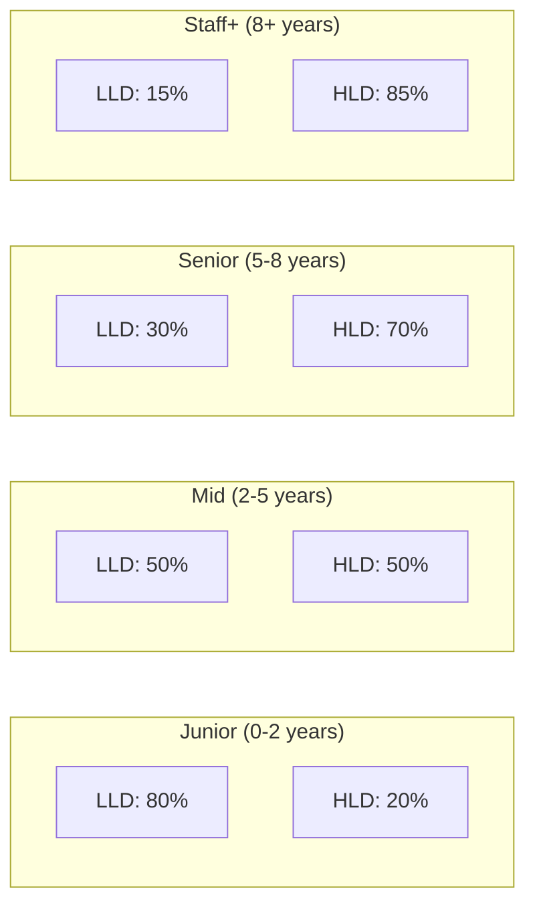

# Low Level Design vs High Level Design

> A comprehensive comparison to understand the differences, overlaps, and career progression between LLD and HLD interviews.

---

## 1. Core Comparison

| Aspect | LLD (Low Level Design) | HLD (High Level Design) |
|--------|------------------------|-------------------------|
| **Focus** | Classes, methods, object interactions | Services, databases, infrastructure |
| **Scope** | Single module or component | Entire system or distributed architecture |
| **Granularity** | Method signatures, class hierarchies | API contracts, service boundaries |
| **Primary Diagrams** | Class, Sequence, State | Architecture, Component, Deployment |
| **Output** | Code structure, interfaces, class hierarchy | System architecture, data flow, API design |
| **Key Skills** | OOP, Design Patterns, SOLID | Distributed systems, Scalability, CAP |
| **Time Horizon** | Immediate implementation | Long-term system evolution |
| **Tools** | IDE, UML tools, code | Whiteboards, draw.io, Excalidraw |
| **Testing** | Unit tests, integration tests | Load tests, chaos engineering |
| **Error Handling** | Try/catch, exceptions, null safety | Circuit breakers, retries, fallbacks |
| **Data** | Object models, collections, data structures | Databases, caches, message queues |
| **Communication** | Method calls, interfaces, events | REST APIs, gRPC, message brokers |

---

## 2. The Design Spectrum

LLD and HLD are not separate disciplines but points on a spectrum.

```mermaid
graph LR
    subgraph "Low Level Design"
        A["Data Structures"]
        B["Classes & Interfaces"]
        C["Design Patterns"]
        D["Module Design"]
    end

    subgraph "Overlap Zone"
        E["API Design"]
        F["Component Boundaries"]
        G["Domain Modeling"]
    end

    subgraph "High Level Design"
        H["Service Architecture"]
        I["Database Design"]
        J["Scalability"]
        K["Infrastructure"]
    end

    A --> B --> C --> D --> E --> F --> G --> H --> I --> J --> K

    style A fill:#ccffcc
    style B fill:#ccffcc
    style C fill:#ccffcc
    style D fill:#ccffcc
    style E fill:#ffffcc
    style F fill:#ffffcc
    style G fill:#ffffcc
    style H fill:#cce6ff
    style I fill:#cce6ff
    style J fill:#cce6ff
    style K fill:#cce6ff
```

### Where They Overlap

| Overlap Area | LLD Perspective | HLD Perspective |
|---|---|---|
| **API Design** | Method signatures, interface contracts | Endpoint design, request/response schemas |
| **Component Boundaries** | Package/module organization, access modifiers | Service boundaries, microservice decomposition |
| **Domain Modeling** | Entity classes, value objects, relationships | Database schema, bounded contexts |
| **Error Handling** | Exception hierarchy, error types | Error codes, retry policies, fallbacks |
| **Caching** | In-memory cache class design (LRU) | Redis, CDN, cache invalidation strategies |
| **Concurrency** | Thread-safe classes, locks, concurrent data structures | Distributed locks, eventual consistency |

---

## 3. Interview Differences

### LLD Interview Format

**Duration:** 45-60 minutes

**Typical Flow:**
1. **Requirements gathering** (5 min) -- Clarify scope, actors, key features
2. **Identify classes and relationships** (10 min) -- Nouns become classes, verbs become methods
3. **Class diagram** (10 min) -- Draw relationships, attributes, methods
4. **Design patterns** (5 min) -- Identify which patterns apply and why
5. **Write code** (15-20 min) -- Implement key classes, interfaces, enums
6. **Discussion** (5 min) -- Extensibility, trade-offs, edge cases

**What Interviewers Evaluate:**
- OOP principles (encapsulation, abstraction, polymorphism, inheritance)
- SOLID principle adherence
- Appropriate use of design patterns (not forced)
- Clean, readable, extensible code
- Handling edge cases and constraints
- Ability to discuss trade-offs

**Common LLD Problems:**
- Parking Lot System
- Elevator System
- LRU Cache
- Chess / Tic-Tac-Toe
- BookMyShow / Movie Ticket Booking
- Library Management
- Vending Machine
- Snake and Ladder
- Online Shopping Cart
- Cab Booking (Uber/Ola)

### HLD Interview Format

**Duration:** 45-60 minutes

**Typical Flow:**
1. **Requirements gathering** (5 min) -- Functional and non-functional requirements
2. **Capacity estimation** (5 min) -- QPS, storage, bandwidth calculations
3. **API design** (5 min) -- Key endpoints, request/response format
4. **High-level architecture** (10 min) -- Services, databases, load balancers
5. **Deep dive** (15-20 min) -- Database schema, caching, messaging
6. **Scalability and reliability** (10 min) -- Handling failures, scaling bottlenecks

**What Interviewers Evaluate:**
- Ability to estimate scale (back-of-envelope calculations)
- Knowledge of distributed system concepts (CAP, consistency, availability)
- Database selection and schema design
- Caching strategies
- Load balancing and horizontal scaling
- Handling failures and edge cases at scale
- Communication and structured thinking

**Common HLD Problems:**
- Design URL Shortener (TinyURL)
- Design Twitter / News Feed
- Design WhatsApp / Chat System
- Design YouTube / Video Streaming
- Design Uber / Ride Sharing
- Design Dropbox / Google Drive
- Design Instagram
- Design Rate Limiter
- Design Notification System
- Design Search Autocomplete

---

## 4. Skills Comparison

### LLD Skills

| Skill | Importance | Key Concepts |
|-------|-----------|--------------|
| OOP | Critical | 4 pillars, SOLID, composition vs inheritance |
| Design Patterns | Critical | GoF 23 patterns, when and why to apply |
| UML | Important | Class, sequence, state diagrams |
| Clean Code | Important | Naming, readability, single responsibility |
| Data Structures | Important | Choosing right DS for internal representation |
| Concurrency | Moderate | Thread safety, synchronization in class design |
| Testing | Moderate | Testable design, dependency injection |

### HLD Skills

| Skill | Importance | Key Concepts |
|-------|-----------|--------------|
| Distributed Systems | Critical | CAP theorem, consistency models, partitioning |
| Databases | Critical | SQL vs NoSQL, sharding, replication, indexing |
| Scalability | Critical | Horizontal vs vertical, load balancing |
| Caching | Important | Redis, CDN, cache invalidation, eviction |
| Messaging | Important | Kafka, RabbitMQ, pub/sub, event-driven |
| API Design | Important | REST, gRPC, GraphQL, rate limiting |
| Networking | Moderate | DNS, CDN, TCP/UDP, WebSockets |
| Security | Moderate | Authentication, authorization, encryption |

---

## 5. Which Companies Focus on Which?

### Companies with Strong LLD Focus

| Company | LLD Weight | Notes |
|---------|-----------|-------|
| **Amazon** | High | OOP round is common; expects clean, extensible code |
| **Google** | High | Expects strong OOD fundamentals in design rounds |
| **Microsoft** | High | Dedicated LLD/OOD round in many teams |
| **Goldman Sachs** | High | Heavy OOP and design pattern focus |
| **Flipkart** | High | Multiple LLD rounds, expects working code |
| **Uber** | High | LLD round with real-world modeling |
| **Adobe** | High | Design patterns and OOP-heavy interviews |

### Companies with Strong HLD Focus

| Company | HLD Weight | Notes |
|---------|-----------|-------|
| **Google** | High | System design at senior+ levels |
| **Meta** | High | Dedicated system design round |
| **Amazon** | High | System design especially for senior roles |
| **Netflix** | Very High | Distributed systems expertise expected |
| **Twitter/X** | Very High | Scale-focused design problems |
| **Stripe** | High | API design + system design |
| **Airbnb** | High | System design with product sense |

### The Typical Split by Level

| Experience Level | LLD Weight | HLD Weight | Notes |
|---|---|---|---|
| **Junior (0-2 years)** | 80% | 20% | Focus on OOP, patterns, clean code |
| **Mid-level (2-5 years)** | 50% | 50% | Both equally important |
| **Senior (5-8 years)** | 30% | 70% | HLD dominates, LLD still tested |
| **Staff+ (8+ years)** | 15% | 85% | Architecture and system-wide decisions |

---

## 6. Transition from LLD to HLD

As engineers grow in experience, their focus naturally shifts from LLD to HLD. Here is how the transition typically happens.

### Stage 1: Master LLD First (Years 0-2)
- Learn OOP principles deeply
- Study all 23 GoF design patterns
- Practice LLD problems (10-15 problems)
- Write clean, SOLID code
- Understand UML and class modeling

### Stage 2: Bridge the Gap (Years 2-4)
- Study API design principles
- Learn database fundamentals (SQL, NoSQL, indexing)
- Understand caching basics
- Study common architectural patterns (MVC, layered, microservices)
- Build projects that involve multiple components

### Stage 3: Build HLD Skills (Years 4-7)
- Study distributed system concepts (CAP, PACELC, consensus)
- Learn about message queues, event-driven architecture
- Practice back-of-envelope capacity estimation
- Study 15-20 HLD problems in depth
- Understand scalability patterns (sharding, replication, CDN)

### Stage 4: Architectural Thinking (Years 7+)
- Design end-to-end systems considering all trade-offs
- Evaluate build vs buy decisions
- Consider operational concerns (monitoring, alerting, deployment)
- Think about organizational impact of architecture
- Mentor others in both LLD and HLD

### How LLD Skills Help in HLD

| LLD Concept | HLD Application |
|---|---|
| **Interface Segregation** | API design, service contracts |
| **Dependency Inversion** | Service dependencies, loose coupling between microservices |
| **Strategy Pattern** | Pluggable components, feature toggles |
| **Observer Pattern** | Event-driven architecture, pub/sub systems |
| **Singleton** | Service instances, configuration management |
| **Facade** | API Gateway, BFF (Backend for Frontend) |
| **Command** | Task queues, CQRS (Command Query Responsibility Segregation) |
| **State** | Workflow engines, order state machines across services |

---

## 7. Same Problem, Different Lens

### Example: Design a Parking Lot

**LLD Approach:**
- Classes: `ParkingLot`, `Floor`, `Spot`, `Vehicle`, `Ticket`, `Payment`
- Patterns: Strategy (pricing), State (spot availability), Factory (vehicle types)
- Focus: Class relationships, method signatures, enums, thread safety
- Output: Class diagram + working code

**HLD Approach:**
- Services: Parking Service, Payment Service, Notification Service
- Database: Schema for lots, spots, bookings
- APIs: `POST /book`, `PUT /checkout`, `GET /availability`
- Focus: How to handle 10,000 concurrent users, database choice, caching
- Output: Architecture diagram, API design, database schema

### Example: Design an Online Bookstore

**LLD Approach:**
- Classes: `Book`, `User`, `Cart`, `Order`, `Payment`, `Review`
- Patterns: Observer (stock updates), Strategy (discount), Builder (order), State (order status)
- Focus: How `Cart` aggregates `CartItem` objects, how `Order` transitions through states
- Output: Class diagram, sequence diagram for checkout flow

**HLD Approach:**
- Services: Catalog Service, User Service, Cart Service, Order Service, Payment Gateway, Search Service
- Database: Product catalog (NoSQL for flexibility), Orders (SQL for ACID), User data (SQL)
- Infrastructure: CDN for images, Elasticsearch for search, Redis for cart, Kafka for events
- Focus: How to handle Black Friday scale, search performance, payment reliability
- Output: Architecture diagram showing all services, databases, and communication

---

## 8. Preparation Strategy

### If You Have 2 Weeks

| Week | LLD | HLD |
|------|-----|-----|
| **Week 1** | SOLID + 5 core patterns (Strategy, Observer, Factory, Singleton, Builder) + 3 LLD problems | Read about CAP theorem, databases, caching basics |
| **Week 2** | 3 more patterns (State, Command, Decorator) + 3 more LLD problems | 3 HLD problems (URL shortener, Twitter, Chat) |

### If You Have 1 Month

| Week | LLD | HLD |
|------|-----|-----|
| **Week 1** | OOP fundamentals + SOLID deep dive | - |
| **Week 2** | All 23 patterns overview + 5 LLD problems | Database fundamentals, SQL vs NoSQL |
| **Week 3** | 5 more LLD problems + concurrency patterns | Caching, Load Balancing, CDN |
| **Week 4** | Mock interviews, revision | 5 HLD problems + mock interviews |

### Key Differences in Preparation

| Aspect | LLD Preparation | HLD Preparation |
|--------|----------------|-----------------|
| **Reading** | GoF book, Head First Design Patterns | DDIA (Designing Data-Intensive Apps), System Design Interview by Alex Xu |
| **Practice** | Write actual code for each problem | Draw architecture diagrams, estimate capacity |
| **Mock** | Explain class design choices | Explain trade-offs and scaling decisions |
| **Revision** | Pattern cheat sheet, UML quick reference | Component checklist, estimation formulas |

---

## 9. Key Takeaways

1. **LLD and HLD are complementary.** Strong LLD skills make you better at HLD because you understand how components work internally.

2. **LLD is about "how to build a component well."** HLD is about "how to make components work together at scale."

3. **Start with LLD mastery.** It's the foundation. You cannot design a good distributed system without knowing how to design a good class.

4. **The interview round determines the focus.** Even at senior level, if the round is labeled "OOD/LLD," they expect class-level design, not system architecture.

5. **Both require structured thinking.** Start with requirements, draw before coding, and always discuss trade-offs.

6. **Practice is non-negotiable.** Reading about patterns is not enough; implement them. Reading about system design is not enough; draw the diagrams and do the math.

---

*For deep dives into LLD topics, see the dedicated study materials in this repository. For HLD preparation, consider "Designing Data-Intensive Applications" by Martin Kleppmann and "System Design Interview" by Alex Xu.*
