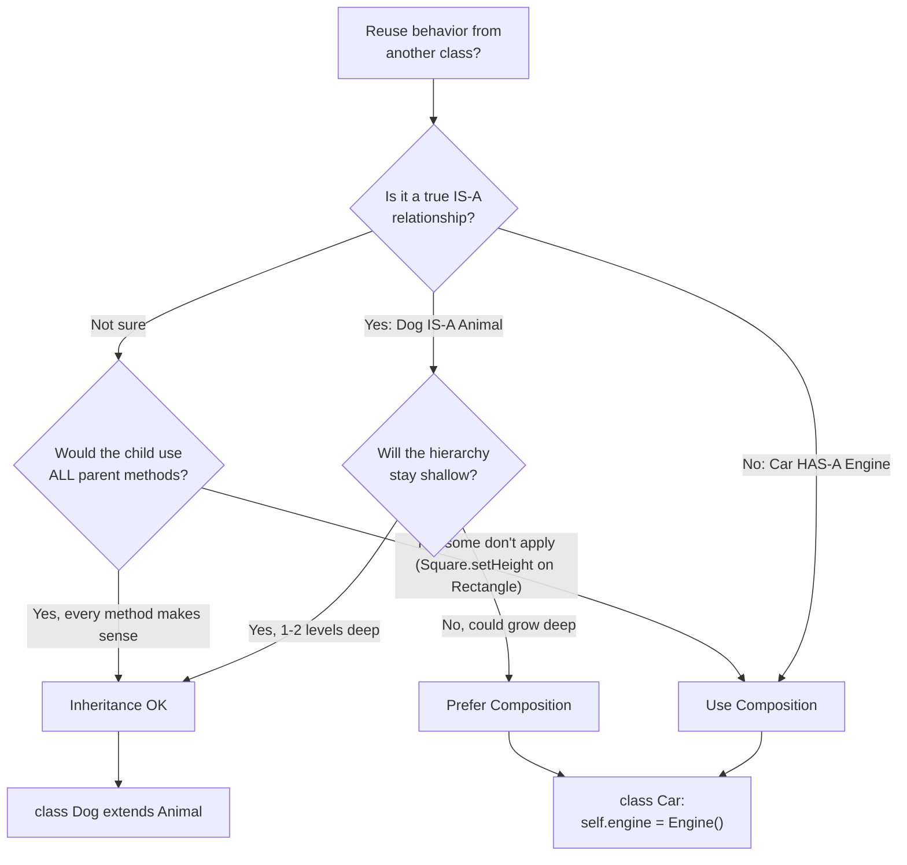
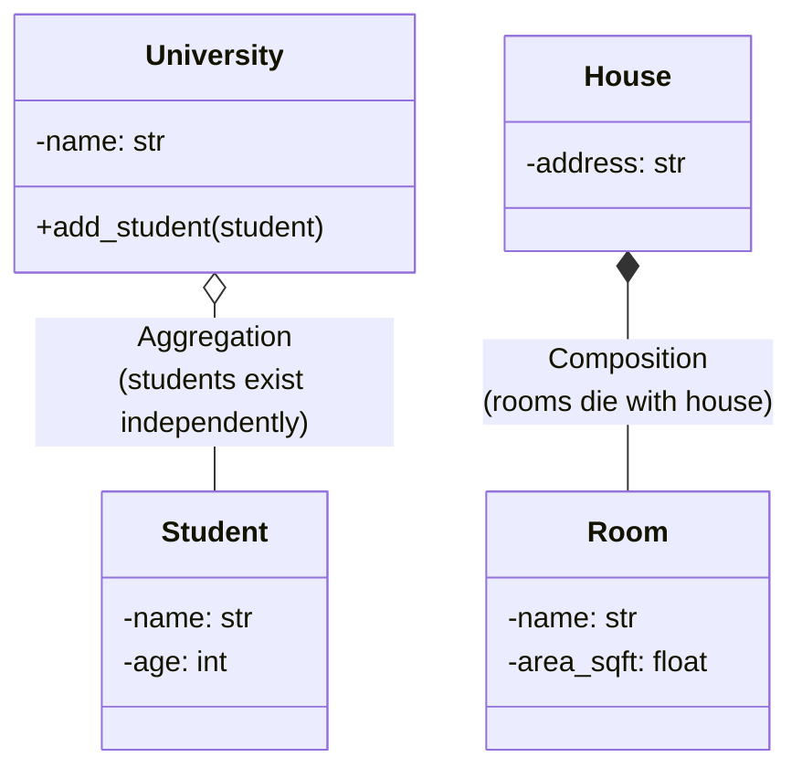

# OOP Concepts Compared

Side-by-side comparisons of commonly confused OOP concepts with code examples, diagrams, and decision criteria.

---

## 1. Abstract Class vs Interface

### Comparison Table

| Aspect | Abstract Class | Interface |
|--------|---------------|-----------|
| **Purpose** | Partial implementation + contract | Pure contract (what, not how) |
| **Methods** | Abstract + concrete methods | All abstract (traditionally) |
| **State** | Can have instance variables | No state (traditionally) |
| **Constructor** | Yes | No |
| **Inheritance** | Single inheritance only | Multiple interfaces |
| **Access modifiers** | Any (public, protected, private) | Public only |
| **When** | IS-A with shared behavior | CAN-DO capability |
| **Python** | `ABC` with `@abstractmethod` | `ABC` with all abstract methods (or Protocol) |
| **Java** | `abstract class` | `interface` (with `default` methods since Java 8) |

### Code

```python
from abc import ABC, abstractmethod

# === ABSTRACT CLASS: Shared behavior + enforced contract ===

class Animal(ABC):
    """Abstract class: provides shared behavior and enforces contract."""

    def __init__(self, name: str, weight_kg: float):
        self.name = name            # State: abstract classes can have fields
        self.weight_kg = weight_kg

    def breathe(self):
        """Concrete method: shared by all animals."""
        print(f"{self.name} is breathing")

    def sleep(self):
        """Concrete method: shared default behavior."""
        print(f"{self.name} sleeps for 8 hours")

    @abstractmethod
    def speak(self) -> str:
        """Abstract: each animal speaks differently."""
        pass

    @abstractmethod
    def move(self) -> str:
        """Abstract: each animal moves differently."""
        pass

class Dog(Animal):
    def speak(self) -> str:
        return "Woof!"

    def move(self) -> str:
        return "runs on 4 legs"

class Bird(Animal):
    def speak(self) -> str:
        return "Tweet!"

    def move(self) -> str:
        return "flies with wings"

    def sleep(self):
        """Override default behavior."""
        print(f"{self.name} sleeps for 12 hours (on a perch)")


# === INTERFACE (Protocol): Pure capability contract ===

class Swimmable(ABC):
    """Interface: defines a capability, no implementation."""
    @abstractmethod
    def swim(self, distance_m: float) -> str:
        pass

class Flyable(ABC):
    """Interface: defines a capability."""
    @abstractmethod
    def fly(self, altitude_m: float) -> str:
        pass

class Trainable(ABC):
    """Interface: defines a capability."""
    @abstractmethod
    def learn_trick(self, trick: str) -> bool:
        pass

# A class can implement MULTIPLE interfaces but extend only ONE abstract class
class Duck(Animal, Swimmable, Flyable):
    """Duck IS-A Animal, CAN swim, CAN fly."""

    def speak(self) -> str:
        return "Quack!"

    def move(self) -> str:
        return "waddles on 2 legs"

    def swim(self, distance_m: float) -> str:
        return f"{self.name} swims {distance_m}m"

    def fly(self, altitude_m: float) -> str:
        return f"{self.name} flies at {altitude_m}m"


# Python 3.8+ Protocol: structural typing (duck typing formalized)
from typing import Protocol, runtime_checkable

@runtime_checkable
class Printable(Protocol):
    """Any class with a __str__ method satisfies this."""
    def __str__(self) -> str: ...

# No explicit inheritance needed - just having __str__ is enough
class Invoice:
    def __init__(self, amount: float):
        self.amount = amount

    def __str__(self):
        return f"Invoice: ${self.amount}"

assert isinstance(Invoice(100), Printable)  # True! Structural typing
```

### Decision Guide

- Use **Abstract Class** when subclasses share common behavior and state (IS-A relationship)
- Use **Interface** when unrelated classes share a capability (CAN-DO relationship)
- Use **Protocol** (Python) when you want duck typing with type checking

---

## 2. Composition vs Inheritance

### Decision Tree



### Code: The Classic Example

```python
# === BAD: Inheritance abuse ===

class ArrayList:
    def __init__(self):
        self._items = []

    def add(self, item):
        self._items.append(item)

    def add_all(self, items):
        for item in items:
            self.add(item)

    def size(self):
        return len(self._items)


class CountingList(ArrayList):
    """PROBLEM: Counting list via inheritance is fragile."""

    def __init__(self):
        super().__init__()
        self._count = 0

    def add(self, item):
        self._count += 1
        super().add(item)

    def add_all(self, items):
        self._count += len(items)
        super().add_all(items)  # BUG! add_all calls add, which increments _count again!

cl = CountingList()
cl.add_all([1, 2, 3])
print(cl._count)  # Expected 3, got 6! Double counting.
# Reason: add_all increments by 3, then super().add_all calls self.add() 3 more times


# === GOOD: Composition ===

class CountingListComposition:
    """SOLUTION: Wrap ArrayList, don't extend it."""

    def __init__(self):
        self._list = ArrayList()  # HAS-A, not IS-A
        self._count = 0

    def add(self, item):
        self._count += 1
        self._list.add(item)

    def add_all(self, items):
        self._count += len(items)
        self._list.add_all(items)  # Safe: ArrayList.add_all doesn't call our add()

    def size(self):
        return self._list.size()

    @property
    def count(self):
        return self._count

cl = CountingListComposition()
cl.add_all([1, 2, 3])
print(cl.count)  # 3! Correct.


# === Another example: Game characters ===

# BAD: Deep inheritance hierarchy
# Character -> Warrior -> FireWarrior -> FlyingFireWarrior
# Character -> Mage -> FireMage -> FlyingFireMage
# Combinatorial explosion: every combo needs a class

# GOOD: Composition with behaviors
class AttackBehavior:
    def __init__(self, damage: int, attack_type: str):
        self.damage = damage
        self.attack_type = attack_type

    def attack(self):
        print(f"  {self.attack_type} attack for {self.damage} damage")

class MovementBehavior:
    def __init__(self, speed: int, movement_type: str):
        self.speed = speed
        self.movement_type = movement_type

    def move(self):
        print(f"  {self.movement_type} at speed {self.speed}")

class Character:
    """Compose behaviors instead of inheriting them."""

    def __init__(self, name: str, attack: AttackBehavior, movement: MovementBehavior):
        self.name = name
        self._attack = attack
        self._movement = movement

    def perform_attack(self):
        print(f"{self.name}:")
        self._attack.attack()

    def perform_move(self):
        print(f"{self.name}:")
        self._movement.move()

# Mix and match freely
fire_warrior = Character("Fire Warrior",
    AttackBehavior(50, "Fire Sword"),
    MovementBehavior(5, "Walking"))

flying_mage = Character("Flying Mage",
    AttackBehavior(30, "Lightning Bolt"),
    MovementBehavior(10, "Flying"))

# Can even change at runtime!
fire_warrior._movement = MovementBehavior(15, "Flying")  # Now flies!
```

### Rules of Thumb

1. **Favor composition over inheritance** (GoF principle)
2. Use inheritance only for genuine IS-A relationships with shallow hierarchies
3. If you find yourself overriding methods to do nothing, you need composition
4. If the Liskov Substitution Principle is violated, switch to composition

---

## 3. Aggregation vs Composition

Both are "HAS-A" relationships, but they differ in **ownership and lifecycle**.

### Comparison

| Aspect | Aggregation | Composition |
|--------|-------------|-------------|
| **Ownership** | Weak (shared) | Strong (exclusive) |
| **Lifecycle** | Independent | Dependent (part dies with whole) |
| **Symbol** | Open diamond | Filled diamond |
| **Analogy** | University HAS Students (students exist independently) | House HAS Rooms (rooms don't exist without house) |
| **Deletion** | Deleting whole doesn't delete parts | Deleting whole deletes parts |



### Code

```python
# === AGGREGATION: Weak ownership, independent lifecycle ===

class Student:
    def __init__(self, name: str, student_id: str):
        self.name = name
        self.student_id = student_id

class Professor:
    def __init__(self, name: str):
        self.name = name

class University:
    """Aggregation: university references students and professors,
    but they exist independently."""

    def __init__(self, name: str):
        self.name = name
        self._students: list[Student] = []
        self._professors: list[Professor] = []

    def enroll(self, student: Student):
        self._students.append(student)

    def hire(self, professor: Professor):
        self._professors.append(professor)

# Students and professors exist independently
alice = Student("Alice", "S001")
dr_smith = Professor("Dr. Smith")

mit = University("MIT")
mit.enroll(alice)
mit.hire(dr_smith)

stanford = University("Stanford")
stanford.hire(dr_smith)  # Same professor at multiple universities!

del mit  # University gone, but Alice and Dr. Smith still exist
print(alice.name)       # "Alice" - still alive
print(dr_smith.name)    # "Dr. Smith" - still alive


# === COMPOSITION: Strong ownership, dependent lifecycle ===

class Room:
    def __init__(self, name: str, area_sqft: float):
        self.name = name
        self.area_sqft = area_sqft

class House:
    """Composition: House OWNS its rooms. Rooms are created by
    and exist only within the house."""

    def __init__(self, address: str):
        self.address = address
        # Rooms created internally - House controls their lifecycle
        self._rooms: list[Room] = []

    def add_room(self, name: str, area: float):
        room = Room(name, area)  # House creates the room
        self._rooms.append(room)
        return room

    def get_total_area(self) -> float:
        return sum(r.area_sqft for r in self._rooms)

    def __del__(self):
        print(f"Demolishing {self.address} - all {len(self._rooms)} rooms destroyed")
        self._rooms.clear()  # Rooms destroyed with house

house = House("123 Main St")
living_room = house.add_room("Living Room", 300)
bedroom = house.add_room("Bedroom", 200)

# You can't move a room to another house
# Rooms don't make sense without their house
del house  # "Demolishing 123 Main St - all 2 rooms destroyed"


# === Real-world example: Order and OrderLines ===

class OrderLine:
    """Part of an Order (Composition). No meaning without its order."""
    def __init__(self, product: str, quantity: int, price: float):
        self.product = product
        self.quantity = quantity
        self.price = price

class Order:
    """Composes OrderLines. Lines are owned by and die with the order."""
    def __init__(self, order_id: str):
        self.order_id = order_id
        self._lines: list[OrderLine] = []  # Composition: order owns lines

    def add_line(self, product: str, qty: int, price: float):
        self._lines.append(OrderLine(product, qty, price))

    @property
    def total(self) -> float:
        return sum(l.price * l.quantity for l in self._lines)

# Customer is aggregation (exists independently of order)
# OrderLine is composition (meaningless without order)
```

---

## 4. Overloading vs Overriding

### Comparison Table

| Aspect | Overloading | Overriding |
|--------|-------------|-----------|
| **Definition** | Same name, different parameters | Same name, same parameters, different class |
| **Where** | Same class | Parent and child classes |
| **Binding** | Compile-time (static) | Runtime (dynamic/polymorphism) |
| **Parameters** | Must differ | Must be same |
| **Return type** | Can differ | Must be same (or covariant) |
| **Access** | Can differ | Cannot be more restrictive |
| **Purpose** | Convenience for callers | Specialize behavior |
| **Python** | Not natively supported (use defaults) | Fully supported |
| **Java** | Fully supported | Fully supported |

### Code

```python
# === OVERLOADING (Python doesn't have true overloading) ===
# Python approach: default arguments, *args, @singledispatch

from functools import singledispatch

# Approach 1: Default arguments (most common in Python)
class Calculator:
    def add(self, a, b=0, c=0):
        """Simulates overloading with defaults."""
        return a + b + c

calc = Calculator()
calc.add(5)          # 5 (b=0, c=0)
calc.add(5, 3)       # 8 (c=0)
calc.add(5, 3, 2)    # 10


# Approach 2: @singledispatch (type-based dispatch)
@singledispatch
def format_value(value):
    return str(value)

@format_value.register(int)
def _(value):
    return f"{value:,}"  # 1,000,000

@format_value.register(float)
def _(value):
    return f"{value:.2f}"  # 3.14

@format_value.register(list)
def _(value):
    return f"[{len(value)} items]"

print(format_value(1000000))    # "1,000,000"
print(format_value(3.14159))    # "3.14"
print(format_value([1, 2, 3]))  # "[3 items]"


# Java-style overloading (for reference):
# public int add(int a, int b) { return a + b; }
# public double add(double a, double b) { return a + b; }
# public String add(String a, String b) { return a + b; }
# Compiler picks the right method based on argument types (compile-time)


# === OVERRIDING: Child provides specialized behavior ===

class Shape:
    def area(self) -> float:
        raise NotImplementedError

    def describe(self) -> str:
        return f"Shape with area {self.area():.2f}"

class Circle(Shape):
    def __init__(self, radius: float):
        self.radius = radius

    def area(self) -> float:
        """Overrides parent's area()."""
        return 3.14159 * self.radius ** 2

class Rectangle(Shape):
    def __init__(self, width: float, height: float):
        self.width = width
        self.height = height

    def area(self) -> float:
        """Overrides parent's area()."""
        return self.width * self.height

    def describe(self) -> str:
        """Overrides parent's describe() too."""
        return f"Rectangle {self.width}x{self.height}, area={self.area():.2f}"

# Polymorphism: same method call, different behavior at RUNTIME
shapes: list[Shape] = [Circle(5), Rectangle(4, 6)]
for s in shapes:
    print(s.describe())
# "Shape with area 78.54"          - Circle uses parent describe() + own area()
# "Rectangle 4x6, area=24.00"     - Rectangle uses own describe() + own area()
```

### Key Insight
- **Overloading** = same class, different signatures (resolved at compile time)
- **Overriding** = parent/child, same signature (resolved at runtime via polymorphism)

---

## 5. Encapsulation vs Abstraction

### Comparison Table

| Aspect | Encapsulation | Abstraction |
|--------|--------------|-------------|
| **What** | Bundling data + methods; hiding internals | Showing only essential features; hiding complexity |
| **How** | Access modifiers (private, protected) | Abstract classes, interfaces |
| **Focus** | Data protection | Complexity management |
| **Level** | Implementation level | Design level |
| **Question** | "How do I protect my data?" | "What should the user see?" |
| **Analogy** | Medicine capsule (contents hidden) | Car steering wheel (hides engine complexity) |

### Code

```python
# === ENCAPSULATION: Hiding internal state, protecting data ===

class BankAccount:
    """Encapsulation: balance is hidden, only accessible through controlled methods."""

    def __init__(self, owner: str, initial_balance: float = 0):
        self._owner = owner
        self.__balance = initial_balance  # Private: name-mangled in Python
        self.__transactions = []

    @property
    def balance(self) -> float:
        """Read-only access to balance."""
        return self.__balance

    def deposit(self, amount: float):
        """Controlled modification with validation."""
        if amount <= 0:
            raise ValueError("Deposit must be positive")
        self.__balance += amount
        self.__transactions.append(("deposit", amount))

    def withdraw(self, amount: float):
        """Controlled modification with business rules."""
        if amount <= 0:
            raise ValueError("Withdrawal must be positive")
        if amount > self.__balance:
            raise ValueError("Insufficient funds")
        self.__balance -= amount
        self.__transactions.append(("withdrawal", amount))

account = BankAccount("Alice", 1000)
account.deposit(500)      # Controlled access
account.withdraw(200)     # Validates before modifying
print(account.balance)    # 1300 (read-only property)
# account.__balance = -999  # Doesn't work! (name mangling)
# account.__balance is actually account._BankAccount__balance


# === ABSTRACTION: Hiding complexity, showing only what matters ===

from abc import ABC, abstractmethod

class PaymentProcessor(ABC):
    """Abstraction: user knows WHAT it does, not HOW."""

    @abstractmethod
    def pay(self, amount: float) -> bool:
        """Simple interface hiding complex implementation."""
        pass

    @abstractmethod
    def refund(self, transaction_id: str) -> bool:
        pass

class StripePayment(PaymentProcessor):
    """Behind the simple pay() call:
    - API authentication
    - Card tokenization
    - PCI compliance
    - Network retries
    - Webhook handling
    - Currency conversion
    All hidden from the caller."""

    def pay(self, amount: float) -> bool:
        # 20 lines of complex Stripe SDK calls
        # Token creation, charge, error handling...
        print(f"[Stripe] Processing ${amount:.2f}")
        return True

    def refund(self, transaction_id: str) -> bool:
        print(f"[Stripe] Refunding {transaction_id}")
        return True

# User sees only: processor.pay(99.99)
# User doesn't know/care about Stripe API details
processor: PaymentProcessor = StripePayment()
processor.pay(99.99)  # Simple! All complexity abstracted away
```

### Summary
- **Encapsulation** = hiding DATA (private fields, controlled access)
- **Abstraction** = hiding COMPLEXITY (simple interface over complex implementation)
- They work together: encapsulation is a tool for achieving abstraction

---

## 6. Tight Coupling vs Loose Coupling

### Comparison Table

| Aspect | Tight Coupling | Loose Coupling |
|--------|---------------|----------------|
| **Dependencies** | Direct, concrete | Via interfaces/abstractions |
| **Change impact** | Change one, change many | Change one, others unaffected |
| **Testing** | Hard to test in isolation | Easy to mock/stub |
| **Reusability** | Low (dragged along with dependencies) | High |
| **Flexibility** | Rigid | Flexible |

### Code

```python
# === TIGHT COUPLING: Classes directly depend on concrete implementations ===

class MySQLDatabase:
    def query(self, sql: str):
        print(f"[MySQL] Executing: {sql}")
        return [{"id": 1, "name": "Alice"}]

class EmailService:
    def send(self, to: str, subject: str, body: str):
        print(f"[SMTP] Sending '{subject}' to {to}")

class UserService:
    """TIGHTLY COUPLED: directly depends on concrete classes."""

    def __init__(self):
        self.db = MySQLDatabase()      # Hardcoded dependency!
        self.email = EmailService()    # Hardcoded dependency!

    def register(self, name: str, email: str):
        self.db.query(f"INSERT INTO users VALUES ('{name}', '{email}')")
        self.email.send(email, "Welcome!", f"Hi {name}, welcome!")

# Problems:
# 1. Can't swap MySQL for PostgreSQL without modifying UserService
# 2. Can't test without a real MySQL connection and SMTP server
# 3. UserService is responsible for creating its dependencies


# === LOOSE COUPLING: Depend on abstractions ===

from abc import ABC, abstractmethod

class Database(ABC):
    @abstractmethod
    def query(self, sql: str) -> list:
        pass

class Notifier(ABC):
    @abstractmethod
    def notify(self, recipient: str, message: str):
        pass

class MySQLDB(Database):
    def query(self, sql: str) -> list:
        print(f"[MySQL] {sql}")
        return []

class PostgresDB(Database):
    def query(self, sql: str) -> list:
        print(f"[Postgres] {sql}")
        return []

class EmailNotifier(Notifier):
    def notify(self, recipient: str, message: str):
        print(f"[Email] {message} -> {recipient}")

class SMSNotifier(Notifier):
    def notify(self, recipient: str, message: str):
        print(f"[SMS] {message} -> {recipient}")

class UserServiceV2:
    """LOOSELY COUPLED: depends on abstractions, injected from outside."""

    def __init__(self, db: Database, notifier: Notifier):
        self._db = db              # Interface, not concrete class
        self._notifier = notifier  # Interface, not concrete class

    def register(self, name: str, email: str):
        self._db.query(f"INSERT INTO users VALUES ('{name}', '{email}')")
        self._notifier.notify(email, f"Hi {name}, welcome!")

# Flexible: swap implementations freely
service = UserServiceV2(PostgresDB(), SMSNotifier())
service.register("Bob", "bob@example.com")

# Testable: use mocks
class MockDB(Database):
    def __init__(self):
        self.queries = []
    def query(self, sql: str) -> list:
        self.queries.append(sql)
        return []

class MockNotifier(Notifier):
    def __init__(self):
        self.sent = []
    def notify(self, recipient: str, message: str):
        self.sent.append((recipient, message))

# Unit test without real DB or email server
mock_db = MockDB()
mock_notifier = MockNotifier()
test_service = UserServiceV2(mock_db, mock_notifier)
test_service.register("Test", "test@test.com")
assert len(mock_db.queries) == 1
assert len(mock_notifier.sent) == 1
```

### Coupling Reduction Techniques

1. **Dependency Injection**: Pass dependencies in constructor (shown above)
2. **Interfaces/ABCs**: Depend on abstractions, not concrete classes
3. **Events/Observer**: Replace direct calls with event-driven communication
4. **Mediator**: Central coordinator instead of direct peer-to-peer connections

---

## 7. Cohesion vs Coupling

### Comparison Table

| Aspect | Cohesion | Coupling |
|--------|---------|---------|
| **Definition** | How focused a class/module is on a single purpose | How dependent classes/modules are on each other |
| **Goal** | HIGH cohesion | LOW coupling |
| **Relates to** | Single Responsibility Principle | Dependency Inversion Principle |
| **Bad example** | "GodClass" that does everything | Class that imports 20 other classes |
| **Good example** | "EmailValidator" that only validates emails | Class that depends on 1-2 interfaces |

### Code: Good vs Bad Examples

```python
# === BAD: Low Cohesion (God Class) ===

class UserManager:
    """LOW COHESION: does too many unrelated things."""

    def create_user(self, name, email):
        """User management."""
        pass

    def validate_email(self, email):
        """Email validation - different concern!"""
        import re
        return bool(re.match(r"[^@]+@[^@]+\.[^@]+", email))

    def send_welcome_email(self, email):
        """Email sending - different concern!"""
        import smtplib
        # SMTP logic here...

    def generate_report(self, user_id):
        """Reporting - completely different concern!"""
        pass

    def encrypt_password(self, password):
        """Security - different concern!"""
        import hashlib
        return hashlib.sha256(password.encode()).hexdigest()

    def format_user_for_api(self, user):
        """API serialization - different concern!"""
        return {"name": user.name, "email": user.email}


# === GOOD: High Cohesion (Single Purpose Classes) ===

class UserRepository:
    """HIGH COHESION: only handles user persistence."""
    def create(self, name: str, email: str) -> dict:
        return {"id": 1, "name": name, "email": email}

    def find_by_id(self, user_id: int) -> dict:
        return {"id": user_id, "name": "Alice"}

    def find_by_email(self, email: str) -> dict | None:
        return None

class EmailValidator:
    """HIGH COHESION: only validates emails."""
    import re
    EMAIL_PATTERN = r"[^@]+@[^@]+\.[^@]+"

    @classmethod
    def is_valid(cls, email: str) -> bool:
        import re
        return bool(re.match(cls.EMAIL_PATTERN, email))

    @classmethod
    def is_disposable(cls, email: str) -> bool:
        disposable_domains = {"tempmail.com", "throwaway.com"}
        domain = email.split("@")[1]
        return domain in disposable_domains

class PasswordHasher:
    """HIGH COHESION: only handles password security."""
    @staticmethod
    def hash(password: str) -> str:
        import hashlib
        return hashlib.sha256(password.encode()).hexdigest()

    @staticmethod
    def verify(password: str, hashed: str) -> bool:
        import hashlib
        return hashlib.sha256(password.encode()).hexdigest() == hashed

class UserSerializer:
    """HIGH COHESION: only handles user serialization."""
    @staticmethod
    def to_api(user: dict) -> dict:
        return {"name": user["name"], "email": user["email"]}

    @staticmethod
    def to_csv(user: dict) -> str:
        return f"{user['name']},{user['email']}"


# === BAD: High Coupling ===

class OrderProcessor:
    """HIGH COUPLING: directly depends on many concrete classes."""

    def process(self, order):
        # Depends on 6 concrete classes!
        db = MySQLDatabase()
        validator = OrderValidator()
        payment = StripePaymentGateway()  # Locked to Stripe
        inventory = WarehouseInventory()   # Locked to one warehouse
        mailer = SendGridMailer()          # Locked to SendGrid
        logger = FileLogger("/var/log/orders.log")  # Locked to file

        if not validator.validate(order):
            raise ValueError("Invalid order")
        payment.charge(order.total)
        inventory.reserve(order.items)
        mailer.send_confirmation(order.email)
        logger.log(f"Order {order.id} processed")


# === GOOD: Low Coupling ===

class OrderProcessorV2:
    """LOW COUPLING: depends on abstractions, injected from outside."""

    def __init__(self, validator, payment, inventory, notifier, logger):
        self._validator = validator    # Interface
        self._payment = payment        # Interface
        self._inventory = inventory    # Interface
        self._notifier = notifier      # Interface
        self._logger = logger          # Interface

    def process(self, order):
        if not self._validator.validate(order):
            raise ValueError("Invalid order")
        self._payment.charge(order.total)
        self._inventory.reserve(order.items)
        self._notifier.notify(order.email, "Order confirmed")
        self._logger.log(f"Order {order.id} processed")

# Can swap any component without touching OrderProcessor
# Can test each component in isolation
```

### The Ideal

```
+---------------------------+
|  HIGH Cohesion            |  <-- GOAL: Each class does ONE thing well
|  LOW Coupling             |  <-- GOAL: Classes depend on abstractions
+---------------------------+

Classes are like specialized workers:
- Each has a clear job description (high cohesion)
- They communicate through standard protocols (low coupling)
- You can replace one without retraining others (pluggable)
```

---

## Quick Reference Card

| Concept A | vs | Concept B | Key Difference |
|-----------|---|-----------|----|
| Abstract Class | vs | Interface | Shared behavior vs pure contract |
| Composition | vs | Inheritance | HAS-A vs IS-A; prefer composition |
| Aggregation | vs | Composition | Independent vs dependent lifecycle |
| Overloading | vs | Overriding | Same class/diff params vs child class/same params |
| Encapsulation | vs | Abstraction | Hide data vs hide complexity |
| Tight Coupling | vs | Loose Coupling | Concrete vs abstract dependencies |
| High Cohesion | vs | Low Coupling | Focused classes + minimal dependencies |

> **Interview tip**: These comparisons are among the most frequently asked OOP questions. Prepare a one-sentence distinction for each pair, then be ready to elaborate with a code example. For instance: "Composition means HAS-A with ownership; aggregation means HAS-A without ownership. A House has Rooms (composition -- rooms can't exist independently), while a University has Students (aggregation -- students exist independently)."
