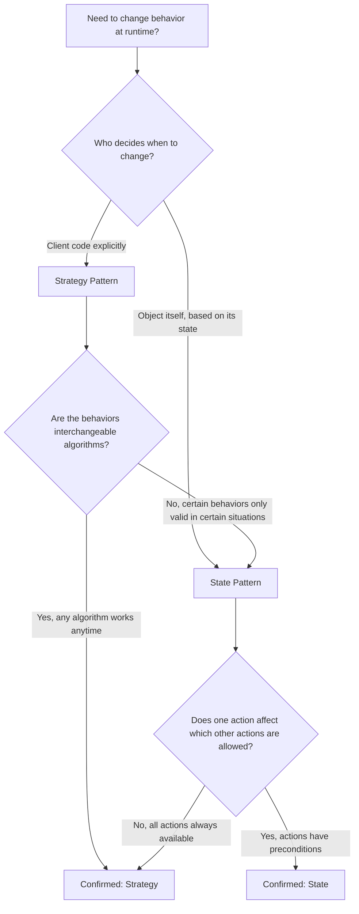
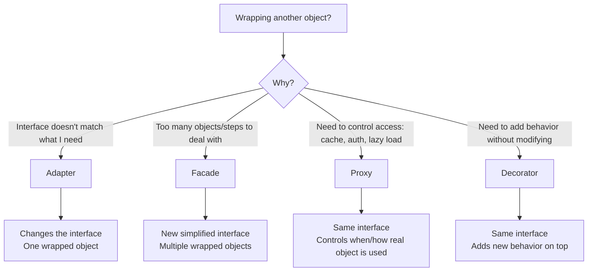
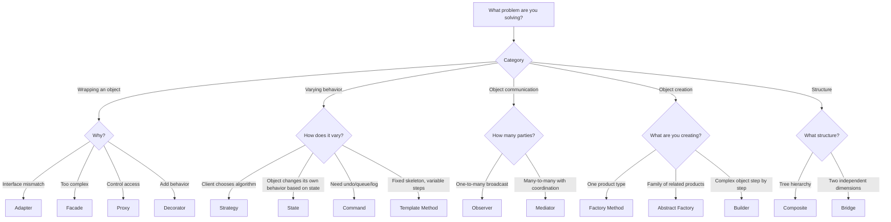

# Pattern vs Pattern: Head-to-Head Comparisons

Commonly confused design patterns compared side by side with code, diagrams, and decision criteria.

---

## 1. Strategy vs State

The most commonly confused pair. Both use composition to change behavior, but for fundamentally different reasons.

### Comparison Table

| Aspect | Strategy | State |
|--------|----------|-------|
| **Intent** | Choose an algorithm at runtime | Change behavior based on internal state |
| **Who decides?** | Client selects the strategy | Object transitions itself between states |
| **Awareness** | Strategies don't know about each other | States know about valid transitions to other states |
| **Number of methods** | Usually one main method per strategy | Multiple methods affected by state |
| **Lifecycle** | Set once or swapped explicitly | Transitions happen as side effects of actions |
| **Analogy** | Choosing a route on GPS | Traffic light changing colors |

### Same Problem, Both Approaches

**Scenario**: A document editor with formatting modes (plain text, markdown, HTML).

```python
# === STRATEGY: Client explicitly picks the formatter ===

from abc import ABC, abstractmethod

class Formatter(ABC):
    @abstractmethod
    def format(self, text: str) -> str:
        pass

class PlainFormatter(Formatter):
    def format(self, text: str) -> str:
        return text

class MarkdownFormatter(Formatter):
    def format(self, text: str) -> str:
        return f"**{text}**"

class HTMLFormatter(Formatter):
    def format(self, text: str) -> str:
        return f"<strong>{text}</strong>"

class Editor:
    def __init__(self, formatter: Formatter):
        self._formatter = formatter  # Client CHOOSES this

    def set_formatter(self, formatter: Formatter):
        self._formatter = formatter  # Client SWITCHES explicitly

    def publish(self, text: str) -> str:
        return self._formatter.format(text)

# Client controls which strategy is active
editor = Editor(MarkdownFormatter())
editor.set_formatter(HTMLFormatter())  # Explicit swap by client


# === STATE: Behavior changes based on document lifecycle ===

class DocumentState(ABC):
    @abstractmethod
    def edit(self, doc: 'Document', content: str):
        pass
    @abstractmethod
    def review(self, doc: 'Document'):
        pass
    @abstractmethod
    def publish(self, doc: 'Document'):
        pass

class DraftState(DocumentState):
    def edit(self, doc, content):
        doc.content = content
        print("Edited draft")

    def review(self, doc):
        doc._state = ReviewState()  # State TRANSITIONS ITSELF
        print("Sent for review")

    def publish(self, doc):
        print("Cannot publish a draft!")

class ReviewState(DocumentState):
    def edit(self, doc, content):
        print("Cannot edit during review!")

    def review(self, doc):
        print("Already in review")

    def publish(self, doc):
        doc._state = PublishedState()  # Auto-transitions
        print("Published!")

class PublishedState(DocumentState):
    def edit(self, doc, content):
        doc._state = DraftState()  # Reverts to draft
        doc.content = content
        print("Unpublished for editing")

    def review(self, doc):
        print("Already published")

    def publish(self, doc):
        print("Already published")

class Document:
    def __init__(self):
        self._state = DraftState()  # States manage themselves
        self.content = ""

    def edit(self, content):
        self._state.edit(self, content)

    def review(self):
        self._state.review(self)

    def publish(self):
        self._state.publish(self)

# States transition automatically based on actions
doc = Document()
doc.edit("Hello")     # Works (Draft state)
doc.review()          # Transitions to Review
doc.edit("Change")    # Blocked! (Review state)
doc.publish()         # Transitions to Published
```

### Decision Guide



---

## 2. Factory Method vs Abstract Factory

### Comparison Table

| Aspect | Factory Method | Abstract Factory |
|--------|---------------|------------------|
| **Scope** | Creates ONE product | Creates a FAMILY of related products |
| **Structure** | Single method in a class | Interface with multiple factory methods |
| **Inheritance** | Subclasses override the factory method | Concrete factories implement the interface |
| **Use case** | "I need a Logger, don't care which" | "I need a matching set of Button + Dialog + Input" |
| **Complexity** | Simple | More complex |
| **Example** | `Document.create_element()` | `UIFactory.create_button()` + `.create_dialog()` + `.create_input()` |

### Code: Both Approaches

```python
from abc import ABC, abstractmethod

# === FACTORY METHOD: Create ONE product, type decided by subclass ===

class Notification(ABC):
    @abstractmethod
    def send(self, message: str):
        pass

class EmailNotification(Notification):
    def send(self, message: str):
        print(f"[Email] {message}")

class SMSNotification(Notification):
    def send(self, message: str):
        print(f"[SMS] {message}")

class PushNotification(Notification):
    def send(self, message: str):
        print(f"[Push] {message}")

class NotificationService(ABC):
    @abstractmethod
    def create_notification(self) -> Notification:
        """Factory method: subclasses decide WHICH notification."""
        pass

    def notify(self, message: str):
        notification = self.create_notification()  # Calls factory method
        notification.send(message)

class EmailService(NotificationService):
    def create_notification(self) -> Notification:
        return EmailNotification()

class SMSService(NotificationService):
    def create_notification(self) -> Notification:
        return SMSNotification()


# === ABSTRACT FACTORY: Create a FAMILY of related products ===

class Button(ABC):
    @abstractmethod
    def render(self): pass

class Dialog(ABC):
    @abstractmethod
    def show(self): pass

class TextField(ABC):
    @abstractmethod
    def render(self): pass

# Concrete family: Material Design
class MaterialButton(Button):
    def render(self): print("[Material] Rounded button")

class MaterialDialog(Dialog):
    def show(self): print("[Material] Bottom sheet dialog")

class MaterialTextField(TextField):
    def render(self): print("[Material] Outlined text field")

# Concrete family: iOS (Cupertino)
class CupertinoButton(Button):
    def render(self): print("[iOS] Pill-shaped button")

class CupertinoDialog(Dialog):
    def show(self): print("[iOS] Alert dialog")

class CupertinoTextField(TextField):
    def render(self): print("[iOS] Rounded rect text field")

class UIFactory(ABC):
    """Abstract Factory: creates a FAMILY of related UI components."""
    @abstractmethod
    def create_button(self) -> Button: pass
    @abstractmethod
    def create_dialog(self) -> Dialog: pass
    @abstractmethod
    def create_text_field(self) -> TextField: pass

class MaterialFactory(UIFactory):
    def create_button(self) -> Button: return MaterialButton()
    def create_dialog(self) -> Dialog: return MaterialDialog()
    def create_text_field(self) -> TextField: return MaterialTextField()

class CupertinoFactory(UIFactory):
    def create_button(self) -> Button: return CupertinoButton()
    def create_dialog(self) -> Dialog: return CupertinoDialog()
    def create_text_field(self) -> TextField: return CupertinoTextField()

# Usage: entire UI is consistent
def build_login_page(factory: UIFactory):
    factory.create_text_field().render()  # Username
    factory.create_text_field().render()  # Password
    factory.create_button().render()      # Login button
    factory.create_dialog().show()        # Error dialog

build_login_page(MaterialFactory())  # All Material
build_login_page(CupertinoFactory()) # All iOS
```

### Decision Guide

```
Need to create objects?
├── Just ONE type of object → Factory Method
│   └── "Create a logger" (FileLogger or ConsoleLogger)
│
└── A FAMILY of related objects that must be consistent → Abstract Factory
    └── "Create Button + Dialog + TextField" (all Material or all iOS)
```

---

## 3. Adapter vs Facade vs Proxy vs Decorator

The "structural pattern confusion zone." All four wrap another object, but for completely different reasons.

### 4-Way Comparison Table

| Aspect | Adapter | Facade | Proxy | Decorator |
|--------|---------|--------|-------|-----------|
| **Intent** | Make incompatible interfaces work together | Simplify a complex subsystem | Control access to an object | Add behavior dynamically |
| **Interface** | Changes the interface | Provides a NEW simplified interface | Same interface as the real object | Same interface as the wrapped object |
| **Wraps** | One object (adaptee) | Multiple objects (subsystem) | One object (real subject) | One object (component) |
| **Client knows?** | Talks to target interface | Talks to facade | Thinks it's the real object | Thinks it's the real object |
| **Key difference** | Translates | Simplifies | Controls | Enhances |
| **Analogy** | Power plug adapter | Universal remote | Security guard | Adding toppings to pizza |

### Same Problem Solved Four Ways

**Scenario**: Working with a third-party weather API.

```python
from abc import ABC, abstractmethod

# --- Third-party API (we can't modify this) ---
class WeatherAPIv2:
    """Third-party API with different interface than what we need."""
    def fetch_weather_data(self, lat: float, lon: float) -> dict:
        return {"temp_fahrenheit": 72.5, "humidity_pct": 45, "wind_mph": 12.3}


# === ADAPTER: Make it match our interface ===
class WeatherService(ABC):
    """Our expected interface."""
    @abstractmethod
    def get_temperature(self, city: str) -> float:
        pass

class WeatherAPIAdapter(WeatherService):
    """Adapts WeatherAPIv2 to our WeatherService interface."""
    def __init__(self, api: WeatherAPIv2):
        self._api = api
        self._city_coords = {"Seattle": (47.6, -122.3), "NYC": (40.7, -74.0)}

    def get_temperature(self, city: str) -> float:
        lat, lon = self._city_coords[city]
        data = self._api.fetch_weather_data(lat, lon)
        return (data["temp_fahrenheit"] - 32) * 5/9  # Convert to Celsius


# === FACADE: Simplify complex weather + location + alert subsystems ===
class LocationService:
    def get_coords(self, city: str) -> tuple:
        return (47.6, -122.3)

class AlertService:
    def check_severe(self, lat, lon) -> bool:
        return False

class WeatherFacade:
    """One simple method hides 3 services."""
    def __init__(self):
        self._weather = WeatherAPIv2()
        self._location = LocationService()
        self._alerts = AlertService()

    def get_weather_summary(self, city: str) -> str:
        lat, lon = self._location.get_coords(city)
        data = self._weather.fetch_weather_data(lat, lon)
        severe = self._alerts.check_severe(lat, lon)
        temp_c = (data["temp_fahrenheit"] - 32) * 5/9
        return f"{city}: {temp_c:.1f}C, {data['humidity_pct']}% humidity" + \
               (" [SEVERE WEATHER]" if severe else "")


# === PROXY: Control access (caching proxy) ===
class CachingWeatherProxy(WeatherService):
    """Same interface as WeatherService, but caches results."""
    def __init__(self, real_service: WeatherService):
        self._real = real_service
        self._cache: dict[str, tuple[float, float]] = {}  # city -> (temp, timestamp)

    def get_temperature(self, city: str) -> float:
        import time
        if city in self._cache:
            temp, ts = self._cache[city]
            if time.time() - ts < 300:  # 5 minute cache
                print(f"[Cache HIT] {city}")
                return temp
        print(f"[Cache MISS] {city}")
        temp = self._real.get_temperature(city)
        self._cache[city] = (temp, time.time())
        return temp


# === DECORATOR: Add extra behavior (logging) ===
class LoggingWeatherDecorator(WeatherService):
    """Same interface, but adds logging around every call."""
    def __init__(self, wrapped: WeatherService):
        self._wrapped = wrapped

    def get_temperature(self, city: str) -> float:
        print(f"[LOG] Requesting temperature for {city}")
        result = self._wrapped.get_temperature(city)
        print(f"[LOG] Got {result:.1f}C for {city}")
        return result
```

### Decision Flowchart



---

## 4. Observer vs Mediator

Both decouple communication between objects, but in different ways.

### Comparison Table

| Aspect | Observer | Mediator |
|--------|----------|---------|
| **Communication** | One-to-many broadcast | Many-to-many through central hub |
| **Coupling** | Subject doesn't know observer types | No component knows about others |
| **Direction** | Unidirectional (subject -> observers) | Bidirectional (components <-> mediator) |
| **Who has logic?** | Observers react independently | Mediator coordinates interactions |
| **Scaling** | Add observers freely | Mediator can become a "God object" |
| **Analogy** | Newsletter subscription | Air traffic control tower |

### Chat Room: Both Approaches

```python
from abc import ABC, abstractmethod

# === OBSERVER: Users subscribe to a chat channel ===
# Limitation: one-way broadcast, no coordination logic

class ChatChannel:
    """Subject: broadcasts messages to all subscribers."""
    def __init__(self, name: str):
        self.name = name
        self._subscribers: list['ChatUser'] = []

    def subscribe(self, user: 'ChatUser'):
        self._subscribers.append(user)

    def post(self, sender: 'ChatUser', message: str):
        for user in self._subscribers:
            if user != sender:  # Don't notify sender
                user.receive(self.name, sender.name, message)

class ChatUser:
    def __init__(self, name: str):
        self.name = name

    def receive(self, channel: str, sender: str, message: str):
        print(f"  [{self.name}] #{channel} - {sender}: {message}")

# Usage: simple broadcast, no coordination
general = ChatChannel("general")
alice = ChatUser("Alice")
bob = ChatUser("Bob")
general.subscribe(alice)
general.subscribe(bob)
general.post(alice, "Hello everyone!")
# Bob receives, Alice doesn't (she sent it)


# === MEDIATOR: Chat server coordinates complex interactions ===
# Benefit: handles DMs, muting, typing indicators, read receipts

class ChatMediator(ABC):
    @abstractmethod
    def send_message(self, sender: 'MediatedUser', message: str, channel: str):
        pass
    @abstractmethod
    def send_dm(self, sender: 'MediatedUser', recipient: str, message: str):
        pass

class MediatedUser:
    def __init__(self, name: str, mediator: ChatMediator):
        self.name = name
        self._mediator = mediator
        self.muted_users: set[str] = set()

    def send(self, message: str, channel: str = "general"):
        self._mediator.send_message(self, message, channel)

    def direct_message(self, recipient: str, message: str):
        self._mediator.send_dm(self, recipient, message)

    def receive(self, sender: str, message: str, is_dm: bool = False):
        if sender in self.muted_users:
            return  # Muted
        prefix = "[DM]" if is_dm else "[MSG]"
        print(f"  [{self.name}] {prefix} {sender}: {message}")

class ChatServer(ChatMediator):
    """Mediator: coordinates ALL chat interactions."""

    def __init__(self):
        self._users: dict[str, MediatedUser] = {}
        self._channels: dict[str, set[str]] = {}  # channel -> {usernames}
        self._banned: set[str] = set()

    def register(self, user: MediatedUser):
        self._users[user.name] = user

    def join_channel(self, username: str, channel: str):
        self._channels.setdefault(channel, set()).add(username)

    def send_message(self, sender: MediatedUser, message: str, channel: str):
        if sender.name in self._banned:
            sender.receive("SYSTEM", "You are banned.", is_dm=True)
            return
        members = self._channels.get(channel, set())
        for username in members:
            if username != sender.name:
                self._users[username].receive(sender.name, message)

    def send_dm(self, sender: MediatedUser, recipient: str, message: str):
        if recipient in self._users:
            self._users[recipient].receive(sender.name, message, is_dm=True)
        else:
            sender.receive("SYSTEM", f"{recipient} not found", is_dm=True)

# Usage: mediator handles DMs, banning, channels
server = ChatServer()
alice = MediatedUser("Alice", server)
bob = MediatedUser("Bob", server)
charlie = MediatedUser("Charlie", server)

server.register(alice)
server.register(bob)
server.register(charlie)
server.join_channel("Alice", "general")
server.join_channel("Bob", "general")

alice.send("Hello channel!")        # Bob receives, Charlie doesn't (not in channel)
alice.direct_message("Charlie", "Hey!")  # DM to Charlie
bob.muted_users.add("Alice")       # Bob mutes Alice
alice.send("Anyone there?")        # Bob doesn't see this (muted)
```

### When to Use Which

- **Observer**: Simple event notification (newsletter, stock price updates, UI events)
- **Mediator**: Complex interaction rules between multiple peers (chat rooms, air traffic control, form field validation)

---

## 5. Command vs Strategy

### Comparison Table

| Aspect | Command | Strategy |
|--------|---------|----------|
| **Intent** | Encapsulate a request as an object | Encapsulate an algorithm |
| **Key features** | Undo, queue, log, replay | Interchangeable algorithms |
| **State** | Often stores execution context | Usually stateless |
| **History** | Typically maintains command history | No history needed |
| **Methods** | `execute()` + `undo()` | Single `do_it()` method |
| **Analogy** | Waiter taking order slips | GPS choosing route algorithm |

### Same Scenario: Text Editor Operations

```python
from abc import ABC, abstractmethod

# === COMMAND: Operations that can be undone ===

class TextCommand(ABC):
    @abstractmethod
    def execute(self):
        pass

    @abstractmethod
    def undo(self):
        pass

class InsertCommand(TextCommand):
    def __init__(self, document: list, position: int, text: str):
        self._doc = document
        self._pos = position
        self._text = text

    def execute(self):
        self._doc.insert(self._pos, self._text)

    def undo(self):
        self._doc.pop(self._pos)

class DeleteCommand(TextCommand):
    def __init__(self, document: list, position: int):
        self._doc = document
        self._pos = position
        self._deleted = None

    def execute(self):
        self._deleted = self._doc.pop(self._pos)

    def undo(self):
        self._doc.insert(self._pos, self._deleted)

class CommandHistory:
    def __init__(self):
        self._history: list[TextCommand] = []

    def execute(self, cmd: TextCommand):
        cmd.execute()
        self._history.append(cmd)

    def undo(self):
        if self._history:
            cmd = self._history.pop()
            cmd.undo()

# Usage: operations with undo
doc = ["Hello", " ", "World"]
history = CommandHistory()
history.execute(InsertCommand(doc, 3, "!"))
print(doc)  # ['Hello', ' ', 'World', '!']
history.undo()
print(doc)  # ['Hello', ' ', 'World']


# === STRATEGY: Algorithms without undo/history ===

class SortStrategy(ABC):
    @abstractmethod
    def sort(self, data: list) -> list:
        pass

class QuickSort(SortStrategy):
    def sort(self, data: list) -> list:
        # Simplified quicksort
        if len(data) <= 1:
            return data
        pivot = data[len(data) // 2]
        left = [x for x in data if x < pivot]
        mid = [x for x in data if x == pivot]
        right = [x for x in data if x > pivot]
        return self.sort(left) + mid + self.sort(right)

class MergeSort(SortStrategy):
    def sort(self, data: list) -> list:
        if len(data) <= 1:
            return data
        mid = len(data) // 2
        left = self.sort(data[:mid])
        right = self.sort(data[mid:])
        return self._merge(left, right)

    def _merge(self, a, b):
        result = []
        i = j = 0
        while i < len(a) and j < len(b):
            if a[i] <= b[j]:
                result.append(a[i]); i += 1
            else:
                result.append(b[j]); j += 1
        return result + a[i:] + b[j:]

# Usage: pick algorithm, no undo needed
data = [3, 1, 4, 1, 5, 9, 2, 6]
sorter = QuickSort()
print(sorter.sort(data))  # [1, 1, 2, 3, 4, 5, 6, 9]
```

### Decision Criteria

- Need **undo/redo**? --> Command
- Need to **queue or schedule** operations? --> Command
- Need **audit log** of all operations? --> Command
- Just need to **swap algorithms**? --> Strategy
- Operations are **stateless**? --> Strategy

---

## 6. Template Method vs Strategy

Both solve "vary part of an algorithm." Template Method uses inheritance; Strategy uses composition.

### Comparison Table

| Aspect | Template Method | Strategy |
|--------|----------------|----------|
| **Mechanism** | Inheritance (override steps) | Composition (inject algorithm) |
| **Coupling** | Tighter (subclass bound to superclass) | Looser (algorithm is a separate object) |
| **Flexibility** | Fixed at compile time | Switchable at runtime |
| **Code reuse** | Shared skeleton in base class | No shared code between strategies |
| **SOLID** | Can violate LSP if not careful | Follows OCP and SRP well |
| **When** | Steps are mostly fixed, few vary | The whole algorithm varies |

### Same Problem Both Ways

```python
from abc import ABC, abstractmethod

# === TEMPLATE METHOD: Inheritance-based data processing pipeline ===

class DataProcessor(ABC):
    """Template: defines the skeleton, subclasses fill in steps."""

    def process(self, source: str) -> list:
        """The template method - fixed skeleton."""
        raw = self.read(source)          # Step 1: subclass implements
        cleaned = self.clean(raw)        # Step 2: fixed
        transformed = self.transform(cleaned)  # Step 3: subclass implements
        self.output(transformed)         # Step 4: subclass implements
        return transformed

    @abstractmethod
    def read(self, source: str) -> list:
        pass

    def clean(self, data: list) -> list:
        """Default implementation: remove nulls (can be overridden)."""
        return [d for d in data if d is not None]

    @abstractmethod
    def transform(self, data: list) -> list:
        pass

    @abstractmethod
    def output(self, data: list):
        pass

class CSVProcessor(DataProcessor):
    def read(self, source: str) -> list:
        print(f"Reading CSV from {source}")
        return ["a,1", "b,2", None, "c,3"]

    def transform(self, data: list) -> list:
        return [row.split(",") for row in data]

    def output(self, data: list):
        print(f"Writing {len(data)} rows to database")

class JSONProcessor(DataProcessor):
    def read(self, source: str) -> list:
        print(f"Reading JSON from {source}")
        return [{"key": "a"}, None, {"key": "b"}]

    def transform(self, data: list) -> list:
        return [d["key"] for d in data]

    def output(self, data: list):
        print(f"Publishing {len(data)} items to API")


# === STRATEGY: Composition-based - inject reader, transformer, writer ===

class Reader(ABC):
    @abstractmethod
    def read(self, source: str) -> list:
        pass

class Transformer(ABC):
    @abstractmethod
    def transform(self, data: list) -> list:
        pass

class Writer(ABC):
    @abstractmethod
    def write(self, data: list):
        pass

class CSVReader(Reader):
    def read(self, source: str) -> list:
        return ["a,1", "b,2", "c,3"]

class JSONReader(Reader):
    def read(self, source: str) -> list:
        return [{"key": "a"}, {"key": "b"}]

class SplitTransformer(Transformer):
    def transform(self, data: list) -> list:
        return [row.split(",") for row in data]

class KeyExtractor(Transformer):
    def transform(self, data: list) -> list:
        return [d["key"] for d in data]

class DatabaseWriter(Writer):
    def write(self, data: list):
        print(f"Writing {len(data)} rows to database")

class APIWriter(Writer):
    def write(self, data: list):
        print(f"Publishing {len(data)} items to API")

class FlexibleProcessor:
    """Strategy-based: mix and match any reader + transformer + writer."""

    def __init__(self, reader: Reader, transformer: Transformer, writer: Writer):
        self._reader = reader
        self._transformer = transformer
        self._writer = writer

    def process(self, source: str) -> list:
        raw = self._reader.read(source)
        transformed = self._transformer.transform(raw)
        self._writer.write(transformed)
        return transformed

# Strategy advantage: can combine freely
# CSV -> transform -> API (mix that Template Method can't do without new subclass)
processor = FlexibleProcessor(CSVReader(), SplitTransformer(), APIWriter())
processor.process("data.csv")
```

### Decision

- Use **Template Method** when the algorithm structure is fixed and only a few steps vary
- Use **Strategy** when the entire algorithm (or independent parts) should be swappable at runtime
- Prefer **Strategy** in most modern code -- composition over inheritance

---

## 7. Composite vs Decorator

Both use recursive composition (wrapping), but for different purposes.

### Comparison Table

| Aspect | Composite | Decorator |
|--------|-----------|-----------|
| **Intent** | Treat individual and groups uniformly | Add responsibilities dynamically |
| **Structure** | Tree (parent has multiple children) | Chain (each wraps exactly one) |
| **Children** | Multiple children per node | Exactly one wrapped object |
| **Identity** | Focus on structure/hierarchy | Focus on enhancing behavior |
| **Operations** | Propagated down to all children | Enhanced one layer at a time |
| **Example** | File system (folders + files) | Coffee + milk + sugar |

### File System Example

```python
from abc import ABC, abstractmethod

# === COMPOSITE: File system hierarchy ===

class FileSystemItem(ABC):
    def __init__(self, name: str):
        self.name = name

    @abstractmethod
    def get_size(self) -> int:
        pass

    @abstractmethod
    def display(self, indent: int = 0):
        pass

class File(FileSystemItem):
    """Leaf: no children."""
    def __init__(self, name: str, size: int):
        super().__init__(name)
        self._size = size

    def get_size(self) -> int:
        return self._size

    def display(self, indent: int = 0):
        print(f"{'  ' * indent}{self.name} ({self._size} bytes)")

class Directory(FileSystemItem):
    """Composite: contains children (files AND directories)."""
    def __init__(self, name: str):
        super().__init__(name)
        self._children: list[FileSystemItem] = []

    def add(self, item: FileSystemItem):
        self._children.append(item)

    def get_size(self) -> int:
        return sum(child.get_size() for child in self._children)  # Recursive!

    def display(self, indent: int = 0):
        print(f"{'  ' * indent}{self.name}/ ({self.get_size()} bytes)")
        for child in self._children:
            child.display(indent + 1)

# Build tree structure
root = Directory("project")
src = Directory("src")
src.add(File("main.py", 2048))
src.add(File("utils.py", 1024))
tests = Directory("tests")
tests.add(File("test_main.py", 512))
root.add(src)
root.add(tests)
root.add(File("README.md", 256))

root.display()
# project/ (3840 bytes)
#   src/ (3072 bytes)
#     main.py (2048 bytes)
#     utils.py (1024 bytes)
#   tests/ (512 bytes)
#     test_main.py (512 bytes)
#   README.md (256 bytes)

print(f"Total: {root.get_size()} bytes")  # Uniform interface


# === DECORATOR: Add behaviors to a file ===

class FileDecorator(FileSystemItem, ABC):
    """Wraps ONE FileSystemItem to add behavior."""
    def __init__(self, wrapped: FileSystemItem):
        super().__init__(wrapped.name)
        self._wrapped = wrapped

class EncryptedFile(FileDecorator):
    def get_size(self) -> int:
        return int(self._wrapped.get_size() * 1.1)  # Encryption adds 10% overhead

    def display(self, indent: int = 0):
        print(f"{'  ' * indent}[ENCRYPTED] ", end="")
        self._wrapped.display(0)

class CompressedFile(FileDecorator):
    def get_size(self) -> int:
        return int(self._wrapped.get_size() * 0.6)  # 40% compression

    def display(self, indent: int = 0):
        print(f"{'  ' * indent}[COMPRESSED] ", end="")
        self._wrapped.display(0)

# Decorators stack: compress then encrypt
secret = File("secrets.txt", 1000)
secret = CompressedFile(secret)   # 600 bytes
secret = EncryptedFile(secret)    # 660 bytes
secret.display()  # [ENCRYPTED] [COMPRESSED] secrets.txt (1000 bytes)
print(f"Size after transform: {secret.get_size()}")  # 660
```

### Key Difference
- **Composite**: One parent, MANY children (tree shape)
- **Decorator**: One wrapper, ONE wrapped (chain shape)

---

## 8. Bridge vs Strategy

Both use composition with an abstraction that delegates to an implementation. The difference is the intent and what varies.

### Comparison Table

| Aspect | Bridge | Strategy |
|--------|--------|----------|
| **Category** | Structural | Behavioral |
| **Intent** | Separate abstraction from implementation (both can vary independently) | Swap algorithms at runtime |
| **What varies** | Two orthogonal dimensions | One algorithm dimension |
| **Complexity** | Two hierarchies that combine | One hierarchy of algorithms |
| **When** | You have M x N combinations | You have N interchangeable algorithms |
| **Example** | Shape (Circle, Square) x Renderer (OpenGL, DirectX) | Sort (Quick, Merge, Bubble) |

### Code: Shape Rendering

```python
from abc import ABC, abstractmethod

# === BRIDGE: Two independent dimensions that combine ===
# Dimension 1: Shape (Circle, Square, Triangle)
# Dimension 2: Renderer (OpenGL, DirectX, SVG)
# Without Bridge: 3 shapes x 3 renderers = 9 classes
# With Bridge: 3 + 3 = 6 classes

class Renderer(ABC):
    """Implementation hierarchy - can grow independently."""
    @abstractmethod
    def render_circle(self, x, y, radius):
        pass
    @abstractmethod
    def render_rect(self, x, y, width, height):
        pass

class OpenGLRenderer(Renderer):
    def render_circle(self, x, y, radius):
        print(f"[OpenGL] glDrawCircle({x}, {y}, {radius})")
    def render_rect(self, x, y, width, height):
        print(f"[OpenGL] glDrawRect({x}, {y}, {width}, {height})")

class SVGRenderer(Renderer):
    def render_circle(self, x, y, radius):
        print(f"[SVG] <circle cx='{x}' cy='{y}' r='{radius}'/>")
    def render_rect(self, x, y, width, height):
        print(f"[SVG] <rect x='{x}' y='{y}' w='{width}' h='{height}'/>")

class Shape(ABC):
    """Abstraction hierarchy - can grow independently."""
    def __init__(self, renderer: Renderer):
        self._renderer = renderer  # Bridge to implementation

    @abstractmethod
    def draw(self):
        pass

class Circle(Shape):
    def __init__(self, renderer: Renderer, x: float, y: float, radius: float):
        super().__init__(renderer)
        self.x, self.y, self.radius = x, y, radius

    def draw(self):
        self._renderer.render_circle(self.x, self.y, self.radius)

class Rectangle(Shape):
    def __init__(self, renderer: Renderer, x: float, y: float, w: float, h: float):
        super().__init__(renderer)
        self.x, self.y, self.w, self.h = x, y, w, h

    def draw(self):
        self._renderer.render_rect(self.x, self.y, self.w, self.h)

# Combine any shape with any renderer
Circle(OpenGLRenderer(), 10, 20, 5).draw()   # OpenGL circle
Circle(SVGRenderer(), 10, 20, 5).draw()       # SVG circle
Rectangle(SVGRenderer(), 0, 0, 100, 50).draw() # SVG rectangle


# === STRATEGY: Just swapping one algorithm ===
# Only ONE dimension varies (the algorithm)

class CompressionStrategy(ABC):
    @abstractmethod
    def compress(self, data: bytes) -> bytes:
        pass

class ZIPCompression(CompressionStrategy):
    def compress(self, data: bytes) -> bytes:
        print(f"[ZIP] Compressing {len(data)} bytes")
        return data  # Simplified

class GZIPCompression(CompressionStrategy):
    def compress(self, data: bytes) -> bytes:
        print(f"[GZIP] Compressing {len(data)} bytes")
        return data

class FileCompressor:
    """Only the compression algorithm varies, not the FileCompressor itself."""
    def __init__(self, strategy: CompressionStrategy):
        self._strategy = strategy

    def set_strategy(self, strategy: CompressionStrategy):
        self._strategy = strategy

    def compress_file(self, filepath: str):
        data = b"file contents"  # Would read file
        return self._strategy.compress(data)
```

### Decision

```
How many dimensions vary?
├── ONE dimension (just the algorithm) → Strategy
│   └── Sorting: Quick/Merge/Bubble
│
└── TWO+ independent dimensions → Bridge
    └── Shape x Renderer, Device x OS, Notification x Channel
```

---

## Master Decision Chart


