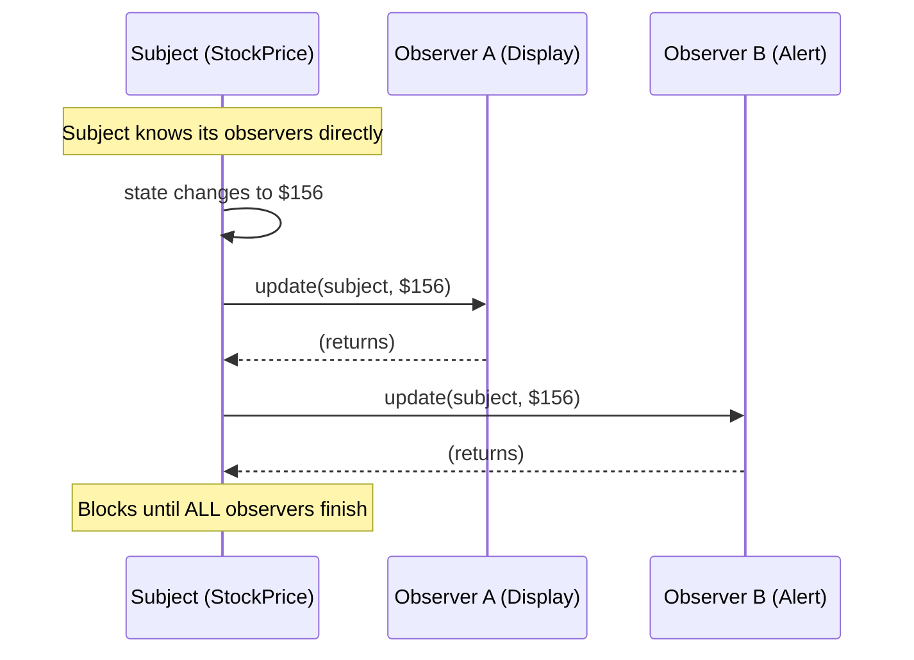
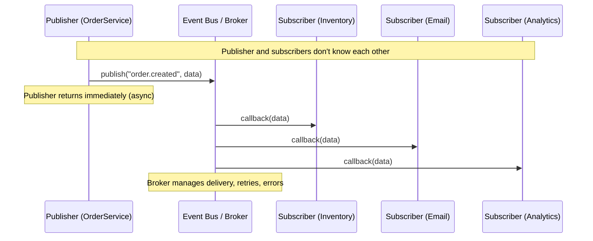
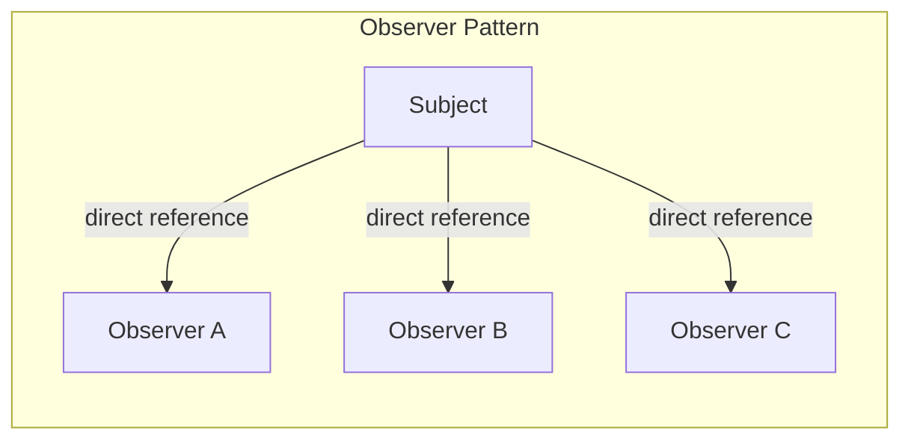
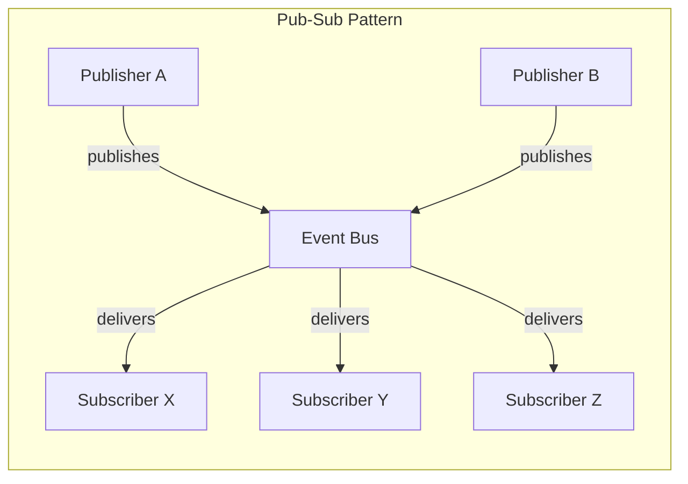

# Pub-Sub vs Observer Pattern

> Two patterns for event-driven communication that are often confused. This guide clarifies the critical differences, shows code for both, and explains when to use which.

---

## Table of Contents

- [Observer Pattern](#observer-pattern)
- [Pub-Sub Pattern](#pub-sub-pattern)
- [Side-by-Side Comparison](#side-by-side-comparison)
- [Architecture Diagrams](#architecture-diagrams)
- [When to Use Which](#when-to-use-which)
- [Real-World Examples](#real-world-examples)
- [Hybrid Approaches](#hybrid-approaches)

---

## Observer Pattern

### Core Concept

The Observer pattern establishes a **direct** relationship between a Subject (publisher) and its Observers (subscribers). The subject maintains a list of observers and notifies them directly when its state changes.

**Key characteristic:** The subject **knows** about its observers.

### Structure

```
Subject ──────────> Observer (interface)
  │  maintains list     │
  │  calls notify()     ├── ConcreteObserverA
  │                     ├── ConcreteObserverB
  │                     └── ConcreteObserverC
```

### Code Example

```python
from abc import ABC, abstractmethod
from typing import List, Any


class Observer(ABC):
    """Interface for objects that want to be notified of changes."""

    @abstractmethod
    def update(self, subject: "Subject", data: Any) -> None:
        pass


class Subject:
    """Maintains a list of observers and notifies them directly."""

    def __init__(self):
        self._observers: List[Observer] = []
        self._state = None

    def attach(self, observer: Observer) -> None:
        if observer not in self._observers:
            self._observers.append(observer)

    def detach(self, observer: Observer) -> None:
        self._observers.remove(observer)

    def notify(self) -> None:
        for observer in self._observers:
            observer.update(self, self._state)

    @property
    def state(self):
        return self._state

    @state.setter
    def state(self, value):
        self._state = value
        self.notify()  # Synchronous, immediate notification


# --- Concrete Implementation ---

class StockPrice(Subject):
    """A stock price that notifies watchers when it changes."""

    def __init__(self, symbol: str, price: float):
        super().__init__()
        self.symbol = symbol
        self._state = price

    def __repr__(self):
        return f"Stock({self.symbol}=${self._state:.2f})"


class PriceDisplay(Observer):
    """Displays the current stock price."""

    def __init__(self, name: str):
        self.name = name

    def update(self, subject: StockPrice, data):
        print(f"  [{self.name}] {subject.symbol} is now ${data:.2f}")


class PriceAlert(Observer):
    """Alerts when a stock crosses a threshold."""

    def __init__(self, threshold: float):
        self.threshold = threshold

    def update(self, subject: StockPrice, data):
        if data > self.threshold:
            print(f"  [ALERT] {subject.symbol} crossed ${self.threshold:.2f}! "
                  f"Now at ${data:.2f}")


# Usage
stock = StockPrice("AAPL", 150.0)
display = PriceDisplay("Dashboard")
alert = PriceAlert(155.0)

stock.attach(display)
stock.attach(alert)

stock.state = 152.0   # Dashboard gets notified, alert stays silent
stock.state = 156.0   # Both get notified, alert fires
stock.detach(display)  # Display stops receiving updates
stock.state = 160.0   # Only alert fires
```

### Characteristics

| Aspect | Observer |
|---|---|
| **Coupling** | Tight -- subject holds direct references to observers |
| **Communication** | Synchronous (blocking) |
| **Scope** | In-process (same application) |
| **Direction** | Subject pushes to known observers |
| **Failure handling** | One observer's exception can block others |
| **Discovery** | Subject knows all its observers |

---

## Pub-Sub Pattern

### Core Concept

The Pub-Sub pattern introduces a **message broker** (event bus, channel, topic) between publishers and subscribers. Publishers and subscribers **do not know about each other**. They communicate through named topics/events.

**Key characteristic:** Publisher and subscriber are **completely decoupled** through an intermediary.

### Structure

```
Publisher ──> [Event Bus / Broker] ──> Subscriber A
Publisher ──> [  Topic: "orders"  ] ──> Subscriber B
Publisher ──> [  Topic: "alerts"  ] ──> Subscriber C
```

### Code Example

```python
from typing import Callable, Dict, List, Any
from collections import defaultdict
import threading
from queue import Queue


class EventBus:
    """
    Central message broker that decouples publishers from subscribers.
    Publishers and subscribers only know about the EventBus and topic names.
    """

    def __init__(self):
        self._subscribers: Dict[str, List[Callable]] = defaultdict(list)

    def subscribe(self, topic: str, callback: Callable) -> None:
        """Subscribe a callback to a topic. No knowledge of publisher needed."""
        self._subscribers[topic].append(callback)

    def unsubscribe(self, topic: str, callback: Callable) -> None:
        """Remove a subscription."""
        self._subscribers[topic].remove(callback)

    def publish(self, topic: str, data: Any = None) -> None:
        """Publish an event to a topic. No knowledge of subscribers needed."""
        for callback in self._subscribers.get(topic, []):
            callback(data)


class AsyncEventBus:
    """
    Asynchronous variant -- publishers don't wait for subscribers to finish.
    Messages are queued and processed in a background thread.
    """

    def __init__(self):
        self._subscribers: Dict[str, List[Callable]] = defaultdict(list)
        self._queue: Queue = Queue()
        self._running = True
        self._worker = threading.Thread(target=self._process, daemon=True)
        self._worker.start()

    def subscribe(self, topic: str, callback: Callable) -> None:
        self._subscribers[topic].append(callback)

    def publish(self, topic: str, data: Any = None) -> None:
        """Non-blocking -- just enqueue and return."""
        self._queue.put((topic, data))

    def _process(self):
        while self._running:
            topic, data = self._queue.get()
            for callback in self._subscribers.get(topic, []):
                try:
                    callback(data)
                except Exception as e:
                    print(f"  [EventBus] Error in subscriber for '{topic}': {e}")

    def shutdown(self):
        self._running = False


# --- Usage: E-Commerce System ---

bus = EventBus()


# Subscribers -- they know NOTHING about publishers
def update_inventory(order_data):
    print(f"  [Inventory] Reducing stock for order #{order_data['id']}")


def send_confirmation_email(order_data):
    print(f"  [Email] Confirmation sent to {order_data['email']}")


def update_analytics(order_data):
    print(f"  [Analytics] Recorded ${order_data['total']:.2f} sale")


def notify_warehouse(order_data):
    print(f"  [Warehouse] Preparing shipment for order #{order_data['id']}")


# Subscribe to topics
bus.subscribe("order.created", update_inventory)
bus.subscribe("order.created", send_confirmation_email)
bus.subscribe("order.created", update_analytics)
bus.subscribe("order.created", notify_warehouse)

bus.subscribe("order.cancelled", update_inventory)  # Different handler logic
bus.subscribe("order.cancelled", send_confirmation_email)


# Publisher -- knows NOTHING about subscribers
class OrderService:
    """Publishes events without knowing who listens."""

    def __init__(self, event_bus: EventBus):
        self.event_bus = event_bus

    def create_order(self, order_id, email, total):
        order = {"id": order_id, "email": email, "total": total}
        print(f"\n  OrderService: Created order #{order_id}")
        self.event_bus.publish("order.created", order)

    def cancel_order(self, order_id, email):
        order = {"id": order_id, "email": email}
        print(f"\n  OrderService: Cancelled order #{order_id}")
        self.event_bus.publish("order.cancelled", order)


# Run
service = OrderService(bus)
service.create_order(1001, "alice@example.com", 99.99)
service.cancel_order(1001, "alice@example.com")
```

### Characteristics

| Aspect | Pub-Sub |
|---|---|
| **Coupling** | Loose -- publisher and subscriber don't know each other |
| **Communication** | Can be synchronous or asynchronous |
| **Scope** | In-process or cross-process (via message broker) |
| **Direction** | Publishers emit to topics, subscribers listen to topics |
| **Failure handling** | Broker can isolate failures, retry, dead-letter |
| **Discovery** | Neither side knows the other; broker manages routing |

---

## Side-by-Side Comparison

| Dimension | Observer | Pub-Sub |
|---|---|---|
| **Coupling** | Subject directly references observers | Decoupled through broker/bus |
| **Awareness** | Subject knows its observers | Publisher and subscriber are anonymous |
| **Communication** | Almost always synchronous | Often asynchronous |
| **Scope** | In-process only | In-process or cross-process/network |
| **Topic/Channel** | Implicit (subject IS the topic) | Explicit topic names/channels |
| **Filtering** | Observer gets all subject events | Subscriber chooses topics |
| **Ordering** | Guaranteed (iteration order) | May not be guaranteed |
| **Error isolation** | One observer failure can affect others | Broker can isolate failures |
| **Complexity** | Simple to implement | Requires broker infrastructure |
| **Debugging** | Easier -- direct references traceable | Harder -- indirect through broker |
| **Memory leaks** | Common (forgotten detach) | Less common (topic-based) |
| **Scalability** | Limited by in-process constraints | Scales with distributed brokers |
| **Testing** | Must mock subject or observer | Can test publisher and subscriber independently |
| **GoF Pattern?** | Yes (Gang of Four) | No (architectural pattern) |

---

## Architecture Diagrams

### Observer Pattern



### Pub-Sub Pattern



### Structural Comparison





---

## When to Use Which

### Use Observer When:

1. **In-process communication** -- Components live in the same application/module
2. **Tight feedback loop** -- Subject needs to know notification is complete before proceeding
3. **Small number of observers** -- Direct management is simpler than a broker
4. **Type safety matters** -- Observer interface provides compile-time / type-checking guarantees
5. **Simple scenarios** -- UI component watching a model, e.g., MVC pattern

**Example scenarios:**
- GUI button click handlers
- Model-View synchronization
- Game entity watching another entity's health
- Form validation watching input fields

### Use Pub-Sub When:

1. **Cross-process or cross-service communication** -- Microservices, distributed systems
2. **Decoupling is critical** -- Publisher and subscriber teams develop independently
3. **Asynchronous processing** -- Publisher shouldn't wait for subscribers
4. **Dynamic routing** -- Subscribers come and go at runtime based on topics
5. **Fan-out at scale** -- One event triggers 10+ independent downstream processes
6. **Reliability needed** -- Message broker provides persistence, retry, dead-letter queues

**Example scenarios:**
- Microservice event-driven architecture
- Real-time notification systems (chat, alerts)
- Log aggregation pipelines
- E-commerce: order created triggers inventory, email, analytics, warehouse
- IoT sensor data distribution

### Decision Flowchart

```
Is communication cross-process/cross-service?
├── YES → Pub-Sub (with message broker like Kafka, RabbitMQ)
└── NO → In-process only
         ├── Need async / fire-and-forget?
         │   ├── YES → Pub-Sub (in-process event bus)
         │   └── NO → Need topic-based routing?
         │       ├── YES → Pub-Sub
         │       └── NO → Observer (simpler)
```

---

## Real-World Examples

### Observer in the Wild

| System | Subject | Observer | Why Observer? |
|---|---|---|---|
| **Java Swing / tkinter** | Button | ActionListener | In-process, synchronous UI updates |
| **Django Signals** | Model.save() | Signal handlers | In-process, same Django app |
| **React `useEffect`** | State variable | Effect callback | In-component state watching |
| **MVC frameworks** | Model | View | Direct model-to-view synchronization |
| **Python `property` + callback** | Data model | UI widget | Tight binding for live updates |

### Pub-Sub in the Wild

| System | Broker | Why Pub-Sub? |
|---|---|---|
| **Apache Kafka** | Kafka cluster | Cross-service, persistent, ordered event streaming |
| **RabbitMQ** | AMQP broker | Reliable message delivery with routing |
| **Redis Pub/Sub** | Redis server | Lightweight real-time messaging |
| **AWS SNS + SQS** | AWS infrastructure | Managed fan-out to multiple services |
| **Google Cloud Pub/Sub** | GCP infrastructure | Global, scalable event distribution |
| **WebSocket chat rooms** | Server "rooms" | Dynamic topic-based fan-out |
| **Kubernetes Events** | etcd + API server | Cluster-wide event notification |
| **GitHub Webhooks** | GitHub platform | Cross-service notifications on repo events |

### Hybrid: Django Signals (Observer) + Celery (Pub-Sub)

```python
# Django signal (Observer pattern -- in-process, synchronous)
from django.db.models.signals import post_save
from django.dispatch import receiver

@receiver(post_save, sender=Order)
def on_order_created(sender, instance, created, **kwargs):
    if created:
        # Kick off async tasks via Celery (Pub-Sub pattern -- cross-process)
        send_confirmation_email.delay(instance.id)    # Goes to Redis/RabbitMQ
        update_analytics.delay(instance.id)           # Different worker picks it up
        notify_warehouse.delay(instance.id)           # Another service processes it
```

This shows how both patterns coexist: Observer catches the event in-process, then Pub-Sub distributes work asynchronously across services.

---

## Hybrid Approaches

### Event Bus as a Bridge

Many real systems use an in-process event bus that looks like Pub-Sub but operates with Observer-like semantics internally. This gives you topic-based routing without the overhead of a message broker.

```python
class HybridEventBus:
    """
    In-process Pub-Sub with Observer characteristics.
    Topics provide decoupling. Direct calls provide synchronous guarantees.
    """

    def __init__(self):
        self._handlers = defaultdict(list)

    def on(self, event_type: str, handler: Callable):
        """Subscribe (Pub-Sub topic-based registration)."""
        self._handlers[event_type].append(handler)

    def emit(self, event_type: str, **data):
        """Publish (synchronous delivery like Observer)."""
        for handler in self._handlers.get(event_type, []):
            handler(**data)

    def off(self, event_type: str, handler: Callable):
        """Unsubscribe."""
        self._handlers[event_type].remove(handler)


# Works like Observer (synchronous) but with Pub-Sub topology (decoupled via topics)
bus = HybridEventBus()
bus.on("user.registered", lambda **d: print(f"Send welcome email to {d['email']}"))
bus.on("user.registered", lambda **d: print(f"Create default workspace for {d['name']}"))
bus.emit("user.registered", name="Alice", email="alice@example.com")
```

### Reactive Streams (Best of Both Worlds)

Libraries like RxPy combine Observer-style subscription with Pub-Sub-style decoupling and add powerful operators for filtering, transformation, and backpressure.

```python
# Conceptual RxPy example
from rx import of, operators as ops

# Create an observable (Subject-like)
stock_prices = of(150.0, 152.0, 156.0, 148.0, 160.0)

# Subscribe with operators (Pub-Sub-like filtering)
stock_prices.pipe(
    ops.filter(lambda price: price > 155),      # Only high prices
    ops.map(lambda price: f"ALERT: ${price}"),   # Transform
).subscribe(
    on_next=lambda msg: print(msg),              # Observer callback
    on_error=lambda e: print(f"Error: {e}"),
    on_completed=lambda: print("Stream ended"),
)
```

---

## Summary

| Choose... | When... |
|---|---|
| **Observer** | In-process, synchronous, direct binding, simple cases, tight feedback |
| **Pub-Sub** | Cross-process, async, decoupled teams/services, fan-out, reliability |
| **Hybrid Event Bus** | In-process but want topic-based routing without broker overhead |
| **Reactive Streams** | Complex event processing, backpressure, transformation pipelines |

**The interview answer:** *"Observer is for direct, in-process notification where the subject knows its observers. Pub-Sub adds an intermediary (broker) for decoupled, potentially async, potentially cross-process communication. Observer is a GoF design pattern; Pub-Sub is an architectural pattern. Use Observer for simple in-app events, Pub-Sub when you need scale, decoupling, or reliability."*
